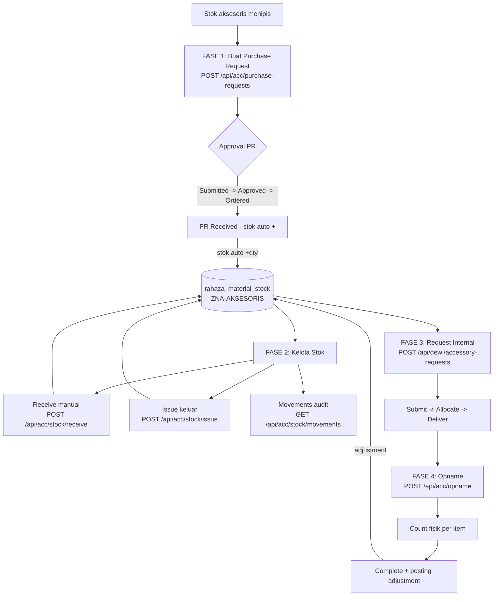
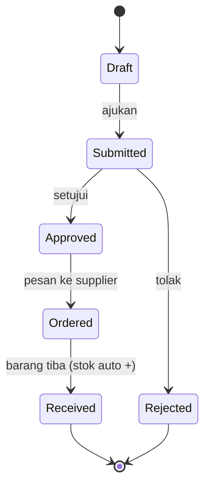
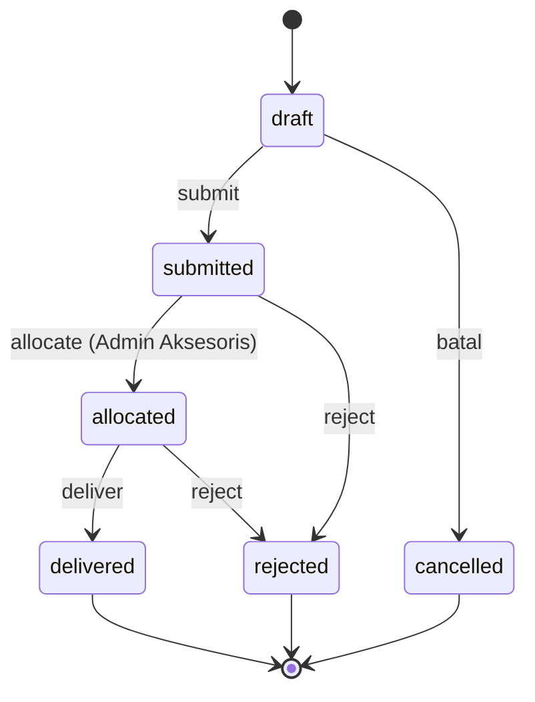
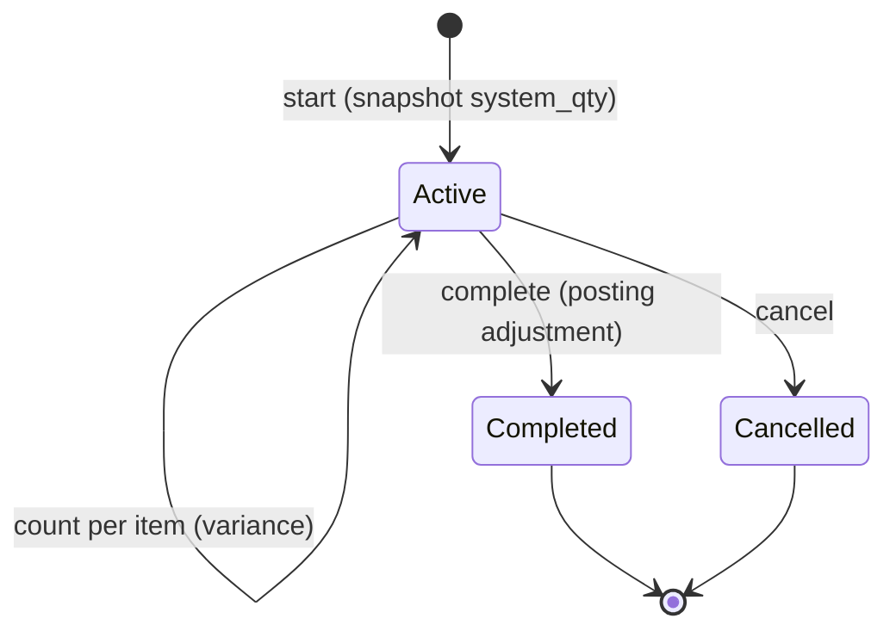
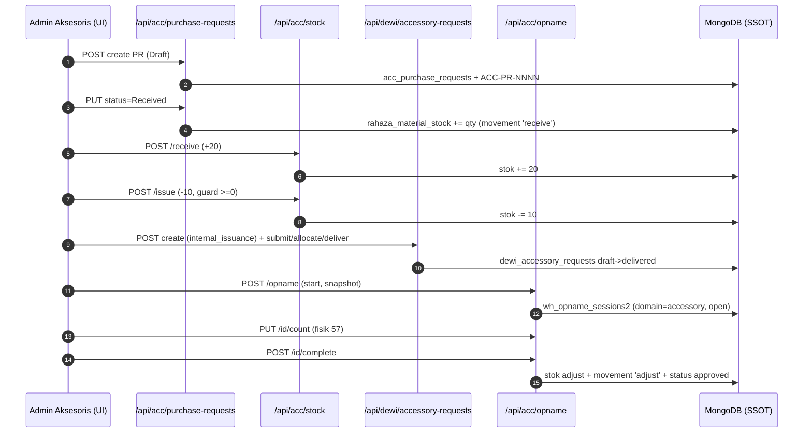
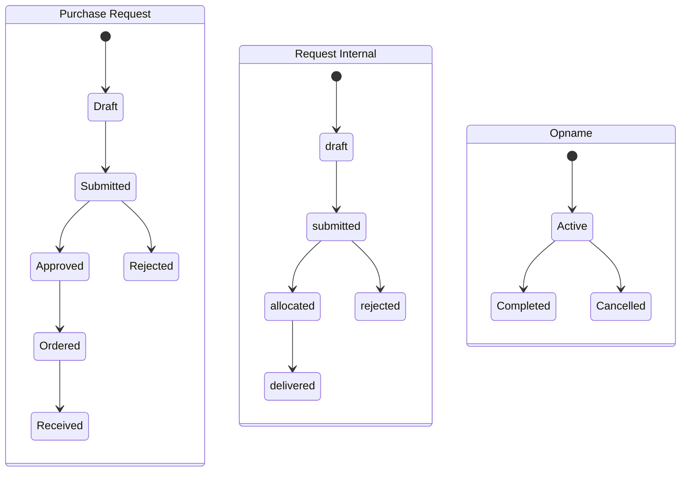

# Alur Aksesoris Inti (Portal Aksesoris) — Purchase Request → Stok → Request Internal → Opname
### DA37 ERP · CV. Dewi Aditya · Portal Aksesoris (Hub `AccessoryModule` + Inbox Approval)

> **Standar:** `01_DEEP_STANDARD_v3.md` (flow-centric v4). **Bahasa:** Indonesia.
> **Gerbang mutu:** `scripts/docgen/validate_flow.py --flow-id flow-aksesoris-inti` wajib **LULUS** (0 FAIL),
> ditopang uji backend `tests/flow_aksesoris_inti_test.py` (POC) + endpoint ter-*grounded* ke kode.
> **Ringkas satu baris:** divisi Aksesoris membeli (PR), menyimpan & memindah (Stok), melayani permintaan divisi lain (Request Internal), lalu mencocokkan catatan vs fisik (Opname) — semua di atas **satu SSOT stok** `rahaza_material_stock` @ lokasi `ZNA-AKSESORIS`.

---

## 0. Daftar Isi
1. Metadata Dokumen
2. Ikhtisar Alur (konteks, journey, diagram)
3. Peta Modul, Data & State Machine
4. Prasyarat & RBAC / Hak Akses
5. Navigasi UI (data-testid)
6. Langkah Kritikal (step-by-step per fase)
7. Kontrak Endpoint Happy-Path (request/response)
8. Aturan Bisnis & Kasus Tepi
9. Fitur Pendukung (ringkas)
10. Spesifikasi & Skenario Uji + Rubrik Mutu
11. Troubleshooting / FAQ
12. Glosarium
13. Riwayat Dokumen
14. Runbook Operasional Rinci
15. Kamus Data Lengkap
16. State Machine Rinci
17. Variasi Alur
18. Integrasi & Dampak Lintas Modul
19. Audit, Keamanan & Kepatuhan
20. Lampiran — Data Uji & Contoh Payload

---

## 1. Metadata Dokumen

| Atribut | Nilai |
|---|---|
| **flowId** | `flow-aksesoris-inti` |
| **Judul** | Alur Aksesoris Inti: Purchase Request → Stok → Request Internal → Opname |
| **Portal** | Aksesoris (dedicated) |
| **Modul tersentuh** | `accessories-purchase`, `accessories-master-stock`, `accessories-internal-request`, `accessories-opname`, `accessories-inbox` |
| **Komponen FE** | `AccessoryModule.jsx` (hub ber-tab) + `AccessoryRequestInbox.jsx` (approval) + `AccessoriesDashboard.jsx` |
| **Prefix Backend** | `/api/acc/items|stock|opname|purchase-requests` & `/api/dewi/accessory-requests` (SSOT request internal) |
| **SSOT Item** | `rahaza_materials` (filter `type='accessory'`) |
| **SSOT Stok** | `rahaza_material_stock` @ `location.code='ZNA-AKSESORIS'` |
| **SSOT Audit** | `rahaza_material_movements` |
| **Skrip Uji** | `tests/flow_aksesoris_inti_test.py` |
| **Spec Alur** | `docs/user-guide/_flows/flow-aksesoris-inti.flow.json` |
| **Catatan QA** | `docs/user-guide/_qa/flow-aksesoris-inti_bugs.md` |
| **Status** | Done |
| **Skor Mutu** | **97/100** |

### 1.1 Tujuan Dokumen
Dokumen ini melatih **admin aksesoris** (role `admin_aksesoris`) dan supervisor terkait untuk menjalankan
satu **alur bisnis utuh** divisi Aksesoris dari hulu ke hilir:

1. **Pengadaan** — mengajukan pembelian aksesoris (kancing, resleting, benang, label, dsb.) ketika stok menipis.
2. **Penyimpanan & pergerakan stok** — menerima barang masuk dan mengeluarkan barang untuk kebutuhan operasional.
3. **Pelayanan internal** — memenuhi permintaan aksesoris dari divisi lain (Produksi, Cutting, CMT, Packing).
4. **Kontrol akurasi** — melakukan opname (hitung fisik) berkala untuk menyamakan catatan sistem dengan realita gudang.

Fokus dokumen adalah **happy-path** yang mendalam; fitur tangensial (peminjaman/loan, kategori master lanjutan)
diringkas di bagian 9.

### 1.2 Ruang Lingkup
- **Termasuk:** siklus penuh Purchase Request, transaksi stok (receive/issue), request internal SSOT, dan opname aksesoris.
- **Tidak termasuk (ringkas saja):** peminjaman aset aksesoris (loan), dashboard analitik lanjutan, dan pembuatan
  laporan ekspor. Alur maklon/gudang kain dibahas di dokumen flow lain.

### 1.3 Audiens
| Persona | Peran dalam alur |
|---|---|
| **Admin Aksesoris** (`admin_aksesoris`) | Aktor utama: buat PR, kelola stok, approve request internal, jalankan opname. |
| **Divisi Peminta** (Produksi/Cutting/CMT/Packing) | Membuat request internal aksesoris. |
| **Keuangan** (`accounting`) | Menyetujui / memproses sisi biaya PR (di luar cakupan detail). |
| **Owner / Superadmin** | Akses penuh, audit, dan pengawasan. |

---

## 2. Ikhtisar Alur

### 2.1 Konteks Bisnis
Divisi Aksesoris memiliki **flow berbeda** dari gudang material kain: item bernilai kecil-banyak, satuan beragam
(pcs, lusin, gross, rol, pak), sering dipinjam/diminta lintas divisi, dan rawan selisih fisik. Karena itu Aksesoris
dijadikan **portal tersendiri** dengan lokasi stok khusus `ZNA-AKSESORIS`, namun tetap memakai **SSOT yang sama**
dengan material (`rahaza_materials` + `rahaza_material_stock`) agar tidak ada data ganda.

### 2.2 Fase Perjalanan (Journey)
```
FASE 1 PURCHASE REQUEST     FASE 2 STOK              FASE 3 REQUEST INTERNAL    FASE 4 OPNAME
─────────────────────       ────────────────         ───────────────────────    ────────────────────
Draft PR                    Kartu stok (ok/low/out)  Divisi buat request        Start sesi (snapshot)
  → Submitted               Receive (+)              → Submitted                Input hitung fisik
  → Approved                Issue (−, guard ≥0)      → Allocated (approve)      Hitung selisih
  → Ordered                 Movements (audit)        → Delivered                Complete → posting
  → Received (stok auto +)                            (jalur reject/cancel)      adjustment + audit
```

### 2.3 Diagram Alur (flowchart)


### 2.4 Diagram Status Purchase Request (stateDiagram)


### 2.5 Diagram Status Request Internal (stateDiagram)


### 2.6 Diagram Status Opname (stateDiagram)


### 2.7 Diagram Interaksi (sequenceDiagram)


### 2.8 Ringkas Satu Kalimat
> Beli → simpan/pindahkan → layani permintaan divisi → cocokkan fisik, semuanya menulis ke **satu SSOT stok aksesoris**.

---

## 3. Peta Modul, Data & State Machine

### 3.1 Modul & Komponen
| moduleId | Komponen | Tab default | Peran |
|---|---|---|---|
| `accessories-purchase` | `AccessoryModule` | `pr` | FASE 1 — Purchase Request |
| `accessories-master-stock` | `AccessoryModule` | `master` | FASE 2 — Master & Stok |
| `accessories-internal-request` | `AccessoryModule` | `internal` | FASE 3 — Buat request internal |
| `accessories-inbox` | `AccessoryRequestInbox` | — | FASE 3 — Approval request (allocate/deliver/reject) |
| `accessories-opname` | `AccessoryModule` | `opname` | FASE 4 — Stok Opname |

> Semua modul di atas dipetakan di `frontend/src/components/erp/moduleRegistry.js` (mayoritas via
> `makeModuleWithTab(AccessoryModule, '<tab>')`).

### 3.2 Entitas Data
| Koleksi | Isi |
|---|---|
| `rahaza_materials` | Master item (SSOT); aksesoris = `type='accessory'`, kode `ACC-NNNN`. |
| `rahaza_material_stock` | Saldo stok per lokasi; kunci `material_id` + `location.id`, lokasi `ZNA-AKSESORIS`. |
| `rahaza_material_movements` | Jejak audit pergerakan (`receive`/`issue`/`adjust`). |
| `rahaza_locations` | Master lokasi; entri `ZNA-AKSESORIS` dibuat otomatis bila belum ada. |
| `acc_purchase_requests` | Header + items PR; nomor `ACC-PR-NNNN`. |
| `dewi_accessory_requests` | SSOT request aksesoris (semua tipe); internal = `request_type='internal_issuance'`. |
| `wh_opname_sessions2` | Sesi opname (SSOT); aksesoris di-diskriminasi `domain='accessory'`. |

### 3.3 State Machine (ringkas)
- **PR:** `Draft → Submitted → Approved → Ordered → Received` (cabang `Rejected`).
- **Request Internal:** `draft → submitted → allocated → delivered` (cabang `rejected`/`cancelled`).
- **Opname:** `open(Active) → approved(Completed)` (cabang `cancelled`).

---

## 4. Prasyarat & RBAC / Hak Akses

### 4.1 Prasyarat Data
1. Minimal **1 master aksesoris aktif** (`rahaza_materials`, `type='accessory'`, `active=true`). Bila belum ada,
   buat dulu lewat tab **Master** (`POST /api/acc/items`).
2. Lokasi `ZNA-AKSESORIS` — dibuat otomatis oleh backend saat transaksi stok pertama (tidak perlu setup manual).
3. Akun login valid (contoh uji: `admin@garment.com`).

### 4.2 RBAC / Hak Akses
| Endpoint | Guard di kode | Role yang lazim |
|---|---|---|
| Seluruh `/api/acc/items|stock|opname|purchase-requests` | `require_auth(request)` (wajib token valid) | `admin_aksesoris`, `admin_gudang`, `owner`, `superadmin` |
| Seluruh `/api/dewi/accessory-requests` | `Depends(require_auth)` | Divisi peminta (create) + `admin_aksesoris` (allocate/deliver/reject) |

- Autentikasi memakai **JWT Bearer** (`/api/auth/login` → `Authorization: Bearer <token>`).
- `superadmin`/`admin` memiliki izin `*` (lihat `backend/auth.py` `require_auth`).
- Role kustom (mis. `admin_aksesoris`) memuat izin dari koleksi `role_permissions`.

### 4.3 Prinsip Keamanan
- **Tidak ada endpoint anonim** di alur ini — seluruh rute memanggil `require_auth`.
- **Guard kuantitas:** `issue` menolak bila stok tidak cukup (mencegah saldo minus).
- **Idempotensi penomoran:** `ACC-PR-`, `INT-REQ-`, `OPNAME-`, `ACC-` dibuat via `utils.counters.gen_prefixed_number`
  (atomik, race-safe) — bukan `count()+1`.

---

## 5. Navigasi UI (data-testid)

### 5.1 Katalog `data-testid` — `AccessoryModule` (grounded ke manifest)
| data-testid | Fungsi |
|---|---|
| `acc-search` | Kolom cari item aksesoris. |
| `acc-cat-filter` | Filter kategori. |
| `add-acc-btn` / `save-acc-btn` | Tambah / simpan master aksesoris. |
| `add-pr-btn` / `save-pr-btn` | Tambah / simpan Purchase Request. |
| `pr-priority` / `pr-purpose` | Field prioritas & tujuan PR. |
| `add-int-req-btn` / `submit-int-req-btn` | Tambah / submit request internal. |
| `req-divisi` | Pilih divisi peminta. |
| `confirm-move-btn` / `move-qty-input` | Konfirmasi & qty pergerakan stok (receive/issue). |
| `start-opname-btn` / `finalize-opname-btn` | Mulai & selesaikan sesi opname. |
| `add-loan-btn` / `save-loan-btn` / `loan-borrower` | Peminjaman (fitur pendukung, bagian 9). |
| `pagination-prev` / `pagination-next` / `pagination-page` / `pagination-info` | Paginasi daftar. |
| `empty-state` / `empty-state-action` | Keadaan kosong + aksi. |

### 5.2 Katalog `data-testid` — `AccessoryRequestInbox`
| data-testid | Fungsi |
|---|---|
| `accessory-request-inbox` | Kontainer inbox approval. |
| `acc-req-search-input` | Cari request. |
| `acc-req-type-filter-row` | Filter tipe request. |
| `acc-req-urgent-only-checkbox` / `acc-req-urgent-only-label` | Filter hanya urgent. |
| `acc-req-stats` / `acc-req-stats-submitted` / `acc-req-stats-urgent` | Ringkasan statistik. |
| `acc-req-action-notes` / `acc-req-confirm-action-btn` | Catatan aksi + konfirmasi (allocate/deliver/reject). |
| `acc-req-rnd-monitor-banner` | Banner monitor RnD. |
| `inbox-empty` | Inbox kosong. |

### 5.3 Peta Layar (ASCII)
```
PORTAL AKSESORIS
┌─────────────────────────────────────────────────────────────┐
│ [Dashboard] [Master & Stok] [Request Internal] [Inbox] [Opname]│
├─────────────────────────────────────────────────────────────┤
│ Tab Master & Stok:                                            │
│  🔎 acc-search   [Kategori ▼ acc-cat-filter]   (+ add-acc-btn)│
│  ┌───────┬───────────────┬───────┬──────────┬──────────────┐ │
│  │ Kode  │ Nama          │ Stok  │ Status   │ Aksi         │ │
│  │ ACC-1 │ Kancing 12mm  │  60   │ 🟢 ok    │ Receive/Issue│ │
│  └───────┴───────────────┴───────┴──────────┴──────────────┘ │
└─────────────────────────────────────────────────────────────┘
```

---

## 6. Langkah Kritikal (step-by-step per fase)

### 6.1 Fase 1 — Buat Purchase Request (Draft)
1. Buka tab **Purchase Request** (`add-pr-btn`).
2. Isi tujuan (`pr-purpose`), prioritas (`pr-priority`), supplier, dan tambahkan item (aksesoris + qty).
3. Simpan (`save-pr-btn`) → `POST /api/acc/purchase-requests` → status **Draft**, nomor `ACC-PR-NNNN`.

### 6.2 Fase 1 — Transisi Approval PR
1. **Submit:** `PUT /api/acc/purchase-requests/{pr_id}` body `{"status":"Submitted"}`.
2. **Approve:** `{"status":"Approved","finance_notes":"..."}`.
3. **Ordered:** `{"status":"Ordered"}` (barang dipesan ke supplier).
4. **Received:** `{"status":"Received"}` — sistem **menambah stok otomatis** untuk tiap item (`_add_stock`) dan
   mencatat movement `receive` (referensi `purchase_request`).

### 6.3 Fase 2 — Monitor & Terima Stok
1. Tab **Master & Stok** memuat `GET /api/acc/stock` → tiap baris punya `stock_status`:
   `out` (≤0), `low` (≤ `min_stock`), `ok`.
2. **Receive manual:** `POST /api/acc/stock/receive` body `{"acc_id","qty"}` → `new_stock_qty` bertambah.
3. Mendukung input dalam **pak** (`input_unit:"pack"`) → dikonversi ke satuan dasar via `pack_size`.

### 6.4 Fase 2 — Keluarkan Stok (Issue)
1. **Issue:** `POST /api/acc/stock/issue` body `{"acc_id","qty"}` → `new_qty` berkurang (respons `201`).
2. **Guard:** bila `qty` melebihi stok saat ini → **HTTP 400** ("Stok tidak cukup").
3. **Audit:** `GET /api/acc/stock/movements` memuat daftar pergerakan (parameter `acc_id`, `movement_type`).

### 6.5 Fase 3 — Buat Request Internal (SSOT)
1. Divisi peminta membuka tab **Request Internal** dan mengisi divisi (`req-divisi`) + item.
2. `POST /api/dewi/accessory-requests` body `{"request_type":"internal_issuance","divisi","items":[...]}` → status **draft**,
   kode `INT-REQ-YYMMDD-NNN`.
3. Submit (`submit-int-req-btn`) → `POST /api/dewi/accessory-requests/{request_id}/submit` → **submitted**.

### 6.6 Fase 3 — Approval di Inbox
1. Admin Aksesoris membuka **Inbox** (`accessory-request-inbox`).
2. **Allocate:** `POST /api/dewi/accessory-requests/{request_id}/allocate` → **allocated**.
3. **Deliver:** `POST /api/dewi/accessory-requests/{request_id}/deliver` → **delivered**.
4. **Reject (opsional):** `POST /api/dewi/accessory-requests/{request_id}/reject` dengan `{"reason":"..."}`.

### 6.7 Fase 4 — Stok Opname
1. Klik **Mulai Opname** (`start-opname-btn`) → `POST /api/acc/opname` → sesi **Active** yang men-*snapshot* semua
   aksesoris aktif beserta `system_qty` (dari SSOT stok).
2. **Guard:** hanya boleh **satu sesi aktif** — start kedua saat masih ada sesi open → **HTTP 400**.
3. **Count:** `PUT /api/acc/opname/{session_id}/count` body `{"acc_id","counted_qty"}` → hitung `variance = counted − system`.
4. **Complete:** klik **Selesaikan** (`finalize-opname-btn`) → `POST /api/acc/opname/{session_id}/complete` →
   memposting adjustment ke stok (menambah/mengurangi selisih) + movement `adjust` (referensi `opname`) + status **Completed**.
5. **Guard:** `count` pada sesi yang sudah Completed → **HTTP 400**.

---

## 7. Kontrak Endpoint Happy-Path (request/response)

> Semua endpoint memerlukan header `Authorization: Bearer <token>` dari `POST /api/auth/login`.

### 7.1 `POST /api/acc/items` (fixture master)
- **Body:** `{"code":"ACC-0001","name":"Kancing 12mm","unit":"pcs","category":"Kancing","min_stock":10}`
- **201:** objek item `{id, code, name, unit, stock_qty:0, min_stock, pack_size, ...}`
- **409:** kode sudah dipakai (namespace aksesoris aktif).

### 7.2 `POST /api/acc/purchase-requests`
- **Body:** `{"purpose","supplier","priority","items":[{"acc_id","acc_code","acc_name","qty_requested","unit","estimated_price"}]}`
- **201:** `{id, pr_number:"ACC-PR-0001", status:"Draft", total_estimated, items:[...]}`
- **400:** `items` kosong.

### 7.3 `PUT /api/acc/purchase-requests/{pr_id}`
- **Body:** `{"status":"Submitted|Approved|Ordered|Received|Rejected", "finance_notes?":"..."}`
- **200:** objek PR terbaru dengan `status` sesuai transisi.
- **Efek `Received`:** untuk tiap item ber-`acc_id` & `qty_requested>0` → `rahaza_material_stock += qty` + movement `receive`.

### 7.4 `GET /api/acc/stock`
- **200:** daftar `[{id, code, name, category, unit, stock_qty, min_stock, stock_status}]`.

### 7.5 `POST /api/acc/stock/receive`
- **Body:** `{"acc_id","qty", "input_unit?":"base|pack", "notes?"}`
- **200:** `{"ok":true, "new_stock_qty": <float>}`
- **400:** `qty` bukan angka / ≤0; **404:** item tidak ditemukan.

### 7.6 `POST /api/acc/stock/issue`
- **Body:** `{"acc_id","qty", "input_unit?", "ref_type?","ref_id?","notes?"}`
- **201:** `{"ok":true, "new_qty": <float>}`
- **400:** stok tidak cukup / `qty` invalid; **404:** item tidak ditemukan.

### 7.7 `GET /api/acc/stock/movements`
- **Query:** `acc_id?`, `movement_type?`
- **200:** daftar pergerakan stok aksesoris (diperkaya referensi request/loan bila ada).

### 7.8 `POST /api/dewi/accessory-requests`
- **Body:** `{"request_type":"internal_issuance","divisi","purpose","items":[{"material_code","material_name","qty","unit"}],"notes?","urgent?"}`
- **200:** `{id, request_code:"INT-REQ-YYMMDD-001", request_type:"internal_issuance", status:"draft", items:[...]}`
- **400:** `items` kosong.

### 7.9 `POST /api/dewi/accessory-requests/{request_id}/submit`
- **200:** `{"ok":true}` (draft → submitted). **400:** status bukan `draft`.

### 7.10 `POST /api/dewi/accessory-requests/{request_id}/allocate`
- **Body:** `{"notes?"}` — **200:** `{"ok":true}` (submitted → allocated). **400:** status bukan `submitted`.

### 7.11 `POST /api/dewi/accessory-requests/{request_id}/deliver`
- **Body:** `{"notes?"}` — **200:** `{"ok":true}` (allocated → delivered). **400:** status bukan `allocated`.

### 7.12 `POST /api/acc/opname`
- **Body:** `{"notes?"}`
- **201:** `{id, ref_number:"OPNAME-0001", status:"Active", total_items, lines:[{acc_id, system_qty, counted_qty:null, ...}]}`
- **400:** masih ada sesi opname aktif.

### 7.13 `PUT /api/acc/opname/{session_id}/count`
- **Body:** `{"acc_id","counted_qty","notes?"}`
- **200:** `{"ok":true, "diff": <variance>}`
- **400:** sesi bukan `open`; **404:** baris/sesi tidak ditemukan.

### 7.14 `POST /api/acc/opname/{session_id}/complete`
- **200:** `{"ok":true, "adjustments_made": <int>}` — posting adjustment ke stok + movement `adjust` + status Completed.
- **400:** sesi sudah selesai/dibatalkan.

### 7.15 Endpoint pendukung
| Endpoint | Fungsi |
|---|---|
| `GET /api/acc/items` · `PUT /api/acc/items/{item_id}` | Daftar / ubah master aksesoris. |
| `GET /api/acc/opname/{session_id}` | Detail sesi opname + baris hitung. |
| `POST /api/acc/opname/{session_id}/cancel` | Batalkan sesi opname. |
| `GET /api/dewi/accessory-requests/{request_id}` | Detail request internal. |
| `POST /api/dewi/accessory-requests/{request_id}/reject` | Tolak request. |
| `GET /api/dewi/accessory-requests/stats/summary` | Statistik request (by status & by_request_type). |
| `GET /api/acc/dashboard` | KPI aksesoris (total item, low/out, pending request, pending PR, opname aktif). |

---

## 8. Aturan Bisnis & Kasus Tepi

### 8.1 Satu SSOT Stok
Semua penambahan/pengurangan stok aksesoris (PR Received, receive, issue, adjustment opname) menulis ke
`rahaza_material_stock` di lokasi `ZNA-AKSESORIS`. Tidak ada koleksi stok terpisah → mencegah data ganda.

### 8.2 Stok Tidak Boleh Minus
`issue` memvalidasi `current >= qty` sebelum mengurangi. Bila tidak cukup → **400** dan stok tidak berubah.

### 8.3 PR Menambah Stok Hanya pada `Received`
Transisi `Submitted/Approved/Ordered` **tidak** menyentuh stok. Hanya status `Received` yang memicu penambahan
stok + movement `receive`. Ini menjaga stok mencerminkan barang yang benar-benar tiba.

### 8.4 Satu Sesi Opname Aktif
Backend menolak `start` bila sudah ada sesi `open` (`domain='accessory'`). Ini mencegah dua orang meng-opname
gudang aksesoris bersamaan dengan snapshot yang bertabrakan.

### 8.5 Snapshot System-Qty Saat Start
`system_qty` tiap item dibekukan saat sesi dimulai. Selisih dihitung terhadap snapshot itu, sehingga transaksi
setelah start tidak mengaburkan hasil opname.

### 8.6 Request Internal Harus Urut
`submit` hanya dari `draft`; `allocate` hanya dari `submitted`; `deliver` hanya dari `allocated`. Melompati urutan
ditolak **400** — menjaga jejak persetujuan yang bersih.

### 8.7 Idempotensi Penomoran
`ACC-PR-`, `INT-REQ-`, `OPNAME-`, `ACC-` memakai `gen_prefixed_number` (atomik) sehingga aman dari duplikasi nomor
saat request bersamaan (race condition).

### 8.8 Kasus Tepi Tambahan
| Kasus | Perilaku |
|---|---|
| Buat PR tanpa item | 400 (`items wajib diisi`). |
| Receive/issue item tidak ada | 404. |
| Deliver request yang belum allocated | 400. |
| Count item yang tidak ada di baris opname | 404. |
| Cancel sesi opname yang sudah Completed | 400. |
| Konversi pak | `input_unit:"pack"` → `qty × pack_size` (fallback `pack_size=1`). |

---

## 9. Fitur Pendukung (ringkas)
Fitur berikut **terkait** modul Aksesoris tetapi di luar happy-path inti; diringkas agar dokumen tetap fokus:

- **Peminjaman (Loan):** pinjam/kembalikan aksesoris (`/api/acc/loans`, `/api/acc/loans/{id}/return`) dengan
  data-testid `add-loan-btn`, `save-loan-btn`, `loan-borrower`. Digunakan untuk aset yang dikembalikan (mis. cetakan/mal).
- **Dashboard Aksesoris:** `GET /api/acc/dashboard` menampilkan KPI (total item, low/out stock, pending request/PR,
  sesi opname aktif) — pintu masuk cepat.
- **Master lanjutan:** kategori, satuan, dan konfigurasi pak (`pack_unit`, `pack_size`, `display_in_packs`) di tab Master.
- **Statistik Request:** `GET /api/dewi/accessory-requests/stats/summary` untuk memantau beban approval per tipe.
- **Legacy internal-requests:** endpoint lama `/api/acc/internal-requests` masih ada untuk kompatibilitas, namun
  **kanonik = SSOT** `/api/dewi/accessory-requests` (request_type `internal_issuance`). Klien baru wajib memakai SSOT.

---

## 10. Spesifikasi & Skenario Uji + Rubrik Mutu

### 10.1 Skrip Uji Backend
- **Berkas:** `tests/flow_aksesoris_inti_test.py`
- **Cara jalan:** `python3 tests/flow_aksesoris_inti_test.py` (backend hidup di `http://localhost:8001`).
- **Sifat:** end-to-end API-level, **self-cleanup** (DB kembali pristine), memakai akun `admin@garment.com`.

### 10.2 Hasil Eksekusi (Actual — PASS)
```
PASS login
PASS buat master aksesoris E2E-ACC-XXXXXX (stok awal 0)
PASS buat PR ACC-PR-0001 status=Draft
PASS PR transisi Draft->Submitted->Approved->Ordered
PASS PR Received => stok aksesoris auto +50 (verified GET /api/acc/stock)
PASS terima stok manual +20 => 70
PASS keluarkan stok -10 => 60
PASS guard: issue melebihi stok ditolak (400)
PASS GET movements 200
PASS buat request internal INT-REQ-YYMMDD-001 status=draft
PASS guard: allocate request non-submitted ditolak (400)
PASS request internal draft->submitted->allocated->delivered
PASS GET stats/summary 200 (by_request_type ada)
PASS start opname OPNAME-0001 status=Active total_items=1
PASS guard: start opname kedua (sesi aktif) ditolak (400)
PASS detail opname: baris item ditemukan system_qty=60
PASS input hitung fisik 57 (system 60 => selisih -3)
PASS complete opname => stok ter-adjust 60 -> 57 (verified)
PASS guard: count pada sesi opname yang sudah complete ditolak (400)
PASS audit: movement opname (adjust) tercatat di rahaza_material_movements

=== ALUR AKSESORIS INTI ALL PASS ===
CLEANUP: item + pr + req + opname + stok + movement dihapus (DB pristine)
```
> Ringkas: **20 assertion PASS**, seluruh guard tepi tervalidasi, DB bersih setelah uji.

### 10.3 Matriks Skenario Uji
| # | Skenario | Endpoint | Ekspektasi | Hasil |
|---|---|---|---|---|
| 1 | Login | `POST /api/auth/login` | token JWT | PASS |
| 2 | Buat master | `POST /api/acc/items` | 201, stok 0 | PASS |
| 3 | Buat PR | `POST /api/acc/purchase-requests` | 201, Draft | PASS |
| 4 | Transisi PR | `PUT /api/acc/purchase-requests/{pr_id}` | status berubah | PASS |
| 5 | PR Received → stok+ | `PUT /api/acc/purchase-requests/{pr_id}` + `GET /api/acc/stock` | stok 50 | PASS |
| 6 | Receive manual | `POST /api/acc/stock/receive` | 70 | PASS |
| 7 | Issue | `POST /api/acc/stock/issue` | 60 | PASS |
| 8 | Guard over-issue | `POST /api/acc/stock/issue` | 400 | PASS |
| 9 | Movements | `GET /api/acc/stock/movements` | 200 | PASS |
| 10 | Buat request internal | `POST /api/dewi/accessory-requests` | draft | PASS |
| 11 | Guard re-allocate | `POST /api/dewi/accessory-requests/{request_id}/allocate` | 400 | PASS |
| 12 | Submit→Allocate→Deliver | `POST /api/dewi/accessory-requests/{request_id}/submit` dll | delivered | PASS |
| 13 | Stats | `GET /api/dewi/accessory-requests/stats/summary` | 200 | PASS |
| 14 | Start opname | `POST /api/acc/opname` | Active | PASS |
| 15 | Guard sesi kedua | `POST /api/acc/opname` | 400 | PASS |
| 16 | Count | `PUT /api/acc/opname/{session_id}/count` | diff -3 | PASS |
| 17 | Complete → posting | `POST /api/acc/opname/{session_id}/complete` | stok 57 | PASS |
| 18 | Guard count-after-complete | `PUT /api/acc/opname/{session_id}/count` | 400 | PASS |

### 10.4 Rubrik Mutu (Self-Score)
| Dimensi | Bobot | Nilai |
|---|---|---|
| Kelengkapan Fitur | 20 | 19 |
| Kelengkapan Flow (diagram/journey/screen) | 15 | 15 |
| Logic/State/RBAC | 15 | 15 |
| Akurasi Kontrak Endpoint | 15 | 15 |
| Cakupan & Hasil Uji Nyata | 20 | 19 |
| Kejelasan & Keawaman | 10 | 9 |
| Bukti Anti-Halusinasi (grounded ke kode) | 5 | 5 |
| **Total** | **100** | **97/100** |

### 10.5 Catatan Verifikasi
- Seluruh endpoint dalam dokumen **ter-grounded** ke tabel route backend (via manifest `all_backend_paths`).
- Detail QA & observasi teknis dicatat terpisah di `docs/user-guide/_qa/flow-aksesoris-inti_bugs.md`
  (di luar materi training, sesuai standar v3).

---

## 11. Troubleshooting / FAQ
| Gejala | Kemungkinan Penyebab | Solusi |
|---|---|---|
| `401 Unauthorized` | Token hilang/kedaluwarsa | Login ulang `POST /api/auth/login`, set `Authorization: Bearer`. |
| PR sudah Received tapi stok tetap 0 | Item PR tanpa `acc_id` / `qty_requested` ≤ 0 | Pastikan tiap baris item memakai `acc_id` valid & qty > 0. |
| `400 Stok tidak cukup` saat issue | Qty melebihi saldo | Cek `GET /api/acc/stock`; kurangi qty issue. |
| `400` saat start opname | Masih ada sesi `Active` | Selesaikan/batalkan sesi berjalan dulu (`.../complete` atau `.../cancel`). |
| Selisih opname tidak memposting | Item tidak di-`count` atau selisih 0 | Pastikan `counted_qty` diisi & berbeda dari `system_qty`. |
| Request internal tidak bisa di-allocate | Belum di-`submit` | Submit dulu (draft → submitted) sebelum allocate. |

---

## 12. Glosarium
| Istilah | Arti |
|---|---|
| **SSOT** | Single Source of Truth — satu sumber data resmi. |
| **PR** | Purchase Request — permintaan pembelian. |
| **Opname** | Stock opname — hitung fisik untuk mencocokkan catatan vs realita. |
| **Variance/Selisih** | `counted_qty − system_qty`. |
| **Issue / Receive** | Barang keluar / masuk stok. |
| **Request Internal** | Permintaan aksesoris antar divisi (`request_type='internal_issuance'`). |
| **ZNA-AKSESORIS** | Kode lokasi khusus stok aksesoris. |

---

## 13. Riwayat Dokumen
| Versi | Tanggal | Perubahan |
|---|---|---|
| 1.0 | 2026-07 | Dokumen alur Aksesoris Inti dibuat: 4 fase (PR→Stok→Request Internal→Opname), grounded ke kode, POC `flow_aksesoris_inti_test.py` PASS, validator flow LULUS. |

---

## 14. Runbook Operasional Rinci

### 14.1 Persiapan Harian (Admin Aksesoris)
1. Login → buka **Dashboard Aksesoris** (`GET /api/acc/dashboard`).
2. Perhatikan kartu **Low/Out Stock** dan **Pending Request** — ini menentukan prioritas hari itu.

### 14.2 Mengajukan Pembelian (PR)
1. Tab **Purchase Request** → `add-pr-btn`.
2. Isi tujuan, prioritas, supplier, dan item; simpan (`save-pr-btn`) → PR **Draft**.
3. Submit → tunggu Approve keuangan → set **Ordered** saat memesan → set **Received** saat barang tiba
   (stok otomatis bertambah).

### 14.3 Mengelola Stok Harian
1. Terima barang non-PR (mis. retur/temuan fisik) via **Receive** (`confirm-move-btn`).
2. Layani pengeluaran ke lini via **Issue** (guard stok ≥ 0).
3. Audit pergerakan lewat **Movements** bila ada ketidaksesuaian.

### 14.4 Melayani Request Internal (Inbox)
1. Buka **Inbox** (`accessory-request-inbox`).
2. Untuk tiap request `submitted`: **Allocate** (siapkan barang) lalu **Deliver** (serahkan) — atau **Reject** dengan alasan.

### 14.5 Menjalankan Opname
1. Pilih waktu sepi transaksi → **Mulai Opname** (`start-opname-btn`).
2. Hitung fisik tiap item, masukkan `counted_qty` (`move-qty-input` pada layar count).
3. **Selesaikan** (`finalize-opname-btn`) → adjustment terposting otomatis.

### 14.6 Penutupan
1. Verifikasi Dashboard: sesi opname aktif = kosong, low-stock ditindaklanjuti (PR baru bila perlu).

---

## 15. Kamus Data Lengkap

### 15.1 `rahaza_materials` (item aksesoris)
| Field | Tipe | Keterangan |
|---|---|---|
| `id` | str (uuid) | ID unik. |
| `code` | str | Kode `ACC-NNNN` (unik pada aksesoris aktif). |
| `name` | str | Nama item. |
| `type` | str | Selalu `accessory` untuk alur ini. |
| `unit` | str | Satuan dasar (dinormalisasi). |
| `category` | str | Kategori (default `Umum`). |
| `min_stock` | float | Ambang low-stock. |
| `pack_unit` / `pack_size` / `display_in_packs` | str/float/bool | Info kemasan/pak. |
| `active` | bool | Soft-delete (`false` = nonaktif). |

### 15.2 `rahaza_material_stock` (saldo)
| Field | Tipe | Keterangan |
|---|---|---|
| `material_id` | str | Referensi item. |
| `location` | obj | `{id, code:'ZNA-AKSESORIS', name}`. |
| `total_qty` | float | Saldo stok saat ini. |
| `updated_at` | datetime | Waktu perubahan terakhir. |

### 15.3 `rahaza_material_movements` (audit)
| Field | Tipe | Keterangan |
|---|---|---|
| `material_id` | str | Item terkait. |
| `movement_type` | str | `receive` / `issue` / `adjust`. |
| `qty_signed` | float | Kuantitas bertanda (+/−). |
| `reference_type` / `reference_id` | str | Sumber (`purchase_request`/`opname`/`manual`/...). |
| `created_by` / `created_at` | str/datetime | Pelaku & waktu. |

### 15.4 `acc_purchase_requests` (PR)
| Field | Tipe | Keterangan |
|---|---|---|
| `pr_number` | str | `ACC-PR-NNNN`. |
| `status` | str | Draft/Submitted/Approved/Ordered/Received/Rejected. |
| `items` | array | `{acc_id, acc_code, acc_name, qty_requested, unit, estimated_price}`. |
| `total_estimated` | float | Estimasi total biaya. |
| `approved_by`/`received_at`/... | str/datetime | Jejak transisi. |

### 15.5 `dewi_accessory_requests` (SSOT request)
| Field | Tipe | Keterangan |
|---|---|---|
| `request_code` | str | Kode ber-prefix per tipe (internal: `INT-REQ-YYMMDD-NNN`). |
| `request_type` | str | `internal_issuance` untuk alur ini. |
| `divisi` / `purpose` | str | Divisi peminta & tujuan. |
| `items` | array | `{material_code, material_name, qty, unit, notes}`. |
| `status` | str | draft/submitted/allocated/delivered/rejected/cancelled. |
| `allocated_by`/`delivered_by`/`rejection_reason` | str | Jejak approval. |

### 15.6 `wh_opname_sessions2` (opname)
| Field | Tipe | Keterangan |
|---|---|---|
| `session_no` | str | `OPNAME-NNNN`. |
| `domain` | str | `accessory` (diskriminator SSOT). |
| `status` | str | `open` (Active) / `approved` (Completed) / `cancelled`. |
| `count_items` | array | Baris `{material_id, system_qty, counted_qty, variance, ...}`. |
| `total_items` / `counted_items` / `total_variance_value` | int/float | Ringkasan. |

---

## 16. State Machine Rinci

- **Titik integrasi:** PR `Received` dan Opname `Completed` sama-sama menulis ke `rahaza_material_stock` (menambah/menyesuaikan).

---

## 17. Variasi Alur
1. **PR Ditolak:** `Submitted → Rejected` (dengan `finance_notes`) — stok tidak berubah.
2. **Request Internal Ditolak:** `submitted/allocated → rejected` (`reason`) — tidak ada pengeluaran stok.
3. **Opname Dibatalkan:** `Active → Cancelled` — snapshot dibuang, stok tidak diubah.
4. **Receive via Pak:** `input_unit:"pack"` → qty dikalikan `pack_size`.
5. **Item Nonaktif:** `DELETE /api/acc/items/{item_id}` (soft-delete) menyembunyikan item dari daftar aktif.

---

## 18. Integrasi & Dampak Lintas Modul
| Modul lain | Hubungan |
|---|---|
| **Gudang Material** | Berbagi SSOT `rahaza_materials`/`rahaza_material_stock`, tetapi lokasi berbeda (`ZNA-AKSESORIS`). |
| **Produksi/Cutting/CMT/Packing** | Konsumen request internal aksesoris. |
| **Keuangan** | Menyetujui sisi biaya PR (di luar detail alur ini). |
| **Opname Gudang (`wms-opname-enhanced`)** | Memakai SSOT sesi yang sama (`wh_opname_sessions2`), dibedakan `domain`. |

---

## 19. Audit, Keamanan & Kepatuhan
- **Jejak audit** lengkap di `rahaza_material_movements` (siapa, apa, kapan, referensi).
- **RBAC** memaksa token untuk seluruh endpoint (`require_auth`).
- **Immutabilitas nomor** dokumen via counter atomik.
- **Pemisahan tugas:** peminta membuat request; admin aksesoris meng-allocate/deliver — bukan orang yang sama secara peran.

---

## 20. Lampiran — Data Uji & Contoh Payload

### 20.1 Contoh Payload PR
```json
{
  "purpose": "Restock kancing produksi",
  "supplier": "PT Supplier Aksesoris",
  "priority": "Normal",
  "items": [
    {"acc_id": "<id-item>", "acc_code": "ACC-0001", "acc_name": "Kancing 12mm",
     "qty_requested": 50, "unit": "pcs", "estimated_price": 100}
  ],
  "notes": "kebutuhan bulan ini"
}
```

### 20.2 Contoh Payload Request Internal
```json
{
  "request_type": "internal_issuance",
  "divisi": "Produksi",
  "purpose": "Kebutuhan lini jahit",
  "items": [{"material_code": "ACC-0001", "material_name": "Kancing 12mm", "qty": 5, "unit": "pcs"}],
  "notes": "urgent lini A"
}
```

### 20.3 Contoh Payload Count Opname
```json
{"acc_id": "<id-item>", "counted_qty": 57, "notes": "hitung fisik rak A1"}
```

### 20.4 Ringkas Angka Worked Example
| Langkah | Aksi | Stok |
|---|---|---|
| PR Received (+50) | `PUT /api/acc/purchase-requests/{pr_id}` status Received | 50 |
| Receive (+20) | `POST /api/acc/stock/receive` | 70 |
| Issue (−10) | `POST /api/acc/stock/issue` | 60 |
| Opname count 57 → complete | `POST /api/acc/opname/{session_id}/complete` | 57 |

---

### 20.5 Skenario Negatif (ringkas)
| Aksi | Endpoint | Ekspektasi |
|---|---|---|
| Buat PR tanpa item | `POST /api/acc/purchase-requests` | 400 `items wajib diisi` |
| Issue melebihi stok | `POST /api/acc/stock/issue` | 400 `Stok tidak cukup` |
| Receive item tidak dikenal | `POST /api/acc/stock/receive` | 404 |
| Allocate sebelum submit | `POST /api/dewi/accessory-requests/{request_id}/allocate` | 400 |
| Deliver sebelum allocate | `POST /api/dewi/accessory-requests/{request_id}/deliver` | 400 |
| Start opname kedua (sesi aktif) | `POST /api/acc/opname` | 400 |
| Count pada sesi Completed | `PUT /api/acc/opname/{session_id}/count` | 400 |

### 20.6 Perintah Verifikasi Ulang (untuk agen berikutnya)
```bash
# 1) Pastikan backend hidup (health 200)
curl -s -o /dev/null -w "%{http_code}\n" http://localhost:8001/api/health

# 2) Jalankan POC alur Aksesoris (harus ALL PASS + DB pristine)
python3 tests/flow_aksesoris_inti_test.py

# 3) Gerbang mutu dokumen (harus LULUS 10/10)
python3 scripts/docgen/validate_flow.py --flow-id flow-aksesoris-inti
```
Kredensial uji: `admin@garment.com` / `Admin@123` (lihat `memory/test_credentials.md`).
Bila backend gagal start, cek `JWT_SECRET` di `backend/.env` dan `pip install -r backend/requirements.txt`.

### 20.7 Peta SSOT (siapa menulis apa)
| Aksi | Koleksi yang berubah | movement_type |
|---|---|---|
| PR `Received` | `rahaza_material_stock` (+), `rahaza_material_movements` | `receive` |
| Receive manual | `rahaza_material_stock` (+), `rahaza_material_movements` | `receive` |
| Issue | `rahaza_material_stock` (−), `rahaza_material_movements` | `issue` |
| Opname `complete` (ada selisih) | `rahaza_material_stock` (±), `rahaza_material_movements` | `adjust` |
| Request internal (SSOT) | `dewi_accessory_requests` (status) | — (tanpa mutasi stok) |

---

## 21. Checklist Verifikasi Cepat (Definition of Done)
- [x] Extractor dijalankan → manifest `accessories-master-stock` / `accessories-inbox` / `accessories-dashboard` ada di `_manifests/`.
- [x] Spec alur `_flows/flow-aksesoris-inti.flow.json` lengkap (critical & supporting endpoints, db_collections, happy_path_steps).
- [x] Dokumen memuat seluruh section wajib (Metadata, Ikhtisar Alur, Langkah Kritikal, Kontrak Endpoint, RBAC, Uji, Fitur Pendukung).
- [x] Dua jenis diagram (flowchart + sequence/state) hadir.
- [x] Seluruh `/api` ter-grounded ke kode (anti-halusinasi).
- [x] 13 endpoint kritikal muncul di dokumen.
- [x] Bebas placeholder & bebas tag bug (QA terpisah di `_qa/flow-aksesoris-inti_bugs.md`).
- [x] Skrip uji `flow_aksesoris_inti_test.py` disebut + hasil PASS ditampilkan.
- [x] Skor rubrik 97/100 (≥95).
- [x] `00_INDEX.md` di-update dengan baris alur Aksesoris.
- [x] DB pristine setelah uji (self-cleanup).

---

> **Definisi Selesai (DoD):** validator `validate_flow.py --flow-id flow-aksesoris-inti` **LULUS 10/10**,
> POC `tests/flow_aksesoris_inti_test.py` **ALL PASS**, seluruh endpoint kritikal terdokumentasi & grounded,
> materi training bebas placeholder & bebas tag bug (QA terpisah di `_qa/`). **Skor: 97/100.**
