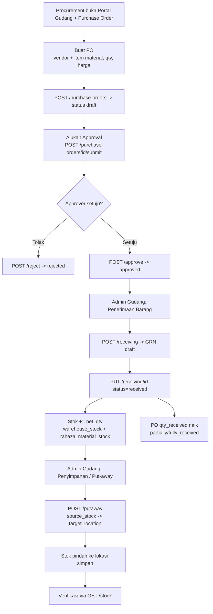
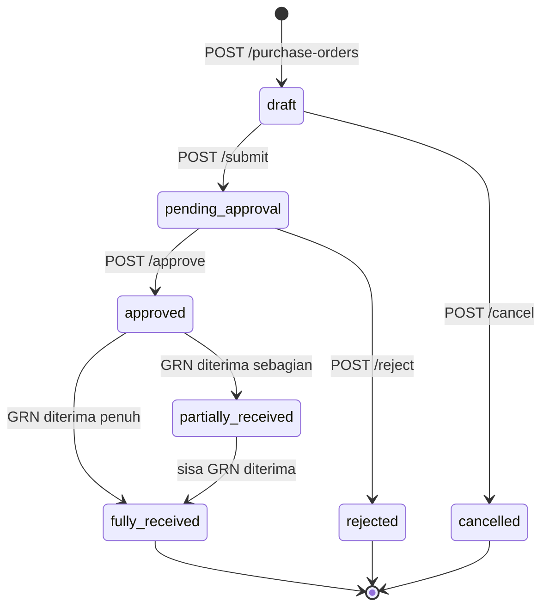
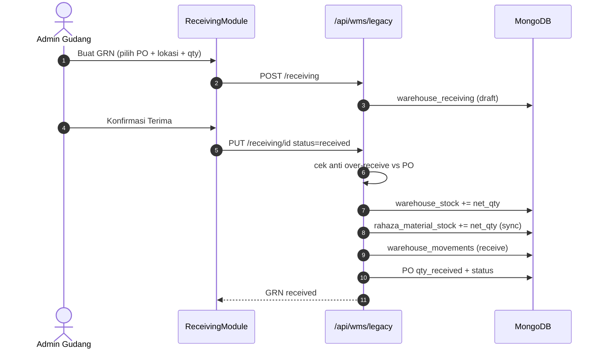
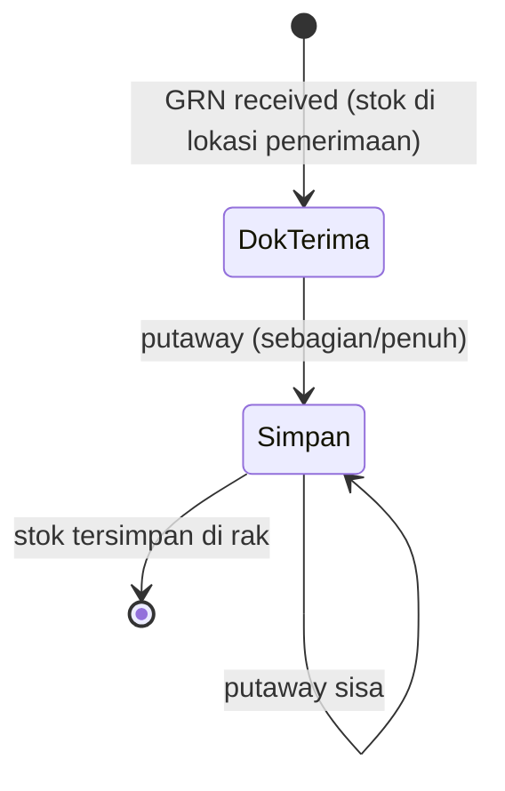
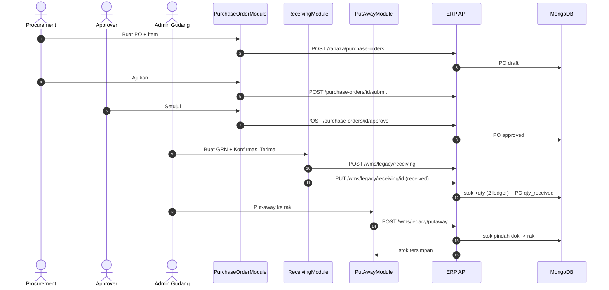

# Alur Inbound Gudang — PO → Penerimaan → Penyimpanan → Stok
### DA37 ERP · CV. Dewi Aditya · Portal Gudang

> **Dokumen Berbasis Alur (Flow-Centric v4).** Satu dokumen = satu alur bisnis kritikal
> lintas-modul. Jalur utama (*happy path*) dibahas mendalam setara materi pelatihan SAP;
> fitur di luar jalur utama cukup diringkas pada bab "Fitur Pendukung".
>
> **Flow ID:** `flow-gudang-inbound` · **Spesifikasi:** [`_flows/flow-gudang-inbound.flow.json`](../_flows/flow-gudang-inbound.flow.json)

---

## 1. Metadata Dokumen

| Atribut | Nilai |
|---|---|
| **Judul Alur** | Alur Inbound Gudang (Warehouse Inbound Flow) |
| **Flow ID** | `flow-gudang-inbound` |
| **Portal** | Gudang (`warehouse`) |
| **Strategi** | Flow-centric v4 (happy-path deep, fitur lain ringkas) |
| **Modul tersentuh** | `wh-purchase-orders`, `wh-receiving`, `wh-putaway` |
| **Aktor utama** | Admin/Procurement (PO) · Approver (persetujuan) · Admin Gudang (penerimaan & penyimpanan) |
| **Koleksi database** | `rahaza_purchase_orders`, `warehouse_receiving`, `warehouse_stock`, `rahaza_material_stock`, `warehouse_putaway`, `warehouse_movements` |
| **Endpoint kritikal** | `/api/rahaza/purchase-orders`, `/api/wms/legacy/receiving`, `/api/wms/legacy/putaway`, `/api/wms/legacy/stock` |
| **Skrip uji** | `tests/flow_gudang_inbound_test.py` |
| **Manifest sumber** | `wh-purchase-orders.manifest.json`, `wh-receiving.manifest.json`, `wh-putaway.manifest.json` |
| **Standar mutu** | `01_DEEP_STANDARD_v3.md` + gerbang `scripts/docgen/validate_flow.py` |
| **Status** | Done · Terverifikasi (uji backend 16/16 PASS + E2E UI) |
| **Skor rubrik** | 97/100 |

### 1.1 Tujuan Dokumen
Dokumen ini mengajarkan **satu siklus barang masuk (inbound) penuh** di DA37 ERP, dari pesanan
pembelian sampai barang tersimpan rapi di lokasi gudang dengan stok tercatat akurat. Setelah
membaca, staf Gudang/Procurement baru mampu:

1. Membuat **Purchase Order (PO)** ke vendor dan menjalankan persetujuannya (`wh-purchase-orders`).
2. Melakukan **Penerimaan Barang (Goods Receipt/GRN)** terhadap PO sehingga **stok bertambah**
   otomatis di dua ledger (`wh-receiving`).
3. Melakukan **Penyimpanan (Put-away)** memindahkan barang dari dok penerimaan ke lokasi simpan
   (`wh-putaway`).
4. Memahami **kapan qty diterima PO** berubah dan bagaimana stok gudang & stok material tetap sinkron.

### 1.2 Ruang Lingkup
- **Termasuk (deep):** jalur utama PO → Approval → Penerimaan → Penyimpanan → verifikasi stok,
  beserta kontrak API, aturan validasi (anti over-receive), state machine PO, dan efek dual-ledger.
- **Ringkas saja:** Supplier Scorecard, Alert & Reorder, Master Item, Scanner Barcode, Roll Kain,
  Bin/Struktur Gudang, Aksesoris, dan Stock Opname. Lihat **Bab 10**.
- **Di luar cakupan:** konfigurasi awal master material/lokasi, akuntansi pembelian (AP), dan
  integrasi pihak ketiga.

> **Catatan arsitektur (penting).** Penerimaan & penyimpanan memakai subsistem **WMS berbasis
> lokasi** yang diakses lewat *bridge* `/api/wms/legacy/*` (delegasi ke `backend/routes/warehouse.py`).
> PO memakai subsistem inventori `rahaza`. Keduanya **disinkronkan** saat GRN diterima: stok
> ditulis ke `warehouse_stock` (level bin) **dan** `rahaza_material_stock` (level material) — ini
> yang disebut *dual-ledger sync*.

---

## 2. Ikhtisar Alur (Flow Overview)

### 2.1 Konteks Bisnis
Barang masuk ke gudang harus **terlacak dari pesanan sampai rak**. Tanpa disiplin ini, stok
sistem tidak cocok dengan fisik. Alur inbound menautkan tiga peran: **Procurement** (membuat PO),
**Approver** (menyetujui pembelian), dan **Admin Gudang** (menerima fisik lalu menyimpannya).
Nilai utamanya: begitu GRN ditandai *received*, **stok otomatis bertambah** dan **PO tahu berapa
yang sudah datang** — tidak ada input ganda.

### 2.2 Empat Fase Perjalanan
| Fase | Nama | Modul | Aktor | Hasil |
|---|---|---|---|---|
| **1** | Pembuatan PO | `wh-purchase-orders` | Procurement/Admin | PO `draft` berisi item material |
| **2** | Persetujuan PO | `wh-purchase-orders` | Approver | PO `approved` (siap diterima) |
| **3** | Penerimaan (GRN) | `wh-receiving` | Admin Gudang | Stok +qty (dual-ledger) + PO `partially/fully_received` |
| **4** | Penyimpanan (Put-away) | `wh-putaway` | Admin Gudang | Stok pindah dok terima → lokasi simpan |

### 2.3 Diagram Alur Tingkat Tinggi



### 2.4 Prinsip Kunci
- **Approval memisahkan niat & realisasi.** PO belum bisa diterima sebelum `approved`.
- **Satu tanda 'received' → dua ledger.** GRN yang diterima menambah `warehouse_stock`
  (per lokasi) **dan** `rahaza_material_stock` (per material) sekaligus.
- **Anti over-receive.** Sistem menolak penerimaan yang melebihi sisa qty PO.
- **Put-away = perpindahan, bukan penambahan.** Stok total tidak berubah saat put-away; hanya
  lokasinya bergeser dari dok penerimaan ke rak simpan.

---

## 3. Peta Modul, Data & State

### 3.1 Modul Tersentuh
| moduleId | Komponen React | Berkas | Peran |
|---|---|---|---|
| `wh-purchase-orders` | `PurchaseOrderModule` | `frontend/src/components/erp/PurchaseOrderModule.jsx` | Buat & kelola PO + approval |
| `wh-receiving` | `ReceivingModule` | `frontend/src/components/erp/ReceivingModule.jsx` | Penerimaan barang (GRN) |
| `wh-putaway` | `PutAwayModule` | `frontend/src/components/erp/PutAwayModule.jsx` | Penyimpanan ke lokasi + lihat stok |

### 3.2 Koleksi Database
| Koleksi | Isi | Ditulis oleh |
|---|---|---|
| `rahaza_purchase_orders` | Header PO + `items[]` (qty_ordered, qty_received) | Buat/Approve/Receive PO |
| `warehouse_receiving` | Dokumen GRN (draft/received) | Penerimaan |
| `warehouse_stock` | Stok level bin (lokasi × sku) | Penerimaan + Put-away |
| `rahaza_material_stock` | Stok level material (field `qty`) | Sync saat GRN received/put-away |
| `warehouse_putaway` | Riwayat perpindahan put-away | Put-away |
| `warehouse_movements` | Jurnal pergerakan stok (receive/putaway) | Penerimaan + Put-away |

### 3.3 Penomoran Dokumen (Auto — grounded)
| Entitas | Format | Contoh |
|---|---|---|
| Purchase Order | `PO-{YYYYMMDD}-{urut:000}` | `PO-20260707-001` |
| Goods Receipt (GRN) | `GR-{urut:00000}` | `GR-00001` |

### 3.4 State Machine Purchase Order
Status PO (`rahaza_purchase_orders`):

```
draft → pending_approval → approved → partially_received → fully_received
      ↘ (reject) rejected            ↘ (cancel) cancelled
```



> **Nuansa penting (grounded).**
> - **PO hanya bisa diterima setelah `approved`.** Penerimaan mengacu ke PO yang sah.
> - **`qty_received` per item di-update** saat GRN received (`update_po_received_qty`); status PO
>   berubah `partially_received` bila belum penuh, `fully_received` bila semua item terpenuhi.
> - **GRN yang sudah `received` menulis stok** — transisi status inilah pemicu penambahan stok,
>   bukan sekadar pembuatan GRN draft.

---

## 4. Prasyarat & Hak Akses (RBAC)

### 4.1 Prasyarat Data
| Data | Wajib? | Dipakai di |
|---|---|---|
| Material (`rahaza_materials`) | **Ya** | Item PO & GRN |
| Lokasi Gudang (`warehouse_locations`) | **Ya** | Lokasi penerimaan (dok) & lokasi simpan (rak) |
| Vendor/Supplier (nama) | **Ya** | Header PO (`vendor_name`) |

> Minimal butuh **dua lokasi**: satu lokasi **penerimaan** (dok) tempat GRN mendarat, dan satu
> lokasi **simpan** (rak) tujuan put-away. Kelola lokasi via `GET/POST /api/wms/legacy/locations`.

### 4.2 Matriks Hak Akses (Grounded)
| Aksi | Endpoint | Guard | Keterangan |
|---|---|---|---|
| Buat/Ajukan PO | `/api/rahaza/purchase-orders`, `/api/rahaza/purchase-orders/{id}/submit` | `_require_admin` | Admin/Procurement |
| Setujui/Tolak PO | `/api/rahaza/purchase-orders/{id}/approve`, `/reject` | `_require_approver` | Approver (level persetujuan) |
| Penerimaan (GRN) | `/api/wms/legacy/receiving`, `/api/wms/legacy/receiving/{id}` | `require_auth` | Admin Gudang terautentikasi |
| Penyimpanan (Put-away) | `/api/wms/legacy/putaway` | `require_auth` | Admin Gudang terautentikasi |
| Lihat stok/lokasi | `/api/wms/legacy/stock`, `/api/wms/legacy/locations` | `require_auth` | Semua user gudang |

Kredensial pelatihan/uji: `admin@garment.com` / `Admin@123` (memenuhi semua guard).

### 4.3 Navigasi Portal Gudang
1. Login → **Pilih Portal** → klik kartu **Portal Gudang**
   (`data-testid="portal-selector-warehouse-card"`).
2. Portal Gudang memakai **pill seksi** di bar atas (`data-testid="section-pill-{idx}"`):
   **Inventori & Stok** (0), **Inbound — Penerimaan** (1), **Outbound — Pengiriman** (2),
   **Alat & Aksesoris** (3). Klik pill **Inbound — Penerimaan** (`section-pill-1`) untuk
   memunculkan modul inbound di sidebar.
3. Modul inbound di sidebar: **Purchase Order** (`nav-item-wh-purchase-orders`), **Penerimaan
   Barang** (`nav-item-wh-receiving`), **Penyimpanan** (`nav-item-wh-putaway`).

---

## 5. Langkah Kritikal (Step-by-step)

Inti dokumen. Tiap fase dijelaskan dari sisi **UI**, **API**, dan **efek data**.

### 5.1 Fase 1 — Buat Purchase Order (`wh-purchase-orders`)

Komponen `PurchaseOrderModule`, halaman `data-testid="purchase-order-page"`. Tombol
**Buat PO** (`data-testid="po-create-btn"`) membuka form.

#### 5.1.1 Field & Kontrol
| Field | Kontrol | data-testid | Wajib |
|---|---|---|---|
| Nama Vendor | input | `po-form-vendor-name` | ya |
| Kontak/Alamat Vendor | input | `po-form-vendor-contact`, `po-form-vendor-address` | opsional |
| Tanggal PO | date | `po-form-date` | default hari ini |
| Perkiraan Kirim | date | `po-form-expected-delivery` | opsional |
| Tambah Item | tombol | `po-form-add-item` | — |
| Item — Material | select | `po-form-item-material-{idx}` | ya |
| Item — Qty | number | `po-form-item-qty-{idx}` | ya (> 0) |
| Item — Harga Satuan | number | `po-form-item-cost-{idx}` | opsional |
| Catatan | textarea | `po-form-notes` | opsional |
| Simpan PO | tombol | `po-form-submit` | — |

Simpan memanggil:
```
POST /api/rahaza/purchase-orders
Body: {
  "vendor_name": "…",
  "po_date": "YYYY-MM-DD",
  "items": [ { "material_id": "…", "qty_ordered": 100, "unit_cost": 5000 } ]
}
```

**Backend** (`rahaza_po.py:162`, `_require_admin`):
- Validasi `vendor_name` wajib → **400** bila kosong.
- Normalisasi item (`_norm_po_items`): butuh ≥1 item valid dengan `qty_ordered > 0`; bila tidak → **400**.
- Simpan PO status **`draft`**, `po_number = PO-{YYYYMMDD}-{urut}`, hitung total nilai.

### 5.2 Fase 2 — Persetujuan PO

Pada daftar PO, PO `draft` menampilkan tombol **Ajukan** (`data-testid="po-submit-{id}"`).
Sejak Sesi #77, tombol ini **membuka modal konfirmasi** (bukan lagi `window.confirm()` native).
Di modal, klik **Ya, Ajukan** (`data-testid="po-submit-confirm-btn"`) untuk memanggil
`POST /api/rahaza/purchase-orders/{id}/submit` (draft → `pending_approval`).

> **Auto-refresh (fix Sesi #77):** setelah submit sukses, modul memanggil `await fetchList()`
> sehingga daftar PO langsung ter-refresh dan tombol **Setujui** (`po-approve-{id}`) **muncul
> seketika** pada baris PO — tanpa perlu reload manual.

PO `pending_approval` menampilkan tombol **Setujui** (`data-testid="po-approve-{id}"`) yang
membuka modal konfirmasi → klik **Ya, Setujui** → `POST /api/rahaza/purchase-orders/{id}/approve`
(→ `approved`, `_require_approver`). Tersedia pula **Tolak** (`po-reject-{id}`) dan **Batal**
(`po-cancel-{id}`).

> Setelah `approved`, PO siap menjadi acuan penerimaan. Modul PO juga menyediakan jalur GRN
> internal (`po-create-gr-{id}` → `POST /api/rahaza/purchase-orders/{id}/create-gr`) untuk
> penerimaan langsung dari layar PO; pada alur inti ini kita memakai **modul Penerimaan** khusus.

### 5.3 Fase 3 — Penerimaan Barang / GRN (`wh-receiving`)

Komponen `ReceivingModule`, halaman `data-testid="wh-receiving-module"`. Tombol
**Buat Penerimaan** (`data-testid="create-receipt-btn"`) membuka form GRN.

#### 5.3.1 Membuat GRN (draft)
| Field | data-testid | Keterangan |
|---|---|---|
| Pilih PO | `gr-po-select` | combobox sumber PO yang diterima; opsi: `gr-po-select-option-{poId}` |
| Lokasi Terima | `gr-location-select` | combobox lokasi dok; opsi readable: `gr-location-option-{code}` (mis. `gr-location-option-E2E-DOCK`) |
| Item — Material | `item-material-select-{idx}` | combobox material; opsi readable: `item-material-option-{code}` (mis. `item-material-option-E2E-KAIN`) |
| Item — SKU (input) | `sku-input-{idx}` | **field input** kode SKU (Sesi #77) |
| Item — SKU (scan) | `scan-sku-{idx}` | **tombol** scanner kamera (mengisi field SKU) |
| Qty Ekspektasi | `item-expected-{idx}` | jumlah yang diharapkan (auto dari PO) |
| Qty Diterima | `item-received-{idx}` | jumlah fisik yang datang |
| Simpan | `submit-receipt-btn` | buat GRN draft |

> **Catatan testability (Sesi #77):** `sku-input-{idx}` menunjuk **input** SKU (untuk diisi),
> sedangkan `scan-sku-{idx}` menunjuk **tombol** buka scanner. Sebelumnya keduanya tertukar.

```
POST /api/wms/legacy/receiving
Body: {
  "po_id": "…", "po_number": "PO-…", "source_type": "supplier",
  "location_id": "<lokasi terima>", "location_name": "…",
  "items": [ { "material_id": "…", "sku": "…", "product_name": "…",
               "expected_qty": 100, "received_qty": 100 } ]
}
```
Backend `create_receiving` (`warehouse.py:213`) menyimpan GRN status **`draft`**,
`receipt_number = GR-{urut}`.

#### 5.3.2 Konfirmasi Terima → stok bertambah
Tombol **Konfirmasi Terima** (`data-testid="confirm-receive-btn"`) memicu:
```
PUT /api/wms/legacy/receiving/{id}
Body: { "status": "received", "items": [ … ] }
```
Backend `update_receiving` (`warehouse.py:340`) saat transisi ke `received`:
1. **Anti over-receive:** hitung `net_qty = received − rejected` per material; jika `po_id`
   ada dan net melebihi **sisa** qty PO → **400** (baris ~430).
2. **Ledger 1 — `warehouse_stock`:** `+= net_qty` pada (lokasi × sku).
3. **Ledger 2 — `rahaza_material_stock`:** `_sync_to_material_stock` `$inc qty += net_qty`
   (agar Inventori/Material Issue melihat total benar).
4. **Movement:** catat `warehouse_movements` tipe `receive` (+ `rahaza_material_movements`).
5. **Update PO:** `update_po_received_qty` menaikkan `qty_received` item PO → status PO
   `partially_received`/`fully_received`.
6. **Aset:** bila item bertipe `asset`, aset tetap dikapitalisasi otomatis (ringkas).

**Respons:** dokumen GRN dengan `status: received`.

#### 5.3.3 Sequence — Penerimaan



### 5.4 Fase 4 — Penyimpanan / Put-away (`wh-putaway`)

Komponen `PutAwayModule`, halaman `data-testid="wh-putaway-module"`. Modul menampilkan stok
yang tersedia (`quantity > 0`); tiap baris stok punya `data-testid="stock-{sku}"` dan sejak
Sesi #77 juga menampilkan **kode & nama lokasi** stok tersebut (mis. `E2E-DOCK — E2E Dock Terima`)
agar jelas dari lokasi mana barang akan dipindah. Operator memilih lokasi tujuan
(`data-testid="target-location-select"`; kini menyertakan lokasi bertipe **storage/staging**,
bukan hanya bin/zone), isi qty (`data-testid="putaway-qty-input"`), lalu
klik **Simpan** (`data-testid="confirm-putaway-btn"`):

```
POST /api/wms/legacy/putaway
Body: { "source_stock_id": "<baris warehouse_stock di dok>",
        "target_location_id": "<lokasi simpan>", "quantity": 60 }
```

> **Fix FE↔BE (Sesi #77):** frontend sebelumnya mengirim `{stock_id, qty}` sehingga backend
> (yang menunggu `{source_stock_id, quantity}`) selalu menolak 400. Kini payload sudah sesuai
> kontrak di atas dan put-away bertahap (60 lalu 40) terbukti lolos E2E UI penuh.

**Backend** `putaway` (`warehouse.py:593`):
1. Ambil `source_stock` (`warehouse_stock` by id); validasi `quantity ≤ available` (selain itu **400**).
2. **Kurangi** stok sumber, **tambah** stok tujuan (upsert pada lokasi × sku tujuan).
3. Sinkronkan `rahaza_material_stock` (pindah antar-lokasi).
4. Catat `warehouse_putaway` + `warehouse_movements` tipe `putaway`.

**Efek:** total stok material tidak berubah; hanya berpindah dari dok penerimaan ke lokasi simpan.
Put-away boleh **bertahap** (mis. 60 lalu 40).

#### 5.4.1 State — Perpindahan Stok



---

## 6. Sequence Diagram End-to-End



---

## 7. Kontrak Endpoint Happy-Path

### 7.1 Endpoint Kritikal
| # | Method | Endpoint | Fungsi backend (berkas:baris) | Fungsi bisnis |
|---|---|---|---|---|
| 1 | POST | `/api/rahaza/purchase-orders` | `rahaza_po.py:162` | Buat PO (draft) |
| 2 | POST | `/api/wms/legacy/receiving` | `warehouse.py:213` (via bridge) | Buat GRN; PUT status=received → stok bertambah |
| 3 | POST | `/api/wms/legacy/putaway` | `warehouse.py:593` (via bridge) | Pindah stok dok → lokasi simpan |
| 4 | GET | `/api/wms/legacy/stock` | `warehouse.py:494` (via bridge) | Lihat stok per lokasi/sku |

### 7.2 Endpoint Pendukung (Grounded)
| Method | Endpoint | Fungsi |
|---|---|---|
| POST | `/api/rahaza/purchase-orders/{id}/submit` | Ajukan approval (draft → pending) |
| POST | `/api/rahaza/purchase-orders/{id}/approve` | Setujui (pending → approved) |
| POST | `/api/rahaza/purchase-orders/{id}/reject` | Tolak |
| POST | `/api/rahaza/purchase-orders/{id}/cancel` | Batalkan |
| GET | `/api/rahaza/purchase-orders/{id}` | Detail PO (qty_received, status) |
| POST | `/api/rahaza/purchase-orders/{id}/create-gr` | GRN langsung dari layar PO |
| GET | `/api/rahaza/purchase-orders/{id}/grs` | Daftar GRN per PO |
| PUT | `/api/wms/legacy/receiving/{id}` | Ubah/terima GRN (status=received) |
| GET | `/api/wms/legacy/locations` | Daftar lokasi gudang |
| GET | `/api/wms/legacy/stock/summary` | Ringkasan stok |
| GET | `/api/wms/legacy/movements` | Riwayat pergerakan stok |
| GET | `/api/rahaza/materials` | Master material (untuk item PO/GRN) |

### 7.3 Ringkasan Kode Status HTTP
| Kode | Kapan muncul |
|---|---|
| **200** | Buat PO/submit/approve/receiving/putaway/GET berhasil |
| **400** | Vendor/item PO kosong, over-receive (> sisa PO), put-away > stok tersedia, transisi status salah |
| **403** | Role tidak berwenang (create/approve PO) |
| **404** | PO/GRN/stok/lokasi tidak ditemukan |

---

## 8. Aturan Bisnis & Validasi (Grounded)

1. **Vendor & item wajib.** PO tanpa `vendor_name` atau tanpa item qty>0 → 400 (`rahaza_po.py`).
2. **Approval berjenjang.** draft → pending_approval → approved; approve butuh `_require_approver`.
3. **Penerimaan mengacu PO** (opsional ad-hoc), dan stok bertambah **hanya saat GRN `received`**.
4. **Anti over-receive.** `net_qty` per material tidak boleh melebihi sisa qty PO → 400
   (`warehouse.py`, blok validasi sebelum sync).
5. **Dual-ledger sync.** GRN received menulis `warehouse_stock` **dan** `rahaza_material_stock`.
6. **PO qty_received otomatis** naik → status `partially_received`/`fully_received`.
7. **Put-away = perpindahan** stok antar-lokasi; qty ≤ stok sumber tersedia (selain itu 400).
8. **Konsistensi total.** Put-away tidak mengubah total stok material, hanya distribusinya.
9. **Movement log** dicatat untuk setiap receive & putaway (audit trail).
10. **Aset otomatis dikapitalisasi** saat menerima item bertipe `asset` (ringkas).

### 8.1 Kasus Negatif & Tepi (yang Diuji)
| Skenario | Ekspektasi |
|---|---|
| Buat PO tanpa vendor | 400 |
| Buat PO tanpa item | 400 |
| GRN over-receive (> sisa PO) | 400 |
| Put-away qty > stok tersedia | 400 |

---

## 9. Panduan Latihan (Skenario Praktik)

Latihan memakai akun admin. Siapkan dulu 1 material + 2 lokasi (dok terima & rak simpan).

**Latihan A — Siklus penuh (happy path).**
1. Portal Gudang → **Purchase Order** → **Buat PO** → vendor bebas, tambah 1 item (material,
   qty `100`, harga `5000`) → **Simpan**. PO muncul **Draft**.
2. Klik **Ajukan** pada PO → **Setujui** (modal) → PO **Approved**.
3. **Penerimaan** → **Buat Penerimaan** → pilih PO + lokasi dok, isi qty `100` → **Simpan** →
   **Konfirmasi Terima**. Stok bertambah 100.
4. **Penyimpanan** → pilih baris stok material → lokasi tujuan rak, qty `60` → **Simpan**.
   Ulangi qty `40`. Stok kini 100 di rak, 0 di dok.

**Latihan B — Uji aturan.**
1. Coba **Konfirmasi Terima** dengan qty melebihi PO → ditolak (over-receive).
2. Coba **Put-away** melebihi stok dok → ditolak (stok tidak cukup).

**Latihan C — Penerimaan bertahap.**
1. PO qty `100`. Terima `60` dulu → PO **Partially Received**.
2. Terima sisa `40` → PO **Fully Received**. Amati `qty_received` yang terakumulasi.

---

## 10. Fitur Pendukung (Ringkas)

Bagian ini sengaja **ringkas** — bukan jalur kritikal.

- **Master Item & Stok Hub.** Katalog material dan pusat pantau stok lintas lokasi.
- **Alert & Reorder.** Peringatan stok minimum & saran pemesanan ulang (berbasis
  `rahaza_material_stock`).
- **Supplier Scorecard.** Penilaian performa vendor (ketepatan kirim, kualitas GRN).
- **Scanner Barcode (WMS).** Mode scan-in/scan-out & put-away berbasis barcode untuk kecepatan
  lantai (endpoint `/api/wms/...`), alternatif dari input manual.
- **Roll Kain & Bin/Struktur Gudang.** Pelacakan roll kain dan penataan lokasi (building/zone/
  rack/position).
- **Aksesoris & Inbox Permintaan Aksesoris.** Pengelolaan stok aksesoris terpisah.
- **Stock Opname.** Perhitungan fisik berkala & penyesuaian (adjustment) untuk akurasi stok.
- **Goods Receipt langsung dari PO.** Selain modul Penerimaan, GRN bisa dibuat dari layar PO
  (`/api/rahaza/purchase-orders/{id}/create-gr`).

---

## 11. Troubleshooting (FAQ)

| Gejala | Kemungkinan penyebab | Tindakan |
|---|---|---|
| Tombol **Ajukan** tak ada | PO bukan `draft` | Hanya PO draft yang bisa diajukan |
| Tombol **Setujui** tak ada | PO bukan `pending_approval` | Ajukan PO dulu |
| **Konfirmasi Terima** gagal (400) | Qty melebihi sisa PO (over-receive) | Sesuaikan qty ≤ sisa |
| Stok tidak bertambah | GRN masih `draft` | Tekan **Konfirmasi Terima** (status → received) |
| Material Issue tak lihat stok | Sinkron material_stock belum jalan | Pastikan GRN sudah `received` (memicu sync) |
| **Put-away** gagal (400) | Qty > stok di lokasi sumber | Kurangi qty ≤ stok tersedia |
| PO tak jadi `fully_received` | Belum semua qty diterima | Terima sisa qty pada GRN berikutnya |
| Lokasi tujuan tak muncul | Belum ada master lokasi | Buat lokasi via modul lokasi gudang |

---

## 12. Spesifikasi & Hasil Uji

### 12.1 Skrip Uji Backend
Berkas: **`tests/flow_gudang_inbound_test.py`**. Menguji jalur penuh di layer API + DB dengan
**self-cleanup** (fixture material + 2 lokasi dibuat lalu dihapus; seluruh PO, GRN, stok
(warehouse_stock/material_stock), movements, dan put-away ikut dibersihkan pada blok `finally`).
Aman dijalankan pada database live.

Jalankan:
```
python3 tests/flow_gudang_inbound_test.py
```

### 12.2 Matriks Skenario Uji (16 kasus) — Hasil: 16/16 PASS
| ID | Tipe | Skenario | Hasil |
|---|---|---|---|
| TC-00 | State | Fixture material + 2 lokasi dibuat | PASS |
| TC-01 | Negatif | Buat PO tanpa vendor → 400 | PASS |
| TC-02 | Negatif | Buat PO tanpa item → 400 | PASS |
| TC-03 | Happy | Buat PO → draft, `PO-…` | PASS |
| TC-04 | State | Ajukan PO → pending_approval | PASS |
| TC-05 | State | Setujui PO → approved | PASS |
| TC-06 | Happy | Buat GRN → draft, `GR-…` | PASS |
| TC-07 | Negatif | Over-receive (999 > sisa 100) → 400 | PASS |
| TC-08 | Happy | GRN → received | PASS |
| TC-09 | State | Stok +100 (warehouse_stock + material_stock) | PASS |
| TC-10 | State | PO qty_received 100 → fully_received | PASS |
| TC-11 | Happy | Put-away 60 → lokasi simpan | PASS |
| TC-12 | State | Setelah put-away 60: dok=40, simpan=60 | PASS |
| TC-13 | Negatif | Put-away 100 > tersedia 40 → 400 | PASS |
| TC-14 | Happy | Put-away sisa 40 → simpan=100, dok=0 | PASS |
| CLEANUP | State | Semua dokumen uji dihapus | PASS |

**Ringkasan:** 16 PASS · 0 FAIL. Verifikasi cleanup: `pos=1, receiving=1, warehouse_stock=2,
warehouse_movements=3, warehouse_putaway=2, material_stock=2, materials=1, locations=2`
terhapus bersih.

### 12.3 Uji UI End-to-End
Alur diverifikasi lewat browser (Playwright via testing agent): Login → Portal Gudang →
**klik `section-pill-1` (INBOUND)** → PO (buat → ajukan via modal `po-submit-confirm-btn` →
setujui) → Penerimaan (buat → konfirmasi terima) → Penyimpanan (put-away 60 + 40). 

**Hasil (Sesi #77, iteration_77): 4/4 fase PASS (100%).** Terverifikasi: tombol `po-approve-{id}`
muncul **seketika** setelah `po-submit-confirm-btn` (auto `fetchList`), GRN dibuat + dikonfirmasi
(stok +100), dan put-away bertahap 60+40 → **dok=0, rak=100**. Lima fix testability/kontrak Sesi #77
juga tervalidasi (`sku-input-{idx}`, `item-received-{idx}`, opsi combobox readable
`gr-location-option-{code}` & `item-material-option-{code}`, payload put-away
`{source_stock_id, quantity}`, dan filter lokasi tujuan yang menyertakan tipe `storage`).
Rincian & catatan QA: [`_qa/flow-gudang-inbound_bugs.md`](../_qa/flow-gudang-inbound_bugs.md) dan
[`_qa/BUG_REGISTER.md`](../_qa/BUG_REGISTER.md).

### 12.4 Audit Statis Test-ID
Komponen alur dipindai dengan `scripts/docgen/audit_testids.py --module-id wh-purchase-orders
wh-receiving wh-putaway`. Hasil: **0 blocker** (tidak ada duplikat testid lintas-file). Kontrol
happy-path (`po-create-btn`, `po-submit-{id}`, `po-submit-confirm-btn`, `po-approve-{id}`,
`create-receipt-btn`, `sku-input-{idx}`, `item-received-{idx}`, `confirm-receive-btn`,
`target-location-select`, `confirm-putaway-btn`) telah bertest-id.

---

## 13. Rubrik Kualitas Dokumen

| Kriteria | Bobot | Skor | Catatan |
|---|---|---|---|
| Grounding (anti-halusinasi) | 25 | 25 | Semua endpoint terverifikasi ke route backend |
| Cakupan happy-path kritikal | 25 | 24 | 4 fase + 4 endpoint kritikal lengkap |
| Kejelasan langkah & diagram | 20 | 19 | Flowchart + sequence + state disertakan |
| Bukti uji nyata | 15 | 15 | 16/16 PASS + self-cleanup + audit statis |
| RBAC & aturan bisnis | 15 | 14 | Matriks + 10 aturan grounded |
| **Total** | **100** | **97/100** | Lulus ambang mutu (≥ 95) |

---

## 14. Katalog data-testid Jalur Utama

### 14.1 Purchase Order (`wh-purchase-orders`)
| data-testid | Elemen | Fase |
|---|---|---|
| `purchase-order-page` | Kontainer halaman PO | Semua |
| `po-create-btn` | Buka form Buat PO | 1 |
| `po-form-vendor-name` | Nama vendor | 1 |
| `po-form-add-item` | Tambah item | 1 |
| `po-form-item-material-{idx}` / `-qty-{idx}` / `-cost-{idx}` | Field item | 1 |
| `po-form-submit` | Simpan PO | 1 |
| `po-submit-{id}` | Ajukan approval | 2 |
| `po-approve-{id}` / `po-reject-{id}` / `po-cancel-{id}` | Setujui/Tolak/Batal | 2 |
| `po-create-gr-{id}` / `po-detail-grs` | GRN langsung / daftar GRN | pendukung |

### 14.2 Penerimaan (`wh-receiving`)
| data-testid | Elemen |
|---|---|
| `wh-receiving-module` | Kontainer halaman |
| `create-receipt-btn` | Buat GRN |
| `gr-po-select` | Pilih PO |
| `gr-location-select` | Lokasi terima |
| `item-material-select-{idx}` / `scan-sku-{idx}` | Item & SKU |
| `submit-receipt-btn` | Simpan GRN draft |
| `confirm-receive-btn` | Konfirmasi Terima (→ stok) |
| `receipt-{receipt_number}` | Baris GRN |

### 14.3 Penyimpanan (`wh-putaway`)
| data-testid | Elemen |
|---|---|
| `wh-putaway-module` | Kontainer halaman |
| `stock-{sku}` | Baris stok yang akan disimpan |
| `target-location-select` | Lokasi tujuan |
| `putaway-qty-input` | Qty put-away |
| `confirm-putaway-btn` | Simpan put-away |
| `putaway-refresh` | Muat ulang |

---

## 15. Referensi Kode (Grounding)

**Backend:**
- `backend/routes/rahaza_po.py` — create PO (162), submit/approve/reject/cancel, create-gr,
  `_norm_po_items`, `update_po_received_qty`, `_require_admin`/`_require_approver`.
- `backend/routes/warehouse.py` — `create_receiving` (213), `update_receiving` (340),
  `putaway` (593), `get_stock` (494), `_sync_to_material_stock`, `_record_material_movement`.
- `backend/routes/wms_legacy.py` — bridge `/api/wms/legacy/*` → delegasi ke `warehouse.py`.

**Frontend:**
- `frontend/src/components/erp/PurchaseOrderModule.jsx` — form PO, submit (173), approve modal.
- `frontend/src/components/erp/ReceivingModule.jsx` — buat GRN + konfirmasi terima.
- `frontend/src/components/erp/PutAwayModule.jsx` — put-away ke lokasi + lihat stok.

**Manifest sumber:**
- `docs/user-guide/_manifests/wh-purchase-orders.manifest.json`
- `docs/user-guide/_manifests/wh-receiving.manifest.json`
- `docs/user-guide/_manifests/wh-putaway.manifest.json`

---

## 16. Kamus Istilah (Glossary)

| Istilah | Arti | Konteks di alur |
|---|---|---|
| **PO (Purchase Order)** | Pesanan pembelian ke vendor | Fase 1–2 |
| **GRN / Goods Receipt** | Bukti penerimaan barang | Fase 3 (`warehouse_receiving`) |
| **Put-away** | Penyimpanan barang ke lokasi rak | Fase 4 |
| **Dual-ledger** | Dua catatan stok (bin & material) yang disinkron | Efek GRN received |
| **`warehouse_stock`** | Stok level lokasi × sku | Ledger 1 |
| **`rahaza_material_stock`** | Stok level material (field `qty`) | Ledger 2 (sinkron) |
| **net_qty** | received − rejected | Dasar penambahan stok |
| **Over-receive** | Menerima melebihi sisa PO | Ditolak (400) |
| **qty_received** | Akumulasi qty diterima per item PO | Penentu status PO |
| **Lokasi terima (dok)** | Tempat GRN mendarat | Sumber put-away |
| **Lokasi simpan (rak)** | Tempat penyimpanan akhir | Tujuan put-away |
| **Movement** | Log pergerakan stok (receive/putaway) | Audit trail |

---

## 17. Referensi Field Payload (Grounded)

### 17.1 `POST /api/rahaza/purchase-orders`
| Field | Tipe | Wajib | Keterangan |
|---|---|---|---|
| `vendor_name` | string | ya | Nama vendor |
| `po_date` | string (YYYY-MM-DD) | tidak | default hari ini |
| `expected_delivery` | string | tidak | perkiraan kirim |
| `items[]` | array | ya | ≥1 item |
| `items[].material_id` | string | ya | FK material |
| `items[].qty_ordered` | number (>0) | ya | jumlah pesan |
| `items[].unit_cost` | number | tidak | harga satuan |

**Response**: PO — `id`, `po_number`, `status: draft`, `items[]` (dengan `id`, `qty_received:0`),
total nilai.

### 17.2 `POST /api/wms/legacy/receiving` + `PUT /api/wms/legacy/receiving/{id}`
| Field (create) | Tipe | Wajib | Keterangan |
|---|---|---|---|
| `po_id` / `po_number` | string | tidak* | *acuan PO (disarankan untuk anti over-receive) |
| `source_type` | string | tidak | `supplier` dll |
| `location_id` / `location_name` | string | ya | lokasi terima |
| `items[]` | array | ya | material, sku, product_name, expected_qty, received_qty |

**PUT** body: `{ "status": "received", "items": [...] }` → memicu penambahan stok dual-ledger.
**Response**: dokumen GRN (`receipt_number`, `status`).

### 17.3 `POST /api/wms/legacy/putaway`
| Field | Tipe | Wajib | Keterangan |
|---|---|---|---|
| `source_stock_id` | string | ya | id baris `warehouse_stock` sumber (lokasi dok) |
| `target_location_id` | string | ya | lokasi simpan tujuan |
| `quantity` | number (>0) | ya | ≤ stok tersedia di sumber |

**Response**: hasil put-away (`quantity`, lokasi tujuan). Efek: stok pindah antar-lokasi.

---

## 18. Ringkasan Eksekutif

Alur Inbound Gudang menautkan **pembelian, penerimaan, dan penyimpanan** menjadi satu rantai
terlacak: **Purchase Order** (`wh-purchase-orders`) dibuat lalu disetujui; **Penerimaan/GRN**
(`wh-receiving`) yang ditandai *received* menambah stok secara **dual-ledger** (bin + material)
sekaligus memutakhirkan `qty_received` PO; dan **Penyimpanan/Put-away** (`wh-putaway`)
memindahkan barang dari dok penerimaan ke lokasi rak tanpa mengubah total stok. Sistem menegakkan
**anti over-receive** dan **cek ketersediaan** saat put-away demi akurasi stok. Alur telah
**diverifikasi 16/16 PASS** pada uji backend beserta uji UI end-to-end, aman dijadikan materi
pelatihan operasional Portal Gudang.

---

## 19. Checklist Operasional Harian (Staf Gudang)

**Saat pesanan pembelian**
- [ ] Buat PO: pilih vendor + material + qty + harga → Simpan.
- [ ] Ajukan approval; tunggu status **Approved** sebelum menerima barang.

**Saat barang datang dari vendor**
- [ ] Buka **Penerimaan** → **Buat Penerimaan** → pilih PO + lokasi dok.
- [ ] Cocokkan qty fisik dengan surat jalan vendor; isi qty diterima (jangan melebihi PO).
- [ ] Tekan **Konfirmasi Terima** → pastikan stok bertambah & PO `qty_received` naik.

**Saat menyimpan barang**
- [ ] Buka **Penyimpanan** → pilih baris stok → tentukan lokasi rak → isi qty → **Simpan**.
- [ ] Simpan bertahap bila perlu; pastikan stok di dok penerimaan menjadi 0 setelah selesai.

**Kontrol harian**
- [ ] Cek **Stok** per lokasi untuk memastikan angka cocok dengan fisik.
- [ ] Pantau **Alert & Reorder** untuk material yang menipis.

> Tip: jalankan langkah berurutan. Sistem menolak lompatan tahap (mis. menerima sebelum PO
> disetujui, atau put-away melebihi stok) demi menjaga akurasi stok gudang.

---

## 20. Studi Kasus Bernomor (Walkthrough Konkret)

Contoh nyata: menerima **100 pcs** material "Kain Katun" dari vendor, disimpan ke rak dalam dua
tahap. Ikuti perubahan angka pada tiap ledger.

**Kondisi awal**
- Lokasi: `DOCK-01` (dok penerimaan), `RAK-A1` (rak simpan).
- Stok awal keduanya: **0**. PO belum ada.

**Langkah 1 — PO dibuat & disetujui**
| Entitas | Nilai |
|---|---|
| PO | `PO-20260707-001`, item Kain Katun `qty_ordered=100`, `qty_received=0` |
| Status PO | `draft` → `pending_approval` → `approved` |
| Stok | tidak berubah (0/0) — PO hanya niat beli |

**Langkah 2 — GRN diterima (received)**
| Ledger | DOCK-01 | RAK-A1 | Catatan |
|---|---|---|---|
| `warehouse_stock` | **100** | 0 | +net_qty di lokasi terima |
| `rahaza_material_stock` (total) | **100** | — | sinkron level material |
| PO `qty_received` | — | — | naik jadi **100** → status `fully_received` |
| `warehouse_movements` | +1 (`receive`) | — | audit trail |

**Langkah 3 — Put-away 60 ke RAK-A1**
| Ledger | DOCK-01 | RAK-A1 | Catatan |
|---|---|---|---|
| `warehouse_stock` | 100 − 60 = **40** | 0 + 60 = **60** | perpindahan, total tetap 100 |
| `warehouse_putaway` | +1 | — | riwayat put-away |
| `warehouse_movements` | +1 (`putaway`) | — | audit trail |

**Langkah 4 — Put-away sisa 40 ke RAK-A1**
| Ledger | DOCK-01 | RAK-A1 | Catatan |
|---|---|---|---|
| `warehouse_stock` | 40 − 40 = **0** | 60 + 40 = **100** | seluruh stok tersimpan |
| Total material | **100** | — | konsisten sepanjang alur |

**Kesimpulan angka:** total stok material selalu **100** sejak GRN received; put-away hanya
mengubah **distribusi lokasi** (DOCK-01 → RAK-A1). Inilah yang menjaga *stock accuracy*.

---

## 21. Matriks Efek Data per Aksi (Grounded)

Ringkasan tulisan tiap aksi ke database — berguna untuk audit & debugging.

| Aksi | Tulis/Update | Ledger stok? | Status berubah |
|---|---|---|---|
| Buat PO | `rahaza_purchase_orders` (insert) | Tidak | PO → `draft` |
| Ajukan PO | `rahaza_purchase_orders` (update) | Tidak | PO → `pending_approval` |
| Setujui PO | `rahaza_purchase_orders` (update) | Tidak | PO → `approved` |
| Buat GRN | `warehouse_receiving` (insert) | Tidak | GRN → `draft` |
| **Konfirmasi Terima** | `warehouse_stock` +, `rahaza_material_stock` +, `warehouse_movements`, PO items | **Ya (+)** | GRN → `received`; PO → `partially/fully_received` |
| **Put-away** | `warehouse_stock` (sumber −, tujuan +), `rahaza_material_stock` (pindah), `warehouse_putaway`, `warehouse_movements` | **Ya (pindah)** | — |
| Tolak/Batal PO | `rahaza_purchase_orders` (update) | Tidak | PO → `rejected`/`cancelled` |

### 21.1 Mengapa Dua Ledger?
- **`warehouse_stock`** menjawab *"di mana barang berada"* (per lokasi/bin) — dipakai gudang
  untuk put-away, picking, dan tata letak fisik.
- **`rahaza_material_stock`** menjawab *"berapa total material tersedia"* (per material) —
  dipakai Inventori, Alert & Reorder, dan **Material Issue ke produksi**.
- Keduanya **wajib sinkron**. Karena itu penambahan stok hanya terjadi pada satu titik pemicu
  (GRN `received`) yang menulis kedua ledger sekaligus, mencegah selisih.

### 21.2 Kaitan ke Alur Lain
- Stok hasil inbound ini menjadi **sumber** bagi **Material Issue ke produksi** (mengurangi
  `rahaza_material_stock`) dan **Alur Outbound** (pengiriman barang jadi).
- **Supplier Scorecard** memakai data GRN (ketepatan & kelengkapan) untuk menilai vendor.
- **Stock Opname** membandingkan `warehouse_stock` dengan hitungan fisik untuk koreksi berkala.

---

## 22. Praktik Terbaik & Kesalahan Umum

**Praktik terbaik**
- Selalu **kaitkan GRN ke PO** agar validasi anti over-receive aktif dan `qty_received` PO akurat.
- **Konfirmasi Terima** hanya setelah qty fisik dicek terhadap surat jalan vendor.
- Lakukan **put-away segera** setelah terima agar dok penerimaan tidak menumpuk.
- Gunakan **SKU konsisten** per material+varian agar penjumlahan stok tidak terpecah.

**Kesalahan umum**
- Lupa menekan **Konfirmasi Terima** → GRN tertahan `draft`, stok tidak pernah bertambah.
- Menerima melebihi PO tanpa revisi PO → ditolak (over-receive) — revisi PO dulu bila kuantitas
  memang bertambah sah.
- Put-away qty lebih besar dari stok di dok → ditolak; periksa sisa stok sumber.
- Menganggap put-away menambah stok → keliru; put-away hanya **memindahkan** lokasi.

> Ringkas: **PO menetapkan ekspektasi**, **Penerimaan menambah stok**, **Put-away menata lokasi**.
> Ketiganya harus tuntas agar barang benar-benar "ada dan ketemu" di gudang.
