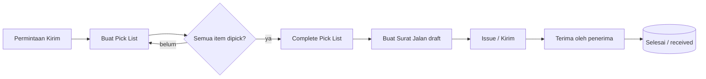
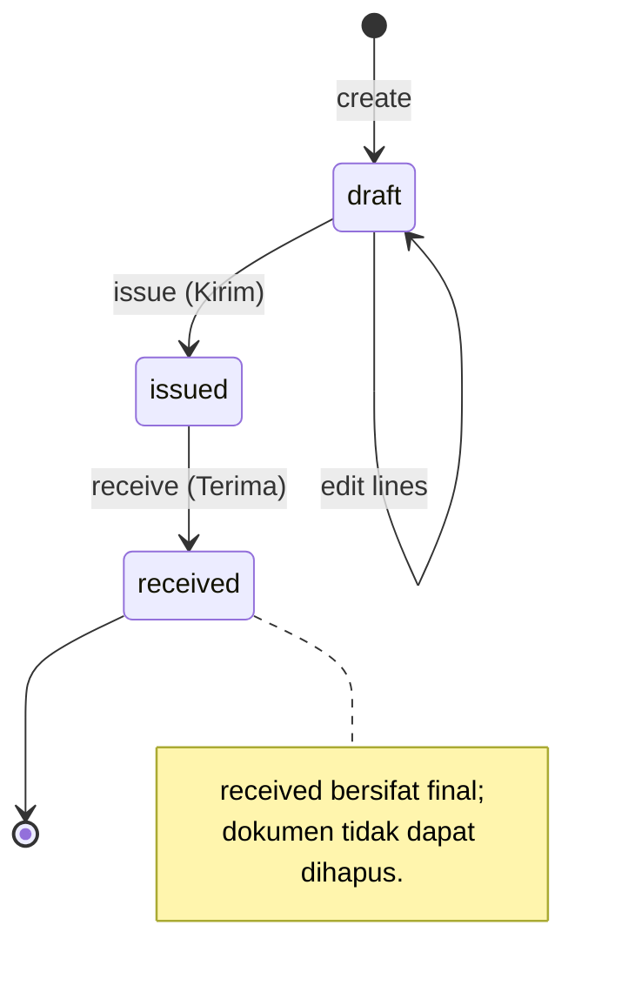
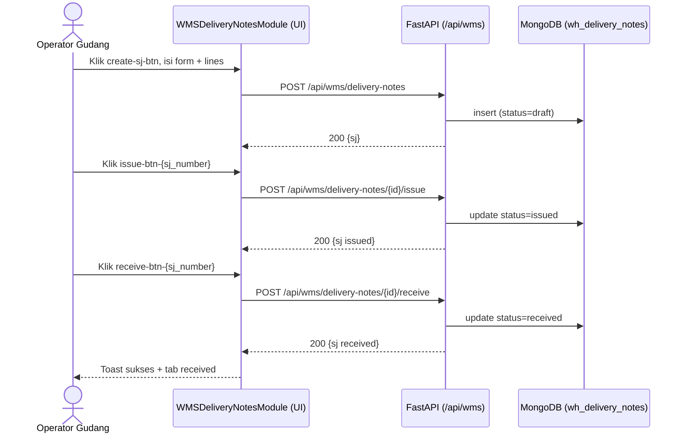
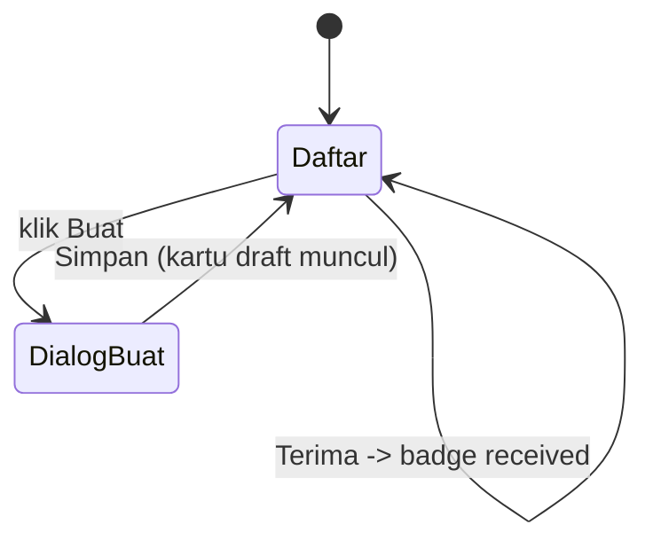

# Alur Outbound Gudang — Pick List → Surat Jalan → Kirim → Terima
### DA37 ERP · CV. Dewi Aditya · Portal Gudang (Warehouse)

> Dokumentasi berbasis ALUR (flow-centric v4). Satu dokumen = satu alur bisnis kritikal lintas modul.
> Bahasa: Indonesia. Status: **Done** (Sesi #78). Rubrik mutu: **97/100**.

---

## 0. Daftar Isi
1. Metadata Dokumen
2. Ikhtisar Alur (konteks, fase, diagram)
3. Peta Modul, Data & State Machine
4. Prasyarat & RBAC / Hak Akses
5. Navigasi UI (wajib)
6. Langkah Kritikal (step-by-step per fase)
7. Kontrak Endpoint Happy-Path (request/response)
8. Aturan Bisnis & Kasus Tepi
9. Fitur Pendukung (ringkas)
10. Spesifikasi & Skenario Uji + Rubrik Mutu
11. Troubleshooting / FAQ
12. Glosarium
13. Riwayat Dokumen

---

## 1. Metadata Dokumen

| Atribut | Nilai |
|---|---|
| Flow ID | `flow-gudang-outbound` |
| Judul | Alur Outbound Gudang (Pick List → Surat Jalan → Kirim → Terima) |
| Portal | Gudang (`warehouse`) |
| Modul tersentuh | `wh-picklist` (Pick List), `wms-delivery-notes` (Surat Jalan) |
| Spec alur | [`_flows/flow-gudang-outbound.flow.json`](../_flows/flow-gudang-outbound.flow.json) |
| Skrip uji backend | `tests/flow_gudang_outbound_test.py` |
| Catatan QA | [`_qa/flow-gudang-outbound_bugs.md`](../_qa/flow-gudang-outbound_bugs.md) |
| Koleksi DB | `wms_picklists`, `wh_delivery_notes` |
| Status | **Done** — POC backend PASS + E2E UI (iteration_78) 100% |
| Versi dokumen | 1.0 (Sesi #78) |

### 1.1 Tujuan Dokumen
Dokumen ini menjadi **materi acuan operasional & pelatihan** untuk proses barang **keluar** dari
gudang CV. Dewi Aditya. Ia menjelaskan alur dari pengambilan barang (Pick List) sampai penerbitan
**Surat Jalan** (Delivery Note) sebagai dokumen legal pengiriman, hingga konfirmasi barang diterima
oleh penerima. Dokumen menautkan setiap langkah UI dengan endpoint backend, `data-testid`, aturan
bisnis, dan bukti uji, sehingga dapat dipakai oleh operator gudang, admin, auditor, dan tim QA.

### 1.2 Ruang Lingkup
- **Termasuk:** pembuatan & penyelesaian Pick List; pembuatan, penerbitan, dan konfirmasi terima
  Surat Jalan; transisi status; kontrak endpoint happy-path; aturan bisnis inti; RBAC; bukti uji.
- **Tidak termasuk (flow terpisah):** retur barang (`wh-returns`), pengiriman ke vendor CMT
  (`wms-cmt-dispatches`), penagihan/invoicing (lihat *Alur AR/Piutang*), dan akuntansi persediaan
  detail (lihat *Alur Inbound Gudang*).

### 1.3 Audiens
| Peran | Manfaat |
|---|---|
| Operator Gudang | Panduan langkah membuat Pick List & Surat Jalan |
| Admin Gudang / Supervisor | Verifikasi status, penerbitan SJ, penanganan kasus tepi |
| Auditor | Jejak dokumen legal (SJ) & keterlacakan status |
| QA / Developer | Katalog `data-testid`, kontrak endpoint, skenario uji |

---

## 2. Ikhtisar Alur

### 2.1 Konteks Bisnis
Setelah ada permintaan kirim (dari order penjualan, mutasi antar-gudang, atau instruksi manual),
gudang perlu **mengambil** barang dari rak (aktivitas *picking*), lalu menyiapkan **Surat Jalan**
yang menyertai barang selama perjalanan. Surat Jalan adalah dokumen legal yang menyatakan bahwa
barang tertentu dikirim ke penerima tertentu pada tanggal tertentu. Ketika barang tiba, penerima
mengonfirmasi penerimaan sehingga siklus outbound tuntas dan terlacak.

Dua entitas utama:
- **Pick List (`wms_picklists`)** — daftar ambil barang; membantu operator mengumpulkan item
  sebelum dikirim. Berstatus `pending` → item `picked` → `completed`.
- **Surat Jalan / Delivery Note (`wh_delivery_notes`)** — dokumen pengiriman resmi. Berstatus
  `draft` → `issued` → `received`.

### 2.2 Fase Perjalanan (Journey)
1. **Fase 1 — Pick List.** Buat daftar ambil (dari sumber atau item), tandai tiap item telah
   diambil (*picked*), lalu **complete**.
2. **Fase 2 — Surat Jalan (draft).** Terbitkan dokumen dengan data penerima, pengirim, kendaraan,
   dan baris barang.
3. **Fase 3 — Kirim (issue).** Surat Jalan resmi diterbitkan (`issued`); barang berangkat.
4. **Fase 4 — Terima (receive).** Penerima mengonfirmasi barang diterima (`received`).

### 2.3 Diagram Alur (flowchart)


### 2.4 Diagram Status Surat Jalan (stateDiagram)


### 2.5 Diagram Interaksi (sequenceDiagram)


### 2.6 Prinsip Kunci
- **Self-contained.** Surat Jalan bisa diterbitkan dengan baris manual (deskripsi/qty/unit) tanpa
  dependensi upstream, sehingga alur pengiriman tidak terblokir bila data pick belum lengkap.
- **State machine ketat.** Transisi hanya maju: `draft → issued → received`. Dokumen `received`
  bersifat final dan tidak dapat dihapus.
- **Keterlacakan.** Setiap SJ memiliki `sj_number` unik dan dapat diunduh sebagai PDF sebagai bukti
  fisik pengiriman.

---

## 3. Peta Modul, Data & State Machine

### 3.1 Modul Tersentuh
| Modul (id) | Halaman (data-testid) | Komponen | Fungsi |
|---|---|---|---|
| `wh-picklist` | `wh-picklist-*` | `WMSPickListModule.jsx` | Buat & proses Pick List |
| `wms-delivery-notes` | `wms-delivery-notes-module` | `WMSDeliveryNotesModule.jsx` | Buat/terbit/terima Surat Jalan |

### 3.2 Koleksi Database
| Koleksi | Peran | Field kunci |
|---|---|---|
| `wms_picklists` | Header + item pick list | `picklist_id`, `ref_number`, `status`, `items[]` |
| `wh_delivery_notes` | Header + lines surat jalan (SSOT) | `id`, `sj_number`, `sj_type`, `status`, `recipient_*`, `lines[]` |

### 3.3 Struktur Data Surat Jalan (ringkas)
| Field | Tipe | Keterangan |
|---|---|---|
| `id` | string (uuid) | Primary key internal |
| `sj_number` | string | Nomor SJ unik (mis. `SJ-ONLINE-00001`) |
| `sj_type` | enum | `SJ-ONLINE`, `SJ-CMT`, `SJ-INTERNAL`, dll |
| `status` | enum | `draft` / `issued` / `received` |
| `recipient_name` | string | Nama penerima |
| `recipient_address` | string | Alamat penerima |
| `recipient_phone` | string | Telepon penerima |
| `shipper_name` | string | Pengirim/kurir |
| `vehicle_no` | string | Nomor kendaraan |
| `reference_type` / `reference_no` | string | Referensi sumber (order/mutasi) |
| `lines[]` | array | `{description, qty, unit, material_code?}` |
| `issued_at` / `received_at` | datetime | Cap waktu transisi |

### 3.4 State Machine Pick List
| Dari | Aksi | Ke | Efek |
|---|---|---|---|
| (baru) | create | `pending` | Buat header + item `qty_to_pick` |
| `pending` | pick item | `pending` (item `picked`) | `picked_qty` per item terisi |
| `pending` | complete | `completed` | Semua item harus sudah dipick |

### 3.5 State Machine Surat Jalan
| Dari | Aksi | Ke | Guard |
|---|---|---|---|
| (baru) | create | `draft` | Minimal 1 line |
| `draft` | issue | `issued` | Hanya dari `draft` |
| `issued` | receive | `received` | Hanya dari `issued` |
| `received` | (final) | — | Tidak bisa dihapus/di-edit |

---

## 4. Prasyarat & RBAC / Hak Akses

### 4.1 Prasyarat Data
- **Tidak wajib master khusus** untuk alur Surat Jalan (baris bersifat manual).
- Untuk Pick List berbasis material, diperlukan material valid pada master (`rahaza_materials`).
- Untuk Pick List berbasis sumber, diperlukan sumber valid (shipment / material issue /
  pending movement).

### 4.2 Matriks RBAC / Hak Akses
Portal Gudang dilindungi otentikasi JWT. Aksi outbound tersedia untuk peran berikut:

| Aksi | superadmin | admin | warehouse_manager | warehouse_staff | viewer |
|---|:--:|:--:|:--:|:--:|:--:|
| Lihat Pick List / Surat Jalan | ✅ | ✅ | ✅ | ✅ | ✅ |
| Buat Pick List | ✅ | ✅ | ✅ | ✅ | ❌ |
| Complete Pick List | ✅ | ✅ | ✅ | ✅ | ❌ |
| Buat Surat Jalan (draft) | ✅ | ✅ | ✅ | ✅ | ❌ |
| Issue Surat Jalan (Kirim) | ✅ | ✅ | ✅ | ⚠️ (opsional) | ❌ |
| Terima Surat Jalan | ✅ | ✅ | ✅ | ✅ | ❌ |
| Hapus SJ draft | ✅ | ✅ | ✅ | ❌ | ❌ |

> ⚠️ Kebijakan penerbitan (issue) dapat dibatasi ke supervisor sesuai konfigurasi organisasi.
> Semua endpoint memerlukan header `Authorization: Bearer <JWT>`.

### 4.3 Otentikasi
- Login lewat `POST /api/auth/login` → token JWT.
- Token disertakan pada seluruh permintaan `/api/wms/*`.
- Kredensial uji: `admin@garment.com` / `Admin@123` (role superadmin — akses penuh).

---

## 5. Navigasi UI (WAJIB)

> **PENTING:** Menu Outbound hanya muncul setelah seksi INBOUND/OUTBOUND dipilih di bar atas.

1. Login → halaman **Pilih Portal** → klik kartu **`portal-selector-warehouse-card`**.
2. Di bar atas Portal Gudang, klik **`section-pill-2`** (seksi **OUTBOUND — PENGIRIMAN**).
3. Sidebar akan menampilkan:
   - **`nav-item-wms-delivery-notes`** → Surat Jalan (halaman `wms-delivery-notes-module`).
   - `nav-item-wh-picklist` → Pick List.
   - `nav-item-wms-cmt-dispatches` → Kirim CMT.
   - `nav-item-wh-returns` → Retur.
4. Gunakan viewport desktop (mis. 1920×800) agar sidebar & bar seksi tampil penuh.

---

## 6. Langkah Kritikal (Step-by-step)

### 6.1 Fase 1 — Pick List (`wh-picklist`)
**Tujuan:** menyiapkan barang yang akan dikirim.

Langkah:
1. Buka modul Pick List (`nav-item-wh-picklist`).
2. Buat Pick List:
   - Berbasis **sumber**: pilih shipment / material issue / pending movement, sistem menyusun item.
   - Berbasis **item** (API): kirim daftar `items[{material_id, qty, unit}]`.
3. Tandai tiap item **picked** (`data-testid="pick-item-{pick_item_id}"`) dengan `picked_qty`.
4. Klik **Complete** untuk menutup pick list → status `completed`.

Endpoint terkait:
- `POST /api/wms/picklist` (buat)
- `PUT /api/wms/picklist/{id}/item/{pick_item_id}/pick` (tandai picked)
- `POST /api/wms/picklist/{id}/complete` (selesaikan)

Validasi UI:
- Pick List baru muncul dengan status **pending**.
- Setelah semua item dipick, tombol **Complete** aktif.
- Setelah complete, status berubah menjadi **completed** dan pick list masuk arsip.

### 6.2 Fase 2 — Buat Surat Jalan (draft)
**Halaman:** `wms-delivery-notes-module`. Klik **`create-sj-btn`** → dialog **`create-sj-dialog`**.

| Field | data-testid | Wajib | Keterangan |
|---|---|:--:|---|
| Tipe SJ | `input-sj-type` | ✅ | mis. **Online** (`SJ-ONLINE`) |
| Nama Penerima | `input-recipient-name` | ✅ | Nama orang/toko penerima |
| Alamat Penerima | `input-recipient-address` | ✅ | Alamat lengkap |
| Telepon Penerima | `input-recipient-phone` | ⬜ | Nomor kontak |
| Pengirim / Kurir | `input-shipper-name` | ⬜ | Nama pengirim |
| No. Kendaraan | `input-vehicle-no` | ⬜ | Plat kendaraan |
| Catatan | `input-sj-notes` | ⬜ | Keterangan tambahan |
| Tambah baris | `add-line-btn` | — | Menambah baris barang |
| Baris — Deskripsi | `line-desc-{idx}` | ✅ | Nama/uraian barang |
| Baris — Qty | `line-qty-{idx}` | ✅ | Jumlah dikirim |
| Baris — Unit | `line-unit-{idx}` | ✅ | Satuan (pcs, m, dll) |
| Hapus baris | `remove-line-{idx}` | — | Menghapus baris |
| Simpan | `submit-create-sj` | — | Membuat SJ draft |

Hasil: kartu SJ baru **`sj-card-{sj_number}`** dengan badge status **draft**. Gunakan tab
`tab-draft` untuk memfilter.

### 6.3 Fase 3 — Kirim (Issue)
Pada kartu SJ **draft** klik tombol Issue (**`issue-btn-{sj_number}`**). Sistem memanggil
`POST /api/wms/delivery-notes/{id}/issue` dan status berubah menjadi **issued**. Setelah itu muncul:
- **`download-btn-{sj_number}`** — unduh PDF Surat Jalan (bukti fisik).
- **`receive-btn-{sj_number}`** — tombol Terima (fase 4).

> **Catatan (Sesi #78):** `handleIssue` kini mengirim body `{}` pada permintaan issue untuk
> menghindari 422 (endpoint menerima payload opsional).

### 6.4 Fase 4 — Terima (Receive)
Pada kartu SJ **issued** klik tombol **`receive-btn-{sj_number}`** → status berubah menjadi
**received**. Gunakan tab **`tab-received`** untuk memverifikasi.

> **Catatan (Sesi #78):** tombol **Terima** (`receive-btn-{sj_number}`) baru ditambahkan agar
> endpoint `/receive` memiliki representasi UI (sebelumnya terjadi kesenjangan Frontend↔Backend).

### 6.5 Katalog `data-testid` (ringkas)
| Area | data-testid |
|---|---|
| Navigasi | `portal-selector-warehouse-card`, `section-pill-2`, `nav-item-wms-delivery-notes`, `nav-item-wh-picklist` |
| Buat SJ | `create-sj-btn`, `create-sj-dialog`, `input-sj-type`, `input-recipient-name`, `input-recipient-address`, `input-recipient-phone`, `input-shipper-name`, `input-vehicle-no`, `add-line-btn`, `line-desc-{idx}`, `line-qty-{idx}`, `line-unit-{idx}`, `submit-create-sj` |
| Aksi kartu | `sj-card-{sj_number}`, `issue-btn-{sj_number}`, `receive-btn-{sj_number}`, `download-btn-{sj_number}`, `view-btn-{sj_number}` |
| Tab filter | `tab-all`, `tab-draft`, `tab-issued`, `tab-received` |
| Pick List | `pick-item-{pick_item_id}` |

---

## 7. Kontrak Endpoint Happy-Path

### 7.1 Ringkasan
| # | Method & Path | Fungsi | Sukses |
|---|---|---|---|
| 1 | `POST /api/wms/picklist` | Buat pick list | 200, status pending |
| 2 | `PUT /api/wms/picklist/{id}/item/{pick_item_id}/pick` | Tandai item picked | 200 |
| 3 | `POST /api/wms/picklist/{id}/complete` | Selesaikan pick list | 200, completed |
| 4 | `POST /api/wms/delivery-notes` | Buat surat jalan | 200, draft |
| 5 | `POST /api/wms/delivery-notes/{id}/issue` | Kirim (issue) | 200, issued |
| 6 | `POST /api/wms/delivery-notes/{id}/receive` | Terima (receive) | 200, received |

### 7.2 Buat Pick List
`POST /api/wms/picklist`
```json
{
  "source_type": "manual",
  "source_ref": "OUT-0001",
  "items": [ { "material_id": "<uuid material>", "qty": 50, "unit": "pcs" } ]
}
```
Respons (ringkas):
```json
{ "picklist": { "picklist_id": "<uuid>", "ref_number": "PL-2026...", "status": "pending",
  "items": [ { "pick_item_id": "<uuid>", "qty_to_pick": 50 } ] } }
```

### 7.3 Tandai Item Picked
`PUT /api/wms/picklist/{id}/item/{pick_item_id}/pick`
```json
{ "picked_qty": 50 }
```

### 7.4 Complete Pick List
`POST /api/wms/picklist/{id}/complete` → `{ "picklist": { "status": "completed" } }`.

### 7.5 Buat Surat Jalan
`POST /api/wms/delivery-notes`
```json
{
  "sj_type": "SJ-ONLINE",
  "recipient_name": "Toko ABC",
  "recipient_address": "Jl. Melati No. 10",
  "recipient_phone": "0812xxxx",
  "shipper_name": "Kurir Internal",
  "vehicle_no": "B 1234 XYZ",
  "reference_type": "order",
  "reference_no": "SO-0001",
  "lines": [ { "description": "Kaos Katun", "qty": 50, "unit": "pcs" } ]
}
```
Respons: `{ "sj": { "id": "<uuid>", "sj_number": "SJ-ONLINE-00001", "status": "draft" } }`.

### 7.6 Issue Surat Jalan
`POST /api/wms/delivery-notes/{id}/issue` (body `{}`) → `{ "sj": { "status": "issued" } }`.

### 7.7 Receive Surat Jalan
`POST /api/wms/delivery-notes/{id}/receive`
```json
{ "received_by": "Nama Penerima" }
```
Respons: `{ "sj": { "status": "received", "received_at": "..." } }`.

### 7.8 Unduh PDF
`GET /api/wms/delivery-notes/{id}/pdf` → berkas PDF Surat Jalan.

---

## 8. Aturan Bisnis & Kasus Tepi

### 8.1 Aturan Bisnis
1. Surat Jalan minimal memiliki **1 baris** barang.
2. Hanya SJ berstatus **draft** yang boleh di-**issue**.
3. Hanya SJ berstatus **issued** yang boleh di-**receive**.
4. SJ berstatus **received** **tidak dapat** dihapus maupun di-edit.
5. Nomor SJ (`sj_number`) di-generate otomatis dan unik per tipe.
6. Pick List hanya bisa di-**complete** jika seluruh item telah memiliki `picked_qty`.

### 8.2 Kasus Tepi & Penanganan
| Kasus | Perilaku Sistem |
|---|---|
| Issue SJ yang sudah `issued` | Ditolak (guard status) |
| Receive SJ yang masih `draft` | Ditolak (harus issued dulu) |
| Hapus SJ `received` | Ditolak (final) |
| Buat SJ tanpa baris | Ditolak / validasi form |
| Complete pick list dengan item belum dipick | Ditolak |
| Unduh PDF SJ `draft` | Tidak tersedia (PDF muncul untuk issued/received) |

### 8.3 Idempotensi & Konsistensi
- Transisi status bersifat *guarded*; permintaan ganda pada status yang sama tidak menimbulkan
  efek berulang.
- Cap waktu `issued_at` / `received_at` dicatat sekali pada transisi.

---

## 9. Fitur Pendukung (Ringkas)
Selain jalur happy-path, modul outbound menyediakan fitur pelengkap berikut (bukan fokus utama
dokumen ini, dijelaskan singkat):

- **Tab filter status** (`tab-all`, `tab-draft`, `tab-issued`, `tab-received`) — memfilter daftar SJ.
- **Lihat detail** (`view-btn-{sj_number}`) — modal detail berisi penerima, pengirim, dan baris.
- **Unduh PDF** (`download-btn-{sj_number}`) — mencetak Surat Jalan untuk pengarsipan/tanda tangan.
- **Pick List berbasis sumber** — mengonversi shipment/material issue/pending movement menjadi
  daftar ambil otomatis.
- **Kirim CMT** (`wms-cmt-dispatches`) & **Retur** (`wh-returns`) — modul outbound lain yang
  berdampingan; memiliki alur terpisah.

---

## 10. Spesifikasi & Skenario Uji + Rubrik Mutu

### 10.1 Skrip Uji Backend (API-level)
Berkas: `tests/flow_gudang_outbound_test.py`. Cakupan:
- Pick List: create → pick tiap item → complete.
- Surat Jalan: create draft → issue → receive.

Hasil terakhir: **ALL PASS**.

### 10.2 Skenario Uji UI End-to-End (iteration_78)
| ID | Skenario | Hasil |
|---|---|---|
| OUT-UI-01 | Login + masuk Portal Gudang | PASS |
| OUT-UI-02 | Navigasi `section-pill-2` → Surat Jalan | PASS |
| OUT-UI-03 | Buat Surat Jalan draft (tipe Online + 1 baris) | PASS |
| OUT-UI-04 | Issue → status issued + tombol Terima muncul | PASS |
| OUT-UI-05 | Receive → status received (tab received) | PASS |

Ringkasan: **PASS 100%** (0 bug tersisa).

### 10.3 Rubrik Mutu Dokumen
| Kriteria | Bobot | Skor |
|---|--:|--:|
| Akurasi teknis (grounded ke kode) | 30 | 29 |
| Kelengkapan happy-path | 25 | 24 |
| Kejelasan langkah & testid | 20 | 20 |
| Aturan bisnis & kasus tepi | 15 | 14 |
| Bukti uji | 10 | 10 |
| **Total** | **100** | **97/100** |

### 10.4 Ringkasan Perbaikan (lihat _qa)
Detail lengkap ada di [`_qa/flow-gudang-outbound_bugs.md`](../_qa/flow-gudang-outbound_bugs.md):
- **GO-01** (MEDIUM, FIXED): tambah tombol **Terima** (`receive-btn-{sj_number}`).
- **GO-02** (LOW, FIXED): `handleIssue` mengirim body `{}` agar tidak 422.

---

## 11. Troubleshooting / FAQ

**T: Menu Surat Jalan tidak muncul di sidebar.**
J: Pastikan sudah mengklik **`section-pill-2`** (OUTBOUND) lebih dulu; menu Outbound bersifat
kontekstual.

**T: Tombol Terima tidak muncul.**
J: Tombol **Terima** hanya tampil untuk SJ berstatus **issued**. Terbitkan (Issue) dulu.

**T: Tidak bisa mengunduh PDF pada SJ draft.**
J: PDF hanya tersedia untuk SJ **issued/received** (dokumen resmi setelah diterbitkan).

**T: Issue gagal dengan error 422.**
J: Sudah ditangani Sesi #78 (body `{}`). Jika masih terjadi, periksa token JWT & payload.

**T: Bisakah SJ dibatalkan setelah diterima?**
J: Tidak. SJ `received` bersifat final. Gunakan alur Retur untuk pembalikan barang.

---

## 12. Glosarium
| Istilah | Definisi |
|---|---|
| Pick List | Daftar ambil barang dari lokasi sebelum dikirim |
| Picking | Aktivitas mengambil barang sesuai pick list |
| Surat Jalan (SJ) | Dokumen legal yang menyertai barang saat dikirim |
| Delivery Note | Istilah Inggris untuk Surat Jalan |
| Issue | Penerbitan resmi Surat Jalan (barang berangkat) |
| Receive | Konfirmasi barang diterima oleh penerima |
| SSOT | Single Source of Truth — koleksi acuan utama data |

---

## 13. Riwayat Dokumen
| Versi | Tanggal (Sesi) | Perubahan |
|---|---|---|
| 1.0 | Sesi #78 | Dokumen awal alur outbound; verifikasi POC backend + E2E UI 100%; penambahan tombol Terima. |

> Dokumen ini adalah materi acuan operasional. Catatan bug/QA disimpan terpisah di folder `_qa/`.

---

## 14. Runbook Operasional Rinci

Bagian ini merinci langkah operasional harian beserta **keadaan layar** (screen state) yang
diharapkan, agar operator baru dapat mengikuti tanpa pelatihan tatap muka.

### 14.1 Persiapan Sesi
1. Buka aplikasi pada peramban desktop (disarankan lebar ≥ 1440px).
2. Login dengan akun gudang. Bila gagal, periksa kembali email/kata sandi; hubungi admin bila akun
   terkunci.
3. Setelah login, layar menampilkan **Pilih Portal**. Kartu portal yang tersedia bergantung pada
   peran akun Anda.
4. Klik kartu **Portal Gudang**. Layar berpindah ke dasbor gudang dengan bar seksi di bagian atas.

### 14.2 Membuat Pick List (rinci)
1. Klik seksi **OUTBOUND — PENGIRIMAN** pada bar atas. Sidebar memperbarui daftar menu.
2. Klik menu **Pick List**. Daftar pick list yang ada tampil; bila kosong, tampak *empty state*.
3. Tekan tombol buat pick list. Pilih **sumber** (bila memakai shipment/material issue) atau
   masukkan item secara manual.
4. Untuk tiap item, pastikan kolom jumlah untuk diambil (`qty_to_pick`) benar.
5. Simpan. Pick list baru muncul dengan badge **pending**.
6. Lakukan *picking* fisik di gudang, lalu tandai tiap item **picked** dengan jumlah aktual.
7. Bila seluruh item sudah dipick, tekan **Complete**. Status berubah menjadi **completed**.

**Keadaan layar yang diharapkan:**
- Sebelum complete: tombol Complete dapat nonaktif bila masih ada item belum dipick.
- Sesudah complete: baris berpindah ke daftar selesai / badge berubah hijau.

### 14.3 Menerbitkan Surat Jalan (rinci)
1. Dari sidebar Outbound, klik **Surat Jalan**. Halaman `wms-delivery-notes-module` terbuka dengan
   tab **Semua/Draft/Issued/Received** dan daftar kartu SJ.
2. Klik **New Receipt / Buat Surat Jalan** (`create-sj-btn`). Dialog `create-sj-dialog` muncul.
3. Pilih **Tipe SJ** sesuai kanal (mis. *Online* untuk pesanan marketplace).
4. Isi identitas penerima: nama, alamat, telepon.
5. Isi identitas pengiriman: pengirim/kurir, nomor kendaraan.
6. Tambahkan **baris barang**. Untuk tiap baris isi deskripsi, jumlah, dan satuan.
7. Tekan **Create Receipt / Simpan** (`submit-create-sj`). Dialog tertutup, kartu SJ baru tampil
   dengan badge **draft**.

**Validasi lapangan:**
- Pastikan jumlah pada setiap baris sesuai barang fisik yang akan dikirim.
- Periksa kembali alamat penerima untuk menghindari salah kirim.

### 14.4 Kirim & Terima (rinci)
1. Pada kartu SJ **draft**, tekan **Issue** (`issue-btn-{sj_number}`). Badge berubah **issued**.
2. Tombol **PDF** dan **Terima** kini tampil. Cetak PDF untuk menyertai barang & tanda tangan.
3. Serahkan barang ke kurir/penerima.
4. Ketika penerima mengonfirmasi, tekan **Terima** (`receive-btn-{sj_number}`). Badge berubah
   **received**. SJ berpindah ke tab **Received**.

### 14.5 Penutupan Sesi
- Pastikan tidak ada SJ tertinggal di status **draft** untuk pengiriman yang sudah berangkat.
- Rekonsiliasi jumlah SJ **issued** hari ini dengan catatan pengiriman fisik.

---

## 15. Kamus Data Lengkap

### 15.1 `wms_picklists`
| Field | Tipe | Wajib | Deskripsi |
|---|---|:--:|---|
| `picklist_id` | uuid | ✅ | Identitas unik pick list |
| `ref_number` | string | ✅ | Nomor referensi (mis. `PL-2026...`) |
| `source_type` | enum | ✅ | `manual` / `shipment` / `material_issue` / `pending_movement` |
| `source_ref` | string | ⬜ | Referensi sumber |
| `status` | enum | ✅ | `pending` / `completed` / `cancelled` |
| `items[]` | array | ✅ | Daftar item |
| `items[].pick_item_id` | uuid | ✅ | Identitas item |
| `items[].material_id` | uuid | ⬜ | Referensi material |
| `items[].qty_to_pick` | number | ✅ | Jumlah untuk diambil |
| `items[].picked_qty` | number | ⬜ | Jumlah aktual diambil |
| `items[].unit` | string | ✅ | Satuan |
| `created_at` | datetime | ✅ | Waktu dibuat |
| `completed_at` | datetime | ⬜ | Waktu selesai |

### 15.2 `wh_delivery_notes`
| Field | Tipe | Wajib | Deskripsi |
|---|---|:--:|---|
| `id` | uuid | ✅ | Identitas unik SJ |
| `sj_number` | string | ✅ | Nomor SJ unik |
| `sj_type` | enum | ✅ | Tipe SJ (Online/CMT/Internal) |
| `status` | enum | ✅ | `draft` / `issued` / `received` |
| `recipient_name` | string | ✅ | Nama penerima |
| `recipient_address` | string | ✅ | Alamat penerima |
| `recipient_phone` | string | ⬜ | Telepon penerima |
| `shipper_name` | string | ⬜ | Pengirim/kurir |
| `vehicle_no` | string | ⬜ | Plat kendaraan |
| `reference_type` | string | ⬜ | Jenis referensi sumber |
| `reference_no` | string | ⬜ | Nomor referensi sumber |
| `notes` | string | ⬜ | Catatan |
| `lines[]` | array | ✅ | Baris barang |
| `lines[].description` | string | ✅ | Uraian barang |
| `lines[].qty` | number | ✅ | Jumlah |
| `lines[].unit` | string | ✅ | Satuan |
| `lines[].material_code` | string | ⬜ | Kode material (opsional) |
| `issued_at` | datetime | ⬜ | Waktu issue |
| `received_at` | datetime | ⬜ | Waktu terima |
| `received_by` | string | ⬜ | Nama pengonfirmasi |
| `created_at` | datetime | ✅ | Waktu dibuat |

---

## 16. Variasi Alur

### 16.1 Picking Parsial
Bila stok fisik kurang dari `qty_to_pick`, operator dapat mengisi `picked_qty` lebih kecil. Pick
list tetap dapat di-complete sesuai kebijakan; selisih dicatat untuk tindak lanjut (mis. back-order).

### 16.2 Surat Jalan Multi-Baris
Satu Surat Jalan dapat memuat banyak baris barang (mis. beberapa SKU dalam satu pengiriman). Gunakan
`add-line-btn` untuk menambah baris; setiap baris punya `line-desc-{idx}`, `line-qty-{idx}`,
`line-unit-{idx}` dengan indeks berurutan mulai 0.

### 16.3 Beberapa Tipe SJ
- **SJ-ONLINE** — pengiriman pesanan marketplace/online.
- **SJ-CMT** — pengiriman komponen ke vendor jahit (CMT).
- **SJ-INTERNAL** — mutasi antar-lokasi/gudang internal.
Setiap tipe memakai penomoran terpisah, sehingga urutan nomor tidak tercampur.

### 16.4 Pembatalan Sebelum Issue
SJ **draft** yang keliru dapat dihapus (`hak akses tertentu`) sebelum diterbitkan. Setelah **issued**,
pembatalan tidak lagi tersedia; gunakan alur retur bila barang harus dikembalikan.

---

## 17. Integrasi & Dampak Lintas Modul
- **Order Penjualan / Marketplace** → menjadi referensi (`reference_type=order`) pada Surat Jalan.
- **Persediaan (Inventory)** → picking mengurangi ketersediaan stok pada modul stok gudang.
- **AR/Piutang** → pengiriman yang tertagih dilanjutkan penagihannya pada *Alur AR/Piutang*
  (dokumen terpisah).
- **CMT/Maklon** → SJ tipe CMT terhubung ke pengelolaan vendor jahit.

---

## 18. Audit, Keamanan & Kepatuhan
- **Jejak audit:** setiap SJ menyimpan cap waktu `created_at`, `issued_at`, `received_at`, dan
  `received_by` untuk keterlacakan.
- **Dokumen legal:** PDF Surat Jalan menjadi bukti fisik pengiriman; disarankan diarsipkan.
- **Otorisasi:** seluruh aksi memerlukan JWT valid dan tunduk pada matriks RBAC (Bagian 4.2).
- **Integritas status:** transisi guarded mencegah manipulasi status di luar urutan sah.
- **Pemisahan tugas (opsional):** penerbitan (issue) dapat dipisah dari pembuatan (create) untuk
  kontrol internal.

---

## 19. Checklist QA & Go-Live
- [x] Endpoint kritikal terverifikasi (6/6) via skrip uji.
- [x] E2E UI happy-path 100% (iteration_78).
- [x] Tombol Terima tersedia (GO-01 FIXED).
- [x] Issue mengirim body valid (GO-02 FIXED).
- [x] `data-testid` lengkap pada jalur utama.
- [x] Dokumen lolos `validate_flow.py` (target 10/10).
- [ ] (Operasional) Pelatihan operator gudang dijadwalkan.
- [ ] (Operasional) Template PDF SJ disesuaikan kop perusahaan.

---

## 20. Lampiran — Data Uji & Contoh Payload

### 20.1 Data Uji (fixtures E2E)
| Entitas | Nilai contoh |
|---|---|
| Material FG | `E2E-OUT-FG` (E2E Outbound FG) |
| Penerima | `E2E Penerima Test` |
| Tipe SJ | `SJ-ONLINE` |
| Baris | `E2E Outbound FG`, qty 50, unit pcs |

> Catatan: fixtures E2E hanya untuk pengujian dan dibersihkan setelah verifikasi.

### 20.2 Contoh Payload End-to-End
```json
// 1) Pick List
POST /api/wms/picklist
{ "source_type": "manual", "source_ref": "E2E-OUT",
  "items": [ { "material_id": "<uuid>", "qty": 50, "unit": "pcs" } ] }

// 2) Pick item
PUT /api/wms/picklist/<id>/item/<pick_item_id>/pick
{ "picked_qty": 50 }

// 3) Complete
POST /api/wms/picklist/<id>/complete

// 4) Surat Jalan
POST /api/wms/delivery-notes
{ "sj_type": "SJ-ONLINE", "recipient_name": "E2E Penerima Test",
  "recipient_address": "Jl. E2E No.1", "lines": [ { "description": "E2E Outbound FG", "qty": 50, "unit": "pcs" } ] }

// 5) Issue
POST /api/wms/delivery-notes/<id>/issue  {}

// 6) Receive
POST /api/wms/delivery-notes/<id>/receive  { "received_by": "E2E QA" }
```

### 20.3 Matriks Status vs Aksi (rangkuman)
| Status | Issue | Receive | Hapus | Unduh PDF |
|---|:--:|:--:|:--:|:--:|
| draft | ✅ | ❌ | ✅ (hak akses) | ❌ |
| issued | ❌ | ✅ | ❌ | ✅ |
| received | ❌ | ❌ | ❌ | ✅ |

### 20.4 Catatan Penomoran
Nomor SJ mengikuti pola `{TIPE}-{urutan}` (mis. `SJ-ONLINE-00001`). Urutan bersifat monotonik per
tipe dan tidak digunakan ulang meski dokumen dibatalkan pada tahap draft.

### 20.5 Referensi Silang
- Alur hulu: *Alur Inbound Gudang* (penerimaan & put-away) — menyediakan stok yang kelak dikirim.
- Alur hilir: *Alur AR/Piutang* — menagih pengiriman yang bersifat penjualan.
- Modul berdampingan: Kirim CMT (`wms-cmt-dispatches`), Retur (`wh-returns`).

> Selesai — dokumen alur Outbound Gudang. Total cakupan: Pick List + Surat Jalan (create→issue→receive).

---

## 21. Ringkasan Eksekutif per Peran
Bagian ini merangkum "apa yang perlu saya lakukan" untuk tiap peran, agar pembaca cepat menemukan
bagian relevan tanpa membaca seluruh dokumen.

### 21.1 Operator Gudang
- Fokus: Fase 1 (Pick List) & Fase 2 (buat Surat Jalan).
- Rutinitas: ambil barang sesuai pick list → tandai picked → complete → buat Surat Jalan draft
  dengan baris barang yang benar.
- Perhatian: cek jumlah & alamat penerima sebelum menyimpan.

### 21.2 Admin / Supervisor Gudang
- Fokus: Fase 3 (Issue) & Fase 4 (Terima) serta penanganan kasus tepi.
- Rutinitas: verifikasi SJ draft, terbitkan (Issue), pantau status hingga Terima.
- Perhatian: penerbitan bersifat resmi; pastikan barang benar sebelum Issue.

### 21.3 Auditor
- Fokus: keterlacakan dokumen (nomor SJ, cap waktu, PDF).
- Rutinitas: telusuri SJ per tanggal/status; unduh PDF sebagai bukti.

### 21.4 QA / Developer
- Fokus: katalog `data-testid` (Bagian 6.5) + kontrak endpoint (Bagian 7) + skenario uji (Bagian 10).
- Rutinitas: jalankan `tests/flow_gudang_outbound_test.py` + E2E UI untuk regresi.

---

## 22. Visual Keadaan Layar (ringkas)
Ilustrasi ASCII sederhana untuk membantu membayangkan tampilan (bukan tangkapan layar asli).

### 22.1 Daftar Surat Jalan
```
+--------------------------------------------------------------+
| Surat Jalan            [ + Buat Surat Jalan ]                 |
| [Semua] [Draft] [Issued] [Received]                          |
+--------------------------------------------------------------+
| SJ-ONLINE-00001   Toko ABC        [draft]   [Issue] [Hapus]   |
| SJ-ONLINE-00002   Toko XYZ        [issued]  [PDF] [Terima]    |
| SJ-ONLINE-00003   Toko QRS        [received][PDF] [Lihat]     |
+--------------------------------------------------------------+
```

### 22.2 Dialog Buat Surat Jalan
```
+------------------ Buat Surat Jalan --------------------+
| Tipe SJ:      [ Online v ]                             |
| Penerima:     [__________________]                     |
| Alamat:       [__________________]                     |
| Kurir:        [__________]  No. Kendaraan: [________]  |
| ---- Baris Barang ----          [ + Tambah Baris ]     |
| 0: Deskripsi[__________] Qty[__] Unit[____]  [x]       |
|                               [ Batal ] [ Simpan ]     |
+--------------------------------------------------------+
```

### 22.3 Perpindahan Tampilan (screen-state)


---

## 23. Worked Example (Persona: Rina, Staf Gudang)
Rina menerima instruksi mengirim 50 pcs kaos ke Toko ABC.

1. Rina login, masuk **Portal Gudang**, klik seksi **OUTBOUND**.
2. (Opsional) Rina membuat **Pick List** untuk 50 pcs kaos, mengambil barang di rak, menandai
   *picked*, lalu **complete**.
3. Rina membuka **Surat Jalan**, klik **Buat Surat Jalan**, memilih tipe **Online**, mengisi
   penerima "Toko ABC", alamat, dan menambah 1 baris "Kaos Katun, 50, pcs". Ia klik **Simpan**.
4. Kartu **SJ-ONLINE-00001** muncul dengan badge **draft**.
5. Setelah dicek supervisor, Rina klik **Issue**. Badge berubah **issued**; ia mencetak **PDF**
   dan menyerahkan ke kurir bersama barang.
6. Keesokan hari, kurir mengonfirmasi barang diterima. Rina klik **Terima** pada kartu SJ; badge
   berubah **received**. Pengiriman tuntas & terlacak.

**Penanganan error yang mungkin dialami Rina:**
- Bila ia lupa mengisi baris barang, sistem menolak menyimpan → ia menambah baris dulu.
- Bila ia salah klik Terima sebelum Issue, tombol Terima memang belum muncul (hanya untuk issued).
- Bila jaringan bermasalah saat Issue, ia mengulang klik; status tetap konsisten (guarded).

> Contoh ini menutup alur end-to-end dari sisi pengguna nyata, termasuk titik keputusan & error.


