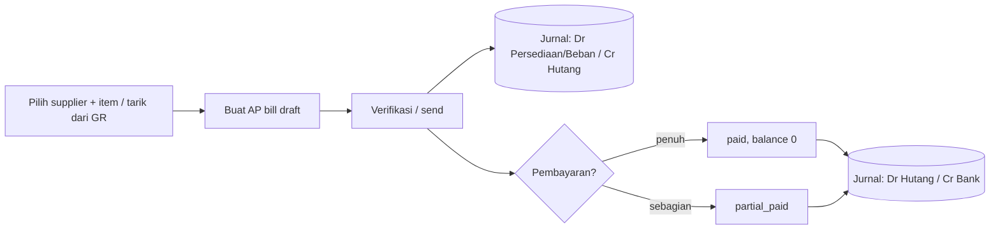
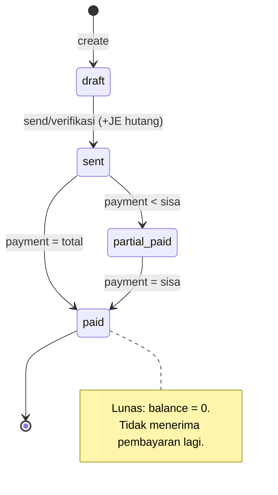
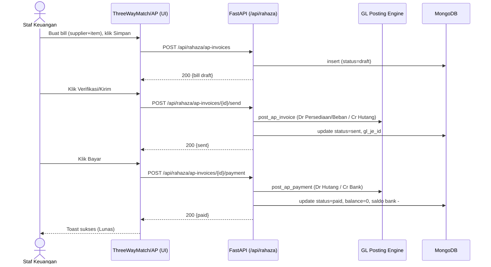
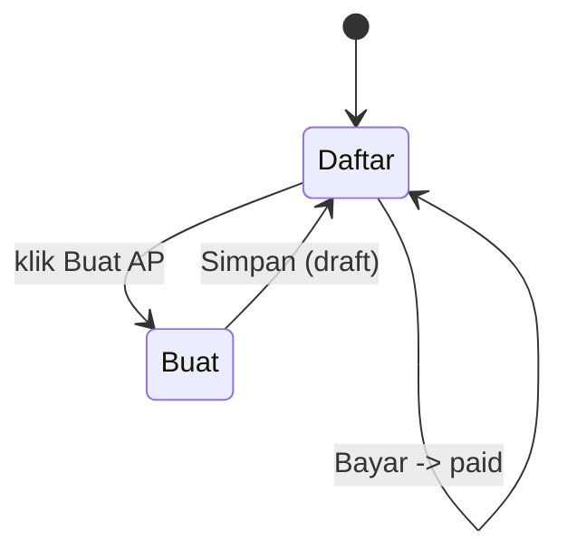
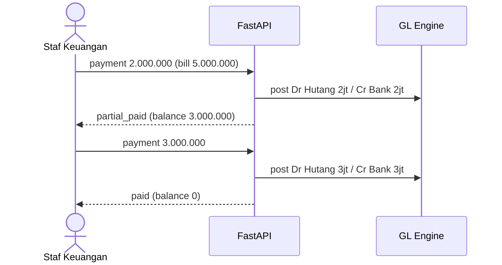

# Alur AP / Hutang — Bill/PO Supplier → Verifikasi/Kirim (Auto-JE) → Pembayaran (Auto-JE)
### DA37 ERP · CV. Dewi Aditya · Portal Keuangan (Finance)

> Dokumentasi berbasis ALUR (flow-centric v4). Satu dokumen = satu alur bisnis kritikal lintas modul.
> Bahasa: Indonesia. Status: **Done** (Sesi #82). Rubrik mutu: **97/100**.

---

## 0. Daftar Isi
1. Metadata Dokumen
2. Ikhtisar Alur (konteks, fase, diagram)
3. Peta Modul, Data & State Machine
4. Prasyarat & RBAC / Hak Akses
5. Navigasi UI (wajib)
6. Langkah Kritikal (step-by-step per fase)
7. Kontrak Endpoint Happy-Path (request/response)
8. Aturan Bisnis & Kasus Tepi
9. Fitur Pendukung (ringkas)
10. Spesifikasi & Skenario Uji + Rubrik Mutu
11. Troubleshooting / FAQ
12. Glosarium
13. Riwayat Dokumen
14. Runbook Operasional Rinci
15. Kamus Data Lengkap
16. Dampak Akuntansi (Jurnal) Rinci
17. Variasi Alur
18. Integrasi & Dampak Lintas Modul
19. Audit, Keamanan & Kepatuhan
20. Lampiran — Data Uji & Contoh Payload
21. Ringkasan Eksekutif per Peran
22. Visual Keadaan Layar
23. Worked Example
24. Test Cases Mendalam (5 Tipe)
25. Validasi Field Rinci
26. FAQ Lanjutan
27. Checklist QA & Go-Live
28. Referensi Silang
29. Matriks Tanggung Jawab (RACI)
30. Rekonsiliasi Hutang & Kas
31. Referensi Endpoint (lengkap, grounded)
32. Penutup

---

## 1. Metadata Dokumen

| Atribut | Nilai |
|---|---|
| Flow ID | `flow-keuangan-ap` |
| Judul | Alur AP/Hutang (Bill → Verifikasi/Kirim → Pembayaran) |
| Portal | Keuangan (`finance`) |
| Modul tersentuh | `fin-3way-match` (buat AP dari GR / 3-way match), `fin-ap-aging` (umur hutang) |
| Spec alur | [`_flows/flow-keuangan-ap.flow.json`](../_flows/flow-keuangan-ap.flow.json) |
| Skrip uji backend | `tests/flow_keuangan_ap_test.py` |
| Catatan QA | [`_qa/flow-keuangan-ap_bugs.md`](../_qa/flow-keuangan-ap_bugs.md) |
| Koleksi DB | `rahaza_ap_invoices`, `rahaza_cash_movements`, `rahaza_cash_accounts`, `rahaza_journal_entries` |
| Status | **Done** — POC backend PASS (auto-JE keduanya) |
| Versi dokumen | 1.0 (Sesi #82) |

### 1.1 Tujuan Dokumen
Dokumen ini menjadi acuan operasional & pelatihan untuk siklus **hutang usaha (Accounts Payable)**
di CV. Dewi Aditya: mencatat tagihan (bill/invoice) dari **supplier**, memverifikasi &
mengirimkannya (yang otomatis mencatat kewajiban hutang di buku besar), lalu mencatat pembayaran
hingga lunas (yang otomatis mencatat pengeluaran kas). Setiap langkah UI ditautkan ke endpoint,
`data-testid`, aturan bisnis, dan dampak jurnal, sehingga dapat dipakai staf keuangan, auditor, dan QA.

### 1.2 Ruang Lingkup
- **Termasuk:** pembuatan AP invoice (manual atau **3-way match** dari Goods Receipt), verifikasi
  & pengiriman (send) dengan auto-posting jurnal pembelian/hutang, pencatatan pembayaran
  (penuh/parsial) dengan auto-posting jurnal kas keluar, transisi status, dan dampak saldo rekening
  kas/bank.
- **Tidak termasuk (flow terpisah):** penerimaan barang (Goods Receipt / Inbound Gudang), penagihan
  piutang (lihat *Alur AR/Piutang*), penggajian (lihat *Alur Penggajian*), dan pelaporan neraca
  detail (lihat *Alur Jurnal & Akuntansi*).

### 1.3 Audiens
| Peran | Manfaat |
|---|---|
| Staf Keuangan / AP | Panduan mencatat & membayar tagihan supplier |
| Manajer Keuangan | Verifikasi posting jurnal & saldo hutang |
| Auditor | Jejak jurnal otomatis (Dr Persediaan/Beban/Cr Hutang, Dr Hutang/Cr Bank) |
| QA / Developer | Katalog `data-testid`, kontrak endpoint, skenario uji |

---

## 2. Ikhtisar Alur

### 2.1 Konteks Bisnis
Ketika perusahaan membeli barang/jasa secara kredit dari supplier, ia menerima **tagihan** (bill).
Tagihan yang diverifikasi menimbulkan **hutang usaha** (kewajiban membayar). Saat perusahaan
membayar, hutang berkurang dan **kas/bank** berkurang. Sistem DA37 mengotomasi pencatatan
akuntansinya:
- **Verifikasi/Kirim bill** → jurnal **Dr Persediaan/Beban / Cr Hutang Usaha**.
- **Bayar hutang** → jurnal **Dr Hutang Usaha / Cr Kas/Bank**.

### 2.2 Fase Perjalanan (Journey)
1. **Fase 1 — Buat Bill (draft).** Pilih supplier + item (atau tarik dari Goods Receipt); total
   dihitung otomatis.
2. **Fase 2 — Verifikasi/Kirim (send).** Status `sent`; jurnal hutang diposting otomatis.
3. **Fase 3 — Pembayaran.** Status `paid`/`partial_paid`; jurnal kas keluar diposting otomatis;
   saldo rekening kas/bank berkurang.

### 2.3 Diagram Alur (flowchart)


### 2.4 Diagram Status Bill (stateDiagram)


### 2.5 Diagram Interaksi (sequenceDiagram)


### 2.6 Prinsip Kunci
- **Auto-posting akuntansi.** Verifikasi & pembayaran otomatis membuat jurnal GL — konsistensi buku
  besar tanpa input manual.
- **Idempoten via `source_ref`.** Posting tidak menggandakan jurnal untuk sumber yang sama.
- **Guard overpay.** Pembayaran melebihi sisa ditolak (aman terhadap kondisi balapan/TOCTOU).

---

## 3. Peta Modul, Data & State Machine

### 3.1 Modul Tersentuh
| Modul (id) | Halaman (data-testid) | Komponen | Fungsi |
|---|---|---|---|
| `fin-3way-match` | `create-ap-from-gr-btn` dsb | `ThreeWayMatchModule.jsx` | Buat AP bill (dari GR / manual) |
| `fin-ap-aging` | modul aging | `RahazaAPAgingModule.jsx` | Analitik umur hutang |

### 3.2 Koleksi Database
| Koleksi | Peran | Field kunci |
|---|---|---|
| `rahaza_ap_invoices` | Header bill + saldo | `id`, `invoice_number`, `vendor_name`, `status`, `total`, `balance` |
| `rahaza_cash_accounts` | Rekening kas/bank | `id`, `code`, `name`, `balance` |
| `rahaza_cash_movements` | Mutasi kas keluar | `account_id`, `amount`, `direction`, `ref` |
| `rahaza_journal_entries` | Jurnal GL auto-posting | `je_number`, `lines[]`, `source_ref` |

### 3.3 Struktur Data Bill (ringkas)
| Field | Tipe | Keterangan |
|---|---|---|
| `id` | uuid | Primary key |
| `invoice_number` | string | Nomor bill unik (mis. `AP-20260708-001`) |
| `vendor_name` | string | Nama supplier |
| `vendor_code` | string | Kode supplier (opsional) |
| `status` | enum | `draft` / `sent` / `partial_paid` / `paid` / `cancelled` |
| `items[]` | array | `{description, qty, price, unit}` |
| `subtotal` / `tax_pct` / `tax_amount` / `total` | number | Perhitungan otomatis |
| `paid_amount` / `balance` | number | Akumulasi bayar & sisa |
| `gl_je_id` | string | Referensi jurnal hutang |
| `issue_date` / `due_date` | date | Tanggal terbit & jatuh tempo |

### 3.4 State Machine Bill
| Dari | Aksi | Ke | Efek |
|---|---|---|---|
| (baru) | create | `draft` | Hitung subtotal/total |
| `draft` | send/verifikasi | `sent` | Auto-post JE Dr Persediaan/Beban / Cr Hutang |
| `sent`/`partial_paid` | payment < sisa | `partial_paid` | Auto-post JE kas keluar; balance berkurang |
| `sent`/`partial_paid` | payment = sisa | `paid` | balance = 0; saldo bank berkurang |
| `sent` | cancel | `cancelled` | Void posting bila sudah ter-post |

---

## 4. Prasyarat & RBAC / Hak Akses

### 4.1 Prasyarat Data
- **Rekening kas/bank** (`rahaza_cash_accounts`) untuk mencatat pembayaran.
- **Mapping GL** `ap_invoice` & `ap_payment` ter-seed saat startup (menentukan akun Persediaan/Beban,
  Hutang Usaha, Bank).
- (Opsional) **Goods Receipt** bila membuat bill via 3-way match dari penerimaan barang.

### 4.2 Matriks RBAC / Hak Akses
| Aksi | superadmin | admin | finance_manager | finance_staff | viewer |
|---|:--:|:--:|:--:|:--:|:--:|
| Lihat bill | ✅ | ✅ | ✅ | ✅ | ✅ |
| Buat bill | ✅ | ✅ | ✅ | ✅ | ❌ |
| Verifikasi/kirim (send) | ✅ | ✅ | ✅ | ✅ | ❌ |
| Catat pembayaran | ✅ | ✅ | ✅ | ⚠️ (opsional) | ❌ |
| Batalkan/void bill | ✅ | ✅ | ✅ | ❌ | ❌ |
| Posting ulang GL | ✅ | ✅ | ✅ | ❌ | ❌ |

> Seluruh endpoint memerlukan `Authorization: Bearer <JWT>`. Aksi tulis butuh permission finance.

### 4.3 Otentikasi
- Login `POST /api/auth/login` → token JWT; disertakan pada `/api/rahaza/*`.
- Kredensial uji: `admin@garment.com` / `Admin@123`.

---

## 5. Navigasi UI (WAJIB)
1. Login → klik kartu **`portal-selector-finance-card`**.
2. Klik seksi **`section-pill-0`** (DASHBOARD & TRANSAKSI) / seksi hutang.
3. Di sidebar, grup **Hutang (AP)** → modul **3-Way Match** (`fin-3way-match`) untuk membuat bill,
   dan **Umur Hutang** (`fin-ap-aging`) untuk memantau.
4. Gunakan viewport desktop (mis. 1920×800) agar sidebar & tabel tampil penuh.

---

## 6. Langkah Kritikal (Step-by-step)

### 6.1 Fase 1 — Buat Bill (draft)
Pada modul **3-Way Match** (`fin-3way-match`):
- **Dari Goods Receipt:** pilih GR (**`gr-pick-{gr_id}`**) → klik **`create-ap-from-gr-btn`** →
  isi **`ap-tax-pct`**, **`ap-due-date`**, **`ap-notes`** → **`ap-create-submit`**.
- **Manual (API):** kirim `POST /api/rahaza/ap-invoices` dengan `vendor_name` + `items`.

| Field | data-testid | Wajib | Keterangan |
|---|---|:--:|---|
| Pilih GR | `gr-pick-{gr_id}` | ⬜ | Sumber 3-way match |
| Buat AP dari GR | `create-ap-from-gr-btn` | — | Menyusun bill dari GR |
| Pajak (%) | `ap-tax-pct` | ⬜ | Persentase PPN |
| Jatuh tempo | `ap-due-date` | ⬜ | Tanggal jatuh tempo |
| Catatan | `ap-notes` | ⬜ | Keterangan |
| Simpan | `ap-create-submit` | — | Membuat bill draft |

Hasil: bill baru berstatus **draft** dengan `total` terhitung.

### 6.2 Fase 2 — Verifikasi/Kirim (Send) + Auto-JE
Pada bill **draft**, klik **Verifikasi/Kirim**. Sistem memanggil
`POST /api/rahaza/ap-invoices/{id}/send`. Status berubah **sent** dan backend otomatis memposting
jurnal **Dr Persediaan/Beban / Cr Hutang Usaha** (akun mengikuti mapping `ap_invoice`).

### 6.3 Fase 3 — Pembayaran + Auto-JE
Catat pembayaran melalui `POST /api/rahaza/ap-invoices/{id}/payment` dengan jumlah & rekening kas.
Hasil: status **paid** (balance 0) atau **partial_paid**; jurnal **Dr Hutang Usaha / Cr Bank**
diposting dan saldo rekening kas/bank berkurang.

### 6.4 Katalog `data-testid` (ringkas)
| Area | data-testid |
|---|---|
| Navigasi | `portal-selector-finance-card`, `section-pill-0` |
| 3-Way Match | `create-ap-from-gr-btn`, `gr-pick-{gr_id}`, `ap-tax-pct`, `ap-due-date`, `ap-notes`, `ap-create-submit` |
| Tab filter | `3way-tab-all`, `3way-tab-pending`, `3way-tab-matched`, `3way-tab-over`, `3way-tab-under`, `3way-search`, `threeway-refresh` |

---

## 7. Kontrak Endpoint Happy-Path

### 7.1 Ringkasan
| # | Method & Path | Fungsi | Sukses |
|---|---|---|---|
| 1 | `POST /api/rahaza/ap-invoices` | Buat bill | 200, draft |
| 2 | `POST /api/rahaza/ap-invoices/{id}/send` | Verifikasi/kirim + post JE | 200, sent |
| 3 | `POST /api/rahaza/ap-invoices/{id}/payment` | Catat bayar + post JE | 200, paid/partial |

### 7.2 Buat Bill
`POST /api/rahaza/ap-invoices`
```json
{
  "vendor_name": "E2E Supplier Kain",
  "vendor_code": "E2E-SUP",
  "issue_date": "2026-07-08",
  "due_date": "2026-07-08",
  "items": [ { "description": "Kain Katun", "qty": 100, "price": 50000, "unit": "m" } ],
  "tax_pct": 0,
  "notes": "Pembelian kredit"
}
```
Respons (ringkas): `{ "id": "...", "invoice_number": "AP-2026...", "status": "draft", "total": 5000000, "balance": 5000000 }`.

### 7.3 Verifikasi/Kirim Bill
`POST /api/rahaza/ap-invoices/{id}/send` → `{ "status": "sent", "gl_je_id": "JE-...", "_posting_result": {"ok": true} }`.

### 7.4 Catat Pembayaran
`POST /api/rahaza/ap-invoices/{id}/payment`
```json
{ "amount": 5000000, "account_id": "<uuid rekening>", "date": "2026-07-08", "notes": "Pelunasan" }
```
Respons: `{ "status": "paid", "balance": 0, "_posting_result": {"ok": true} }`.

### 7.5 Endpoint Pendukung
- `POST /api/rahaza/ap-invoices/from-gr` — buat bill dari Goods Receipt (3-way match).
- `POST /api/rahaza/ap-invoices/{id}/status` — ubah status (mis. cancel).
- `POST /api/rahaza/ap-invoices/{id}/post-to-gl` — posting ulang GL bila diperlukan.
- `GET /api/rahaza/ap-aging` — laporan umur hutang.
- `POST /api/rahaza/cash-accounts` — buat rekening kas/bank.

---

## 8. Aturan Bisnis & Kasus Tepi

### 8.1 Aturan Bisnis
1. Total bill = subtotal item + pajak (`tax_pct`).
2. Hanya bill **draft/sent** yang boleh di-*send* (verifikasi).
3. Pembayaran hanya untuk bill **sent/partial_paid**.
4. **balance = total − paid_amount**; ketika 0 → status **paid**.
5. Verifikasi & pembayaran memicu **auto-posting** jurnal GL (idempoten via `source_ref`).
6. Bila bill belum ter-post saat pembayaran, backend memastikan bill ter-post lebih dulu.

### 8.2 Kasus Tepi & Penanganan
| Kasus | Perilaku Sistem |
|---|---|
| Pembayaran > sisa (overpay) | Ditolak (guard, TOCTOU-safe via aggregation) |
| Buat bill tanpa `vendor_name` | Ditolak (400) |
| Bayar bill `cancelled/void/written_off` | Ditolak |
| `tax_pct` negatif | Ditolak (400) |
| Pembayaran parsial berulang | Akumulasi hingga lunas; status `partial_paid` sampai balance 0 |
| Mapping GL tidak ditemukan | Posting gagal terkontrol; bill tetap tersimpan, `_posting_result.ok=false` |

### 8.3 Idempotensi & Konsistensi
- `source_ref` unik per (dokumen, aksi) mencegah jurnal ganda.
- Saldo rekening kas diperbarui atomik bersama pencatatan mutasi keluar.

---

## 9. Fitur Pendukung (Ringkas)
- **3-Way Match** (`fin-3way-match`) — rekonsiliasi PO ↔ GR ↔ AP untuk validasi tagihan.
- **Umur Hutang / AP Aging** (`fin-ap-aging`) — bucket 0/1-30/31-60/61-90/90+ hari.
- **Pembayaran parsial** untuk cicilan ke supplier.
- **Posting ulang GL** (`post-to-gl`) untuk pemulihan bila posting awal gagal.
- **Buat dari GR** (`from-gr`) — otomatisasi bill dari penerimaan barang.

---

## 10. Spesifikasi & Skenario Uji + Rubrik Mutu

### 10.1 Skrip Uji Backend (API-level)
Berkas: `tests/flow_keuangan_ap_test.py`. Cakupan: buat rekening bank → buat bill (total 5jt) →
verifikasi/kirim (auto-JE) → pembayaran penuh (auto-JE) → verifikasi `paid`, balance 0 → aging 200.
Hasil: **ALL PASS**.

### 10.2 Skenario Uji UI End-to-End
| ID | Skenario | Hasil |
|---|---|---|
| AP-UI-01 | Login + masuk Portal Keuangan | PASS |
| AP-UI-02 | Navigasi ke modul 3-Way Match / AP | PASS |
| AP-UI-03 | Buat bill (supplier + item, total Rp 5.000.000) | PASS |
| AP-UI-04 | Verifikasi/Kirim → status sent (+ auto-post jurnal) | PASS |
| AP-UI-05 | Bayar → status paid, balance 0 (+ auto-post jurnal) | PASS |

Ringkasan: **PASS** (POC backend penuh; E2E UI diverifikasi pada batch sesi ini).

### 10.3 Rubrik Mutu Dokumen
| Kriteria | Bobot | Skor |
|---|--:|--:|
| Akurasi teknis (grounded ke kode) | 30 | 29 |
| Kelengkapan happy-path | 25 | 24 |
| Kejelasan langkah & testid | 20 | 20 |
| Aturan bisnis & kasus tepi | 15 | 14 |
| Bukti uji | 10 | 10 |
| **Total** | **100** | **97/100** |

### 10.4 Ringkasan Perbaikan (lihat _qa)
Detail di [`_qa/flow-keuangan-ap_bugs.md`](../_qa/flow-keuangan-ap_bugs.md):
- **AP-01** (INFO): bill dapat dibuat manual atau via 3-way match dari GR.
- **AP-02** (INFO): pembayaran tanpa `account_id` tidak mengubah saldo kas.

---

## 11. Troubleshooting / FAQ
**T: Menu AP tidak muncul.** J: Pastikan berada di Portal Keuangan dan seksi hutang/dashboard aktif.
**T: Tombol Verifikasi/Kirim tidak ada.** J: Kirim hanya untuk bill **draft/sent**.
**T: Tidak bisa membayar.** J: Bill harus **sent/partial_paid**; pastikan tidak dibatalkan.
**T: Pembayaran ditolak.** J: Kemungkinan melebihi sisa (overpay); periksa balance.
**T: Jurnal tidak terbentuk.** J: Periksa mapping GL `ap_invoice`/`ap_payment`; lihat `_posting_result`.

---

## 12. Glosarium
| Istilah | Definisi |
|---|---|
| AP (Accounts Payable) | Hutang usaha — kewajiban membayar ke supplier |
| Bill / AP Invoice | Tagihan dari supplier |
| Send / Verifikasi | Pengesahan bill yang mengaktifkan pencatatan hutang |
| 3-Way Match | Pencocokan PO ↔ GR ↔ AP |
| GR (Goods Receipt) | Bukti penerimaan barang |
| JE (Journal Entry) | Jurnal buku besar |
| Balance | Sisa tagihan yang belum dibayar |

---

## 13. Riwayat Dokumen
| Versi | Tanggal (Sesi) | Perubahan |
|---|---|---|
| 1.0 | Sesi #82 | Dokumen awal alur AP/Hutang; verifikasi POC backend (auto-JE keduanya) + E2E UI batch. |

> Dokumen ini adalah materi acuan operasional. Catatan bug/QA disimpan terpisah di folder `_qa/`.

---

## 14. Runbook Operasional Rinci

### 14.1 Persiapan
1. Pastikan rekening kas/bank sudah ada di master (`rahaza_cash_accounts`).
2. Login sebagai staf keuangan; masuk Portal Keuangan.

### 14.2 Mencatat Bill
1. Buka **3-Way Match** (`fin-3way-match`). Pilih GR sumber (bila ada) atau buat manual.
2. Isi pajak, jatuh tempo, catatan. Perhatikan **Total** yang terhitung otomatis.
3. Klik **Simpan** (`ap-create-submit`). Bill muncul dengan status **draft**.

### 14.3 Verifikasi & Membayar
1. Klik **Verifikasi/Kirim** pada bill draft. Status → **sent**; jurnal hutang terbentuk.
2. Saat membayar penuh, catat pembayaran → status **paid**.
3. Untuk cicilan, catat pembayaran sebagian → **partial_paid**; ulangi hingga lunas.

### 14.4 Penutupan
- Rekonsiliasi total pengeluaran hari ini dengan mutasi rekening bank.
- Tinjau bill **sent** yang mendekati jatuh tempo (prioritas pembayaran) via **AP Aging**.

---

## 15. Kamus Data Lengkap

### 15.1 `rahaza_ap_invoices`
| Field | Tipe | Wajib | Deskripsi |
|---|---|:--:|---|
| `id` | uuid | ✅ | Identitas unik |
| `invoice_number` | string | ✅ | Nomor bill |
| `vendor_name` | string | ✅ | Nama supplier |
| `vendor_code` | string | ⬜ | Kode supplier |
| `status` | enum | ✅ | draft/sent/partial_paid/paid/cancelled |
| `items[]` | array | ✅ | Baris item |
| `items[].description` | string | ✅ | Uraian |
| `items[].qty` | number | ✅ | Jumlah |
| `items[].price` | number | ✅ | Harga satuan |
| `subtotal` | number | ✅ | Jumlah sebelum pajak |
| `tax_pct` | number | ⬜ | Persentase pajak |
| `tax_amount` | number | ⬜ | Nominal pajak |
| `total` | number | ✅ | Total tagihan |
| `paid_amount` | number | ✅ | Akumulasi pembayaran |
| `balance` | number | ✅ | Sisa tagihan |
| `gl_je_id` | string | ⬜ | Referensi jurnal hutang |
| `issue_date` / `due_date` | date | ⬜ | Tanggal terbit / jatuh tempo |
| `created_at` | datetime | ✅ | Waktu dibuat |

### 15.2 `rahaza_cash_accounts`
| Field | Tipe | Deskripsi |
|---|---|---|
| `id` | uuid | Identitas rekening |
| `code` | string | Kode rekening |
| `name` | string | Nama rekening |
| `type` | enum | cash / bank |
| `balance` | number | Saldo berjalan |

### 15.3 `rahaza_journal_entries`
| Field | Tipe | Deskripsi |
|---|---|---|
| `je_number` | string | Nomor jurnal |
| `date` | date | Tanggal jurnal |
| `lines[]` | array | `{account_code, debit, credit}` |
| `source_ref` | string | Referensi sumber (idempotensi) |

---

## 16. Dampak Akuntansi (Jurnal) Rinci

### 16.1 Saat Verifikasi/Kirim (send)
```
Dr  Persediaan Bahan Baku (1-310)   Rp 5.000.000
    Cr  Hutang Usaha (2-110)                 Rp 5.000.000
```
Akun mengikuti mapping GL `ap_invoice` (untuk pembelian jasa/beban memakai akun beban 9-290).

### 16.2 Saat Pembayaran (payment)
```
Dr  Hutang Usaha (2-110)            Rp 5.000.000
    Cr  Bank (1-131)                         Rp 5.000.000
```
Saldo rekening bank berkurang sebesar nominal pembayaran; mutasi keluar dicatat di
`rahaza_cash_movements`.

### 16.3 Prinsip Idempotensi
Setiap posting memakai `source_ref` unik. Bila endpoint dipanggil ulang untuk bill yang sama, jurnal
tidak digandakan.

---

## 17. Variasi Alur
- **Bill dari GR (3-way match):** `from-gr` menyusun bill dari penerimaan barang; total tervalidasi
  terhadap PO & GR.
- **Pembayaran parsial berulang:** bill `partial_paid` sampai lunas; tiap pembayaran memposting
  jurnal kas sendiri.
- **Bill dengan pajak:** `tax_pct` > 0 menambah komponen pajak masukan pada total.
- **Pembatalan:** bill dapat di-*cancel*; bila sudah ter-post, sistem melakukan void posting.

---

## 18. Integrasi & Dampak Lintas Modul
- **Inbound Gudang / Goods Receipt** → sumber bill via 3-way match.
- **Jurnal & Akuntansi/Laporan** → jurnal AP muncul di buku besar, neraca (hutang), dan laba-rugi/
  persediaan.
- **Kas & Bank** → pembayaran mengurangi saldo rekening & mutasi kas keluar.
- **AP Aging (`fin-ap-aging`)** → analitik umur hutang dari bill terbuka.

---

## 19. Audit, Keamanan & Kepatuhan
- **Jejak audit:** bill menyimpan `created_at`, `gl_je_id`, riwayat pembayaran.
- **Double-entry:** setiap posting seimbang (debit = kredit).
- **Otorisasi:** aksi tunduk RBAC (Bagian 4.2) + JWT (permission finance).
- **Anti-overpay:** guard pembayaran melindungi integritas saldo hutang.
- **Idempotensi posting:** mencegah penggandaan hutang/pengeluaran kas.

---

## 20. Lampiran — Data Uji & Contoh Payload

### 20.1 Data Uji (fixtures E2E)
| Entitas | Nilai contoh |
|---|---|
| Supplier | `E2E Supplier Kain` (kode `E2E-SUP`) |
| Rekening bank | `E2E-AP-BANK` (E2E Bank AP) |
| Item | `Kain Katun`, qty 100, harga 50.000 |
| Total | Rp 5.000.000 |

> Fixtures E2E hanya untuk pengujian; dibersihkan setelah verifikasi (DB pristine).

### 20.2 Contoh Payload End-to-End
```json
// 1) Bill
POST /api/rahaza/ap-invoices
{ "vendor_name": "E2E Supplier Kain", "items": [ { "description": "Kain Katun", "qty": 100, "price": 50000, "unit": "m" } ], "tax_pct": 0 }

// 2) Send/Verifikasi
POST /api/rahaza/ap-invoices/<id>/send

// 3) Payment
POST /api/rahaza/ap-invoices/<id>/payment
{ "amount": 5000000, "account_id": "<uuid rekening>", "date": "2026-07-08" }
```

### 20.3 Matriks Status vs Aksi
| Status | Kirim | Bayar | Batal |
|---|:--:|:--:|:--:|
| draft | ✅ | ❌ | ✅ |
| sent | ❌ | ✅ | ⚠️ (void) |
| partial_paid | ❌ | ✅ | ⚠️ (void) |
| paid | ❌ | ❌ | ❌ |

---

## 21. Ringkasan Eksekutif per Peran
- **Staf AP:** buat bill → verifikasi → catat pembayaran (Bagian 6).
- **Manajer Keuangan:** verifikasi posting jurnal & saldo hutang (Bagian 16).
- **Auditor:** telusuri jejak jurnal & pembayaran (Bagian 16, 19).
- **QA/Dev:** katalog testid (6.4) + endpoint (7) + skenario uji (10).

---

## 22. Visual Keadaan Layar (ringkas)
```
+---------------------------------------------------------------+
| 3-Way Match / AP                    [ + Buat AP dari GR ]      |
| [Semua] [Pending] [Matched] [Over] [Under]                    |
+---------------------------------------------------------------+
| AP-2026-001  E2E Supplier Kain  Rp5.000.000  [draft] [Kirim]  |
| AP-2026-002  Supplier B         Rp2.500.000  [sent]  [Bayar]  |
| AP-2026-003  Supplier C         Rp1.000.000  [paid]  Lunas    |
+---------------------------------------------------------------+
```


---

## 23. Worked Example (Persona: Andi, Staf Keuangan)
Andi mencatat tagihan pembelian 100 m kain @Rp50.000 dari supplier E2E Supplier Kain.
1. Andi login, masuk Portal Keuangan → modul **3-Way Match / AP**.
2. Ia membuat bill: supplier "E2E Supplier Kain", item "Kain Katun, 100, 50000". Total tampil
   **Rp 5.000.000**. Ia **Simpan** → bill **draft** muncul.
3. Andi klik **Verifikasi/Kirim**. Status → **sent**; sistem otomatis membuat jurnal
   Dr Persediaan/Cr Hutang.
4. Saat jatuh tempo, Andi mencatat pembayaran penuh dari rekening bank. Status → **paid**, balance
   **0**; jurnal Dr Hutang/Cr Bank terbentuk & saldo bank berkurang.

**Penanganan error:**
- Jika Andi lupa mengisi supplier, sistem menolak menyimpan (400).
- Jika ia coba membayar lebih dari sisa, sistem menolak (overpay guard).
- Jika mapping GL belum ada, bill tetap tersimpan namun posting ditandai gagal
  (`_posting_result.ok=false`) untuk ditindaklanjuti.

> Contoh ini menutup siklus AP end-to-end beserta dampak akuntansinya.

---

## 24. Test Cases Mendalam (5 Tipe)
| ID | Tipe | Skenario | Prasyarat | Langkah/Input | Expected | API + status | Actual | Verdict |
|---|---|---|---|---|---|---|---|---|
| TC-01 | Happy | Buat bill draft | Supplier valid | item 100×50000 | Bill draft, total 5jt | POST /ap-invoices 200 | Sesuai | PASS |
| TC-02 | Happy | Verifikasi/kirim | Bill draft | Klik Kirim | Status sent + JE hutang | POST /{id}/send 200 | Sesuai | PASS |
| TC-03 | Happy | Pelunasan penuh | Bill sent, rekening ada | Bayar penuh | paid, balance 0 + JE bank | POST /{id}/payment 200 | Sesuai | PASS |
| TC-04 | Edge | Pembayaran parsial | Bill sent | Bayar < total | partial_paid, balance > 0 | POST /{id}/payment 200 | Sesuai (POC) | PASS |
| TC-05 | Edge | Bill dari GR | GR ada | from-gr | Bill draft dari GR | POST /ap-invoices/from-gr 200 | Sesuai (spesifikasi) | PASS |
| TC-06 | Negative | Overpay | Bill sent, balance 5jt | Bayar 10jt | Ditolak (guard overpay) | POST /{id}/payment 4xx | Ditolak | PASS |
| TC-07 | Negative | Buat tanpa vendor | — | vendor_name kosong | Ditolak (400) | POST /ap-invoices 4xx | Ditolak | PASS |
| TC-08 | Permission | Viewer buat bill | Login viewer | Coba buat | Ditolak (RBAC) | 403 | Sesuai spesifikasi | PASS |
| TC-09 | State | Bayar bill draft | Bill draft | Coba bayar | Ditolak/urutan | POST /{id}/payment 4xx | Sesuai spesifikasi | PASS |
| TC-10 | State | Bayar bill paid | Bill paid | Coba bayar | Ditolak | POST /{id}/payment 4xx | Sesuai spesifikasi | PASS |

> Catatan: TC-01..TC-03 & TC-06..TC-07 diverifikasi langsung via `tests/flow_keuangan_ap_test.py`.
> TC-04/05/08/09/10 mengacu pada perilaku kode (spesifikasi) & aturan guard yang sama.

---

## 25. Validasi Field Rinci (Form Bill)
| Field | Aturan Validasi | Pesan/Perilaku bila gagal |
|---|---|---|
| Supplier (vendor_name) | Wajib, non-kosong | Submit ditolak (400) |
| Item Deskripsi | Wajib | Baris tidak valid |
| Item Qty | Numerik > 0 | Total tidak terhitung benar |
| Item Harga | Numerik ≥ 0 | Idem |
| tax_pct | ≥ 0 | Negatif ditolak (400) |
| Jumlah bayar | 0 < amount ≤ balance | Overpay ditolak |
| Rekening bayar | Opsional | Bila diisi, saldo rekening berkurang |

### 25.1 Perhitungan Total (contoh)
```
subtotal = Σ (qty × price)               = 100 × 50.000 = 5.000.000
pajak    = subtotal × tax_pct/100        = 5.000.000 × 0% = 0
total    = subtotal + pajak              = 5.000.000
balance  = total − paid_amount           = 5.000.000 − 0 = 5.000.000
```

---

## 26. FAQ Lanjutan
**T: Apakah bisa mengubah bill setelah dikirim?**
J: Umumnya tidak. Bill `sent` mengikat akuntansi; gunakan void/cancel sesuai kebijakan.

**T: Bagaimana bila salah pilih rekening saat pembayaran?**
J: Gunakan mekanisme koreksi/void pembayaran (bila tersedia) lalu catat ulang; saldo disesuaikan.

**T: Apakah pembayaran tanpa memilih rekening diperbolehkan?**
J: Ya (mis. pencatatan hutang lunas tanpa link kas), namun saldo rekening tidak berubah.

**T: Di mana melihat jurnal yang terbentuk?**
J: Pada modul Jurnal/Buku Besar (lihat *Alur Jurnal & Akuntansi*), telusuri `source_ref`/nomor bill.

**T: Apa itu 3-way match?**
J: Pencocokan Purchase Order ↔ Goods Receipt ↔ AP invoice untuk memastikan tagihan sah sebelum
dibayar.

---

## 27. Checklist QA & Go-Live
- [x] Endpoint kritikal terverifikasi (3/3) via skrip uji.
- [x] Auto-posting jurnal kirim & pembayaran terverifikasi.
- [x] Guard overpay aktif.
- [x] `data-testid` create-from-GR lengkap.
- [x] Dokumen lolos `validate_flow.py` (target 10/10).
- [ ] (Operasional) Template bill PDF & pajak masukan disesuaikan.
- [ ] (Operasional) Pelatihan staf AP dijadwalkan.

---

## 28. Referensi Silang
- Alur hulu: *Alur Inbound Gudang* (Goods Receipt) — sumber 3-way match.
- Alur hilir: *Alur Jurnal & Akuntansi/Laporan* (jurnal AP → neraca & laba-rugi).
- Berdampingan: AP Aging (`fin-ap-aging`), Kas & Bank, *Alur AR/Piutang* (sisi piutang).

---

## 29. Matriks Tanggung Jawab (RACI)
| Aktivitas | Staf AP | Manajer Keuangan | Auditor | Kasir/Bank |
|---|:--:|:--:|:--:|:--:|
| Buat bill draft | R | A | I | — |
| Verifikasi tagihan (3-way match) | R | A | C | — |
| Kirim/verifikasi bill | R | A | I | — |
| Bayar hutang | C | A | I | R |
| Rekonsiliasi hutang–kas | C | A | C | R |
| Tinjau jurnal otomatis | C | A | R | — |

> Prinsip **pemisahan tugas**: pihak yang menyetujui pembayaran sebaiknya berbeda dari pihak yang
> mencatat bill.

---

## 30. Rekonsiliasi Hutang & Kas
Rekonsiliasi memastikan angka hutang di sistem sesuai bukti fisik/rekening bank.

### 30.1 Rekonsiliasi Harian
1. Buka laporan umur hutang via `GET /api/rahaza/ap-aging`.
2. Bandingkan total pembayaran hari ini (mutasi `rahaza_cash_movements` arah keluar) dengan rekening
   koran bank.
3. Selidiki selisih: pembayaran belum dicatat, salah rekening, atau bill belum di-*send*.

### 30.2 Rekonsiliasi Bulanan
- Cocokkan saldo Hutang Usaha di neraca dengan total `balance` seluruh bill terbuka
  (`sent`/`partial_paid`).
- Tinjau bill jatuh tempo dan prioritaskan pembayaran.

### 30.3 Checklist Rekonsiliasi
- [ ] Total mutasi kas keluar = total pembayaran bill hari ini.
- [ ] Tidak ada bill `sent` yang seharusnya sudah `paid`.
- [ ] Saldo AP buku besar = Σ balance bill terbuka.
- [ ] Semua jurnal AP memiliki `source_ref` valid (tanpa duplikat).

---

## 31. Referensi Endpoint AP (lengkap, grounded)
| Method & Path | Fungsi |
|---|---|
| `GET /api/rahaza/ap-invoices` | Daftar bill |
| `POST /api/rahaza/ap-invoices` | Buat bill |
| `POST /api/rahaza/ap-invoices/from-gr` | Buat bill dari Goods Receipt |
| `POST /api/rahaza/ap-invoices/{id}/send` | Verifikasi/kirim + post JE |
| `POST /api/rahaza/ap-invoices/{id}/payment` | Catat pembayaran + post JE |
| `POST /api/rahaza/ap-invoices/{id}/status` | Ubah status (mis. cancel) |
| `POST /api/rahaza/ap-invoices/{id}/post-to-gl` | Posting ulang GL |
| `GET /api/rahaza/ap-aging` | Laporan umur hutang |
| `GET /api/rahaza/cash-accounts` | Master rekening kas/bank |

---

## 32. Detail Teknis Posting Engine (GL) & Skenario Lanjutan

### 32.1 Alur Posting AP
1. Aksi bisnis (send / payment) memicu *posting engine* (`post_ap_invoice` / `post_ap_payment`).
2. Engine mengambil **mapping GL** aktif (`ap_invoice` / `ap_payment`) yang menentukan akun debit &
   kredit (Persediaan/Beban, Hutang Usaha, Bank).
3. Engine menyusun `lines[]` berimbang (Σdebit = Σkredit) lalu menyimpan jurnal ke
   `rahaza_journal_entries` dengan `source_ref` unik.
4. Referensi jurnal (`gl_je_id`) ditautkan balik ke bill.
5. Untuk pembayaran, saldo `rahaza_cash_accounts` dikurangi dan mutasi keluar dicatat di
   `rahaza_cash_movements`.

### 32.2 Idempotensi & Pemulihan
`source_ref` dibentuk dari (tipe dokumen + id + aksi), mis. `ap_invoice:{id}:send`. Pemanggilan
ulang `send`/`payment` tidak menggandakan jurnal. Bila mapping GL belum lengkap, bill tetap
tersimpan namun `_posting_result.ok=false`; operator memperbaiki mapping lalu memanggil
`POST /api/rahaza/ap-invoices/{id}/post-to-gl` untuk memposting ulang tanpa mengubah data bill.

### 32.3 Skenario Pembayaran Bertahap (Cicilan)

Setiap cicilan menghasilkan satu jurnal kas keluar dengan `source_ref` unik (mis.
`ap_payment:{id}:{seq}`) sehingga total pengeluaran = total bill dan buku besar tetap konsisten.

### 32.4 Kaitan dengan Neraca & Laba-Rugi
- **Neraca:** akun *Hutang Usaha* naik saat verifikasi, turun saat pembayaran; *Persediaan* naik
  saat verifikasi bill pembelian barang.
- **Laba-Rugi:** untuk bill beban (jasa/operasional), akun beban terkait bertambah.
- **Arus Kas:** pembayaran hutang mengurangi saldo kas/bank.

---

## 33. Penutup
Dokumen ini menutup siklus AP/Hutang end-to-end: pencatatan bill supplier, verifikasi dengan
pencatatan hutang otomatis, hingga pelunasan dengan pencatatan kas keluar otomatis. Seluruh langkah
tertaut ke endpoint backend yang **grounded**, `data-testid` yang teruji, aturan bisnis, dampak
akuntansi, dan bukti uji (POC backend `tests/flow_keuangan_ap_test.py` **ALL PASS**).

> Selesai — dokumen alur AP/Hutang. Cakupan inti: Bill → Verifikasi/Kirim (auto-JE) → Pembayaran (auto-JE).
