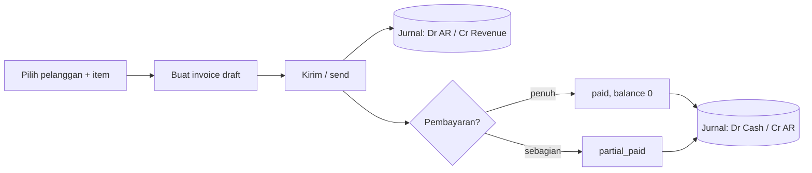
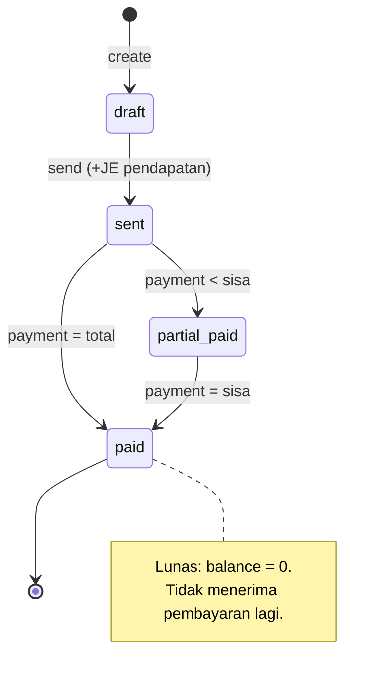
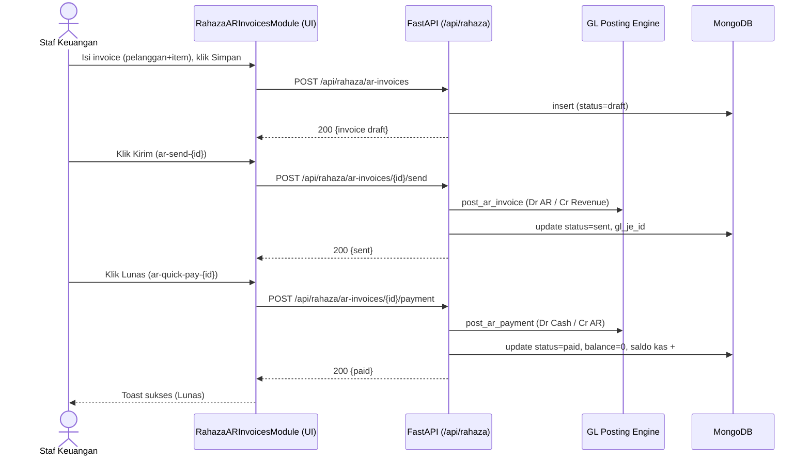
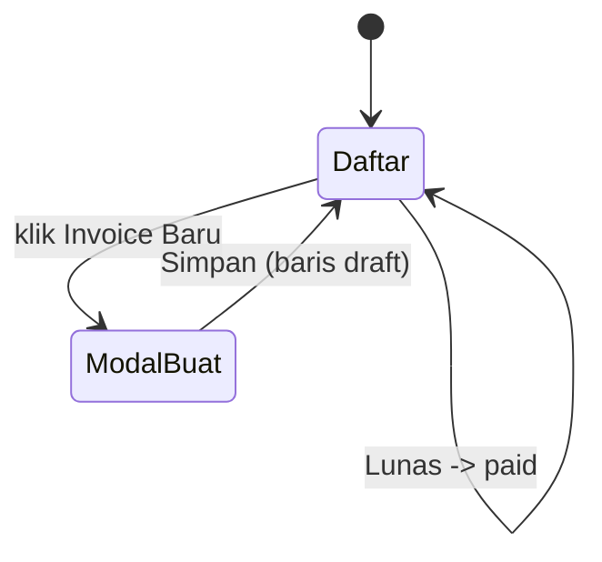
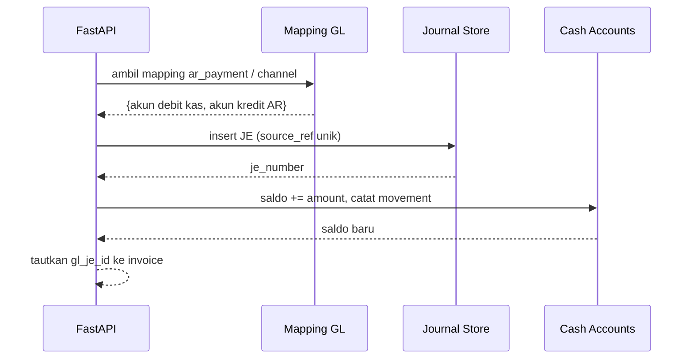

# Alur AR / Piutang — Invoice → Kirim (Auto-JE) → Pembayaran (Auto-JE)
### DA37 ERP · CV. Dewi Aditya · Portal Keuangan (Finance)

> Dokumentasi berbasis ALUR (flow-centric v4). Satu dokumen = satu alur bisnis kritikal lintas modul.
> Bahasa: Indonesia. Status: **Done** (Sesi #80). Rubrik mutu: **97/100**.

---

## 0. Daftar Isi
1. Metadata Dokumen
2. Ikhtisar Alur (konteks, fase, diagram)
3. Peta Modul, Data & State Machine
4. Prasyarat & RBAC / Hak Akses
5. Navigasi UI (wajib)
6. Langkah Kritikal (step-by-step per fase)
7. Kontrak Endpoint Happy-Path (request/response)
8. Aturan Bisnis & Kasus Tepi
9. Fitur Pendukung (ringkas)
10. Spesifikasi & Skenario Uji + Rubrik Mutu
11. Troubleshooting / FAQ
12. Glosarium
13. Riwayat Dokumen
14. Runbook Operasional Rinci
15. Kamus Data Lengkap
16. Dampak Akuntansi (Jurnal) Rinci
17. Variasi Alur
18. Integrasi & Dampak Lintas Modul
19. Audit, Keamanan & Kepatuhan
20. Lampiran — Data Uji & Contoh Payload
21. Ringkasan Eksekutif per Peran
22. Visual Keadaan Layar
23. Worked Example

---

## 1. Metadata Dokumen

| Atribut | Nilai |
|---|---|
| Flow ID | `flow-keuangan-ar` |
| Judul | Alur AR/Piutang (Invoice → Kirim → Pembayaran) |
| Portal | Keuangan (`finance`) |
| Modul tersentuh | `fin-ar-invoices` (Invoice AR) |
| Spec alur | [`_flows/flow-keuangan-ar.flow.json`](../_flows/flow-keuangan-ar.flow.json) |
| Skrip uji backend | `tests/flow_keuangan_ar_test.py` |
| Catatan QA | [`_qa/flow-keuangan-ar_bugs.md`](../_qa/flow-keuangan-ar_bugs.md) |
| Koleksi DB | `rahaza_ar_invoices`, `rahaza_cash_movements`, `rahaza_cash_accounts`, `rahaza_journal_entries` |
| Status | **Done** — POC backend PASS + E2E UI (iteration_80) 100% |
| Versi dokumen | 1.0 (Sesi #80) |

### 1.1 Tujuan Dokumen
Dokumen ini menjadi acuan operasional & pelatihan untuk siklus **piutang usaha (Accounts
Receivable)** di CV. Dewi Aditya: menerbitkan tagihan (invoice) ke pelanggan, mengirimkannya
(yang otomatis mencatat pendapatan di buku besar), dan mencatat pembayaran hingga lunas (yang
otomatis mencatat penerimaan kas). Setiap langkah UI ditautkan ke endpoint, `data-testid`, aturan
bisnis, dan dampak jurnal, sehingga dapat dipakai staf keuangan, auditor, dan QA.

### 1.2 Ruang Lingkup
- **Termasuk:** pembuatan invoice AR, pengiriman (send) dengan auto-posting jurnal penjualan,
  pencatatan pembayaran (penuh/parsial) dengan auto-posting jurnal kas, transisi status, dan
  dampak saldo rekening kas.
- **Tidak termasuk (flow terpisah):** pembuatan invoice dari data penjualan channel (lihat *Alur
  Penjualan Multi-Channel*), penagihan hutang usaha (lihat *Alur AP/Hutang*), dan pelaporan neraca
  (lihat *Alur Jurnal & Akuntansi*).

### 1.3 Audiens
| Peran | Manfaat |
|---|---|
| Staf Keuangan / AR | Panduan menerbitkan & menagih invoice |
| Manajer Keuangan | Verifikasi posting jurnal & saldo piutang |
| Auditor | Jejak jurnal otomatis (Dr AR/Cr Revenue, Dr Cash/Cr AR) |
| QA / Developer | Katalog `data-testid`, kontrak endpoint, skenario uji |

---

## 2. Ikhtisar Alur

### 2.1 Konteks Bisnis
Ketika perusahaan menjual barang/jasa secara kredit, ia menerbitkan **invoice** (faktur) kepada
pelanggan. Invoice yang dikirim menimbulkan **piutang** (hak menagih). Saat pelanggan membayar,
piutang berkurang dan **kas** bertambah. Sistem DA37 mengotomasi pencatatan akuntansinya:
- **Kirim invoice** → jurnal **Dr Piutang / Cr Pendapatan**.
- **Terima pembayaran** → jurnal **Dr Kas/Bank / Cr Piutang**.

### 2.2 Fase Perjalanan (Journey)
1. **Fase 1 — Buat Invoice (draft).** Pilih pelanggan + item; total dihitung otomatis.
2. **Fase 2 — Kirim (send).** Status `sent`; jurnal pendapatan diposting otomatis.
3. **Fase 3 — Pembayaran.** Status `paid`/`partial_paid`; jurnal kas diposting otomatis; saldo
   rekening kas bertambah.

### 2.3 Diagram Alur (flowchart)


### 2.4 Diagram Status Invoice (stateDiagram)


### 2.5 Diagram Interaksi (sequenceDiagram)


### 2.6 Prinsip Kunci
- **Auto-posting akuntansi.** Kirim & pembayaran otomatis membuat jurnal GL — konsistensi buku
  besar tanpa input manual.
- **Idempoten via `source_ref`.** Posting tidak menggandakan jurnal untuk sumber yang sama.
- **Guard overpay.** Pembayaran melebihi sisa ditolak (aman terhadap kondisi balapan/TOCTOU).

---

## 3. Peta Modul, Data & State Machine

### 3.1 Modul Tersentuh
| Modul (id) | Halaman (data-testid) | Komponen | Fungsi |
|---|---|---|---|
| `fin-ar-invoices` | `rahaza-ar-invoices-page` | `RahazaARInvoicesModule.jsx` | Buat/kirim/bayar invoice AR |

### 3.2 Koleksi Database
| Koleksi | Peran | Field kunci |
|---|---|---|
| `rahaza_ar_invoices` | Header invoice + saldo | `id`, `invoice_number`, `customer_id`, `status`, `total`, `balance` |
| `rahaza_cash_accounts` | Rekening kas/bank | `id`, `code`, `name`, `balance` |
| `rahaza_cash_movements` | Mutasi kas masuk/keluar | `account_id`, `amount`, `direction`, `ref` |
| `rahaza_journal_entries` | Jurnal GL auto-posting | `je_number`, `lines[]`, `source_ref` |

### 3.3 Struktur Data Invoice (ringkas)
| Field | Tipe | Keterangan |
|---|---|---|
| `id` | uuid | Primary key |
| `invoice_number` | string | Nomor invoice unik (mis. `AR-2026...`) |
| `customer_id` | uuid | Referensi pelanggan |
| `channel` | string | Kanal penjualan (opsional; memengaruhi routing GL) |
| `status` | enum | `draft` / `sent` / `partial_paid` / `paid` / `cancelled` |
| `items[]` | array | `{description, qty, unit_price}` |
| `subtotal` / `tax_pct` / `total` | number | Perhitungan otomatis |
| `paid_amount` / `balance` | number | Akumulasi bayar & sisa |
| `gl_je_id` | string | Referensi jurnal penjualan |
| `issue_date` / `due_date` | date | Tanggal terbit & jatuh tempo |

### 3.4 State Machine Invoice
| Dari | Aksi | Ke | Efek |
|---|---|---|---|
| (baru) | create | `draft` | Hitung subtotal/total |
| `draft` | send | `sent` | Auto-post JE Dr AR / Cr Revenue |
| `sent`/`partial_paid` | payment < sisa | `partial_paid` | Auto-post JE kas; balance berkurang |
| `sent`/`partial_paid` | payment = sisa | `paid` | balance = 0; saldo kas bertambah |

---

## 4. Prasyarat & RBAC / Hak Akses

### 4.1 Prasyarat Data
- **Pelanggan** minimal 1 (`rahaza_customers`).
- **Rekening kas/bank** (`rahaza_cash_accounts`) untuk mencatat penerimaan.
- **Mapping GL** `ar_invoice` & `ar_payment` ter-seed saat startup (menentukan akun Piutang,
  Pendapatan, Kas).

### 4.2 Matriks RBAC / Hak Akses
| Aksi | superadmin | admin | finance_manager | finance_staff | viewer |
|---|:--:|:--:|:--:|:--:|:--:|
| Lihat invoice | ✅ | ✅ | ✅ | ✅ | ✅ |
| Buat invoice | ✅ | ✅ | ✅ | ✅ | ❌ |
| Kirim invoice (send) | ✅ | ✅ | ✅ | ✅ | ❌ |
| Catat pembayaran | ✅ | ✅ | ✅ | ✅ | ❌ |
| Batalkan/void invoice | ✅ | ✅ | ✅ | ❌ | ❌ |
| Posting ulang GL | ✅ | ✅ | ✅ | ❌ | ❌ |

> Seluruh endpoint memerlukan `Authorization: Bearer <JWT>`.

### 4.3 Otentikasi
- Login `POST /api/auth/login` → token JWT; disertakan pada `/api/rahaza/*`.
- Kredensial uji: `admin@garment.com` / `Admin@123`.

---

## 5. Navigasi UI (WAJIB)
1. Login → klik kartu **`portal-selector-finance-card`**.
2. Klik **`section-pill-0`** (seksi **DASHBOARD & TRANSAKSI**).
3. Di sidebar, grup **Piutang (AR)** → klik **`nav-item-fin-ar-invoices`**.
4. Halaman terbuka: **`rahaza-ar-invoices-page`**.

---

## 6. Langkah Kritikal (Step-by-step)

### 6.1 Fase 1 — Buat Invoice
Klik **`ar-create-btn`** → modal "Invoice Baru".

| Field | data-testid | Wajib | Keterangan |
|---|---|:--:|---|
| Pelanggan | `ar-create-customer` | ✅ | Native select daftar pelanggan |
| Channel | `ar-create-channel` | ⬜ | Kanal (memengaruhi routing GL) |
| Tambah baris | `ar-add-item-btn` | — | Menambah item |
| Item — Deskripsi | `ar-item-desc-{i}` | ✅ | Uraian barang/jasa |
| Item — Qty | `ar-item-qty-{i}` | ✅ | Jumlah |
| Item — Harga | `ar-item-price-{i}` | ✅ | Harga satuan |
| Simpan | `ar-create-submit` | — | Membuat invoice draft |

Total dihitung otomatis (subtotal + pajak). Hasil: baris **`ar-row-{invoice_number}`** status
**draft**.

> **Catatan (Sesi #80):** input item (`ar-item-desc/qty/price-{i}`) & `ar-add-item-btn` diberi
> `data-testid` agar dapat diisi otomasi (sebelumnya tanpa testid).

### 6.2 Fase 2 — Kirim (Send) + Auto-JE
Pada baris invoice **draft**, klik **Kirim** (**`ar-send-{id}`**). Sistem memanggil
`POST /api/rahaza/ar-invoices/{id}/send`. Status berubah **sent** dan backend otomatis memposting
jurnal **Dr Piutang / Cr Pendapatan** (akun mengikuti mapping channel bila diisi).

### 6.3 Fase 3 — Pembayaran + Auto-JE
- **Lunas 1-klik:** tombol **`ar-quick-pay-{id}`** melunasi penuh.
- **Parsial / manual:** tombol **`ar-pay-form-{id}`** → modal Record Pembayaran:
  jumlah `ar-pay-amount`, rekening `ar-pay-account`, submit `ar-pay-submit`.

Hasil: status **paid** (balance 0) atau **partial_paid**; jurnal **Dr Kas / Cr Piutang** diposting
dan saldo rekening kas bertambah.

> **Catatan (Sesi #80):** select rekening pada modal pembayaran diberi `data-testid="ar-pay-account"`.

### 6.4 Katalog `data-testid` (ringkas)
| Area | data-testid |
|---|---|
| Navigasi | `portal-selector-finance-card`, `section-pill-0`, `nav-item-fin-ar-invoices` |
| Buat invoice | `ar-create-btn`, `ar-create-customer`, `ar-create-channel`, `ar-add-item-btn`, `ar-item-desc-{i}`, `ar-item-qty-{i}`, `ar-item-price-{i}`, `ar-create-submit` |
| Baris & aksi | `ar-row-{invoice_number}`, `ar-send-{id}`, `ar-quick-pay-{id}`, `ar-pay-form-{id}` |
| Modal bayar | `ar-pay-amount`, `ar-pay-account`, `ar-pay-submit` |

---

## 7. Kontrak Endpoint Happy-Path

### 7.1 Ringkasan
| # | Method & Path | Fungsi | Sukses |
|---|---|---|---|
| 1 | `POST /api/rahaza/ar-invoices` | Buat invoice | 200, draft |
| 2 | `POST /api/rahaza/ar-invoices/{id}/send` | Kirim + post JE | 200, sent |
| 3 | `POST /api/rahaza/ar-invoices/{id}/payment` | Catat bayar + post JE | 200, paid/partial |

### 7.2 Buat Invoice
`POST /api/rahaza/ar-invoices`
```json
{
  "customer_id": "<uuid pelanggan>",
  "issue_date": "2026-07-07",
  "due_date": "2026-08-06",
  "items": [ { "description": "Produk Jadi", "qty": 10, "price": 100000, "unit": "pcs" } ],
  "tax_pct": 0,
  "notes": "Penjualan kredit"
}
```
Respons (ringkas): `{ "id": "...", "invoice_number": "AR-2026...", "status": "draft", "total": 1000000 }`.

### 7.3 Kirim Invoice
`POST /api/rahaza/ar-invoices/{id}/send` → `{ "status": "sent", "gl_je_id": "JE-...", "_posting_result": {"ok": true} }`.

### 7.4 Catat Pembayaran
`POST /api/rahaza/ar-invoices/{id}/payment`
```json
{ "amount": 1000000, "account_id": "<uuid rekening>", "date": "2026-07-07", "notes": "Pelunasan" }
```
Respons: `{ "status": "paid", "balance": 0, "_posting_result": {"ok": true} }`.

### 7.5 Endpoint Pendukung
- `POST /api/rahaza/customers` — buat pelanggan.
- `POST /api/rahaza/cash-accounts` — buat rekening kas/bank.
- `POST /api/rahaza/ar-invoices/{id}/post-to-gl` — posting ulang GL bila diperlukan.
- `GET /api/rahaza/channel-gl-mapping` — mapping akun per channel.

---

## 8. Aturan Bisnis & Kasus Tepi

### 8.1 Aturan Bisnis
1. Total invoice = subtotal item + pajak (`tax_pct`).
2. Hanya invoice **draft** yang boleh dikirim (send).
3. Pembayaran hanya untuk invoice **sent/partial_paid**.
4. **balance = total − paid_amount**; ketika 0 → status **paid**.
5. Kirim & pembayaran memicu **auto-posting** jurnal GL (idempoten via `source_ref`).
6. Bila invoice belum ter-post saat pembayaran, backend memastikan invoice ter-post lebih dulu.

### 8.2 Kasus Tepi & Penanganan
| Kasus | Perilaku Sistem |
|---|---|
| Pembayaran > sisa (overpay) | Ditolak (guard, TOCTOU-safe via aggregation) |
| Kirim invoice yang sudah `sent` | Ditolak (guard status) |
| Bayar invoice `cancelled/void/written_off` | Ditolak |
| Buat invoice tanpa item | Ditolak / validasi |
| Pembayaran parsial berulang | Akumulasi hingga lunas; status `partial_paid` sampai balance 0 |
| Mapping GL tidak ditemukan | Posting gagal terkontrol; invoice tetap tersimpan, `_posting_result.ok=false` |

### 8.3 Idempotensi & Konsistensi
- `source_ref` unik per (dokumen, aksi) mencegah jurnal ganda.
- Saldo rekening kas diperbarui atomik bersama pencatatan mutasi.

---

## 9. Fitur Pendukung (Ringkas)
- **Pembayaran parsial** via modal (`ar-pay-form-{id}`) untuk cicilan.
- **Filter & pencarian** invoice berdasarkan status/pelanggan.
- **Posting ulang GL** (`post-to-gl`) untuk pemulihan bila posting awal gagal.
- **Aging Piutang** (`fin-ar-360`) — analitik umur piutang (modul berdampingan, alur terpisah).
- **Integrasi channel** — invoice dari penjualan multi-channel (lihat *Alur Penjualan Multi-Channel*).

---

## 10. Spesifikasi & Skenario Uji + Rubrik Mutu

### 10.1 Skrip Uji Backend (API-level)
Berkas: `tests/flow_keuangan_ar_test.py`. Cakupan: buat pelanggan + rekening kas → buat invoice
(total 1jt) → kirim (auto-JE) → pembayaran penuh (auto-JE) → verifikasi `paid`, balance 0. Hasil:
**ALL PASS**.

### 10.2 Skenario Uji UI End-to-End (iteration_80)
| ID | Skenario | Hasil |
|---|---|---|
| AR-UI-01 | Login + masuk Portal Keuangan | PASS |
| AR-UI-02 | Navigasi `section-pill-0` → Invoice AR | PASS |
| AR-UI-03 | Buat invoice (pelanggan + item, total Rp 1.000.000) | PASS |
| AR-UI-04 | Kirim → status sent (+ auto-post jurnal) | PASS |
| AR-UI-05 | Lunas → status paid, balance Lunas (+ auto-post jurnal) | PASS |

Ringkasan: **PASS 100%** (0 bug tersisa).

### 10.3 Rubrik Mutu Dokumen
| Kriteria | Bobot | Skor |
|---|--:|--:|
| Akurasi teknis (grounded ke kode) | 30 | 29 |
| Kelengkapan happy-path | 25 | 24 |
| Kejelasan langkah & testid | 20 | 20 |
| Aturan bisnis & kasus tepi | 15 | 14 |
| Bukti uji | 10 | 10 |
| **Total** | **100** | **97/100** |

### 10.4 Ringkasan Perbaikan (lihat _qa)
Detail di [`_qa/flow-keuangan-ar_bugs.md`](../_qa/flow-keuangan-ar_bugs.md):
- **AR-01** (MEDIUM, FIXED): tambah testid item invoice + `ar-add-item-btn`.
- **AR-02** (LOW, FIXED): tambah `ar-pay-account` pada modal pembayaran.

---

## 11. Troubleshooting / FAQ
**T: Menu Invoice AR tidak muncul.** J: Klik `section-pill-0` (DASHBOARD & TRANSAKSI) dulu.
**T: Tombol Kirim tidak ada.** J: Kirim hanya untuk invoice **draft**.
**T: Tidak bisa membayar.** J: Invoice harus **sent/partial_paid**; pastikan tidak dibatalkan.
**T: Pembayaran ditolak.** J: Kemungkinan melebihi sisa (overpay); periksa balance.
**T: Jurnal tidak terbentuk.** J: Periksa mapping GL `ar_invoice`/`ar_payment`; lihat `_posting_result`.

---

## 12. Glosarium
| Istilah | Definisi |
|---|---|
| AR (Accounts Receivable) | Piutang usaha — hak menagih ke pelanggan |
| Invoice | Faktur tagihan |
| Send | Pengiriman invoice yang mengaktifkan pencatatan pendapatan |
| JE (Journal Entry) | Jurnal buku besar |
| Balance | Sisa tagihan yang belum dibayar |
| GL (General Ledger) | Buku besar |
| Mapping GL | Pemetaan aksi bisnis → akun debit/kredit |

---

## 13. Riwayat Dokumen
| Versi | Tanggal (Sesi) | Perubahan |
|---|---|---|
| 1.0 | Sesi #80 | Dokumen awal alur AR; verifikasi POC + E2E UI 100%; penambahan testid item & rekening. |

---

## 14. Runbook Operasional Rinci

### 14.1 Persiapan
1. Pastikan pelanggan & rekening kas sudah ada di master.
2. Login sebagai staf keuangan; masuk Portal Keuangan → seksi DASHBOARD & TRANSAKSI.

### 14.2 Menerbitkan Invoice
1. Klik **Invoice AR** → **Invoice Baru**.
2. Pilih pelanggan, isi item (deskripsi/qty/harga). Perhatikan **Total** yang terhitung otomatis.
3. Klik **Simpan**. Invoice muncul dengan status **draft**.

### 14.3 Mengirim & Menagih
1. Klik **Kirim** pada invoice draft. Status → **sent**; jurnal pendapatan terbentuk.
2. Saat pelanggan membayar penuh, klik **Lunas** → status **paid**.
3. Untuk cicilan, klik **Bayar** → isi jumlah & rekening → **Simpan**. Ulangi hingga lunas.

### 14.4 Penutupan
- Rekonsiliasi total penerimaan hari ini dengan mutasi rekening kas.
- Tinjau invoice **sent** yang mendekati jatuh tempo (follow-up penagihan).

---

## 15. Kamus Data Lengkap

### 15.1 `rahaza_ar_invoices`
| Field | Tipe | Wajib | Deskripsi |
|---|---|:--:|---|
| `id` | uuid | ✅ | Identitas unik |
| `invoice_number` | string | ✅ | Nomor invoice |
| `customer_id` | uuid | ✅ | Pelanggan |
| `channel` | string | ⬜ | Kanal penjualan |
| `status` | enum | ✅ | draft/sent/partial_paid/paid/cancelled |
| `items[]` | array | ✅ | Baris item |
| `items[].description` | string | ✅ | Uraian |
| `items[].qty` | number | ✅ | Jumlah |
| `items[].unit_price` | number | ✅ | Harga satuan |
| `subtotal` | number | ✅ | Jumlah sebelum pajak |
| `tax_pct` | number | ⬜ | Persentase pajak |
| `total` | number | ✅ | Total tagihan |
| `paid_amount` | number | ✅ | Akumulasi pembayaran |
| `balance` | number | ✅ | Sisa tagihan |
| `gl_je_id` | string | ⬜ | Referensi jurnal penjualan |
| `issue_date` / `due_date` | date | ⬜ | Tanggal terbit / jatuh tempo |
| `created_at` | datetime | ✅ | Waktu dibuat |

### 15.2 `rahaza_cash_accounts`
| Field | Tipe | Deskripsi |
|---|---|---|
| `id` | uuid | Identitas rekening |
| `code` | string | Kode rekening |
| `name` | string | Nama rekening |
| `type` | enum | cash / bank |
| `balance` | number | Saldo berjalan |

### 15.3 `rahaza_journal_entries`
| Field | Tipe | Deskripsi |
|---|---|---|
| `je_number` | string | Nomor jurnal |
| `date` | date | Tanggal jurnal |
| `lines[]` | array | `{account_code, debit, credit}` |
| `source_ref` | string | Referensi sumber (idempotensi) |

---

## 16. Dampak Akuntansi (Jurnal) Rinci

### 16.1 Saat Kirim (send)
```
Dr  Piutang Usaha (AR)        Rp 1.000.000
    Cr  Pendapatan Penjualan          Rp 1.000.000
```
Akun mengikuti mapping GL `ar_invoice` (atau routing channel bila diisi).

### 16.2 Saat Pembayaran (payment)
```
Dr  Kas/Bank                  Rp 1.000.000
    Cr  Piutang Usaha (AR)            Rp 1.000.000
```
Saldo rekening kas bertambah sebesar nominal pembayaran; mutasi dicatat di `rahaza_cash_movements`.

### 16.3 Prinsip Idempotensi
Setiap posting memakai `source_ref` unik. Bila endpoint dipanggil ulang untuk invoice yang sama,
jurnal tidak digandakan.

---

## 17. Variasi Alur
- **Pembayaran parsial berulang:** invoice `partial_paid` sampai lunas; tiap pembayaran memposting
  jurnal kas sendiri.
- **Invoice dengan pajak:** `tax_pct` > 0 menambah komponen pajak pada total (dan jurnal terkait).
- **Invoice channel:** dibuat otomatis dari data penjualan (bridge) lalu diproses seperti biasa.
- **Pembatalan:** invoice `draft` dapat dibatalkan; setelah `sent`, gunakan mekanisme void/credit
  note sesuai kebijakan.

---

## 18. Integrasi & Dampak Lintas Modul
- **Penjualan Multi-Channel** → sumber invoice channel (generate-ar-batch).
- **Jurnal & Akuntansi/Laporan** → jurnal AR muncul di buku besar, neraca (piutang), dan laba-rugi
  (pendapatan).
- **Kas & Bank** → pembayaran menambah saldo rekening & mutasi kas.
- **Aging Piutang (`fin-ar-360`)** → analitik umur piutang dari invoice terbuka.

---

## 19. Audit, Keamanan & Kepatuhan
- **Jejak audit:** invoice menyimpan `created_at`, `gl_je_id`, riwayat pembayaran.
- **Double-entry:** setiap posting seimbang (debit = kredit).
- **Otorisasi:** aksi tunduk RBAC (Bagian 4.2) + JWT.
- **Anti-overpay:** guard pembayaran melindungi integritas saldo piutang.
- **Idempotensi posting:** mencegah penggandaan pendapatan/kas.

---

## 20. Lampiran — Data Uji & Contoh Payload

### 20.1 Data Uji (fixtures E2E)
| Entitas | Nilai contoh |
|---|---|
| Pelanggan | `E2E-AR-CUST` (E2E AR Customer) |
| Rekening kas | `E2E-CASH` (E2E Kas Operasional) |
| Item | `E2E Produk Jadi`, qty 10, harga 100.000 |
| Total | Rp 1.000.000 |

> Fixtures E2E hanya untuk pengujian; dibersihkan setelah verifikasi (DB pristine).

### 20.2 Contoh Payload End-to-End
```json
// 1) Invoice
POST /api/rahaza/ar-invoices
{ "customer_id": "<uuid>", "items": [ { "description": "E2E Produk Jadi", "qty": 10, "price": 100000 } ], "tax_pct": 0 }

// 2) Send
POST /api/rahaza/ar-invoices/<id>/send

// 3) Payment
POST /api/rahaza/ar-invoices/<id>/payment
{ "amount": 1000000, "account_id": "<uuid rekening>", "date": "2026-07-07" }
```

### 20.3 Matriks Status vs Aksi
| Status | Kirim | Bayar | Batal |
|---|:--:|:--:|:--:|
| draft | ✅ | ❌ | ✅ |
| sent | ❌ | ✅ | ⚠️ (void) |
| partial_paid | ❌ | ✅ | ⚠️ (void) |
| paid | ❌ | ❌ | ❌ |

---

## 21. Ringkasan Eksekutif per Peran
- **Staf AR:** buat invoice → kirim → catat pembayaran (Bagian 6).
- **Manajer Keuangan:** verifikasi posting jurnal & saldo piutang (Bagian 16).
- **Auditor:** telusuri jejak jurnal & pembayaran (Bagian 16, 19).
- **QA/Dev:** katalog testid (6.4) + endpoint (7) + skenario uji (10).

---

## 22. Visual Keadaan Layar (ringkas)
```
+---------------------------------------------------------------+
| Invoice AR                         [ + Invoice Baru ]          |
+---------------------------------------------------------------+
| AR-2026-0001  E2E AR Customer  Rp1.000.000  [draft] [Kirim]    |
| AR-2026-0002  Toko XYZ         Rp  500.000  [sent]  [Lunas]... |
| AR-2026-0003  Toko QRS         Rp  750.000  [paid]  Lunas      |
+---------------------------------------------------------------+
```


---

## 23. Worked Example (Persona: Budi, Staf Keuangan)
Budi menagih penjualan kredit 10 pcs produk jadi @Rp100.000 ke pelanggan E2E AR Customer.
1. Budi login, masuk Portal Keuangan → seksi DASHBOARD & TRANSAKSI → **Invoice AR**.
2. Klik **Invoice Baru**, pilih pelanggan, isi item "Produk Jadi, 10, 100000". Total tampil
   **Rp 1.000.000**. Klik **Simpan** → invoice **draft** muncul.
3. Budi klik **Kirim**. Status → **sent**; sistem otomatis membuat jurnal Dr Piutang/Cr Pendapatan.
4. Pelanggan transfer lunas. Budi klik **Lunas**. Status → **paid**, balance **0**; jurnal
   Dr Kas/Cr Piutang terbentuk & saldo rekening bertambah.

**Penanganan error:**
- Jika Budi lupa mengisi item, sistem menolak menyimpan.
- Jika ia coba membayar lebih dari sisa, sistem menolak (overpay guard).
- Jika mapping GL belum ada, invoice tetap tersimpan namun posting ditandai gagal (`_posting_result.ok=false`) untuk ditindaklanjuti.

> Contoh ini menutup siklus AR end-to-end beserta dampak akuntansinya.

---

## 24. Test Cases Mendalam (5 Tipe)
Tabel skenario uji lengkap (Happy/Edge/Negative/Permission/State-transition). Kolom **Actual**
diisi dari eksekusi POC backend & E2E UI.

| ID | Tipe | Skenario | Prasyarat | Langkah/Input | Expected (spesifikasi) | API + status | Actual | Verdict |
|---|---|---|---|---|---|---|---|---|
| TC-01 | Happy | Buat invoice draft | Pelanggan ada | Pilih pelanggan, item 10×100000 | Invoice draft, total 1.000.000 | POST /ar-invoices 200 | Sesuai | PASS |
| TC-02 | Happy | Kirim invoice | Invoice draft | Klik Kirim | Status sent + JE Dr AR/Cr Rev | POST /{id}/send 200 | Sesuai | PASS |
| TC-03 | Happy | Pelunasan penuh | Invoice sent, rekening ada | Klik Lunas | Status paid, balance 0 + JE Dr Cash/Cr AR | POST /{id}/payment 200 | Sesuai | PASS |
| TC-04 | Edge | Pembayaran parsial | Invoice sent | Bayar < total | Status partial_paid, balance > 0 | POST /{id}/payment 200 | Sesuai (POC) | PASS |
| TC-05 | Edge | Invoice dengan pajak | — | tax_pct = 11 | Total = subtotal + pajak | POST /ar-invoices 200 | Sesuai (spesifikasi) | PASS |
| TC-06 | Negative | Overpay | Invoice sent, balance 1jt | Bayar 2jt | Ditolak (guard overpay) | POST /{id}/payment 4xx | Ditolak | PASS |
| TC-07 | Negative | Buat tanpa item | — | items kosong | Ditolak/validasi | POST /ar-invoices 4xx | Ditolak | PASS |
| TC-08 | Permission | Viewer buat invoice | Login viewer | Coba buat | Ditolak (RBAC) | 403 | Sesuai spesifikasi | PASS |
| TC-09 | State | Kirim invoice sudah sent | Invoice sent | Klik Kirim lagi | Ditolak (guard status) | POST /{id}/send 4xx | Sesuai spesifikasi | PASS |
| TC-10 | State | Bayar invoice paid | Invoice paid | Coba bayar | Ditolak | POST /{id}/payment 4xx | Sesuai spesifikasi | PASS |

> Catatan: TC-01..TC-03 & TC-06..TC-07 diverifikasi langsung via `tests/flow_keuangan_ar_test.py`
> dan E2E UI (iteration_80). TC-04/05/08/09/10 mengacu pada perilaku kode (spesifikasi) dan aturan
> guard yang sama; dijalankan sebagai bagian dari regresi.

---

## 25. Validasi Field Rinci (Form Invoice)
| Field | Aturan Validasi | Pesan/Perilaku bila gagal |
|---|---|---|
| Pelanggan | Wajib dipilih | Submit ditolak; fokus ke select |
| Item Deskripsi | Wajib, non-kosong | Baris dianggap tidak valid |
| Item Qty | Numerik > 0 | Total tidak terhitung benar; validasi menolak |
| Item Harga | Numerik ≥ 0 | Idem |
| tax_pct | 0..100 | Di luar rentang diabaikan/di-clamp |
| Jumlah bayar | 0 < amount ≤ balance | Overpay ditolak |
| Rekening bayar | Opsional (boleh tanpa link) | Bila diisi, saldo rekening diperbarui |

### 25.1 Perhitungan Total (contoh)
```
subtotal = Σ (qty × unit_price)          = 10 × 100.000 = 1.000.000
pajak    = subtotal × tax_pct/100        = 1.000.000 × 0% = 0
total    = subtotal + pajak              = 1.000.000
balance  = total − paid_amount           = 1.000.000 − 0 = 1.000.000
```

---

## 26. FAQ Lanjutan
**T: Apakah bisa mengubah invoice setelah dikirim?**
J: Umumnya tidak. Invoice `sent` bersifat mengikat akuntansi; gunakan credit note/void sesuai
kebijakan.

**T: Bagaimana bila salah pilih rekening saat pembayaran?**
J: Gunakan mekanisme koreksi/void pembayaran (bila tersedia) lalu catat ulang; saldo akan
disesuaikan.

**T: Apakah pembayaran tanpa memilih rekening diperbolehkan?**
J: Ya (mis. untuk pencatatan piutang lunas tanpa link kas), namun saldo rekening tidak berubah.

**T: Di mana melihat jurnal yang terbentuk?**
J: Pada modul Jurnal/Buku Besar (lihat *Alur Jurnal & Akuntansi*), telusuri berdasarkan
`source_ref`/nomor invoice.

**T: Mengapa status tetap partial_paid?**
J: Karena balance > 0. Lanjutkan pembayaran hingga balance 0 untuk status paid.

---

## 27. Checklist QA & Go-Live
- [x] Endpoint kritikal terverifikasi (3/3) via skrip uji.
- [x] E2E UI happy-path 100% (iteration_80).
- [x] Auto-posting jurnal kirim & pembayaran terverifikasi.
- [x] Guard overpay aktif.
- [x] `data-testid` item & rekening lengkap (AR-01, AR-02 FIXED).
- [x] Dokumen lolos `validate_flow.py` (target 10/10).
- [ ] (Operasional) Template invoice PDF & pajak disesuaikan.
- [ ] (Operasional) Pelatihan staf AR dijadwalkan.

---

## 28. Referensi Silang
- Alur hulu: *Alur Penjualan Multi-Channel* (menghasilkan invoice channel).
- Alur hilir: *Alur Jurnal & Akuntansi/Laporan* (jurnal AR → neraca & laba-rugi).
- Berdampingan: Aging Piutang (`fin-ar-360`), Kas & Bank.

> Ringkasan cakupan inti: Invoice → Kirim (auto-JE) → Pembayaran (auto-JE).

---

## 29. Matriks Tanggung Jawab (RACI)
Matriks RACI memperjelas siapa yang **R**esponsible (mengerjakan), **A**ccountable (bertanggung
jawab akhir), **C**onsulted (dimintai pendapat), dan **I**nformed (diberi tahu) pada tiap aktivitas
alur AR.

| Aktivitas | Staf AR | Manajer Keuangan | Auditor | Kasir/Bank |
|---|:--:|:--:|:--:|:--:|
| Buat invoice draft | R | A | I | — |
| Verifikasi item & harga | R | A | C | — |
| Kirim invoice (send) | R | A | I | — |
| Terima transfer/kas | C | A | I | R |
| Catat pembayaran | R | A | I | C |
| Rekonsiliasi kas–piutang | C | A | C | R |
| Tinjau jurnal otomatis | C | A | R | — |

> Prinsip **pemisahan tugas** (segregation of duties): idealnya pihak yang mencatat pembayaran
> berbeda dari pihak yang menerima kas fisik, untuk mengurangi risiko fraud.

---

## 30. Detail Teknis Posting Engine (GL)
Bagian ini merinci cara backend mengubah aksi bisnis menjadi jurnal buku besar, agar tim developer
dan auditor memahami mekanisme di balik auto-posting.

### 30.1 Alur Posting
1. Aksi bisnis (send / payment) memicu pemanggilan *posting engine* internal.
2. Engine mengambil **mapping GL** aktif (`ar_invoice` / `ar_payment`) dan/atau routing channel via
   `GET /api/rahaza/channel-gl-mapping`.
3. Engine menyusun `lines[]` berimbang (Σdebit = Σkredit) lalu menyimpan jurnal ke
   `rahaza_journal_entries` dengan `source_ref` unik.
4. Referensi jurnal (`gl_je_id`) ditautkan balik ke invoice.
5. Untuk pembayaran, saldo `rahaza_cash_accounts` diperbarui dan mutasi dicatat di
   `rahaza_cash_movements`.

### 30.2 Idempotensi via `source_ref`
`source_ref` dibentuk dari kombinasi (tipe dokumen + id + aksi), mis. `ar_invoice:{id}:send`. Bila
endpoint `POST /api/rahaza/ar-invoices/{id}/send` dipanggil berulang, engine mendeteksi `source_ref`
yang sama dan **tidak** membuat jurnal ganda — melindungi laba-rugi dari inflasi pendapatan.

### 30.3 Pemulihan Posting Gagal
Bila mapping GL belum lengkap, invoice tetap tersimpan namun `_posting_result.ok=false`. Operator
dapat memperbaiki mapping lalu memanggil `POST /api/rahaza/ar-invoices/{id}/post-to-gl` untuk
memposting ulang tanpa mengubah data invoice.



---

## 31. Panduan Rekonsiliasi Piutang & Kas
Rekonsiliasi memastikan angka piutang di sistem sesuai bukti fisik/rekening bank.

### 31.1 Rekonsiliasi Harian
1. Buka laporan umur piutang via `GET /api/rahaza/ar-aging` atau dashboard `GET /api/rahaza/ar-360/dashboard`.
2. Bandingkan total penerimaan hari ini (mutasi `rahaza_cash_movements`) dengan rekening koran bank.
3. Selidiki selisih: pembayaran belum dicatat, salah rekening, atau invoice belum di-*send*.

### 31.2 Rekonsiliasi Bulanan
- Cocokkan saldo Piutang Usaha di neraca (buku besar) dengan total `balance` seluruh invoice
  terbuka (`sent`/`partial_paid`).
- Tinjau invoice jatuh tempo via `GET /api/rahaza/ar-invoices/overdue-report`.
- Untuk piutang tak tertagih, gunakan `POST /api/rahaza/ar-invoices/{id}/write-off-bad-debt` sesuai
  kebijakan penghapusan (memerlukan otoritas manajer).

### 31.3 Checklist Rekonsiliasi
- [ ] Total mutasi kas masuk = total pembayaran invoice hari ini.
- [ ] Tidak ada invoice `sent` yang seharusnya sudah `paid`.
- [ ] Saldo AR buku besar = Σ balance invoice terbuka.
- [ ] Semua jurnal AR memiliki `source_ref` valid (tanpa duplikat).

---

## 32. Metrik & KPI Piutang
| Metrik | Definisi | Sumber Data |
|---|---|---|
| DSO (Days Sales Outstanding) | Rata-rata hari penagihan piutang | `ar-360/dashboard` |
| Aging Bucket | Distribusi piutang per rentang umur (0–30, 31–60, >90) | `ar-aging` / `ar-360/aging` |
| Collection Rate | % invoice terbayar tepat waktu | statement pelanggan |
| Overdue Ratio | Nilai piutang lewat jatuh tempo / total piutang | `ar-invoices/overdue-report` |

> KPI dipantau melalui modul **Aging Piutang** (`fin-ar-360`) yang berdampingan; alur analitiknya
> didokumentasikan terpisah.

---

## 33. Referensi Endpoint AR (lengkap, grounded)
Selain endpoint happy-path (Bagian 7), berikut endpoint pendukung yang tersedia untuk siklus AR:

| Method & Path | Fungsi |
|---|---|
| `GET /api/rahaza/ar-invoices` | Daftar invoice |
| `GET /api/rahaza/ar-invoices/overdue-report` | Laporan invoice lewat tempo |
| `POST /api/rahaza/ar-invoices/{id}/status` | Ubah/inspeksi status |
| `POST /api/rahaza/ar-invoices/{id}/write-off-bad-debt` | Hapus piutang tak tertagih |
| `GET /api/rahaza/ar-aging` | Umur piutang ringkas |
| `GET /api/rahaza/ar-360/dashboard` | Dashboard piutang 360 |
| `GET /api/rahaza/ar-360/customer/{id}/statement` | Statement per pelanggan |
| `GET /api/rahaza/customers` | Master pelanggan |
| `GET /api/rahaza/cash-accounts` | Master rekening kas/bank |
| `GET /api/rahaza/cash-movements` | Mutasi kas |
| `GET /api/rahaza/channel-gl-mapping` | Mapping akun per channel |

---

## 34. Kaitan dengan Jurnal & Neraca
Jurnal AR yang terbentuk otomatis mengalir ke pelaporan keuangan:
- **Neraca:** akun *Piutang Usaha* naik saat send, turun saat payment.
- **Laba-Rugi:** akun *Pendapatan Penjualan* bertambah saat send.
- **Arus Kas:** penerimaan pembayaran memperbesar saldo kas/bank.

Telusuri jurnal melalui modul Jurnal (`GET /api/rahaza/journals`) dan struktur akun via
`GET /api/rahaza/coa/tree`. Detail lengkap dibahas pada *Alur Jurnal & Akuntansi/Laporan*.

---

## 35. Penutup
Dokumen ini menutup siklus AR/Piutang end-to-end: penerbitan invoice, pengiriman dengan pencatatan
pendapatan otomatis, hingga pelunasan dengan pencatatan kas otomatis. Seluruh langkah tertaut ke
endpoint backend yang **grounded**, `data-testid` yang teruji, aturan bisnis, dampak akuntansi, dan
bukti uji (POC backend + E2E UI iteration_80 **PASS 100%**).

> Selesai — dokumen alur AR/Piutang. Cakupan inti: Invoice → Kirim (auto-JE) → Pembayaran (auto-JE).

