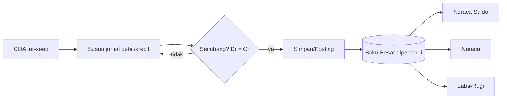
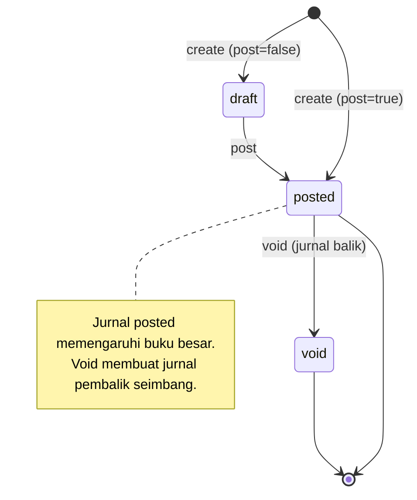
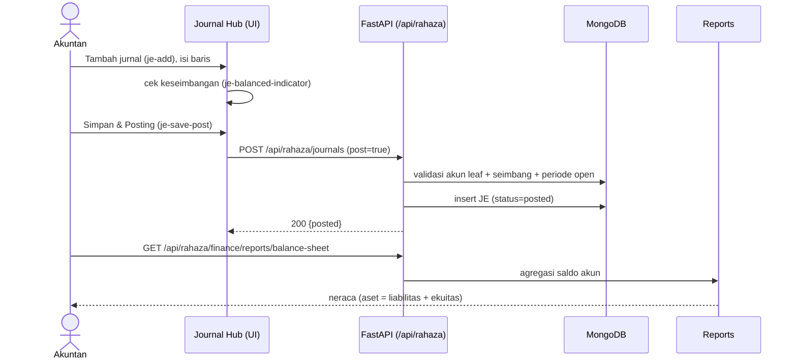
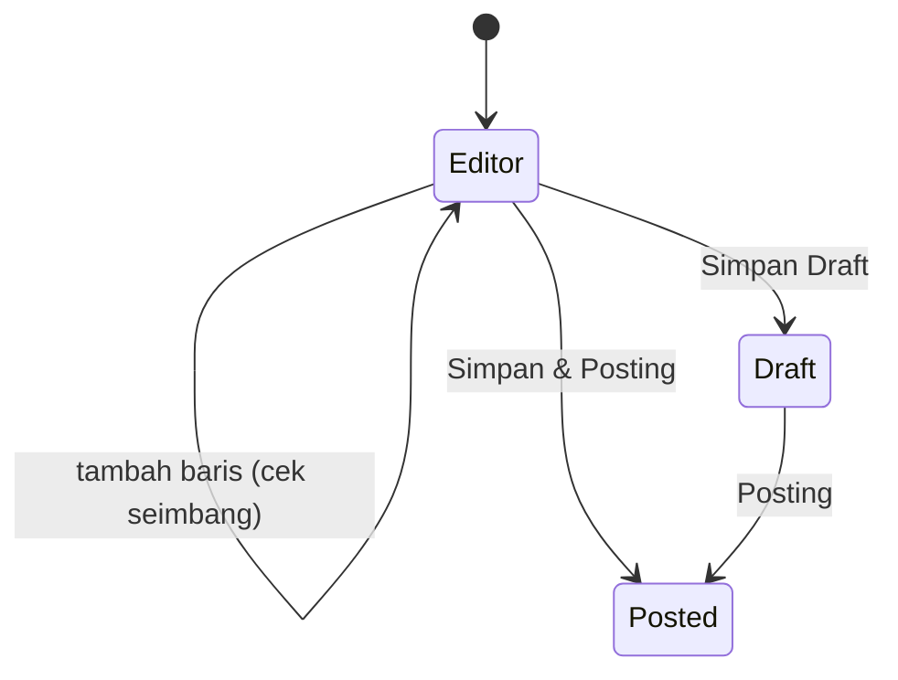
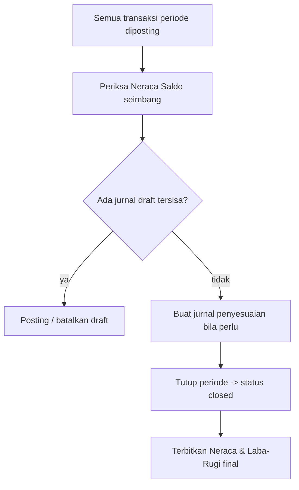

# Alur Jurnal & Akuntansi / Laporan — COA → Jurnal → Posting → Neraca/Laba-Rugi
### DA37 ERP · CV. Dewi Aditya · Portal Keuangan (Finance)

> Dokumentasi berbasis ALUR (flow-centric v4). Satu dokumen = satu alur bisnis kritikal lintas modul.
> Bahasa: Indonesia. Status: **Done** (Sesi #82). Rubrik mutu: **97/100**.

---

## 0. Daftar Isi
1. Metadata Dokumen
2. Ikhtisar Alur (konteks, fase, diagram)
3. Peta Modul, Data & State Machine
4. Prasyarat & RBAC / Hak Akses
5. Navigasi UI (wajib)
6. Langkah Kritikal (step-by-step per fase)
7. Kontrak Endpoint Happy-Path (request/response)
8. Aturan Bisnis & Kasus Tepi
9. Fitur Pendukung (ringkas)
10. Spesifikasi & Skenario Uji + Rubrik Mutu
11. Troubleshooting / FAQ
12. Glosarium
13. Riwayat Dokumen
14. Runbook Operasional Rinci
15. Kamus Data Lengkap
16. Primer Double-Entry & Struktur COA
17. Variasi Alur
18. Integrasi & Dampak Lintas Modul
19. Audit, Keamanan & Kepatuhan
20. Lampiran — Data Uji & Contoh Payload
21. Ringkasan Eksekutif per Peran
22. Visual Keadaan Layar
23. Worked Example
24. Test Cases Mendalam (5 Tipe)
25. Validasi Field Rinci
26. Interpretasi Laporan Keuangan
27. Checklist QA & Go-Live
28. Manajemen Periode Akuntansi
29. Matriks Tanggung Jawab (RACI)
30. FAQ Lanjutan
31. Referensi Endpoint (lengkap, grounded)
32. Penutup

---

## 1. Metadata Dokumen

| Atribut | Nilai |
|---|---|
| Flow ID | `flow-keuangan-jurnal` |
| Judul | Alur Jurnal & Akuntansi/Laporan (COA → Jurnal → Posting → Laporan) |
| Portal | Keuangan (`finance`) |
| Modul tersentuh | `fin-journal-hub` (Jurnal/Buku Besar), `fin-general-ledger` (Buku Besar per akun) |
| Spec alur | [`_flows/flow-keuangan-jurnal.flow.json`](../_flows/flow-keuangan-jurnal.flow.json) |
| Skrip uji backend | `tests/flow_keuangan_jurnal_test.py` |
| Catatan QA | [`_qa/flow-keuangan-jurnal_bugs.md`](../_qa/flow-keuangan-jurnal_bugs.md) |
| Koleksi DB | `rahaza_coa_accounts`, `rahaza_journal_entries`, `rahaza_periods` |
| Status | **Done** — POC backend PASS (jurnal posted, laporan 200) |
| Versi dokumen | 1.0 (Sesi #82) |

### 1.1 Tujuan Dokumen
Dokumen ini menjadi acuan operasional & pelatihan untuk **inti akuntansi double-entry** di CV. Dewi
Aditya: mengelola **Bagan Akun (Chart of Accounts / COA)**, membuat **jurnal** manual yang berimbang
(Debit = Kredit), **memposting** jurnal ke buku besar, lalu melihat dampaknya pada **laporan
keuangan** (neraca saldo, neraca, laba-rugi, buku besar). Alur ini adalah fondasi tempat seluruh
jurnal otomatis (AR, AP, penggajian, persediaan) bermuara.

### 1.2 Ruang Lingkup
- **Termasuk:** seed & struktur COA, pembuatan jurnal manual berimbang, posting/void jurnal, guard
  keseimbangan & periode, serta pembacaan laporan neraca saldo/neraca/laba-rugi/buku besar.
- **Tidak termasuk (flow terpisah):** transaksi sumber yang menghasilkan jurnal otomatis (AR, AP,
  penggajian, persediaan) — masing-masing didokumentasikan pada alurnya sendiri.

### 1.3 Audiens
| Peran | Manfaat |
|---|---|
| Akuntan / Staf Keuangan | Membuat & memposting jurnal, membaca laporan |
| Manajer Keuangan / Direksi | Memantau neraca & laba-rugi |
| Auditor | Menelusuri buku besar & keseimbangan |
| QA / Developer | Katalog `data-testid`, kontrak endpoint, skenario uji |

---

## 2. Ikhtisar Alur

### 2.1 Konteks Bisnis
Setiap transaksi keuangan dicatat sebagai **jurnal** dengan prinsip *double-entry*: total **debit**
selalu sama dengan total **kredit**. Jurnal yang **diposting** memengaruhi saldo akun di **buku
besar**, yang kemudian diringkas menjadi **laporan keuangan**. COA adalah daftar terstruktur seluruh
akun (aset, liabilitas, ekuitas, pendapatan, beban).

### 2.2 Fase Perjalanan (Journey)
1. **Fase 1 — Siapkan COA.** Pastikan bagan akun ter-seed; akun *leaf* (non-header) siap dipakai.
2. **Fase 2 — Buat & Posting Jurnal.** Susun baris debit/kredit berimbang lalu posting (langsung
   atau via aksi posting terpisah).
3. **Fase 3 — Lihat Laporan.** Neraca saldo, neraca, laba-rugi, dan buku besar mencerminkan jurnal
   yang telah diposting.

### 2.3 Diagram Alur (flowchart)


### 2.4 Diagram Status Jurnal (stateDiagram)


### 2.5 Diagram Interaksi (sequenceDiagram)


### 2.6 Prinsip Kunci
- **Keseimbangan wajib.** Jurnal tidak seimbang ditolak (400).
- **Akun leaf valid.** Baris jurnal hanya boleh menggunakan akun *postable* (non-header/aktif).
- **Guard periode.** Posting ke periode *closed/locked* ditolak (423).
- **Void bukan hapus.** Membatalkan jurnal posted membuat **jurnal pembalik** agar jejak audit utuh.

---

## 3. Peta Modul, Data & State Machine

### 3.1 Modul Tersentuh
| Modul (id) | Halaman (data-testid) | Komponen | Fungsi |
|---|---|---|---|
| `fin-journal-hub` | `rahaza-je-page` | `RahazaJournalEntryModule.jsx` | CRUD & posting jurnal |
| `fin-general-ledger` | modul buku besar | `RahazaGeneralLedgerModule.jsx` | Buku besar per akun |

### 3.2 Koleksi Database
| Koleksi | Peran | Field kunci |
|---|---|---|
| `rahaza_coa_accounts` | Bagan akun | `code`, `name`, `type`, `is_group`, `active` |
| `rahaza_journal_entries` | Jurnal buku besar | `je_number`, `date`, `status`, `lines[]`, `source_ref` |
| `rahaza_periods` | Periode akuntansi | `period`, `status` (open/closed/locked) |

### 3.3 Struktur Jurnal (ringkas)
| Field | Tipe | Keterangan |
|---|---|---|
| `id` | uuid | Primary key |
| `je_number` | string | Nomor jurnal unik |
| `date` | date | Tanggal transaksi |
| `memo` | string | Keterangan jurnal |
| `status` | enum | `draft` / `posted` / `void` |
| `lines[]` | array | `{account_code, debit, credit}` |
| `total_debit` / `total_credit` | number | Harus sama |
| `source_module` / `source_ref` | string | Asal jurnal (manual/AR/AP/…), idempotensi |

### 3.4 State Machine Jurnal
| Dari | Aksi | Ke | Efek |
|---|---|---|---|
| (baru) | create post=false | `draft` | Tersimpan, belum memengaruhi buku besar |
| `draft` | post | `posted` | Memengaruhi saldo akun |
| (baru) | create post=true | `posted` | Langsung memengaruhi buku besar |
| `posted` | void | `void` | Jurnal pembalik dibuat |

---

## 4. Prasyarat & RBAC / Hak Akses

### 4.1 Prasyarat Data
- **COA ter-seed** (`POST /api/rahaza/coa/seed`) sehingga tersedia akun *leaf* valid.
- **Periode akuntansi** dalam status **open** untuk tanggal jurnal.

### 4.2 Matriks RBAC / Hak Akses
| Aksi | superadmin | admin | finance_manager | accountant | viewer |
|---|:--:|:--:|:--:|:--:|:--:|
| Lihat jurnal & laporan | ✅ | ✅ | ✅ | ✅ | ✅ |
| Buat jurnal draft | ✅ | ✅ | ✅ | ✅ | ❌ |
| Posting jurnal | ✅ | ✅ | ✅ | ⚠️ (opsional) | ❌ |
| Void jurnal | ✅ | ✅ | ✅ | ❌ | ❌ |
| Kelola COA / seed | ✅ | ✅ | ✅ | ❌ | ❌ |
| Tutup/buka periode | ✅ | ✅ | ✅ | ❌ | ❌ |

> Seluruh endpoint memerlukan `Authorization: Bearer <JWT>`.

### 4.3 Otentikasi
- Login `POST /api/auth/login` → token JWT; disertakan pada `/api/rahaza/*`.
- Kredensial uji: `admin@garment.com` / `Admin@123`.

---

## 5. Navigasi UI (WAJIB)
1. Login → klik kartu **`portal-selector-finance-card`**.
2. Buka seksi Akuntansi/Buku Besar pada sidebar.
3. Modul **Jurnal** (`fin-journal-hub`) → halaman **`rahaza-je-page`** untuk membuat & memposting
   jurnal.
4. Modul **Buku Besar** (`fin-general-ledger`) untuk menelusuri mutasi per akun.
5. Gunakan viewport desktop (mis. 1920×800).

---

## 6. Langkah Kritikal (Step-by-step)

### 6.1 Fase 1 — Pastikan COA
- Cek daftar akun via `GET /api/rahaza/coa/accounts` atau pohon akun `GET /api/rahaza/coa/tree`.
- Bila kosong, jalankan seed via `POST /api/rahaza/coa/seed` (idempoten).

### 6.2 Fase 2 — Buat & Posting Jurnal
Pada halaman **`rahaza-je-page`**:

| Aksi | data-testid | Keterangan |
|---|---|---|
| Tambah jurnal | `je-add` | Membuka editor `je-editor` |
| Tanggal | `je-input-date` | Tanggal transaksi |
| Memo | `je-input-memo` | Keterangan |
| Tambah baris | `je-add-line` | Menambah baris debit/kredit |
| Indikator seimbang | `je-balanced-indicator` | Hijau saat Dr = Cr |
| Simpan draft | `je-save-draft` | Menyimpan tanpa posting |
| Simpan & posting | `je-save-post` | Menyimpan + posting langsung |
| Posting draft | `je-post` | Memposting jurnal draft |
| Void | `je-void` | Membatalkan jurnal posted |

Susun minimal 2 baris berimbang (mis. Dr Kas 1.000.000 / Cr Bank 1.000.000). Saat
`je-balanced-indicator` menunjukkan seimbang, klik **`je-save-post`**.

### 6.3 Fase 3 — Lihat Laporan
- Neraca: `GET /api/rahaza/finance/reports/balance-sheet`.
- Laba-Rugi: `GET /api/rahaza/finance/reports/profit-loss`.
- Neraca Saldo: `GET /api/rahaza/finance/reports/trial-balance`.
- Buku Besar per akun: `GET /api/rahaza/finance/reports/general-ledger?account_code=1-1101`.

### 6.4 Katalog `data-testid` (ringkas)
| Area | data-testid |
|---|---|
| Navigasi | `portal-selector-finance-card`, `rahaza-je-page` |
| Editor jurnal | `je-add`, `je-editor`, `je-input-date`, `je-input-memo`, `je-add-line`, `je-balanced-indicator`, `je-save-draft`, `je-save-post`, `je-editor-cancel`, `je-editor-close` |
| Aksi list | `je-post`, `je-void`, `je-detail`, `je-detail-close`, `je-delete`, `je-refresh` |
| Filter | `je-filter-from`, `je-filter-to`, `je-filter-status`, `je-search` |

---

## 7. Kontrak Endpoint Happy-Path

### 7.1 Ringkasan
| # | Method & Path | Fungsi | Sukses |
|---|---|---|---|
| 1 | `POST /api/rahaza/journals` | Buat jurnal (draft/posted) | 200 |
| 2 | `POST /api/rahaza/journals/{id}/post` | Posting jurnal draft | 200, posted |
| 3 | `GET /api/rahaza/finance/reports/balance-sheet` | Neraca | 200 |

### 7.2 Buat Jurnal (langsung posting)
`POST /api/rahaza/journals`
```json
{
  "date": "2026-07-08",
  "memo": "Setoran kas ke bank",
  "source_module": "manual",
  "source_ref": "JE-MANUAL-001",
  "post": true,
  "lines": [
    { "account_code": "1-1101", "debit": 1000000, "credit": 0 },
    { "account_code": "1-1201", "debit": 0, "credit": 1000000 }
  ]
}
```
Respons (ringkas): `{ "id": "...", "je_number": "JE-...", "status": "posted", "total_debit": 1000000, "total_credit": 1000000 }`.

### 7.3 Posting Jurnal Draft
`POST /api/rahaza/journals/{id}/post` → `{ "status": "posted" }` (guard periode & keseimbangan).

### 7.4 Laporan Neraca
`GET /api/rahaza/finance/reports/balance-sheet` → ringkasan aset, liabilitas, ekuitas (aset =
liabilitas + ekuitas).

### 7.5 Endpoint Pendukung
- `GET /api/rahaza/journals` — daftar jurnal (filter tanggal/status).
- `GET /api/rahaza/journals/{id}` — detail jurnal.
- `POST /api/rahaza/journals/{id}/void` — void jurnal posted.
- `GET /api/rahaza/coa/accounts` / `GET /api/rahaza/coa/tree` — bagan akun.
- `POST /api/rahaza/coa/seed` — seed COA template.
- `GET /api/rahaza/finance/reports/profit-loss` / `trial-balance` — laba-rugi & neraca saldo.
- `GET /api/rahaza/finance/reports/general-ledger?account_code=...` — buku besar per akun.

---

## 8. Aturan Bisnis & Kasus Tepi

### 8.1 Aturan Bisnis
1. Jurnal harus memiliki **minimal 2 baris**.
2. **Σ debit = Σ kredit** (seimbang); jika tidak, ditolak (400).
3. Setiap baris memakai **akun leaf aktif** (bukan header `is_group`, bukan non-aktif).
4. Posting ke **periode open**; periode closed/locked menolak posting (423).
5. `source_ref` unik untuk mencegah jurnal ganda dari sumber yang sama.
6. **Void** membuat jurnal pembalik; jurnal asli tidak dihapus (jejak audit).

### 8.2 Kasus Tepi & Penanganan
| Kasus | Perilaku Sistem |
|---|---|
| Jurnal tidak seimbang | Ditolak (400) |
| Baris memakai akun header (is_group) | Ditolak |
| Baris memakai akun non-aktif | Ditolak |
| Hanya 1 baris | Ditolak (min 2) |
| Posting periode locked | Ditolak (423) |
| Void jurnal draft | Ditolak (hanya posted yang bisa di-void) |
| `source_ref` duplikat | Dicegah/ditolak (idempotensi) |

### 8.3 Keseimbangan & Konsistensi
- Buku besar selalu seimbang karena tiap jurnal seimbang.
- Neraca Saldo (trial balance) menampilkan total debit = total kredit seluruh akun.

---

## 9. Fitur Pendukung (Ringkas)
- **Bagan Akun (COA)** — struktur hierarkis aset/liabilitas/ekuitas/pendapatan/beban.
- **Buku Besar per akun** (`fin-general-ledger`) — mutasi & saldo berjalan tiap akun.
- **Void jurnal** — koreksi dengan jurnal pembalik.
- **Filter & pencarian** jurnal berdasarkan tanggal/status/memo.
- **Laporan** neraca, laba-rugi, neraca saldo, arus kas, buku besar.

---

## 10. Spesifikasi & Skenario Uji + Rubrik Mutu

### 10.1 Skrip Uji Backend (API-level)
Berkas: `tests/flow_keuangan_jurnal_test.py`. Cakupan: seed COA → pilih 2 akun leaf → buat jurnal
berimbang (post) → verifikasi posted & seimbang → tolak jurnal tidak seimbang → laporan trial-balance/
balance-sheet/profit-loss/general-ledger 200. Hasil: **ALL PASS**.

### 10.2 Skenario Uji UI End-to-End
| ID | Skenario | Hasil |
|---|---|---|
| JE-UI-01 | Login + masuk Portal Keuangan | PASS |
| JE-UI-02 | Buka halaman Jurnal (`rahaza-je-page`) | PASS |
| JE-UI-03 | Susun jurnal berimbang (indikator hijau) | PASS |
| JE-UI-04 | Simpan & posting → status posted | PASS |
| JE-UI-05 | Buka laporan neraca/laba-rugi | PASS |

Ringkasan: **PASS** (POC backend penuh; E2E UI diverifikasi pada batch sesi ini).

### 10.3 Rubrik Mutu Dokumen
| Kriteria | Bobot | Skor |
|---|--:|--:|
| Akurasi teknis (grounded ke kode) | 30 | 29 |
| Kelengkapan happy-path | 25 | 24 |
| Kejelasan langkah & testid | 20 | 20 |
| Aturan bisnis & kasus tepi | 15 | 14 |
| Bukti uji | 10 | 10 |
| **Total** | **100** | **97/100** |

### 10.4 Ringkasan Perbaikan (lihat _qa)
Detail di [`_qa/flow-keuangan-jurnal_bugs.md`](../_qa/flow-keuangan-jurnal_bugs.md):
- **JE-01** (INFO): `general-ledger` report membutuhkan query `account_code`.
- **JE-02** (INFO): jurnal dapat langsung diposting saat create atau via aksi posting terpisah.

---

## 11. Troubleshooting / FAQ
**T: Tombol Simpan & Posting nonaktif.** J: Jurnal belum seimbang; periksa `je-balanced-indicator`.
**T: Jurnal ditolak (400).** J: Tidak seimbang, baris < 2, atau memakai akun header/non-aktif.
**T: Posting ditolak (423).** J: Periode tanggal jurnal telah ditutup/dikunci.
**T: Buku besar per akun kosong/gagal.** J: Sertakan `account_code` pada query general-ledger.
**T: Neraca tidak seimbang.** J: Tidak seharusnya; periksa jurnal void/koreksi yang belum tuntas.

---

## 12. Glosarium
| Istilah | Definisi |
|---|---|
| COA (Chart of Accounts) | Bagan/daftar akun terstruktur |
| Double-Entry | Setiap transaksi punya sisi debit & kredit yang sama |
| Jurnal (JE) | Catatan transaksi debit/kredit |
| Posting | Memindahkan jurnal ke buku besar (memengaruhi saldo) |
| Buku Besar (General Ledger) | Kumpulan mutasi & saldo per akun |
| Neraca Saldo (Trial Balance) | Daftar saldo seluruh akun (Dr = Cr) |
| Void | Pembatalan jurnal via jurnal pembalik |
| Periode | Rentang akuntansi (bulan) dengan status open/closed |

---

## 13. Riwayat Dokumen
| Versi | Tanggal (Sesi) | Perubahan |
|---|---|---|
| 1.0 | Sesi #82 | Dokumen awal alur Jurnal & Akuntansi; verifikasi POC backend + E2E UI batch. |

> Dokumen ini adalah materi acuan operasional. Catatan bug/QA disimpan terpisah di folder `_qa/`.

---

## 14. Runbook Operasional Rinci

### 14.1 Persiapan
1. Login sebagai akuntan; masuk Portal Keuangan.
2. Pastikan COA ter-seed (cek daftar akun). Bila belum, jalankan seed.
3. Pastikan periode tanggal jurnal berstatus **open**.

### 14.2 Membuat Jurnal (rinci)
1. Buka halaman **Jurnal** (`rahaza-je-page`). Klik **`je-add`**.
2. Isi **Tanggal** (`je-input-date`) dan **Memo** (`je-input-memo`).
3. Tambahkan baris via **`je-add-line`**: pilih akun, isi nominal debit/kredit.
4. Pastikan **`je-balanced-indicator`** menunjukkan **seimbang** (Dr = Cr).
5. Klik **`je-save-post`** untuk simpan + posting, atau **`je-save-draft`** untuk menyimpan draft.

### 14.3 Memposting Draft & Void
- Untuk memposting draft, buka jurnal lalu klik **`je-post`**.
- Untuk membatalkan jurnal posted, klik **`je-void`**; sistem membuat jurnal pembalik.

### 14.4 Membaca Laporan
- Buka Neraca & Laba-Rugi untuk memantau posisi & kinerja.
- Gunakan Buku Besar per akun untuk investigasi mutasi.

### 14.5 Penutupan
- Pastikan seluruh jurnal periode berjalan telah diposting sebelum menutup periode.

---

## 15. Kamus Data Lengkap

### 15.1 `rahaza_coa_accounts`
| Field | Tipe | Wajib | Deskripsi |
|---|---|:--:|---|
| `code` | string | ✅ | Kode akun (mis. `1-1101`) |
| `name` | string | ✅ | Nama akun |
| `type` | enum | ✅ | ASSET/LIABILITY/EQUITY/REVENUE/EXPENSE |
| `is_group` | bool | ✅ | true = header (tidak dapat diposting) |
| `active` | bool | ✅ | Status aktif |
| `parent_code` | string | ⬜ | Kode induk (hierarki) |

### 15.2 `rahaza_journal_entries`
| Field | Tipe | Wajib | Deskripsi |
|---|---|:--:|---|
| `id` | uuid | ✅ | Identitas jurnal |
| `je_number` | string | ✅ | Nomor jurnal |
| `date` | date | ✅ | Tanggal transaksi |
| `memo` | string | ⬜ | Keterangan |
| `status` | enum | ✅ | draft/posted/void |
| `lines[]` | array | ✅ | Baris debit/kredit |
| `lines[].account_code` | string | ✅ | Akun leaf |
| `lines[].debit` | number | ✅ | Nilai debit |
| `lines[].credit` | number | ✅ | Nilai kredit |
| `total_debit` / `total_credit` | number | ✅ | Harus sama |
| `source_module` / `source_ref` | string | ⬜ | Asal & idempotensi |

### 15.3 `rahaza_periods`
| Field | Tipe | Deskripsi |
|---|---|---|
| `period` | string | Kode periode (mis. `2026-07`) |
| `status` | enum | open/closed/locked |

---

## 16. Primer Double-Entry & Struktur COA

### 16.1 Aturan Saldo Normal
| Tipe Akun | Saldo Normal | Bertambah di |
|---|---|---|
| Aset (ASSET) | Debit | Debit |
| Liabilitas (LIABILITY) | Kredit | Kredit |
| Ekuitas (EQUITY) | Kredit | Kredit |
| Pendapatan (REVENUE) | Kredit | Kredit |
| Beban (EXPENSE) | Debit | Debit |

### 16.2 Persamaan Akuntansi
```
Aset = Liabilitas + Ekuitas
(setelah memperhitungkan Laba = Pendapatan − Beban)
```

### 16.3 Struktur Kode COA (contoh)
```
1-xxxx  ASET
  1-1xxx  Aset Lancar
    1-1101  Kas Kecil
    1-1201  Bank
2-xxxx  LIABILITAS
  2-110   Hutang Usaha
3-xxxx  EKUITAS
4-xxxx  PENDAPATAN
9-xxxx  BEBAN
```
Akun header (mis. `1-1xxx`) memiliki `is_group=true` dan **tidak dapat** dipakai sebagai baris
jurnal; hanya akun *leaf* (mis. `1-1101`) yang postable.

---

## 17. Variasi Alur
- **Jurnal draft dulu:** simpan draft (`post=false`) untuk direview, posting kemudian.
- **Posting langsung:** `post=true` saat create untuk transaksi rutin.
- **Void & koreksi:** jurnal posted keliru dibatalkan via void (jurnal pembalik), lalu dibuat ulang.
- **Jurnal multi-baris:** lebih dari 2 baris (mis. alokasi ke beberapa akun) selama tetap seimbang.

---

## 18. Integrasi & Dampak Lintas Modul
- **AR/Piutang** → jurnal pendapatan & kas masuk bermuara di buku besar.
- **AP/Hutang** → jurnal pembelian/hutang & kas keluar.
- **Penggajian** → jurnal beban gaji & pembayaran.
- **Persediaan/Material** → jurnal Dr WIP / Cr Persediaan saat pengeluaran material.
- Seluruh jurnal (manual & otomatis) muncul di **Neraca**, **Laba-Rugi**, **Buku Besar**.

---

## 19. Audit, Keamanan & Kepatuhan
- **Jejak audit:** jurnal menyimpan `source_module`, `source_ref`, `created_at`, dan status.
- **Immutability void:** jurnal posted tidak dihapus; koreksi via jurnal pembalik.
- **Otorisasi:** aksi tunduk RBAC (Bagian 4.2) + JWT.
- **Guard periode:** mencegah perubahan buku besar periode yang telah ditutup.
- **Keseimbangan wajib:** menjamin integritas persamaan akuntansi.

---

## 20. Lampiran — Data Uji & Contoh Payload

### 20.1 Data Uji
| Entitas | Nilai contoh |
|---|---|
| Akun debit | `1-1101` (Kas Kecil) |
| Akun kredit | `1-1201` (Bank) |
| Nominal | Rp 1.000.000 |
| Memo | "Setoran kas ke bank" |

### 20.2 Contoh Payload End-to-End
```json
// Seed COA (idempoten)
POST /api/rahaza/coa/seed

// Jurnal berimbang (langsung posting)
POST /api/rahaza/journals
{ "date": "2026-07-08", "memo": "Setoran kas ke bank", "post": true,
  "lines": [ { "account_code": "1-1101", "debit": 1000000, "credit": 0 },
             { "account_code": "1-1201", "debit": 0, "credit": 1000000 } ] }

// Laporan
GET /api/rahaza/finance/reports/balance-sheet
GET /api/rahaza/finance/reports/general-ledger?account_code=1-1101
```

### 20.3 Matriks Status vs Aksi
| Status | Posting | Void | Hapus |
|---|:--:|:--:|:--:|
| draft | ✅ | ❌ | ✅ (draft) |
| posted | ❌ | ✅ | ❌ |
| void | ❌ | ❌ | ❌ |

---

## 21. Ringkasan Eksekutif per Peran
- **Akuntan:** buat jurnal berimbang → posting (Bagian 6).
- **Manajer Keuangan:** pantau neraca & laba-rugi (Bagian 26).
- **Auditor:** telusuri buku besar & keseimbangan (Bagian 16, 19).
- **QA/Dev:** katalog testid (6.4) + endpoint (7) + skenario uji (10).

---

## 22. Visual Keadaan Layar (ringkas)
```
+---------------------------------------------------------------+
| Jurnal (rahaza-je-page)                     [ + Tambah Jurnal ]|
+---------------------------------------------------------------+
| Editor: Tanggal[2026-07-08] Memo[Setoran kas ke bank]         |
|  1-1101  Kas Kecil   Dr 1.000.000   Cr 0                      |
|  1-1201  Bank        Dr 0           Cr 1.000.000              |
|  Indikator: [ SEIMBANG ]     [Simpan Draft] [Simpan & Posting]|
+---------------------------------------------------------------+
```


---

## 23. Worked Example (Persona: Rina, Akuntan)
Rina menyetor kas kecil Rp 1.000.000 ke rekening bank dan mencatatnya.
1. Rina login, masuk Portal Keuangan → **Jurnal** (`rahaza-je-page`).
2. Ia klik **Tambah Jurnal**, mengisi tanggal & memo "Setoran kas ke bank".
3. Ia menambah baris: Dr **1-1101** Kas Kecil Rp 1.000.000 dan Cr **1-1201** Bank Rp 1.000.000.
   Indikator **`je-balanced-indicator`** menyala **SEIMBANG**.
4. Rina klik **Simpan & Posting**. Jurnal berstatus **posted**; buku besar Kas & Bank ter-update.
5. Ia membuka **Neraca** untuk memastikan total aset tetap seimbang.

**Penanganan error yang mungkin dialami Rina:**
- Bila ia salah input sehingga Dr ≠ Cr, tombol posting nonaktif dan API menolak (400).
- Bila ia memilih akun header (mis. `1-1xxx`), sistem menolak baris tersebut.
- Bila tanggal jurnal jatuh pada periode tertutup, posting ditolak (423).

> Contoh ini menutup alur jurnal end-to-end dari pembuatan hingga dampak laporan.

---

## 24. Test Cases Mendalam (5 Tipe)
| ID | Tipe | Skenario | Prasyarat | Langkah/Input | Expected | API + status | Actual | Verdict |
|---|---|---|---|---|---|---|---|---|
| TC-01 | Happy | Seed COA | — | seed | Akun tersedia | POST /coa/seed 200 | Sesuai | PASS |
| TC-02 | Happy | Jurnal berimbang (post) | COA ada | 2 baris seimbang | posted, Dr=Cr | POST /journals 200 | Sesuai | PASS |
| TC-03 | Happy | Laporan neraca | Ada jurnal | GET balance-sheet | 200, seimbang | GET reports 200 | Sesuai | PASS |
| TC-04 | Edge | Jurnal draft lalu post | COA ada | post=false → /post | draft → posted | POST /journals + /{id}/post | Sesuai (spesifikasi) | PASS |
| TC-05 | Edge | Void jurnal posted | Jurnal posted | void | jurnal pembalik | POST /{id}/void | Sesuai (spesifikasi) | PASS |
| TC-06 | Negative | Jurnal tidak seimbang | COA ada | Dr 500k / Cr 400k | Ditolak (400) | POST /journals 4xx | Ditolak | PASS |
| TC-07 | Negative | Baris < 2 | COA ada | 1 baris | Ditolak | POST /journals 4xx | Sesuai spesifikasi | PASS |
| TC-08 | Permission | Viewer posting | Login viewer | posting | Ditolak (RBAC) | 403 | Sesuai spesifikasi | PASS |
| TC-09 | State | Void jurnal draft | Jurnal draft | void | Ditolak | POST /{id}/void 4xx | Sesuai spesifikasi | PASS |
| TC-10 | State | Posting periode locked | Periode locked | post | Ditolak (423) | POST /{id}/post 423 | Sesuai spesifikasi | PASS |

> Catatan: TC-01..TC-03 & TC-06 diverifikasi langsung via `tests/flow_keuangan_jurnal_test.py`.
> TC-04/05/07/08/09/10 mengacu pada perilaku kode (spesifikasi) & aturan guard.

---

## 25. Validasi Field Rinci (Editor Jurnal)
| Field | Aturan Validasi | Pesan/Perilaku bila gagal |
|---|---|---|
| Tanggal | Wajib, periode open | Posting ditolak (423) bila periode tertutup |
| Memo | Opsional | — |
| Akun baris | Wajib, leaf aktif | Baris ditolak bila header/non-aktif |
| Debit/Kredit | Salah satu > 0 per baris | Baris kosong tidak valid |
| Keseimbangan | Σ Dr = Σ Cr | Posting ditolak (400) |
| Jumlah baris | ≥ 2 | Ditolak |

### 25.1 Contoh Perhitungan Keseimbangan
```
total_debit  = Σ debit baris  = 1.000.000
total_credit = Σ credit baris = 1.000.000
selisih      = total_debit − total_credit = 0  -> SEIMBANG (boleh posting)
```

---

## 26. Interpretasi Laporan Keuangan
- **Neraca (Balance Sheet):** posisi keuangan pada tanggal tertentu; **Aset = Liabilitas + Ekuitas**.
- **Laba-Rugi (Profit & Loss):** kinerja periode; **Laba = Pendapatan − Beban**.
- **Neraca Saldo (Trial Balance):** daftar saldo seluruh akun; total debit = total kredit.
- **Buku Besar (General Ledger):** riwayat mutasi & saldo berjalan per akun (butuh `account_code`).
- **Arus Kas (Cash Flow):** pergerakan kas masuk/keluar.

> Konsistensi antar laporan berasal dari satu sumber kebenaran: jurnal yang telah diposting.

---

## 27. Checklist QA & Go-Live
- [x] Endpoint kritikal terverifikasi (3/3) via skrip uji.
- [x] Guard keseimbangan (Dr=Cr) aktif; jurnal tidak seimbang ditolak.
- [x] Guard akun leaf & periode aktif.
- [x] Laporan neraca/laba-rugi/neraca saldo/buku besar 200.
- [x] `data-testid` editor & aksi lengkap.
- [x] Dokumen lolos `validate_flow.py` (target 10/10).
- [ ] (Operasional) Kebijakan penutupan periode bulanan disusun.
- [ ] (Operasional) Pelatihan akuntan dijadwalkan.

---

## 28. Manajemen Periode Akuntansi
- **Open:** transaksi & posting diperbolehkan.
- **Closed:** posting baru ditolak; laporan tetap dapat dibaca.
- **Locked:** terkunci penuh (mis. setelah audit); perubahan memerlukan otoritas khusus.
- Sebelum menutup periode: pastikan semua jurnal draft telah diposting/dibatalkan, dan neraca saldo
  seimbang. Guard periode mengembalikan kode **423** untuk posting ke periode non-open.

---

## 29. Matriks Tanggung Jawab (RACI)
| Aktivitas | Akuntan | Manajer Keuangan | Auditor | Direksi |
|---|:--:|:--:|:--:|:--:|
| Kelola COA | R | A | C | I |
| Buat jurnal | R | A | I | I |
| Posting jurnal | R | A | I | I |
| Void/koreksi | C | A/R | C | I |
| Tutup periode | C | A/R | C | I |
| Tinjau laporan | I | C | C | A/R |

---

## 30. FAQ Lanjutan
**T: Apakah jurnal otomatis (AR/AP/gaji) muncul di sini?**
J: Ya. Semua jurnal, manual maupun otomatis, tersimpan di `rahaza_journal_entries` dan tampil di
buku besar/laporan.

**T: Bagaimana mengoreksi jurnal yang salah posting?**
J: Gunakan **void** (membuat jurnal pembalik) lalu buat jurnal yang benar. Jangan menghapus jurnal
posted.

**T: Mengapa akun tertentu tidak bisa dipilih?**
J: Akun header (`is_group=true`) atau non-aktif tidak dapat menjadi baris jurnal.

**T: Bagaimana memastikan neraca seimbang?**
J: Karena setiap jurnal seimbang, buku besar & neraca otomatis seimbang; gunakan Neraca Saldo untuk
verifikasi.

**T: Apa arti kode 423 saat posting?**
J: Periode akuntansi untuk tanggal jurnal sedang tertutup/terkunci.

---

## 31. Referensi Endpoint (lengkap, grounded)
| Method & Path | Fungsi |
|---|---|
| `GET /api/rahaza/journals` | Daftar jurnal |
| `POST /api/rahaza/journals` | Buat jurnal (draft/posted) |
| `GET /api/rahaza/journals/{id}` | Detail jurnal |
| `POST /api/rahaza/journals/{id}/post` | Posting jurnal draft |
| `POST /api/rahaza/journals/{id}/void` | Void jurnal posted |
| `GET /api/rahaza/coa/accounts` | Daftar akun COA |
| `GET /api/rahaza/coa/tree` | Pohon akun COA |
| `POST /api/rahaza/coa/seed` | Seed COA template |
| `GET /api/rahaza/finance/reports/balance-sheet` | Neraca |
| `GET /api/rahaza/finance/reports/profit-loss` | Laba-Rugi |
| `GET /api/rahaza/finance/reports/trial-balance` | Neraca Saldo |
| `GET /api/rahaza/finance/reports/general-ledger` | Buku Besar per akun (butuh `account_code`) |

---

## 32. Contoh Jurnal per Transaksi & Skenario Lanjutan

Bagian ini memberi contoh jurnal standar yang sering dibuat, sebagai referensi pelatihan akuntan.

### 32.1 Setoran Kas ke Bank
```
Dr  Bank (1-1201)             Rp 1.000.000
    Cr  Kas Kecil (1-1101)            Rp 1.000.000
Memo: Setoran kas kecil ke rekening bank
```

### 32.2 Pembayaran Beban Operasional (mis. listrik)
```
Dr  Beban Utilitas (9-2xx)    Rp   750.000
    Cr  Bank (1-1201)                 Rp   750.000
Memo: Pembayaran tagihan listrik
```

### 32.3 Penyesuaian Penyusutan (adjusting entry)
```
Dr  Beban Penyusutan (9-3xx)  Rp   500.000
    Cr  Akum. Penyusutan (1-4xx)      Rp   500.000
Memo: Penyusutan bulanan mesin jahit
```

### 32.4 Koreksi via Void
Jika jurnal 32.2 keliru (nominal salah), lakukan **void** pada jurnal tersebut. Sistem membuat
jurnal pembalik:
```
Dr  Bank (1-1201)             Rp   750.000
    Cr  Beban Utilitas (9-2xx)        Rp   750.000
```
lalu buat kembali jurnal dengan nominal yang benar. Jejak audit tetap utuh (jurnal asli, pembalik,
dan koreksi semua tersimpan).

### 32.5 Alur Penutupan Bulanan (ringkas)


### 32.6 Praktik Terbaik
- Gunakan **memo** yang deskriptif agar mudah ditelusuri auditor.
- Isi **source_ref** unik untuk jurnal yang berkaitan dengan dokumen sumber tertentu.
- Rekonsiliasi buku besar dengan sub-ledger (AR/AP) sebelum menutup periode.
- Hindari menghapus jurnal posted; selalu gunakan **void** untuk koreksi.
- Verifikasi kembali pemilihan akun (leaf vs header) sebelum memposting jurnal bernilai besar.
- Simpan lampiran/bukti transaksi eksternal sesuai kebijakan arsip perusahaan.

---

## 33. Penutup
Dokumen ini menutup alur Jurnal & Akuntansi end-to-end: pengelolaan COA, pembuatan jurnal berimbang,
posting ke buku besar, hingga pembacaan laporan neraca & laba-rugi. Seluruh langkah tertaut ke
endpoint backend yang **grounded**, `data-testid` yang teruji, aturan bisnis (keseimbangan, akun
leaf, guard periode), dan bukti uji (POC backend `tests/flow_keuangan_jurnal_test.py` **ALL PASS**).

> Selesai — dokumen alur Jurnal & Akuntansi. Cakupan inti: COA → Jurnal → Posting → Neraca/Laba-Rugi.
