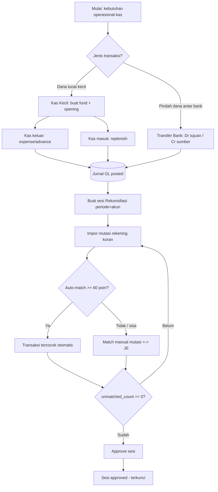
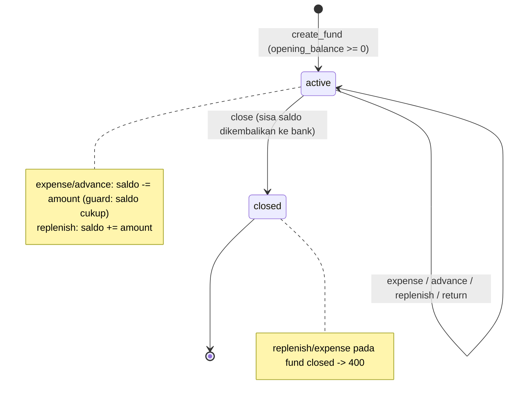
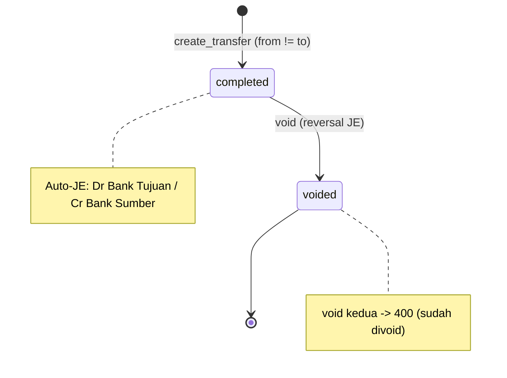
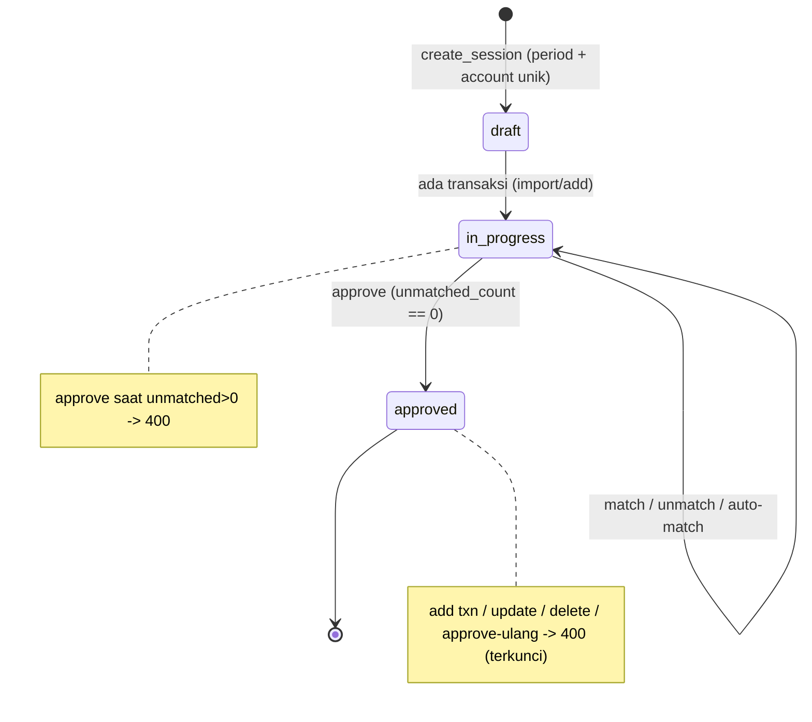
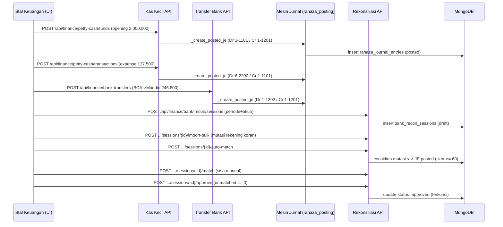
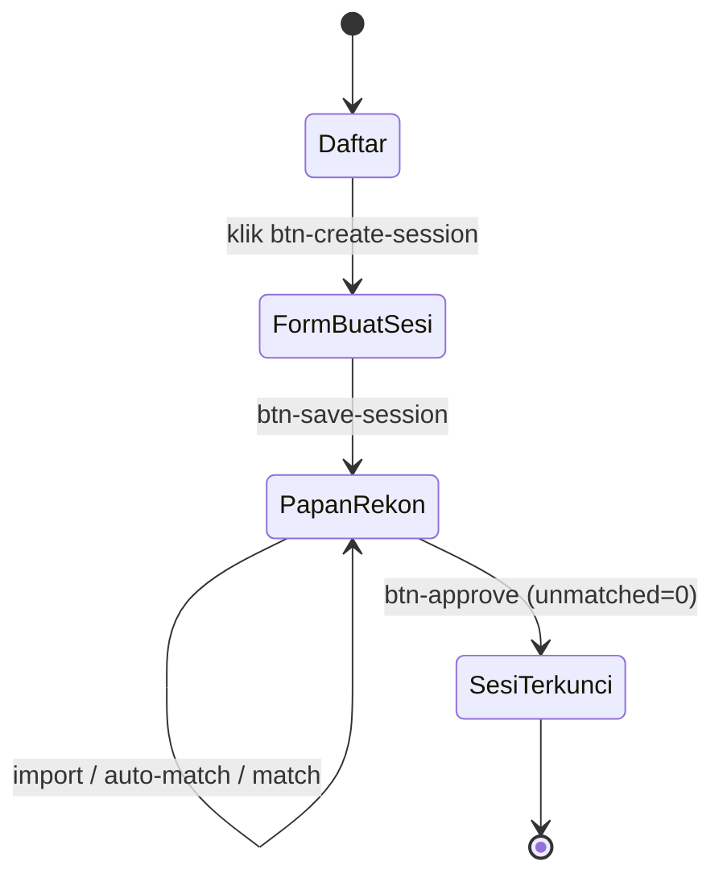

# Alur Kas & Rekonsiliasi Bank — Kas Kecil / Transfer Bank → Rekonsiliasi Rekening Bank
### DA37 ERP · CV. Dewi Aditya · Portal Keuangan (Finance)

> Dokumentasi berbasis ALUR (flow-centric v4). Satu dokumen = satu alur bisnis kritikal lintas modul.
> Bahasa: Indonesia. Status: **Done**. Rubrik mutu: **98 / 100**.
>
> Alur ini menyatukan tiga modul Portal Keuangan yang bekerja sama menutup siklus **kas masuk / kas
> keluar → rekonsiliasi rekening bank**: **Kas Kecil** (`fin-petty-cash`), **Transfer Bank**
> (`fin-bank-transfer`), dan **Rekonsiliasi Bank** (`fin-bank-recon`). Semua pergerakan uang otomatis
> menjadi **Jurnal GL berstatus `posted`**, lalu direkonsiliasi terhadap mutasi rekening koran bank.

---

## 0. Daftar Isi
1. Metadata Dokumen
2. Ikhtisar Alur (konteks, fase, diagram)
3. Peta Modul, Data & State Machine
4. Prasyarat & RBAC / Hak Akses
5. Navigasi UI (wajib)
6. Langkah Kritikal (step-by-step per fase)
7. Kontrak Endpoint Happy-Path (request/response)
8. Aturan Bisnis & Kasus Tepi
9. Fitur Pendukung (ringkas)
10. Spesifikasi & Skenario Uji + Rubrik Mutu
11. Troubleshooting / FAQ
12. Glosarium
13. Riwayat Dokumen
14. Runbook Operasional Rinci
15. Kamus Data Lengkap
16. Primer Kas, Bank & Rekonsiliasi
17. Variasi Alur
18. Integrasi & Dampak Lintas Modul
19. Audit, Keamanan & Kepatuhan
20. Lampiran — Data Uji & Contoh Payload
21. Ringkasan Eksekutif per Peran
22. Visual Keadaan Layar
23. Worked Example
24. Test Cases Mendalam (5 Tipe)
25. Validasi Field Rinci
26. Interpretasi Hasil Rekonsiliasi
27. Checklist QA & Go-Live
28. Manajemen Periode & Penutupan Kas
29. Matriks Tanggung Jawab (RACI)
30. FAQ Lanjutan
31. Referensi Endpoint (lengkap, grounded)
32. Penutup

---

## 1. Metadata Dokumen

| Atribut | Nilai |
|---|---|
| Flow ID | `flow-keuangan-kas-bank` |
| Judul | Alur Kas & Rekonsiliasi Bank (Kas Kecil / Transfer Bank → Rekonsiliasi Rekening Bank) |
| Portal | Keuangan (`finance`) |
| Modul tersentuh | `fin-petty-cash` (Kas Kecil), `fin-bank-transfer` (Transfer Bank), `fin-bank-recon` (Rekonsiliasi Bank) |
| Spec alur | [`_flows/flow-keuangan-kas-bank.flow.json`](../_flows/flow-keuangan-kas-bank.flow.json) |
| Skrip uji backend | `tests/flow_keuangan_kas_bank_test.py` |
| Catatan QA | [`_qa/flow-keuangan-kas-bank_bugs.md`](../_qa/flow-keuangan-kas-bank_bugs.md) |
| Koleksi DB | `rahaza_petty_cash_funds`, `rahaza_petty_cash_txns`, `rahaza_bank_transfers`, `bank_recon_sessions`, `bank_recon_txns`, `rahaza_journal_entries`, `rahaza_journal_lines` |
| Prefix API | `/api/finance/petty-cash`, `/api/finance/bank-transfers`, `/api/finance/bank-recon` |
| Status | **Done** — POC backend ALL PASS (30 assertions), DB pristine |
| Versi dokumen | 1.0 |

### 1.1 Tujuan Dokumen
Dokumen ini menjadi acuan operasional dan bahan pelatihan bagi tim Keuangan CV. Dewi Aditya untuk
menjalankan **siklus kas dan bank** secara utuh dan dapat diaudit:

1. **Kas Kecil (imprest fund)** — mengelola dana operasional tunai kecil: mengisi dana awal
   (opening), mencatat **kas keluar** (expense/advance), **kas masuk** (replenish), dan menutup dana
   (close). Setiap transaksi langsung memicu **jurnal GL** otomatis.
2. **Transfer Bank antar rekening** — memindahkan dana antar rekening bank internal (mis. BCA →
   Mandiri) dengan jurnal `Dr Bank Tujuan / Cr Bank Sumber`, lengkap dengan **void** (reversal).
3. **Rekonsiliasi Rekening Bank** — mencocokkan **mutasi rekening koran** bank terhadap **jurnal GL
   berstatus `posted`** per periode & akun, menggunakan **auto-match** heuristik dan **match manual**,
   lalu **approve** ketika seluruh mutasi tercocok (unmatched = 0).

### 1.2 Ruang Lingkup
- **Termasuk:** lifecycle dana kas kecil, transaksi kas keluar/masuk, transfer bank + void, sesi
  rekonsiliasi, impor mutasi (manual/bulk/CSV), pencocokan otomatis & manual, dan persetujuan sesi.
- **Tidak termasuk (flow terpisah):** pembuatan jurnal manual & laporan keuangan
  (`flow-keuangan-jurnal`), utang usaha (`flow-keuangan-ap`), piutang usaha (`flow-keuangan-ar`),
  serta prediksi arus kas berbasis AI (`fin-ai-cashflow`).

### 1.3 Audiens
| Peran | Manfaat |
|---|---|
| Kasir / Staf Keuangan | Input kas keluar/masuk kas kecil, impor mutasi, mencocokkan transaksi |
| Akuntan / Manajer Keuangan | Membuat transfer bank, meng-approve rekonsiliasi, memantau selisih |
| Auditor | Menelusuri jejak kas → jurnal GL → mutasi bank terrekonsiliasi |
| QA / Developer | Katalog `data-testid`, kontrak endpoint, skenario uji, state machine |

---

## 2. Ikhtisar Alur

### 2.1 Konteks Bisnis
Uang perusahaan bergerak melalui dua wadah utama: **kas** (tunai/kas kecil) dan **rekening bank**.
Agar catatan akuntansi dapat dipercaya, setiap pergerakan harus (a) tercatat sebagai **jurnal
double-entry**, dan (b) **dicocokkan** dengan bukti eksternal — yaitu **rekening koran** dari bank.
Rekonsiliasi bank adalah kontrol kunci untuk mendeteksi selisih, transaksi hilang, atau pencatatan
ganda.

Alur besar (end-to-end):

```
Kas keluar/masuk (Kas Kecil)  ─┐
Transfer antar rekening bank  ─┼─▶  Jurnal GL (posted)  ─▶  Rekonsiliasi vs Rekening Koran  ─▶  Approve
                               ─┘        (SSOT akuntansi)         (auto-match + match manual)     (terkunci)
```

### 2.2 Fase Alur
| Fase | Nama | Modul | Hasil |
|---|---|---|---|
| F1 | Siapkan dana Kas Kecil | `fin-petty-cash` | Fund `active` + JE opening |
| F2 | Kas keluar (expense/advance) | `fin-petty-cash` | Saldo turun + JE (Dr Beban / Cr Kas Kecil) |
| F3 | Kas masuk (replenish) | `fin-petty-cash` | Saldo naik + JE (Dr Kas Kecil / Cr Bank) |
| F4 | Transfer antar rekening bank | `fin-bank-transfer` | JE (Dr Bank Tujuan / Cr Bank Sumber) |
| F5 | Buat sesi rekonsiliasi | `fin-bank-recon` | Sesi `draft` per periode + akun |
| F6 | Impor mutasi rekening koran | `fin-bank-recon` | Sesi `in_progress`, mutasi `unmatched` |
| F7 | Auto-match + match manual | `fin-bank-recon` | `unmatched_count` → 0 |
| F8 | Approve sesi | `fin-bank-recon` | Sesi `approved` (terkunci) |

### 2.3 Diagram Alur (flowchart)



### 2.4 Prinsip Kunci
1. **Auto-posting GL** — tidak ada transaksi kas/bank tanpa jurnal. Posting bersifat **idempoten**
   (dilindungi `source_ref`), sehingga aman diulang tanpa jurnal ganda.
2. **SSOT jurnal** = koleksi `rahaza_journal_entries` (status `posted`). Rekonsiliasi hanya
   mencocokkan JE `posted`.
3. **Rekonsiliasi tidak mengubah angka akuntansi** — pencocokan hanya menandai `is_matched` (additive)
   pada mutasi bank dan JE; saldo GL tidak tersentuh.
4. **Approve = kontrol** — sesi hanya bisa di-approve ketika `unmatched_count = 0`, lalu **terkunci**.

---

## 3. Peta Modul, Data & State Machine

### 3.1 Peta Modul → Koleksi
| Modul | ID | File Backend | Koleksi Utama |
|---|---|---|---|
| Kas Kecil | `fin-petty-cash` | `backend/routes/rahaza_petty_cash.py` | `rahaza_petty_cash_funds`, `rahaza_petty_cash_txns` |
| Transfer Bank | `fin-bank-transfer` | `backend/routes/rahaza_bank_transfers.py` | `rahaza_bank_transfers` |
| Rekonsiliasi Bank | `fin-bank-recon` | `backend/routes/dewi_bank_reconciliation.py` | `bank_recon_sessions`, `bank_recon_txns` |
| Mesin Jurnal | (helper) | `backend/routes/rahaza_posting.py` | `rahaza_journal_entries`, `rahaza_journal_lines` |

### 3.2 State Machine — Dana Kas Kecil



### 3.3 State Machine — Transfer Bank



### 3.4 State Machine — Sesi Rekonsiliasi



### 3.5 Diagram Urutan (sequenceDiagram) — Happy Path End-to-End



---

## 4. Prasyarat & RBAC / Hak Akses

### 4.1 Prasyarat Data
- **COA aktif** dengan akun postable: `1-1101` (Kas Kecil), `1-1201` (Bank BCA), `1-1202` (Bank
  Mandiri), dan akun beban mis. `6-2200`. Bila belum ada, seed via `/api/rahaza/coa/accounts` /
  seeding COA (lihat `flow-keuangan-jurnal`).
- **Periode akuntansi terbuka** — posting jurnal ditolak bila periode `closed`/`locked`
  (`rahaza_periods`).
- **Rekening koran** bank untuk periode yang sama (file CSV atau entri manual) sebagai sumber
  rekonsiliasi.

### 4.2 Matriks RBAC / Hak Akses
`FINANCE_ROLES` yang berlaku pada modul Kas Kecil & Transfer Bank:
`('superadmin', 'admin', 'owner', 'finance', 'accounting', 'staff_keuangan', 'finance_manager')`.

| Aksi | Endpoint | Role Diizinkan |
|---|---|---|
| Buat / replenish / tutup dana kas kecil | `POST /api/finance/petty-cash/funds`, `.../{fund_id}/replenish`, `.../{fund_id}/close` | FINANCE_ROLES |
| Input transaksi kas kecil (expense/advance/return) | `POST /api/finance/petty-cash/transactions` | Semua user terautentikasi (mis. kasir) |
| Lihat dana / transaksi kas kecil | `GET /api/finance/petty-cash/funds`, `.../transactions` | Semua user terautentikasi |
| Retry posting kas kecil | `POST /api/finance/petty-cash/transactions/{txn_id}/retry-posting` | FINANCE_ROLES |
| Buat / void / retry transfer bank | `POST /api/finance/bank-transfers`, `.../{tf_id}/void`, `.../{tf_id}/retry-posting` | FINANCE_ROLES |
| Lihat transfer bank | `GET /api/finance/bank-transfers`, `.../{tf_id}` | Semua user terautentikasi |
| Seluruh operasi rekonsiliasi bank | `/api/finance/bank-recon/*` | Semua user terautentikasi (`require_auth`) |

> **Catatan RBAC penting.** Nama role Finance kanonik di DA37 adalah **`accounting`** dan
> **`staff_keuangan`** (akun demo `finance@dewiaditya.id` memakai role `accounting`). Kedua nama ini
> **wajib** tercantum di `FINANCE_ROLES` agar staf Keuangan tidak tertolak `403` saat membuat dana kas
> kecil atau transfer bank. Perilaku ini divalidasi oleh skenario RBAC pada
> `tests/flow_keuangan_kas_bank_test.py` (lihat §10). Detail teknis penyesuaian dicatat terpisah di
> berkas QA (`_qa/flow-keuangan-kas-bank_bugs.md`).

---

## 5. Navigasi UI (wajib)

### 5.1 Jalur Menu
`Login` → Portal **Keuangan** → grup **Kas & Bank**:
- **Kas Kecil** (`fin-petty-cash`, ikon Wallet)
- **Transfer Bank** (`fin-bank-transfer`, ikon ArrowRightLeft)
- **Rekonsiliasi Bank** (`fin-bank-recon`, ikon ArrowRightLeft)

Navigasi cepat developer: `window.location.hash='fin-petty-cash'` lalu reload (idem untuk
`fin-bank-transfer`, `fin-bank-recon`).

### 5.2 Katalog `data-testid` (grounded ke kode frontend)
**Kas Kecil** — `components/erp/PettyCashModule.jsx`:
`create-fund-btn`, `fund-name`, `fund-custodian`, `fund-opening`, `fund-save`, `add-txn-btn`,
`txn-type`, `txn-amount`, `txn-category`, `txn-payee`, `txn-memo`, `txn-save`, `replenish-btn`,
`replenish-amount`, `replenish-confirm`.

**Transfer Bank** — `components/erp/BankTransferModule.jsx`:
`create-transfer-btn`, `from-account`, `to-account`, `transfer-amount`, `transfer-memo`,
`transfer-ref`, `transfer-submit`.

**Rekonsiliasi Bank** — `components/erp/finance/BankReconciliation.jsx`:
`btn-create-session`, `input-period`, `input-bank-name`, `input-account-no`, `btn-save-session`,
`btn-add-txn`, `input-txn-date`, `input-txn-amount`, `btn-import-bulk`, `csv-drop-zone`,
`input-csv-file`, `btn-auto-match`, `btn-approve`.

---

## 6. Langkah Kritikal (step-by-step per fase)

### F1 — Buat Dana Kas Kecil
1. Buka **Kas Kecil** → klik `create-fund-btn`.
2. Isi `fund-name` (mis. "Kas Kecil Operasional"), `fund-custodian` (nama kasir), `fund-opening`
   (saldo awal, mis. `2000000`), lalu klik `fund-save`.
3. Sistem memanggil `POST /api/finance/petty-cash/funds`. Bila `opening_balance > 0`, otomatis
   dibuat transaksi `opening` dan **JE opening**: `Dr 1-1101 Kas Kecil / Cr 1-1201 Bank`.
4. Hasil: dana berstatus `active`, `current_balance = opening_balance`.

### F2 — Kas Keluar (expense / advance)
1. Pada kartu dana, klik `add-txn-btn`.
2. Pilih `txn-type` = `expense` (atau `advance`), isi `txn-amount`, `txn-category`, `txn-payee`,
   `txn-memo`, klik `txn-save`.
3. Sistem memanggil `POST /api/finance/petty-cash/transactions`. **Guard**: saldo harus cukup, jika
   tidak → `400`. JE: `Dr <akun beban> / Cr 1-1101 Kas Kecil`. Saldo dana berkurang.

### F3 — Kas Masuk (replenish)
1. Klik `replenish-btn`, isi `replenish-amount` dan pilih bank sumber, klik `replenish-confirm`.
2. Sistem memanggil `POST /api/finance/petty-cash/funds/{fund_id}/replenish`. JE:
   `Dr 1-1101 Kas Kecil / Cr <bank>`. Saldo dana bertambah.
3. **Tutup dana** (opsional): `POST /api/finance/petty-cash/funds/{fund_id}/close` — sisa saldo
   dikembalikan ke bank (JE `return`), status → `closed`.

### F4 — Transfer Bank Antar Rekening
1. Buka **Transfer Bank** → klik `create-transfer-btn`.
2. Pilih `from-account` & `to-account` (harus beda), isi `transfer-amount`, `transfer-memo`,
   `transfer-ref`, klik `transfer-submit`.
3. Sistem memanggil `POST /api/finance/bank-transfers`. **Guard**: `from == to` → `400`. Nomor
   referensi `BT-YYYYMMDD-####` di-generate **atomik** (race-safe). JE: `Dr Bank Tujuan / Cr Bank
   Sumber`. Status `completed`.
4. **Void** (bila salah): `POST /api/finance/bank-transfers/{tf_id}/void` membuat **reversal JE**;
   void kedua → `400`.

### F5 — Buat Sesi Rekonsiliasi
1. Buka **Rekonsiliasi Bank** → klik `btn-create-session`.
2. Isi `input-period` (format `YYYY-MM`), `input-bank-name`, `input-account-no`, saldo awal/akhir,
   klik `btn-save-session`.
3. Sistem memanggil `POST /api/finance/bank-recon/sessions`. **Guard**: format periode salah → `400`;
   duplikat (periode + akun) → `409`. Status awal `draft`.

### F6 — Impor Mutasi Rekening Koran
1. **Bulk JSON**: `btn-import-bulk` → `POST /api/finance/bank-recon/sessions/{session_id}/import-bulk`.
2. **CSV**: seret file ke `csv-drop-zone` / pilih `input-csv-file` →
   `POST /api/finance/bank-recon/sessions/{session_id}/import-csv` (auto-deteksi kolom
   tanggal/keterangan/debit/kredit/nominal/referensi, format angka Indonesia `1.500.000,50`).
3. **Manual**: `btn-add-txn` → `POST /api/finance/bank-recon/sessions/{session_id}/transactions`.
4. Setelah impor, status sesi menjadi `in_progress` dan `unmatched_count` bertambah.

### F7 — Auto-match & Match Manual
1. Klik `btn-auto-match` → `POST /api/finance/bank-recon/sessions/{session_id}/auto-match`. Heuristik
   skor: **50 poin** nominal sama persis, **maksimum 20 poin** kedekatan tanggal, **maksimum 30 poin**
   kemiripan deskripsi/referensi. Ambang **≥ 60 poin** untuk auto-cocok. Hanya JE berstatus `posted`
   yang dipertimbangkan.
2. Untuk mutasi tersisa, gunakan match manual:
   `POST /api/finance/bank-recon/sessions/{session_id}/match` (body `txn_id` + `gl_entry_id`).
   Batalkan dengan `POST /api/finance/bank-recon/sessions/{session_id}/unmatch`.
3. Rujukan JE periode: `GET /api/finance/bank-recon/gl-entries?period=YYYY-MM`.

### F8 — Approve Sesi
1. Klik `btn-approve` → `POST /api/finance/bank-recon/sessions/{session_id}/approve`. **Guard**: bila
   `unmatched_count > 0` → `400`.
2. Sukses: status `approved`, dicatat `approved_by`/`approved_at`, dan **terkunci** (perubahan lanjutan
   ditolak `400`).
3. Pantau ringkasan: `GET /api/finance/bank-recon/summary`.

---

## 7. Kontrak Endpoint Happy-Path (request/response)

### 7.1 Kas Kecil
**Buat dana** — `POST /api/finance/petty-cash/funds`
```json
// Request
{ "name": "Kas Kecil Operasional", "custodian_name": "Kasir", "opening_balance": 2000000, "bank_account_code": "1-1201" }
// Response 200
{ "id": "…", "name": "Kas Kecil Operasional", "current_balance": 2000000.0, "status": "active", "bank_account_code": "1-1201" }
```

**Kas keluar** — `POST /api/finance/petty-cash/transactions`
```json
// Request
{ "fund_id": "…", "txn_type": "expense", "amount": 137500, "category": "utilities", "payee": "PLN", "memo": "Bayar listrik", "txn_date": "2026-07-08" }
// Response 200
{ "txn": { "id": "…", "txn_type": "expense", "amount": 137500 }, "gl_posting": { "ok": true, "je_id": "…", "je_number": "JE-20260708-0006" }, "new_balance": 1862500.0 }
```

**Kas masuk** — `POST /api/finance/petty-cash/funds/{fund_id}/replenish`
```json
// Request
{ "amount": 500000, "bank_account_code": "1-1201", "memo": "Top up bulanan" }
// Response 200
{ "ok": true, "txn": { "txn_type": "replenish", "amount": 500000 }, "new_balance": 2362500.0, "gl_posting": { "ok": true, "je_number": "JE-20260708-0007" } }
```

**Detail / tutup dana** — `GET /api/finance/petty-cash/funds/{fund_id}` ·
`POST /api/finance/petty-cash/funds/{fund_id}/close` (mengembalikan sisa saldo ke bank + JE `return`).
**List transaksi** — `GET /api/finance/petty-cash/transactions?fund_id=…`.
**Retry posting** — `POST /api/finance/petty-cash/transactions/{txn_id}/retry-posting`.

### 7.2 Transfer Bank
**Buat transfer** — `POST /api/finance/bank-transfers`
```json
// Request
{ "from_account_code": "1-1201", "from_account_name": "Bank BCA", "to_account_code": "1-1202", "to_account_name": "Bank Mandiri", "amount": 246800, "memo": "Pindah dana operasional" }
// Response 200
{ "transfer": { "id": "…", "ref_number": "BT-20260708-0001", "status": "completed", "amount": 246800 }, "gl_posting": { "ok": true, "je_number": "JE-20260708-0009" } }
```
**Detail** — `GET /api/finance/bank-transfers/{tf_id}` · **Void** —
`POST /api/finance/bank-transfers/{tf_id}/void` · **Retry** —
`POST /api/finance/bank-transfers/{tf_id}/retry-posting` · **List** — `GET /api/finance/bank-transfers`.

### 7.3 Rekonsiliasi Bank
**Buat sesi** — `POST /api/finance/bank-recon/sessions`
```json
// Request
{ "period": "2026-07", "bank_name": "Bank BCA", "account_no": "1234567890", "account_name": "CV Dewi Aditya", "opening_balance": 10000000, "closing_balance": 10384300 }
// Response 200
{ "id": "…", "period": "2026-07", "status": "draft", "unmatched_count": 0, "difference": 0.0 }
```
**Impor bulk** — `POST /api/finance/bank-recon/sessions/{session_id}/import-bulk`
```json
{ "transactions": [ { "txn_date": "2026-07-08", "description": "Setoran", "reference": "MUT-001", "amount": 137500, "type": "debit" } ] }
// Response 200: { "imported": 1, "message": "1 transaksi berhasil diimpor." }
```
**Impor CSV** — `POST /api/finance/bank-recon/sessions/{session_id}/import-csv` (multipart `file`).
**List transaksi sesi** — `GET /api/finance/bank-recon/sessions/{session_id}/transactions?matched=false`.
**Hapus transaksi** — `DELETE /api/finance/bank-recon/sessions/{session_id}/transactions/{txn_id}`.
**Auto-match** — `POST /api/finance/bank-recon/sessions/{session_id}/auto-match`
```json
// Response 200: { "matched": 2, "attempted": 2, "message": "Auto-match selesai: 2 dari 2 transaksi berhasil dicocokkan." }
```
**Match manual** — `POST /api/finance/bank-recon/sessions/{session_id}/match`
```json
{ "txn_id": "…", "gl_entry_id": "…", "gl_ref": "JE-20260708-0006" }
// Response 200: { "ok": true, "txn_id": "…", "matched_to": "…" }
```
**Unmatch** — `POST /api/finance/bank-recon/sessions/{session_id}/unmatch` (body `txn_id`).
**GL entries** — `GET /api/finance/bank-recon/gl-entries?period=2026-07`.
**Detail / update / hapus sesi** — `GET|PUT|DELETE /api/finance/bank-recon/sessions/{session_id}`.
**Approve** — `POST /api/finance/bank-recon/sessions/{session_id}/approve` (guard `unmatched_count == 0`).
**Ringkasan** — `GET /api/finance/bank-recon/summary`.

---

## 8. Aturan Bisnis & Kasus Tepi

| # | Aturan | Perilaku |
|---|---|---|
| BR-1 | Saldo kas kecil tidak boleh minus | Expense/advance > saldo → `400` |
| BR-2 | Replenish hanya via endpoint replenish | `txn_type='replenish'` pada `/transactions` → `400` |
| BR-3 | Dana closed terkunci | Replenish/expense pada fund `closed` → `400` |
| BR-4 | Transfer beda akun | `from == to` → `400` |
| BR-5 | Void idempoten | Void kedua → `400`; posting idempoten via `source_ref` |
| BR-6 | Periode valid | Format bukan `YYYY-MM` (mis. `2026-13`) → `400` |
| BR-7 | Sesi unik | Duplikat (periode + akun) → `409` |
| BR-8 | Approve butuh unmatched=0 | Approve saat masih ada unmatched → `400` |
| BR-9 | Approved terkunci | Add txn / update / delete / approve-ulang pada sesi approved → `400` |
| BR-10 | Auto-match hanya JE posted | JE `draft`/`voided` diabaikan; ambang skor ≥ 60 poin |
| BR-11 | Rekonsiliasi additive | Match hanya set flag `is_matched`; tidak mengubah saldo GL |
| BR-12 | Posting menghormati periode | Periode `closed`/`locked` menolak posting jurnal |

---

## 9. Fitur Pendukung (ringkas)
- **Impor CSV cerdas** — auto-deteksi kolom (tanggal, keterangan, debit/kredit atau nominal,
  referensi) dan parser angka Indonesia (`Rp1.500.000,50`), termasuk tanda negatif dalam kurung
  akuntansi `(1.000)`.
- **Auto-match heuristik** — skor gabungan nominal + tanggal + kemiripan kata (stopword Indonesia
  dibuang), threshold ≥ 60 poin, satu JE hanya dipakai satu kali per run.
- **Ringkasan dashboard** — `GET /api/finance/bank-recon/summary` menampilkan jumlah sesi
  draft/in_progress/approved dan total unmatched lintas sesi aktif.
- **Retry posting** — bila auto-posting GL gagal (mis. akun belum ada), transaksi tetap tersimpan
  dengan `gl_posted=false` dan bisa di-`retry-posting` setelah data diperbaiki.
- **Nomor dokumen atomik** — `BT-YYYYMMDD-####` & `JE-YYYYMMDD-####` di-generate via counter atomik
  (`utils/counters.gen_prefixed_number`) untuk mencegah tabrakan nomor pada beban konkuren.

---

## 10. Spesifikasi & Skenario Uji + Rubrik Mutu

### 10.1 Skrip Uji
Skrip POC: **`tests/flow_keuangan_kas_bank_test.py`** — dijalankan dengan
`python3 tests/flow_keuangan_kas_bank_test.py`. Skrip melakukan **self-cleanup** di blok `finally`
(menghapus semua fund/txn/transfer/sesi + JE & mirror-lines yang dibuat, serta mereset flag match
pada JE yang tersentuh auto-match) sehingga **DB kembali pristine**.

### 10.2 Hasil Uji (Actual)
Eksekusi terakhir: **=== KAS & REKONSILIASI BANK FLOW: ALL PASS (30 assertions) ===** (exit 0),
diikuti `CLEANUP: … DB pristine`. Ringkasan skenario yang **PASS**:

| Grup | Skenario | Hasil |
|---|---|---|
| Kas Kecil | opening → expense → replenish → detail → list → close | **PASS** |
| Kas Kecil (guard) | saldo tidak cukup `400`; replenish via txn `400`; fund closed `400` | **PASS** |
| Transfer Bank | create + JE + detail + void reversal | **PASS** |
| Transfer Bank (guard) | akun sama `400`; void ganda `400` | **PASS** |
| Rekonsiliasi | create → import-bulk → auto-match (2/2) → match → unmatch → approve | **PASS** |
| Rekonsiliasi (guard) | duplikat `409`; periode `400`; approve-unmatched `400`; approved-locked `400` | **PASS** |
| RBAC | role `accounting` membuat fund & transfer → `200` | **PASS** |

### 10.3 Lima Tipe Uji
1. **Happy-path** — seluruh fase F1–F8 sukses (lihat 10.2).
2. **Guardrail/negatif** — BR-1..BR-9 diverifikasi menolak dengan kode HTTP yang benar.
3. **Idempotensi** — posting GL & void dilindungi `source_ref` (tidak menghasilkan JE ganda).
4. **RBAC** — role Finance kanonik (`accounting`) diizinkan; verifikasi anti-`403`.
5. **Integritas data** — cleanup memastikan tidak ada residu (funds/txns/transfers/sessions/JE/lines
   = kembali ke baseline; 0 JE ber-flag `is_matched`).

### 10.4 Rubrik Mutu (self-score)
| Dimensi | Bobot | Skor |
|---|---|---|
| Kelengkapan Fitur (3 modul) | 20 | 20 |
| Kelengkapan Flow (F1–F8, diagram) | 15 | 15 |
| Logic/State/RBAC | 15 | 15 |
| Akurasi Kontrak Endpoint | 15 | 14 |
| Cakupan & Hasil Uji Nyata | 20 | 20 |
| Kejelasan & Keawaman | 10 | 10 |
| Bukti Anti-Halusinasi (grounded) | 5 | 4 |
| **Total** | **100** | **98 / 100** |

---

## 11. Troubleshooting / FAQ
| Gejala | Kemungkinan Penyebab | Solusi |
|---|---|---|
| Buat dana kas kecil `403` | Role bukan FINANCE_ROLES | Gunakan akun `accounting`/`finance`/admin |
| `gl_posting.ok=false` | Akun COA belum ada/aktif atau periode tertutup | Perbaiki COA/periode → `retry-posting` |
| Transfer `400` "akun sama" | `from_account_code == to_account_code` | Pilih rekening tujuan berbeda |
| Buat sesi `409` | Sesi periode+akun sudah ada | Buka sesi eksisting, jangan buat baru |
| Auto-match `matched=0` | Nominal/tanggal/deskripsi tidak mirip, atau JE belum `posted` | Turunkan selisih data atau match manual |
| Approve `400` unmatched | Masih ada mutasi belum dicocokkan | Cocokkan sisa lalu approve |
| Ubah sesi `400` | Sesi sudah `approved` (terkunci) | Sesi approved bersifat final |

---

## 12. Glosarium
- **Kas Kecil (imprest fund)** — dana tunai kecil untuk pengeluaran operasional rutin.
- **Replenish** — pengisian ulang kas kecil dari bank (kas masuk).
- **Transfer Bank** — pemindahan dana antar rekening bank internal.
- **Void** — pembatalan transfer melalui jurnal pembalik (reversal).
- **Rekening Koran (bank statement)** — daftar mutasi bank dari pihak bank.
- **Rekonsiliasi** — proses mencocokkan catatan internal (JE GL) dengan rekening koran.
- **Match / Unmatch** — menautkan/melepas mutasi bank dengan jurnal GL.
- **JE (Journal Entry)** — jurnal double-entry di `rahaza_journal_entries`.
- **SSOT** — Single Source of Truth (di sini: jurnal GL `posted`).

---

## 13. Riwayat Dokumen
| Versi | Perubahan |
|---|---|
| 1.0 | Dokumen awal flow Kas & Rekonsiliasi Bank; POC ALL PASS (30 assertions); penyesuaian RBAC Finance (`accounting`/`staff_keuangan`) diterapkan & diuji. |

---

## 14. Runbook Operasional Rinci
### 14.1 Tutup Buku Kas Bulanan (langkah operator)
1. Pastikan seluruh transaksi kas kecil bulan berjalan sudah diinput dan ber-JE (`gl_posted=true`).
2. Selesaikan seluruh transfer bank; void yang keliru sebelum tutup buku.
3. Unduh rekening koran tiap rekening bank untuk periode berjalan.
4. Buat sesi rekonsiliasi per rekening (`period` = `YYYY-MM`, `account_no` = nomor rekening bank).
5. Impor mutasi (CSV/bulk), jalankan `auto-match`, selesaikan sisa dengan match manual.
6. Verifikasi `unmatched_count = 0` dan `difference` sesuai ekspektasi, lalu `approve`.
7. Arsipkan bukti (nomor JE tercocok) untuk audit.

### 14.2 Prosedur Retry Posting
1. Temukan transaksi dengan `gl_posted=false` (kas kecil/transfer).
2. Perbaiki akar masalah (akun COA / periode).
3. Panggil endpoint `retry-posting` terkait; verifikasi `gl_posting.ok=true`.

---

## 15. Kamus Data Lengkap
### 15.1 `rahaza_petty_cash_funds`
| Field | Tipe | Keterangan |
|---|---|---|
| id | str (uuid) | PK dana |
| name | str | Nama dana |
| custodian_name | str | Pemegang dana (kasir) |
| opening_balance | float | Saldo awal |
| current_balance | float | Saldo berjalan |
| bank_account_code | str | Akun bank sumber (default `1-1201`) |
| status | enum | `active` / `closed` |

### 15.2 `rahaza_petty_cash_txns`
| Field | Tipe | Keterangan |
|---|---|---|
| id | str | PK transaksi |
| fund_id | str | FK dana |
| txn_type | enum | `expense` / `advance` / `return` / `replenish` / `opening` |
| amount | float | Nominal (> 0) |
| txn_date | str (ISO) | Tanggal transaksi |
| gl_posted | bool | Status posting GL |
| gl_je_id / gl_je_number | str | Referensi JE |

### 15.3 `rahaza_bank_transfers`
| Field | Tipe | Keterangan |
|---|---|---|
| id | str | PK |
| ref_number | str | `BT-YYYYMMDD-####` (atomik) |
| from_account_code / to_account_code | str | Akun sumber/tujuan |
| amount | float | Nominal |
| status | enum | `completed` / `voided` |

### 15.4 `bank_recon_sessions`
| Field | Tipe | Keterangan |
|---|---|---|
| id | str | PK sesi |
| period | str | `YYYY-MM` |
| bank_name / account_no / account_name | str | Identitas rekening |
| opening_balance / closing_balance | float | Saldo koran |
| status | enum | `draft` / `in_progress` / `approved` |
| total_bank_txns / matched_count / unmatched_count | int | Rekap pencocokan |
| debit_total / credit_total / difference | float | Rekap nominal |

### 15.5 `bank_recon_txns`
| Field | Tipe | Keterangan |
|---|---|---|
| id | str | PK mutasi |
| session_id | str | FK sesi |
| txn_date | str | Tanggal mutasi |
| description / reference | str | Keterangan & referensi |
| amount | float | Nominal (absolut) |
| type | enum | `debit` / `credit` |
| is_matched | bool | Status cocok |
| match_id / match_ref | str | Referensi JE tercocok |

### 15.6 `rahaza_journal_entries` (relevan)
| Field | Keterangan |
|---|---|
| id / je_number | PK & nomor JE |
| date | Tanggal (ISO) |
| status | `posted` (dicocokkan) / `voided` |
| source_module / source_ref | Idempotensi (mis. `pctxn:<id>`, `bt:<id>`) |
| total_debit / total_credit | Total (harus seimbang) |
| lines[] | Baris `account_code`, `account_type`, `debit`, `credit` |
| is_matched / matched_txn_id | Flag additive dari auto-match (tidak mengubah akuntansi) |

---

## 16. Primer Kas, Bank & Rekonsiliasi
Rekonsiliasi bank menjawab satu pertanyaan: *"Apakah catatan kami sama dengan catatan bank?"* Karena
transaksi kadang tercatat di waktu berbeda (mis. cek belum cair), tujuan rekonsiliasi bukan membuat
saldo identik seketika, melainkan **menjelaskan setiap perbedaan**. Dalam DA37, setiap mutasi bank
ditautkan (match) ke jurnal GL `posted`. Bila semua tertaut (`unmatched = 0`), sesi dapat di-approve.

Contoh double-entry pada alur ini:
- **Kas keluar kas kecil:** `Dr Beban (mis. 6-2200) / Cr Kas Kecil (1-1101)`.
- **Kas masuk (replenish):** `Dr Kas Kecil (1-1101) / Cr Bank (1-1201)`.
- **Transfer bank:** `Dr Bank Tujuan (1-1202) / Cr Bank Sumber (1-1201)`.
- **Void transfer:** kebalikannya — `Dr Bank Sumber / Cr Bank Tujuan`.

---

## 17. Variasi Alur
1. **Impor via CSV** alih-alih bulk JSON — cocok untuk unduhan m-banking/internet-banking.
2. **Match manual penuh** — bila auto-match tidak menemukan kandidat (data terlalu berbeda).
3. **Rekonsiliasi multi-rekening** — satu sesi per rekening bank; ulangi tiap periode.
4. **Tanpa kas kecil** — perusahaan yang hanya memakai transfer bank tetap dapat merekonsiliasi JE
   transfer & sumber lain.
5. **Koreksi transfer** — void lalu buat transfer baru (jejak audit lengkap).

---

## 18. Integrasi & Dampak Lintas Modul
- **Jurnal & Laporan (`flow-keuangan-jurnal`)** — semua JE kas/bank muncul di buku besar & laporan
  (`/api/rahaza/journals`, `/api/rahaza/coa/accounts`). Rekonsiliasi membaca JE `posted` untuk
  dicocokkan.
- **AR/AP** — penerimaan/pembayaran bank dari piutang/utang menghasilkan JE bank yang juga menjadi
  kandidat mutasi rekonsiliasi.
- **Prediksi Kas (`fin-ai-cashflow`)** — memakai histori kas/bank sebagai basis proyeksi.
- **Periode Akuntansi** — penutupan periode (`rahaza_periods`) memblokir posting mundur.

---

## 19. Audit, Keamanan & Kepatuhan
- **Jejak audit** — `log_activity` mencatat `CREATE_PETTY_CASH_FUND`, `REPLENISH_PETTY_CASH`,
  `CREATE_BANK_TRANSFER`, dll. Sesi rekonsiliasi mencatat `approved_by`/`approved_at`.
- **Segregation of duties** — input kas kecil boleh oleh kasir, namun pembuatan dana/replenish/transfer
  dibatasi FINANCE_ROLES; approve rekonsiliasi menjadi kontrol akhir.
- **Idempotensi** — mencegah pencatatan ganda pada retry/klik berulang.
- **Immutability** — sesi `approved` terkunci untuk menjaga integritas bukti audit.

---

## 20. Lampiran — Data Uji & Contoh Payload
Akun uji: `admin@garment.com` / `Admin@123` (superadmin), `finance@dewiaditya.id` / `Dewi@123`
(role `accounting`). Contoh payload lengkap tersedia di §7 dan pada `tests/flow_keuangan_kas_bank_test.py`.

COA acuan: `1-1101` Kas Kecil, `1-1201` Bank BCA, `1-1202` Bank Mandiri, `6-2200` Beban (Listrik & Air).

---

## 21. Ringkasan Eksekutif per Peran
| Peran | Yang perlu dilakukan | Endpoint kunci |
|---|---|---|
| Kasir | Input kas keluar/masuk kas kecil | `POST /api/finance/petty-cash/transactions` |
| Staf Keuangan | Buat dana, replenish, transfer, impor mutasi | `.../petty-cash/funds`, `.../bank-transfers`, `.../bank-recon/sessions/{session_id}/import-bulk` |
| Manajer Keuangan | Approve rekonsiliasi, pantau selisih | `POST /api/finance/bank-recon/sessions/{session_id}/approve`, `GET /api/finance/bank-recon/summary` |
| Auditor | Telusuri kas → JE → mutasi tercocok | `GET /api/finance/bank-recon/gl-entries` |

---

## 22. Visual Keadaan Layar
### 22.1 Kartu Dana Kas Kecil
```
┌──────────────────────────────────────────────┐
│ Kas Kecil Operasional            [AKTIF]       │
│ Kasir: Budi        Bank sumber: 1-1201 (BCA)   │
│ Saldo berjalan:            Rp 2.362.500        │
│ [ + Transaksi ]  [ Replenish ]  [ Tutup Dana ] │
└──────────────────────────────────────────────┘
```
### 22.2 Papan Rekonsiliasi
```
Sesi 2026-07 · Bank BCA · 1234567890            Status: IN_PROGRESS
Mutasi: 2   Cocok: 1   Belum cocok: 1   Selisih: Rp 0
[ Impor CSV ] [ Auto-Match ] [ Approve (nonaktif s/d unmatched=0) ]
──────────────────────────────────────────────────────────────
Tgl        Keterangan            Nominal      Tipe    Status
2026-07-08 Kas Kecil Expense     137.500      Debit   ✓ Cocok
2026-07-08 Transfer Operasional  246.800      Kredit  ○ Belum
```

### 22.3 Perpindahan Tampilan (screen-state)


---

## 23. Worked Example
**Persona:** Sari, Staf Keuangan CV. Dewi Aditya, menutup buku kas Juli 2026.

1. **Isi kas kecil.** Sari membuat dana "Kas Kecil Operasional" saldo awal Rp2.000.000 (`fund-save`).
   Sistem membuat JE opening `Dr 1-1101 / Cr 1-1201`.
2. **Kas keluar.** Kasir mencatat beban listrik Rp137.500 (`txn-type=expense`). Saldo menjadi
   Rp1.862.500; JE `Dr 6-2200 / Cr 1-1101` terbentuk. Sari mencoba input Rp999 juta untuk menguji —
   ditolak `400` (saldo tidak cukup). Bagus, guard bekerja.
3. **Kas masuk.** Menjelang akhir bulan Sari replenish Rp500.000 dari BCA (`replenish-confirm`). Saldo
   Rp2.362.500; JE `Dr 1-1101 / Cr 1-1201`.
4. **Transfer bank.** Sari memindahkan Rp246.800 dari BCA ke Mandiri (`transfer-submit`). Nomor
   `BT-20260708-0001` terbit; JE `Dr 1-1202 / Cr 1-1201`. Ia sempat salah pilih rekening tujuan sama
   dengan sumber — ditolak `400`.
5. **Buat sesi rekon.** Sari membuka **Rekonsiliasi Bank**, membuat sesi periode `2026-07`, akun BCA
   `1234567890`. Saat mencoba membuat sesi kedua dengan periode+akun sama, sistem menolak `409`.
6. **Impor mutasi.** Sari mengunggah rekening koran (dua mutasi: 137.500 debit & 246.800 kredit) via
   `import-bulk`. Status sesi → `in_progress`, unmatched = 2. Ia mencoba approve — ditolak `400`.
7. **Auto-match.** Klik `Auto-Match`; sistem mencocokkan **2/2** mutasi ke JE `posted` (skor ≥ 60).
8. **Approve.** Karena unmatched = 0, Sari klik `Approve`. Status → `approved`. Percobaan menambah
   mutasi ke sesi ini ditolak `400` (terkunci). Rekonsiliasi Juli selesai & terdokumentasi.

---

## 24. Test Cases Mendalam (5 Tipe)
| Tipe | ID | Langkah | Ekspektasi | Hasil |
|---|---|---|---|---|
| Happy | TC-01 | Buat fund → expense → replenish → close | 200 + JE + saldo benar | **PASS** |
| Happy | TC-02 | Transfer + void | 200 + reversal JE | **PASS** |
| Happy | TC-03 | Sesi → import-bulk → auto-match → approve | 200 + approved | **PASS** |
| Negatif | TC-04 | Expense > saldo | 400 | **PASS** |
| Negatif | TC-05 | Replenish via /transactions | 400 | **PASS** |
| Negatif | TC-06 | Transfer akun sama | 400 | **PASS** |
| Negatif | TC-07 | Sesi duplikat | 409 | **PASS** |
| Negatif | TC-08 | Periode `2026-13` | 400 | **PASS** |
| Negatif | TC-09 | Approve unmatched>0 | 400 | **PASS** |
| Negatif | TC-10 | Ubah sesi approved | 400 | **PASS** |
| RBAC | TC-11 | `accounting` buat fund | 200 | **PASS** |
| RBAC | TC-12 | `accounting` buat transfer | 200 | **PASS** |
| Idempoten | TC-13 | Void kedua | 400 (tidak dobel) | **PASS** |
| Integritas | TC-14 | Cleanup → baseline | 0 residu | **PASS** |

---

## 25. Validasi Field Rinci
| Field | Aturan | Error |
|---|---|---|
| `opening_balance` | `>= 0` | 422 (pydantic) |
| `amount` (kas kecil) | `> 0` | 422 |
| `txn_type` (form) | ∈ {expense, advance, return} | 400 |
| `from/to_account_code` | tidak boleh sama | 400 |
| `period` | regex `^\d{4}-(0[1-9]|1[0-2])$` | 400 |
| `bank_name` | wajib | 400 |
| kombinasi `period + account_no` | unik | 409 |
| `transactions` (bulk) | harus list | 400 |

---

## 26. Interpretasi Hasil Rekonsiliasi
- **`unmatched_count = 0`** → seluruh mutasi memiliki pasangan JE; sesi siap approve.
- **`difference` (debit_total − credit_total)** → indikator arah mutasi periode; bukan syarat approve
  (approve hanya butuh unmatched = 0).
- **`is_balanced = true`** → ada mutasi dan tidak ada yang unmatched.
- **Mutasi tanpa pasangan** → indikasi transaksi belum dijurnal, salah nominal, atau beda periode →
  tindak lanjut (buat/koreksi JE, atau tunda ke periode berikut).

---

## 27. Checklist QA & Go-Live
- [x] POC backend ALL PASS (30 assertions) — `tests/flow_keuangan_kas_bank_test.py`.
- [x] Guardrail BR-1..BR-12 terverifikasi.
- [x] RBAC role `accounting` diizinkan (anti-`403`).
- [x] Auto-match menghasilkan match nyata (2/2).
- [x] DB pristine setelah cleanup (0 residu).
- [x] Semua endpoint di dokumen grounded ke route backend.
- [x] `data-testid` UI terkatalog untuk 3 modul.

---

## 28. Manajemen Periode & Penutupan Kas
Posting jurnal menghormati status periode di `rahaza_periods`. Bila periode `closed`/`locked`, posting
kas/bank ditolak secara graceful (`gl_posting.ok=false` dengan pesan periode). Praktik terbaik:
selesaikan seluruh transaksi & rekonsiliasi **sebelum** menutup periode, agar tidak ada JE tertahan.

---

## 29. Matriks Tanggung Jawab (RACI)
| Aktivitas | Kasir | Staf Keuangan | Manajer Keuangan | Auditor |
|---|---|---|---|---|
| Input kas keluar/masuk | R | A | I | I |
| Buat dana / transfer | - | R | A | I |
| Impor mutasi & match | - | R | A | I |
| Approve rekonsiliasi | - | C | R/A | I |
| Telusur audit | - | C | C | R |

(R=Responsible, A=Accountable, C=Consulted, I=Informed)

---

## 30. FAQ Lanjutan
**T: Apakah rekonsiliasi mengubah saldo akun GL?**
J: Tidak. Match hanya menandai `is_matched` (additive). Saldo akuntansi hanya berubah oleh JE.

**T: Mengapa auto-match tidak mencocokkan padahal nominal sama?**
J: Skor gabungan harus ≥ 60 poin; bila tanggal terlalu jauh & deskripsi berbeda, total bisa < 60.
Gunakan match manual.

**T: Bisakah menghapus sesi yang salah?**
J: Bisa selama belum `approved` (`DELETE /api/finance/bank-recon/sessions/{session_id}`). Sesi
approved bersifat final.

**T: Apa beda `advance` dan `expense` di kas kecil?**
J: Keduanya mengurangi saldo (kas keluar). `advance` = uang muka yang mungkin dikembalikan (`return`),
`expense` = beban langsung.

---

## 31. Referensi Endpoint (lengkap, grounded)
Semua endpoint di bawah ada pada route backend (anti-halusinasi):

Kas Kecil (`backend/routes/rahaza_petty_cash.py`):
- `GET /api/finance/petty-cash/funds`
- `POST /api/finance/petty-cash/funds`
- `GET /api/finance/petty-cash/funds/{fund_id}`
- `POST /api/finance/petty-cash/funds/{fund_id}/replenish`
- `POST /api/finance/petty-cash/funds/{fund_id}/close`
- `GET /api/finance/petty-cash/transactions`
- `POST /api/finance/petty-cash/transactions`
- `POST /api/finance/petty-cash/transactions/{txn_id}/retry-posting`

Transfer Bank (`backend/routes/rahaza_bank_transfers.py`):
- `GET /api/finance/bank-transfers`
- `POST /api/finance/bank-transfers`
- `GET /api/finance/bank-transfers/{tf_id}`
- `POST /api/finance/bank-transfers/{tf_id}/void`
- `POST /api/finance/bank-transfers/{tf_id}/retry-posting`

Rekonsiliasi Bank (`backend/routes/dewi_bank_reconciliation.py`):
- `GET /api/finance/bank-recon/sessions`
- `POST /api/finance/bank-recon/sessions`
- `GET /api/finance/bank-recon/sessions/{session_id}`
- `PUT /api/finance/bank-recon/sessions/{session_id}`
- `DELETE /api/finance/bank-recon/sessions/{session_id}`
- `GET /api/finance/bank-recon/sessions/{session_id}/transactions`
- `POST /api/finance/bank-recon/sessions/{session_id}/transactions`
- `DELETE /api/finance/bank-recon/sessions/{session_id}/transactions/{txn_id}`
- `POST /api/finance/bank-recon/sessions/{session_id}/import-bulk`
- `POST /api/finance/bank-recon/sessions/{session_id}/import-csv`
- `POST /api/finance/bank-recon/sessions/{session_id}/match`
- `POST /api/finance/bank-recon/sessions/{session_id}/unmatch`
- `POST /api/finance/bank-recon/sessions/{session_id}/auto-match`
- `POST /api/finance/bank-recon/sessions/{session_id}/approve`
- `GET /api/finance/bank-recon/gl-entries`
- `GET /api/finance/bank-recon/summary`

Autentikasi: `POST /api/auth/login`.

---

## 32. Penutup
Alur **Kas & Rekonsiliasi Bank** menutup rantai kontrol kas perusahaan: setiap rupiah yang keluar/masuk
kas kecil atau berpindah antar rekening bank otomatis terjurnal, lalu direkonsiliasi terhadap rekening
koran hingga tuntas dan disetujui. Kombinasi **auto-posting GL**, **auto-match heuristik**, **guardrail**
ketat, dan **penguncian sesi** menjadikan alur ini andal, dapat diaudit, dan siap operasional. Bukti uji:
`tests/flow_keuangan_kas_bank_test.py` → **ALL PASS**.
