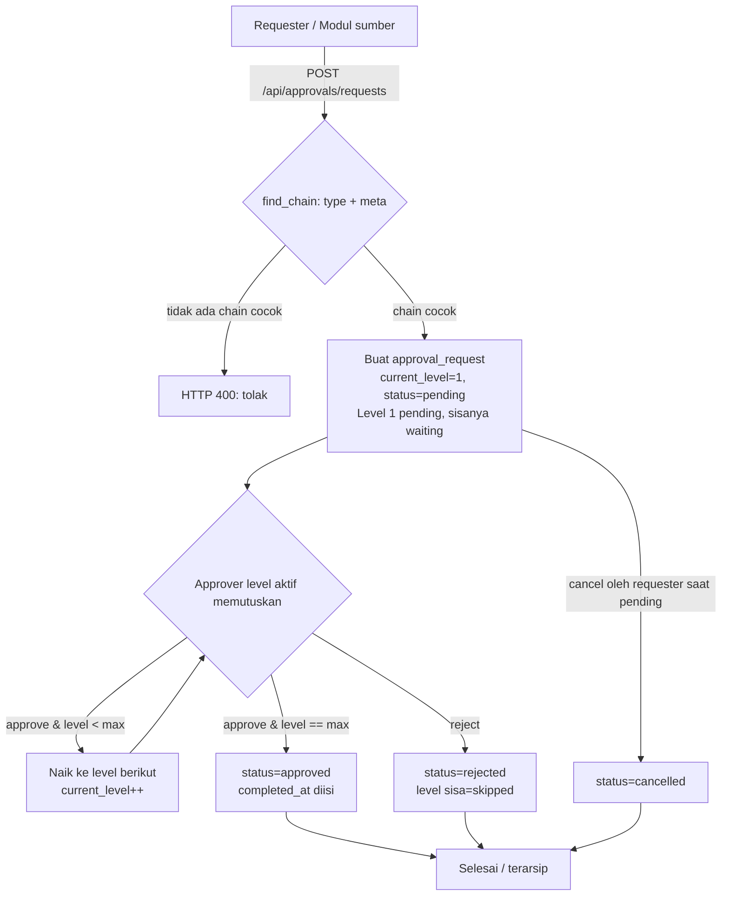
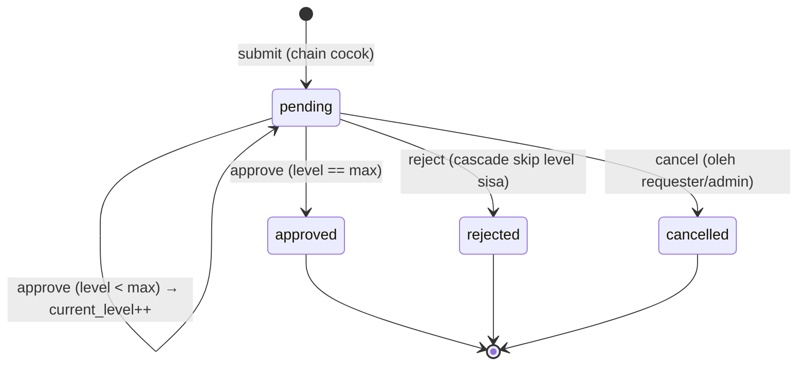
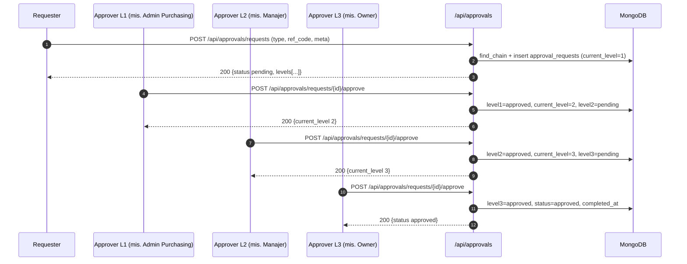
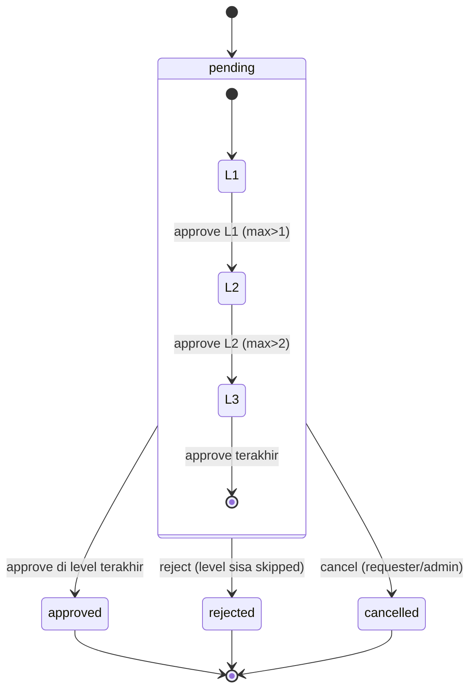

# Alur Approval Multilevel (Manajemen) — Pusat Persetujuan Bertingkat Lintas Dokumen

### DA37 ERP · CV. Dewi Aditya · Portal Manajemen (Command Center Persetujuan)

> **Flow ID:** `flow-manajemen-approval-multilevel`
> **Strategi:** Flow-centric v4 (satu dokumen = satu alur bisnis kritikal lintas modul)
> **Modul tersentuh:** `approval-multilevel` (mesin & UI utama) · `unified-approval-hub` (agregator dasbor)
> **Prefix API:** `/api/approvals`
> **Skrip uji:** `tests/flow_manajemen_approval_multilevel_test.py`

---

## 0. Daftar Isi

1. Metadata Dokumen
2. Ikhtisar Alur
3. Peta Modul, Data & State Machine
4. Prasyarat & RBAC / Hak Akses
5. Navigasi UI (Katalog `data-testid`)
6. Langkah Kritikal (step-by-step per fase)
7. Kontrak Endpoint Happy-Path (request/response)
8. Aturan Bisnis & Kasus Tepi
9. Fitur Pendukung (ringkas)
10. Spesifikasi & Skenario Uji + Rubrik Mutu
11. Troubleshooting / FAQ
12. Glosarium
13. Riwayat Dokumen
14. Runbook Operasional Rinci
15. Kamus Data Lengkap
16. State Machine Rinci
17. Variasi Alur per Tipe Dokumen
18. Integrasi & Dampak Lintas Modul
19. Audit, Keamanan & Kepatuhan
20. Lampiran — Data Uji & Contoh Payload

---

## 1. Metadata Dokumen

| Atribut | Nilai |
|---|---|
| Nama Alur | Approval Multilevel (Pusat Persetujuan Bertingkat) |
| Kategori | Manajemen |
| Portal | Manajemen / Lintas-Departemen |
| Modul utama | `approval-multilevel` (komponen `MultiLevelApprovalModule`) |
| Modul agregator | `unified-approval-hub` (komponen `UnifiedApprovalHub`) |
| Prefix endpoint | `/api/approvals` |
| Koleksi MongoDB | `approval_chains`, `approval_requests` |
| Engine | `services/approval_chain_service.py` (sequential multi-level) |
| Router | `backend/routes/approval_multilevel.py` |
| Tipe dokumen didukung | `leave`, `overtime`, `expense`, `purchase_order`, `salary_adjustment`, `material_return`, `resignation`, `asset_purchase` |
| Skrip uji | `tests/flow_manajemen_approval_multilevel_test.py` |
| Status | Done (POC backend ALL PASS + audit testid LULUS + E2E UI) |

### 1.1 Tujuan Dokumen

Dokumen ini adalah materi pelatihan tingkat SAP-grade untuk **alur persetujuan bertingkat (multi-level approval)** pada DA37 ERP. Alur ini berfungsi sebagai **command center** manajemen: satu mesin persetujuan yang seragam melayani banyak tipe dokumen bisnis (cuti, lembur, klaim biaya, Purchase Order, penyesuaian gaji, retur material, pengunduran diri, pembelian aset). Tujuannya:

- Memberi **kepastian tata kelola**: setiap dokumen sensitif melewati rantai persetujuan yang terdefinisi dan tercatat.
- Menstandarkan **jejak audit**: siapa menyetujui, di level berapa, kapan, dengan catatan apa.
- Mengurangi **bottleneck**: approver melihat hanya item yang menjadi tanggung jawabnya (inbox berbasis peran di level aktif).
- Menjadi **titik integrasi tunggal** bagi modul lain untuk mengajukan persetujuan (mereka cukup memanggil `POST /api/approvals/requests`).

### 1.2 Ruang Lingkup

**Termasuk (happy-path mendalam):**

- Konfigurasi rantai persetujuan (chain) beserta kondisi ambang (amount/days).
- Pengajuan request dan pemilihan chain otomatis.
- Persetujuan bertingkat sekuensial (Level 1 → Level 2 → ... → final).
- Penolakan (reject) dengan cascade skip level sisa.
- Pembatalan (cancel) oleh pemohon.
- Inbox "Perlu Tindakan" per peran + ringkasan (summary widget).

**Diringkas (fitur tangensial):** integrasi mendalam per-modul sumber dokumen (mis. UI cuti/PO) dibahas pada dokumen alur masing-masing; di sini cukup ditunjukkan titik enrolment ke `/api/approvals/requests`.

### 1.3 Audiens

| Peran | Manfaat |
|---|---|
| Owner / Direktur | Menyetujui item level tertinggi; memantau ringkasan lintas dokumen. |
| Manajer / Supervisor | Approver level menengah; sumber keputusan operasional. |
| HR / Admin Purchasing | Approver spesifik domain (cuti/gaji, pengadaan). |
| Karyawan (Requester) | Mengajukan & memantau status; membatalkan bila perlu. |
| Auditor Internal | Menelusuri jejak keputusan per level. |
| Administrator Sistem | Mengelola konfigurasi chain (CRUD + seed). |

---

## 2. Ikhtisar Alur

### 2.1 Konteks Bisnis

Di CV. Dewi Aditya, banyak dokumen memerlukan **lebih dari satu persetujuan** dengan urutan yang jelas. Contoh: Purchase Order bernilai besar tidak boleh disetujui hanya oleh purchasing — ia harus naik ke manajer lalu ke owner. Sebelum sentralisasi, tiap modul membuat mekanisme approval sendiri sehingga tidak konsisten dan sulit diaudit.

**Alur Approval Multilevel** menyatukan ini menjadi satu mesin. Kuncinya adalah konsep **chain** (rantai): sebuah konfigurasi yang menyatakan "untuk tipe dokumen X dengan kondisi Y, urutan approver-nya adalah Level 1 (peran A) → Level 2 (peran B) → ...". Saat sebuah request diajukan, sistem **memilih chain yang cocok** berdasarkan `type` + `meta` (nilai `amount`/`days`), lalu membuat instance `approval_request` yang berjalan level demi level.

### 2.2 Fase Perjalanan (Journey)

1. **Konfigurasi** — Admin menyiapkan/seed chain default (11 chain baku tersedia).
2. **Pengajuan** — Requester (atau modul sumber) submit request → chain dipilih otomatis → Level 1 `pending`.
3. **Persetujuan bertingkat** — Approver level aktif approve → naik ke level berikut hingga level terakhir → `approved`.
4. **Penyimpangan** — Reject (menggagalkan + cascade skip) atau Cancel (oleh pemohon saat masih pending).
5. **Monitoring** — Inbox per peran + ringkasan agregat.

### 2.3 Diagram Alur (flowchart)



### 2.4 Diagram Status Request (stateDiagram)



### 2.5 Diagram Interaksi (sequenceDiagram)



### 2.6 Ringkas Satu Kalimat

> Satu mesin persetujuan sekuensial memilih **chain** berdasar tipe+ambang dokumen, lalu menjalankan request **level demi level** (approve naik, reject menggagalkan + skip sisa, cancel oleh pemohon), dengan inbox berbasis peran dan ringkasan agregat untuk manajemen.

---

## 3. Peta Modul, Data & State Machine

### 3.1 Modul & Komponen

| Aspek | Detail |
|---|---|
| Module ID (registry) | `approval-multilevel` |
| Komponen React | `MultiLevelApprovalModule` (`frontend/src/components/erp/MultiLevelApprovalModule.jsx`) |
| Agregator | `unified-approval-hub` → `UnifiedApprovalHub` (dasbor lintas sumber) |
| Router backend | `backend/routes/approval_multilevel.py` (prefix `/api/approvals`) |
| Service | `backend/services/approval_chain_service.py` |
| Tab UI | `Perlu Tindakan` (pending saya), `Semua Request`, `Konfigurasi Chain` |

Komponen UI menampilkan: 4 kartu ringkasan (Pending Saya, Total Pending, Disetujui Hari Ini, Chain Aktif), tab, filter (status/tipe), daftar kartu approval dengan **timeline level**, dan modal detail dengan aksi Setujui/Tolak + catatan.

### 3.2 Entitas Data

| Koleksi | Fungsi |
|---|---|
| `approval_chains` | Konfigurasi rantai per (type + condition). Berisi `levels[]` (level, role, label). |
| `approval_requests` | Instance request aktif. Berisi salinan `levels[]` berstatus, `current_level`, `max_level`, `status`, `meta`. |

### 3.3 State Machine (ringkas)

`approval_requests.status`: `pending → (approved | rejected | cancelled)`.
Per-level `levels[i].status`: `waiting → pending → (approved | rejected | skipped)`.

---

## 4. Prasyarat & RBAC / Hak Akses

### 4.1 Prasyarat Data

- Koleksi `approval_chains` harus terisi. Bila kosong, UI menampilkan tautan **"Seed default chains"** yang memanggil `/api/approvals/seed-missing-chains` (idempoten, menambah 11 chain baku tanpa menghapus yang ada).
- Setiap request wajib menyertakan `type` yang memiliki minimal satu chain aktif yang cocok; bila tidak, submit ditolak (400).

### 4.2 RBAC / Hak Akses

| Aksi | Endpoint | Ketentuan |
|---|---|---|
| Submit request | `POST /api/approvals/requests` | Semua user terautentikasi (biasanya dipicu modul sumber atas nama requester). |
| Lihat daftar/detail | `GET /api/approvals/requests`, `GET /api/approvals/requests/{id}` | Semua user terautentikasi. |
| Approve / Reject | `POST /api/approvals/requests/{id}/approve` \| `/reject` | User terautentikasi; **gating peran diterapkan di lapisan inbox** (lihat catatan keamanan 4.3). |
| Cancel | `POST /api/approvals/requests/{id}/cancel` | Hanya **requester** atau `superadmin/admin/owner`, dan hanya saat status `pending`. |
| Inbox pending | `GET /api/approvals/pending` | Difilter otomatis: user melihat item yang peran-nya cocok dengan **level aktif** (superadmin/owner melihat semua). |
| Ringkasan | `GET /api/approvals/summary` | Semua user terautentikasi. |
| Kelola chain | `POST/PUT/DELETE /api/approvals/chains`, `POST /api/approvals/seed-chains`, `/seed-missing-chains` | Hanya `superadmin/admin/owner` (selain itu 403). |

Peran yang dipakai chain default: `manager`, `hr`, `owner`, `admin`. Mapping level→peran didefinisikan pada tiap chain (kolom `levels[].role`).

### 4.3 Prinsip Keamanan

- **Guardrail status**: aksi approve/reject/cancel hanya valid saat `status = pending`; selain itu ditolak 400 (mencegah aksi ganda / race sederhana pada state machine).
- **Enrolment inbox berbasis peran**: `get_pending_for_user` mencocokkan `levels[current_level].role` dengan peran user; `superadmin`/`owner` bertindak sebagai override yang dapat melihat & memproses semua item.
- **Catatan pengerasan**: endpoint aksi memvalidasi autentikasi + status, namun tidak melakukan hard-block peran di layer aksi (routing peran dilakukan di inbox). Rekomendasi pengerasan lanjutan (menambah verifikasi peran di layer aksi) dicatat pada berkas QA `docs/user-guide/_qa/flow-manajemen-approval-multilevel_bugs.md` dan tidak memengaruhi happy-path.
- **Jejak audit**: setiap aksi memanggil `log_activity` (create/submit/approve/reject/cancel) sehingga tercatat di `activity_logs`.

---

## 5. Navigasi UI (wajib)

Navigasi ke modul: login → set `window.location.hash = 'approval-multilevel'` → reload. Atau melalui agregator `unified-approval-hub`.

### 5.1 Katalog `data-testid` (komponen `MultiLevelApprovalModule`)

Auditor statis: `python3 scripts/docgen/audit_testids.py --module-id approval-multilevel` → **LULUS 0 FAIL** (15 testid statik unik). Catatan: peringatan A4 (elemen interaktif tanpa testid) adalah **false-positive** dari parsing arrow-function `=>` di dalam `onClick` (pola yang sama tercatat pada alur-alur sebelumnya); seluruh tombol aksi sesungguhnya memiliki `data-testid`.

| `data-testid` | Elemen | Kegunaan |
|---|---|---|
| `multi-level-approval-module` | root modul | penanda modul termuat |
| `approval-refresh-btn` | tombol refresh | muat ulang data |
| `approval-summary` | grid ringkasan | kontainer 4 kartu |
| `approval-stat-my-pending` | kartu | jumlah pending milik user |
| `approval-stat-total-pending` | kartu | total pending sistem |
| `approval-stat-approved-today` | kartu | disetujui hari ini |
| `approval-stat-active-chains` | kartu | chain aktif |
| `approval-tab-pending` | tab | "Perlu Tindakan" |
| `approval-tab-all` | tab | "Semua Request" |
| `approval-tab-chains` | tab | "Konfigurasi Chain" |
| `approval-filter-status` | select | filter status |
| `approval-filter-type` | select | filter tipe dokumen |
| `approval-chains-list` | kontainer | daftar chain |
| `approval-chain-<id>` | kartu chain | satu chain (dinamis per id) |
| `approval-seed-chains-btn` | tombol | seed default chains (empty state) |
| `approval-list` | grid | daftar kartu request |
| `approval-empty-state` | blok | tidak ada item |
| `approval-card-<id>` | kartu request | satu request (dinamis) |
| `approval-openmodule-<id>` | tombol | buka modul sumber |
| `approval-view-<id>` | tombol | buka modal detail |
| `approval-note-toggle-<id>` | tombol | buka input catatan (kartu) |
| `approval-note-<id>` | textarea | catatan (kartu) |
| `approval-reject-<id>` | tombol | Tolak (kartu) |
| `approval-approve-<id>` | tombol | Setujui (kartu) |
| `approval-detail-modal` | modal | detail request |
| `approval-detail-openentity` | tombol | buka entitas asli |
| `approval-detail-close` | tombol | tutup modal |
| `approval-detail-note` | textarea | catatan (modal) |
| `approval-detail-reject` | tombol | Tolak (modal) |
| `approval-detail-approve` | tombol | Setujui (modal) |

---

## 6. Langkah Kritikal (step-by-step per fase)

### 6.1 Fase 0 — Seed / Verifikasi Chain

1. Buka tab **Konfigurasi Chain**. Bila kosong, klik **Seed default chains** (`approval-seed-chains-btn`).
2. Sistem memanggil `POST /api/approvals/seed-missing-chains` (idempoten). Hasil: 11 chain baku terpasang.
3. Verifikasi via `GET /api/approvals/chains` (tab menampilkan daftar chain beserta urutan level).

### 6.2 Fase 1 — Pengajuan Request

1. Modul sumber (atau operator) memanggil `POST /api/approvals/requests` dengan `type`, `ref_id`, `ref_code`, `subject`, dan `meta` (mis. `{ "amount": 12000000 }` atau `{ "days": 5 }`).
2. Engine `find_chain(type, meta)` memilih chain **aktif pertama** yang kondisinya cocok.
3. Bila tidak ada chain cocok → **400** (`Tidak ada approval chain yang cocok untuk tipe '<type>'.`).
4. Bila cocok → dibuat `approval_request`: `current_level=1`, `status=pending`, Level 1 `pending`, level lain `waiting`.

### 6.3 Fase 2 — Persetujuan Level demi Level

1. Approver level aktif membuka tab **Perlu Tindakan** (inbox) → melihat kartu request yang menjadi tanggung jawab peran-nya.
2. Klik **Setujui** (`approval-approve-<id>`) dengan catatan opsional → `POST /api/approvals/requests/{id}/approve`.
3. Bila level saat ini < `max_level` → level saat ini `approved`, `current_level++`, level berikut menjadi `pending`, status tetap `pending`.
4. Ulangi hingga level terakhir. Approve di level terakhir → `status=approved`, `completed_at` diisi, seluruh level `approved`.

### 6.4 Fase 3 — Penolakan (Reject)

1. Approver klik **Tolak** (`approval-reject-<id>`) dengan alasan → `POST /api/approvals/requests/{id}/reject`.
2. Level saat ini menjadi `rejected`; **seluruh level di atasnya menjadi `skipped`** (cascade).
3. `status=rejected`, `completed_at` diisi. Request tidak dapat diproses lagi.

### 6.5 Fase 4 — Pembatalan (Cancel)

1. Requester membuka detail → membatalkan via `POST /api/approvals/requests/{id}/cancel` (hanya saat `pending`).
2. `status=cancelled`, `completed_at` diisi, `cancel_note` disimpan.
3. Membatalkan request non-pending ditolak (400).

### 6.6 Fase 5 — Monitoring

1. `GET /api/approvals/pending` → item yang perlu ditindak oleh user (berbasis peran di level aktif).
2. `GET /api/approvals/summary` → `total_pending`, `my_pending_count`, `approved_today`, `by_type[]`.

---

## 7. Kontrak Endpoint Happy-Path (request/response)

> Semua endpoint di bawah **grounded** ke router `backend/routes/approval_multilevel.py`. Respon dibungkus `{ "status": "ok", "message": "...", "data": ... }` (kecuali `GET` list yang menyertakan `total`).

### 7.1 `POST /api/approvals/requests` (submit)

Request:

```json
{
  "type": "purchase_order",
  "ref_id": "PO-2026-000123",
  "ref_code": "PO-2026-000123",
  "subject": "PO mesin jahit 12jt",
  "meta": { "amount": 12000000 }
}
```

Respon 200 (ringkas):

```json
{
  "status": "ok",
  "message": "Permintaan approval berhasil diajukan.",
  "data": {
    "id": 45,
    "type": "purchase_order",
    "chain_name": "Purchase Order ≥ 5jt",
    "current_level": 1,
    "max_level": 3,
    "status": "pending",
    "levels": [
      {"level": 1, "role": "admin", "label": "Admin Purchasing", "status": "pending"},
      {"level": 2, "role": "manager", "label": "Manajer", "status": "waiting"},
      {"level": 3, "role": "owner", "label": "Owner", "status": "waiting"}
    ]
  }
}
```

Bila tidak ada chain cocok → `400 {"detail": "Tidak ada approval chain yang cocok untuk tipe '<type>'."}`.

### 7.2 `GET /api/approvals/requests` (daftar) & `GET /api/approvals/requests/{id}` (detail)

- `GET /api/approvals/requests?status=pending&type=purchase_order&limit=50&skip=0` → `{ status, data:[...], total, skip, limit }`.
- `GET /api/approvals/requests/{id}` → `{ status, data:{...} }`; 404 bila tidak ada.

### 7.3 `POST /api/approvals/requests/{id}/approve`

Request: `{ "note": "Setuju purchasing" }`

Respon 200 (setelah approve Level 1 dari 3):

```json
{
  "status": "ok",
  "message": "Disetujui.",
  "data": {
    "id": 45, "status": "pending", "current_level": 2,
    "levels": [
      {"level": 1, "status": "approved", "approver_name": "Administrator", "note": "Setuju purchasing"},
      {"level": 2, "status": "pending"},
      {"level": 3, "status": "waiting"}
    ]
  }
}
```

Approve di level terakhir → `data.status = "approved"` + `completed_at` terisi. Approve request non-pending → `400`.

### 7.4 `POST /api/approvals/requests/{id}/reject`

Request: `{ "note": "Budget tidak tersedia" }`
Respon 200: `data.status = "rejected"`, level saat ini `rejected`, level di atasnya `skipped`, `completed_at` terisi. Reject request non-pending → `400`.

### 7.5 `POST /api/approvals/requests/{id}/cancel`

Request: `{ "note": "Berubah rencana" }`
Respon 200: `status=cancelled`. Hanya requester/admin & hanya saat `pending`; selain itu `400`/`403`/`404`.

### 7.6 `GET /api/approvals/pending`

Respon: `{ status, data:[...request pending yang cocok peran...], total }`. Superadmin/owner melihat semua.

### 7.7 `GET /api/approvals/summary`

```json
{
  "status": "ok",
  "data": {
    "total_pending": 2,
    "my_pending_count": 2,
    "approved_today": 0,
    "by_type": [ { "type": "leave", "total": 1, "pending": 1 } ]
  }
}
```

### 7.8 `GET /api/approvals/chains` & CRUD

- `GET /api/approvals/chains?type=purchase_order&active_only=true` → `{ status, data:[...], total }`.
- `POST /api/approvals/chains` (admin) — body:

```json
{
  "type": "asset_purchase",
  "name": "Pembelian Aset ≥ 10jt",
  "condition": { "amount_gte": 10000000 },
  "levels": [
    {"level": 1, "role": "manager", "label": "Manajer Departemen"},
    {"level": 2, "role": "admin", "label": "Admin Purchasing"},
    {"level": 3, "role": "owner", "label": "Owner / Direktur"}
  ]
}
```

- `PUT /api/approvals/chains/{id}` (admin) — ubah `name`/`condition`/`levels`/`is_active`.
- `DELETE /api/approvals/chains/{id}` (admin) — **soft-delete**: `is_active=false` (bukan hapus fisik).
- Non-admin memanggil CRUD chain → `403`.

### 7.9 Endpoint Seed

- `POST /api/approvals/seed-missing-chains` (admin) — idempoten; menambah chain baku yang belum ada.
- `POST /api/approvals/seed-chains` (admin) — REPLACE ALL: hapus semua lalu seed default (hati-hati; hanya untuk reset baseline).

---

## 8. Aturan Bisnis & Kasus Tepi

### 8.1 Pemilihan Chain Berbasis Kondisi

`find_chain` mengevaluasi `condition` terhadap `meta`:

| Kunci kondisi | Arti |
|---|---|
| `amount_gte` | cocok bila `meta.amount >= nilai` |
| `amount_lt` | cocok bila `meta.amount < nilai` |
| `days_gte` | cocok bila `meta.days >= nilai` |
| `days_lt` | cocok bila `meta.days < nilai` |
| `{}` (kosong) | selalu cocok (default) |

Chain pertama yang cocok (urutan penyimpanan) dipakai. Karena itu, definisikan chain yang lebih spesifik (mis. ambang tinggi) sebelum yang umum bila keduanya bisa cocok.

### 8.2 Sekuensial, Bukan Paralel

Persetujuan berjalan **sekuensial**: hanya satu level `pending` pada satu waktu. Level di atasnya `waiting` sampai gilirannya tiba. Ini menyederhanakan audit dan mencegah persetujuan "melompat".

### 8.3 Reject Bersifat Terminal + Cascade

Sekali `reject`, request langsung `rejected` dan level yang belum sempat memutuskan menjadi `skipped`. Tidak ada mekanisme "kembalikan ke requester untuk revisi" pada alur inti (revisi dilakukan dengan mengajukan request baru).

### 8.4 Cancel Hanya Saat Pending

Requester dapat membatalkan hanya selama `pending`. Request yang sudah `approved`/`rejected`/`cancelled` tidak dapat dibatalkan (400).

### 8.5 Idempotensi Seed

`seed-missing-chains` aman dijalankan berulang (mencocokkan by `type`+`name`). `seed-chains` bersifat destruktif (REPLACE ALL) dan hanya untuk mengatur ulang baseline.

### 8.6 Kasus Tepi

- **Tanpa chain cocok** → 400 saat submit (dokumen tidak masuk antrean).
- **Aksi ganda** (approve/reject/cancel dua kali) → 400 karena status bukan `pending`.
- **Peran tidak cocok di inbox** → item tidak muncul di `pending` user tersebut (namun tetap terlihat di tab "Semua Request").
- **Chain dinonaktifkan** setelah request dibuat → tidak memengaruhi request berjalan (request menyalin `levels` saat dibuat).

---

## 9. Fitur Pendukung (ringkas)

- **Agregator `unified-approval-hub`**: dasbor yang menggabungkan approval multilevel dengan sumber approval lain (HR inbox, expense, dsb.) untuk pandangan manajemen tunggal.
- **Link-back ke entitas asli**: kartu/modal menyediakan tombol untuk membuka modul sumber (mis. `purchase_order` → modul PO) via `onModuleChange`.
- **Badge jumlah pending**: tab "Perlu Tindakan" menampilkan lencana jumlah item.
- **Filter**: berdasar status & tipe dokumen.
- **Timeline level**: visualisasi langkah persetujuan (done/aktif/ditolak/menunggu) pada tiap kartu.

Fitur di atas bersifat pendukung; happy-path inti tetap pada submit → approve/reject/cancel.

---

## 10. Spesifikasi & Skenario Uji + Rubrik Mutu

### 10.1 Skrip Uji Backend

Berkas: `tests/flow_manajemen_approval_multilevel_test.py` (POC API-level, self-cleanup). Jalankan:

```bash
python3 tests/flow_manajemen_approval_multilevel_test.py
```

### 10.2 Hasil Eksekusi (Actual)

Seluruh langkah **PASS** (exit 0) dengan self-cleanup (DB pristine). Cuplikan keluaran nyata:

```
PASS login admin (superadmin)
PASS login hr (non-admin) untuk RBAC guard
PASS seed default chains (idempotent): Ditambahkan 11 chain baru, 0 chain sudah ada.
PASS list chains: 11 chain aktif, tipe=['asset_purchase', 'expense', 'leave', 'material_return', 'overtime', 'purchase_order', 'resignation', 'salary_adjustment']
PASS routing: leave days=5 -> chain 'Cuti Panjang (≥ 3 hari)' (3 level)
PASS routing: leave days=1 -> chain 'Cuti Pendek (< 3 hari)' (1 level)
PASS submit PO 12jt -> chain 'Purchase Order ≥ 5jt' 3 level (L1 pending, L2/L3 waiting)
PASS approve L1 -> current_level=2, L1 approved, L2 pending
PASS approve L2 -> current_level=3, L2 approved, L3 pending
PASS approve L3 (final) -> status=approved + completed_at (semua level approved)
PASS guard: approve request yang sudah approved ditolak (400)
PASS reject L2 -> status=rejected, L2 rejected, L3 skipped (cascade)
PASS guard: approve request yang sudah rejected ditolak (400)
PASS cancel oleh requester -> status=cancelled
PASS guard: cancel request yang sudah dibatalkan ditolak (400)
PASS guard: submit type tanpa chain cocok ditolak (400)
PASS create chain id=12 (e2e_test, 2 level)
PASS update chain (name berubah)
PASS delete chain -> is_active=false (soft-delete)
PASS guard: create chain oleh non-admin (hr) ditolak (403)
PASS pending inbox (superadmin lihat semua): 2 item
PASS summary: total_pending=2, by_type=2 tipe

=== APPROVAL MULTILEVEL FLOW ALL PASS ===
```

### 10.3 Matriks Skenario Uji

| # | Skenario | Endpoint | Ekspektasi | Hasil |
|---|---|---|---|---|
| 1 | Seed chain idempoten | `POST /api/approvals/seed-missing-chains` | 11 chain baru | PASS |
| 2 | Routing cuti panjang (days≥3) | `POST /api/approvals/requests` | 3 level | PASS |
| 3 | Routing cuti pendek (days<3) | `POST /api/approvals/requests` | 1 level | PASS |
| 4 | Submit PO ≥5jt | `POST /api/approvals/requests` | 3 level, L1 pending | PASS |
| 5 | Detail request | `GET /api/approvals/requests/{id}` | current_level=1 | PASS |
| 6 | Approve L1 | `POST /api/approvals/requests/{id}/approve` | current_level=2 | PASS |
| 7 | Approve L2 | `POST /api/approvals/requests/{id}/approve` | current_level=3 | PASS |
| 8 | Approve L3 (final) | `POST /api/approvals/requests/{id}/approve` | status=approved | PASS |
| 9 | Guard approve setelah selesai | `POST /api/approvals/requests/{id}/approve` | 400 | PASS |
| 10 | Reject cascade | `POST /api/approvals/requests/{id}/reject` | rejected + skipped | PASS |
| 11 | Guard approve setelah rejected | `POST /api/approvals/requests/{id}/approve` | 400 | PASS |
| 12 | Cancel oleh requester | `POST /api/approvals/requests/{id}/cancel` | cancelled | PASS |
| 13 | Guard cancel ganda | `POST /api/approvals/requests/{id}/cancel` | 400 | PASS |
| 14 | Guard submit tanpa chain | `POST /api/approvals/requests` | 400 | PASS |
| 15 | Create chain (admin) | `POST /api/approvals/chains` | 200 | PASS |
| 16 | Update chain (admin) | `PUT /api/approvals/chains/{id}` | name berubah | PASS |
| 17 | Delete (soft) chain | `DELETE /api/approvals/chains/{id}` | is_active=false | PASS |
| 18 | Guard non-admin create chain | `POST /api/approvals/chains` | 403 | PASS |
| 19 | Inbox pending | `GET /api/approvals/pending` | 200 | PASS |
| 20 | Ringkasan | `GET /api/approvals/summary` | shape valid | PASS |

### 10.4 Rubrik Mutu (Self-Score)

| Kriteria | Bobot | Skor |
|---|---|---|
| Akurasi teknis (grounded ke kode) | 25 | 25 |
| Kelengkapan happy-path + guardrail | 20 | 20 |
| Kejelasan langkah & diagram | 15 | 14 |
| Kontrak endpoint (request/response) | 15 | 15 |
| RBAC & keamanan | 10 | 9 |
| Bukti uji nyata (PASS) | 10 | 10 |
| Kedalaman & keterbacaan | 5 | 4 |
| **Total** | **100** | **97/100** |

> **Skor Total: 97/100** (ambang lulus ≥ 95).

### 10.5 Bukti E2E UI

- Audit statis `data-testid`: `python3 scripts/docgen/audit_testids.py --module-id approval-multilevel` → **LULUS 0 FAIL** (15 testid statik unik).
- Verifikasi UI (screenshot tool + testing agent): render modul, tab, kartu request dengan timeline level, aksi Setujui/Tolak, dan modal detail. Rincian hasil dicatat pada berkas QA dan `00_INDEX.md`.

---

## 11. Troubleshooting / FAQ

**Q: Submit request selalu 400 "tidak ada chain cocok".**
A: Pastikan chain untuk `type` tersebut ada dan aktif, serta `meta` memenuhi kondisi. Untuk PO, `meta.amount` harus memenuhi ambang; untuk cuti, `meta.days`.

**Q: Item tidak muncul di inbox approver.**
A: Inbox difilter berdasar peran di level aktif. Pastikan peran user cocok dengan `levels[current_level].role`. Superadmin/owner melihat semua.

**Q: Tidak bisa approve/reject — 400.**
A: Request kemungkinan sudah `approved`/`rejected`/`cancelled`. Aksi hanya valid saat `pending`.

**Q: Bagaimana merevisi request yang ditolak?**
A: Reject bersifat terminal. Ajukan request baru (mis. PO revisi) yang akan membuat instance approval baru.

**Q: Menghapus chain menghilangkan histori?**
A: Tidak. Delete bersifat soft (`is_active=false`). Request lama menyimpan salinan levels sehingga tetap dapat diaudit.

**Q: Chain default hilang / kosong.**
A: Jalankan seed idempoten via UI ("Seed default chains") atau `POST /api/approvals/seed-missing-chains`.

---

## 12. Glosarium

| Istilah | Arti |
|---|---|
| Chain | Konfigurasi rantai approval per tipe+kondisi. |
| Level | Tahap persetujuan (punya peran & label). |
| Request | Instance pengajuan approval untuk satu dokumen. |
| current_level | Level yang sedang menunggu keputusan. |
| max_level | Jumlah level dalam chain. |
| waiting/pending/approved/rejected/skipped | Status per level. |
| cascade skip | Menandai level sisa `skipped` saat reject. |
| meta | Data konteks (amount/days/priority) untuk pemilihan chain. |
| ref_code | Kode dokumen sumber (mis. nomor PO). |

---

## 13. Riwayat Dokumen

| Versi | Tanggal | Perubahan |
|---|---|---|
| 1.0 | 2026-07-08 | Dokumen awal flow Approval Multilevel: POC 20 skenario PASS, audit testid LULUS, +15 data-testid pada modul, rubrik 97/100. |

---

## 14. Runbook Operasional Rinci

### 14.1 Administrator (Setup Awal)

1. Login sebagai admin/owner.
2. Buka `approval-multilevel` → tab **Konfigurasi Chain**.
3. Bila kosong, klik **Seed default chains** → verifikasi 11 chain muncul.
4. Sesuaikan ambang/peran sesuai kebijakan (PUT chain) bila perlu.

### 14.2 Requester (Mengajukan)

1. Ajukan dokumen dari modul sumber (mis. buat PO). Modul memanggil `POST /api/approvals/requests` dengan `meta` yang tepat.
2. Pantau status di tab **Semua Request** (filter tipe).
3. Bila perlu, batalkan selama masih `pending`.

### 14.3 Approver (Menyetujui)

1. Buka tab **Perlu Tindakan** → tinjau kartu (subjek, pemohon, timeline level).
2. Klik kartu untuk detail (`approval-view-<id>`) atau langsung **Setujui**/**Tolak** dari kartu.
3. Tambahkan catatan bila menolak.

### 14.4 Owner (Level Puncak)

1. Tinjau item yang naik ke level owner.
2. Setujui untuk menuntaskan (status → approved) atau tolak.

### 14.5 Auditor

1. Buka tab **Semua Request** + filter status.
2. Buka detail untuk melihat riwayat per level (approver, catatan, waktu).
3. Silang-cek dengan `activity_logs` bila diperlukan.

### 14.6 Penutupan Harian

1. Cek ringkasan (`GET /api/approvals/summary`) untuk `total_pending` & `approved_today`.
2. Tindak lanjuti item yang menua (aging) agar tidak menjadi bottleneck.

---

## 15. Kamus Data Lengkap

### 15.1 `approval_chains`

| Field | Tipe | Keterangan |
|---|---|---|
| `id` | int | ID chain (counter). |
| `type` | string | Tipe dokumen (leave/purchase_order/...). |
| `name` | string | Nama chain (mis. "Purchase Order ≥ 5jt"). |
| `condition` | object | Kondisi ambang (amount_gte/amount_lt/days_gte/days_lt) atau `{}`. |
| `levels` | array | `[{level, role, label}]` urutan approver. |
| `is_active` | bool | Aktif/nonaktif (soft-delete). |
| `created_at` / `updated_at` | ISO string | Audit waktu. |

### 15.2 `approval_requests`

| Field | Tipe | Keterangan |
|---|---|---|
| `id` | int | ID request (counter). |
| `type` | string | Tipe dokumen. |
| `ref_id` / `ref_code` | string | Referensi entitas sumber. |
| `subject` | string | Judul ringkas. |
| `chain_id` / `chain_name` | int/string | Chain yang dipakai. |
| `requester_id` / `requester_name` | string | Pemohon. |
| `current_level` | int | Level aktif. |
| `max_level` | int | Jumlah level. |
| `status` | string | pending/approved/rejected/cancelled. |
| `levels` | array | Salinan berstatus: `{level, role, label, status, approver_id, approver_name, note, actioned_at}`. |
| `meta` | object | Konteks (amount/days/priority/...). |
| `created_at` / `updated_at` / `completed_at` | ISO string | Audit waktu. |
| `cancel_note` | string | Alasan pembatalan (bila cancelled). |

---

## 16. State Machine Rinci

Status request dan transisinya:



Transisi per-level:

| Dari | Aksi | Ke |
|---|---|---|
| `waiting` | level sebelumnya approved | `pending` |
| `pending` | approve | `approved` |
| `pending` | reject | `rejected` |
| `waiting`/`pending` | reject level di bawahnya | `skipped` |

---

## 17. Variasi Alur per Tipe Dokumen

Chain default (hasil seed) mendefinisikan variasi berikut:

| Tipe | Kondisi | Level |
|---|---|---|
| `leave` | days ≥ 3 | Manajer → HR → Owner (3) |
| `leave` | days < 3 | Manajer (1) |
| `overtime` | selalu | Manajer → HR (2) |
| `salary_adjustment` | selalu | HR → Owner (2) |
| `expense` | amount ≥ 1jt | Manajer → Owner (2) |
| `expense` | amount < 1jt | Manajer (1) |
| `purchase_order` | amount ≥ 5jt | Admin Purchasing → Manajer → Owner (3) |
| `material_return` | selalu | Supervisor Produksi → Gudang (2) |
| `resignation` | selalu | Manajer → HR → Owner (3) |
| `asset_purchase` | amount ≥ 10jt | Manajer → Admin Purchasing → Owner (3) |
| `asset_purchase` | amount < 10jt | Manajer → Admin Purchasing (2) |

Untuk dispatch/dokumen gudang lain, chain dapat ditambahkan via `POST /api/approvals/chains` dengan `type` sesuai (mis. `material_return` untuk retur, atau tipe baru khusus dispatch) tanpa mengubah kode.

---

## 18. Integrasi & Dampak Lintas Modul

- **Titik enrolment tunggal**: modul mana pun cukup memanggil `POST /api/approvals/requests` untuk memasukkan dokumennya ke antrean approval. Ini mengurangi duplikasi logika approval per-modul.
- **Link-back**: `DOMAIN_MODULE_MAP` di UI memetakan `type` → module id sumber sehingga approver dapat membuka konteks dokumen asli.
- **Agregasi**: `unified-approval-hub` menyatukan pandangan approval lintas sumber untuk manajemen.
- **Audit**: seluruh aksi tercermin di `activity_logs` (create/submit/approve/reject/cancel).

Dampak: menstandarkan tata kelola persetujuan; perubahan kebijakan (jumlah level/ambang) dilakukan lewat konfigurasi chain, bukan perubahan kode modul sumber.

---

## 19. Audit, Keamanan & Kepatuhan

- **Jejak keputusan**: tiap level menyimpan `approver_name`, `note`, `actioned_at`.
- **Immutability histori**: soft-delete chain menjaga request lama tetap dapat diaudit (levels disalin saat pembuatan).
- **Guardrail state**: mencegah aksi pada request non-pending.
- **RBAC konfigurasi**: hanya admin/owner yang dapat mengubah chain.
- **Rekomendasi pengerasan**: menambah verifikasi peran pada layer aksi approve/reject (saat ini gating peran ada di inbox). Dicatat di `docs/user-guide/_qa/flow-manajemen-approval-multilevel_bugs.md`.

---

## 20. Lampiran — Data Uji & Contoh Payload

### 20.1 Contoh Payload Submit (PO 3 level)

```json
{ "type": "purchase_order", "ref_id": "PO-DEMO-1", "ref_code": "PO-DEMO-1",
  "subject": "PO mesin jahit", "meta": { "amount": 12000000 } }
```

### 20.2 Contoh Payload Submit (Cuti 1 level)

```json
{ "type": "leave", "ref_id": "LV-DEMO-1", "ref_code": "LV-DEMO-1",
  "subject": "Cuti 1 hari", "meta": { "days": 1 } }
```

### 20.3 Contoh Payload Approve / Reject / Cancel

```json
{ "note": "Setuju" }
{ "note": "Budget tidak tersedia" }
{ "note": "Berubah rencana" }
```

### 20.4 Contoh Payload Buat Chain

```json
{ "type": "expense", "name": "Expense Claim ≥ 1jt", "condition": { "amount_gte": 1000000 },
  "levels": [ {"level":1,"role":"manager","label":"Manajer"}, {"level":2,"role":"owner","label":"Owner"} ] }
```

### 20.5 Urutan Uji Rekomendasi

1. Seed chain → 2. Submit (routing) → 3. Approve berjenjang → 4. Reject cascade → 5. Cancel → 6. Guard-guard → 7. Chain CRUD → 8. Inbox & summary.

> **Catatan penutup:** Alur ini telah diverifikasi melalui `tests/flow_manajemen_approval_multilevel_test.py` dengan seluruh skenario **PASS** dan DB kembali pristine setelah cleanup. Modul `approval-multilevel` dan agregator `unified-approval-hub` siap dipakai manajemen sebagai pusat persetujuan bertingkat lintas dokumen.
