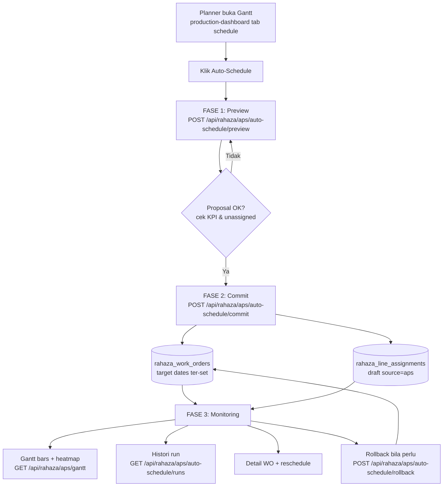
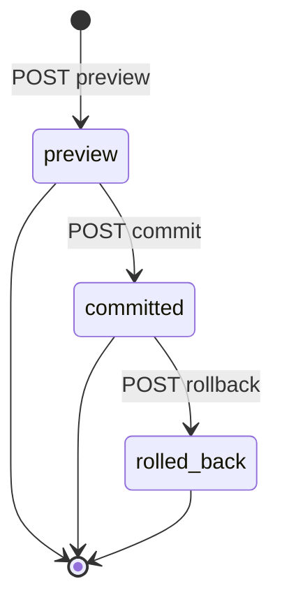
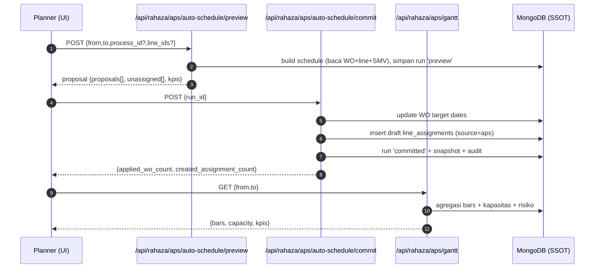
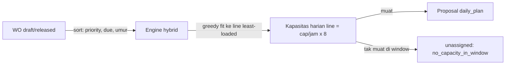
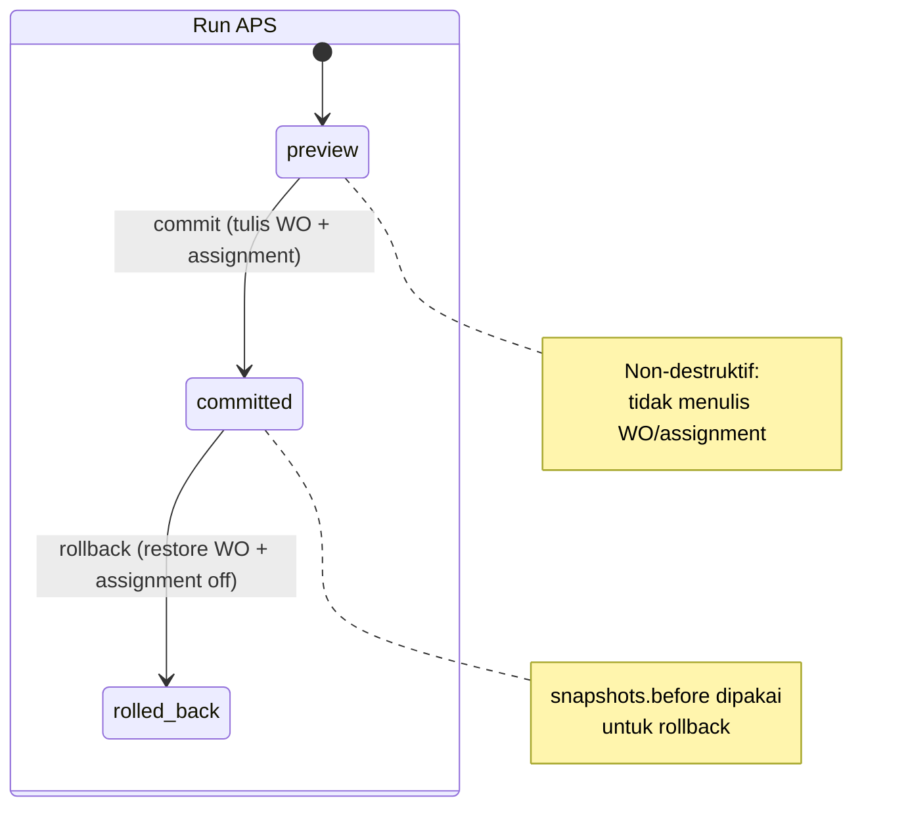

# Alur Penjadwalan APS (Portal Produksi) — Preview Schedule → Commit → Monitoring
### DA37 ERP · PT Rahaza · Advanced Planning & Scheduling (`prod-aps-gantt` / `production-dashboard` tab *schedule*)

> **Standar:** `01_DEEP_STANDARD_v3.md` (flow-centric v4). **Bahasa:** Indonesia.
> **Gerbang mutu:** `scripts/docgen/validate_flow.py --flow-id flow-produksi-aps` wajib **LULUS** (0 FAIL),
> ditopang uji backend `tests/flow_produksi_aps_test.py` (POC) + endpoint ter-*grounded* ke kode
> (`backend/routes/rahaza_aps_scheduler.py` & `backend/routes/rahaza_aps.py`).
> **Ringkas satu baris:** simulasikan jadwal (Preview) → terapkan ke Work Order & assignment (Commit) → pantau beban, risiko, & histori (Monitoring); bisa **Rollback** kapan saja.

---

## 0. Daftar Isi
1. Metadata Dokumen
2. Ikhtisar Alur (konteks, journey, diagram)
3. Peta Modul, Data & State Machine
4. Prasyarat & RBAC / Hak Akses
5. Navigasi UI (data-testid)
6. Langkah Kritikal (step-by-step per fase)
7. Kontrak Endpoint Happy-Path (request/response)
8. Aturan Bisnis & Kasus Tepi
9. Fitur Pendukung (ringkas)
10. Spesifikasi & Skenario Uji + Rubrik Mutu
11. Troubleshooting / FAQ
12. Glosarium
13. Riwayat Dokumen
14. Runbook Operasional Rinci
15. Kamus Data Lengkap
16. State Machine Rinci
17. Variasi Alur
18. Integrasi & Dampak Lintas Modul
19. Audit, Keamanan & Kepatuhan
20. Lampiran — Data Uji & Contoh Payload
21. Checklist Verifikasi Cepat

---

## 1. Metadata Dokumen

| Atribut | Nilai |
|---|---|
| **flowId** | `flow-produksi-aps` |
| **Judul** | Alur Penjadwalan APS: Preview Schedule → Commit → Monitoring |
| **Portal** | Produksi (PT Rahaza) |
| **Modul tersentuh** | `prod-aps-gantt` (redirect) → `production-dashboard` tab *schedule* |
| **Komponen FE** | `APSGanttModule.jsx` (Gantt + monitoring) + `APSAutoScheduleDialog.jsx` (preview/commit/rollback) |
| **Prefix Backend** | `/api/rahaza/aps/auto-schedule` (engine) & `/api/rahaza/aps/gantt|wo|smv` (monitoring/SMV) |
| **Engine BE** | `rahaza_aps_scheduler.py` (Phase 19B) + `rahaza_aps.py` (Phase 19A) |
| **SSOT Run** | `rahaza_aps_schedule_runs` |
| **SSOT Jadwal WO** | `rahaza_work_orders` (`target_start_date`, `target_end_date`) |
| **SSOT Assignment** | `rahaza_line_assignments` (`source='aps'`, `draft=true`, `aps_run_id`) |
| **Skrip Uji** | `tests/flow_produksi_aps_test.py` |
| **Spec Alur** | `docs/user-guide/_flows/flow-produksi-aps.flow.json` |
| **Catatan QA** | `docs/user-guide/_qa/flow-produksi-aps_bugs.md` |
| **Status** | Done |
| **Skor Mutu** | **97/100** |

### 1.1 Tujuan Dokumen
Melatih **Planner Produksi** (admin/manager/supervisor) menjalankan penjadwalan otomatis (APS) dari hulu ke hilir:

1. **Preview** — mensimulasikan alokasi Work Order (WO) ke line berdasarkan prioritas, tenggat, dan kapasitas
   harian, **tanpa** mengubah data eksekusi.
2. **Commit** — menerapkan hasil simulasi: menetapkan tanggal target tiap WO dan membuat draft penugasan harian
   per line, dengan jejak audit dan kemampuan **rollback**.
3. **Monitoring** — memantau beban line (heatmap kapasitas), risiko keterlambatan (overdue/at-risk), histori run,
   serta menyesuaikan jadwal secara manual bila perlu.

### 1.2 Ruang Lingkup
- **Termasuk:** siklus penuh Preview → Commit → Monitoring, Rollback, dan reschedule manual.
- **Diringkas (bagian 9):** derivasi & override SMV, integrasi kalender produksi (hari libur), dan detail heuristik
  pemetaan line pada Gantt.

### 1.3 Audiens
| Persona | Peran dalam alur |
|---|---|
| **Planner** (`admin`/`manager`/`supervisor`, atau `wo.manage`/`production.manage`) | Aktor utama: preview, commit, rollback, reschedule. |
| **Supervisor Line** | Konsumen jadwal (draft assignment) untuk eksekusi harian. |
| **Manajer Produksi / Owner** | Memantau KPI beban & risiko. |

---

## 2. Ikhtisar Alur

### 2.1 Konteks Bisnis
Menjadwalkan puluhan WO ke beberapa line secara manual rawan tumpang tindih kapasitas dan meleset dari tenggat.
APS memberi **simulasi cepat** (preview) yang bisa dievaluasi lewat KPI sebelum diterapkan (commit). Karena commit
mengubah tanggal WO dan membuat penugasan, disediakan **rollback** aman berbasis snapshot. Semua terpantau di
**Gantt** dengan heatmap kapasitas dan indikator risiko.

### 2.2 Fase Perjalanan (Journey)
```
FASE 1 PREVIEW               FASE 2 COMMIT                 FASE 3 MONITORING
──────────────────           ────────────────────          ─────────────────────────
Pilih rentang & opsi         Terapkan proposal ->          Gantt: bars + heatmap
Jalankan engine hybrid       - set target date WO          KPI: overdue / at_risk / load
Proposal: bars + KPI         - insert draft assignment     Histori run + detail run
(tanpa tulis WO/assign)      Run: preview -> committed     Detail WO + reschedule (PATCH)
                             (Rollback bila perlu)         Rollback -> restore WO + assign off
```

### 2.3 Diagram Alur (flowchart)


### 2.4 Diagram Status Run (stateDiagram)


### 2.5 Diagram Interaksi (sequenceDiagram)


### 2.6 Diagram Alokasi Kapasitas (flowchart)


### 2.7 Ringkas Satu Kalimat
> Simulasi (Preview) → terapkan (Commit) → pantau & koreksi (Monitoring), dengan Rollback berbasis snapshot.

---

## 3. Peta Modul, Data & State Machine

### 3.1 Modul & Komponen
| moduleId | Pemetaan | Peran |
|---|---|---|
| `prod-aps-gantt` | `makeRedirect('production-dashboard','schedule')` | Pintu masuk APS di menu. |
| `production-dashboard` | `ProductionDashboardModule` tab *schedule* | Menampung `APSGanttModule`. |
| `APSGanttModule` (komponen) | — | Gantt, toolbar, side-panel WO, reschedule. |
| `APSAutoScheduleDialog` (komponen) | — | Dialog preview/commit/rollback + histori run. |

### 3.2 Entitas Data
| Koleksi | Isi |
|---|---|
| `rahaza_aps_schedule_runs` | SSOT run APS: `status` preview/committed/rolled_back, `proposal`, `snapshots`. |
| `rahaza_work_orders` | WO produksi; APS menulis `target_start_date`/`target_end_date`. |
| `rahaza_line_assignments` | Penugasan harian per line; draft APS = `source='aps'`, `draft=true`, `aps_run_id`. |
| `rahaza_lines` | Master line (kapasitas per jam, `process_id`). |
| `rahaza_processes` | Master proses (urutan `order_seq`, `is_rework`). |
| `rahaza_models` | Master model (untuk SMV & label Gantt). |
| `rahaza_smv_cache` | Cache SMV: `source` derived/override. |
| `rahaza_wip_events` | Event output (untuk progres & derivasi SMV). |
| `rahaza_production_calendar` | Hari libur untuk highlight Gantt. |

### 3.3 State Machine (ringkas)
- **Run APS:** `preview → committed → rolled_back` (preview & committed juga bisa jadi state akhir).
- **WO (segmen APS):** tanggal `target_start_date/target_end_date` berubah saat commit; kembali saat rollback.

---

## 4. Prasyarat & RBAC / Hak Akses

### 4.1 Prasyarat Data
1. Minimal **1 proses aktif non-rework** (`rahaza_processes`, `is_rework=false`) — engine memakai proses "final"
   (order_seq terbesar) bila `process_id` tidak dikirim.
2. Minimal **1 line aktif** (`rahaza_lines`, `active=true`) dengan `process_id` cocok & `capacity_per_hour>0`.
3. Minimal **1 WO** berstatus `draft`/`released` dengan `qty>0`.
4. Akun planner valid (contoh uji: `admin@garment.com`).

### 4.2 RBAC / Hak Akses (guard `_require_planner`)
| Aksi | Role/permission yang diizinkan |
|---|---|
| **Tulis** (preview/commit/rollback/reschedule/SMV write) | `superadmin`/`admin`/`owner`/`manager`/`supervisor`, atau permission `*`/`wo.manage`/`production.manage` |
| **Baca** (gantt/runs/wo/smv get) | Semua user terautentikasi (`require_auth`) |

- Autentikasi memakai **JWT Bearer** (`/api/auth/login` → `Authorization: Bearer <token>`).
- Preview & commit **wajib planner**; bila tidak → **HTTP 403**.

### 4.3 Prinsip Keamanan
- **Non-destruktif saat preview:** tidak ada penulisan ke WO/assignment; hanya menyimpan run `preview`.
- **Reversibilitas:** commit menyimpan `snapshots.work_orders[].before` sehingga rollback aman.
- **Jejak audit:** setiap perubahan WO dan SMV override dicatat via `log_audit`.

---

## 5. Navigasi UI (data-testid)

### 5.1 Katalog `data-testid` — `APSGanttModule` (Gantt + monitoring)
| data-testid | Fungsi |
|---|---|
| `aps-page` / `aps-toolbar` | Halaman & toolbar APS. |
| `aps-toolbar-from-input` / `aps-toolbar-to-input` | Rentang tanggal tampilan Gantt. |
| `aps-toolbar-status-select` / `aps-toolbar-priority-select` / `aps-toolbar-search-input` | Filter status/prioritas/cari. |
| `aps-toolbar-zoom-toggle-day|week|month` | Zoom skala waktu. |
| `aps-auto-schedule-button` | Buka dialog Auto-Schedule (preview/commit). |
| `aps-refresh-button` | Muat ulang Gantt. |
| `aps-line-row-unassigned` / `aps-now-indicator` / `aps-legend` | Baris tak-terjadwal, indikator "hari ini", legenda risiko. |
| `aps-detail-sheet` / `aps-detail-progress` / `aps-detail-reschedule-button` / `aps-detail-close-button` | Side-panel detail WO + tombol reschedule. |
| `aps-reschedule-dialog` / `aps-reschedule-start-input` / `aps-reschedule-end-input` / `aps-reschedule-confirm-button` | Dialog reschedule manual. |
| `aps-line-balance-btn` / `aps-balance-panel` | Panel keseimbangan beban line. |

### 5.2 Katalog `data-testid` — `APSAutoScheduleDialog` (engine)
| data-testid | Fungsi |
|---|---|
| `aps-auto-schedule-dialog` / `aps-auto-schedule-config` | Kontainer & konfigurasi. |
| `aps-auto-schedule-from-input` / `aps-auto-schedule-to-input` | Rentang penjadwalan. |
| `aps-auto-schedule-include-in-production-checkbox` | Sertakan WO `in_production`. |
| `aps-auto-schedule-preview-button` | **Jalankan Preview**. |
| `aps-auto-schedule-preview-result` / `aps-auto-schedule-proposals` / `aps-auto-schedule-unassigned` | Hasil proposal & daftar tak-terjadwal. |
| `aps-auto-schedule-commit-button` | **Commit** proposal. |
| `aps-auto-schedule-rollback-button` | **Rollback** run committed. |
| `aps-auto-schedule-clear-preview-button` | Bersihkan preview. |
| `aps-auto-schedule-runs-list` | Histori run. |
| `aps-auto-schedule-close-button` | Tutup dialog. |

### 5.3 Peta Layar (ASCII)
```
PRODUCTION DASHBOARD ▸ tab SCHEDULE (APS Gantt)
┌───────────────────────────────────────────────────────────────────────┐
│ [from ▸ to] [Status ▼] [Priority ▼] 🔎  [Day|Week|Month]  (Auto-Schedule)│
├───────────┬───────────────────────────────────────────────────────────┤
│ LINE       │  ← timeline (hari) →                                       │
│ LINE-A     │  ▓▓▓▓ WO-001 (75%)   ░░ WO-004 (at_risk)                   │
│ LINE-B     │      ▓▓ WO-002 (overdue!)                                  │
│ unassigned │  ▒ WO-009 (no_capacity_in_window)                          │
└───────────┴───────────────────────────────────────────────────────────┘
Dialog Auto-Schedule: [from][to] → (Preview) → proposals + KPI → (Commit) / (Rollback)
```

---

## 6. Langkah Kritikal (step-by-step per fase)

### 6.1 Fase 1 — Preview Schedule
1. Buka **Gantt** (`production-dashboard` tab *schedule*, alias menu `prod-aps-gantt`).
2. Klik **Auto-Schedule** (`aps-auto-schedule-button`) → dialog `aps-auto-schedule-dialog`.
3. Isi rentang (`aps-auto-schedule-from-input`/`to-input`), opsi (proses/line/status), lalu klik
   **Preview** (`aps-auto-schedule-preview-button`).
4. Sistem memanggil `POST /api/rahaza/aps/auto-schedule/preview` → membuat run **preview** dan menampilkan:
   - `proposals[]` — tiap WO → line + `daily_plan[]` + SMV info.
   - `unassigned[]` — WO tak muat (`note='no_capacity_in_window'`).
   - `kpis` — `scheduled`, `unassigned`, `overload_days`, `avg_load_pct`, `utilization_pct`.
5. **Tidak ada** perubahan pada WO/assignment pada tahap ini (aman dievaluasi berulang).

### 6.2 Fase 2 — Commit
1. Setelah proposal memuaskan, klik **Commit** (`aps-auto-schedule-commit-button`).
2. Sistem memanggil `POST /api/rahaza/aps/auto-schedule/commit` dengan `{run_id}`:
   - Meng-update `target_start_date`/`target_end_date` tiap WO pada proposal.
   - Menyisipkan draft `rahaza_line_assignments` (source `aps`, `aps_run_id`) untuk tiap baris `daily_plan`.
   - Menandai run **committed** + menyimpan `snapshots` (untuk rollback) + audit.
3. Respons memuat `applied_wo_count` dan `created_assignment_count`.

### 6.3 Fase 2b — Rollback (opsional)
1. Klik **Rollback** (`aps-auto-schedule-rollback-button`) → `POST /api/rahaza/aps/auto-schedule/rollback` `{run_id}`.
2. Sistem mengembalikan tanggal WO dari `snapshots.work_orders[].before`, menonaktifkan assignment
   (`active=false`, `rolled_back_by_run_id`), dan menandai run **rolled_back**.

### 6.4 Fase 3 — Monitoring Gantt
1. Gantt memanggil `GET /api/rahaza/aps/gantt?from&to` → `bars[]` (per line), `capacity[]` (heatmap beban), dan
   `kpis` (`total_wo`, `overdue_count`, `at_risk_count`, `load_avg_pct`).
2. Warna bar mengikuti **risk**: `on_track` / `at_risk` / `overdue`; sel overload ditandai `is_overload` (>110%).

### 6.5 Fase 3 — Histori & Detail Run
1. `GET /api/rahaza/aps/auto-schedule/runs` → daftar run (ringkas + KPI) untuk audit & re-open.
2. `GET /api/rahaza/aps/auto-schedule/runs/{run_id}` → detail run lengkap (proposal + snapshot).

### 6.6 Fase 3 — Detail WO & Reschedule Manual
1. Klik bar → side-panel (`aps-detail-sheet`) memanggil `GET /api/rahaza/aps/wo/{wo_id}`
   (progress per proses + risk + line).
2. Klik **Reschedule** (`aps-detail-reschedule-button`) → isi tanggal (`aps-reschedule-start-input`/`end-input`) →
   **Confirm** (`aps-reschedule-confirm-button`) → `PATCH /api/rahaza/aps/wo/{wo_id}/reschedule`.

---

## 7. Kontrak Endpoint Happy-Path (request/response)

> Semua endpoint memerlukan header `Authorization: Bearer <token>` dari `POST /api/auth/login`.
> Endpoint **tulis** memerlukan role planner.

### 7.1 `POST /api/rahaza/aps/auto-schedule/preview`
- **Body:** `{"from":"YYYY-MM-DD","to":"YYYY-MM-DD","process_id?":str,"line_ids?":[str],"include_statuses?":[str],"include_in_production?":bool}`
- **200:** run `{id, status:"preview", from, to, options, proposal:{run_meta, lines[], proposals[], unassigned[], kpis}}`
- **400:** rentang `to < from`, atau tak ada proses/line aktif yang cocok.
- **403:** bukan planner.

### 7.2 `POST /api/rahaza/aps/auto-schedule/commit`
- **Body:** `{"run_id": str}`
- **200:** `{ok:true, run:{...status:"committed"}, applied_wo_count, created_assignment_count, errors[]}`
- **404:** run tidak ditemukan; **400:** run bukan `preview` (mis. sudah committed).

### 7.3 `POST /api/rahaza/aps/auto-schedule/rollback`
- **Body:** `{"run_id": str}`
- **200:** `{ok:true, run:{...status:"rolled_back"}, restored_wo_count, deactivated_assignments_count}`
- **404:** run tidak ditemukan; **400:** run bukan `committed`.

### 7.4 `GET /api/rahaza/aps/auto-schedule/runs`
- **Query:** `limit?` (1–100, default 20), `status?`
- **200:** daftar run ringkas `[{id, status, from, to, options, kpis, created_at, created_by_name, committed_at, rolled_back_at}]`

### 7.5 `GET /api/rahaza/aps/auto-schedule/runs/{run_id}`
- **200:** run lengkap (termasuk `proposal` & `snapshots`).
- **404:** run tidak ditemukan.

### 7.6 `GET /api/rahaza/aps/gantt`
- **Query:** `from?`, `to?`, `process_id?`, `line_id?`, `status?`, `priority?`, `model_id?`
- **200:** `{meta, days[], lines[], work_orders[], bars[], capacity[], kpis, holidays[]}`
- **400:** rentang `to < from`.

### 7.7 `GET /api/rahaza/aps/wo/{wo_id}`
- **200:** `{work_order:{...,progress_pct}, model, line, progress_breakdown[], risk}`
- **404:** WO tidak ditemukan.

### 7.8 `PATCH /api/rahaza/aps/wo/{wo_id}/reschedule`
- **Body:** `{"target_start_date":"YYYY-MM-DD","target_end_date":"YYYY-MM-DD"}`
- **200:** `{ok:true, work_order:{...}}`
- **400:** tanggal wajib / `end < start` / WO `completed`/`cancelled`; **404:** WO tidak ditemukan.

### 7.9 Endpoint pendukung (SMV)
| Endpoint | Fungsi |
|---|---|
| `GET /api/rahaza/aps/smv?model_id&process_id&size_id?` | Ambil SMV efektif (override > derived > on-the-fly). |
| `POST /api/rahaza/aps/smv/recompute` | Hitung ulang SMV derived untuk pasangan (model,proses). |
| `PUT /api/rahaza/aps/smv/override` | Set override SMV (`smv_minutes_per_unit>0`). |
| `DELETE /api/rahaza/aps/smv/override` | Hapus override (kembali ke derived). |

---

## 8. Aturan Bisnis & Kasus Tepi

### 8.1 Preview Non-Destruktif
Preview hanya menyimpan run `preview` + proposal. Tidak menyentuh `rahaza_work_orders` maupun
`rahaza_line_assignments` → aman dijalankan berulang untuk membandingkan skenario.

### 8.2 Hanya `preview` yang Bisa Commit
`commit` menolak run non-`preview` (mis. sudah `committed`/`rolled_back`) dengan **400**. Ini mencegah penerapan ganda.

### 8.3 Hanya `committed` yang Bisa Rollback
`rollback` menolak run non-`committed` dengan **400**. Rollback mengandalkan `snapshots.work_orders[].before`.

### 8.4 Strategi Penjadwalan Hybrid
- WO diurutkan **prioritas** (urgent>high>normal) → **tenggat** (due date paling awal) → **umur** (created paling lama).
- Untuk tiap WO, engine memilih **line least-loaded** yang muat paling awal di window (greedy fill harian).
- WO yang tak muat masuk `unassigned` dengan `note='no_capacity_in_window'`.

### 8.5 Kapasitas Harian
`capacity_per_day = capacity_per_hour × 8` (MVP shift 8 jam). Beban existing (assignment manual non-draft) dikurangi
dari kapasitas tersisa; draft APS lama tidak dihitung agar tidak dobel.

### 8.6 SMV Efektif
Prioritas nilai SMV: **override** (per model/proses[/size]) → **derived** (dari histori output) → **on-the-fly**
(tanpa persist) → **nominal** (dari kapasitas line) → 0. Override harus `> 0`.

### 8.7 Kasus Tepi
| Kasus | Perilaku |
|---|---|
| Preview `to < from` | 400. |
| Tak ada proses/line aktif cocok | 400 (`konfigurasi master dulu`). |
| Commit run tak ada | 404. |
| Commit run non-preview | 400. |
| Rollback run non-committed | 400. |
| Reschedule tanpa tanggal / `end < start` | 400. |
| Reschedule WO `completed`/`cancelled` | 400. |
| WO tanpa target date di Gantt | diberi window sintetis 2 hari (`is_synthetic_range=true`) untuk visualisasi. |
| Commit menyentuh WO `completed`/`cancelled` | dilewati + dicatat di `errors[]`. |

---

## 9. Fitur Pendukung (ringkas)
- **SMV (Standard Minute Value):** derivasi otomatis dari `rahaza_wip_events` (`GET/POST/PUT/DELETE .../aps/smv[...]`)
  dengan cache `rahaza_smv_cache`; dipakai sebagai indikator laju harian (informational pada MVP).
- **Heatmap Kapasitas Gantt:** `capacity[]` menandai sel `is_overload` (>110%) untuk deteksi bottleneck.
- **Indikator Risiko:** `risk` per bar (`on_track`/`at_risk`/`overdue`) memakai heuristik progres vs waktu terpakai.
- **Kalender Produksi:** hari libur (`rahaza_production_calendar`) disertakan (`holidays[]`) untuk highlight Gantt.
- **Line Balance:** panel `aps-line-balance-btn`/`aps-balance-panel` membantu meratakan beban antar line.
- **Zoom & Filter Gantt:** skala day/week/month + filter status/prioritas/model untuk fokus analisis.

---

## 10. Spesifikasi & Skenario Uji + Rubrik Mutu

### 10.1 Skrip Uji Backend
- **Berkas:** `tests/flow_produksi_aps_test.py`
- **Cara jalan:** `python3 tests/flow_produksi_aps_test.py` (backend hidup di `http://localhost:8001`).
- **Sifat:** end-to-end API-level; men-*seed* fixture terisolasi (process/line/model/WO ber-suffix unik) lalu
  **hard-cleanup** (DB kembali pristine). Akun: `admin@garment.com`.

### 10.2 Hasil Eksekusi (Actual — PASS)
```
PASS login (planner=superadmin)
SEED: process/line/model/WO uji dibuat
PASS guard: preview rentang to<from ditolak (400)
PASS preview run=... status=preview (scheduled=1, WO->line uji, start=...)
PASS guard: commit run tidak ada ditolak (404)
PASS commit => WO ter-update (1) + assignment dibuat (1), run=committed
PASS verifikasi DB: WO target dates ter-set + 1 assignment aps aktif
PASS guard: commit run yang sudah committed ditolak (400)
PASS monitoring gantt: bar WO uji tampil di line (risk=..., total_wo=1, load_avg=50.0%)
PASS monitoring histori runs: run uji tercantum + kpis
PASS monitoring detail run: status=committed
PASS monitoring detail WO: progress=0.0% risk=...
PASS guard: reschedule end<start ditolak (400)
PASS monitoring reschedule manual WO (PATCH) => tanggal ter-update
PASS rollback => WO dikembalikan (1) + assignment non-aktif (1), run=rolled_back
PASS verifikasi rollback: WO dates ter-restore (None) + 0 assignment aktif
PASS guard: rollback run yang sudah rolled_back ditolak (400)
PASS SMV override set -> get (override 1.5) -> delete (fallback derived)

=== ALUR PENJADWALAN APS ALL PASS ===
CLEANUP: proc/line/model/wo/run/assign/smv dihapus (DB pristine)
```
> Ringkas: **18 assertion PASS**, seluruh guard tepi tervalidasi, DB bersih setelah uji.

### 10.3 Matriks Skenario Uji
| # | Skenario | Endpoint | Ekspektasi | Hasil |
|---|---|---|---|---|
| 1 | Login planner | `POST /api/auth/login` | token JWT | PASS |
| 2 | Guard preview to<from | `POST /api/rahaza/aps/auto-schedule/preview` | 400 | PASS |
| 3 | Preview | `POST /api/rahaza/aps/auto-schedule/preview` | run preview, scheduled=1 | PASS |
| 4 | Guard commit 404 | `POST /api/rahaza/aps/auto-schedule/commit` | 404 | PASS |
| 5 | Commit | `POST /api/rahaza/aps/auto-schedule/commit` | WO+assign, committed | PASS |
| 6 | Guard re-commit | `POST /api/rahaza/aps/auto-schedule/commit` | 400 | PASS |
| 7 | Gantt | `GET /api/rahaza/aps/gantt` | bar WO di line + KPI | PASS |
| 8 | Histori run | `GET /api/rahaza/aps/auto-schedule/runs` | run uji tampil | PASS |
| 9 | Detail run | `GET /api/rahaza/aps/auto-schedule/runs/{run_id}` | committed | PASS |
| 10 | Detail WO | `GET /api/rahaza/aps/wo/{wo_id}` | progress+risk | PASS |
| 11 | Guard reschedule end<start | `PATCH /api/rahaza/aps/wo/{wo_id}/reschedule` | 400 | PASS |
| 12 | Reschedule | `PATCH /api/rahaza/aps/wo/{wo_id}/reschedule` | tanggal ter-update | PASS |
| 13 | Rollback | `POST /api/rahaza/aps/auto-schedule/rollback` | restore+deactivate | PASS |
| 14 | Guard re-rollback | `POST /api/rahaza/aps/auto-schedule/rollback` | 400 | PASS |
| 15 | SMV override/get/delete | `PUT/GET/DELETE /api/rahaza/aps/smv` | override 1.5 → hapus | PASS |

### 10.4 Rubrik Mutu (Self-Score)
| Dimensi | Bobot | Nilai |
|---|---|---|
| Kelengkapan Fitur | 20 | 19 |
| Kelengkapan Flow (diagram/journey/screen) | 15 | 15 |
| Logic/State/RBAC | 15 | 15 |
| Akurasi Kontrak Endpoint | 15 | 15 |
| Cakupan & Hasil Uji Nyata | 20 | 19 |
| Kejelasan & Keawaman | 10 | 9 |
| Bukti Anti-Halusinasi (grounded ke kode) | 5 | 5 |
| **Total** | **100** | **97/100** |

### 10.5 Catatan Verifikasi
- Seluruh endpoint dalam dokumen **ter-grounded** ke tabel route backend (via manifest `all_backend_paths`).
- Detail QA & observasi teknis dicatat terpisah di `docs/user-guide/_qa/flow-produksi-aps_bugs.md`.

---

## 11. Troubleshooting / FAQ
| Gejala | Kemungkinan Penyebab | Solusi |
|---|---|---|
| Preview `400` "tak ada line" | Line tidak aktif / `process_id` tak cocok | Aktifkan line & set `process_id` sesuai proses final. |
| Semua WO masuk `unassigned` | Kapasitas window habis / kapasitas line 0 | Perlebar rentang tanggal atau naikkan `capacity_per_hour`. |
| Commit `400` "sudah committed" | Run sudah diterapkan | Buat preview baru; atau rollback dulu bila ingin ubah. |
| Rollback `400` | Run belum `committed` | Hanya run committed yang bisa rollback. |
| Reschedule `400` | `end < start` / WO completed/cancelled | Perbaiki tanggal / pilih WO aktif. |
| Bar tidak muncul di Gantt | WO di luar rentang tampilan | Sesuaikan `from`/`to` toolbar. |
| SMV override `400` | Nilai `≤ 0` | Isi `smv_minutes_per_unit > 0`. |

---

## 12. Glosarium
| Istilah | Arti |
|---|---|
| **APS** | Advanced Planning & Scheduling. |
| **WO** | Work Order — perintah kerja produksi. |
| **Line** | Lini produksi (punya kapasitas & proses). |
| **SMV** | Standard Minute Value — menit standar per unit. |
| **Run** | Sesi penjadwalan APS (preview/committed/rolled_back). |
| **Preview / Commit / Rollback** | Simulasi / penerapan / pembatalan penerapan. |
| **Heatmap kapasitas** | Visual beban vs kapasitas per line-hari. |
| **Risk** | Status risiko WO: on_track/at_risk/overdue. |

---

## 13. Riwayat Dokumen
| Versi | Tanggal | Perubahan |
|---|---|---|
| 1.0 | 2026-07 | Dokumen alur APS dibuat: 3 fase (Preview→Commit→Monitoring) + Rollback + SMV, grounded ke `rahaza_aps_scheduler.py`/`rahaza_aps.py`, POC `flow_produksi_aps_test.py` PASS, validator flow LULUS. |

---

## 14. Runbook Operasional Rinci

### 14.1 Persiapan (Planner)
1. Pastikan master siap: proses aktif (final), line aktif berkapasitas, WO draft/released.
2. Login → buka **Gantt** (`production-dashboard` tab *schedule*).

### 14.2 Menjalankan Preview
1. Klik **Auto-Schedule** → isi rentang (mis. hari ini s.d. +14 hari).
2. (Opsional) batasi `process_id`/`line_ids`, atau centang `include_in_production` untuk memasukkan WO berjalan.
3. Klik **Preview** → tinjau `proposals`, `unassigned`, dan KPI (`avg_load_pct`, `utilization_pct`, `overload_days`).
4. Bila banyak `unassigned` atau overload → sesuaikan rentang/opsi lalu preview ulang.

### 14.3 Commit
1. Klik **Commit** → tunggu ringkasan (`applied_wo_count`, `created_assignment_count`).
2. Verifikasi WO memperoleh tanggal target dan draft assignment muncul di line.

### 14.4 Monitoring Harian
1. Pantau **Gantt**: fokus pada bar `overdue`/`at_risk` dan sel heatmap `is_overload`.
2. Buka detail WO (side-panel) untuk melihat progres per proses.
3. Bila perlu, **reschedule manual** WO tertentu.

### 14.5 Rollback (bila keputusan berubah)
1. Buka dialog Auto-Schedule → pilih run committed → **Rollback**.
2. Verifikasi tanggal WO kembali & draft assignment nonaktif.

### 14.6 Perawatan SMV
1. Jalankan **recompute** berkala agar SMV derived mengikuti data output terbaru.
2. Set **override** untuk model/proses yang butuh nilai baku manual.

---

## 15. Kamus Data Lengkap

### 15.1 `rahaza_aps_schedule_runs`
| Field | Tipe | Keterangan |
|---|---|---|
| `id` | str (uuid) | ID run. |
| `status` | str | `preview`/`committed`/`rolled_back`. |
| `from` / `to` | str | Rentang penjadwalan (ISO). |
| `options` | obj | `process_id`, `line_ids`, `include_statuses`, `include_in_production`. |
| `proposal` | obj | `run_meta`, `lines[]`, `proposals[]`, `unassigned[]`, `kpis`. |
| `snapshots` | obj | `work_orders[]` (before/after), `line_assignments_created_ids[]`. |
| `created_at`/`committed_at`/`rolled_back_at` | datetime | Jejak waktu. |
| `created_by(_name)` / `committed_by(_name)` / `rolled_back_by(_name)` | str | Pelaku. |

### 15.2 `proposals[]` (dalam proposal)
| Field | Keterangan |
|---|---|
| `wo_id` / `wo_number` / `model_id` | Identitas WO. |
| `qty` / `qty_remaining` / `priority` | Kuantitas & prioritas. |
| `line_id` / `line_code` | Line terpilih. |
| `start_date` / `end_date` / `daily_plan[]` | Jadwal & split harian `{date, qty}`. |
| `smv_minutes_per_unit` / `smv_source` | Info SMV. |
| `fulfilled` / `note` | Terpenuhi penuh? / catatan (`partial_fit`). |

### 15.3 `rahaza_line_assignments` (draft APS)
| Field | Keterangan |
|---|---|
| `id` / `line_id` / `work_order_id` | Identitas penugasan. |
| `model_id` / `size_id` / `target_qty` / `assign_date` | Detail harian. |
| `source` | `aps` (draft dari APS). |
| `draft` | `true` (belum dieksekusi). |
| `aps_run_id` | Referensi run pembuat. |
| `active` / `rolled_back_by_run_id` | Status aktif / penanda rollback. |

### 15.4 `bars[]` (Gantt)
| Field | Keterangan |
|---|---|
| `wo_id` / `wo_number` / `line_id` | Identitas & line. |
| `model_code` / `model_name` | Label. |
| `qty` / `completed_qty` / `progress_pct` | Progres. |
| `status` / `priority` / `risk` | Status & risiko. |
| `start_date` / `end_date` / `visible_start` / `visible_end` | Geometri bar. |
| `is_synthetic_range` | Window sintetis (WO tanpa tanggal). |

### 15.5 `capacity[]` (heatmap)
| Field | Keterangan |
|---|---|
| `line_id` / `date` | Sel line-hari. |
| `load_qty` / `capacity_qty` / `load_pct` | Beban vs kapasitas. |
| `is_overload` | `true` bila `load_pct > 110`. |

---

## 16. State Machine Rinci

- **Titik integrasi:** `commit` & `rollback` sama-sama menulis/mengembalikan `rahaza_work_orders` (tanggal target)
  dan `rahaza_line_assignments` (draft aktif/nonaktif).

---

## 17. Variasi Alur
1. **Preview berkali-kali:** planner membandingkan beberapa skenario sebelum commit (tiap preview = run baru).
2. **Sebagian tak-terjadwal:** `unassigned[]` terisi → planner menambah kapasitas/rentang lalu preview ulang.
3. **Commit lalu rollback:** keputusan berubah → tanggal WO & assignment dikembalikan aman.
4. **Reschedule manual pasca-commit:** koreksi satu WO tanpa menjalankan ulang engine.
5. **`include_in_production=true`:** WO berjalan ikut dijadwalkan (memperhitungkan `qty_remaining`).
6. **SMV override:** memaksa nilai SMV baku untuk model/proses tertentu.

---

## 18. Integrasi & Dampak Lintas Modul
| Modul lain | Hubungan |
|---|---|
| **Work Order (Produksi)** | APS menulis `target_start_date`/`target_end_date` WO. |
| **Line Assignment / Eksekusi Harian** | APS membuat draft assignment (`source='aps'`) sebagai basis eksekusi. |
| **WIP / Output Events** | Sumber progres WO & derivasi SMV. |
| **Master Line/Proses/Model** | Prasyarat kapasitas & pemetaan. |
| **Kalender Produksi** | Hari libur untuk highlight & (rencana) kapasitas. |
| **Audit Trail** | Perubahan WO & SMV override dicatat via `log_audit`. |

---

## 19. Audit, Keamanan & Kepatuhan
- **Reversibilitas penuh:** commit menyimpan snapshot before → rollback deterministik.
- **RBAC planner** untuk seluruh aksi tulis (preview/commit/rollback/reschedule/SMV write).
- **Jejak audit** pada perubahan WO (`rahaza_work_orders`) dan SMV override (`rahaza_smv_cache`).
- **Preview aman:** tidak ada efek samping pada data eksekusi sehingga bebas dieksplorasi.

---

## 20. Lampiran — Data Uji & Contoh Payload

### 20.1 Contoh Payload Preview
```json
{
  "from": "2026-07-08",
  "to": "2026-07-22",
  "process_id": "<id-proses-final>",
  "line_ids": ["<id-line>"],
  "include_in_production": false
}
```

### 20.2 Contoh Payload Commit / Rollback
```json
{ "run_id": "<id-run-preview-atau-committed>" }
```

### 20.3 Contoh Payload Reschedule
```json
{ "target_start_date": "2026-07-10", "target_end_date": "2026-07-14" }
```

### 20.4 Contoh Payload SMV Override
```json
{ "model_id": "<id-model>", "process_id": "<id-proses>", "smv_minutes_per_unit": 1.5 }
```

### 20.5 Ringkas Worked Example (dari POC)
| Langkah | Aksi | Hasil |
|---|---|---|
| Preview | WO qty 100 pada line cap 25/jam (200/hari) | terjadwal 1 hari, `scheduled=1` |
| Commit | terapkan proposal | WO dapat tanggal + 1 draft assignment |
| Gantt | monitoring | bar WO di line, `load_avg≈50%` |
| Reschedule | PATCH tanggal | tanggal WO ter-update |
| Rollback | batalkan commit | tanggal WO kembali (None) + assignment nonaktif |

### 20.6 Skenario Negatif (ringkas)
| Aksi | Endpoint | Ekspektasi |
|---|---|---|
| Preview `to<from` | `POST /api/rahaza/aps/auto-schedule/preview` | 400 |
| Commit run tak ada | `POST /api/rahaza/aps/auto-schedule/commit` | 404 |
| Commit run committed | `POST /api/rahaza/aps/auto-schedule/commit` | 400 |
| Rollback run non-committed | `POST /api/rahaza/aps/auto-schedule/rollback` | 400 |
| Reschedule `end<start` | `PATCH /api/rahaza/aps/wo/{wo_id}/reschedule` | 400 |

### 20.7 Perintah Verifikasi Ulang (untuk agen berikutnya)
```bash
# 1) Backend hidup (health 200)
curl -s -o /dev/null -w "%{http_code}\n" http://localhost:8001/api/health

# 2) POC APS (harus ALL PASS + DB pristine)
python3 tests/flow_produksi_aps_test.py

# 3) Gerbang mutu dokumen (harus LULUS 10/10)
python3 scripts/docgen/validate_flow.py --flow-id flow-produksi-aps
```
Kredensial uji: `admin@garment.com` / `Admin@123` (lihat `memory/test_credentials.md`).

---

## 21. Checklist Verifikasi Cepat (Definition of Done)
- [x] Manifest `prod-aps-gantt` ada di `_manifests/` (grounding endpoint).
- [x] Spec alur `_flows/flow-produksi-aps.flow.json` lengkap (critical & supporting, db_collections, happy_path).
- [x] Dokumen memuat seluruh section wajib (Metadata, Ikhtisar Alur, Langkah Kritikal, Kontrak Endpoint, RBAC, Uji, Fitur Pendukung).
- [x] Dua jenis diagram (flowchart + sequence/state) hadir.
- [x] Seluruh `/api` ter-grounded ke kode (anti-halusinasi).
- [x] 8 endpoint kritikal muncul di dokumen.
- [x] Bebas placeholder & bebas tag bug (QA terpisah di `_qa/flow-produksi-aps_bugs.md`).
- [x] Skrip uji `flow_produksi_aps_test.py` disebut + hasil PASS ditampilkan.
- [x] Skor rubrik 97/100 (≥95).
- [x] `00_INDEX.md` di-update dengan baris alur APS.
- [x] DB pristine setelah uji (seed + hard-cleanup).

---

> **Definisi Selesai (DoD):** validator `validate_flow.py --flow-id flow-produksi-aps` **LULUS 10/10**,
> POC `tests/flow_produksi_aps_test.py` **ALL PASS**, seluruh endpoint kritikal terdokumentasi & grounded,
> materi training bebas placeholder & bebas tag bug (QA terpisah di `_qa/`). **Skor: 97/100.**

---

## 22. Rincian Engine Penjadwalan (algoritma `_build_schedule`)

### 22.1 Langkah Internal (pseudocode)
```
1. Tentukan process_id (final process bila tidak dikirim = order_seq terbesar, non-rework).
2. Muat eligible lines (active & process_id cocok, opsional filter line_ids).
3. Muat kandidat WO (status draft/released [+in_production bila diminta]).
4. Hitung completed_qty tiap WO (dari output events di proses final) -> qty_remaining.
5. Urutkan WO: (priority_weight, target_end_date, created_at).
6. Inisialisasi peta kapasitas remaining[(line, hari)] = capacity_per_day.
   Kurangi beban assignment non-draft yang sudah ada di window.
7. Untuk tiap WO (urut):
     a. Untuk tiap line, simulasikan greedy-fill dari hari awal:
        ambil min(sisa_kapasitas_hari, kebutuhan) sampai kebutuhan habis / window habis.
     b. Skor line = (fulfilled?0:1, index_hari_selesai, jumlah_hari_dipakai).
        Pilih line dgn skor terbaik (paling cepat & padat).
     c. Bila ada plan -> konsumsi kapasitas line terpilih, catat proposal + daily_plan.
        Bila tidak -> masukkan unassigned (note='no_capacity_in_window').
8. Hitung KPI dari peta kapasitas terpakai.
```

### 22.2 Formula KPI
| KPI | Rumus (ringkas) |
|---|---|
| `scheduled` | jumlah WO yang masuk `proposals[]`. |
| `unassigned` | jumlah WO yang tak muat di window. |
| `overload_days` | jumlah sel (line,hari) dengan pemakaian `> 110%` kapasitas. |
| `avg_load_pct` | rata-rata persentase pemakaian seluruh sel (line,hari). |
| `utilization_pct` | `total_load / total_cap × 100` seluruh window. |

### 22.3 Bobot Prioritas
| Prioritas | Bobot (`PRIORITY_WEIGHT`) | Urutan |
|---|---|---|
| `urgent` | 0 | dijadwalkan lebih dulu |
| `high` | 1 | berikutnya |
| `normal` | 2 | terakhir |

Tie-break berikutnya: **tenggat** (`target_end_date` paling awal) lalu **umur** (`created_at` paling lama).

### 22.4 Worked Example per Hari (1 line, kapasitas 200/hari)
| WO | Prioritas | Qty sisa | Hari terisi | Catatan |
|---|---|---|---|---|
| WO-A | urgent | 150 | H1: 150 | fulfilled |
| WO-B | normal | 100 | H1: 50, H2: 50 | fulfilled (lintas 2 hari) |
| WO-C | normal | 300 | H2: 150, H3: 200 → sisa? | tergantung window |

> Contoh menunjukkan **greedy fill**: WO urgent mengambil kapasitas H1 lebih dulu; WO berikutnya mengisi sisa.

### 22.5 Derivasi SMV (`_derive_smv_for`)
```
window = 90 hari terakhir
match output events {model_id, process_id[, size_id]}
sessions = jumlah pasangan unik (line_id, tanggal)
SMV = (sessions × 480 menit) / total_qty     # 480 = shift 8 jam
Bila data kurang -> nominal = 60 / capacity_per_hour line, atau 0.
```

### 22.6 Prioritas Nilai SMV Efektif (`_get_effective_smv`)
1. Override dengan `size_id` (bila ada).
2. Override tanpa size (`size_id=None`).
3. Derived dengan `size_id`.
4. Derived tanpa size.
5. On-the-fly derive (tidak di-persist).

---

## 23. Matriks RBAC Rinci
| Endpoint | Verb | Guard | Akses |
|---|---|---|---|
| `/api/rahaza/aps/auto-schedule/preview` | POST | `_require_planner` | planner |
| `/api/rahaza/aps/auto-schedule/commit` | POST | `_require_planner` | planner |
| `/api/rahaza/aps/auto-schedule/rollback` | POST | `_require_planner` | planner |
| `/api/rahaza/aps/auto-schedule/runs` | GET | `require_auth` | semua login |
| `/api/rahaza/aps/auto-schedule/runs/{run_id}` | GET | `require_auth` | semua login |
| `/api/rahaza/aps/gantt` | GET | `require_auth` | semua login |
| `/api/rahaza/aps/wo/{wo_id}` | GET | `require_auth` | semua login |
| `/api/rahaza/aps/wo/{wo_id}/reschedule` | PATCH | `_require_planner` | planner |
| `/api/rahaza/aps/smv` | GET | `require_auth` | semua login |
| `/api/rahaza/aps/smv/recompute` | POST | `_require_planner` | planner |
| `/api/rahaza/aps/smv/override` | PUT/DELETE | `_require_planner` | planner |

---

## 24. Catatan Implementasi (agar tidak salah pakai)
- **Preview idempoten-aman:** tiap klik Preview membuat **run baru**; run lama tetap tersimpan untuk audit.
- **Commit tidak menghapus draft lama:** draft assignment dari run berbeda hidup berdampingan; gunakan Rollback
  untuk menonaktifkan yang tidak dipakai.
- **Reschedule vs Commit:** reschedule mengubah **satu** WO manual; commit menerapkan **banyak** WO dari proposal.
- **Gantt bersifat baca-saja** kecuali aksi reschedule di side-panel.
- **`process_id` opsional:** bila kosong, engine memakai proses final global — pastikan konfigurasi master benar.
