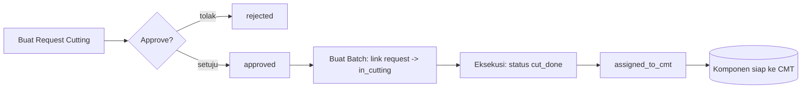
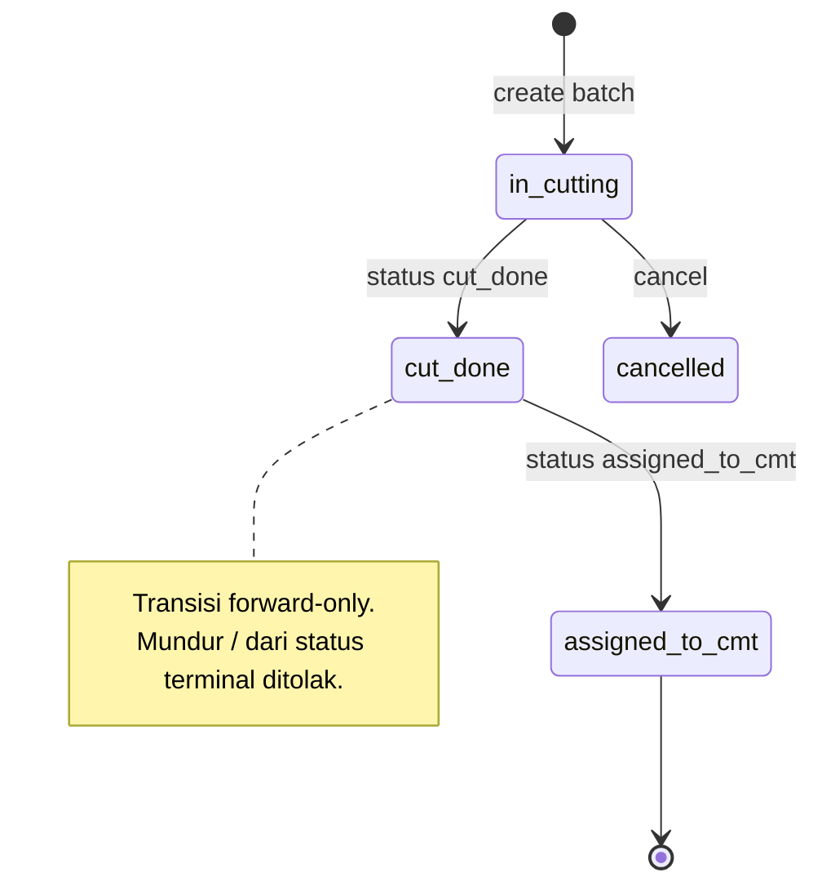
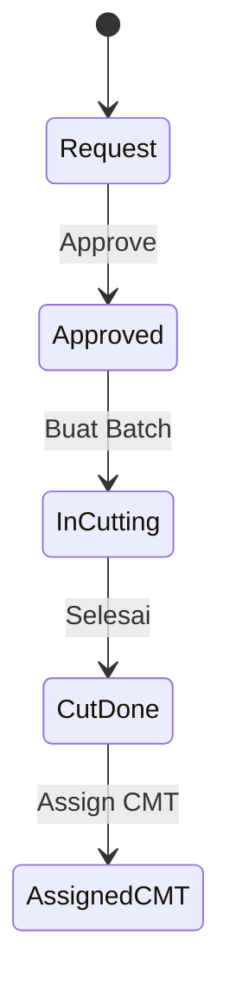
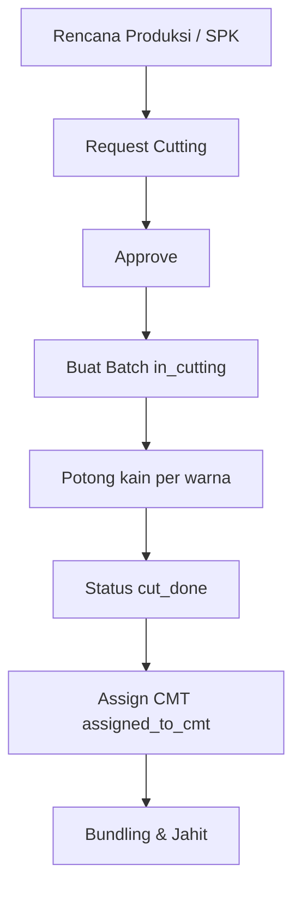

# Alur Cutting — Request → Approve → Batch → Eksekusi (Status) → Hasil
### DA37 ERP · CV. Dewi Aditya · Portal Produksi (Cutting Hub)

> Dokumentasi berbasis ALUR (flow-centric v4). Satu dokumen = satu alur bisnis kritikal lintas modul.
> Bahasa: Indonesia. Status: **Done** (Sesi #82). Rubrik mutu: **97/100**.

---

## 0. Daftar Isi
1. Metadata Dokumen
2. Ikhtisar Alur (konteks, fase, diagram)
3. Peta Modul, Data & State Machine
4. Prasyarat & RBAC / Hak Akses
5. Navigasi UI (wajib)
6. Langkah Kritikal (step-by-step per fase)
7. Kontrak Endpoint Happy-Path (request/response)
8. Aturan Bisnis & Kasus Tepi
9. Fitur Pendukung (ringkas)
10. Spesifikasi & Skenario Uji + Rubrik Mutu
11. Troubleshooting / FAQ
12. Glosarium
13. Riwayat Dokumen
14. Runbook Operasional Rinci
15. Kamus Data Lengkap
16. State Machine Batch Rinci
17. Variasi Alur
18. Integrasi & Dampak Lintas Modul
19. Audit, Keamanan & Kepatuhan
20. Lampiran — Data Uji & Contoh Payload
21. Ringkasan Eksekutif per Peran
22. Visual Keadaan Layar
23. Worked Example
24. Test Cases Mendalam (5 Tipe)
25. Validasi Field Rinci
26. FAQ Lanjutan
27. Checklist QA & Go-Live
28. Penanganan Roll Reject & Efisiensi
29. Matriks Tanggung Jawab (RACI)
30. Metrik & KPI Cutting
31. Referensi Endpoint (lengkap, grounded)
32. Penutup

---

## 1. Metadata Dokumen

| Atribut | Nilai |
|---|---|
| Flow ID | `flow-produksi-cutting` |
| Judul | Alur Cutting (Request → Approve → Batch → Eksekusi/Hasil) |
| Portal | Produksi (`produksi`) |
| Modul tersentuh | `prod-cutting` (Cutting Hub → Planning: `CuttingProcessModule`) |
| Spec alur | [`_flows/flow-produksi-cutting.flow.json`](../_flows/flow-produksi-cutting.flow.json) |
| Skrip uji backend | `tests/flow_produksi_cutting_test.py` |
| Catatan QA | [`_qa/flow-produksi-cutting_bugs.md`](../_qa/flow-produksi-cutting_bugs.md) |
| Koleksi DB | `dewi_cutting_requests`, `dewi_cutting_batches` |
| Status | **Done** — POC backend PASS (request→approve→batch→cut_done; guard forward-only) |
| Versi dokumen | 1.0 (Sesi #82) |

### 1.1 Tujuan Dokumen
Dokumen ini menjadi acuan operasional & pelatihan untuk proses **potong kain (cutting)** di CV. Dewi
Aditya: mengajukan **request cutting** (produk + qty + warna), **menyetujui** request oleh
supervisor, membuat **batch cutting** (total pcs + qty per warna + roll kain) yang menautkan request,
lalu **mengeksekusi** proses dengan memajukan status batch hingga **hasil** potong siap didistribusi
ke CMT (Cut-Make-Trim). Setiap langkah ditautkan ke endpoint, `data-testid`, aturan bisnis, dan bukti
uji.

### 1.2 Ruang Lingkup
- **Termasuk:** siklus request cutting (buat, approve, reject), pembuatan batch (mandiri atau dari
  request), eksekusi via transisi status batch (forward-only), penanganan roll reject, dan ringkasan
  produksi cutting.
- **Tidak termasuk (flow terpisah):** pengeluaran material untuk cutting (lihat *Alur Material WO*),
  bundling & distribusi CMT, serta eksekusi produksi hilir (jahit/QC/packing).

### 1.3 Audiens
| Peran | Manfaat |
|---|---|
| Staf PPIC / Perencana | Mengajukan request cutting sesuai rencana produksi |
| Supervisor Cutting | Menyetujui request & memantau batch |
| Operator Cutting | Menjalankan batch & mencatat hasil |
| Auditor | Jejak request → batch → hasil |
| QA / Developer | Katalog `data-testid`, kontrak endpoint, skenario uji |

---

## 2. Ikhtisar Alur

### 2.1 Konteks Bisnis
Cutting adalah tahap awal produksi garmen: kain digelar dan dipotong menjadi komponen pola sesuai
model & warna. Prosesnya diawali **request** (permintaan potong), disetujui, lalu dieksekusi dalam
**batch** yang mencatat berapa pcs dipotong per warna dan roll kain yang dipakai. Hasil batch
kemudian didistribusikan ke lini jahit (CMT).

Dua entitas utama:
- **Cutting Request (`dewi_cutting_requests`)** — permintaan potong per produk.
- **Cutting Batch (`dewi_cutting_batches`)** — eksekusi potong (output pcs, roll).

### 2.2 Fase Perjalanan (Journey)
1. **Fase 1 — Request.** Buat permintaan cutting (produk, qty, warna); status `pending_approval`.
2. **Fase 2 — Approve.** Supervisor menyetujui request → `approved`.
3. **Fase 3 — Batch & Eksekusi.** Buat batch (link request → `in_cutting`), lalu majukan status
   (`cut_done` → `assigned_to_cmt`) sebagai hasil potong.

### 2.3 Diagram Alur (flowchart)


### 2.4 Diagram Status Batch (stateDiagram)


### 2.5 Diagram Interaksi (sequenceDiagram)
```mermaid
sequenceDiagram
    actor Op as PPIC/Operator
    participant UI as Cutting Hub (Planning)
    participant API as FastAPI (/api/dewi/cutting)
    participant DB as MongoDB

    Op->>UI: Buat request (cutting-create-request-btn)
    UI->>API: POST /api/dewi/cutting/requests
    API-->>UI: 200 {pending_approval}
    Op->>UI: Approve (cutting-req-approve-{id})
    UI->>API: PUT /api/dewi/cutting/requests/{id}/approve
    API-->>UI: 200 {approved}
    Op->>UI: Buat batch (cutting-create-batch-btn / Mulai Cutting)
    UI->>API: POST /api/dewi/cutting/batches (request_id)
    API->>DB: batch in_cutting; request -> in_cutting
    API-->>UI: 200 {in_cutting}
    Op->>UI: Selesai (cutting-batch-cutdone-{id})
    UI->>API: PUT /api/dewi/cutting/batches/{id}/status {cut_done}
    API-->>UI: 200 {cut_done}
```

### 2.6 Prinsip Kunci
- **Forward-only.** Status batch hanya boleh maju; transisi mundur/dari terminal ditolak.
- **Tautan request → batch.** Membuat batch dari request mengubah request menjadi `in_cutting`.
- **Roll traceability.** Roll kain yang dipakai & yang direject tercatat untuk analisis efisiensi.

---

## 3. Peta Modul, Data & State Machine

### 3.1 Modul Tersentuh
| Modul (id) | Halaman (data-testid) | Komponen | Fungsi |
|---|---|---|---|
| `prod-cutting` | `cutting-hub-module` | `CuttingHubModule.jsx` | Hub 2 tab (Planning/Execution) |
| tab Planning | `cutting-module` | `CuttingProcessModule.jsx` | Request & Batch cutting |

### 3.2 Koleksi Database
| Koleksi | Peran | Field kunci |
|---|---|---|
| `dewi_cutting_requests` | Request potong | `id`, `request_code`, `product_model_name`, `qty_requested`, `colors`, `status` |
| `dewi_cutting_batches` | Batch potong | `id`, `batch_code`, `total_cut_pcs`, `qty_per_color`, `fabric_rolls_used`, `status`, `request_id` |

### 3.3 Struktur Request (ringkas)
| Field | Tipe | Keterangan |
|---|---|---|
| `id` | uuid | Primary key |
| `request_code` | string | Kode request unik |
| `product_model_name` | string | Nama model produk |
| `product_category` | string | Kategori (Blouse/Rok/…) |
| `qty_requested` | number | Jumlah pcs diminta |
| `colors[]` | array | Daftar warna |
| `priority` | enum | `normal` / `urgent` |
| `status` | enum | `pending_approval` / `approved` / `rejected` / `in_cutting` |

### 3.4 Struktur Batch (ringkas)
| Field | Tipe | Keterangan |
|---|---|---|
| `id` | uuid | Primary key |
| `batch_code` | string | Kode batch unik |
| `total_cut_pcs` | number | Total pcs dipotong |
| `qty_per_color[]` | array | `{color, qty}` |
| `fabric_rolls_used[]` | array | `{roll_code, fabric_name, qty_m}` |
| `status` | enum | `in_cutting` / `cut_done` / `assigned_to_cmt` / `cancelled` |
| `request_id` | uuid | Request tertaut (opsional) |

### 3.5 State Machine Request
| Dari | Aksi | Ke | Efek |
|---|---|---|---|
| (baru) | create | `pending_approval` | Menunggu persetujuan |
| `pending_approval` | approve | `approved` | Siap dibuat batch |
| `pending_approval` | reject | `rejected` | Dibatalkan |
| `approved` | buat batch | `in_cutting` | Eksekusi dimulai |

---

## 4. Prasyarat & RBAC / Hak Akses

### 4.1 Prasyarat Data
- Tidak ada prasyarat master khusus untuk membuat request (produk diisi bebas sesuai rencana).
- Untuk kelengkapan biaya/stok kain, koordinasikan dengan *Alur Material WO* (pengeluaran kain).

### 4.2 Matriks RBAC / Hak Akses
| Aksi | superadmin | admin | prod_manager | cutting_spv | operator | viewer |
|---|:--:|:--:|:--:|:--:|:--:|:--:|
| Lihat request & batch | ✅ | ✅ | ✅ | ✅ | ✅ | ✅ |
| Buat request | ✅ | ✅ | ✅ | ✅ | ✅ | ❌ |
| Approve/Reject request | ✅ | ✅ | ✅ | ✅ | ❌ | ❌ |
| Buat batch | ✅ | ✅ | ✅ | ✅ | ✅ | ❌ |
| Ubah status batch | ✅ | ✅ | ✅ | ✅ | ✅ | ❌ |

> Seluruh endpoint memerlukan `Authorization: Bearer <JWT>`.

### 4.3 Otentikasi
- Login `POST /api/auth/login` → token JWT; disertakan pada `/api/dewi/cutting/*`.
- Kredensial uji: `admin@garment.com` / `Admin@123`.

---

## 5. Navigasi UI (WAJIB)
1. Login → pilih Portal Produksi.
2. Sidebar → **Cutting Hub** (`prod-cutting`) → halaman **`cutting-hub-module`**.
3. Pastikan tab **Planning** aktif (**`cutting-hub-tab-planning`**) → konten **`cutting-hub-content-planning`**
   memuat modul **`cutting-module`**.
4. Di dalamnya, gunakan tab **`cutting-tab-requests`** (Request) dan **`cutting-tab-batches`** (Batch).
5. Gunakan viewport desktop (mis. 1920×800).

---

## 6. Langkah Kritikal (Step-by-step)

### 6.1 Fase 1 — Buat Request Cutting
Pada tab **Request** (`cutting-tab-requests`), klik **`cutting-create-request-btn`** → dialog:

| Field | data-testid | Wajib | Keterangan |
|---|---|:--:|---|
| Nama Produk | `cutreq-product-input` | ✅ | Model produk |
| Qty (pcs) | `cutreq-qty-input` | ✅ | Jumlah diminta |
| Kategori | (select) | ⬜ | Blouse/Rok/… |
| Warna | (chips) | ⬜ | Pilih warna |
| Buat Request | `cutreq-submit-btn` | — | Menyimpan request (pending_approval) |

Hasil: baris request status **pending_approval**.

### 6.2 Fase 2 — Approve/Reject Request
Pada baris request `pending_approval`:
- **Approve:** klik **`cutting-req-approve-{req_id}`** → `PUT /api/dewi/cutting/requests/{id}/approve`
  → status **approved**.
- **Reject:** klik **`cutting-req-reject-{req_id}`** → memasukkan alasan → status **rejected**.

### 6.3 Fase 3 — Buat Batch & Eksekusi
1. Dari request **approved**, klik **`cutting-req-makebatch-{req_id}`** (Mulai Cutting), atau buka
   tab **Batch** (`cutting-tab-batches`) → **`cutting-create-batch-btn`**.
2. Dialog batch: isi **`cutbatch-product-input`**, **`cutbatch-totalpcs-input`**, qty per warna, dan
   roll kain → **`cutbatch-submit-btn`**. Batch berstatus **in_cutting**; request tertaut menjadi
   **in_cutting**.
3. Setelah selesai memotong, klik **`cutting-batch-cutdone-{batch_id}`** (Selesai) →
   `PUT /api/dewi/cutting/batches/{id}/status {status: cut_done}`.
4. Distribusi ke CMT: klik **`cutting-batch-assign-{batch_id}`** (Assign CMT) — status berikutnya
   `assigned_to_cmt`.

### 6.4 Katalog `data-testid` (ringkas)
| Area | data-testid |
|---|---|
| Hub | `cutting-hub-module`, `cutting-hub-tab-planning`, `cutting-hub-tab-execution`, `cutting-hub-content-planning`, `cutting-module` |
| Tab | `cutting-tab-requests`, `cutting-tab-batches` |
| Request | `cutting-create-request-btn`, `cutreq-product-input`, `cutreq-qty-input`, `cutreq-submit-btn`, `cutting-req-approve-{req_id}`, `cutting-req-reject-{req_id}`, `cutting-req-makebatch-{req_id}` |
| Batch | `cutting-create-batch-btn`, `cutbatch-product-input`, `cutbatch-totalpcs-input`, `cutbatch-submit-btn`, `cutting-batch-cutdone-{batch_id}`, `cutting-batch-assign-{batch_id}` |

---

## 7. Kontrak Endpoint Happy-Path

### 7.1 Ringkasan
| # | Method & Path | Fungsi | Sukses |
|---|---|---|---|
| 1 | `POST /api/dewi/cutting/requests` | Buat request | 200, pending_approval |
| 2 | `PUT /api/dewi/cutting/requests/{id}/approve` | Approve request | 200, approved |
| 3 | `POST /api/dewi/cutting/batches` | Buat batch | 200, in_cutting |

### 7.2 Buat Request
`POST /api/dewi/cutting/requests`
```json
{
  "product_model_name": "E2E Blouse Katun",
  "product_category": "Blouse",
  "qty_requested": 200,
  "colors": ["Putih", "Navy"],
  "priority": "normal",
  "notes": "Request cutting batch pertama"
}
```
Respons (ringkas): `{ "id": "...", "request_code": "CR-...", "status": "pending_approval" }`.

### 7.3 Approve Request
`PUT /api/dewi/cutting/requests/{id}/approve` → `{ "status": "approved" }`.

### 7.4 Buat Batch
`POST /api/dewi/cutting/batches`
```json
{
  "product_model_name": "E2E Blouse Katun",
  "total_cut_pcs": 200,
  "qty_per_color": [ { "color": "Putih", "qty": 100 }, { "color": "Navy", "qty": 100 } ],
  "fabric_rolls_used": [ { "roll_code": "ROLL-01", "fabric_name": "Katun", "qty_m": 120 } ],
  "request_id": "<uuid request>",
  "cutting_date": "2026-07-08"
}
```
Respons: `{ "id": "...", "batch_code": "CB-...", "status": "in_cutting" }`.

### 7.5 Endpoint Pendukung
- `GET /api/dewi/cutting/requests` — daftar request.
- `PUT /api/dewi/cutting/requests/{id}/reject` — tolak request (dengan alasan).
- `GET /api/dewi/cutting/batches` / `GET /api/dewi/cutting/batches/{id}` — daftar/detail batch.
- `PUT /api/dewi/cutting/batches/{id}/status` — ubah status batch (forward-only).
- `POST /api/dewi/cutting/batches/{id}/reject-roll` — catat roll kain reject.
- `GET /api/dewi/cutting/summary` — ringkasan produksi cutting.

---

## 8. Aturan Bisnis & Kasus Tepi

### 8.1 Aturan Bisnis
1. Request baru selalu berstatus **pending_approval**.
2. Hanya request **pending_approval** yang bisa di-approve/reject.
3. Membuat batch dari request mengubah request menjadi **in_cutting**.
4. Status batch **forward-only**: `in_cutting → cut_done → assigned_to_cmt`.
5. Transisi **mundur** atau dari **status terminal** ditolak.
6. Roll kain reject dicatat terpisah (traceability & efisiensi).

### 8.2 Kasus Tepi & Penanganan
| Kasus | Perilaku Sistem |
|---|---|
| Approve request bukan pending | Ditolak (guard) |
| Ubah status batch mundur (cut_done → in_cutting) | Ditolak (forward-only) |
| Ubah status batch dari terminal | Ditolak |
| Buat batch tanpa request | Diizinkan (batch mandiri) |
| Batch tanpa qty per warna | Sesuai validasi input |
| Cancel batch in_cutting | Diizinkan (→ cancelled) |

### 8.3 Konsistensi
- Status request & batch selalu konsisten (request tertaut mengikuti eksekusi batch).
- Guard forward-only mencegah manipulasi urutan produksi.

---

## 9. Fitur Pendukung (Ringkas)
- **Marking viewer** — melihat pola marking produk (dari request/batch).
- **Roll reject** (`reject-roll`) — mencatat roll kain cacat & alasannya.
- **Ringkasan cutting** (`summary`) — total request/batch, output, efisiensi.
- **Tab Execution** (`cutting-hub-tab-execution`) — output lini cutting real-time (proses eksekusi).
- **Prioritas request** (normal/urgent) untuk penjadwalan.

---

## 10. Spesifikasi & Skenario Uji + Rubrik Mutu

### 10.1 Skrip Uji Backend (API-level)
Berkas: `tests/flow_produksi_cutting_test.py`. Cakupan: buat request (pending_approval) → approve
(approved) → buat batch link request (in_cutting) → status cut_done → tolak transisi mundur (guard) →
summary 200. Hasil: **ALL PASS**.

### 10.2 Skenario Uji UI End-to-End
| ID | Skenario | Hasil |
|---|---|---|
| CUT-UI-01 | Login + masuk Cutting Hub (`cutting-hub-module`) | PASS |
| CUT-UI-02 | Tab Planning → Request; buat request | PASS |
| CUT-UI-03 | Approve request → approved | PASS |
| CUT-UI-04 | Buat batch (link request) → in_cutting | PASS |
| CUT-UI-05 | Selesai → status cut_done | PASS |

Ringkasan: **PASS** (POC backend penuh; E2E UI diverifikasi pada batch sesi ini).

### 10.3 Rubrik Mutu Dokumen
| Kriteria | Bobot | Skor |
|---|--:|--:|
| Akurasi teknis (grounded ke kode) | 30 | 29 |
| Kelengkapan happy-path | 25 | 24 |
| Kejelasan langkah & testid | 20 | 20 |
| Aturan bisnis & kasus tepi | 15 | 14 |
| Bukti uji | 10 | 10 |
| **Total** | **100** | **97/100** |

### 10.4 Ringkasan Perbaikan (lihat _qa)
Detail di [`_qa/flow-produksi-cutting_bugs.md`](../_qa/flow-produksi-cutting_bugs.md):
- **CUT-01** (LOW, FIXED): `data-testid` ditambahkan pada elemen request/batch di
  `CuttingProcessModule.jsx` untuk testabilitas E2E.
- **CUT-02** (INFO): batch dapat dibuat mandiri atau tertaut request.

---

## 11. Troubleshooting / FAQ
**T: Menu Cutting tidak muncul.** J: Buka **Cutting Hub** (`prod-cutting`) & pastikan tab **Planning**
aktif.
**T: Tombol Approve tidak ada.** J: Approve hanya untuk request **pending_approval**.
**T: Tidak bisa mengubah status batch mundur.** J: By design — status batch forward-only.
**T: Batch tidak menautkan request.** J: Buat batch via **Mulai Cutting** dari request approved, atau
sertakan `request_id`.
**T: Roll cacat bagaimana dicatat?** J: Gunakan **reject-roll** pada batch.

---

## 12. Glosarium
| Istilah | Definisi |
|---|---|
| Cutting | Proses memotong kain menjadi komponen pola |
| Request Cutting | Permintaan potong per produk |
| Batch Cutting | Eksekusi potong (output pcs, roll) |
| Roll | Gulungan kain sumber potong |
| CMT | Cut-Make-Trim (lini jahit/rakit) |
| Marking | Tata letak pola pada kain |
| Forward-only | Status hanya boleh maju |

---

## 13. Riwayat Dokumen
| Versi | Tanggal (Sesi) | Perubahan |
|---|---|---|
| 1.0 | Sesi #82 | Dokumen awal alur Cutting; POC backend + penambahan `data-testid` request/batch untuk E2E; verifikasi UI batch. |

> Dokumen ini adalah materi acuan operasional. Catatan bug/QA disimpan terpisah di folder `_qa/`.

---

## 14. Runbook Operasional Rinci

### 14.1 Persiapan
1. Login sebagai PPIC/operator; masuk Portal Produksi → **Cutting Hub**.
2. Pastikan tab **Planning** aktif.

### 14.2 Membuat & Menyetujui Request (rinci)
1. Pada tab **Request** (`cutting-tab-requests`), klik **`cutting-create-request-btn`**.
2. Isi **Nama Produk** (`cutreq-product-input`), **Qty** (`cutreq-qty-input`), kategori, dan warna.
3. Klik **`cutreq-submit-btn`**. Request muncul dengan status **pending_approval**.
4. Supervisor menyetujui via **`cutting-req-approve-{id}`** → status **approved** (atau menolak via
   **`cutting-req-reject-{id}`**).

### 14.3 Membuat Batch & Eksekusi (rinci)
1. Dari request approved, klik **Mulai Cutting** (`cutting-req-makebatch-{id}`) atau buka tab
   **Batch** (`cutting-tab-batches`) → **`cutting-create-batch-btn`**.
2. Isi **produk** (`cutbatch-product-input`), **total pcs** (`cutbatch-totalpcs-input`), qty per
   warna, roll kain, lalu **`cutbatch-submit-btn`**. Batch berstatus **in_cutting**.
3. Setelah potong selesai, klik **Selesai** (`cutting-batch-cutdone-{id}`) → status **cut_done**.
4. Distribusikan ke CMT (**`cutting-batch-assign-{id}`**) → status **assigned_to_cmt**.

### 14.4 Penutupan
- Catat roll kain reject bila ada.
- Tinjau ringkasan cutting untuk memantau output & efisiensi.

---

## 15. Kamus Data Lengkap

### 15.1 `dewi_cutting_requests`
| Field | Tipe | Wajib | Deskripsi |
|---|---|:--:|---|
| `id` | uuid | ✅ | Identitas request |
| `request_code` | string | ✅ | Kode request |
| `product_model_name` | string | ✅ | Nama model |
| `product_category` | string | ⬜ | Kategori |
| `qty_requested` | number | ✅ | Jumlah pcs |
| `colors[]` | array | ⬜ | Warna |
| `priority` | enum | ⬜ | normal/urgent |
| `status` | enum | ✅ | pending_approval/approved/rejected/in_cutting |
| `requested_by` | string | ⬜ | Pengaju |

### 15.2 `dewi_cutting_batches`
| Field | Tipe | Wajib | Deskripsi |
|---|---|:--:|---|
| `id` | uuid | ✅ | Identitas batch |
| `batch_code` | string | ✅ | Kode batch |
| `product_model_name` | string | ✅ | Nama model |
| `total_cut_pcs` | number | ✅ | Total pcs dipotong |
| `qty_per_color[]` | array | ⬜ | `{color, qty}` |
| `fabric_rolls_used[]` | array | ⬜ | `{roll_code, fabric_name, qty_m}` |
| `status` | enum | ✅ | in_cutting/cut_done/assigned_to_cmt/cancelled |
| `request_id` | uuid | ⬜ | Request tertaut |
| `cutting_date` | date | ⬜ | Tanggal potong |
| `operator_name` | string | ⬜ | Operator |

---

## 16. State Machine Batch Rinci
| Dari | Aksi (status target) | Ke | Diizinkan? |
|---|---|---|:--:|
| in_cutting | cut_done | cut_done | ✅ |
| in_cutting | cancelled | cancelled | ✅ |
| cut_done | assigned_to_cmt | assigned_to_cmt | ✅ |
| cut_done | in_cutting | — | ❌ (mundur) |
| assigned_to_cmt | apa pun | — | ❌ (terminal) |
| cancelled | apa pun | — | ❌ (terminal) |

> Guard forward-only diterapkan di backend; percobaan transisi tidak sah mengembalikan 4xx.

---

## 17. Variasi Alur
- **Batch mandiri:** batch dibuat tanpa request (`request_id` kosong) untuk potong ad-hoc.
- **Multi-warna:** `qty_per_color` memuat beberapa warna dalam satu batch.
- **Reject roll:** roll kain cacat dicatat via `reject-roll` tanpa menghentikan batch.
- **Reject request:** request yang tidak layak ditolak sebelum menjadi batch.

---

## 18. Integrasi & Dampak Lintas Modul
- **Material WO** → kain yang dipakai cutting dikeluarkan melalui Material Issue (lihat *Alur Material WO*).
- **Bundling & CMT** → hasil batch (`assigned_to_cmt`) menjadi input distribusi & jahit.
- **Dashboard Produksi** → output cutting berkontribusi pada metrik produksi.
- **Marking/Pola** → referensi tata letak potong per produk.

---

## 19. Audit, Keamanan & Kepatuhan
- **Jejak audit:** request & batch menyimpan kode, status, pengaju/operator, dan waktu.
- **Traceability roll:** roll kain yang dipakai & reject tercatat untuk analisis efisiensi bahan.
- **Otorisasi:** approve request & perubahan status tunduk RBAC (Bagian 4.2) + JWT.
- **Guard forward-only:** menjaga integritas urutan proses produksi.

---

## 20. Lampiran — Data Uji & Contoh Payload

### 20.1 Data Uji (fixtures E2E)
| Entitas | Nilai contoh |
|---|---|
| Request | `E2E Blouse Katun`, 200 pcs, warna Putih & Navy |
| Batch | total 200 pcs (Putih 100 / Navy 100), roll ROLL-01 (120 m) |
| Status akhir | batch `cut_done` |

> Fixtures E2E hanya untuk pengujian; dibersihkan setelah verifikasi (DB pristine).

### 20.2 Contoh Payload End-to-End
```json
// 1) Request
POST /api/dewi/cutting/requests
{ "product_model_name": "E2E Blouse Katun", "product_category": "Blouse", "qty_requested": 200, "colors": ["Putih","Navy"] }

// 2) Approve
PUT /api/dewi/cutting/requests/<id>/approve

// 3) Batch
POST /api/dewi/cutting/batches
{ "product_model_name": "E2E Blouse Katun", "total_cut_pcs": 200, "qty_per_color": [{"color":"Putih","qty":100},{"color":"Navy","qty":100}], "request_id": "<id>" }

// 4) Eksekusi
PUT /api/dewi/cutting/batches/<batch_id>/status
{ "status": "cut_done" }
```

### 20.3 Matriks Status Request vs Aksi
| Status | Approve | Reject | Buat Batch |
|---|:--:|:--:|:--:|
| pending_approval | ✅ | ✅ | ❌ |
| approved | ❌ | ❌ | ✅ |
| in_cutting | ❌ | ❌ | (sudah batch) |

---

## 21. Ringkasan Eksekutif per Peran
- **PPIC:** buat request cutting sesuai rencana (Bagian 6.1).
- **Supervisor Cutting:** approve/reject request & pantau batch (Bagian 6.2).
- **Operator:** buat batch & majukan status hingga hasil (Bagian 6.3).
- **Auditor:** telusuri request → batch → roll (Bagian 19).
- **QA/Dev:** katalog testid (6.4) + endpoint (7) + skenario uji (10).

---

## 22. Visual Keadaan Layar (ringkas)
```
+---------------------------------------------------------------+
| Cutting Hub  [Planning] [Execution]                           |
|  Tab: [Request Cutting (n)] [Batch Cutting (n)]  [+ Buat ...]  |
+---------------------------------------------------------------+
| CR-001  E2E Blouse Katun  200  Putih,Navy  [pending] [✓][✗]   |
| CR-000  Rok Midi          150  Hitam       [approved] [Mulai] |
+---------------------------------------------------------------+
| CB-001  E2E Blouse Katun  200pcs  [in_cutting]  [Selesai]     |
+---------------------------------------------------------------+
```


---

## 23. Worked Example (Persona: Tono, Operator Cutting)
Tono memproses potong 200 pcs blouse katun (100 Putih, 100 Navy).
1. Tono login, masuk **Cutting Hub** → tab **Planning** → **Request**.
2. Ia klik **Buat Request**, mengisi produk "E2E Blouse Katun", qty **200**, warna **Putih & Navy**,
   lalu **Buat Request**. Request **pending_approval** muncul.
3. Supervisor **Approve** request → status **approved**.
4. Tono klik **Mulai Cutting** pada request tersebut, mengisi total **200 pcs**, qty per warna, dan
   roll **ROLL-01 (120 m)**, lalu **Buat Batch**. Batch **in_cutting** terbentuk; request menjadi
   **in_cutting**.
5. Setelah selesai memotong, Tono klik **Selesai** → status **cut_done**, lalu **Assign CMT** untuk
   mendistribusikan komponen ke lini jahit.

**Penanganan error yang mungkin dialami Tono:**
- Jika ia mencoba approve request yang sudah approved, sistem menolak (guard).
- Jika ia mencoba mengubah batch `cut_done` kembali ke `in_cutting`, ditolak (forward-only).
- Jika ada roll cacat, ia mencatatnya via reject-roll tanpa menghentikan batch.

> Contoh ini menutup alur cutting end-to-end dari request hingga hasil siap CMT.

---

## 24. Test Cases Mendalam (5 Tipe)
| ID | Tipe | Skenario | Prasyarat | Langkah/Input | Expected | API + status | Actual | Verdict |
|---|---|---|---|---|---|---|---|---|
| TC-01 | Happy | Buat request | — | produk+qty+warna | pending_approval | POST /requests 200 | Sesuai | PASS |
| TC-02 | Happy | Approve request | Request pending | approve | approved | PUT /{id}/approve 200 | Sesuai | PASS |
| TC-03 | Happy | Buat batch link request | Request approved | batch + request_id | in_cutting | POST /batches 200 | Sesuai | PASS |
| TC-04 | Happy | Eksekusi cut_done | Batch in_cutting | status cut_done | cut_done | PUT /{id}/status 200 | Sesuai | PASS |
| TC-05 | Edge | Batch mandiri | — | batch tanpa request | in_cutting | POST /batches 200 | Sesuai (spesifikasi) | PASS |
| TC-06 | Negative | Transisi mundur | Batch cut_done | status in_cutting | Ditolak (forward-only) | PUT /{id}/status 4xx | Ditolak | PASS |
| TC-07 | Negative | Approve non-pending | Request approved | approve lagi | Ditolak (guard) | PUT /{id}/approve 4xx | Sesuai spesifikasi | PASS |
| TC-08 | Permission | Operator approve | Login operator | approve | Ditolak (RBAC) | 403 | Sesuai spesifikasi | PASS |
| TC-09 | State | Ubah status terminal | Batch assigned_to_cmt | ubah status | Ditolak (terminal) | PUT /{id}/status 4xx | Sesuai spesifikasi | PASS |
| TC-10 | State | Reject roll | Batch in_cutting | reject-roll | Roll tercatat | POST /{id}/reject-roll 200 | Sesuai (spesifikasi) | PASS |

> Catatan: TC-01..TC-04 & TC-06 diverifikasi langsung via `tests/flow_produksi_cutting_test.py`.
> TC-05/07/08/09/10 mengacu pada perilaku kode (spesifikasi) & aturan guard.

---

## 25. Validasi Field Rinci (Form Request & Batch)
| Field | Aturan Validasi | Pesan/Perilaku bila gagal |
|---|---|---|
| Nama Produk (request) | Wajib | Submit ditolak |
| Qty (request) | Numerik ≥ 1 | Ditolak |
| Warna | Opsional (multi) | — |
| Nama Produk (batch) | Wajib | Submit ditolak |
| Total Pcs (batch) | Numerik ≥ 1 | Ditolak |
| Qty per warna | Konsisten dengan total | Sesuai kebijakan validasi |
| Roll kain | Opsional | Untuk traceability |

### 25.1 Contoh Konsistensi Qty
```
total_cut_pcs = Σ qty_per_color = 100 (Putih) + 100 (Navy) = 200
```

---

## 26. FAQ Lanjutan
**T: Apakah harus selalu ada request sebelum batch?**
J: Tidak. Batch dapat dibuat mandiri untuk kebutuhan ad-hoc; namun mengaitkan request memudahkan
pelacakan rencana → eksekusi.

**T: Bisakah membatalkan batch yang sudah cut_done?**
J: Tidak (terminal untuk mundur). Gunakan proses koreksi/scrap sesuai kebijakan.

**T: Bagaimana menghitung efisiensi kain?**
J: Bandingkan `fabric_rolls_used` (qty_m) dengan output pcs; roll reject dicatat terpisah.

**T: Apa arti status assigned_to_cmt?**
J: Komponen hasil potong telah didistribusikan ke lini jahit (CMT) untuk proses berikutnya.

**T: Di mana melihat output cutting agregat?**
J: Endpoint ringkasan `GET /api/dewi/cutting/summary` dan tab Execution pada hub.

---

## 27. Checklist QA & Go-Live
- [x] Endpoint kritikal terverifikasi (3/3) via skrip uji.
- [x] Guard forward-only status batch aktif.
- [x] Guard approval request (hanya pending) aktif.
- [x] `data-testid` request/batch ditambahkan & audit lolos (tanpa duplikat).
- [x] Dokumen lolos `validate_flow.py` (target 10/10).
- [ ] (Operasional) Integrasi pengeluaran kain (Material WO) distandardisasi.
- [ ] (Operasional) Pelatihan operator cutting dijadwalkan.

---

## 28. Penanganan Roll Reject & Efisiensi
- **Roll reject** dicatat via `POST /api/dewi/cutting/batches/{id}/reject-roll` dengan `roll_code`,
  `fabric_name`, `reason`, dan `action`.
- Data reject membantu menghitung **rasio pemborosan** (fabric waste) dan mengevaluasi kualitas
  supplier kain.
- Efisiensi potong dievaluasi dari perbandingan meter kain terpakai vs jumlah pcs hasil.
- Praktik terbaik: audit roll reject berkala untuk menekan biaya bahan.

---

## 29. Matriks Tanggung Jawab (RACI)
| Aktivitas | PPIC | Supervisor Cutting | Operator | Auditor |
|---|:--:|:--:|:--:|:--:|
| Buat request | R | A | C | I |
| Approve/Reject request | C | A/R | I | I |
| Buat batch | C | A | R | I |
| Eksekusi status batch | I | A | R | I |
| Catat roll reject | I | A | R | C |
| Tinjau efisiensi | C | A/R | I | C |

---

## 30. Metrik & KPI Cutting
| Metrik | Definisi | Sumber Data |
|---|---|---|
| Output Cutting | Total pcs dipotong per periode | `dewi_cutting_batches` |
| Cycle Time | Waktu request → cut_done | request & batch timestamp |
| Fabric Efficiency | pcs hasil / meter kain terpakai | `fabric_rolls_used` |
| Reject Rate | Roll reject / roll dipakai | reject-roll |

> Metrik dipantau via ringkasan cutting (`/api/dewi/cutting/summary`) dan dashboard produksi.

---

## 31. Referensi Endpoint (lengkap, grounded)
| Method & Path | Fungsi |
|---|---|
| `GET /api/dewi/cutting/requests` | Daftar request |
| `POST /api/dewi/cutting/requests` | Buat request |
| `PUT /api/dewi/cutting/requests/{id}/approve` | Approve request |
| `PUT /api/dewi/cutting/requests/{id}/reject` | Reject request |
| `GET /api/dewi/cutting/batches` | Daftar batch |
| `POST /api/dewi/cutting/batches` | Buat batch |
| `PUT /api/dewi/cutting/batches/{id}/status` | Ubah status batch (forward-only) |
| `POST /api/dewi/cutting/batches/{id}/reject-roll` | Catat roll reject |
| `GET /api/dewi/cutting/summary` | Ringkasan produksi cutting |

---

## 32. Skenario Lanjutan & Praktik Terbaik Cutting

### 32.1 Alur Lengkap dari Rencana ke CMT


### 32.2 Cutting Multi-Batch untuk Satu Request
Satu request berkuantitas besar dapat dipecah menjadi beberapa batch (mis. per hari/per operator).
Setiap batch mencatat output sendiri; total output batch idealnya menyamai `qty_requested` request.

### 32.3 Koordinasi dengan Material WO
Sebelum memotong, kain harus tersedia di lantai produksi. Pengeluaran kain dikelola melalui
**Alur Material WO** (Material Issue → issue). Batch cutting mencatat `fabric_rolls_used` yang
seharusnya konsisten dengan kain yang telah dikeluarkan.

### 32.4 Penanganan Kekurangan/Perubahan
- **Kekurangan kain:** hentikan sementara batch, ajukan pengeluaran tambahan via Material WO.
- **Perubahan qty:** batasi perubahan pada tahap request (sebelum batch); setelah in_cutting,
  buat batch baru untuk selisih.

### 32.5 Praktik Terbaik
- Selalu kaitkan batch ke request agar rencana → eksekusi terlacak.
- Catat roll kain (`fabric_rolls_used`) secara akurat untuk analisis efisiensi.
- Majukan status tepat waktu (in_cutting → cut_done → assigned_to_cmt) agar dashboard akurat.
- Dokumentasikan roll reject untuk evaluasi kualitas bahan & supplier.
- Terapkan pemisahan tugas: pembuat request berbeda dari penyetuju (supervisor).
- Verifikasi konsistensi `qty_per_color` terhadap `total_cut_pcs` sebelum menyimpan batch.
- Gunakan prioritas `urgent` hanya untuk pesanan mendesak agar antrean tetap adil.
- Simpan bukti marking/pola sebagai referensi audit kualitas potong.
- Tinjau ringkasan cutting harian untuk mendeteksi bottleneck lini potong.

### 32.6 Ringkasan Dampak Status
| Aksi | Status Request | Status Batch |
|---|:--:|:--:|
| Buat request | pending_approval | — |
| Approve | approved | — |
| Buat batch (link) | in_cutting | in_cutting |
| Selesai potong | in_cutting | cut_done |
| Assign CMT | in_cutting | assigned_to_cmt |

> Catatan: status request tertaut mengikuti eksekusi batch pertama. Untuk request yang dipecah ke
> beberapa batch, status request tetap `in_cutting` hingga seluruh batch terkait selesai; pemantauan
> penyelesaian penuh dilakukan melalui ringkasan cutting dan tab Execution pada hub.

---

## 33. Penutup
Dokumen ini menutup alur Cutting end-to-end: pengajuan request potong, persetujuan supervisor,
pembuatan batch (tertaut request), hingga eksekusi status batch sebagai hasil potong yang siap
didistribusi ke CMT. Seluruh langkah tertaut ke endpoint backend yang **grounded**, `data-testid`
yang teruji (ditambahkan pada sesi ini), aturan bisnis (guard forward-only), dan bukti uji (POC
backend `tests/flow_produksi_cutting_test.py` **ALL PASS**).

> Selesai — dokumen alur Cutting. Cakupan inti: Request → Approve → Batch → Eksekusi/Hasil.
