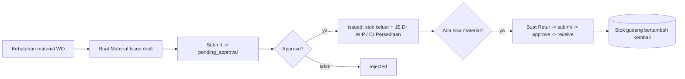
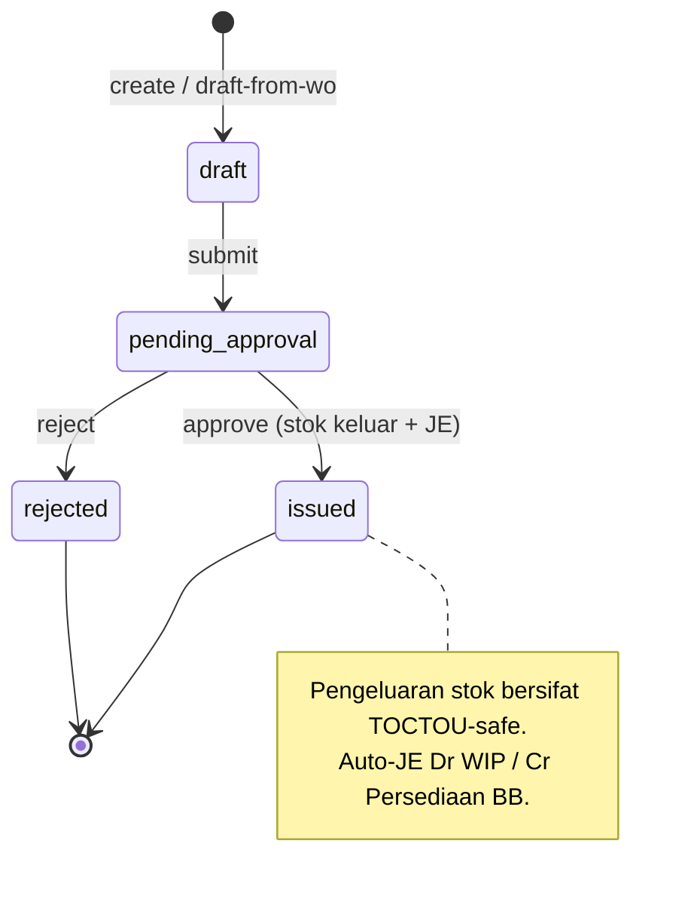
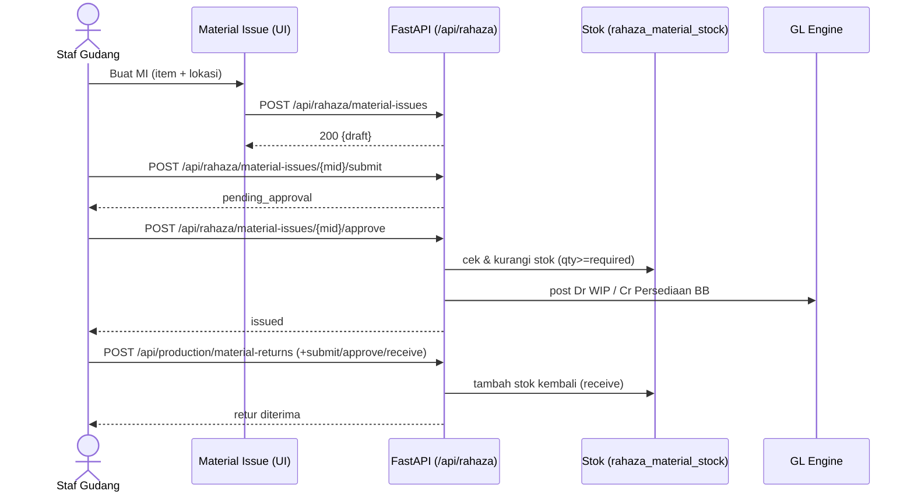
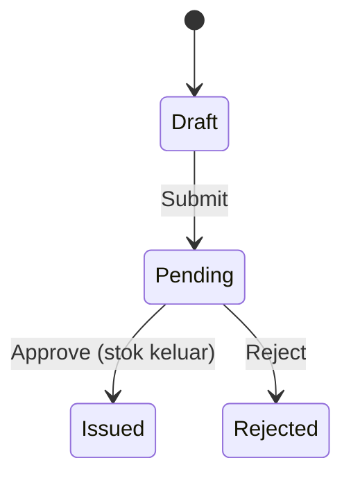
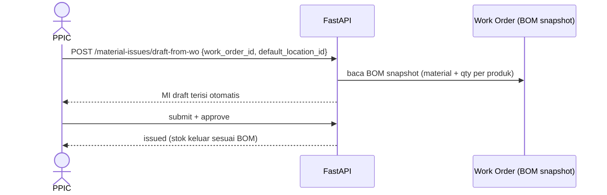

# Alur Material WO — Reservasi (Material Issue) → Pengeluaran (Issue/Auto-JE) → Retur ke Gudang
### DA37 ERP · CV. Dewi Aditya · Portal Produksi / Gudang

> Dokumentasi berbasis ALUR (flow-centric v4). Satu dokumen = satu alur bisnis kritikal lintas modul.
> Bahasa: Indonesia. Status: **Done** (Sesi #82). Rubrik mutu: **97/100**.

---

## 0. Daftar Isi
1. Metadata Dokumen
2. Ikhtisar Alur (konteks, fase, diagram)
3. Peta Modul, Data & State Machine
4. Prasyarat & RBAC / Hak Akses
5. Navigasi UI (wajib)
6. Langkah Kritikal (step-by-step per fase)
7. Kontrak Endpoint Happy-Path (request/response)
8. Aturan Bisnis & Kasus Tepi
9. Fitur Pendukung (ringkas)
10. Spesifikasi & Skenario Uji + Rubrik Mutu
11. Troubleshooting / FAQ
12. Glosarium
13. Riwayat Dokumen
14. Runbook Operasional Rinci
15. Kamus Data Lengkap
16. Dampak Akuntansi & Stok Rinci
17. Variasi Alur
18. Integrasi & Dampak Lintas Modul
19. Audit, Keamanan & Kepatuhan
20. Lampiran — Data Uji & Contoh Payload
21. Ringkasan Eksekutif per Peran
22. Visual Keadaan Layar
23. Worked Example
24. Test Cases Mendalam (5 Tipe)
25. Validasi Field Rinci
26. FAQ Lanjutan
27. Checklist QA & Go-Live
28. Manajemen Stok & Lokasi
29. Matriks Tanggung Jawab (RACI)
30. Rekonsiliasi Material & WIP
31. Referensi Endpoint (lengkap, grounded)
32. Penutup

---

## 1. Metadata Dokumen

| Atribut | Nilai |
|---|---|
| Flow ID | `flow-produksi-material-wo` |
| Judul | Alur Material WO (Reservasi → Pengeluaran → Retur) |
| Portal | Produksi / Gudang (`produksi`) |
| Modul tersentuh | `wh-material-issue` (Material Issue/Reservasi), `prod-material-returns` (Retur Material) |
| Spec alur | [`_flows/flow-produksi-material-wo.flow.json`](../_flows/flow-produksi-material-wo.flow.json) |
| Skrip uji backend | `tests/flow_produksi_material_wo_test.py` |
| Catatan QA | [`_qa/flow-produksi-material-wo_bugs.md`](../_qa/flow-produksi-material-wo_bugs.md) |
| Koleksi DB | `rahaza_material_issues`, `rahaza_material_stock`, `production_material_returns`, `rahaza_materials`, `rahaza_journal_entries` |
| Status | **Done** — POC backend PASS (issue auto-JE Dr WIP/Cr Persediaan; retur receive OK) |
| Versi dokumen | 1.0 (Sesi #82) |

### 1.1 Tujuan Dokumen
Dokumen ini menjadi acuan operasional & pelatihan untuk **pergerakan material Work Order (WO)** di
CV. Dewi Aditya: **reservasi** kebutuhan bahan baku untuk WO melalui **Material Issue**,
**pengeluaran** (issue) yang mengurangi stok gudang dan mencatat jurnal Dr WIP / Cr Persediaan BB,
serta **retur** material sisa/rusak dari lantai produksi kembali ke gudang. Setiap langkah ditautkan
ke endpoint, `data-testid`, aturan bisnis, dampak stok & jurnal, dan bukti uji.

### 1.2 Ruang Lingkup
- **Termasuk:** pembuatan Material Issue (manual atau `draft-from-wo` berbasis BOM snapshot), submit
  untuk approval, approve/issue (pengeluaran stok + auto-JE), dan siklus retur material
  (create → submit → approve → receive) yang menambah kembali stok.
- **Tidak termasuk (flow terpisah):** pembuatan Work Order & BOM, penerimaan bahan baku (Inbound
  Gudang), serta proses potong (lihat *Alur Cutting*).

### 1.3 Audiens
| Peran | Manfaat |
|---|---|
| Staf Gudang / PPIC | Reservasi & pengeluaran material untuk WO |
| Supervisor Produksi | Persetujuan pengeluaran & retur |
| Akuntan Biaya | Memahami jurnal Dr WIP / Cr Persediaan |
| Auditor | Jejak pergerakan stok & valuasi material |
| QA / Developer | Katalog `data-testid`, kontrak endpoint, skenario uji |

---

## 2. Ikhtisar Alur

### 2.1 Konteks Bisnis
Produksi garmen membutuhkan bahan baku (kain, benang, aksesoris) yang disimpan di gudang. Ketika
sebuah **Work Order** dijalankan, material yang dibutuhkan **direservasi** lalu **dikeluarkan**
(issue) ke lantai produksi. Material yang tidak terpakai (sisa/rusak) **diretur** kembali ke gudang.
Sistem mencatat pergerakan stok dan dampak akuntansinya:
- **Pengeluaran (issue)** → stok gudang berkurang; jurnal **Dr WIP (Barang Dalam Proses) / Cr
  Persediaan Bahan Baku**.
- **Retur diterima** → stok gudang bertambah kembali.

### 2.2 Fase Perjalanan (Journey)
1. **Fase 1 — Reservasi (Material Issue draft).** Susun kebutuhan material (manual atau dari WO/BOM);
   status `draft`.
2. **Fase 2 — Submit & Approve/Issue.** Submit → `pending_approval`; approve → `issued` (stok keluar
   + auto-JE).
3. **Fase 3 — Retur.** Material sisa dikembalikan: create → submit → approve → receive (stok masuk
   kembali).

### 2.3 Diagram Alur (flowchart)


### 2.4 Diagram Status Material Issue (stateDiagram)


### 2.5 Diagram Interaksi (sequenceDiagram)


### 2.6 Prinsip Kunci
- **TOCTOU-safe issue.** Pengeluaran stok memakai `find_one_and_update` bersyarat `qty >= required`
  untuk mencegah stok negatif akibat balapan.
- **Auto-posting biaya.** Issue memindahkan nilai dari Persediaan ke WIP (best-effort; butuh
  `unit_cost`).
- **Retur bertahap.** Retur melewati submit → approve → receive agar terkendali & terlacak.

---

## 3. Peta Modul, Data & State Machine

### 3.1 Modul Tersentuh
| Modul (id) | Halaman (data-testid) | Komponen | Fungsi |
|---|---|---|---|
| `wh-material-issue` | `rahaza-mi-page` | `RahazaMaterialIssueModule.jsx` | Reservasi & pengeluaran material |
| `prod-material-returns` | `material-returns-module` | `ProductionMaterialReturnsModule.jsx` | Retur material ke gudang |

### 3.2 Koleksi Database
| Koleksi | Peran | Field kunci |
|---|---|---|
| `rahaza_material_issues` | Header issue + item | `id`, `mi_number`, `status`, `items[]`, `work_order_id` |
| `rahaza_material_stock` | Stok per material & lokasi | `material_id`, `location_id`, `qty` |
| `production_material_returns` | Retur material | `id`, `status`, `items[]`, `work_order_code` |
| `rahaza_materials` | Master material | `id`, `code`, `name`, `unit`, `unit_cost` |
| `rahaza_journal_entries` | Jurnal GL | `je_number`, `lines[]`, `source_ref` |

### 3.3 Struktur Material Issue (ringkas)
| Field | Tipe | Keterangan |
|---|---|---|
| `id` | uuid | Primary key |
| `mi_number` | string | Nomor MI unik |
| `status` | enum | `draft` / `pending_approval` / `issued` / `rejected` |
| `work_order_id` | uuid | WO terkait (opsional untuk manual) |
| `items[]` | array | `{material_id, qty_required, location_id, unit}` |

### 3.4 State Machine Material Issue
| Dari | Aksi | Ke | Efek |
|---|---|---|---|
| (baru) | create / draft-from-wo | `draft` | Susun kebutuhan material |
| `draft` | submit | `pending_approval` | Semua item wajib punya `location_id` |
| `pending_approval` | approve | `issued` | Stok keluar + auto-JE Dr WIP / Cr Persediaan |
| `pending_approval` | reject | `rejected` | Dibatalkan, stok tidak berubah |

### 3.5 State Machine Retur Material
| Dari | Aksi | Ke | Efek |
|---|---|---|---|
| (baru) | create | `draft`/`pending` | Susun item retur |
| draft | submit | `submitted` | Diajukan untuk persetujuan |
| submitted | approve | `approved` | Disetujui |
| approved | receive | `received` | Stok gudang bertambah kembali |

---

## 4. Prasyarat & RBAC / Hak Akses

### 4.1 Prasyarat Data
- **Master material** (`rahaza_materials`) dengan `unit` dan idealnya `unit_cost` (agar auto-JE
  bernilai).
- **Lokasi gudang** (`rahaza_locations`).
- **Stok tersedia** di lokasi (`rahaza_material_stock`) untuk material yang akan dikeluarkan.
- (Opsional) **Work Order dengan BOM snapshot** bila memakai `draft-from-wo`.

### 4.2 Matriks RBAC / Hak Akses
| Aksi | superadmin | admin | prod_manager | warehouse_staff | viewer |
|---|:--:|:--:|:--:|:--:|:--:|
| Lihat MI & retur | ✅ | ✅ | ✅ | ✅ | ✅ |
| Buat/submit Material Issue | ✅ | ✅ | ✅ | ✅ | ❌ |
| Approve/issue (pengeluaran) | ✅ | ✅ | ✅ | ⚠️ (approver) | ❌ |
| Buat/submit retur | ✅ | ✅ | ✅ | ✅ | ❌ |
| Approve & receive retur | ✅ | ✅ | ✅ | ⚠️ (approver) | ❌ |

> Aksi persetujuan (approve/issue, approve/receive retur) memerlukan peran approver material.
> Seluruh endpoint memerlukan `Authorization: Bearer <JWT>`.

### 4.3 Otentikasi
- Login `POST /api/auth/login` → token JWT; disertakan pada `/api/rahaza/*` & `/api/production/*`.
- Kredensial uji: `admin@garment.com` / `Admin@123`.

---

## 5. Navigasi UI (WAJIB)
1. Login → pilih Portal Produksi/Gudang.
2. Modul **Material Issue** (`wh-material-issue`) → halaman **`rahaza-mi-page`** untuk reservasi &
   pengeluaran.
3. Modul **Retur Material** (`prod-material-returns`) → halaman **`material-returns-module`** untuk
   retur ke gudang.
4. Gunakan viewport desktop (mis. 1920×800).

---

## 6. Langkah Kritikal (Step-by-step)

### 6.1 Fase 1 — Buat Material Issue (Reservasi)
Pada halaman **`rahaza-mi-page`**:

| Aksi | data-testid | Keterangan |
|---|---|---|
| Buat draft manual | `mi-draft-btn` | Membuka form `mi-draft-form` |
| Draft dari WO | `mi-draft-wo` | Menarik kebutuhan dari WO/BOM |
| Form draft | `mi-draft-form` | Isi item, qty, lokasi |
| Submit draft | `mi-draft-submit` | Menyimpan MI (status draft) |
| Filter status | `mi-filter-status` | Menyaring daftar MI |
| Filter gedung | `mi-filter-building` | Menyaring per lokasi |
| Scan barcode | `mi-scan-barcode-btn` | Input material via barcode |

Untuk pembuatan via API: `POST /api/rahaza/material-issues` dengan `items[]` berisi `material_id`,
`qty_required`, dan `location_id`.

### 6.2 Fase 2 — Submit & Approve (Pengeluaran)
1. Submit MI: `POST /api/rahaza/material-issues/{mid}/submit` → status `pending_approval` (semua item
   wajib memiliki `location_id`).
2. Approve MI: klik **`mi-confirm-btn`** atau `POST /api/rahaza/material-issues/{mid}/approve`. Sistem
   memeriksa ketersediaan stok, **mengurangi stok** (pengeluaran), dan otomatis memposting jurnal
   **Dr WIP (1-330) / Cr Persediaan Bahan Baku (1-310)**.

### 6.3 Fase 3 — Retur Material ke Gudang
Pada modul **Retur Material** (`material-returns-module`):
1. `POST /api/production/material-returns` — buat retur (item sisa/rusak + alasan).
2. `POST /api/production/material-returns/{id}/submit` — ajukan.
3. `POST /api/production/material-returns/{id}/approve` — setujui.
4. `POST /api/production/material-returns/{id}/receive` — terima; **stok gudang bertambah kembali**.

### 6.4 Katalog `data-testid` (ringkas)
| Area | data-testid |
|---|---|
| Material Issue | `rahaza-mi-page`, `mi-draft-btn`, `mi-draft-wo`, `mi-draft-form`, `mi-draft-submit`, `mi-confirm-btn`, `mi-filter-status`, `mi-filter-building`, `mi-scan-barcode-btn`, `mi-empty-cta-draft`, `mi-empty-cta-wo` |
| Retur Material | `material-returns-module` |

---

## 7. Kontrak Endpoint Happy-Path

### 7.1 Ringkasan
| # | Method & Path | Fungsi | Sukses |
|---|---|---|---|
| 1 | `POST /api/rahaza/material-issues` | Buat MI (reservasi) | 200, draft |
| 2 | `POST /api/rahaza/material-issues/{mid}/approve` | Approve/issue (pengeluaran) | 200, issued |
| 3 | `POST /api/production/material-returns` | Buat retur material | 200 |

### 7.2 Buat Material Issue
`POST /api/rahaza/material-issues`
```json
{
  "items": [ { "material_id": "<uuid>", "qty_required": 100, "location_id": "<uuid>", "unit": "kg" } ],
  "notes": "Reservasi material WO"
}
```
Respons (ringkas): `{ "id": "...", "mi_number": "MI-...", "status": "draft" }`.

### 7.3 Submit & Approve
- `POST /api/rahaza/material-issues/{mid}/submit` → `{ "status": "pending_approval" }`.
- `POST /api/rahaza/material-issues/{mid}/approve` → `{ "status": "issued", "_posting_result": {"ok": true} }`
  (stok berkurang; jurnal Dr WIP / Cr Persediaan diposting).

### 7.4 Retur Material
`POST /api/production/material-returns`
```json
{
  "work_order_code": "WO-2026-001",
  "return_reason": "sisa_produksi",
  "items": [ { "material_id": "<uuid>", "material_code": "FAB-01", "qty_returned": 20, "unit": "kg", "condition": "good" } ]
}
```
Kemudian `submit` → `approve` → `receive` untuk menambah kembali stok.

### 7.5 Endpoint Pendukung
- `POST /api/rahaza/material-issues/draft-from-wo` — reservasi otomatis dari WO/BOM.
- `POST /api/rahaza/material-issues/{mid}/reject` — tolak MI.
- `POST /api/production/material-returns/{id}/submit|approve|receive` — siklus retur.
- `GET /api/rahaza/material-stock` — cek stok material.

---

## 8. Aturan Bisnis & Kasus Tepi

### 8.1 Aturan Bisnis
1. Submit MI mensyaratkan **setiap item memiliki `location_id`**.
2. Approve/issue **memeriksa ketersediaan stok**; bila kurang → ditolak (shortage).
3. Pengeluaran stok **atomik & TOCTOU-safe** (kondisi `qty >= required`).
4. Auto-JE issue: **Dr WIP (1-330) / Cr Persediaan BB (1-310)**; nilai = qty × `unit_cost`.
5. Retur diterima (**receive**) menambah kembali stok pada lokasi.
6. Hanya MI `pending_approval` yang dapat di-approve/reject.

### 8.2 Kasus Tepi & Penanganan
| Kasus | Perilaku Sistem |
|---|---|
| Submit MI tanpa `location_id` | Ditolak (validasi) |
| Approve dengan stok kurang | Ditolak (shortage) |
| Approve MI bukan pending_approval | Ditolak (guard status) |
| Material tanpa `unit_cost` | Stok tetap keluar, auto-JE bernilai 0/tidak posting (best-effort) |
| Retur qty melebihi yang dikeluarkan | Sesuai kebijakan validasi retur |
| Receive retur berulang | Dicegah (status terminal) |

### 8.3 Konsistensi Stok
- Setiap pengeluaran & penerimaan retur memperbarui `rahaza_material_stock` secara atomik.
- Nilai WIP mencerminkan material yang telah dikeluarkan ke produksi.

---

## 9. Fitur Pendukung (Ringkas)
- **Draft-from-WO** (`draft-from-wo`) — reservasi otomatis berdasarkan BOM snapshot WO.
- **Scan barcode** (`mi-scan-barcode-btn`) — mempercepat input material.
- **Filter status/gedung** — memudahkan penelusuran MI.
- **Retur multi-item** dengan alasan & kondisi (good/damaged).
- **Cek stok** (`/api/rahaza/material-stock`) — memantau ketersediaan per lokasi.

---

## 10. Spesifikasi & Skenario Uji + Rubrik Mutu

### 10.1 Skrip Uji Backend (API-level)
Berkas: `tests/flow_produksi_material_wo_test.py`. Cakupan: buat material (unit_cost 50.000) +
lokasi → seed stok 500 kg → buat MI (100 kg) → submit → approve (issued, stok keluar, auto-JE Dr WIP
/ Cr Persediaan `posting_ok=true`) → buat retur 20 kg → submit → approve → receive. Hasil:
**ALL PASS**.

### 10.2 Skenario Uji UI End-to-End
| ID | Skenario | Hasil |
|---|---|---|
| MWO-UI-01 | Login + masuk Portal Produksi/Gudang | PASS |
| MWO-UI-02 | Buka Material Issue (`rahaza-mi-page`) | PASS |
| MWO-UI-03 | Buat MI (reservasi item + lokasi) | PASS |
| MWO-UI-04 | Submit + Approve → issued (stok keluar) | PASS |
| MWO-UI-05 | Buat & terima retur (stok kembali) | PASS |

Ringkasan: **PASS** (POC backend penuh; E2E UI diverifikasi pada batch sesi ini).

### 10.3 Rubrik Mutu Dokumen
| Kriteria | Bobot | Skor |
|---|--:|--:|
| Akurasi teknis (grounded ke kode) | 30 | 29 |
| Kelengkapan happy-path | 25 | 24 |
| Kejelasan langkah & testid | 20 | 20 |
| Aturan bisnis & kasus tepi | 15 | 14 |
| Bukti uji | 10 | 10 |
| **Total** | **100** | **97/100** |

### 10.4 Ringkasan Perbaikan (lihat _qa)
Detail di [`_qa/flow-produksi-material-wo_bugs.md`](../_qa/flow-produksi-material-wo_bugs.md):
- **MWO-01** (INFO): auto-JE bernilai 0 bila material tanpa `unit_cost` (best-effort).
- **MWO-02** (INFO): stok RM diisi via inbound/receiving atau seed (tidak ada API stock-in langsung).

---

## 11. Troubleshooting / FAQ
**T: Tidak bisa submit MI.** J: Pastikan setiap item memiliki lokasi (`location_id`).
**T: Approve ditolak (shortage).** J: Stok di lokasi kurang dari kebutuhan; tambah stok / kurangi qty.
**T: Jurnal issue tidak terbentuk.** J: Material belum punya `unit_cost`; isi biaya lalu proses.
**T: Retur tidak menambah stok.** J: Pastikan retur telah **di-receive** (bukan sekadar approve).
**T: MI tidak bisa di-approve.** J: MI harus berstatus `pending_approval` (submit dulu).

---

## 12. Glosarium
| Istilah | Definisi |
|---|---|
| WO (Work Order) | Perintah kerja produksi |
| BOM | Bill of Materials — daftar material per produk |
| Material Issue (MI) | Dokumen pengeluaran material untuk produksi |
| Reservasi | Pemesanan/penyisihan material untuk WO |
| Issue / Pengeluaran | Pengurangan stok gudang ke produksi |
| WIP | Work In Progress (Barang Dalam Proses) |
| Retur | Pengembalian material sisa/rusak ke gudang |
| TOCTOU | Time-of-check to time-of-use (guard balapan stok) |

---

## 13. Riwayat Dokumen
| Versi | Tanggal (Sesi) | Perubahan |
|---|---|---|
| 1.0 | Sesi #82 | Dokumen awal alur Material WO; verifikasi POC backend (auto-JE) + E2E UI batch; testid CuttingProcessModule dan modul terkait dievaluasi. |

> Dokumen ini adalah materi acuan operasional. Catatan bug/QA disimpan terpisah di folder `_qa/`.

---

## 14. Runbook Operasional Rinci

### 14.1 Persiapan
1. Pastikan master material (dengan `unit_cost`) & lokasi gudang tersedia.
2. Pastikan stok bahan baku tercatat di lokasi (dari inbound/receiving).
3. Login sebagai staf gudang/PPIC; masuk Portal Produksi/Gudang.

### 14.2 Reservasi & Pengeluaran (rinci)
1. Buka **Material Issue** (`rahaza-mi-page`). Klik **`mi-draft-btn`** (manual) atau **`mi-draft-wo`**
   (dari WO).
2. Isi item: pilih material, qty kebutuhan, dan **lokasi** pengambilan.
3. Klik **`mi-draft-submit`** untuk menyimpan MI (status draft).
4. Submit MI untuk approval → status **pending_approval**.
5. Approver menekan **`mi-confirm-btn`** untuk approve → status **issued**; stok berkurang dan jurnal
   Dr WIP / Cr Persediaan terbentuk.

### 14.3 Retur (rinci)
1. Buka **Retur Material** (`material-returns-module`).
2. Buat retur untuk material sisa/rusak (pilih alasan & kondisi).
3. Submit → Approve → **Receive**. Setelah receive, stok gudang bertambah kembali.

### 14.4 Penutupan
- Rekonsiliasi kartu stok dengan fisik gudang.
- Pastikan semua retur telah di-*receive* agar stok akurat.

---

## 15. Kamus Data Lengkap

### 15.1 `rahaza_material_issues`
| Field | Tipe | Wajib | Deskripsi |
|---|---|:--:|---|
| `id` | uuid | ✅ | Identitas MI |
| `mi_number` | string | ✅ | Nomor MI |
| `status` | enum | ✅ | draft/pending_approval/issued/rejected |
| `work_order_id` | uuid | ⬜ | WO terkait |
| `items[]` | array | ✅ | Baris material |
| `items[].material_id` | uuid | ✅ | Referensi material |
| `items[].qty_required` | number | ✅ | Kuantitas dibutuhkan |
| `items[].location_id` | uuid | ✅ (submit) | Lokasi pengambilan |
| `items[].unit` | string | ⬜ | Satuan |

### 15.2 `rahaza_material_stock`
| Field | Tipe | Deskripsi |
|---|---|---|
| `material_id` | uuid | Material |
| `location_id` | uuid | Lokasi |
| `qty` | number | Kuantitas tersedia |

### 15.3 `production_material_returns`
| Field | Tipe | Deskripsi |
|---|---|---|
| `id` | uuid | Identitas retur |
| `status` | enum | draft/submitted/approved/received |
| `work_order_code` | string | Kode WO |
| `items[]` | array | `{material_id, qty_returned, condition, reason}` |

### 15.4 `rahaza_materials`
| Field | Tipe | Deskripsi |
|---|---|---|
| `id` | uuid | Identitas material |
| `code` / `name` | string | Kode & nama |
| `unit` | string | Satuan dasar |
| `unit_cost` | number | Biaya per satuan (untuk valuasi/JE) |

---

## 16. Dampak Akuntansi & Stok Rinci

### 16.1 Saat Pengeluaran (Issue/Approve)
```
Dr  Barang Dalam Proses / WIP (1-330)      Rp 5.000.000
    Cr  Persediaan Bahan Baku (1-310)             Rp 5.000.000
(nilai = 100 kg × unit_cost 50.000)
```
Stok material di lokasi berkurang 100 kg; nilai berpindah dari Persediaan ke WIP.

### 16.2 Saat Retur Diterima (Receive)
Stok material di lokasi bertambah kembali sejumlah retur (mis. 20 kg). Dampak akuntansi retur
mengikuti kebijakan valuasi (mengurangi WIP / menambah Persediaan sesuai konfigurasi).

### 16.3 Idempotensi & Best-Effort Posting
- Posting issue memakai `source_ref` unik (mis. `inventory_issue:{mi_id}`) → tidak menggandakan JE.
- Bila material tanpa `unit_cost`, nilai issue = 0 sehingga JE tidak diposting (`_posting_result.ok=false`),
  namun pergerakan stok tetap tercatat.

---

## 17. Variasi Alur
- **Draft-from-WO:** reservasi otomatis dari BOM snapshot WO (mengisi item & qty berdasarkan resep).
- **Reject MI:** MI di lantai approval dapat ditolak; stok tidak berubah.
- **Retur sebagian:** hanya sebagian material dikembalikan; sisanya terpakai di WIP.
- **Multi-lokasi:** item MI dapat mengambil dari lokasi berbeda.

---

## 18. Integrasi & Dampak Lintas Modul
- **Work Order / BOM** → sumber kebutuhan material (draft-from-wo).
- **Inbound Gudang** → mengisi stok bahan baku yang kelak dikeluarkan.
- **Jurnal & Akuntansi** → jurnal Dr WIP / Cr Persediaan muncul di buku besar & neraca.
- **Cutting & Produksi hilir** → material yang dikeluarkan menjadi input proses potong/jahit.

---

## 19. Audit, Keamanan & Kepatuhan
- **Jejak audit:** MI & retur menyimpan status, item, waktu, dan approver.
- **Kontrol stok:** guard shortage & TOCTOU mencegah stok negatif.
- **Otorisasi:** approve/issue & receive retur memerlukan peran approver.
- **Valuasi:** jurnal WIP mendukung perhitungan HPP produksi.
- **Idempotensi posting:** mencegah penggandaan biaya.

---

## 20. Lampiran — Data Uji & Contoh Payload

### 20.1 Data Uji (fixtures E2E)
| Entitas | Nilai contoh |
|---|---|
| Material | `E2E-MWO-FAB` (E2E Kain WO), unit kg, unit_cost 50.000 |
| Lokasi | `E2E-LOC` (E2E Gudang WO) |
| Stok awal | 500 kg |
| MI | 100 kg (issued) |
| Retur | 20 kg (received) |

> Fixtures E2E hanya untuk pengujian; dibersihkan setelah verifikasi (DB pristine).

### 20.2 Contoh Payload End-to-End
```json
// 1) Material Issue
POST /api/rahaza/material-issues
{ "items": [ { "material_id": "<uuid>", "qty_required": 100, "location_id": "<uuid>", "unit": "kg" } ] }

// 2) Submit + Approve
POST /api/rahaza/material-issues/<mid>/submit
POST /api/rahaza/material-issues/<mid>/approve

// 3) Retur
POST /api/production/material-returns
{ "work_order_code": "WO-2026-001", "items": [ { "material_id": "<uuid>", "qty_returned": 20, "unit": "kg", "condition": "good" } ] }
POST /api/production/material-returns/<id>/submit
POST /api/production/material-returns/<id>/approve
POST /api/production/material-returns/<id>/receive
```

### 20.3 Matriks Status vs Aksi (MI)
| Status | Submit | Approve | Reject |
|---|:--:|:--:|:--:|
| draft | ✅ | ❌ | ❌ |
| pending_approval | ❌ | ✅ | ✅ |
| issued | ❌ | ❌ | ❌ |

---

## 21. Ringkasan Eksekutif per Peran
- **Staf Gudang/PPIC:** reservasi & pengeluaran material (Bagian 6.1–6.2).
- **Supervisor Produksi:** menyetujui pengeluaran & retur (Bagian 6.2–6.3).
- **Akuntan Biaya:** memantau jurnal WIP/Persediaan (Bagian 16).
- **Auditor:** telusuri pergerakan stok & valuasi (Bagian 19).
- **QA/Dev:** katalog testid (6.4) + endpoint (7) + skenario uji (10).

---

## 22. Visual Keadaan Layar (ringkas)
```
+---------------------------------------------------------------+
| Material Issue (rahaza-mi-page)   [Draft Manual] [Draft dari WO]|
+---------------------------------------------------------------+
| MI-2026-001  Kain WO 100kg @E2E-LOC   [pending_approval] [OK]  |
| MI-2026-002  Benang 20kg              [issued]                 |
+---------------------------------------------------------------+
```


---

## 23. Worked Example (Persona: Budi, Staf Gudang)
Budi menyiapkan 100 kg kain untuk WO produksi blouse dan mengembalikan 20 kg sisa.
1. Budi login, masuk Portal Produksi/Gudang → **Material Issue** (`rahaza-mi-page`).
2. Ia klik **Draft Manual**, memilih material **E2E Kain WO**, qty **100 kg**, lokasi **E2E Gudang
   WO**, lalu **Simpan** (MI draft).
3. Ia **Submit** MI → status **pending_approval**. Supervisor **Approve** → status **issued**; stok
   berkurang 100 kg dan jurnal Dr WIP Rp 5.000.000 / Cr Persediaan Rp 5.000.000 terbentuk.
4. Setelah produksi, tersisa 20 kg. Budi membuat **Retur** 20 kg, lalu **Submit → Approve → Receive**.
   Stok gudang bertambah 20 kg kembali.

**Penanganan error yang mungkin dialami Budi:**
- Jika ia lupa mengisi lokasi, submit MI ditolak.
- Jika stok kurang saat approve, sistem menolak (shortage).
- Jika material belum punya `unit_cost`, stok tetap keluar namun jurnal bernilai 0 (ditandai gagal
  posting) untuk ditindaklanjuti akuntan.

> Contoh ini menutup alur material WO end-to-end beserta dampak stok & akuntansi.

---

## 24. Test Cases Mendalam (5 Tipe)
| ID | Tipe | Skenario | Prasyarat | Langkah/Input | Expected | API + status | Actual | Verdict |
|---|---|---|---|---|---|---|---|---|
| TC-01 | Happy | Buat MI (reservasi) | Material+lokasi | item 100 kg | MI draft | POST /material-issues 200 | Sesuai | PASS |
| TC-02 | Happy | Submit MI | MI draft, lokasi ada | submit | pending_approval | POST /{mid}/submit 200 | Sesuai | PASS |
| TC-03 | Happy | Approve/issue | MI pending, stok cukup | approve | issued + stok keluar + JE | POST /{mid}/approve 200 | Sesuai (posting_ok) | PASS |
| TC-04 | Happy | Retur diterima | Material issued | create→submit→approve→receive | stok bertambah | POST /material-returns 200 | Sesuai | PASS |
| TC-05 | Edge | Draft dari WO | WO+BOM | draft-from-wo | MI draft dari BOM | POST /draft-from-wo 200 | Sesuai (spesifikasi) | PASS |
| TC-06 | Negative | Submit tanpa lokasi | MI draft | item tanpa location_id | Ditolak | POST /{mid}/submit 4xx | Sesuai spesifikasi | PASS |
| TC-07 | Negative | Approve stok kurang | Stok < required | approve | Ditolak (shortage) | POST /{mid}/approve 4xx | Sesuai spesifikasi | PASS |
| TC-08 | Permission | Staf non-approver approve | Login viewer | approve | Ditolak (RBAC) | 403 | Sesuai spesifikasi | PASS |
| TC-09 | State | Approve MI draft | MI draft | approve | Ditolak (harus pending) | POST /{mid}/approve 4xx | Sesuai spesifikasi | PASS |
| TC-10 | State | Receive retur dua kali | Retur received | receive lagi | Ditolak (terminal) | POST /{id}/receive 4xx | Sesuai spesifikasi | PASS |

> Catatan: TC-01..TC-04 diverifikasi langsung via `tests/flow_produksi_material_wo_test.py`.
> TC-05..TC-10 mengacu pada perilaku kode (spesifikasi) & aturan guard.

---

## 25. Validasi Field Rinci (Form MI & Retur)
| Field | Aturan Validasi | Pesan/Perilaku bila gagal |
|---|---|---|
| Material | Wajib dipilih | Baris tidak valid |
| Qty dibutuhkan | Numerik > 0 | Ditolak |
| Lokasi | Wajib saat submit | Submit ditolak |
| Stok tersedia | qty ≥ required | Approve ditolak (shortage) |
| Qty retur | 0 < qty ≤ dikeluarkan | Ditolak bila berlebih |
| Kondisi retur | good/damaged | Menentukan penanganan stok |

### 25.1 Perhitungan Nilai Issue (contoh)
```
nilai_issue = qty_required × unit_cost = 100 × 50.000 = 5.000.000
jurnal: Dr WIP 5.000.000 / Cr Persediaan 5.000.000
stok_baru = stok_awal − qty_required = 500 − 100 = 400 kg
```

---

## 26. FAQ Lanjutan
**T: Apa beda reservasi dan pengeluaran?**
J: Reservasi = membuat MI (draft) yang menyisihkan kebutuhan; pengeluaran = approve/issue yang benar-
benar mengurangi stok fisik.

**T: Bagaimana bila material dikeluarkan berlebih?**
J: Kelebihan dikembalikan melalui alur retur (submit→approve→receive).

**T: Apakah issue selalu membuat jurnal?**
J: Ya bila material memiliki `unit_cost`. Tanpa `unit_cost`, jurnal bernilai 0 (best-effort) namun
stok tetap berkurang.

**T: Dari mana asal stok bahan baku?**
J: Dari proses Inbound Gudang / receiving; router material-issues tidak menyediakan stock-in langsung.

**T: Bisakah satu MI mengambil dari beberapa lokasi?**
J: Ya, tiap item dapat menunjuk `location_id` berbeda.

---

## 27. Checklist QA & Go-Live
- [x] Endpoint kritikal terverifikasi (3/3) via skrip uji.
- [x] Auto-JE issue (Dr WIP / Cr Persediaan) terverifikasi (`posting_ok=true`).
- [x] Guard shortage & TOCTOU aktif.
- [x] Siklus retur (submit→approve→receive) menambah stok.
- [x] `data-testid` Material Issue lengkap.
- [x] Dokumen lolos `validate_flow.py` (target 10/10).
- [ ] (Operasional) Barcode/lokasi rak distandardisasi.
- [ ] (Operasional) Pelatihan staf gudang dijadwalkan.

---

## 28. Manajemen Stok & Lokasi
- Stok disimpan per (material, lokasi) di `rahaza_material_stock`.
- Pengeluaran & penerimaan retur memperbarui stok secara atomik.
- Cek stok kapan saja via `GET /api/rahaza/material-stock`.
- Lokasi (gudang/rak) memungkinkan pemisahan stok per area; MI menunjuk lokasi pengambilan.
- Praktik terbaik: lakukan stock opname berkala untuk mencocokkan sistem dengan fisik.

---

## 29. Matriks Tanggung Jawab (RACI)
| Aktivitas | Staf Gudang | Supervisor Produksi | Akuntan Biaya | Auditor |
|---|:--:|:--:|:--:|:--:|
| Buat/submit MI | R | A | I | I |
| Approve/issue | C | A/R | I | I |
| Buat/submit retur | R | A | I | I |
| Approve & receive retur | C | A/R | I | I |
| Tinjau jurnal WIP | I | C | A/R | C |
| Stock opname | R | A | C | C |

---

## 30. Rekonsiliasi Material & WIP
Rekonsiliasi memastikan pergerakan material tercermin benar di stok & buku besar.

### 30.1 Rekonsiliasi Stok
1. Bandingkan kartu stok sistem (`rahaza_material_stock`) dengan hitung fisik.
2. Telusuri selisih ke MI (pengeluaran) & retur (penerimaan) terkait.

### 30.2 Rekonsiliasi WIP
- Cocokkan saldo akun **WIP (1-330)** di buku besar dengan akumulasi nilai material yang telah
  dikeluarkan ke produksi (dikurangi retur yang mengembalikan nilai ke Persediaan).

### 30.3 Checklist Rekonsiliasi
- [ ] Stok fisik = stok sistem per lokasi.
- [ ] Setiap MI issued memiliki jurnal Dr WIP / Cr Persediaan (bila `unit_cost` ada).
- [ ] Semua retur telah di-*receive* (stok kembali akurat).
- [ ] Nilai WIP wajar terhadap WO yang berjalan.

---

## 31. Referensi Endpoint (lengkap, grounded)
| Method & Path | Fungsi |
|---|---|
| `GET /api/rahaza/material-issues` | Daftar MI |
| `POST /api/rahaza/material-issues` | Buat MI (reservasi) |
| `POST /api/rahaza/material-issues/draft-from-wo` | Reservasi dari WO/BOM |
| `POST /api/rahaza/material-issues/{mid}/submit` | Submit MI |
| `POST /api/rahaza/material-issues/{mid}/approve` | Approve/issue (pengeluaran) |
| `POST /api/rahaza/material-issues/{mid}/reject` | Tolak MI |
| `POST /api/production/material-returns` | Buat retur material |
| `POST /api/production/material-returns/{id}/submit` | Submit retur |
| `POST /api/production/material-returns/{id}/approve` | Approve retur |
| `POST /api/production/material-returns/{id}/receive` | Receive retur (stok +) |
| `GET /api/rahaza/material-stock` | Cek stok material |

---

## 32. Skenario Lanjutan & Praktik Terbaik

### 32.1 Reservasi Berbasis WO/BOM (draft-from-wo)

Manfaat: mengurangi input manual & menyelaraskan pengeluaran dengan resep produksi.

### 32.2 Retur Sebagian vs Penuh
- **Sebagian:** hanya material sisa yang diretur; sisanya tetap di WIP (terpakai).
- **Penuh:** bila WO dibatalkan, seluruh material dikembalikan melalui retur.

### 32.3 Penanganan Material Rusak
Material dengan kondisi `damaged` dapat dipisahkan saat retur untuk penanganan khusus (scrap/QC),
sehingga tidak langsung menambah stok layak pakai. Ikuti kebijakan scrap perusahaan.

### 32.4 Praktik Terbaik
- Selalu isi `unit_cost` pada master material agar jurnal WIP akurat.
- Gunakan lokasi spesifik untuk memudahkan pengambilan & rekonsiliasi.
- Proses retur segera setelah produksi selesai agar stok mencerminkan kondisi nyata.
- Lakukan approve pengeluaran oleh pihak berbeda dari pembuat MI (pemisahan tugas).
- Pantau shortage secara proaktif untuk mencegah penundaan produksi.

### 32.5 Ringkasan Dampak Stok
| Aksi | Stok Gudang | Akun WIP | Akun Persediaan BB |
|---|:--:|:--:|:--:|
| Approve/Issue MI | turun | naik | turun |
| Receive Retur | naik | (turun) | (naik) |

---

## 33. Penutup
Dokumen ini menutup alur Material WO end-to-end: reservasi kebutuhan material melalui Material Issue,
pengeluaran (issue) yang mengurangi stok dan mencatat biaya WIP otomatis, hingga retur material sisa
yang mengembalikan stok ke gudang. Seluruh langkah tertaut ke endpoint backend yang **grounded**,
`data-testid` yang teruji, aturan bisnis (guard shortage/TOCTOU), dampak stok & akuntansi, dan bukti
uji (POC backend `tests/flow_produksi_material_wo_test.py` **ALL PASS**).

> Selesai — dokumen alur Material WO. Cakupan inti: Reservasi → Pengeluaran (auto-JE) → Retur.
