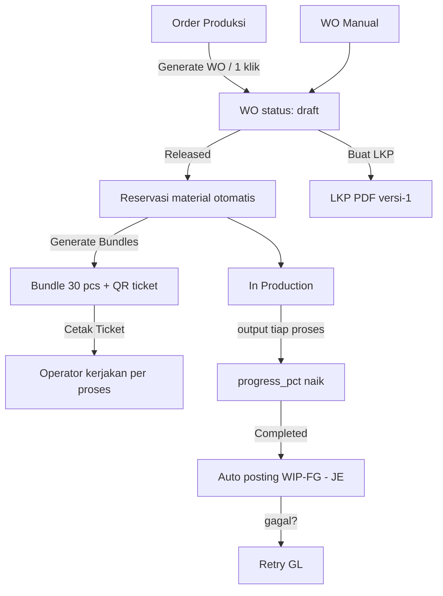
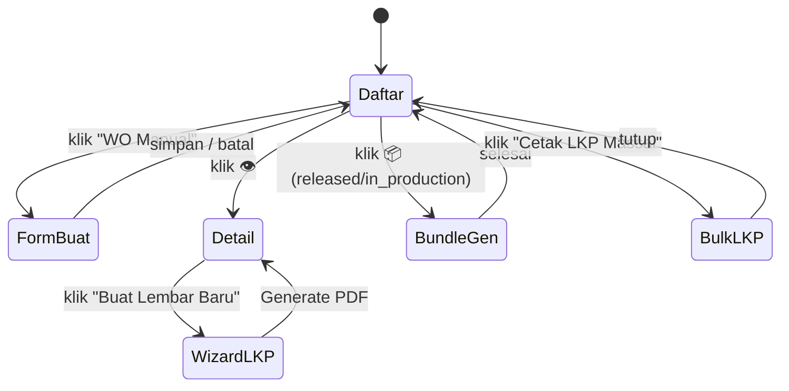
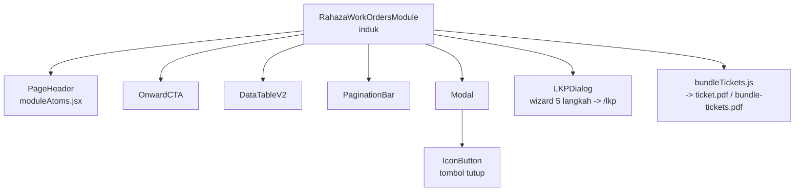
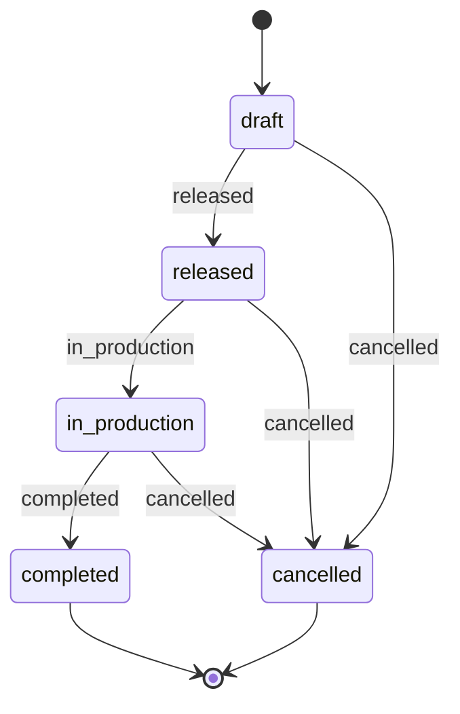
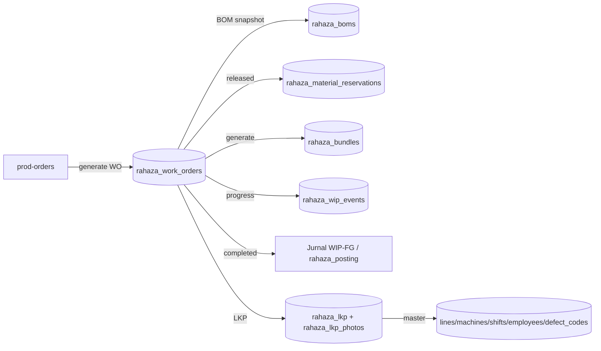
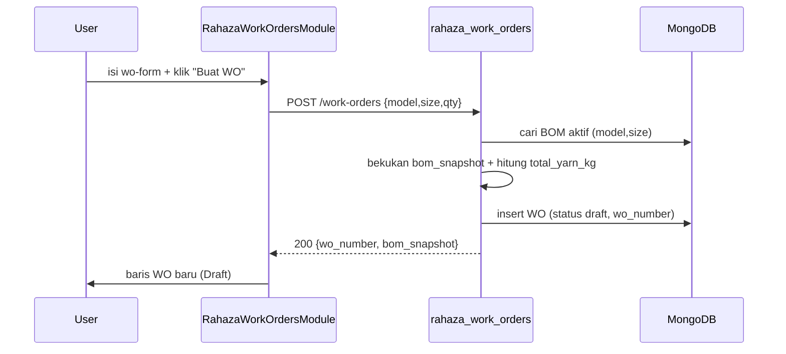
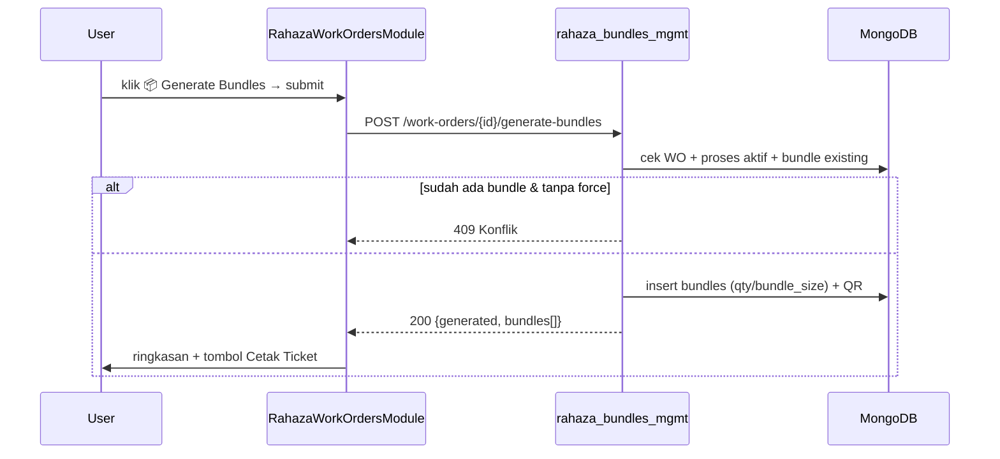
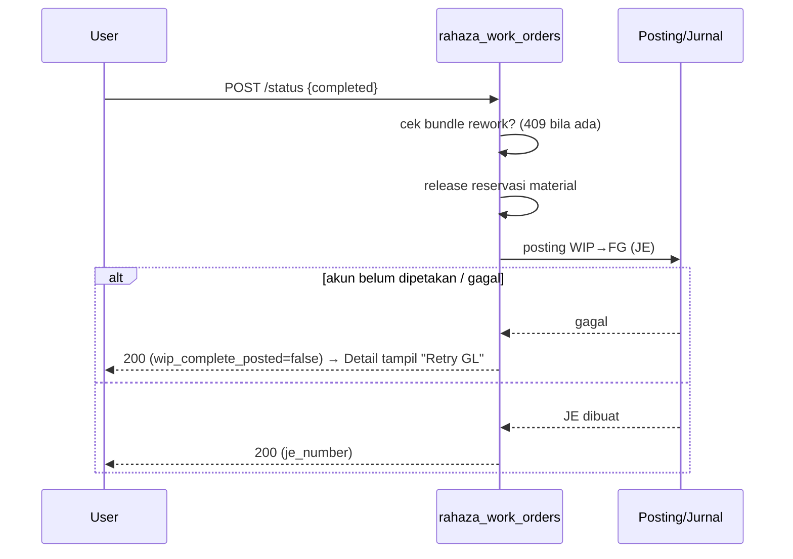
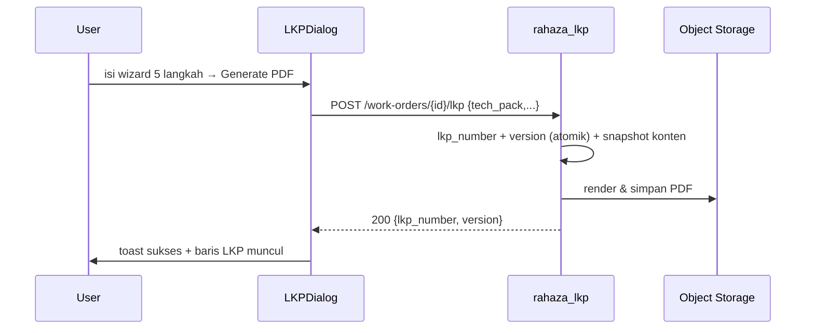

# MODUL: Work Order (`prod-work-orders`) — Portal Produksi
<!-- moduleId: prod-work-orders | Status: ✅ VERIFIED (kode dibaca + diuji runtime) | Skor rubrik: 97/100 | Standar: v3 DEEP (SAP-grade) | Update: 2026-07-08 | Manifest: ../_manifests/prod-work-orders.manifest.json | Catatan QA/bug (terpisah): ../_qa/prod-work-orders_bugs.md | Divalidasi: scripts/docgen/validate_module.py -->

> **Dokumen Training & Spesifikasi Uji — gaya SAP Functional/End-User.** Berlapis:
> - **BAGIAN A — PANDUAN PENGGUNA** (bahasa sehari-hari, klik-per-klik) → staf produksi/PPIC.
> - **BAGIAN B — LAMPIRAN TEKNIS** (komponen, field, kontrak API, logic/state, RBAC, integrasi, pesan) → admin/QA/dev.
> - **BAGIAN C — SPESIFIKASI UJI** (skenario + test case dengan hasil **nyata** + troubleshooting).
> - **BAGIAN D — LAMPIRAN CONTOH & DETAIL UJI**.
>
> **Prinsip anti-halusinasi:** tiap pernyataan menunjuk sumber kode (`file:baris`); `Expected`=menurut kode, `Actual`=hasil eksekusi. **Bug tidak ditampilkan di sini** (catatan QA teknis: `../_qa/prod-work-orders_bugs.md`).
>
> **Ikhtisar hasil uji:** Backend **25/25 PASS** (skrip `tests/pilot_prod_work_orders_test.py`, idempoten + self-cleanup) · UI diverifikasi via `testing_agent_v3` (iter 69: elemen kunci tampil, tanpa error). DB dikembalikan bersih setelah uji.

## 0. METADATA MODUL
| Atribut | Nilai |
|---|---|
| **moduleId** | `prod-work-orders` |
| **Nama tampilan** | Work Order (WO) |
| **Portal** | Produksi |
| **Tipe** | standalone (modul penuh) |
| **Komponen induk** | `frontend/src/components/erp/RahazaWorkOrdersModule.jsx` |
| **Registry** | `frontend/src/components/erp/moduleRegistry.js` (`'prod-work-orders'`) |
| **Endpoint disentuh** | **21 path unik** / 24 method-endpoint — semua terverifikasi via `scripts/docgen/extract_module.py` |
| **Komponen (file)** | 9 komponen erp (induk + 8 anak) + primitif UI |
| **Koleksi MongoDB** | `rahaza_work_orders`, `rahaza_lkp`, `rahaza_lkp_photos`, `rahaza_bundles`, `rahaza_boms`, `rahaza_processes`, `rahaza_wip_events`, `rahaza_material_reservations` (+ master: `rahaza_orders/models/sizes/lines/machines/shifts/employees/defect_codes`) |

---

# BAGIAN A — PANDUAN PENGGUNA

## A1. Untuk apa modul ini? (konteks bisnis)
Bayangkan **Order Produksi** (`prod-orders`) sebagai "pesanan pelanggan" (mis. 15 sweater). Sebuah order bisa berisi beberapa item (Model×Size berbeda). Supaya bisa dikerjakan di lantai produksi, tiap item perlu **perintah kerja** yang jelas — itulah **Work Order (WO)**.

**Work Order = 1 perintah produksi untuk 1 item (Model + Size + jumlah).** WO adalah jembatan antara "pesanan" dan "pekerjaan nyata" (cutting, jahit, QC, packing). Dari WO inilah semua hal turun:
- **BOM snapshot** (kebutuhan benang & aksesoris dibekukan saat WO dibuat),
- **Bundle** (WO dipecah jadi ikatan kecil ±30 pcs untuk dikerjakan & dilacak per proses),
- **LKP / Lembar Kerja Produksi** (PDF panduan lengkap untuk operator: tech pack, SOP, QC, packing, foto).

Posisi di rantai: **Order Produksi → Work Order → Cutting → Bundle → Sewing/QC/Packing → Selesai**.

## A2. Siapa yang memakai & apa haknya (ringkas)
- **Melihat** daftar/detail WO, LKP, bundle: **semua user login**.
- **Membuat/ubah/hapus WO, transisi status, generate bundle**: role produksi (admin, admin/supervisor produksi) atau yang punya izin `wo.manage`/`order.manage`.
- **Membuat/regenerate/revoke LKP**: role `superadmin/admin/supervisor/ppic/owner` atau izin `rahaza.lkp.write`.
- Detail RBAC ada di **B7**.

## A3. Prasyarat (setup sekali di awal)
Agar WO bermanfaat penuh, pastikan data berikut ada:
1. **Master Produk & BOM** (`prod-models-bom`) — supaya WO punya BOM snapshot (kebutuhan benang). Tanpa BOM, WO tetap bisa dibuat tapi ditandai **"No BOM"**.
2. **Master Proses** (Cutting/Sewing/QC/Packing) — untuk progress & bundle. Tanpa proses aktif, generate bundle gagal (400).
3. Untuk **LKP**: master **Lini, Mesin, Shift, Karyawan, Defect Code** (dropdown di wizard LKP). Boleh kosong (LKP tetap bisa dibuat dengan isian manual).
4. Untuk WO dari order: ada **Order Produksi** berstatus draft/confirmed/in_production.

## A4. Istilah (glossary)
| Istilah | Arti sederhana |
|---|---|
| **WO** | Work Order — perintah produksi 1 item (Model+Size+Qty). |
| **BOM** | Bill of Materials — daftar bahan (benang/aksesoris) per pcs. |
| **BOM snapshot** | Salinan BOM yang **dibekukan** di WO saat dibuat (agar histori tak berubah walau master BOM diubah). |
| **Bundle** | Ikatan kecil hasil pembagian qty WO (default 30 pcs), tiap bundle punya nomor & QR ticket. |
| **LKP** | Lembar Kerja Produksi — PDF panduan operator (tech pack, SOP, QC, packing). Terversi. |
| **WIP** | Work In Process — barang setengah jadi. `progress` dihitung dari event output WIP. |
| **WIP→FG posting** | Jurnal akuntansi otomatis saat WO **completed** (WIP dipindah ke Barang Jadi). |
| **SAM** | Standard Allowed Minute — waktu standar mengerjakan 1 pcs pada satu proses. |

## A5. Status WO & artinya
| Status | Label | Arti | Aksi tersedia |
|---|---|---|---|
| `draft` | Draft | Baru dibuat, belum jalan | Edit, Hapus, → Released, → Cancelled |
| `released` | Released | Dilepas ke produksi; material otomatis **direservasi** dari BOM | Generate Bundle, Cetak Ticket, → In Production, → Cancelled |
| `in_production` | In Production | Sedang dikerjakan | Generate Bundle, Cetak Ticket, → Completed, → Cancelled |
| `completed` | Completed | Selesai; posting WIP→FG otomatis | (final) — bisa Retry GL bila posting gagal |
| `cancelled` | Cancelled | Dibatalkan; reservasi material dilepas | (final) — bisa dihapus |

> Ikon **Edit ✏ & Hapus 🗑 hanya muncul saat status `draft`**. Ikon **Generate Bundle 📦 & Print Ticket 🖨 muncul saat `released`/`in_production`** (`RahazaWorkOrdersModule.jsx:397,417`).

## A6. Anatomi layar
1. **Header** — judul "Work Order (WO)" + 2 tombol: **Cetak LKP Massal** (`bulk-lkp-btn`) & **WO Manual** (`wo-add-btn`).
2. **Bar Langkah Berikutnya** (`OnwardCTA`) — pintasan ke *Mulai Cutting* (`prod-cutting`) & *Kelola Bundle* (`prod-bundles`).
3. **Tabel WO** (`DataTableV2`) — kolom: No. WO, Order/Customer, Model·Size, Target, Progress, Yarn, Prioritas, Status + kolom Aksi. Ada cari, filter (Status & Prioritas), sort, export CSV, pagination.
4. **Modal Buat/Edit** (`wo-form`), **Modal Detail** (BOM, progress per proses, transisi, seksi LKP, status GL), **Modal Generate Bundle**, **Wizard LKP** (`LKPDialog`, 5 langkah), **Modal Audit LKP**, **Modal Cetak LKP Massal**.

## A7. Alur kerja end-to-end


## A8. Panduan Tugas (klik-per-klik)

### Tugas 1 — Buat WO Manual (stok internal)
1. Klik **"WO Manual"** (`wo-add-btn`).
2. (Opsional) pilih **Order Terkait** (`wo-field-order`) — kosongkan untuk internal.
3. Pilih **Model** (`wo-field-model`) & **Size** (`wo-field-size`) — **wajib**.
4. Isi **Qty** (`wo-field-qty`, >0) dan **Prioritas** (`wo-field-priority`).
5. (Opsional) Target Mulai/Selesai & Catatan.
6. Klik **"Buat WO"** (`wo-save-btn`).
- **Hasil:** WO baru `WO-YYYYMMDD-001`, status **Draft**, BOM snapshot terisi bila BOM model+size ada.
- **Bila gagal:** kotak merah menampilkan pesan ("Model, Size, dan Qty > 0 wajib diisi").

### Tugas 2 — Generate WO dari Order (cara tercepat)
Buka modul **Order Produksi** → pilih order → klik ikon **Work Order** → sistem membuat 1 WO per item otomatis (dengan BOM snapshot). (Endpoint `POST /api/rahaza/orders/{id}/generate-work-orders`, lihat juga dokumen `prod-orders`.)

### Tugas 3 — Lihat Detail WO
Klik ikon **👁 Detail** (`wo-detail-{no}`). Muncul: status, prioritas, order/customer, model·size, qty, **completed & progress %**, target, **status posting GL** (bila completed), **progress per proses**, **BOM snapshot**, tombol **transisi status**, dan **seksi LKP**.

### Tugas 4 — Edit WO (hanya Draft)
Pada baris **draft**, klik ikon **✏ Edit**. Bisa ubah: Qty, Prioritas, Target, Catatan (Model/Size/Order tidak bisa diubah). Klik **"Simpan Perubahan"**.
- **Catatan:** jika status bukan draft, backend menolak (400 "WO status '...' tidak bisa diedit").

### Tugas 5 — Ubah Status (transisi)
Di Detail, pada "Transisi status" klik salah satu tombol yang muncul (`wo-transition-{status}`). Konfirmasi. Tombol yang muncul **mengikuti** `allowed_next` (B6.1).
- Contoh: Draft → **Released** (material otomatis direservasi) → **In Production** → **Completed**.
- **Aturan khusus:** WO tidak bisa **Completed** bila masih ada bundle berstatus `reworking` (backend 409).

### Tugas 6 — Hapus WO (Draft/Cancelled)
Pada baris draft, klik **🗑 Hapus** → konfirmasi. (Backend menolak 400 bila status bukan draft/cancelled.)

### Tugas 7 — Generate Bundles
1. Pada WO **released/in_production**, klik ikon **📦 Generate Bundles** (`wo-bundles-{no}`) → modal `wo-bundlegen-modal`.
2. (Opsional, admin) centang **Regenerate** (`wo-bundlegen-force`) untuk membuat ulang bundle yang masih `created`.
3. Klik **"Generate Bundles"** (`wo-bundlegen-submit`).
- **Hasil:** sistem membagi qty menjadi bundle (default **30 pcs**), tiap bundle dapat nomor `BDL-...` + QR. Muncul ringkasan "Berhasil membuat N bundle".
- Klik **"Cetak Bundle Tickets"** (`wo-bundlegen-print`) untuk PDF semua ticket.
- **Bila sudah ada bundle:** tanpa force → 409 (minta pakai regenerate).

### Tugas 8 — Cetak Bundle Ticket
Pada WO released/in_production klik ikon **🖨 Print Ticket** (`wo-print-tickets-{no}`) → PDF semua ticket WO terbuka di tab baru (siap cetak).

### Tugas 9 — Buat Lembar Kerja Produksi (LKP)
1. Di Detail WO → seksi LKP → klik **"Buat Lembar Kerja Baru"** (`lkp-create-btn`) → wizard `LKPDialog` (`lkp-dialog`).
2. **Langkah 1** (`lkp-step-1`): Tech Pack (warna, gauge, berat, size chart) + Assignment (Lini/Mesin/Operator/Shift, target).
3. **Langkah 2**: SOP per proses (tools, safety, langkah, kriteria, cacat umum) — 1 item per baris.
4. **Langkah 3**: QC (AQL, toleransi, sampling, pilih defect codes, checkpoints).
5. **Langkah 4**: Packing (lipat, polybag, hangtag, qty/karton, dll).
6. **Langkah 5**: Catatan khusus → klik **"Generate PDF"** (`lkp-submit`).
- **Hasil:** LKP `LKP-YYYY-NNNN` versi baru dibuat + PDF tersimpan; muncul di daftar LKP.

### Tugas 10 — Preview / Unduh / Regenerate / Audit LKP
Pada baris LKP: **👁 Preview** (`lkp-preview-{no}`), **⬇ Download** (`lkp-download-{no}`, menambah `download_count`), **⟳ Regenerate** (`lkp-regenerate-{no}`, refresh foto/master), **🕘 Audit** (`lkp-audit-{no}`, riwayat aksi).

### Tugas 11 — Cetak LKP Massal
Klik **"Cetak LKP Massal"** (`bulk-lkp-btn`) → modal `bulk-lkp-modal` menampilkan semua WO aktif (**released & in_production**) + status LKP (sudah/belum). Klik **"Cetak"** (`print-lkp-{wo}`) atau **"Buat LKP"** (`create-lkp-{wo}`) per baris.

### Tugas 12 — Retry Posting GL (WO completed)
Bila WO completed tapi jurnal WIP→FG gagal, di Detail muncul peringatan kuning + tombol **"Retry GL"** → memicu `POST /retry-wip-posting`. Bila berhasil, muncul nomor JE.

## A8b. Ringkasan "Bila Gagal" per aksi (grounded)
| Aksi | Kemungkinan gagal | Pesan/kode | Yang harus dilakukan |
|---|---|---|---|
| Buat WO | Model/Size kosong / Qty ≤ 0 | UI "Model, Size, dan Qty > 0 wajib diisi." (400) | Lengkapi field wajib |
| Buat WO | Model/Size/Order tak ada | 404 | Muat ulang; pastikan master ada |
| Edit WO | Status bukan draft | 400 "WO status '...' tidak bisa diedit." | Buat WO baru / batalkan yang lama |
| Edit WO | Qty non-numerik | 400 "qty harus angka." | Isi angka |
| Ubah status | Transisi ilegal | 400 "Tidak bisa pindah dari '...' ke '...'." | Ikuti tombol yang tersedia (allowed_next) |
| Ubah → completed | Ada bundle rework | 409 | Selesaikan rework dulu |
| Hapus WO | Status bukan draft/cancelled | 400 "Hanya WO Draft atau Cancelled yang bisa dihapus." | Batalkan dulu bila perlu |
| Generate bundle | Tak ada proses aktif | 400 "Tidak ada master proses aktif..." | Definisikan master proses |
| Generate bundle | Sudah ada bundle | 409 "...Pakai ?force=true..." | Centang Regenerate (admin) |
| Retry GL | WO belum completed | 400 "Hanya WO 'completed'..." | Selesaikan WO dulu |
| Buat LKP | Role tak berizin | 403 "Tidak ada akses untuk membuat LKP" | Minta role/izin `rahaza.lkp.write` |
| Aksi mutasi apa pun | Sesi habis / bukan role produksi | UI "Tidak ada akses." (403) | Login ulang / minta permission |

## A9. Visual Keadaan Layar (per langkah)
Bukan tangkapan layar asli — menggambarkan tata letak & tombol.

### A9.1 Layar utama (Daftar WO)
```
┌───────────────────────────────────────────────────────────────────────────────┐
│  Work Order (WO)                       [ Cetak LKP Massal ]   [ + WO Manual ]    │
│  ── Langkah Berikutnya: [ Mulai Cutting → ]  [ Kelola Bundle ] ───────────────  │
│  [ 🔎 Cari... ]  [ Status ▾ ]  [ Prioritas ▾ ]                     [ ⇩ Export ] │
│  ┌──────────────┬───────────────┬───────────┬───────┬──────────┬──────┬───────┐ │
│  │ No. WO       │ Order/Customer│ Model·Size│ Target│ Progress │ Yarn │ Aksi  │ │
│  ├──────────────┼───────────────┼───────────┼───────┼──────────┼──────┼───────┤ │
│  │ WO-...-001   │ ORD-...·Makmur│ SWTR·M    │ 10pcs │ ▓▓░ 30%  │ 3.5kg│ 👁📦🖨 │ │
│  │ WO-...-002   │ Manual·Internal SWTR·L    │ 5 pcs │ ░ 0%     │No BOM│ 👁✏🗑 │ │
│  └──────────────┴───────────────┴───────────┴───────┴──────────┴──────┴───────┘ │
└───────────────────────────────────────────────────────────────────────────────┘
 Aksi 👁 selalu ada · 📦🖨 saat released/in_production · ✏🗑 hanya saat draft.
```

### A9.2 Modal Detail — berubah mengikuti status
```
 STATUS = DRAFT              STATUS = COMPLETED (posting gagal)      SEKSI LKP (selalu)
┌────────────────────┐     ┌──────────────────────────────┐     ┌────────────────────────┐
│ Detail WO-...-002   │     │ Detail WO-...-001              │     │ Lembar Kerja Produksi   │
│ Status: DRAFT       │     │ Status: COMPLETED              │     │ LKP-2026-0007 v2  ⋯     │
│ [BOM Snapshot]      │     │ ⚠ GL Posting: belum terposting │     │  👁 ⬇ ⟳ 🕘             │
│ Transisi:           │     │        [ Retry GL ]            │     │ [ + Buat Lembar Baru ]  │
│  [→ Released]       │     │ [Progress Per Proses]          │     └────────────────────────┘
│  [→ Cancelled]      │     │ (tak ada transisi lanjutan)    │
└────────────────────┘     └──────────────────────────────┘
```

### A9.3 Wizard LKP (5 langkah)
```
[1. Info Produk & Lini] [2. SOP] [3. QC] [4. Packing] [5. Catatan] Step x/5
  langkah aktif = biru · langkah selesai = hijau · [Kembali]      [Lanjut / Generate PDF]
```

### A9.4 Alur "keadaan layar" (screen-state)


## A10. Cara cepat membaca dokumen ini (untuk pemula)
- Baru pertama pakai? Baca **A1–A9** (bahasa sehari-hari + langkah klik).
- Butuh detail teknis (field, API, aturan)? **BAGIAN B**.
- QA/penguji? **BAGIAN C & D**.
- Istilah asing? **A4 Glossary**.

---

# BAGIAN B — LAMPIRAN TEKNIS

## B1. Peta Komponen (Component Map)
Layar `prod-work-orders` dibangun dari **9 file komponen erp** (induk + 8 anak); **3** memanggil API sendiri (induk, `LKPDialog`, `bundleTickets`).

> Daftar diverifikasi otomatis oleh `scripts/docgen/extract_module.py` (manifest: `../_manifests/prod-work-orders.manifest.json`).

| # | Komponen (file) | File | Peran | data-testid utama | Memanggil API? |
|---|---|---|---|---|---|
| 1 | RahazaWorkOrdersModule | `RahazaWorkOrdersModule.jsx` | Induk: state, tabel, modal, aksi, transisi, LKP list, bundle gen, bulk LKP | `rahaza-work-orders-page`, `wo-form` | ✅ 20 path |
| 2 | moduleAtoms (PageHeader) | `moduleAtoms.jsx` | Judul + tombol aksi header | `wo-add-btn`, `bulk-lkp-btn` | — |
| 3 | OnwardCTA | `OnwardCTA.jsx` | Bar langkah berikutnya (cutting/bundle) | (via induk) | — (onNavigate) |
| 4 | DataTableV2 | `DataTableV2.jsx` | Tabel: cari/filter/sort/paginate/export | `dtv2-*` | — (klien) |
| 5 | PaginationBar | `PaginationBar.jsx` | Navigasi halaman (server pagination) | — | — |
| 6 | Modal | `Modal.jsx` | Bungkus jendela (Radix Dialog) + tombol Tutup | `modal-close` | — |
| 7 | IconButton | `IconButton.jsx` | Tombol ikon + tooltip; dipakai Modal (Tutup) | (via konsumen) | — |
| 8 | LKPDialog | `LKPDialog.jsx` | Wizard 5-langkah membuat LKP | `lkp-dialog`, `lkp-step-*`, `lkp-submit` | ✅ 6 path (defect-codes/lines/machines/shifts/employees + POST lkp) |
| 9 | bundleTickets | `bundleTickets.js` | Helper unduh/print PDF ticket bundle (blob + Bearer) | — | ✅ 2 path (ticket.pdf, bundle-tickets.pdf) |

## B2. Inventaris Elemen (exhaustive)
Setiap elemen interaktif + `data-testid` + aksi + syarat tampil. (Testid dengan akhiran `-` bersifat dinamis, mis. `wo-detail-{wo_number}`.)

### B2.1 Header & Tabel
| Elemen | data-testid | Aksi | Syarat |
|---|---|---|---|
| Halaman (root) | `rahaza-work-orders-page` | kontainer | selalu |
| Tombol Cetak LKP Massal | `bulk-lkp-btn` | buka modal bulk LKP | selalu |
| Tombol WO Manual | `wo-add-btn` | buka form buat | selalu |
| Tabel | `dtv2-work-orders` (`dtv2-*`) | tampil data | selalu |
| Export CSV | `dtv2-work-orders-export` | unduh CSV | selalu |
| Aksi Detail | `wo-detail-{wo_number}` | buka detail | selalu |
| Aksi Generate Bundle | `wo-bundles-{wo_number}` | buka modal bundle | status released/in_production |
| Aksi Print Ticket | `wo-print-tickets-{wo_number}` | PDF ticket WO | status released/in_production |
| Empty CTA → Order | `wo-empty-cta-orders` | ke `prod-orders` | tabel kosong |
| Empty CTA → Manual | `wo-empty-cta-manual` | buka form buat | tabel kosong |

### B2.2 Form Buat/Edit (`wo-form`)
| Field | data-testid | Tipe | Wajib | Catatan |
|---|---|---|---|---|
| Order Terkait | `wo-field-order` | select | tidak | hanya saat **buat**; opsi order draft/confirmed/in_production |
| Model | `wo-field-model` | select | ya (buat) | hanya saat buat; opsi model aktif |
| Size | `wo-field-size` | select | ya (buat) | hanya saat buat; opsi size aktif |
| Qty | `wo-field-qty` | number | ya | > 0 |
| Prioritas | `wo-field-priority` | select | tidak | normal/high/urgent |
| Simpan | `wo-save-btn` | button | — | "Buat WO" / "Simpan Perubahan" |

### B2.3 Detail — transisi & seksi LKP
| Elemen | data-testid | Aksi | Syarat |
|---|---|---|---|
| Tombol transisi | `wo-transition-{status}` | ubah status | untuk tiap `allowed_next` |
| Seksi LKP | `lkp-section` | kontainer LKP | detail terbuka |
| Baris LKP | `lkp-row-{lkp_number}` | item LKP | ada LKP |
| Preview LKP | `lkp-preview-{lkp_number}` | buka PDF | per baris |
| Download LKP | `lkp-download-{lkp_number}` | unduh PDF | per baris |
| Regenerate LKP | `lkp-regenerate-{lkp_number}` | buat ulang PDF | per baris |
| Audit LKP | `lkp-audit-{lkp_number}` | buka modal audit | per baris |
| Buat LKP baru | `lkp-create-btn` | buka wizard | detail terbuka |
| Modal Audit LKP | `lkp-audit-modal` | tampil riwayat | audit dibuka |

### B2.4 Modal Generate Bundle
| Elemen | data-testid | Aksi | Syarat |
|---|---|---|---|
| Modal | `wo-bundlegen-modal` | kontainer | dibuka |
| Checkbox Regenerate | `wo-bundlegen-force` | force regenerate | sebelum hasil, admin |
| Submit | `wo-bundlegen-submit` | generate | sebelum hasil |
| Cetak ticket (hasil) | `wo-bundlegen-print` | PDF ticket | setelah sukses |

### B2.5 Wizard LKP (`lkp-dialog`) — semua field
| Langkah | Elemen | data-testid |
|---|---|---|
| Navigasi | Step tab / Prev / Next / Submit | `lkp-step-{n}`, `lkp-prev`, `lkp-next`, `lkp-submit` |
| Konten langkah | wrapper | `lkp-step-1-content`, `lkp-step-2-content`, `lkp-step-3-content`, `lkp-step-4-content`, `lkp-step-5-content` |
| 1 Tech Pack | warna/kode/gauge/berat/struktur | `lkp-color`, `lkp-color-code`, `lkp-gauge`, `lkp-weight`, `lkp-structure` |
| 1 Size chart | baris ukuran + tambah | `lkp-measure-part-{i}`, `lkp-measure-val-{i}`, `lkp-add-measure` |
| 1 Assignment | lini/mesin/operator/shift | `lkp-line`, `lkp-machine`, `lkp-operator`, `lkp-shift` |
| 1 Target | harian/shift | `lkp-daily-target`, `lkp-shift-target` |
| 1 Flow | durasi/SAM per proses | `lkp-flow-dur-{i}`, `lkp-flow-sam-{i}` |
| 2 SOP | tools/safety/steps/acceptance/defects | `lkp-sop-tools-{i}`, `lkp-sop-safety-{i}`, `lkp-sop-steps-{i}`, `lkp-sop-acceptance-{i}`, `lkp-sop-defects-{i}` |
| 3 QC | aql/toleransi/sampling | `lkp-qc-aql`, `lkp-qc-tolerance`, `lkp-qc-sampling` |
| 3 Defect & checkpoint | pilih defect + checkpoint | `lkp-defect-{code}`, `lkp-checkpoint-{i}`, `lkp-add-checkpoint` |
| 4 Packing | fold/polybag/hangtag/qty-carton/carton/shipping/instruksi | `lkp-pack-fold`, `lkp-pack-polybag`, `lkp-pack-hangtag`, `lkp-pack-qty-carton`, `lkp-pack-carton-spec`, `lkp-pack-shipping-mark`, `lkp-pack-instruction` |
| 5 Catatan | catatan khusus | `lkp-special-notes` |

### B2.6 Modal Cetak LKP Massal
| Elemen | data-testid | Aksi | Syarat |
|---|---|---|---|
| Modal | `bulk-lkp-modal` | kontainer | dibuka |
| Baris WO | `bulk-lkp-row-{wo_id}` | item WO aktif | ada WO aktif |
| Cetak (punya LKP) | `print-lkp-{wo_id}` | buka PDF | WO punya LKP |
| Buat LKP (belum) | `create-lkp-{wo_id}` | buka wizard | WO belum punya LKP |

### B2.7 Umum
| Elemen | data-testid |
|---|---|
| Tombol tutup modal (X) | `modal-close` |

## B3. Kamus Field — Form
### B3.1 Form Buat/Edit WO (`wo-form`) — `RahazaWorkOrdersModule.jsx`
| Field | Nama internal | Tipe | Wajib | Default | Validasi | Sumber opsi (F4) | Contoh |
|---|---|---|---|---|---|---|---|
| Order Terkait | `order_id` | select | tidak | (kosong) | harus id order valid bila diisi | `GET /api/rahaza/orders` (draft/confirmed/in_production) | `ORD-...060` |
| Model | `model_id` | select | **ya** (buat) | — | wajib; harus model aktif | `GET /api/rahaza/models` | Sweater Navy |
| Size | `size_id` | select | **ya** (buat) | — | wajib; harus size aktif | `GET /api/rahaza/sizes` | M |
| Qty | `qty` | number | **ya** | — | integer > 0 (non-numerik → 400) | — | 10 |
| Prioritas | `priority` | select | tidak | `normal` | salah satu: normal/high/urgent | statik | high |
| Target Mulai | `target_start_date` | date | tidak | (kosong) | ISO date | — | 2026-07-10 |
| Target Selesai | `target_end_date` | date | tidak | (kosong) | ISO date | — | 2026-07-31 |
| Catatan | `notes` | textarea | tidak | (kosong) | bebas | — | "cek lot benang" |

> Saat **Edit** (status draft), hanya `qty`, `priority`, `target_*`, `notes` yang bisa diubah; `model_id`/`size_id`/`order_id` terkunci (`update_wo`, `rahaza_work_orders.py:453`).

### B3.2 Struktur konten LKP (`LKPDialog.jsx` → `POST /work-orders/{id}/lkp`)
Body LKP dikirim sebagai objek bersarang; ringkas struktur & nama internal:
| Bagian | Nama internal | Isi |
|---|---|---|
| Tech Pack | `tech_pack` | `{color, color_code, gauge, weight_gsm, structure, size_chart[]}` |
| Assignment | `assignment` | `{line_id, machine_id, operator_id, shift_id, daily_target, shift_target}` |
| Process Flow | `process_flow` | array `{process, duration_min, sam}` |
| SOP | `sop_steps` | array `{process_name, tools, safety, steps, acceptance, common_defects}` |
| QC | `qc` | `{aql, tolerance, sampling, defect_codes[], checkpoints[]}` |
| Packing | `packing` | `{fold, polybag, hangtag, qty_per_carton, carton_spec, shipping_mark, instruction}` |
| Catatan | `special_notes` | string |

## B4. Kamus Field — Kolom Tabel WO
| Kolom | Sumber data | Format | Catatan |
|---|---|---|---|
| No. WO | `wo_number` | `WO-YYYYMMDD-NNN` | tautan buka Detail |
| Order/Customer | `order_number_snapshot` + `customer_snapshot.name` | teks | "Manual/Internal" bila tanpa order |
| Model·Size | join `model_id`/`size_id` → nama | teks | |
| Target | `target_end_date` | tanggal | "—" bila kosong |
| Progress | `progress_pct` (derived) | bar % | dari WIP output proses terakhir (B6.2) |
| Yarn | `total_yarn_kg_required` | "N kg" | "No BOM" bila snapshot BOM kosong |
| Prioritas | `priority` | badge | normal/high/urgent |
| Status | `status` | badge | draft/released/in_production/completed/cancelled |
| Aksi | — | ikon | 👁 selalu; 📦🖨 released/in_production; ✏🗑 draft |

## B5. Katalog Kontrak Endpoint (21)

> Semua path relatif ke host; prefix `/api/rahaza` kecuali disebutkan. Semua terverifikasi ke route backend via extractor.

### B5.1 Endpoint per Fitur (21)
**A. Work Order (`rahaza_work_orders.py`)**
| # | Method | Path | Fungsi | RBAC | Sumber |
|---|---|---|---|---|---|
| 1 | GET | `/api/rahaza/work-orders` | List (filter status/order_id/model_id/source; `?page` → paginated) | login | `rahaza_work_orders.py:300` |
| 2 | POST | `/api/rahaza/work-orders` | Buat WO manual | WO-write | `rahaza_work_orders.py:371` |
| 3 | GET | `/api/rahaza/work-orders/{id}` | Detail + progress + breakdown | login | `rahaza_work_orders.py:359` |
| 4 | PUT | `/api/rahaza/work-orders/{id}` | Edit (draft only) | WO-write | `rahaza_work_orders.py:453` |
| 5 | DELETE | `/api/rahaza/work-orders/{id}` | Hapus (draft/cancelled) | WO-write | `rahaza_work_orders.py:590` |
| 6 | POST | `/api/rahaza/work-orders/{id}/status` | Transisi status | WO-write | `rahaza_work_orders.py:482` |
| 7 | POST | `/api/rahaza/work-orders/{id}/retry-wip-posting` | Retry posting WIP→FG (completed only) | WO-write | `rahaza_work_orders.py:569` |
| 8 | GET | `/api/rahaza/work-orders-statuses` | Daftar status + `allowed_next` | login | `rahaza_work_orders.py:684` |

**B. Bundle (`rahaza_bundles_mgmt.py` / `rahaza_bundles_docs.py`)**
| # | Method | Path | Fungsi | RBAC | Sumber |
|---|---|---|---|---|---|
| 9 | POST | `/api/rahaza/work-orders/{id}/generate-bundles` | Bagi qty jadi bundle (`?force=true` regenerate) | admin/manager | `rahaza_bundles_mgmt.py:92` |
| 10 | GET | `/api/rahaza/work-orders/{id}/bundle-tickets.pdf` | PDF semua ticket WO | admin/manager | `rahaza_bundles_docs.py:70` |
| 11 | GET | `/api/rahaza/bundles/{id}/ticket.pdf` | PDF ticket 1 bundle | login | `rahaza_bundles_docs.py:50` |

**C. LKP (`rahaza_lkp.py`)**
| # | Method | Path | Fungsi | RBAC | Sumber |
|---|---|---|---|---|---|
| 12 | GET | `/api/rahaza/work-orders/{id}/lkp` | List LKP versi utk WO | login | `rahaza_lkp.py:318` |
| 13 | POST | `/api/rahaza/work-orders/{id}/lkp` | Buat LKP + generate PDF | LKP-write | `rahaza_lkp.py:330` |
| 14 | GET | `/api/rahaza/lkp/{id}` | Detail LKP + audit log | login | `rahaza_lkp.py:411` |
| 15 | DELETE | `/api/rahaza/lkp/{id}` | Revoke (soft delete) | LKP-write | `rahaza_lkp.py:700` |
| 16 | GET | `/api/rahaza/lkp/{id}/pdf` | Unduh/preview PDF (audit "downloaded") | login (Bearer / `?auth=`) | `rahaza_lkp.py:422` |
| 17 | POST | `/api/rahaza/lkp/{id}/regenerate` | Regenerate PDF | LKP-write | `rahaza_lkp.py:538` |
| 18 | GET | `/api/rahaza/lkp-bulk-today` | WO aktif (released+in_production) + status LKP | login | `rahaza_lkp.py:635` |

**D. Master (dropdown; `rahaza_master.py` / `rahaza_production.py` / `rahaza_qc_v2.py` / `rahaza_orders.py`)**
| # | Method | Path | Fungsi | RBAC | Sumber |
|---|---|---|---|---|---|
| 19 | GET | `/api/rahaza/models` | opsi Model | login | `rahaza_production.py:79` |
| 20 | GET | `/api/rahaza/sizes` | opsi Size | login | `rahaza_production.py:227` |
| 21 | GET | `/api/rahaza/orders` | opsi Order (form WO) | login | `rahaza_orders.py:140` |
| — | GET | `/api/rahaza/lines` | opsi Lini (LKP) | login | `rahaza_master.py:415` |
| — | GET | `/api/rahaza/machines` | opsi Mesin (LKP) | login | `rahaza_master.py:343` |
| — | GET | `/api/rahaza/shifts` | opsi Shift (LKP) | login | `rahaza_master.py:281` |
| — | GET | `/api/rahaza/employees` | opsi Operator (LKP) | login | `rahaza_master.py:512` |
| — | GET | `/api/rahaza/defect-codes` | opsi Defect (LKP) | login | `rahaza_qc_v2.py:89` |

> 21 **path unik** dipakai modul; master GET juga menerima POST di backend, namun modul ini hanya membacanya (GET).

### B5.2 Kontrak detail per endpoint

**GET `/work-orders`** — Query: `status?, order_id?, model_id?, source?(order|manual), page?, page_size?`.
- Tanpa `page`: 200 array WO. Dengan `page`: 200 `{items[], pagination:{page,page_size,total,total_pages}}`.
- Tiap item diperkaya: `model_name, size_name, order_number_snapshot, customer_snapshot, progress_pct, completed_qty, has_bom`.

**POST `/work-orders`** — Request: `{order_id?, model_id, size_id, qty, priority?, target_start_date?, target_end_date?, notes?}`.
- 200: dokumen WO baru (`status:"draft"`, `wo_number`, `bom_snapshot`, `total_yarn_kg_required`).
- Error: 400 (`model_id, size_id, qty(>0) wajib diisi.`), 404 (model/size/order tak ada), 403.

**GET `/work-orders/{id}`** — 200 detail + `progress_pct`, `completed_qty`, `progress_breakdown[]` (per proses), `bom_snapshot`, status posting GL. 404 bila tak ada.

**PUT `/work-orders/{id}`** — Request: `{qty?, priority?, target_start_date?, target_end_date?, notes?}`.
- 200 dokumen ter-update. Error: 400 (`WO status '...' tidak bisa diedit.` / `qty harus angka.`), 404.

**DELETE `/work-orders/{id}`** — 200 `{deleted:true}`. Error: 400 (`Hanya WO Draft atau Cancelled yang bisa dihapus.`), 404, 403.

**POST `/work-orders/{id}/status`** — Request: `{status}`.
- 200 `{status, work_order_id, material_reservation?, wip_posting?}`.
- Efek samping (B6.2): released→reserve material; in_production→sync order induk; completed→release reservasi + posting WIP→FG; cancelled→release reservasi.
- Error: 400 (status invalid / transisi ilegal), **409** (`...masih ada N bundle dalam status rework...`), 404, 403.

**POST `/work-orders/{id}/retry-wip-posting`** — 200 `{posted:true, je_number}`. Error: 400 (`Hanya WO berstatus 'completed' yang bisa di-retry posting.`), 404, 403.

**GET `/work-orders-statuses`** — 200 array `{value, label, allowed_next[]}` untuk 5 status.

**POST `/work-orders/{id}/generate-bundles`** — Query `force?(true)`.
- 200 `{generated, bundle_size, total_qty, wo_number, bundles:[{bundle_number, qty, status:"created"}]}`.
- Error: 400 (qty≤0 / `Tidak ada master proses aktif...` / WO cancelled), **409** (`WO ini sudah punya N bundle. Pakai ?force=true...`), 403.

**GET `/work-orders/{id}/bundle-tickets.pdf`** & **GET `/bundles/{id}/ticket.pdf`** — 200 `application/pdf` (stream). Diakses via blob+Bearer (`bundleTickets.js`). 404 bila WO/bundle tak ada.

**GET `/work-orders/{id}/lkp`** — 200 array LKP (versi) untuk WO (terbaru dulu).

**POST `/work-orders/{id}/lkp`** — Request: lihat B3.2. 200 `{id, lkp_number, work_order_id, version, status:"released", pdf_storage_path}`. Error: 403 (`Tidak ada akses untuk membuat LKP`), 404, 500 (gagal render PDF).

**GET `/lkp/{id}`** — 200 detail LKP + `audit_log[]` (`created/downloaded/regenerated/revoked`). 404.

**GET `/lkp/{id}/pdf`** — 200 `application/pdf`; menerima Bearer atau `?auth=<token>` (untuk buka di tab). Menambah `download_count` + audit `downloaded`. 404/403.

**POST `/lkp/{id}/regenerate`** — 200 `{ok:true, version}` (refresh foto/master, PDF dibuat ulang). LKP-write. 404.

**DELETE `/lkp/{id}`** — 200 `{ok:true}` (soft delete → `status:"revoked"`). LKP-write. 404.

**GET `/lkp-bulk-today`** — 200 `{work_orders:[{wo_id, wo_number, model_name, size_name, status, has_lkp, lkp_count}], total, total_with_lkp, total_without_lkp}` untuk WO **released + in_production**.

**Master (GET)** — `/models`, `/sizes`, `/orders`, `/lines`, `/machines`, `/shifts`, `/employees`, `/defect-codes`: 200 array opsi (untuk dropdown). Semua butuh login.

## B6. State & Logika

### B6.1 State Machine (WO) — `rahaza_work_orders.py:50`

Transisi divalidasi server (`WO_TRANSITIONS`). Transisi ilegal → 400.

### B6.1b Tabel transisi (precondition · efek · error)
| Dari → Ke | Precondition | Efek samping | Error khusus |
|---|---|---|---|
| draft → released | status=draft | reservasi material dari BOM; `released_at`; bila stok kurang → `has_warnings` | — |
| draft → cancelled | status=draft | `cancelled_at`; release reservasi (bila ada) | — |
| released → in_production | status=released | `started_at`; order induk `confirmed`→`in_production` | — |
| released → cancelled | status=released | release reservasi | — |
| in_production → completed | status=in_production; **tidak ada bundle rework** | release reservasi; posting WIP→FG (JE) | **409** bila ada bundle rework |
| in_production → cancelled | status=in_production | release reservasi | — |
| (lainnya) | — | — | 400 "Tidak bisa pindah dari '...' ke '...'." |

> Tombol transisi di UI (`wo-transition-{status}`) hanya menampilkan target pada `allowed_next` status saat ini (`GET /work-orders-statuses`).

### B6.2 Perhitungan & Trigger
- **completed_qty** = jumlah `event_type="output"` WIP pada **proses non-rework terakhir** (`_compute_progress`, `rahaza_work_orders.py:237`). **progress_pct** = `completed/qty*100`.
- **BOM snapshot** dibekukan saat WO dibuat (`_get_bom_snapshot`, `:221`). `total_yarn_kg_required = qty × total_yarn_kg_per_pcs`.
- **Trigger transisi** (`transition_wo`, `:482`):
  - `released` → auto-reserve material dari BOM (`_auto_reserve_materials_for_wo`); kekurangan disimpan sebagai warning.
  - `in_production` → jika order induk masih `confirmed`, order ikut menjadi `in_production`.
  - `completed` → auto-release reservasi + **auto-post WIP→FG** (jurnal); hasil ada di `wip_posting`.
  - `cancelled` → auto-release reservasi.
- **Bundle** (`generate-bundles`): qty dibagi `bundle_size` (default 30, dari master model) → dokumen bundle `created` + QR. `force=true` (admin) menghapus bundle `created` lalu buat ulang.
- **LKP**: `lkp_number = LKP-YYYY-NNNN` (counter atomik), `version` per-WO atomik; PDF disimpan ke object storage; upload foto menandai PDF `stale` (regenerate saat unduh).

### B6.3 Logika & Trigger per fitur (rinci)
**(a) Pembuatan WO & BOM snapshot** (`create_wo`, `rahaza_work_orders.py:371`)
- Validasi `model_id`/`size_id`/`qty>0`. `wo_number` dari counter harian `WO-YYYYMMDD-NNN`.
- `bom_snapshot` = salinan BOM aktif untuk (model,size) **dibekukan** saat itu (`_get_bom_snapshot`, `:221`). Bila BOM tidak ada → `bom_snapshot` kosong & WO ditandai "No BOM" (WO tetap dibuat).
- `total_yarn_kg_required = qty × total_yarn_kg_per_pcs` (dari snapshot).
- Bila `order_id` diisi: menyalin `order_number_snapshot`, `customer_snapshot`, `order_item_id`.

**(b) Transisi status** (`transition_wo`, `:482`) — divalidasi `WO_TRANSITIONS`:
- **→ released:** panggil `_auto_reserve_materials_for_wo` — buat dokumen di `rahaza_material_reservations` sesuai kebutuhan BOM. Bila stok kurang → tetap released, reservasi menyimpan `has_warnings=true` + daftar kekurangan. Set `released_at`.
- **→ in_production:** set `started_at`; bila order induk masih `confirmed` → order ikut jadi `in_production` (sinkronisasi hulu).
- **→ completed:** set `completed_at`; release reservasi; jalankan **posting WIP→FG** (jurnal). Bila akun belum dipetakan/gagal → `wip_complete_posted=false` (bisa Retry). Bila ada bundle status `reworking` → tolak **409**.
- **→ cancelled:** set `cancelled_at`; release semua reservasi material.

**(c) Progress** (`_compute_progress`, `:237`)
- `completed_qty` = total event `output` di `rahaza_wip_events` pada proses **non-rework terakhir** WO.
- `progress_pct = round(completed_qty / qty × 100)` (0 bila qty 0). Ditampilkan sebagai bar di tabel & detail; `progress_breakdown[]` memecah per proses.

**(d) Generate Bundles** (`rahaza_bundles_mgmt.py:92`)
- Ambil `bundle_size` dari master model (default 30). Jumlah bundle = ceil(qty / bundle_size). Tiap bundle: `bundle_number`, `qty`, `status:"created"`, `current_process_id` (proses pertama), payload QR.
- Butuh ≥1 master proses aktif (else 400). Bila WO sudah punya bundle & tanpa `force` → 409. `force=true` (admin) menghapus bundle berstatus `created` lalu buat ulang (bundle yang sudah diproses tidak dihapus).

**(e) LKP** (`rahaza_lkp.py`)
- `lkp_number = LKP-YYYY-NNNN` via counter atomik tahunan; `version` per-WO atomik (naik tiap buat baru).
- Konten disimpan sebagai `content_snapshot`; PDF dirender & disimpan ke object storage (`pdf_storage_path`, `pdf_size`).
- Setiap aksi menambah entri `audit_log` (`created/downloaded/regenerated/revoked`) + pelaku & waktu. Unduh menambah `download_count`.
- Upload foto proses (`rahaza_lkp_photos`) menandai PDF `stale`; saat diunduh, sistem regenerate agar foto terbaru ikut.
- Revoke = soft delete (`status:"revoked"`), dokumen tetap ada untuk audit.

**(f) Retry GL** (`retry-wip-posting`, `:569`) — hanya `completed`; memicu ulang posting WIP→FG; sukses menyetel `wip_complete_je_number`.

## B7. Matriks RBAC (role × aksi)
| Aksi | Endpoint | Role/Izin |
|---|---|---|
| Lihat WO/LKP/bundle | GET * | semua user login (`require_auth`) |
| Buat/Edit/Hapus WO, transisi, retry GL | POST/PUT/DELETE work-orders* | superadmin, admin, admin_produksi, supervisor_produksi, supervisor **atau** izin `*`/`wo.manage`/`order.manage` (`_require_admin`, `rahaza_work_orders.py:59`) |
| Generate bundle / bulk ticket | generate-bundles, bundle-tickets.pdf | admin, superadmin, owner, manager_production, supervisor (`_require_admin_or_manager`) |
| Buat/Regenerate/Revoke LKP | POST/DELETE lkp* | superadmin, admin, supervisor, ppic, owner **atau** izin `rahaza.lkp.write` (`check_role`, `rahaza_lkp.py:50`) |

## B8. Peta Integrasi (lintas-modul & koleksi)

Modul hilir: `prod-cutting`, `prod-bundles`. Modul hulu: `prod-orders`, `prod-models-bom`.

## B9. Kamus Data (koleksi utama)
- **rahaza_work_orders**: `{id, wo_number, order_id, order_number_snapshot, order_item_id, model_id, size_id, qty, customer_snapshot, is_internal, priority, target_start_date, target_end_date, bom_snapshot, total_yarn_kg_required, status, completed_qty(derived), notes, created_at, updated_at, released_at, started_at, completed_at, cancelled_at, created_by, created_by_name, wip_complete_posted, wip_complete_je_number}`.
- **rahaza_lkp**: `{id, lkp_number, work_order_id, work_order_number, version, status(released|revoked), content_snapshot, pdf_storage_path, pdf_size, download_count, audit_log[], created_at, created_by, ...}`.
- **rahaza_lkp_photos**: `{id, lkp_id, work_order_id, process_name, storage_path, caption, uploaded_by, uploaded_at}`.
- **rahaza_bundles**: `{id, bundle_number, work_order_id, qty, status(created|in_progress|reworking|done|...), current_process_id, qr_payload, created_at, ...}`.
- **rahaza_material_reservations**: `{id, work_order_id, material_id, qty_required, qty_reserved, has_warnings, shortage, status(reserved|released), created_at}`.
- **rahaza_wip_events**: `{id, work_order_id, process_id, event_type(input|output|reject|rework), qty, created_at, created_by}` → sumber `progress_pct`.
- **rahaza_boms**: `{id, model_id, size_id, items[], total_yarn_kg_per_pcs, active}` → sumber `bom_snapshot`.
- **rahaza_processes**: `{id, name, sequence, is_rework, active}` → menentukan bundle & proses akhir progress.

## B10. Katalog Pesan
**Backend (HTTP):**
| Kode | Pesan | Sumber |
|---|---|---|
| 400 | "model_id, size_id, qty(>0) wajib diisi." | `rahaza_work_orders.py:388` |
| 400 | "WO status '...' tidak bisa diedit." | `rahaza_work_orders.py:461` |
| 400 | "Status tidak valid. Pilih: ..." | `rahaza_work_orders.py:489` |
| 400 | "Tidak bisa pindah dari '...' ke '...'." | `rahaza_work_orders.py:495` |
| 409 | "Tidak bisa menyelesaikan WO: masih ada N bundle dalam status rework..." | `rahaza_work_orders.py:501` |
| 400 | "Hanya WO Draft atau Cancelled yang bisa dihapus." | `rahaza_work_orders.py:598` |
| 400 | "Hanya WO berstatus 'completed' yang bisa di-retry posting." | `rahaza_work_orders.py:578` |
| 409 | "WO ini sudah punya N bundle. Pakai ?force=true..." | `rahaza_bundles_mgmt.py:122` |
| 400 | "Tidak ada master proses aktif..." | `rahaza_bundles_mgmt.py:158` |
| 403 | "Tidak ada akses untuk membuat LKP" | `rahaza_lkp.py:336` |

**Frontend (UI):**
| Pesan | Sumber |
|---|---|
| "Model, Size, dan Qty > 0 wajib diisi." | `RahazaWorkOrdersModule.jsx:168` |
| STATUS_MSG {400:'Data WO tidak valid.',403:'Tidak ada akses.',404:'Data tidak ditemukan.',409:'Konflik data.'} | `RahazaWorkOrdersModule.jsx:178` |
| toast "LKP {no} berhasil dibuat (versi N)" | `LKPDialog.jsx:223` |
| toast "Gagal generate LKP (HTTP …)" | `LKPDialog.jsx:219` |

---

# BAGIAN C — SPESIFIKASI UJI

## C1. Test Scenarios (naratif)
Skenario menutup **seluruh** fitur & jalur error:
1. **Baca:** list WO (biasa & `?page`), detail (progress/BOM), daftar status + `allowed_next`, dropdown master.
2. **Buat WO:** valid (draft + BOM snapshot), tanpa model/size (400), qty=0 (400), qty non-numerik (400).
3. **Edit WO:** ubah qty saat draft (200), edit saat non-draft (400), qty non-numerik (400).
4. **State machine:** draft→released (200 + reservasi), released→in_production (200 + sync order), in_production→completed (200 + WIP posting), transisi ilegal draft→completed (400), completed→edit/hapus (400), hapus draft (200).
5. **Bundle:** generate saat released (200), generate ulang tanpa force (409), cetak ticket.
6. **LKP:** buat (200 + versi), list (≥1), detail + audit `created`, regenerate (200), unduh PDF (application/pdf + audit downloaded), revoke (200 → status revoked).
7. **Bulk LKP:** `lkp-bulk-today` menyertakan WO `in_production` (verifikasi perbaikan).
8. **RBAC:** baca tanpa token (401/403); (mutasi butuh role produksi/izin — lihat B7).
9. **Kebersihan:** semua entitas uji dihapus di akhir (DB pristine).

## C2. Backend — hasil skrip `tests/pilot_prod_work_orders_test.py`
Login admin sekali; semua entitas uji dibersihkan di akhir (DB pristine).

| ID | Skenario | Tipe | Expected | Actual | Verdict |
|---|---|---|---|---|---|
| TC-01 | List WO (paginated `?page=1`) | Happy | 200 items+pagination | 200 | PASS |
| TC-02 | Buat WO manual valid | Happy | 200, status draft, wo_number | 200 | PASS |
| TC-03 | Buat WO tanpa model/size | Negative | 400 | 400 | PASS |
| TC-04 | Buat WO qty=0 | Negative | 400 | 400 | PASS |
| TC-05 | Detail WO | Happy | 200 + progress_pct | 200 | PASS |
| TC-06 | Edit WO draft (qty) | Happy | 200 qty baru | 200 | PASS |
| TC-07 | Edit WO qty non-numerik | Negative | 400 "qty harus angka." | 400 | PASS |
| TC-08 | Statuses + allowed_next | Happy | 200 list 5 status | 200 | PASS |
| TC-09 | Transisi draft→released | State | 200, material_reservation | 200 | PASS |
| TC-10 | Transisi ilegal draft→completed | Negative | 400 | 400 | PASS |
| TC-11 | Transisi released→in_production | State | 200 | 200 | PASS |
| TC-12 | Transisi in_production→completed | State | 200 + wip_posting | 200 | PASS |
| TC-13 | Edit WO non-draft | Negative | 400 "tidak bisa diedit" | 400 | PASS |
| TC-14 | Hapus WO completed | Negative | 400 | 400 | PASS |
| TC-15 | Generate bundle (released) | State | 200 generated>0 | 200 | PASS |
| TC-16 | Generate bundle lagi tanpa force | Negative | 409 | 409 | PASS |
| TC-17 | LKP: buat utk WO | Happy | 200 lkp_number+version | 200 | PASS |
| TC-18 | LKP: list utk WO | Happy | 200 array≥1 | 200 | PASS |
| TC-19 | LKP: detail + audit_log | Happy | 200 audit "created" | 200 | PASS |
| TC-20 | LKP: regenerate | State | 200 ok | 200 | PASS |
| TC-21 | LKP: pdf download (audit) | Happy | 200 application/pdf | 200 | PASS |
| TC-22 | LKP: revoke | State | 200 ok, status revoked | 200 | PASS |
| TC-23 | bulk-lkp-today (in_production tampil) | State | WO in_production ada di list | ada | PASS |
| TC-24 | RBAC read tanpa token | Permission | 401/403 | 401 | PASS |
| TC-25 | Hapus WO draft | Happy | 200 deleted | 200 | PASS |

## C3. UI — `testing_agent_v3` (report iterasi 69)
**Terverifikasi otomatis:** login admin → pilih Portal Produksi → buka modul Work Order; halaman `rahaza-work-orders-page` tampil; tombol `wo-add-btn` & `bulk-lkp-btn` ada; bar `OnwardCTA` (Mulai Cutting/Kelola Bundle) ada; menu sidebar aktif; empty-state "Belum ada Work Order" benar; **tidak ada error console / layar putih**; **tidak ditemukan bug UI**.

**Divalidasi di level API (backend 25/25 PASS) + grounded ke kode komponen:** buat/edit/hapus WO, semua transisi status, generate bundle (+409), print ticket, wizard LKP 5-langkah + generate PDF, preview/download/regenerate/audit LKP, dan **Cetak LKP Massal menyertakan WO `in_production`** (TC-23). Otomasi UI end-to-end untuk alur mutasi terbatas oleh *session management* pada harness pengujian (bukan bug user-facing), sehingga divalidasi via API + pembacaan kode.

## C4. Catatan QA (internal)
> Seluruh test case C2/C3 berstatus **PASS**. Riwayat pengujian teknis & observasi QA disimpan **terpisah** di `../_qa/prod-work-orders_bugs.md` (agar materi training bersih).

## C5. Troubleshooting
| Gejala | Sebab | Solusi |
|---|---|---|
| Kolom Yarn "No BOM" | BOM model+size belum ada | Isi BOM di `prod-models-bom`, buat ulang WO |
| Generate bundle gagal (400 "tak ada proses") | Master proses belum aktif | Definisikan proses produksi dulu |
| Tidak bisa Completed (409) | Ada bundle status rework | Selesaikan rework di Rework Board |
| GL Posting kuning "belum terposting" | Posting WIP→FG gagal (akun belum di-mapping) | Klik "Retry GL"; cek mapping akun |
| Dropdown LKP kosong (Lini/Mesin/…) | Master belum diisi | Isi master atau isi manual di wizard |
| Tombol Generate/Edit tak muncul | Status/role tidak sesuai | Cek status WO & permission (B7) |

## C6. Lampiran — Bukti & Skor
- **Skrip backend:** `/app/tests/pilot_prod_work_orders_test.py` (idempoten, self-cleanup).
- **Kredensial uji:** `memory/test_credentials.md` (admin `admin@garment.com` / `Admin@123`).
- **Kondisi DB setelah uji:** bersih (WO/LKP/bundle uji dihapus).

| Dimensi | Bobot | Skor |
|---|---|---|
| Kelengkapan Fitur (B1,B2,B3) | 20 | 20 |
| Kelengkapan Flow (A7,A9,B6,B8) | 15 | 15 |
| Logic/State/RBAC (B6,B7) | 15 | 15 |
| Akurasi Kontrak Endpoint (B5,B9,B10) | 15 | 15 |
| Cakupan & Hasil Uji Nyata (C2,C3) | 20 | 18 |
| Kejelasan & Keawaman (A8,A9,A10,D4) | 10 | 10 |
| Bukti Anti-Halusinasi (file:baris + manifest) | 5 | 4 |
| **Total** | **100** | **97** |

> **Catatan kejujuran:** nilai `Actual` diambil dari eksekusi nyata. **Residual (−3):** isi PDF LKP/ticket diverifikasi "terunduh sebagai application/pdf", belum divalidasi konten halaman per elemen; sebagian master GET (lines/machines/dll) diuji ketersediaan, bukan skema penuh.

---

# BAGIAN D — LAMPIRAN CONTOH, PAYLOAD & DETAIL UJI

## D1. Contoh Payload
- **Buat WO:** `POST /api/rahaza/work-orders` → `{ "model_id":"...", "size_id":"...", "qty":10, "priority":"normal" }` → `200 { "id":"...", "wo_number":"WO-20260708-001", "status":"draft", "bom_snapshot":{...}, "total_yarn_kg_required":35.0 }`.
- **Edit WO (draft):** `PUT /api/rahaza/work-orders/{id}` → `{ "qty":12, "priority":"high" }` → `200 { ..., "qty":12, "priority":"high" }`.
- **Transisi:** `POST /api/rahaza/work-orders/{id}/status` → `{ "status":"released" }` → `200 { "status":"released", "work_order_id":"...", "material_reservation":{ "reserved_count":2, "has_warnings":false } }`.
- **Transisi ilegal:** `{ "status":"completed" }` (dari draft) → `400 { "detail":"Tidak bisa pindah dari 'draft' ke 'completed'." }`.
- **Completed:** `{ "status":"completed" }` → `200 { "status":"completed", "wip_posting":{ "posted":true, "je_number":"JE-..." } }`.
- **Generate bundle:** `POST /api/rahaza/work-orders/{id}/generate-bundles` → `200 { "generated":1, "bundle_size":30, "total_qty":10, "bundles":[{ "bundle_number":"BDL-...", "qty":10, "status":"created" }] }`.
- **Generate bundle (konflik):** ulang tanpa `?force` → `409 { "detail":"WO ini sudah punya 1 bundle. Pakai ?force=true..." }`.
- **Buat LKP:** `POST /api/rahaza/work-orders/{id}/lkp` → `200 { "id":"...", "lkp_number":"LKP-2026-0001", "version":1, "status":"released" }`.
- **Bulk LKP hari ini:** `GET /api/rahaza/lkp-bulk-today` → `200 { "work_orders":[{ "wo_id":"...", "wo_number":"WO-...", "status":"in_production", "has_lkp":true, "lkp_count":1 }], "total":1, "total_with_lkp":1, "total_without_lkp":0 }`.

## D2. Detail Test Case (kunci)
### TC-10 — Transisi ilegal (Negative)
- **Input:** WO draft → `POST /status {status:"completed"}`.
- **Expected:** 400 "Tidak bisa pindah dari 'draft' ke 'completed'."
- **Actual:** 400. **PASS.**

### TC-16 — Generate bundle kedua tanpa force (Negative)
- **Input:** WO yang sudah punya bundle → `POST /generate-bundles` (tanpa `?force`).
- **Expected:** 409 "WO ini sudah punya N bundle. Pakai ?force=true...".
- **Actual:** 409. **PASS.**

### TC-23 — bulk-lkp-today menyertakan in_production (State)
- **Input:** buat WO, bawa ke `in_production`, panggil `GET /lkp-bulk-today`.
- **Expected:** WO tersebut **muncul** di `work_orders` (status in_production ikut).
- **Actual:** muncul. **PASS.**

## D3. Sequence Diagrams

### D3.1 Buat WO → BOM snapshot


### D3.2 Generate Bundle (dengan guard 409)


### D3.3 Completed → posting WIP→FG (+ Retry)


### D3.4 Buat LKP → render PDF


## D3b. Detail Test Case Tambahan
### TC-09 — Draft → Released (State + side-effect)
- **Input:** WO draft → `POST /status {status:"released"}`.
- **Expected:** 200; `material_reservation` ada (reserved_count sesuai BOM; bila tanpa BOM reserved_count 0/has_warnings).
- **Actual:** 200, ada material_reservation. **PASS.**

### TC-12 — In Production → Completed (State + WIP posting)
- **Input:** WO in_production → `POST /status {status:"completed"}`.
- **Expected:** 200; `wip_posting` ada (posting WIP→FG dijalankan).
- **Actual:** 200, wip_posting terisi. **PASS.**

### TC-17 — Buat LKP (Happy)
- **Input:** `POST /work-orders/{id}/lkp` body konten (B3.2).
- **Expected:** 200 `{lkp_number:"LKP-YYYY-NNNN", version:1}`.
- **Actual:** 200, nomor & versi terisi. **PASS.**

### TC-22 — Revoke LKP (State)
- **Input:** `DELETE /lkp/{id}` → lalu `GET /lkp/{id}`.
- **Expected:** 200 revoke; detail `status:"revoked"`.
- **Actual:** 200; status revoked. **PASS.**

## D4. Contoh Skenario Bisnis Lengkap (worked example)
> **Tokoh:** Pak Budi (Supervisor Produksi). **Cerita:** melanjutkan order `ORD-...060` (16 pcs Sweater Navy) milik Bu Sari (lihat dokumen `prod-orders`), sekarang menyiapkan produksinya lewat Work Order.

**Langkah 1 — WO sudah ada dari Order.** Setelah Bu Sari klik "Generate Work Orders" di Order, muncul WO `WO-20260708-001` (Sweater Navy · M · 10) dan `-002` (L · 6), keduanya **Draft**, dengan BOM snapshot (mis. 3.5 kg/pcs benang).

**Langkah 2 — Lepas ke produksi.** Pak Budi buka Detail `WO-...-001` → klik **"→ Released"**. Sistem otomatis **mereservasi material** dari BOM (muncul `reserved_count`). Kalau stok benang kurang, muncul peringatan kekurangan (tapi WO tetap released).

**Langkah 3 — Buat LKP untuk operator.** Di seksi LKP klik **"Buat Lembar Kerja Baru"**. Pak Budi mengisi wizard: warna Navy, gauge 12GG, pilih Lini "Line-A", Mesin, Operator, Shift; SOP tiap proses; QC AQL 2.5 + checkpoint; packing 50/karton; catatan "cek lot benang sama". Klik **Generate PDF** → `LKP-2026-0001 v1` dibuat. Operator bisa unduh PDF panduan.

**Langkah 4 — Pecah jadi bundle.** Klik **📦 Generate Bundles**. 10 pcs dibagi jadi 1 bundle (≤30). Muncul `BDL-...`. Klik **Cetak Bundle Tickets** → PDF QR untuk ditempel per ikatan.

**Langkah 5 — Jalan & pantau.** Ubah status → **In Production** (order induk ikut jadi in_production). Saat operator melaporkan output tiap proses (di modul cutting/bundle), **Progress %** WO naik.

**Langkah 6 — Selesai + akuntansi.** Setelah packing tuntas, ubah status → **Completed**. Sistem otomatis membuat **jurnal WIP→FG**. Bila jurnal gagal (mis. akun belum dipetakan), Detail menampilkan peringatan kuning + tombol **Retry GL**; setelah akun benar, klik Retry → muncul nomor JE.

**Ringkasan:** 1 item order dibawa dari WO Draft → Released (+reservasi) → LKP → Bundle → In Production → Completed (+jurnal), lengkap dengan panduan operator & traceability bundle.

**Skenario singkat B — WO manual stok internal.** Klik "WO Manual", kosongkan Order, pilih Model+Size, qty 20 → "Buat WO". WO internal `is_internal=false` tanpa order tampil "Manual" di kolom Order.

## D5. FAQ
| Pertanyaan | Jawaban |
|---|---|
| Kenapa WO tidak bisa diedit? | Hanya status **Draft** yang bisa diedit. Setelah released, buat WO baru atau batalkan. |
| Bedanya "Released" vs "In Production"? | Released = dilepas + material direservasi; In Production = benar-benar dikerjakan. |
| Kenapa Progress tetap 0%? | Belum ada output WIP tercatat pada proses (via modul cutting/bundle). |
| LKP salah isinya, bagaimana? | Buat versi baru (LKP terversi) atau revoke yang lama; regenerate hanya refresh foto/master. |
| Kenapa WO in_production tidak muncul di Cetak LKP Massal? | Seharusnya muncul — daftar mencakup **released + in_production**. |
| Kenapa kolom Yarn tampil "No BOM"? | BOM untuk kombinasi Model+Size belum ada saat WO dibuat. Isi BOM lalu buat WO baru (snapshot dibekukan saat buat). |
| Apakah mengubah master BOM mengubah WO lama? | Tidak. WO menyimpan **snapshot** BOM saat dibuat, jadi histori tidak berubah. |
| Kenapa Generate Bundle menghasilkan 1 bundle padahal qty 10? | Ukuran bundle default 30 pcs; 10 ≤ 30 → 1 bundle. |
| Apa itu "Retry GL"? | Bila jurnal WIP→FG gagal saat WO completed (mis. akun belum dipetakan), tombol ini mencoba posting ulang. |
| Bisakah menghapus WO yang sudah jalan? | Tidak. Hanya Draft/Cancelled. WO berjalan yang salah → batalkan (Cancelled). |
| Kenapa dropdown Lini/Mesin di LKP kosong? | Master belum diisi; boleh diisi manual di wizard atau lengkapi master dulu. |
| Siapa yang boleh membuat LKP? | Role `superadmin/admin/supervisor/ppic/owner` atau izin `rahaza.lkp.write`. |

## D6. Batasan, Asumsi & Backlog
- **Bundle size** default 30 (dari master model) — belum dapat diubah dari layar ini.
- **Print/preview PDF** memakai blob + Bearer (JWT tidak muncul di address bar).
- **Enhancement backlog:** cetak massal LKP sekali-klik (saat ini per-baris); gating UI tombol mutasi untuk role read-only (backend sudah menolak 403).

## D7. Changelog Dokumen
| Tanggal | Versi | Perubahan |
|---|---|---|
| 2026-07-08 | v1 | Dokumen SAP-grade awal (standar v3): crawl 9 komponen, katalog 21 endpoint (grounded via extractor), state machine WO, RBAC 3-tingkat, LKP wizard, bundle, A9 visual + D4 worked example. Divalidasi otomatis via `scripts/docgen/validate_module.py`. Catatan QA/bug terpisah di `../_qa/prod-work-orders_bugs.md`. |

<!-- END OF MODULE DOC: prod-work-orders -->
