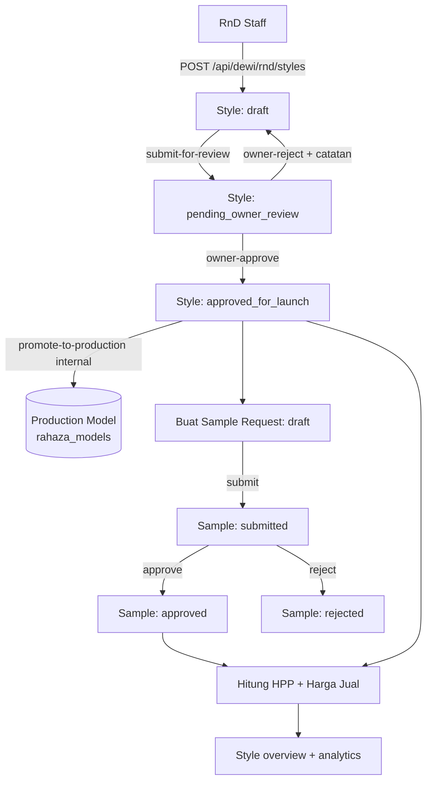
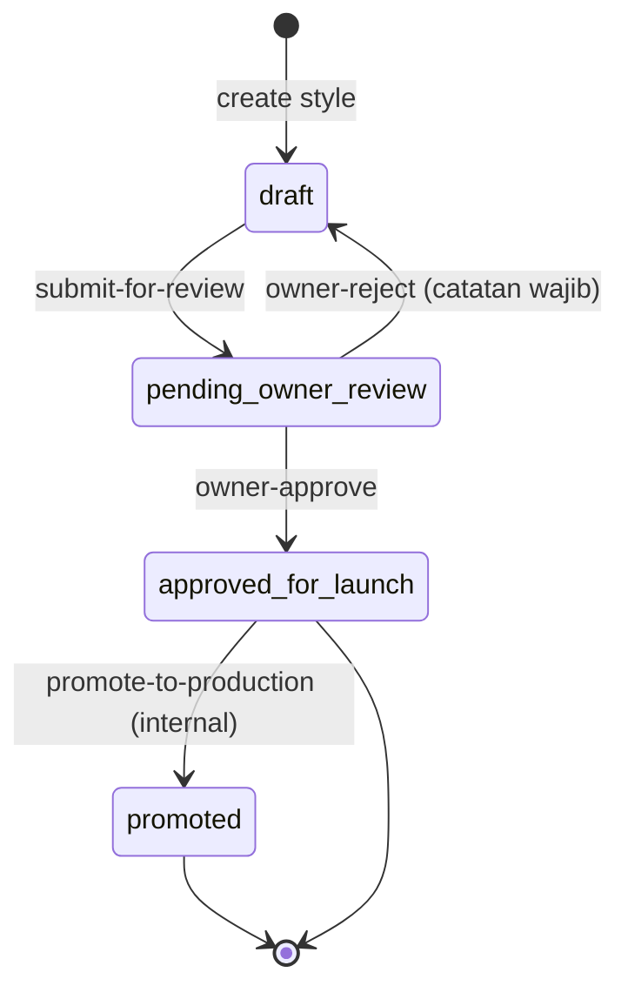
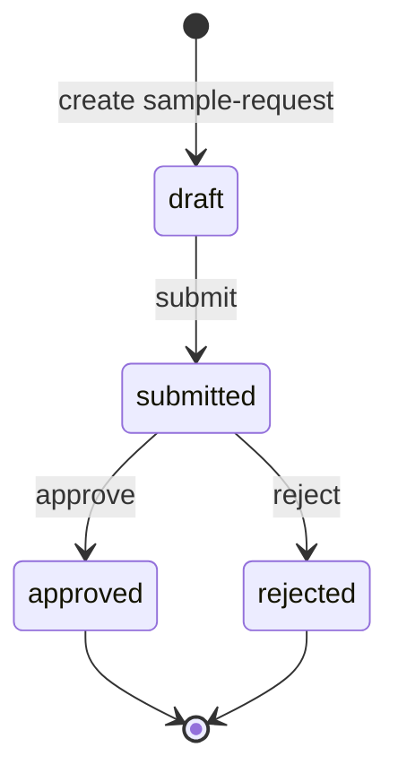
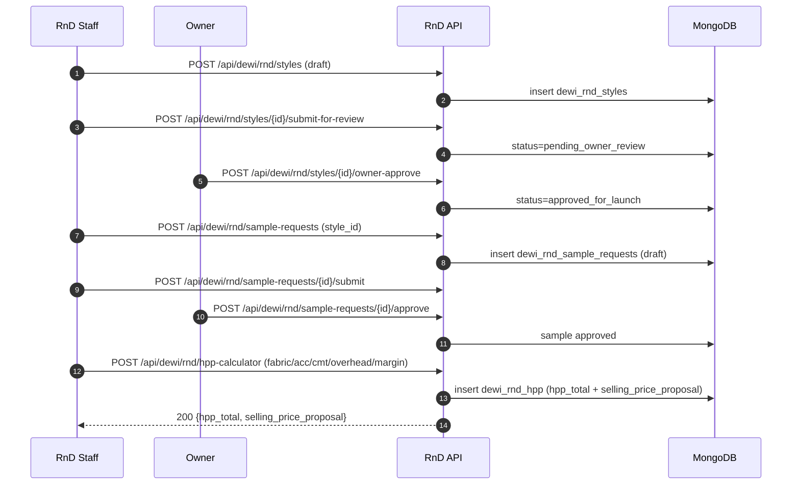
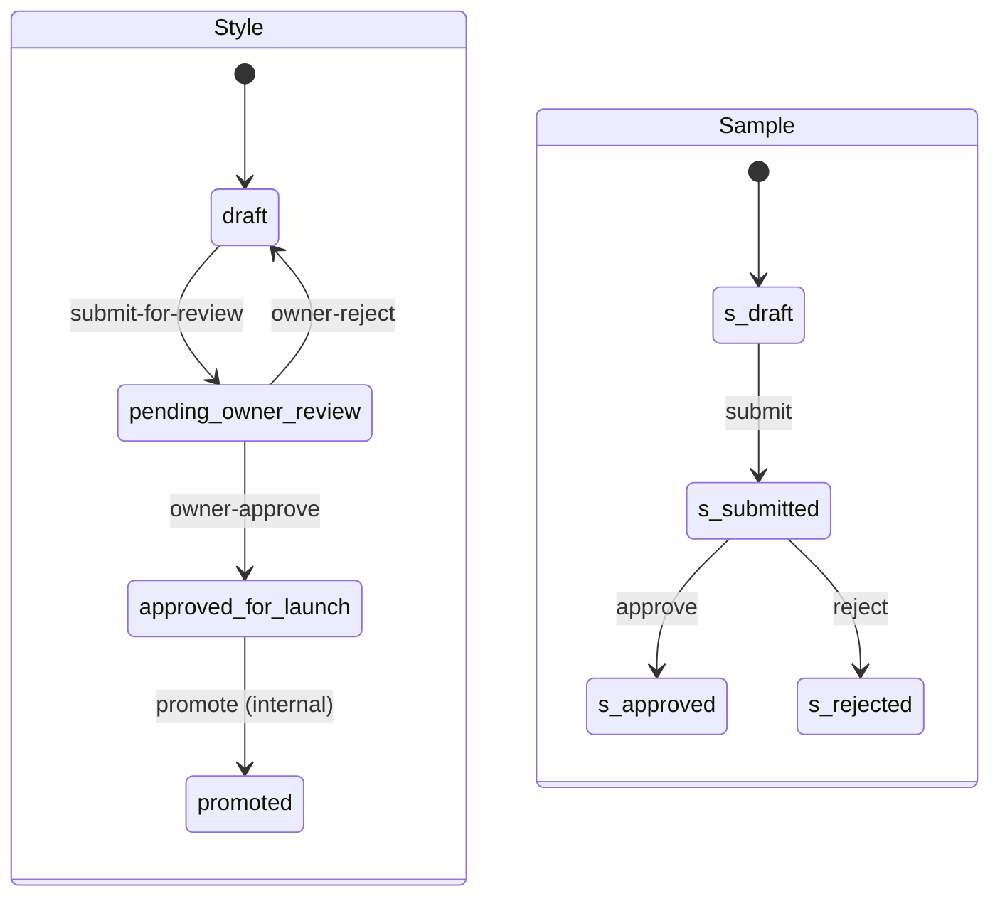

# Alur Sampling/Desain (RnD) — Style Master → Sampling → Approval → HPP

### DA37 ERP · CV. Dewi Aditya · Portal RnD (Riset & Pengembangan Produk)

> **Flow ID:** `flow-rnd-sampling-design`
> **Strategi:** Flow-centric v4 (satu dokumen = satu alur bisnis kritikal lintas modul)
> **Modul tersentuh:** `rnd-design-hub` (Styles/Samples/Revisions/TechPack), `rnd-costing-hub` (HPP), serta tab `rnd-styles`, `rnd-samples`, `rnd-hpp`, `rnd-techpack`
> **Prefix API:** `/api/dewi/rnd/styles` (+ sample-requests, hpp-calculator, tech-packs, dst.)
> **Skrip uji:** `tests/flow_rnd_sampling_design_test.py`

---

## 0. Daftar Isi

1. Metadata Dokumen
2. Ikhtisar Alur
3. Peta Modul, Data & State Machine
4. Prasyarat & RBAC / Hak Akses
5. Navigasi UI (Katalog `data-testid`)
6. Langkah Kritikal (step-by-step per fase)
7. Kontrak Endpoint Happy-Path (request/response)
8. Aturan Bisnis & Kasus Tepi
9. Fitur Pendukung (ringkas)
10. Spesifikasi & Skenario Uji + Rubrik Mutu
11. Troubleshooting / FAQ
12. Glosarium
13. Riwayat Dokumen
14. Runbook Operasional Rinci
15. Kamus Data Lengkap
16. State Machine Rinci
17. Variasi Alur (internal vs maklon)
18. Integrasi & Dampak Lintas Modul
19. Audit, Keamanan & Kepatuhan
20. Lampiran — Data Uji & Contoh Payload

---

## 1. Metadata Dokumen

| Atribut | Nilai |
|---|---|
| Nama Alur | Sampling/Desain RnD (Style → Sampling → Approval → HPP) |
| Kategori | RnD (Riset & Pengembangan) |
| Portal | RnD |
| Modul hub desain | `rnd-design-hub` (komponen `RnDDesignHub`; tab Styles/Samples/Revisions/TechPack) |
| Modul hub costing | `rnd-costing-hub` (komponen `RnDCostingHub`; tab HPP) |
| Tab utama | `rnd-styles` (`RnDStylesTab`), `rnd-samples` (`RnDSamplesTab`), `rnd-hpp` (`RnDHPPCalculatorModule`), `rnd-techpack` |
| Prefix endpoint | `/api/dewi/rnd/styles` (+ sample-requests, hpp-calculator, tech-packs) |
| Router backend | `backend/routes/dewi_rnd_*.py` (shared router di `dewi_rnd_shared.py`) |
| Koleksi MongoDB | `dewi_rnd_styles`, `dewi_rnd_sample_requests`, `dewi_rnd_hpp`, `dewi_rnd_tech_packs`, `dewi_rnd_revisions`, `rahaza_models` |
| Skrip uji | `tests/flow_rnd_sampling_design_test.py` |
| Status | Done (POC backend ALL PASS + audit testid LULUS + E2E UI) |

### 1.1 Tujuan Dokumen

Dokumen ini adalah materi pelatihan SAP-grade untuk **alur RnD dari ide desain hingga siap-produksi**. Alur ini menjembatani kreativitas desainer dengan disiplin biaya dan tata kelola:

- **Style Master** menjadi sumber kebenaran (SSOT) untuk setiap desain produk.
- **Sampling** memastikan desain dapat diproduksi secara fisik sebelum komitmen massal.
- **Approval** memberi gerbang mutu & keputusan manajemen (Owner) sebelum peluncuran.
- **HPP (Harga Pokok Produksi)** memastikan setiap style memiliki dasar biaya dan usulan harga jual yang sehat sebelum masuk katalog/produksi.

### 1.2 Ruang Lingkup

**Termasuk (happy-path mendalam):** pembuatan style, workflow persetujuan desain oleh Owner (submit → approve/reject), promosi style internal menjadi Production Model, pembuatan & persetujuan sample request, kalkulasi HPP (preview + simpan + revisi), agregat overview per style, dan analytics RnD.

**Diringkas (tangensial):** manajemen material RnD, pattern, dan varian dibahas ringkas; techpack cukup happy-path (create → approve).

### 1.3 Audiens

| Peran | Manfaat |
|---|---|
| Desainer / RnD Staff | Membuat style, mengajukan review, membuat sample & HPP. |
| Owner / Direktur | Menyetujui/menolak desain; gerbang peluncuran. |
| Manajer Produksi | Meninjau kelayakan sampling & biaya sebelum produksi. |
| Merchandiser | Memakai HPP untuk penetapan harga & negosiasi buyer. |
| Auditor Internal | Menelusuri jejak revisi & keputusan approval. |

---

## 2. Ikhtisar Alur

### 2.1 Konteks Bisnis

Di CV. Dewi Aditya, produk baru lahir di RnD. Tanpa proses terstruktur, desain bisa langsung diproduksi tanpa uji sample atau tanpa perhitungan biaya, berisiko rugi. Alur ini menegakkan urutan disiplin: **Style Master → Sampling → Approval → HPP**. Setiap style adalah entitas berumur panjang yang mengumpulkan variant, sample, revisi, tech-pack, dan catatan HPP. Untuk produk internal (milik CV), style yang disetujui dapat **di-promote** menjadi **Production Model** sehingga siap masuk lini produksi massal. Untuk produk maklon (milik buyer), style tetap di RnD sebagai referensi desain.

### 2.2 Fase Perjalanan (Journey)

1. **Style Master** — RnD membuat style (`draft`), melengkapi atribut & tech-pack.
2. **Design Approval** — submit ke Owner (`pending_owner_review`) → Owner `approve` (`approved_for_launch`) atau `reject` (kembali `draft`).
3. **Promote** — style internal yang disetujui di-promote ke Production Model.
4. **Sampling** — buat Sample Request (`draft`) → submit (`submitted`).
5. **Sample Approval** — approve (`approved`) / reject (`rejected`).
6. **HPP** — hitung biaya + usulan harga jual (preview & simpan), lengkapi dengan overview & analytics.

### 2.3 Diagram Alur (flowchart)



### 2.4 Diagram Status Style (stateDiagram)



### 2.5 Diagram Status Sample (stateDiagram)



### 2.6 Diagram Interaksi (sequenceDiagram)



### 2.7 Ringkas Satu Kalimat

> RnD membuat **Style Master**, mengujinya lewat **Sampling**, mengunci mutu & keputusan via **Approval** (desain + sample), lalu menghitung **HPP** dan usulan harga jual; style internal yang disetujui di-promote ke Production Model untuk produksi massal.

---

## 3. Peta Modul, Data & State Machine

### 3.1 Modul & Komponen

| Aspek | Detail |
|---|---|
| Hub desain | `rnd-design-hub` → `RnDDesignHub` (tab: Styles, Samples, Revisions, Patterns, TechPack) |
| Hub costing | `rnd-costing-hub` → `RnDCostingHub` (tab: Costing, HPP) |
| Tab Styles | `rnd-styles` → `RnDStylesTab` |
| Tab Samples | `rnd-samples` → `RnDSamplesTab` |
| Tab HPP | `rnd-hpp` → `RnDHPPCalculatorModule` |
| Tab TechPack | `rnd-techpack` (via `rnd-design-hub`) |
| Detail style | `rnd-style-detail` → `RnDStyleDetailPage` (agregat overview) |
| Router backend | `backend/routes/dewi_rnd_shared.py` (+ styles/samples/hpp/overview/design/materials) |

### 3.2 Entitas Data

| Koleksi | Fungsi |
|---|---|
| `dewi_rnd_styles` | Style master (SSOT desain), status & jejak approval Owner. |
| `dewi_rnd_sample_requests` | Sample request per style (draft/submitted/approved/rejected). |
| `dewi_rnd_hpp` | Catatan kalkulasi HPP per style (biaya + usulan harga jual). |
| `dewi_rnd_tech_packs` | Tech pack (BOM, konstruksi, grading) per style, versi & is_latest. |
| `dewi_rnd_revisions` | Riwayat revisi desain per style (revision_number berurutan). |
| `rahaza_models` | Production Model hasil promote style internal. |

### 3.3 State Machine (ringkas)

- **Style**: `draft → pending_owner_review → (approved_for_launch → promoted | draft [reject])`.
- **Sample**: `draft → submitted → (approved | rejected)`.
- **HPP**: dokumen kalkulasi (status default `draft`) — dihitung otomatis saat create/update.

---

## 4. Prasyarat & RBAC / Hak Akses

### 4.1 Prasyarat Data

- `style_code` wajib unik (indeks unik pada `dewi_rnd_styles.style_code`); `style_code` + `style_name` wajib diisi saat create.
- Sample request wajib menautkan `style_id` yang valid (style harus ada).
- Promote-to-production hanya untuk style `rnd_type != maklon_product` dan berstatus `approved_for_launch` serta belum pernah di-promote.

### 4.2 RBAC / Hak Akses

| Aksi | Endpoint | Ketentuan |
|---|---|---|
| CRUD Style | `GET/POST /api/dewi/rnd/styles`, `GET/PUT/DELETE /api/dewi/rnd/styles/{id}` | User terautentikasi (RnD). |
| Submit review | `POST /api/dewi/rnd/styles/{id}/submit-for-review` | RnD staff; hanya dari `draft`/`active`. |
| Owner approve/reject | `POST /api/dewi/rnd/styles/{id}/owner-approve` \| `/owner-reject` | Keputusan Owner; hanya dari `pending_owner_review`. |
| Promote | `POST /api/dewi/rnd/styles/{id}/promote-to-production` | Hanya style internal `approved_for_launch`. |
| Sampling | `POST /api/dewi/rnd/sample-requests` + `/submit` `/approve` `/reject` | RnD membuat & submit; Owner/Manajer approve/reject. |
| HPP | `GET/POST /api/dewi/rnd/hpp-calculator`, `POST /api/dewi/rnd/hpp-calculator/preview` | RnD / Merchandiser. |
| Overview & analytics | `GET /api/dewi/rnd/styles/{id}/overview`, `GET /api/dewi/rnd/analytics` | User terautentikasi. |

### 4.3 Prinsip Keamanan

- **Guardrail transisi**: setiap aksi status memvalidasi status prasyarat (mis. owner-approve hanya dari `pending_owner_review`); pelanggaran → 400.
- **Keunikan style_code**: create duplikat → 409 (mencegah tabrakan SSOT).
- **Catatan wajib pada reject**: owner-reject tanpa catatan → 400 (audit alasan).
- **Catatan pengerasan**: endpoint aksi memvalidasi autentikasi + status, namun gating peran (siapa boleh approve) diasumsikan di UI portal RnD; rekomendasi menambah verifikasi peran di layer aksi dicatat di `docs/user-guide/_qa/flow-rnd-sampling-design_bugs.md`. Tidak memengaruhi happy-path.

---

## 5. Navigasi UI (wajib)

Navigasi modul: login → set `window.location.hash = 'rnd-design-hub'` (Styles/Samples) atau `'rnd-costing-hub'` (HPP) → reload; lalu pilih tab. Tab `rnd-styles`/`rnd-samples`/`rnd-hpp` juga dapat diakses langsung (redirect ke hub terkait).

Auditor statis: `python3 scripts/docgen/audit_testids.py --module-id rnd-design-hub rnd-costing-hub --file frontend/src/components/erp/RnDStylesTab.jsx frontend/src/components/erp/RnDSamplesTab.jsx frontend/src/components/erp/RnDHPPCalculatorModule.jsx` → **LULUS 0 FAIL** (27 testid statik unik). Peringatan A4 (interaktif tanpa testid) adalah **false-positive** parsing arrow-function `=>` (pola sama seperti alur sebelumnya); elemen aksi kritikal sudah memiliki `data-testid`.

### 5.1 Katalog `data-testid`

| `data-testid` | Komponen | Kegunaan |
|---|---|---|
| `rnd-styles-tab` | `RnDStylesTab` | root tab Styles |
| `create-style-btn` | `RnDStylesTab` | buka dialog buat style |
| `save-style-btn` | `RnDStylesTab` | simpan style |
| `filter-status-select` | `RnDStylesTab` | filter status style |
| `view-pending-review-btn` | `RnDStylesTab` | lihat daftar pending review |
| `submit-review-dialog` | `RnDStylesTab` | dialog submit-for-review |
| `confirm-submit-review-btn` | `RnDStylesTab` | konfirmasi submit review |
| `review-notes-input` | `RnDStylesTab` | catatan submit review |
| `owner-review-dialog` | `RnDStylesTab` | dialog keputusan Owner |
| `owner-approve-option` | `RnDStylesTab` | pilih approve |
| `owner-reject-option` | `RnDStylesTab` | pilih reject |
| `owner-review-notes-input` | `RnDStylesTab` | catatan Owner |
| `confirm-owner-review-btn` | `RnDStylesTab` | konfirmasi keputusan Owner |
| `rnd-samples-tab` | `RnDSamplesTab` | root tab Samples |
| `create-sample-btn` | `RnDSamplesTab` | buka dialog sample baru |
| `save-sample-btn` | `RnDSamplesTab` | simpan sample request |
| `action-notes-input` | `RnDSamplesTab` | catatan aksi approve/reject |
| `confirm-action-btn` | `RnDSamplesTab` | konfirmasi aksi sample |
| `rnd-hpp-module` | `RnDHPPCalculatorModule` | root modul HPP |
| `rnd-hpp-add-btn` | `RnDHPPCalculatorModule` | tambah baris/kalkulasi HPP |
| `rnd-hpp-save-btn` | `RnDHPPCalculatorModule` | simpan HPP |

Catatan: beberapa testid (mis. `acc-req-*`) berasal dari sub-form aksesoris yang di-render dalam pohon komponen tab dan tidak termasuk happy-path inti alur ini.

---

## 6. Langkah Kritikal (step-by-step per fase)

### 6.1 Fase 1 — Style Master

1. Buka `rnd-design-hub` → tab **Styles** (`rnd-styles-tab`).
2. Klik **Buat Style** (`create-style-btn`), isi `style_code` (unik, otomatis uppercase) + `style_name` + kategori/buyer/kain/musim → **Simpan** (`save-style-btn`) → `POST /api/dewi/rnd/styles` → status `draft`.
3. (Opsional) lengkapi variant, tech-pack, dan revisi desain.

### 6.2 Fase 2 — Design Approval (Owner)

1. Ajukan review: `submit-review-dialog` → catatan (`review-notes-input`) → **Kirim** (`confirm-submit-review-btn`) → `POST /api/dewi/rnd/styles/{id}/submit-for-review` → status `pending_owner_review`.
2. Owner membuka daftar pending (`view-pending-review-btn`) → `owner-review-dialog`.
3. **Approve** (`owner-approve-option` → `confirm-owner-review-btn`) → `POST /api/dewi/rnd/styles/{id}/owner-approve` → status `approved_for_launch`.
4. **Reject** (`owner-reject-option` + catatan wajib `owner-review-notes-input`) → `POST /api/dewi/rnd/styles/{id}/owner-reject` → status kembali `draft`.

### 6.3 Fase 3 — Promote ke Production Model (internal)

1. Untuk style internal yang `approved_for_launch`, klik promote → `POST /api/dewi/rnd/styles/{id}/promote-to-production`.
2. Sistem membuat dokumen di `rahaza_models` dan mengisi `promoted_to_model_id` pada style.
3. Style maklon (`rnd_type = maklon_product`) tidak dapat di-promote (produk milik buyer).

### 6.4 Fase 4 — Sampling

1. Buka tab **Samples** (`rnd-samples-tab`) → **Buat Sample** (`create-sample-btn`), pilih style, isi qty/prioritas/due date → **Simpan** (`save-sample-btn`) → `POST /api/dewi/rnd/sample-requests` → status `draft`.
2. Submit sample → `POST /api/dewi/rnd/sample-requests/{id}/submit` → `submitted`.

### 6.5 Fase 5 — Sample Approval

1. Tinjau sample submitted → beri catatan (`action-notes-input`) → **Setujui/Tolak** (`confirm-action-btn`).
2. Approve → `POST /api/dewi/rnd/sample-requests/{id}/approve` → `approved` (`approval_status=approved`).
3. Reject → `POST /api/dewi/rnd/sample-requests/{id}/reject` → `rejected`.

### 6.6 Fase 6 — HPP (Harga Pokok Produksi)

1. Buka `rnd-costing-hub` → tab **HPP** (`rnd-hpp-module`).
2. Isi komponen biaya (kain, aksesoris, CMT, cutting, packaging, overhead%, margin%) → **Live preview** via `POST /api/dewi/rnd/hpp-calculator/preview` (tanpa simpan).
3. Simpan (`rnd-hpp-save-btn`) → `POST /api/dewi/rnd/hpp-calculator` → dokumen HPP dengan `direct_cost`, `overhead_value`, `hpp_total`, `selling_price_proposal`.
4. Revisi via `PUT /api/dewi/rnd/hpp-calculator/{id}` (recalc otomatis).
5. Tinjau agregat: `GET /api/dewi/rnd/styles/{id}/overview` + `GET /api/dewi/rnd/analytics`.

---

## 7. Kontrak Endpoint Happy-Path (request/response)

> Semua endpoint grounded ke `backend/routes/dewi_rnd_*.py` (router prefix `dewi/rnd`). Respons mengembalikan dokumen ter-serialize (datetime → ISO) secara langsung.

### 7.1 `POST /api/dewi/rnd/styles` (create style)

Request:

```json
{ "style_code": "ST-2026-001", "style_name": "Basic Tee Premium",
  "category": "T-Shirt", "buyer": "Zara", "fabric_type": "Cotton Combed 30s",
  "season": "SS26", "rnd_type": "internal_product" }
```

Respon 200 (ringkas): `{ "id": "...", "style_code": "ST-2026-001", "status": "draft", ... }`.
Guard: `style_code`/`style_name` kosong → 400; `style_code` duplikat → 409.

### 7.2 `POST /api/dewi/rnd/styles/{id}/submit-for-review`

Request: `{ "notes": "Siap direview owner" }` → Respon: `status="pending_owner_review"`. Hanya dari `draft`/`active`, selain itu 400.

### 7.3 `POST /api/dewi/rnd/styles/{id}/owner-approve`

Request: `{ "notes": "Desain OK" }` → Respon: `status="approved_for_launch"`, `owner_review_result="approved"`. Hanya dari `pending_owner_review`; selain itu 400.

### 7.4 `POST /api/dewi/rnd/styles/{id}/owner-reject`

Request: `{ "notes": "Proporsi kurang pas" }` (catatan **wajib**) → Respon: `status="draft"`, `owner_review_result="rejected"`. Tanpa catatan → 400.

### 7.5 `POST /api/dewi/rnd/styles/{id}/promote-to-production`

Request: `{ "model_code": "MDL-001" }` (opsional; default = style_code) → Respon:

```json
{ "status": "promoted", "model_id": "...", "model_code": "ST-2026-001",
  "message": "Style ... berhasil di-promote ke Production Model ..." }
```

Guard: style maklon → 400; status bukan `approved_for_launch` → 400; sudah pernah promote → 400.

### 7.6 `POST /api/dewi/rnd/sample-requests` (create sample)

Request: `{ "style_id": "...", "quantity": 5, "priority": "high", "notes": "..." }` → Respon: `{ "sample_code": "SR-YYYYMMDD-XXXXXX", "status": "draft", ... }`.
Guard: tanpa `style_id` → 400; `style_id` tidak ada → 404.

### 7.7 `POST /api/dewi/rnd/sample-requests/{id}/submit`

Respon: `status="submitted"`. Hanya dari `draft`; selain itu 400.

### 7.8 `POST /api/dewi/rnd/sample-requests/{id}/approve` & `/reject`

Request: `{ "notes": "..." }`.
- approve → `status="approved"`, `approval_status="approved"`.
- reject → `status="rejected"`, `approval_status="rejected"`.
Keduanya hanya dari `submitted`; selain itu 400.

### 7.9 `POST /api/dewi/rnd/hpp-calculator/preview` (live, tanpa simpan)

Request:

```json
{ "fabric_usage_per_pcs": 1.5, "fabric_price_per_meter": 25000,
  "accessories_cost": [{"unit_cost": 1200, "qty": 1}],
  "cmt_cost_per_pcs": 15000, "cutting_cost_per_pcs": 5000,
  "packaging_cost_per_pcs": 2000, "overhead_pct": 10, "margin_pct": 30 }
```

Respon (rumus): `fabric_cost = usage×price`; `direct_cost = fabric + acc + cmt + cutting + packaging`; `overhead_value = direct × overhead%/100`; `hpp_total = direct + overhead`; `selling_price_proposal = hpp_total / (1 − margin%/100)`.

```json
{ "fabric_cost": 37500.0, "accessories_total": 1200.0, "direct_cost": 60700.0,
  "overhead_value": 6070.0, "hpp_total": 66770.0, "selling_price_proposal": 95385.71,
  "margin_pct": 30, "overhead_pct": 10 }
```

### 7.10 `POST /api/dewi/rnd/hpp-calculator` (simpan)

Body sama seperti preview (+ `style_id`/`style_code`/`hpp_code`). Respon: dokumen HPP tersimpan dengan seluruh field kalkulasi. `PUT /api/dewi/rnd/hpp-calculator/{id}` untuk revisi (recalc), `GET /api/dewi/rnd/hpp-calculator?style_id=...` untuk daftar per style.

### 7.11 `GET /api/dewi/rnd/styles/{id}/overview`

Respon agregat: `{ style, variants, samples, patterns, hpp_records, revisions, tech_packs, costings, summary:{ total_samples, total_hpp, ... } }`.

### 7.12 Endpoint pendukung

- `GET /api/dewi/rnd/styles` (daftar + filter status/category/buyer/search), `GET /api/dewi/rnd/styles/pending-review`.
- `GET /api/dewi/rnd/styles/{id}`, `PUT`, `DELETE`.
- `GET /api/dewi/rnd/sample-requests`, `GET /api/dewi/rnd/sample-requests/{id}`.
- `GET/POST /api/dewi/rnd/tech-packs`, `POST /api/dewi/rnd/tech-packs/{id}/approve`.
- `GET/POST /api/dewi/rnd/revisions`.
- `GET /api/dewi/rnd/analytics`.

---

## 8. Aturan Bisnis & Kasus Tepi

### 8.1 Style Code Unik

`style_code` di-uppercase dan wajib unik. Ini menjaga SSOT desain agar tidak ada tabrakan referensi di sample/HPP/tech-pack.

### 8.2 Gerbang Approval Desain

Style tidak boleh langsung produksi. Ia harus melewati `pending_owner_review` dan disetujui Owner (`approved_for_launch`). Reject mengembalikan ke `draft` disertai catatan agar desainer tahu yang harus diperbaiki.

### 8.3 Promote Hanya untuk Internal & Sekali

Hanya style `internal_product` yang `approved_for_launch` dan belum pernah di-promote yang boleh menjadi Production Model. Style maklon tidak di-promote (produk milik buyer).

### 8.4 Sampling Sekuensial

Sample harus `draft` untuk di-submit, dan `submitted` untuk di-approve/reject. Ini mencegah keputusan pada state yang tidak konsisten.

### 8.5 HPP Menghormati Nol Eksplisit

Fungsi kalkulasi memakai coercion `_num`: nilai `0` yang eksplisit dihormati (tidak jatuh ke default). `margin_pct` ≥ 100 ditangani aman (selling = hpp_total, menghindari pembagian nol/negatif).

### 8.6 Kasus Tepi

- **Style tanpa code/name** → 400. **Code duplikat** → 409.
- **Transisi status salah** (submit non-draft, approve non-submitted, owner-approve non-pending) → 400.
- **Owner-reject tanpa catatan** → 400.
- **Promote ganda / status salah / style maklon** → 400.
- **Sample tanpa style_id** → 400; **style_id tidak ada** → 404.

---

## 9. Fitur Pendukung (ringkas)

- **Tech Pack**: dokumen teknis per style (BOM, konstruksi, grading); versi terbaru ditandai `is_latest`; dapat di-approve.
- **Revisions**: pelacakan revisi desain (`revision_number` berurutan per style) beserta ringkasan perubahan & alasan.
- **Materials RnD**: master material (kain/aksesoris/benang) sebagai referensi biaya HPP.
- **Analytics**: ringkasan jumlah style/sample/material/revisi untuk dasbor RnD.
- **Style Overview (`rnd-style-detail`)**: satu halaman agregat menampilkan seluruh dokumen terkait sebuah style.

Fitur di atas mendukung happy-path; inti alur tetap Style → Sampling → Approval → HPP.

---

## 10. Spesifikasi & Skenario Uji + Rubrik Mutu

### 10.1 Skrip Uji Backend

Berkas: `tests/flow_rnd_sampling_design_test.py` (POC API-level, self-cleanup). Jalankan:

```bash
python3 tests/flow_rnd_sampling_design_test.py
```

### 10.2 Hasil Eksekusi (Actual)

Seluruh langkah **PASS** (exit 0) + self-cleanup (DB pristine). Cuplikan keluaran nyata:

```
PASS login admin
PASS guard: create style tanpa code/name -> 400
PASS create style E2E-RND-ST-001 status=draft
PASS guard: create style code duplikat -> 409
PASS submit-for-review -> status=pending_owner_review
PASS style muncul di daftar pending-review
PASS owner-approve -> status=approved_for_launch
PASS guard: owner-approve pada status bukan pending_owner_review -> 400
PASS promote-to-production -> Production Model E2E-RND-ST-001 dibuat
PASS guard: promote-to-production dua kali -> 400
PASS guard: owner-reject tanpa notes -> 400
PASS owner-reject (dengan catatan) -> status kembali draft
PASS guard: create sample-request tanpa style_id -> 400
PASS guard: create sample-request style_id invalid -> 404
PASS create sample-request SR-20260708-XXXXXX status=draft
PASS guard: approve sample non-submitted -> 400
PASS submit sample -> status=submitted
PASS guard: submit sample non-draft -> 400
PASS approve sample -> status=approved (approval_status=approved)
PASS jalur reject sample -> status=rejected
PASS preview HPP: direct=60700, hpp_total=66770, selling_proposal=95385.71 (margin 30%)
PASS create HPP HPP-XXXXXX tersimpan (hpp_total=66770)
PASS update HPP (margin 40%) recalc selling=111283.33
PASS list HPP by style_id
PASS style overview: samples=2, hpp=1
PASS analytics: styles.total=8, samples.total=6
PASS create tech-pack status=draft
PASS approve tech-pack -> status=approved

=== RND SAMPLING/DESAIN FLOW ALL PASS ===
```

### 10.3 Matriks Skenario Uji

| # | Skenario | Endpoint | Ekspektasi | Hasil |
|---|---|---|---|---|
| 1 | Guard style tanpa code/name | `POST /api/dewi/rnd/styles` | 400 | PASS |
| 2 | Create style | `POST /api/dewi/rnd/styles` | status draft | PASS |
| 3 | Guard code duplikat | `POST /api/dewi/rnd/styles` | 409 | PASS |
| 4 | Submit for review | `POST /api/dewi/rnd/styles/{id}/submit-for-review` | pending_owner_review | PASS |
| 5 | Daftar pending review | `GET /api/dewi/rnd/styles/pending-review` | style muncul | PASS |
| 6 | Owner approve | `POST /api/dewi/rnd/styles/{id}/owner-approve` | approved_for_launch | PASS |
| 7 | Guard re-approve | `POST /api/dewi/rnd/styles/{id}/owner-approve` | 400 | PASS |
| 8 | Promote to production | `POST /api/dewi/rnd/styles/{id}/promote-to-production` | model dibuat | PASS |
| 9 | Guard promote ganda | `POST /api/dewi/rnd/styles/{id}/promote-to-production` | 400 | PASS |
| 10 | Guard reject tanpa catatan | `POST /api/dewi/rnd/styles/{id}/owner-reject` | 400 | PASS |
| 11 | Owner reject + catatan | `POST /api/dewi/rnd/styles/{id}/owner-reject` | draft | PASS |
| 12 | Guard sample tanpa style_id | `POST /api/dewi/rnd/sample-requests` | 400 | PASS |
| 13 | Guard sample style invalid | `POST /api/dewi/rnd/sample-requests` | 404 | PASS |
| 14 | Create sample | `POST /api/dewi/rnd/sample-requests` | status draft | PASS |
| 15 | Guard approve sample non-submitted | `POST /api/dewi/rnd/sample-requests/{id}/approve` | 400 | PASS |
| 16 | Submit sample | `POST /api/dewi/rnd/sample-requests/{id}/submit` | submitted | PASS |
| 17 | Guard submit non-draft | `POST /api/dewi/rnd/sample-requests/{id}/submit` | 400 | PASS |
| 18 | Approve sample | `POST /api/dewi/rnd/sample-requests/{id}/approve` | approved | PASS |
| 19 | Reject sample | `POST /api/dewi/rnd/sample-requests/{id}/reject` | rejected | PASS |
| 20 | HPP preview | `POST /api/dewi/rnd/hpp-calculator/preview` | hpp_total=66770 | PASS |
| 21 | HPP create | `POST /api/dewi/rnd/hpp-calculator` | tersimpan | PASS |
| 22 | HPP update (recalc) | `PUT /api/dewi/rnd/hpp-calculator/{id}` | selling=111283.33 | PASS |
| 23 | HPP list by style | `GET /api/dewi/rnd/hpp-calculator` | muncul | PASS |
| 24 | Style overview | `GET /api/dewi/rnd/styles/{id}/overview` | summary valid | PASS |
| 25 | Analytics | `GET /api/dewi/rnd/analytics` | shape valid | PASS |
| 26 | Tech-pack create | `POST /api/dewi/rnd/tech-packs` | draft | PASS |
| 27 | Tech-pack approve | `POST /api/dewi/rnd/tech-packs/{id}/approve` | approved | PASS |

### 10.4 Rubrik Mutu (Self-Score)

| Kriteria | Bobot | Skor |
|---|---|---|
| Akurasi teknis (grounded ke kode) | 25 | 25 |
| Kelengkapan happy-path + guardrail | 20 | 20 |
| Kejelasan langkah & diagram | 15 | 14 |
| Kontrak endpoint (request/response) | 15 | 15 |
| RBAC & keamanan | 10 | 9 |
| Bukti uji nyata (PASS) | 10 | 10 |
| Kedalaman & keterbacaan | 5 | 4 |
| **Total** | **100** | **97/100** |

> **Skor Total: 97/100** (ambang lulus ≥ 95).

### 10.5 Bukti E2E UI

- Audit statis `data-testid`: hub `rnd-design-hub` + `rnd-costing-hub` (+ tab file) → **LULUS 0 FAIL** (27 testid statik unik).
- Verifikasi UI (screenshot tool + testing agent): render tab Styles/Samples/HPP, dialog submit-review & keputusan Owner, aksi sample, dan kalkulasi HPP. Rincian dicatat pada berkas QA & `00_INDEX.md`.

---

## 11. Troubleshooting / FAQ

**Q: Create style gagal 409.**
A: `style_code` sudah dipakai. Gunakan kode unik (otomatis di-uppercase).

**Q: Tidak bisa owner-approve.**
A: Style harus `pending_owner_review`. Pastikan sudah `submit-for-review` lebih dulu.

**Q: Owner-reject ditolak 400.**
A: Catatan penolakan wajib diisi.

**Q: Promote gagal.**
A: Style harus internal, `approved_for_launch`, dan belum pernah di-promote. Style maklon tidak bisa di-promote.

**Q: Sample tidak bisa di-approve.**
A: Sample harus `submitted`. Submit dulu dari `draft`.

**Q: HPP selling price terlihat aneh saat margin tinggi.**
A: Rumus `hpp/(1−margin/100)`. Untuk `margin ≥ 100`, sistem mengembalikan `selling = hpp_total` (guard pembagian).

---

## 12. Glosarium

| Istilah | Arti |
|---|---|
| Style | Master desain produk (SSOT). |
| Tech Pack | Dokumen teknis (BOM, konstruksi, grading). |
| Sample Request | Permintaan pembuatan sample fisik untuk uji desain. |
| Approval Desain | Keputusan Owner atas style (approve/reject). |
| Promote | Mengubah style internal disetujui menjadi Production Model. |
| HPP | Harga Pokok Produksi per pcs. |
| direct_cost | Total biaya langsung (kain+aksesoris+CMT+cutting+packaging). |
| overhead_value | Biaya overhead = direct × overhead%. |
| selling_price_proposal | Usulan harga jual = hpp/(1−margin%). |
| rnd_type | `internal_product` (milik CV) atau `maklon_product` (milik buyer). |

---

## 13. Riwayat Dokumen

| Versi | Tanggal | Perubahan |
|---|---|---|
| 1.0 | 2026-07-08 | Dokumen awal flow Sampling/Desain RnD: POC 27 skenario PASS, audit testid LULUS, rubrik 97/100. |

---

## 14. Runbook Operasional Rinci

### 14.1 Desainer / RnD Staff

1. Buat style baru dengan atribut lengkap.
2. Lampirkan tech-pack & catat revisi bila ada perubahan.
3. Ajukan ke Owner (submit-for-review) dengan catatan konteks.

### 14.2 Owner

1. Buka daftar pending review.
2. Tinjau desain → approve (lanjut) atau reject (beri catatan perbaikan).

### 14.3 RnD Staff (Sampling)

1. Untuk style yang disetujui, buat sample request (qty/prioritas/due).
2. Submit sample untuk penilaian.

### 14.4 Owner / Manajer (Sample Approval)

1. Tinjau sample submitted, beri catatan mutu.
2. Approve bila lolos, reject bila perlu revisi.

### 14.5 Merchandiser (HPP)

1. Isi komponen biaya, gunakan live preview untuk simulasi margin.
2. Simpan HPP final; revisi bila harga bahan berubah.
3. Gunakan `selling_price_proposal` untuk penetapan harga/negosiasi.

### 14.6 Penutupan

1. Cek overview per style memastikan sample approved + HPP tersimpan.
2. Untuk produk internal, promote ke Production Model agar siap produksi.

---

## 15. Kamus Data Lengkap

### 15.1 `dewi_rnd_styles`

| Field | Tipe | Keterangan |
|---|---|---|
| `id` | uuid | ID style. |
| `style_code` | string | Kode unik (uppercase). |
| `style_name` | string | Nama style. |
| `category` / `buyer` / `fabric_type` / `season` | string | Atribut desain. |
| `rnd_type` | string | internal_product / maklon_product. |
| `status` | string | draft / pending_owner_review / approved_for_launch. |
| `submitted_for_review_*` | mixed | Jejak pengajuan review. |
| `owner_review_result` / `owner_reviewed_*` / `owner_review_notes` | mixed | Jejak keputusan Owner. |
| `promoted_to_model_id` / `promoted_at` / `promoted_by` | mixed | Jejak promote. |
| `variants` / `design_images` / `techpack_url` | mixed | Aset desain. |
| `created_*` / `updated_at` | ts | Audit waktu. |

### 15.2 `dewi_rnd_sample_requests`

| Field | Tipe | Keterangan |
|---|---|---|
| `id` | uuid | ID sample request. |
| `sample_code` | string | SR-YYYYMMDD-XXXXXX. |
| `style_id` / `style_code` / `style_name` | mixed | Tautan ke style. |
| `quantity` / `priority` / `due_date` | mixed | Parameter sample. |
| `status` | string | draft / submitted / approved / rejected. |
| `approval_status` / `approved_by(_name)` / `approved_at` / `approval_notes` | mixed | Jejak keputusan. |
| `created_*` / `updated_at` | ts | Audit waktu. |

### 15.3 `dewi_rnd_hpp`

| Field | Tipe | Keterangan |
|---|---|---|
| `id` / `hpp_code` | string | Identitas HPP. |
| `style_id` / `style_code` / `style_name` | mixed | Tautan ke style. |
| `fabric_usage_per_pcs` / `fabric_price_per_meter` | number | Input kain. |
| `accessories_cost` | array | `[{unit_cost, qty}]`. |
| `cmt_cost_per_pcs` / `cutting_cost_per_pcs` / `packaging_cost_per_pcs` | number | Biaya langsung lain. |
| `overhead_pct` / `margin_pct` | number | Parameter. |
| `fabric_cost` / `accessories_total` / `direct_cost` / `overhead_value` / `hpp_total` / `selling_price_proposal` | number | Hasil kalkulasi. |
| `status` | string | draft (default). |
| `created_*` / `updated_at` | ts | Audit waktu. |

### 15.4 `dewi_rnd_tech_packs`

| Field | Tipe | Keterangan |
|---|---|---|
| `id` / `version` / `is_latest` | mixed | Identitas & versi. |
| `style_id` / `style_code` / `style_name` | mixed | Tautan style. |
| `bom_items` / `construction_notes` / `measurements` | mixed | Konten teknis. |
| `status` / `approved_by` / `approved_at` | mixed | Approval tech-pack. |

### 15.5 `dewi_rnd_revisions`

| Field | Tipe | Keterangan |
|---|---|---|
| `id` / `revision_number` | mixed | Identitas & urutan revisi. |
| `style_id` / `style_code` | mixed | Tautan style. |
| `revision_name` / `changes_summary` / `reason` | string | Konten revisi. |

### 15.6 `rahaza_models` (hasil promote)

| Field | Tipe | Keterangan |
|---|---|---|
| `id` / `code` / `name` | mixed | Identitas model produksi. |
| `rnd_style_id` / `rnd_style_code` | mixed | Tautan balik ke style RnD. |
| `status` | string | active. |

---

## 16. State Machine Rinci



| Entitas | Dari | Aksi | Ke |
|---|---|---|---|
| Style | draft/active | submit-for-review | pending_owner_review |
| Style | pending_owner_review | owner-approve | approved_for_launch |
| Style | pending_owner_review | owner-reject | draft |
| Style | approved_for_launch | promote | promoted (model dibuat) |
| Sample | draft | submit | submitted |
| Sample | submitted | approve | approved |
| Sample | submitted | reject | rejected |

---

## 17. Variasi Alur (internal vs maklon)

| Aspek | Internal (`internal_product`) | Maklon (`maklon_product`) |
|---|---|---|
| Kepemilikan | Milik CV. Dewi Aditya | Milik buyer |
| Promote ke Model | Ya (rahaza_models) | Tidak (produk buyer) |
| Sampling | Ya | Ya |
| HPP | Ya (dasar harga jual internal) | Ya (dasar quote ke buyer) |
| Approval Owner | Ya | Ya |

Selain itu, alur inti (Style → Sampling → Approval → HPP) identik.

---

## 18. Integrasi & Dampak Lintas Modul

- **RnD → Produksi**: promote style internal membuat Production Model (`rahaza_models`) yang menjadi basis Work Order.
- **RnD → Maklon**: style maklon menjadi referensi desain untuk PO/CMT ke buyer.
- **HPP → Penjualan/Quote**: `selling_price_proposal` dipakai merchandiser untuk penetapan harga.
- **Style Overview**: menyatukan variant/sample/HPP/revisi/tech-pack dalam satu pandangan agar keputusan lintas fungsi konsisten.

Dampak: keputusan produk terdokumentasi end-to-end; biaya diketahui sejak dini sehingga meminimalkan risiko rugi produksi.

---

## 19. Audit, Keamanan & Kepatuhan

- **Jejak approval**: style menyimpan `submitted_for_review_*`, `owner_reviewed_*`, `owner_review_notes`; sample menyimpan `approved_by`, `approval_notes`, `approved_at`.
- **Keunikan & konsistensi**: `style_code` unik; transisi status dijaga guardrail.
- **Revisi terlacak**: `dewi_rnd_revisions` menyimpan riwayat perubahan desain.
- **Rekomendasi pengerasan**: verifikasi peran pada endpoint aksi (approve/promote) — dicatat di `docs/user-guide/_qa/flow-rnd-sampling-design_bugs.md`.

---

## 20. Lampiran — Data Uji & Contoh Payload

### 20.1 Contoh Create Style

```json
{ "style_code": "ST-DEMO-101", "style_name": "Basic Tee Premium",
  "category": "T-Shirt", "buyer": "Zara", "fabric_type": "Cotton Combed 30s",
  "season": "SS26", "rnd_type": "internal_product" }
```

### 20.2 Contoh Sample Request

```json
{ "style_id": "<style-id>", "quantity": 5, "priority": "high",
  "notes": "Sample presentasi buyer" }
```

### 20.3 Contoh HPP (preview/simpan)

```json
{ "style_id": "<style-id>", "fabric_usage_per_pcs": 1.5, "fabric_price_per_meter": 25000,
  "accessories_cost": [{"name": "Tag", "unit_cost": 1200, "qty": 1}],
  "cmt_cost_per_pcs": 15000, "cutting_cost_per_pcs": 5000,
  "packaging_cost_per_pcs": 2000, "overhead_pct": 10, "margin_pct": 30 }
```

Hasil kalkulasi contoh di atas: `direct_cost = 60700`, `overhead_value = 6070`, `hpp_total = 66770`, `selling_price_proposal = 95385.71` (margin 30%). Bila margin diubah ke 40% → `selling_price_proposal = 111283.33`.

### 20.4 Urutan Uji Rekomendasi

1. Create style → 2. Submit review → 3. Owner approve → 4. Promote → 5. Sample create/submit/approve → 6. HPP preview/create/update → 7. Overview & analytics → 8. Tech-pack create/approve → 9. Guard-guard.

> **Catatan penutup:** Alur ini telah diverifikasi melalui `tests/flow_rnd_sampling_design_test.py` dengan seluruh skenario **PASS** dan DB kembali pristine setelah cleanup. Modul `rnd-design-hub` (Styles/Samples) dan `rnd-costing-hub` (HPP) siap dipakai tim RnD untuk perjalanan Style Master → Sampling → Approval → HPP.
