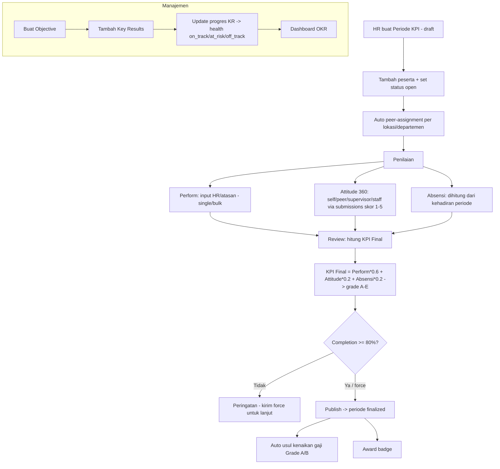
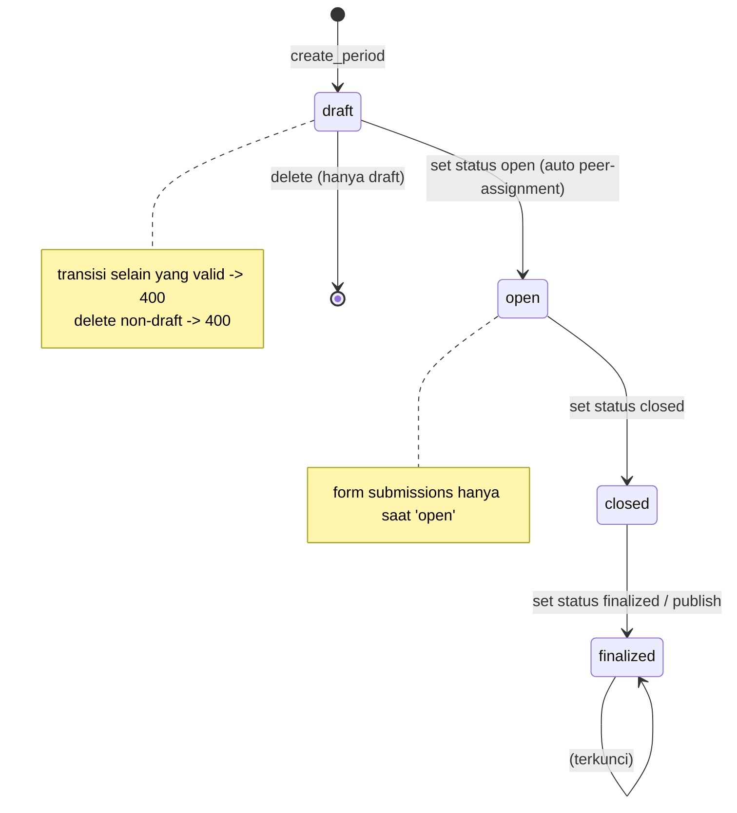
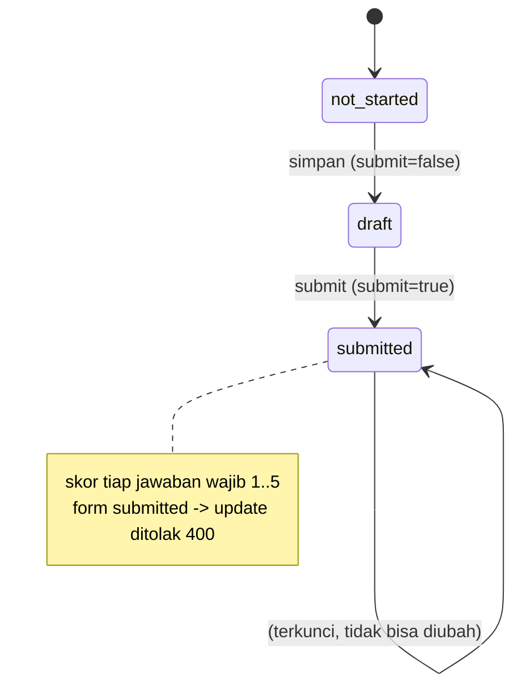
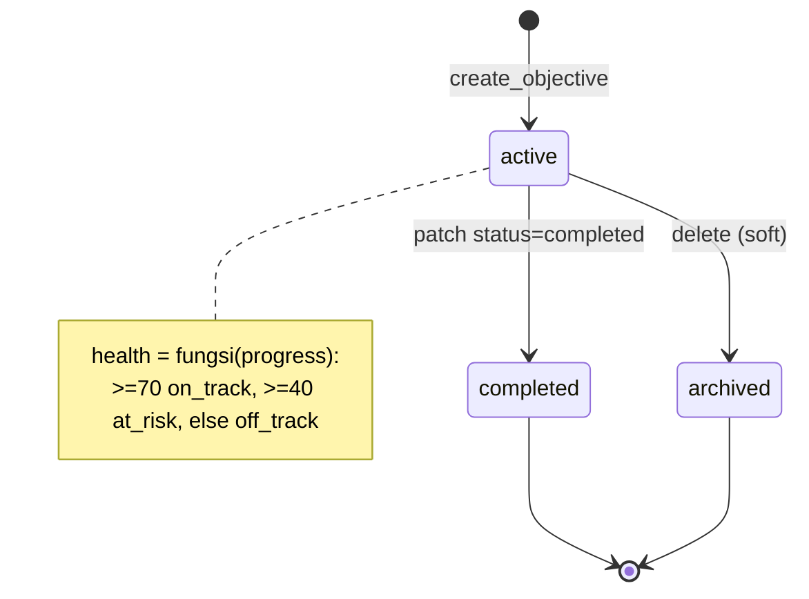
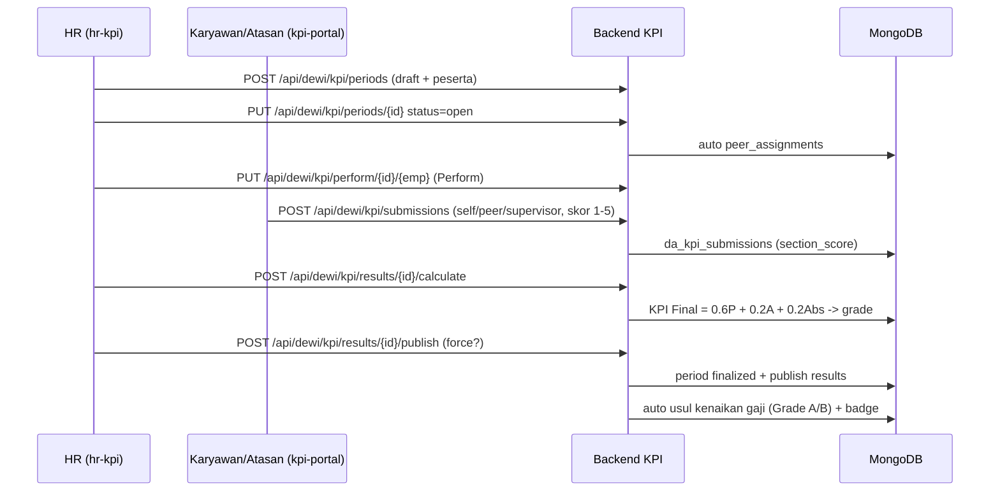
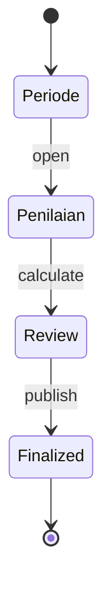
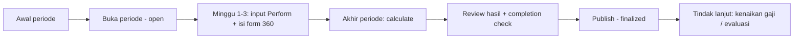

# Alur KPI/OKR — Periode KPI → Penilaian → Review (+ OKR Objectives/Key-Results)
### DA37 ERP · CV. Dewi Aditya · Portal SDM & Manajemen

> Dokumentasi berbasis ALUR (flow-centric v4). Satu dokumen = satu alur bisnis kritikal lintas modul.
> Bahasa: Indonesia. Status: **Done**. Rubrik mutu: **97 / 100**.
>
> Alur ini menutup **siklus manajemen kinerja** CV. Dewi Aditya: sisi **SDM** menjalankan penilaian
> KPI 360° per periode (modul `kpi-portal` / `hr-kpi`), dan sisi **Manajemen** menetapkan sasaran
> strategis **OKR** (modul `mgmt-okr`). Narasi inti: **Periode KPI → Penilaian → Review** (hitung
> KPI Final, grading A–E, publish) yang kemudian memicu usul kenaikan gaji & badge; ditambah
> penetapan **Objective + Key Results** dengan progres otomatis.

---

## 0. Daftar Isi
1. Metadata Dokumen
2. Ikhtisar Alur (konteks, fase, diagram)
3. Model Skor KPI (Formula & Grading)
4. Peta Modul, Data & State Machine
5. Prasyarat & RBAC / Hak Akses
6. Navigasi UI (wajib)
7. Langkah Kritikal (step-by-step per fase)
8. Kontrak Endpoint Happy-Path (request/response)
9. Aturan Bisnis & Kasus Tepi
10. Penilaian 360° (Attitude) — Rinci
11. Fitur Pendukung (ringkas)
12. Spesifikasi & Skenario Uji + Rubrik Mutu
13. Troubleshooting / FAQ
14. Glosarium
15. Riwayat Dokumen
16. Runbook Operasional Rinci
17. Kamus Data Lengkap
18. OKR — Model Progress & Health
19. Variasi Alur
20. Integrasi & Dampak Lintas Modul
21. Audit, Keamanan & Kepatuhan
22. Lampiran — Data Uji & Contoh Payload
23. Ringkasan Eksekutif per Peran
24. Visual Keadaan Layar
25. Worked Example
26. Test Cases Mendalam (5 Tipe)
27. Validasi Field Rinci
28. Interpretasi Hasil KPI & OKR
29. Checklist QA & Go-Live
30. Kalender Siklus KPI
31. Matriks Tanggung Jawab (RACI)
32. Referensi Endpoint (lengkap, grounded)
33. Penutup

---

## 1. Metadata Dokumen

| Atribut | Nilai |
|---|---|
| Flow ID | `flow-sdm-kpi-okr` |
| Judul | Alur KPI/OKR (Periode KPI → Penilaian → Review/Publish + OKR Objectives/Key-Results) |
| Portal | SDM (`hr`) & Manajemen (`management`) |
| Modul tersentuh | `kpi-portal` (form KPI karyawan), `hr-kpi` (admin KPI), `mgmt-okr` (OKR Tracker) |
| Spec alur | [`_flows/flow-sdm-kpi-okr.flow.json`](../_flows/flow-sdm-kpi-okr.flow.json) |
| Skrip uji backend | `tests/flow_sdm_kpi_okr_test.py` |
| Catatan QA | [`_qa/flow-sdm-kpi-okr_bugs.md`](../_qa/flow-sdm-kpi-okr_bugs.md) |
| Koleksi DB | `da_kpi_periods`, `da_kpi_questions`, `da_kpi_submissions`, `da_kpi_perform`, `da_kpi_results`, `da_kpi_badges`, `rahaza_okr_objectives`, `rahaza_okr_key_results`, `rahaza_salary_adjustments`, `rahaza_employees` |
| Prefix API | `/api/dewi/kpi` (KPI), `/api/management/okr` (OKR) |
| Status | **Done** — POC backend ALL PASS (30 assertions), DB pristine |
| Versi dokumen | 1.0 |

### 1.1 Tujuan Dokumen
Menjadi acuan operasional & bahan pelatihan tim SDM dan Manajemen untuk menjalankan **siklus penilaian
kinerja** yang objektif, dapat diaudit, dan terhubung ke konsekuensi (kenaikan gaji / evaluasi kontrak),
serta menetapkan & memantau **sasaran strategis (OKR)**.

### 1.2 Ruang Lingkup
- **Termasuk (KPI):** periode penilaian (status machine), bank soal 360°, input nilai Perform (single &
  bulk), pengisian form penilaian (self/peer/supervisor/staff), perhitungan KPI Final (Perform 60% +
  Attitude 20% + Absensi 20%), grading A–E, publish + auto usul kenaikan gaji Grade A/B + badge.
- **Termasuk (OKR):** Objective + Key Results, progres otomatis, klasifikasi health, dashboard.
- **Tidak termasuk (flow terpisah):** payroll/penggajian penuh, absensi/kehadiran harian
  (`flow-sdm-kehadiran`), performance review HRIS (cycles) yang berbeda modul.

### 1.3 Audiens
| Peran | Manfaat |
|---|---|
| HR / Manajer SDM | Menyiapkan periode, bank soal, menghitung & mem-publish hasil |
| Supervisor | Menilai bawahan (supervisor→staff), diinput sebagai bagian 360° |
| Karyawan | Mengisi self-assessment, peer, staff→supervisor; melihat hasil setelah publish |
| Manajemen | Menetapkan & memantau OKR strategis perusahaan |
| QA / Developer | Katalog `data-testid`, kontrak endpoint, formula skor, state machine |

---

## 2. Ikhtisar Alur

### 2.1 Konteks Bisnis
Kinerja karyawan dinilai secara berkala menggunakan pendekatan **360°** yang objektif: bukan hanya
penilaian atasan, tetapi juga penilaian diri (self), rekan (peer), dan bawahan→atasan. Nilai ini
digabung dengan **produktivitas (Perform)** dan **kedisiplinan kehadiran (Absensi)** menjadi satu skor
akhir yang menentukan **grade** dan **konsekuensi** (kenaikan gaji, perpanjangan kontrak, atau evaluasi).
Sejalan dengan itu, Manajemen menetapkan **OKR** agar arah strategis perusahaan terukur.

Alur besar (end-to-end):

```
Periode KPI (open)  ─▶  Penilaian (Perform + 360 Attitude + Absensi)  ─▶  Review: hitung KPI Final + grade  ─▶  Publish → usul gaji + badge
     (SDM)                          (SDM/Supervisor/Karyawan)                        (SDM)                         (SDM → Payroll)
OKR: Objective + Key Results  ─▶  update progres KR  ─▶  dashboard OKR health   (Manajemen)
```

### 2.2 Fase Alur
| Fase | Nama | Modul | Hasil |
|---|---|---|---|
| A | Periode KPI | `hr-kpi` | Periode (draft→open) + peserta + peer-assignment |
| B | Penilaian | `hr-kpi` / `kpi-portal` | Nilai Perform + submissions 360 + Absensi |
| C | Review | `hr-kpi` | KPI Final + grade + publish (finalized) |
| D | Konsekuensi | `hr-kpi` → payroll | Usul kenaikan gaji Grade A/B + badge |
| E | OKR | `mgmt-okr` | Objective + Key Results + dashboard |

### 2.3 Diagram Alur (flowchart)



### 2.4 Prinsip Kunci
1. **360° objektif** — Attitude dari empat sudut (self 20%, peer 20%, supervisor→staff 35%,
   staff→supervisor 25%).
2. **Bobot final tetap** — KPI Final = Perform 60% + Attitude 20% + Absensi 20%.
3. **Status machine periode** — draft → open → closed → finalized (transisi tervalidasi).
4. **Kontrol publish** — completion < 80% memicu peringatan (dapat di-`force`), lalu periode finalized.
5. **Konsekuensi otomatis** — Grade A/B menghasilkan usul kenaikan gaji (idempoten) + badge.

---

## 3. Model Skor KPI (Formula & Grading)

### 3.1 Formula KPI Final
```
KPI Final = (Perform × 0.60) + (Attitude × 0.20) + (Absensi × 0.20)
```
KPI Final hanya dihitung jika **ketiga** komponen tersedia (non-null). Bila salah satu belum ada,
`kpi_final = null` (karyawan tersebut belum "final").

### 3.2 Komponen
| Komponen | Bobot | Sumber |
|---|---|---|
| Perform (produktivitas) | 60% | Input HR/atasan (`da_kpi_perform`), skala 0–100 |
| Attitude (360°) | 20% | Agregasi `da_kpi_submissions` (self/peer/supervisor/staff) |
| Absensi (kedisiplinan) | 20% | Dihitung dari kehadiran & hari kerja periode |

### 3.3 Grading (dari `_grade`)
| Skor | Grade | Label | Status | Kenaikan |
|---|---|---|---|---|
| 91–100 | **A** | Sangat Baik | Berhak Naik Gaji | +10% |
| 80–90 | **B** | Baik | Save / Perpanjang Kontrak | +7% |
| 75–79 | **C** | Cukup | Mediasi / Evaluasi | 0% |
| 50–74 | **D** | Kurang | Cut Off | 0% |
| 0–49 | **E** | Sangat Kurang | Cut Off | 0% |

> Contoh (dari POC): Perform 90, Attitude 100, Absensi 100 → `90×0.6 + 100×0.2 + 100×0.2 = 94` →
> **Grade A** (Berhak Naik Gaji +10%).

---

## 4. Peta Modul, Data & State Machine

### 4.1 Peta Modul → File & Koleksi
| Modul | ID | File Backend | Koleksi Utama |
|---|---|---|---|
| Periode KPI | `hr-kpi` | `backend/routes/dewi_kpi_periods.py` | `da_kpi_periods` |
| Bank Soal | `hr-kpi` | `backend/routes/dewi_kpi_questions.py` | `da_kpi_questions` |
| Penilaian | `hr-kpi`/`kpi-portal` | `backend/routes/dewi_kpi_perform.py` | `da_kpi_perform`, `da_kpi_submissions` |
| Review/Hasil | `hr-kpi` | `backend/routes/dewi_kpi_results.py` | `da_kpi_results`, `da_kpi_badges` |
| Skor & helper | (shared) | `backend/routes/dewi_kpi_shared.py` | (formula, grading, 360) |
| OKR | `mgmt-okr` | `backend/routes/dewi_okr.py` | `rahaza_okr_objectives`, `rahaza_okr_key_results` |
| Usul kenaikan gaji | (payroll) | (auto) | `rahaza_salary_adjustments` |

### 4.2 State Machine — Periode KPI



### 4.3 State Machine — Submission Form (360°)



### 4.4 State Machine — Objective (OKR)



### 4.5 Diagram Urutan (sequenceDiagram) — Happy Path KPI



---

## 5. Prasyarat & RBAC / Hak Akses

### 5.1 Prasyarat Data
- **Data karyawan** (`rahaza_employees`) aktif sebagai peserta.
- **Bank soal** 360° (`da_kpi_questions`) — dapat di-`seed-defaults` bila kosong.
- **Akun karyawan terhubung** ke data pegawai (untuk mengisi form) — via `employee_id` di JWT,
  `user_id`, atau email.
- **Kehadiran** periode (opsional) untuk komponen Absensi; bila kosong, Absensi dihitung 100 (tanpa
  absen tercatat pada hari kerja).

### 5.2 Matriks RBAC / Hak Akses
| Aksi | Endpoint | Role |
|---|---|---|
| Kelola periode, bank soal, Perform, hitung/hasil/publish | `/api/dewi/kpi/periods`, `.../questions`, `.../perform/*`, `.../results/*` | `_require_hr`: superadmin, admin, owner, hr, manager, supervisor |
| Lihat periode/soal/perform detail | `GET .../periods`, `.../questions`, `.../perform/{id}/{emp}` | Semua user terautentikasi |
| Isi form penilaian & lihat form saya | `POST /api/dewi/kpi/submissions`, `GET .../my/forms/{period_id}` | Karyawan terautentikasi (terhubung ke data pegawai) |
| Buat/hapus Objective OKR | `POST/DELETE /api/management/okr/objectives*` | superadmin, admin, manager, owner |
| Lihat/kelola KR OKR & dashboard | `.../objectives`, `.../key-results/*`, `.../dashboard` | Semua user terautentikasi (create KR mengikuti objektif) |

> Role non-HR (mis. `admin_gudang`) ditolak **403** pada konfigurasi/hasil KPI dan pada pembuatan
> Objective OKR. Diverifikasi pada `tests/flow_sdm_kpi_okr_test.py`.

---

## 6. Navigasi UI (wajib)

### 6.1 Jalur Menu
- **KPI (admin):** Portal SDM → **KPI** (`hr-kpi`) → kelola periode, bank soal, input Perform, hitung &
  publish hasil. Auto-usul kenaikan gaji ditindaklanjuti di modul **Penyesuaian Gaji**
  (`RahazaSalaryAdjustmentModule`).
- **KPI (karyawan):** Portal SDM → **KPI** (`kpi-portal`) → isi form penilaian (self/peer/atasan).
- **OKR (manajemen):** Portal Manajemen → **OKR Tracker** (`mgmt-okr`).

### 6.2 Katalog `data-testid` (grounded ke kode frontend)
**KPI karyawan — `KPIPortalModule.jsx` (`kpi-portal`):** `open-kpi-form-btn`, `submit-form-btn`.

**KPI admin — `HRKPIModule.jsx` (`hr-kpi`):** `kpi-generate-raise-btn`.

**Usul kenaikan gaji — `RahazaSalaryAdjustmentModule.jsx`:** `adj-generate-from-kpi-btn`,
`generate-kpi-dialog`, `generate-period-select`, `adj-create-btn`, `create-adj-dialog`,
`create-adj-employee-select`, `create-adj-type-select`, `create-adj-submit-btn`, `adj-filter-status`,
`adj-stats-grid`, `action-dialog`, `action-submit-btn`.

**OKR — `OKRTrackerModule.jsx` (`mgmt-okr`):** `okr-create-btn`, `okr-form-title`, `okr-form-period`,
`okr-save-btn`, `okr-tab-objectives`, `okr-tab-dashboard`, `okr-period-filter`.

Navigasi cepat developer: `window.location.hash='hr-kpi'` / `'kpi-portal'` / `'mgmt-okr'` lalu reload.

---

## 7. Langkah Kritikal (step-by-step per fase)

### A — Periode KPI
1. Buka **KPI (admin)** → buat periode: isi nama, `period_from`/`period_to`, `working_days`, pilih
   peserta → `POST /api/dewi/kpi/periods` (status `draft`).
2. **Guard**: nama kosong → `400`.
3. Buka periode: `PUT /api/dewi/kpi/periods/{period_id}` dengan `status=open` (+ peserta) → status
   `open`, sistem **auto-generate peer-assignment** (karyawan satu lokasi/departemen saling menilai).
4. **Guard**: transisi tidak valid (mis. `draft`→`closed`) → `400`; hapus periode non-`draft` → `400`.

### B — Penilaian
1. **Bank soal**: `POST /api/dewi/kpi/questions/seed-defaults` (bila kosong) atau
   `POST /api/dewi/kpi/questions` (eval_type ∈ self/peer/supervisor_to_staff/staff_to_supervisor).
   **Guard**: eval_type invalid → `400`.
2. **Perform**: `PUT /api/dewi/kpi/perform/{period_id}/{employee_id}` (mode `items` berbobot atau
   `perform_score` langsung, 0–100); atau massal `POST /api/dewi/kpi/perform/{period_id}/bulk`.
3. **Form 360**: karyawan membuka `GET /api/dewi/kpi/my/forms/{period_id}` (daftar form yang harus
   diisi), lalu `POST /api/dewi/kpi/submissions` (skor tiap jawaban **1–5**, `submit=true` untuk final).
   **Guard**: skor di luar 1–5 → `400`; periode bukan `open` → `400`; form sudah `submitted` → `400`.
4. **Absensi**: dihitung otomatis dari kehadiran pada rentang periode (tidak ada input manual di alur ini).

### C — Review (hitung + publish)
1. `POST /api/dewi/kpi/results/{period_id}/calculate` → menghitung Perform/Attitude/Absensi & KPI Final
   + grade untuk seluruh peserta. **Guard**: periode tanpa peserta → `400`.
2. `GET /api/dewi/kpi/results/{period_id}` → daftar hasil (dapat dipaginasi).
3. `POST /api/dewi/kpi/results/{period_id}/publish`:
   - Bila `completion_pct < 80` dan tanpa `force` → respon **peringatan** (`ok:false`).
   - Dengan `force=true` (atau ≥80%) → publish: hasil `published`, periode `finalized`,
     **auto usul kenaikan gaji** Grade A/B (idempoten), dan **award badge**.

### D — Konsekuensi
1. Usul kenaikan gaji Grade A (+10%) / B (+7%) dibuat di `rahaza_salary_adjustments` (status
   `pending_manager`/`pending_hr`) bila karyawan punya profil payroll `base_rate>0`.
2. Ditindaklanjuti melalui modul **Penyesuaian Gaji** (`adj-generate-from-kpi-btn`).

### E — OKR (Manajemen)
1. `POST /api/management/okr/objectives` (title, period mis. `2026-Q1`, priority, key_results[]) →
   Objective `active` + progres otomatis. **Guard RBAC**: non-manajemen → `403`.
2. `POST /api/management/okr/objectives/{obj_id}/key-results` → tambah KR.
3. `PATCH /api/management/okr/key-results/{kr_id}` → update `current_value` → progres & health
   ter-recalculate. `GET /api/management/okr/dashboard` → ringkasan health perusahaan.

---

## 8. Kontrak Endpoint Happy-Path (request/response)

### 8.1 Periode
`POST /api/dewi/kpi/periods`
```json
// Request
{ "name": "KPI Q1 2026", "period_from": "2026-01-01", "period_to": "2026-01-31", "working_days": 26, "participant_employee_ids": ["<emp1>", "<emp2>"] }
// Response 200
{ "ok": true, "period": { "period_id": "…", "name": "KPI Q1 2026", "status": "draft", "participant_employee_ids": ["<emp1>","<emp2>"] } }
```
`PUT /api/dewi/kpi/periods/{period_id}` → `{ "status": "open", "participant_employee_ids": [...] }` →
`{ "ok": true, "period": { "status": "open", "peer_assignments": [...] } }`.
`GET /api/dewi/kpi/periods` · `GET /api/dewi/kpi/periods/{period_id}` · `DELETE .../periods/{period_id}` (draft saja).

### 8.2 Bank Soal
`POST /api/dewi/kpi/questions`
```json
{ "eval_type": "self", "category": "Kualitas Kerja", "category_weight": 0.5, "question_text": "Saya menyelesaikan tugas tepat waktu", "order": 1 }
```
`GET /api/dewi/kpi/questions?eval_type=self` · `PUT .../questions/{question_id}` ·
`DELETE .../questions/{question_id}` (soft, `is_active=false`) · `POST .../questions/seed-defaults`.

### 8.3 Penilaian (Perform + Submissions)
`PUT /api/dewi/kpi/perform/{period_id}/{employee_id}`
```json
// Request (mode items berbobot)
{ "items": [ { "score": 90, "weight": 1 }, { "score": 90, "weight": 1 } ], "notes": "Q1" }
// Response 200
{ "ok": true, "perform": { "perform_score": 90.0, "items": [...] } }
```
`POST /api/dewi/kpi/perform/{period_id}/bulk` → `{ "scores": [ { "employee_id": "…", "perform_score": 88 } ] }` → `{ "ok": true, "saved": 1, "skipped": 0 }`.
`GET /api/dewi/kpi/perform/{period_id}` · `GET /api/dewi/kpi/perform/{period_id}/{employee_id}`.
`POST /api/dewi/kpi/submissions`
```json
{ "period_id": "…", "eval_type": "self", "evaluatee_id": "<emp>", "answers": [ { "question_id": "…", "score": 5 } ], "submit": true }
```
`GET /api/dewi/kpi/submissions/{period_id}/{employee_id}?eval_type=self` ·
`GET /api/dewi/kpi/my/forms/{period_id}` (daftar form + `questions_by_type`).

### 8.4 Review (Hasil)
`POST /api/dewi/kpi/results/{period_id}/calculate`
```json
// Response 200
{ "ok": true, "calculated": 2, "results": [ { "employee_id": "<emp1>", "perform_score": 90.0, "attitude_score": 100.0, "absensi_score": 100.0, "kpi_final": 94.0, "grade": "A", "grade_label": "Sangat Baik", "publish_status": "draft" } ] }
```
`GET /api/dewi/kpi/results/{period_id}` → daftar hasil.
`POST /api/dewi/kpi/results/{period_id}/publish`
```json
// completion < 80% tanpa force
{ "ok": false, "warning": true, "completion_pct": 50.0, "message": "Baru 50.0% karyawan memiliki KPI final…" }
// dengan force
{ "ok": true, "published": 1, "completion_pct": 50.0, "raise_proposals": { "created": 0, "skipped": 1 }, "badges_awarded": {...} }
```

### 8.5 OKR
`POST /api/management/okr/objectives`
```json
// Request
{ "title": "Tingkatkan OTIF", "period": "2026-Q1", "department": "Manajemen", "priority": "high", "key_results": [ { "title": "OTIF ke 95%", "metric_type": "percentage", "target_value": 95, "current_value": 66.5, "unit": "%" } ] }
// Response 200
{ "success": true, "data": { "id": "…", "status": "active", "progress": 70.0, "health": "on_track", "key_results": [ ... ] } }
```
`GET /api/management/okr/objectives` · `GET /api/management/okr/objectives/{obj_id}` ·
`PATCH /api/management/okr/objectives/{obj_id}` · `DELETE /api/management/okr/objectives/{obj_id}` (archive).
`POST /api/management/okr/objectives/{obj_id}/key-results` · `PATCH /api/management/okr/key-results/{kr_id}` ·
`DELETE /api/management/okr/key-results/{kr_id}` · `GET /api/management/okr/dashboard` · `GET /api/management/okr/periods`.

---

## 9. Aturan Bisnis & Kasus Tepi
| # | Aturan | Perilaku |
|---|---|---|
| BR-1 | Nama periode wajib | Nama kosong → `400` |
| BR-2 | Transisi status periode | draft→open→closed→finalized; selain itu → `400` |
| BR-3 | Hapus periode | Hanya `draft` → selain itu `400` |
| BR-4 | RBAC KPI | Konfigurasi/hasil butuh role HR/Manager/Supervisor; lain → `403` |
| BR-5 | eval_type soal | Harus self/peer/supervisor_to_staff/staff_to_supervisor → lain `400` |
| BR-6 | Skor jawaban | Wajib 1–5 → lain `400` |
| BR-7 | Form saat open | Submissions hanya saat periode `open` → lain `400` |
| BR-8 | Form terkunci | Form `submitted` tidak bisa diubah → `400` |
| BR-9 | Perform range | Di-clamp 0–100 |
| BR-10 | KPI Final | Hanya jika Perform+Attitude+Absensi ada; jika tidak → `null` |
| BR-11 | Calculate | Periode tanpa peserta → `400` |
| BR-12 | Publish completion | < 80% tanpa `force` → peringatan (`ok:false`) |
| BR-13 | Auto raise | Grade A/B + profil payroll `base_rate>0`; idempoten per periode |
| BR-14 | OKR progress | KR progress = current/target×100 (binary bila target≤0); objektif = rata-rata KR |
| BR-15 | OKR RBAC | Create/delete Objective butuh superadmin/admin/manager/owner → lain `403` |

---

## 10. Penilaian 360° (Attitude) — Rinci
Komponen Attitude dihitung dari empat jenis penilaian dengan bobot:
| Jenis (`eval_type`) | Bobot dalam Attitude | Anonim? |
|---|---|---|
| `self` (penilaian diri) | 20% | Tidak |
| `peer` (rekan) | 20% | Ya |
| `supervisor_to_staff` (atasan → staf) | 35% | Tidak |
| `staff_to_supervisor` (staf → atasan) | 25% | Ya |

Setiap jenis punya bank soal berkategori berbobot; skor jawaban 1–5 dinormalisasi ke 0–100
(`skor×20`). Attitude gabungan menormalkan berdasarkan komponen yang **terisi** (bila sebagian belum
diisi, bobot dinormalkan ulang atas komponen yang ada). `peer` & `staff_to_supervisor` bersifat
**anonim** untuk mendorong kejujuran.

Peer-assignment dibuat otomatis saat periode dibuka: karyawan dalam satu lokasi/departemen saling
menilai (reviewer↔evaluatee), sehingga tidak perlu penugasan manual.

---

## 11. Fitur Pendukung (ringkas)
- **Seed bank soal default** — `seed-defaults` mengisi soal 360 standar DA (idempoten: dilewati bila
  sudah ada).
- **Input Perform massal** — `bulk` menyimpan banyak nilai sekaligus (skip employee_id tak dikenal).
- **Peer-assignment otomatis** — mengurangi kerja HR saat membuka periode.
- **Completion guard** — mencegah publish prematur (< 80%) kecuali di-`force`.
- **Auto usul kenaikan gaji** — Grade A/B → proposal di `rahaza_salary_adjustments` (idempoten,
  keyed `kpi_period_id`).
- **Badge/gamifikasi** — badge diberikan saat publish (mis. top performer, most improved).
- **OKR health & dashboard** — klasifikasi on_track/at_risk/off_track + ringkasan per departemen.

---

## 12. Spesifikasi & Skenario Uji + Rubrik Mutu

### 12.1 Skrip Uji
Skrip POC: **`tests/flow_sdm_kpi_okr_test.py`** — jalankan dengan
`python3 tests/flow_sdm_kpi_okr_test.py`. Skrip **self-cleanup** di blok `finally` (menghapus periode,
perform, submissions, results, badges, usul kenaikan gaji, soal POC, serta objective/KR OKR yang
dibuat). Data **SEED tidak disentuh** → DB tetap **pristine**.

### 12.2 Hasil Uji (Actual)
Eksekusi terakhir: **=== KPI/OKR FLOW: ALL PASS (30 assertions) ===** (exit 0), diikuti
`CLEANUP: … SEED utuh`. Ringkasan skenario **PASS**:

| Grup | Skenario | Hasil |
|---|---|---|
| Periode | create (draft) → open (auto peer) → list/detail | **PASS** |
| Periode (guard) | nama kosong `400`; transisi invalid `400` | **PASS** |
| Periode (RBAC) | non-HR (admin_gudang) `403` | **PASS** |
| Bank soal | seed-defaults; list self | **PASS** |
| Bank soal (guard) | eval_type invalid `400` | **PASS** |
| Penilaian | Perform items=90; bulk saved=1 | **PASS** |
| Penilaian (guard) | submission skor di luar 1–5 `400` | **PASS** |
| Review | calculate → KPI Final 94 grade A (formula 60/20/20) | **PASS** |
| Review (guard) | calculate tanpa peserta `400`; publish <80% warning | **PASS** |
| Review | publish force → finalized | **PASS** |
| OKR | objective+KR progress 70 on_track; +KR → 45 at_risk; update → 85 | **PASS** |
| OKR | dashboard total_objectives≥1 | **PASS** |
| OKR (RBAC) | non-manajemen create `403` | **PASS** |

### 12.3 Lima Tipe Uji
1. **Happy-path** — fase A–E sukses (12.2).
2. **Guardrail/negatif** — BR-1..BR-15 menolak dengan kode HTTP benar.
3. **Perhitungan** — KPI Final = 60/20/20 → 94 grade A; OKR progress rata-rata KR.
4. **RBAC** — non-HR/non-manajemen ditolak `403`.
5. **Integritas data** — cleanup mengembalikan DB ke baseline (seed 1 periode, 10 soal, 40 karyawan).

### 12.4 Rubrik Mutu (self-score)
| Dimensi | Bobot | Skor |
|---|---|---|
| Kelengkapan Fitur (KPI+OKR) | 20 | 20 |
| Kelengkapan Flow (A–E, diagram) | 15 | 15 |
| Logic/Formula/State/RBAC | 15 | 15 |
| Akurasi Kontrak Endpoint | 15 | 14 |
| Cakupan & Hasil Uji Nyata | 20 | 19 |
| Kejelasan & Keawaman | 10 | 10 |
| Bukti Anti-Halusinasi (grounded) | 5 | 4 |
| **Total** | **100** | **97 / 100** |

---

## 13. Troubleshooting / FAQ
| Gejala | Kemungkinan Penyebab | Solusi |
|---|---|---|
| Buat periode `403` | Role bukan HR/Manager/Supervisor | Gunakan akun HR/admin |
| Ubah status `400` | Transisi tidak valid | Ikuti draft→open→closed→finalized |
| Submission `400` | Skor bukan 1–5 / periode bukan open / form sudah submitted | Perbaiki skor / buka periode / gunakan draft baru |
| KPI Final `null` | Salah satu komponen belum ada | Lengkapi Perform / Attitude / Absensi |
| Publish `ok:false` | Completion < 80% | Lengkapi data atau kirim `force=true` |
| Usul gaji tidak dibuat | Bukan Grade A/B / tak ada profil payroll | Cek grade & profil payroll (`base_rate>0`) |
| OKR create `403` | Role bukan manajemen | Gunakan admin/manager/owner |

---

## 14. Glosarium
- **KPI Final** — skor akhir kinerja (0–100) hasil bobot Perform/Attitude/Absensi.
- **Perform** — komponen produktivitas (input HR/atasan).
- **Attitude (360°)** — komponen sikap dari self/peer/supervisor/staff.
- **Absensi** — komponen kedisiplinan dari kehadiran.
- **Grade** — huruf A–E dengan konsekuensi (kenaikan/kontrak/cut off).
- **Periode** — jangka waktu penilaian dengan status machine.
- **Submission** — form penilaian yang diisi evaluator.
- **OKR** — Objectives & Key Results (sasaran + hasil kunci terukur).
- **Health OKR** — on_track/at_risk/off_track berdasarkan progres.

---

## 15. Riwayat Dokumen
| Versi | Perubahan |
|---|---|
| 1.0 | Dokumen awal flow KPI/OKR; POC ALL PASS (30 assertions); tidak ada bug (flow bersih), DB pristine. |

---

## 16. Runbook Operasional Rinci
### 16.1 Menjalankan Siklus KPI Kuartalan
1. Buat periode (nama + rentang tanggal + hari kerja) dalam status `draft`.
2. Tambah peserta, set status `open` (peer-assignment otomatis terbentuk).
3. Input nilai Perform (single/bulk) untuk semua peserta.
4. Instruksikan karyawan mengisi form 360 (`my/forms/{period_id}`) sebelum tenggat.
5. `calculate` untuk menghitung KPI Final & grade.
6. Cek `results` — pastikan completion ≥ 80% sebelum publish (atau `force` bila sudah disepakati).
7. `publish` — periode finalized, usul kenaikan gaji & badge terbentuk.
8. Tindak lanjuti usul kenaikan gaji di modul Penyesuaian Gaji.

### 16.2 Menetapkan OKR
1. Buat Objective per periode (`2026-Q1`), tetapkan owner/departemen/prioritas.
2. Tambah Key Results terukur (target + unit).
3. Perbarui `current_value` KR secara berkala; pantau health di dashboard.

---

## 17. Kamus Data Lengkap
### 17.1 `da_kpi_periods`
| Field | Keterangan |
|---|---|
| period_id / name | PK & nama periode |
| period_from / period_to / working_days | Rentang & hari kerja |
| status | draft/open/closed/finalized |
| participant_employee_ids[] | Peserta |
| peer_assignments[] / supervisor_assignments[] | Penugasan penilai |

### 17.2 `da_kpi_questions`
| Field | Keterangan |
|---|---|
| question_id / eval_type | PK & jenis (self/peer/supervisor_to_staff/staff_to_supervisor) |
| category / category_weight | Kategori berbobot |
| question_text / order / is_active | Teks, urutan, status aktif |

### 17.3 `da_kpi_submissions`
| Field | Keterangan |
|---|---|
| submission_id / period_id / eval_type | Identitas |
| evaluator_id / evaluatee_id | Penilai & yang dinilai |
| answers[] (question_id, score 1–5) | Jawaban |
| section_score / category_breakdown | Skor terhitung |
| status / is_anonymous | draft/submitted; anonim untuk peer & staff→supervisor |

### 17.4 `da_kpi_perform`
| Field | Keterangan |
|---|---|
| period_id / employee_id | Kunci |
| perform_score (0–100) / items[] | Nilai produktivitas |
| input_by / notes | Penginput & catatan |

### 17.5 `da_kpi_results`
| Field | Keterangan |
|---|---|
| period_id / employee_id | Kunci |
| perform_score / attitude_score / absensi_score | Komponen |
| kpi_final / grade / grade_label / status_kpi / raise_pct | Hasil akhir |
| publish_status / published_at | Status publikasi |

### 17.6 `rahaza_okr_objectives` / `rahaza_okr_key_results`
| Field | Keterangan |
|---|---|
| id / title / period / department / owner | Identitas Objective |
| priority / status | low..critical; active/completed/archived |
| (KR) objective_id / target_value / current_value / metric_type / unit | Key Result terukur |

### 17.7 `rahaza_salary_adjustments` (relevan)
| Field | Keterangan |
|---|---|
| employee_id / kpi_period_id / adjustment_type=`kpi_raise` | Idempotensi usul |
| current_base / proposed_base / raise_pct / kpi_grade | Detail usul |
| status | pending_manager / pending_hr |

---

## 18. OKR — Model Progress & Health
- **Progress KR** = `min(100, current/target×100)`; bila `target ≤ 0` → biner (100 bila current>0).
- **Progress Objective** = rata-rata progress seluruh KR.
- **Health**: `progress ≥ 70` → on_track; `≥ 40` → at_risk; selain itu → off_track;
  `completed`/`archived` mengikuti status.
- **Dashboard**: agregasi jumlah on_track/at_risk/off_track/completed, rata-rata progress, dan
  ringkasan per departemen + top objectives.

Contoh (POC): KR1 66.5/95 = 70%, KR2 20/100 = 20% → objektif = 45% (at_risk); setelah KR2 → 100/100 =
100% → objektif = 85% (on_track).

---

## 19. Variasi Alur
1. **Perform via items berbobot** vs **skor langsung** — dua mode input Perform.
2. **Publish force** — mem-publish meski completion < 80% (keputusan manajemen).
3. **Periode tanpa Absensi tercatat** — Absensi otomatis 100 (tak ada absen pada hari kerja).
4. **OKR tahunan/kuartalan** — `period` fleksibel (`2026`, `2026-Q1`, `2026-H1`).
5. **Soft-delete OKR** — objektif di-`archive`, bukan dihapus permanen.

---

## 20. Integrasi & Dampak Lintas Modul
- **Payroll / Penyesuaian Gaji** — publish KPI Grade A/B → usul kenaikan gaji di
  `rahaza_salary_adjustments` (ditindaklanjuti approval manager/HR).
- **Kehadiran/Absensi** — komponen Absensi bersumber dari kehadiran periode.
- **Data Karyawan** — peserta & penilai berasal dari `rahaza_employees`.
- **Gamifikasi** — badge KPI diberikan saat publish (leaderboard).
- **Manajemen (OKR)** — sasaran strategis melengkapi penilaian individu.

---

## 21. Audit, Keamanan & Kepatuhan
- **Jejak aktivitas** — pembuatan periode, kalkulasi, publish tercatat (calculated_by/published_by).
- **Anonimitas 360** — peer & staff→supervisor anonim untuk objektivitas.
- **RBAC berlapis** — konfigurasi & hasil hanya untuk HR/Manajemen; karyawan hanya mengisi form.
- **Idempotensi konsekuensi** — usul kenaikan gaji tidak dobel per periode.
- **Immutability** — periode `finalized` & form `submitted` terkunci.

---

## 22. Lampiran — Data Uji & Contoh Payload
- Akun HR: `admin@garment.com` / `Admin@123` (superadmin). Akun non-HR uji: `gudang@dewiaditya.id`
  (role `admin_gudang`) untuk verifikasi `403`.
- Peserta uji: 2 karyawan aktif pertama dari `rahaza_employees`.
- Contoh payload lengkap ada di §8 dan pada `tests/flow_sdm_kpi_okr_test.py`.

---

## 23. Ringkasan Eksekutif per Peran
| Peran | Yang perlu dilakukan | Endpoint kunci |
|---|---|---|
| HR | Buat periode, input Perform, hitung & publish | `POST /api/dewi/kpi/periods`, `.../perform/{period_id}/{employee_id}`, `.../results/{period_id}/publish` |
| Supervisor | Menilai bawahan (supervisor→staff) | `POST /api/dewi/kpi/submissions` |
| Karyawan | Isi self/peer/staff→atasan; lihat hasil | `GET /api/dewi/kpi/my/forms/{period_id}`, `POST /api/dewi/kpi/submissions` |
| Manajemen | Tetapkan & pantau OKR | `POST /api/management/okr/objectives`, `GET /api/management/okr/dashboard` |

---

## 24. Visual Keadaan Layar
### 24.1 Tabel Hasil KPI
```
Periode: KPI Q1 2026 (FINALIZED)
Nama            Perform  Attitude  Absensi  KPI Final  Grade
Dewi A. Rahayu    90.0     100.0    100.0     94.0       A   (Berhak Naik Gaji +10%)
Budi Santoso       -         -        -        -         -   (belum final)
Completion: 50%   [Publish (force)]
```
### 24.2 Kartu OKR
```
Objective: Tingkatkan OTIF (2026-Q1) · Prioritas: HIGH · Health: ON_TRACK (85%)
  KR1  OTIF ke 95%           [██████▍   ] 70%   (66.5/95 %)
  KR2  Kurangi komplain      [██████████] 100%  (100/100)
```
### 24.3 Perpindahan Tampilan (screen-state)


---

## 25. Worked Example
**Persona:** Ibu Rahma, HR CV. Dewi Aditya, menjalankan KPI Q1 2026.

1. **Periode.** Rahma membuat periode "KPI Q1 2026" (1–31 Jan, 26 hari kerja), menambahkan 2 peserta,
   lalu men-set status `open`. Sistem otomatis membuat peer-assignment. Saat ia iseng mencoba langsung
   `closed`, sistem menolak `400` (harus lewat urutan yang benar).
2. **Penilaian.** Rahma memasukkan nilai Perform 90 untuk peserta pertama (mode items). Ia mencoba
   input massal (bulk) — tersimpan. Karyawan mengisi form 360; saat seseorang salah mengisi skor 9,
   sistem menolak `400` (skor harus 1–5).
3. **Review.** Rahma menekan **Hitung**. Peserta pertama: Perform 90, Attitude 100, Absensi 100 →
   KPI Final **94 → Grade A**. Peserta kedua belum lengkap → `null`.
4. **Publish.** Karena baru 50% final, sistem memberi **peringatan**. Setelah rapat, Rahma mem-publish
   dengan `force`. Periode menjadi `finalized`; sistem membuat **usul kenaikan gaji +10%** untuk
   peserta Grade A dan memberi badge.
5. **OKR.** Di sisi Manajemen, Pak Budi membuat Objective "Tingkatkan OTIF" dengan KR OTIF 95%
   (progres 70%, on_track), lalu menambah KR kedua. Dashboard menampilkan health perusahaan.

---

## 26. Test Cases Mendalam (5 Tipe)
| Tipe | ID | Langkah | Ekspektasi | Hasil |
|---|---|---|---|---|
| Happy | TC-01 | Periode draft→open | 200 + peer-assign | **PASS** |
| Happy | TC-02 | Perform items + bulk | 200 score 90 | **PASS** |
| Happy | TC-03 | Calculate KPI Final | 94 grade A | **PASS** |
| Happy | TC-04 | Publish force | finalized | **PASS** |
| Happy | TC-05 | OKR objective+KR progress | 70/45/85% | **PASS** |
| Negatif | TC-06 | Nama periode kosong | 400 | **PASS** |
| Negatif | TC-07 | Transisi draft→closed | 400 | **PASS** |
| Negatif | TC-08 | eval_type invalid | 400 | **PASS** |
| Negatif | TC-09 | Skor di luar 1–5 | 400 | **PASS** |
| Negatif | TC-10 | Calculate tanpa peserta | 400 | **PASS** |
| Negatif | TC-11 | Publish <80% tanpa force | warning ok:false | **PASS** |
| RBAC | TC-12 | Non-HR buat periode | 403 | **PASS** |
| RBAC | TC-13 | Non-manajemen buat OKR | 403 | **PASS** |
| Integritas | TC-14 | Cleanup → baseline | 0 residu | **PASS** |

---

## 27. Validasi Field Rinci
| Field | Aturan | Error |
|---|---|---|
| `name` (periode) | wajib | 400 |
| `status` (periode) | transisi valid | 400 |
| `eval_type` (soal) | enum 4 nilai | 400 |
| `category`/`question_text` | wajib | 400 |
| `score` (jawaban) | 1–5 | 400 |
| `perform_score` | 0–100 (clamp) | — |
| `participant_employee_ids` (calculate) | tidak kosong | 400 |
| `target_value` (KR) | number | 422 |
| `priority` (objective) | low/medium/high/critical | — |

---

## 28. Interpretasi Hasil KPI & OKR
- **Grade A/B** → kandidat kenaikan gaji / perpanjangan kontrak.
- **Grade C** → mediasi/evaluasi (perlu pembinaan).
- **Grade D/E** → cut off (pertimbangan serius).
- **KPI Final null** → data belum lengkap; jangan publish tanpa `force`.
- **OKR off_track** → perlu intervensi manajemen; **at_risk** → pantau ketat; **on_track** → sesuai target.

---

## 29. Checklist QA & Go-Live
- [x] POC backend ALL PASS (30 assertions) — `tests/flow_sdm_kpi_okr_test.py`.
- [x] Guardrail BR-1..BR-15 terverifikasi.
- [x] Formula KPI Final 60/20/20 → 94 grade A terbukti.
- [x] RBAC HR & Manajemen (`403`) terbukti.
- [x] Publish completion guard (<80% warning) + force finalize.
- [x] OKR progress/health otomatis.
- [x] DB pristine setelah cleanup (seed 1 periode / 10 soal / 40 karyawan utuh).
- [x] Semua endpoint di dokumen grounded ke route backend.

---

## 30. Kalender Siklus KPI


---

## 31. Matriks Tanggung Jawab (RACI)
| Aktivitas | HR | Supervisor | Karyawan | Manajemen |
|---|---|---|---|---|
| Buat periode & bank soal | R/A | C | I | I |
| Input Perform | R/A | C | I | I |
| Isi form 360 | C | R | R | I |
| Hitung & publish | R/A | I | I | C |
| Tetapkan OKR | I | C | I | R/A |
| Pantau OKR | I | C | I | R/A |

---

## 32. Referensi Endpoint (lengkap, grounded)
KPI Periode (`backend/routes/dewi_kpi_periods.py`):
- `GET /api/dewi/kpi/periods`
- `POST /api/dewi/kpi/periods`
- `PUT /api/dewi/kpi/periods/{period_id}`
- `DELETE /api/dewi/kpi/periods/{period_id}`
- `GET /api/dewi/kpi/periods/{period_id}`

KPI Bank Soal (`backend/routes/dewi_kpi_questions.py`):
- `GET /api/dewi/kpi/questions`
- `POST /api/dewi/kpi/questions`
- `PUT /api/dewi/kpi/questions/{question_id}`
- `DELETE /api/dewi/kpi/questions/{question_id}`
- `POST /api/dewi/kpi/questions/seed-defaults`

KPI Penilaian (`backend/routes/dewi_kpi_perform.py`):
- `GET /api/dewi/kpi/perform/{period_id}`
- `GET /api/dewi/kpi/perform/{period_id}/{employee_id}`
- `PUT /api/dewi/kpi/perform/{period_id}/{employee_id}`
- `POST /api/dewi/kpi/perform/{period_id}/bulk`
- `GET /api/dewi/kpi/my/forms/{period_id}`

KPI Review/Hasil (`backend/routes/dewi_kpi_results.py`):
- `POST /api/dewi/kpi/submissions`
- `GET /api/dewi/kpi/submissions/{period_id}/{employee_id}`
- `POST /api/dewi/kpi/results/{period_id}/calculate`
- `GET /api/dewi/kpi/results/{period_id}`
- `POST /api/dewi/kpi/results/{period_id}/publish`

OKR (`backend/routes/dewi_okr.py`):
- `GET /api/management/okr/periods`
- `GET /api/management/okr/objectives`
- `POST /api/management/okr/objectives`
- `GET /api/management/okr/objectives/{obj_id}`
- `PATCH /api/management/okr/objectives/{obj_id}`
- `DELETE /api/management/okr/objectives/{obj_id}`
- `POST /api/management/okr/objectives/{obj_id}/key-results`
- `PATCH /api/management/okr/key-results/{kr_id}`
- `DELETE /api/management/okr/key-results/{kr_id}`
- `GET /api/management/okr/dashboard`

Autentikasi: `POST /api/auth/login`.

---

## 33. Penutup
Alur **KPI/OKR** menyatukan penilaian kinerja individu (360° + produktivitas + kedisiplinan) dengan
penetapan sasaran strategis perusahaan. Dari **Periode → Penilaian → Review**, sistem menghitung KPI
Final secara objektif (Perform 60% + Attitude 20% + Absensi 20%), memberi grade A–E, dan memicu
konsekuensi (kenaikan gaji/evaluasi) secara idempoten; sementara **OKR** menjaga arah strategis tetap
terukur. Kombinasi **status machine**, **guardrail**, **RBAC berlapis**, dan **perhitungan teruji**
menjadikan alur ini andal dan siap operasional. Bukti uji: `tests/flow_sdm_kpi_okr_test.py` →
**ALL PASS (30 assertions)**, DB pristine.
