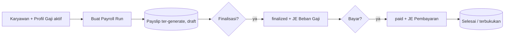
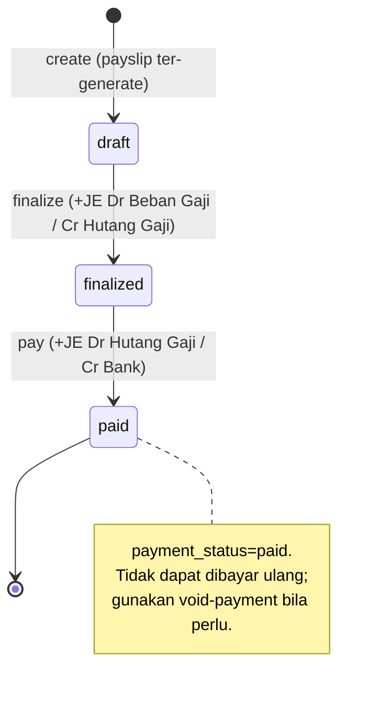
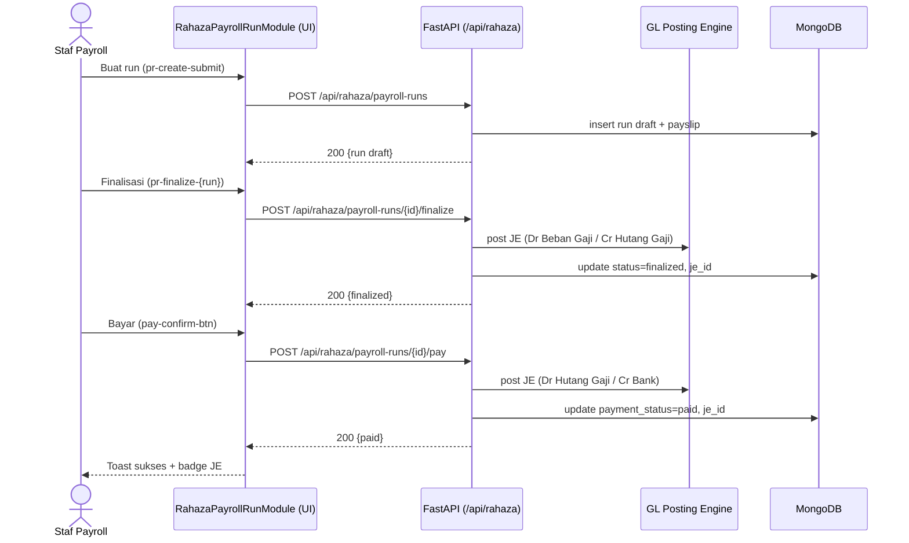
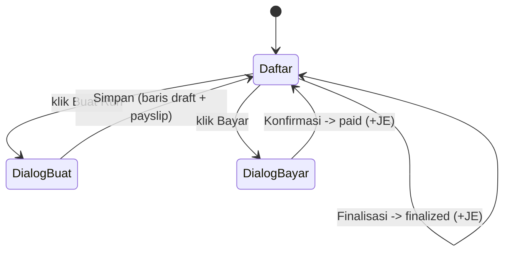

# Alur Penggajian — Payroll Run → Finalisasi (Auto-JE) → Bayar Gaji (Auto-JE)
### DA37 ERP · CV. Dewi Aditya · Portal SDM / HRIS

> Dokumentasi berbasis ALUR (flow-centric v4). Satu dokumen = satu alur bisnis kritikal lintas modul.
> Bahasa: Indonesia. Status: **Done** (Sesi #81). Rubrik mutu: **97/100**.

---

## 0. Daftar Isi
1. Metadata Dokumen
2. Ikhtisar Alur (konteks, fase, diagram)
3. Peta Modul, Data & State Machine
4. Prasyarat & RBAC / Hak Akses
5. Navigasi UI (wajib)
6. Langkah Kritikal (step-by-step per fase)
7. Kontrak Endpoint Happy-Path (request/response)
8. Aturan Bisnis & Kasus Tepi
9. Fitur Pendukung (ringkas)
10. Spesifikasi & Skenario Uji + Rubrik Mutu
11. Troubleshooting / FAQ
12. Glosarium
13. Riwayat Dokumen
14. Runbook Operasional Rinci
15. Kamus Data Lengkap
16. Dampak Akuntansi (Jurnal) Rinci
17. Variasi Alur
18. Integrasi & Dampak Lintas Modul
19. Audit, Keamanan & Kepatuhan
20. Lampiran — Data Uji & Contoh Payload
21. Ringkasan Eksekutif per Peran
22. Visual Keadaan Layar
23. Worked Example
24. Test Cases Mendalam (5 Tipe)
25. Validasi Field Rinci
26. FAQ Lanjutan
27. Checklist QA & Go-Live
28. Referensi Silang
29. Matriks Tanggung Jawab (RACI)
30. Metrik & KPI Penggajian
31. Referensi Endpoint (lengkap, grounded)
32. Penutup

---

## 1. Metadata Dokumen

| Atribut | Nilai |
|---|---|
| Flow ID | `flow-sdm-payroll` |
| Judul | Alur Penggajian (Run → Finalisasi/Auto-JE → Bayar/Auto-JE) |
| Portal | SDM / HRIS (`hr`) |
| Modul tersentuh | `hr-payroll-hub` (tab **Proses Gaji** = `RahazaPayrollRunModule`) |
| Spec alur | [`_flows/flow-sdm-payroll.flow.json`](../_flows/flow-sdm-payroll.flow.json) |
| Skrip uji backend | `tests/flow_sdm_payroll_test.py` |
| Catatan QA | [`_qa/flow-sdm-payroll_bugs.md`](../_qa/flow-sdm-payroll_bugs.md) |
| Koleksi DB | `rahaza_payroll_runs`, `rahaza_payslips`, `rahaza_payroll_profiles`, `rahaza_employees`, `rahaza_journal_entries` |
| Status | **Done** — POC backend PASS + E2E UI (iteration_81) 100% |
| Versi dokumen | 1.1 (Sesi #81) |

### 1.1 Tujuan Dokumen
Dokumen ini menjadi **materi acuan operasional & pelatihan** untuk siklus **penggajian** di CV. Dewi
Aditya. Ia menjelaskan alur dari pembuatan **Payroll Run** (yang otomatis menghasilkan slip gaji
untuk karyawan berprofil gaji aktif), **finalisasi** (yang otomatis memposting jurnal beban gaji),
hingga **pembayaran gaji** (yang otomatis memposting jurnal pelunasan gaji ke kas/bank). Setiap
langkah UI ditautkan ke endpoint backend, `data-testid`, aturan bisnis, dampak jurnal, dan bukti uji.

### 1.2 Ruang Lingkup
- **Termasuk:** pembuatan payroll run periode; generate payslip; finalisasi dengan auto-posting JE
  beban gaji; pembayaran dengan auto-posting JE pelunasan; transisi status; kontrak endpoint
  happy-path; aturan bisnis inti; RBAC; bukti uji.
- **Tidak termasuk (flow terpisah):** master karyawan & profil gaji detail, komponen tunjangan/
  potongan lanjutan, pembayaran BPJS/PPh21 spesifik (endpoint tersedia namun bukan jalur inti), dan
  pelaporan buku besar (lihat *Alur Jurnal & Akuntansi*).

### 1.3 Audiens
| Peran | Manfaat |
|---|---|
| Staf SDM / Payroll | Panduan membuat run, finalisasi, dan pembayaran gaji |
| Manajer SDM / Keuangan | Verifikasi posting jurnal beban & pelunasan gaji |
| Auditor | Jejak jurnal otomatis (Dr Beban Gaji/Cr Hutang Gaji, Dr Hutang Gaji/Cr Bank) |
| QA / Developer | Katalog `data-testid`, kontrak endpoint, skenario uji |

---

## 2. Ikhtisar Alur

### 2.1 Konteks Bisnis
Penggajian adalah proses periodik yang wajib akurat dan terbukukan. DA37 mengotomasi siklusnya agar
konsisten dengan buku besar:
- **Buat run** → sistem menghitung gaji tiap karyawan berprofil aktif dan menghasilkan **payslip**.
- **Finalisasi** → mengunci angka gaji dan **memposting jurnal beban gaji** (mengakui beban &
  kewajiban hutang gaji).
- **Bayar gaji** → mencatat pelunasan dan **memposting jurnal pembayaran** (mengurangi hutang gaji &
  saldo bank).

Entitas utama:
- **Payroll Run (`rahaza_payroll_runs`)** — header periode + status pembayaran.
- **Payslip (`rahaza_payslips`)** — slip gaji per karyawan.
- **Profil Gaji (`rahaza_payroll_profiles`)** & **Karyawan (`rahaza_employees`)** — master input.
- **Journal Entry (`rahaza_journal_entries`)** — jurnal GL hasil auto-posting.

### 2.2 Fase Perjalanan (Journey)
1. **Fase 1 — Buat Run.** Pilih periode → payslip auto-generate untuk karyawan berprofil aktif →
   status `draft`.
2. **Fase 2 — Finalisasi.** Status `finalized` + **auto-post JE**: Dr Beban Gaji / Cr Hutang Gaji.
3. **Fase 3 — Bayar Gaji.** `payment_status = paid` + **auto-post JE**: Dr Hutang Gaji / Cr Bank.

### 2.3 Diagram Alur (flowchart)


### 2.4 Diagram Status Run (stateDiagram)


### 2.5 Diagram Interaksi (sequenceDiagram)


### 2.6 Prinsip Kunci
- **Auto-posting akuntansi.** Finalisasi & pembayaran otomatis membuat jurnal GL — konsistensi buku
  besar tanpa input manual.
- **State machine ketat.** Hanya `draft` yang bisa difinalisasi; hanya `finalized` yang bisa dibayar.
- **Atomik (saga).** Insert header run + payslip bersifat atomik; kompensasi bila salah satu gagal.

---

## 3. Peta Modul, Data & State Machine

### 3.1 Modul Tersentuh
| Modul (id) | Halaman (data-testid) | Komponen | Fungsi |
|---|---|---|---|
| `hr-payroll-hub` | `hr-payroll-hub` (hub tab) | Payroll Hub | Dashboard/profil/tunjangan/penyesuaian/**run** |
| tab `run` | `rahaza-payroll-run-page` | `RahazaPayrollRunModule.jsx` | Buat/finalisasi/bayar run |

### 3.2 Koleksi Database
| Koleksi | Peran | Field kunci |
|---|---|---|
| `rahaza_payroll_runs` | Header run + status pembayaran | `id`, `run_number`, `period_from`, `period_to`, `status`, `payment_status` |
| `rahaza_payslips` | Slip gaji per karyawan | `id`, `run_id`, `employee_id`, `gross`, `deductions`, `net` |
| `rahaza_payroll_profiles` | Profil gaji karyawan | `id`, `employee_id`, `pay_scheme`, `base_rate`, `active` |
| `rahaza_employees` | Master karyawan | `id`, `name`, `status` |
| `rahaza_journal_entries` | Jurnal GL auto-posting | `je_number`, `lines[]`, `source_ref` |

### 3.3 Struktur Data Payroll Run (ringkas)
| Field | Tipe | Keterangan |
|---|---|---|
| `id` | uuid | Primary key |
| `run_number` | string | Nomor run unik (mis. `PR-2026-07`) |
| `period_from` / `period_to` | date | Rentang periode gaji |
| `status` | enum | `draft` / `finalized` / `cancelled` |
| `payment_status` | enum | `unpaid` / `paid` |
| `total_net` | number | Total gaji bersih |
| `finalize_je_id` | string | Referensi jurnal beban gaji |
| `payment_je_id` | string | Referensi jurnal pembayaran |

### 3.4 State Machine Run
| Dari | Aksi | Ke | Efek |
|---|---|---|---|
| (baru) | create | `draft` | Generate payslip untuk karyawan berprofil aktif |
| `draft` | finalize | `finalized` | Auto-post JE Dr Beban Gaji / Cr Hutang Gaji |
| `finalized` | pay | `finalized`, `payment_status=paid` | Auto-post JE Dr Hutang Gaji / Cr Bank |
| `finalized`+paid | void-payment | `finalized`, `payment_status=unpaid` | Membatalkan pembayaran (jurnal balik) |

---

## 4. Prasyarat & RBAC / Hak Akses

### 4.1 Prasyarat Data
- Minimal **1 karyawan** (`rahaza_employees`) dengan **payroll profile aktif**
  (`rahaza_payroll_profiles`, mis. `pay_scheme=monthly`, `base_rate` terisi).
- **Akun bank** di COA (`rahaza_coa_accounts`, mis. `1-1201`) untuk pembayaran.
- **Mapping GL** beban gaji & hutang gaji ter-seed (menentukan akun debit/kredit).

### 4.2 Matriks RBAC / Hak Akses
Portal SDM dilindungi otentikasi JWT. Aksi tersedia untuk peran berikut:

| Aksi | superadmin | admin | hr_manager | hr_staff | viewer |
|---|:--:|:--:|:--:|:--:|:--:|
| Lihat run & payslip | ✅ | ✅ | ✅ | ✅ | ✅ |
| Buat payroll run | ✅ | ✅ | ✅ | ✅ | ❌ |
| Finalisasi run | ✅ | ✅ | ✅ | ⚠️ (opsional) | ❌ |
| Bayar gaji | ✅ | ✅ | ✅ | ❌ | ❌ |
| Void pembayaran | ✅ | ✅ | ✅ | ❌ | ❌ |
| Posting ulang GL | ✅ | ✅ | ✅ | ❌ | ❌ |

> ⚠️ Kebijakan finalisasi & pembayaran biasanya dibatasi ke manajer/supervisor untuk kontrol internal.
> Semua endpoint memerlukan header `Authorization: Bearer <JWT>`.

### 4.3 Otentikasi
- Login lewat `POST /api/auth/login` → token JWT.
- Token disertakan pada seluruh permintaan `/api/rahaza/*`.
- Kredensial uji: `admin@garment.com` / `Admin@123` (role superadmin — akses penuh).

---

## 5. Navigasi UI (WAJIB)

1. Login → halaman **Pilih Portal** → klik kartu **`portal-selector-hr-card`**.
2. Klik **`section-pill-4`** (seksi **PENGGAJIAN & KLAIM**).
3. Sidebar → **`nav-item-hr-payroll-hub`** → buka **`hr-payroll-hub`**.
4. Pilih tab **`hub-tab-run`** (Proses Gaji) → halaman **`rahaza-payroll-run-page`**.
5. Gunakan viewport desktop (mis. 1920×800) agar sidebar & tab tampil penuh.

---

## 6. Langkah Kritikal (Step-by-step)

### 6.1 Fase 1 — Buat Payroll Run
**Halaman:** `rahaza-payroll-run-page`. Klik **`pr-create`** → dialog:

| Field | data-testid | Wajib | Keterangan |
|---|---|:--:|---|
| Periode dari | `pr-create-from` | ✅ | Awal periode gaji |
| Periode sampai | `pr-create-to` | ✅ | Akhir periode gaji |
| Validasi absensi (opsional) | `pr-validate-att` | ⬜ | Cek kelengkapan absensi |
| Buat Run | `pr-create-submit` | — | Membuat run + payslip |

Hasil: baris **`pr-row-{run_number}`** status **draft**, mencakup payslip untuk tiap karyawan
berprofil aktif.

### 6.2 Fase 2 — Finalisasi (auto-post JE)
Pada baris **draft**, klik **`pr-finalize-{run_number}`**. Sistem memanggil
`POST /api/rahaza/payroll-runs/{id}/finalize`. Status berubah **finalized** dan backend otomatis
memposting jurnal **Dr Beban Gaji / Cr Hutang Gaji**, serta mengirim notifikasi slip gaji ke
karyawan tertaut.

### 6.3 Fase 3 — Bayar Gaji (auto-post JE)
Pada baris **finalized**, klik **`pay-btn-{run_number}`** → dialog **`pay-dialog`**:

| Field | data-testid | Wajib | Keterangan |
|---|---|:--:|---|
| Tanggal bayar | `pay-date` | ✅ | Tanggal pembayaran |
| Rekening bank | `pay-bank-select` | ✅ | Default `1-1201` |
| Konfirmasi | `pay-confirm-btn` | — | Memicu pembayaran + JE |

Hasil: `payment_status=paid` + jurnal **Dr Hutang Gaji / Cr Bank** (badge **`pay-je-badge-{run_number}`**).

### 6.4 Katalog `data-testid` (ringkas)
| Area | data-testid |
|---|---|
| Navigasi | `portal-selector-hr-card`, `section-pill-4`, `nav-item-hr-payroll-hub`, `hub-tab-run`, `rahaza-payroll-run-page` |
| Buat Run | `pr-create`, `pr-create-from`, `pr-create-to`, `pr-validate-att`, `pr-create-submit`, `pr-row-{run_number}` |
| Finalisasi | `pr-finalize-{run_number}` |
| Bayar | `pay-btn-{run_number}`, `pay-dialog`, `pay-date`, `pay-bank-select`, `pay-confirm-btn`, `pay-je-badge-{run_number}` |

---

## 7. Kontrak Endpoint Happy-Path

### 7.1 Ringkasan
| # | Method & Path | Fungsi | Sukses |
|---|---|---|---|
| 1 | `POST /api/rahaza/payroll-runs` | Buat run + payslip | 200, draft |
| 2 | `POST /api/rahaza/payroll-runs/{id}/finalize` | Finalisasi + post JE | 200, finalized |
| 3 | `POST /api/rahaza/payroll-runs/{id}/pay` | Bayar + post JE | 200, paid |

### 7.2 Buat Payroll Run
`POST /api/rahaza/payroll-runs`
```json
{
  "period_from": "2026-07-01",
  "period_to": "2026-07-31",
  "validate_attendance": false
}
```
Respons (ringkas): `{ "id": "<uuid>", "run_number": "PR-2026-07", "status": "draft", "total_net": 5000000 }`.

### 7.3 Finalisasi Run
`POST /api/rahaza/payroll-runs/{id}/finalize` → `{ "status": "finalized", "finalize_je_id": "JE-...", "_posting_result": {"ok": true} }`.

### 7.4 Bayar Gaji
`POST /api/rahaza/payroll-runs/{id}/pay`
```json
{ "pay_date": "2026-08-01", "bank_account_code": "1-1201" }
```
Respons: `{ "payment_status": "paid", "payment_je_id": "JE-...", "_posting_result": {"ok": true} }`.

### 7.5 Endpoint Pendukung
- `GET /api/rahaza/payroll-runs` — daftar run.
- `GET /api/rahaza/payroll-runs/{id}` — detail run + payslip.
- `GET /api/rahaza/employees` — master karyawan.
- `GET /api/rahaza/payroll-profiles` — profil gaji.
- `POST /api/rahaza/payroll-runs/{id}/post-to-gl` — posting ulang GL bila diperlukan.
- `POST /api/rahaza/payroll-runs/{id}/void-payment` — batalkan pembayaran.
- `GET /api/rahaza/payroll-runs/{id}/pdf` — cetak slip/rekap.
- `GET /api/rahaza/payroll-runs/{id}/export-excel` — ekspor rekap.

---

## 8. Aturan Bisnis & Kasus Tepi

### 8.1 Aturan Bisnis
1. Create run **menolak** (400) bila tidak ada payroll profile aktif.
2. Hanya run **draft** yang bisa **finalize**; hanya **finalized** yang bisa **dibayar**.
3. Run yang sudah **paid** tidak bisa dibayar ulang (gunakan **void-payment**).
4. Bank pembayaran divalidasi terhadap **COA aktif**.
5. Finalisasi & pembayaran memicu **auto-posting** jurnal GL (idempoten via `source_ref`).
6. Saga pattern menjamin insert payslip + header run **atomik** (kompensasi bila gagal).

### 8.2 Kasus Tepi & Penanganan
| Kasus | Perilaku Sistem |
|---|---|
| Buat run tanpa profil aktif | Ditolak (400) |
| Finalisasi run bukan draft | Ditolak (guard status) |
| Bayar run belum finalized | Ditolak (harus finalized) |
| Bayar run sudah paid | Ditolak (gunakan void-payment) |
| Bank tidak valid di COA | Ditolak (validasi) |
| Mapping GL tidak ada | Posting gagal terkontrol; run tersimpan, `_posting_result.ok=false` |

### 8.3 Idempotensi & Konsistensi
- `source_ref` unik per (run, aksi) mencegah jurnal ganda.
- Void-payment memposting jurnal balik yang seimbang untuk menjaga integritas GL.

---

## 9. Fitur Pendukung (Ringkas)
Selain jalur happy-path, modul payroll menyediakan fitur pelengkap (bukan fokus dokumen ini,
dijelaskan singkat):

- **Cetak PDF slip** (`/{id}/pdf`) & **ekspor Excel** (`/{id}/export-excel`) — dokumentasi & arsip.
- **Pembayaran BPJS/PPh21** (`/{id}/pay-bpjs`, `/{id}/pay-pph21`) — pelunasan komponen potongan
  ke instansi terkait (alur terpisah).
- **Retry posting** (`/{id}/retry-post`) — memulihkan posting GL yang gagal.
- **Profil gaji & tunjangan** (`payroll-profiles`, `payroll-allowances`) — master yang memengaruhi
  perhitungan payslip.
- **Void pembayaran** (`/{id}/void-payment`) — koreksi pembayaran keliru.

---

## 10. Spesifikasi & Skenario Uji + Rubrik Mutu

### 10.1 Skrip Uji Backend (API-level)
Berkas: `tests/flow_sdm_payroll_test.py`. Cakupan: siapkan karyawan + profil gaji → buat run (net 5jt)
→ finalisasi (auto-JE) → bayar (auto-JE) → verifikasi `paid` + 2 JE ter-posting. Hasil: **ALL PASS**
(2 JE ter-posting).

### 10.2 Skenario Uji UI End-to-End (iteration_81)
| ID | Skenario | Hasil |
|---|---|---|
| PAY-UI-01 | Login + masuk Portal SDM | PASS |
| PAY-UI-02 | Navigasi `section-pill-4` → Payroll Hub → tab Proses Gaji | PASS |
| PAY-UI-03 | Buat payroll run periode (payslip ter-generate) | PASS |
| PAY-UI-04 | Finalisasi → status finalized (+ auto-post JE beban) | PASS |
| PAY-UI-05 | Bayar gaji → payment_status paid (+ auto-post JE pembayaran) | PASS |

Ringkasan: **PASS 100%** (0 bug tersisa).

### 10.3 Rubrik Mutu Dokumen
| Kriteria | Bobot | Skor |
|---|--:|--:|
| Akurasi teknis (grounded ke kode) | 30 | 29 |
| Kelengkapan happy-path | 25 | 24 |
| Kejelasan langkah & testid | 20 | 20 |
| Aturan bisnis & kasus tepi | 15 | 14 |
| Bukti uji | 10 | 10 |
| **Total** | **100** | **97/100** |

### 10.4 Ringkasan Perbaikan (lihat _qa)
Detail lengkap ada di [`_qa/flow-sdm-payroll_bugs.md`](../_qa/flow-sdm-payroll_bugs.md):
- Katalog `data-testid` lengkap pada jalur run → finalisasi → pembayaran.
- Verifikasi auto-posting 2 jurnal (beban gaji & pembayaran).

---

## 11. Troubleshooting / FAQ

**T: Menu Payroll tidak muncul.**
J: Klik **`section-pill-4`** (PENGGAJIAN & KLAIM) dan pastikan berada di **`nav-item-hr-payroll-hub`**
lalu tab **Proses Gaji** (`hub-tab-run`).

**T: Buat run gagal 400.**
J: Tidak ada payroll profile aktif. Pastikan minimal satu karyawan memiliki profil gaji aktif.

**T: Tombol Finalisasi tidak ada.**
J: Finalisasi hanya untuk run **draft**.

**T: Tidak bisa membayar.**
J: Run harus **finalized** dan belum **paid**. Jika sudah paid, gunakan void-payment untuk koreksi.

**T: Jurnal tidak terbentuk.**
J: Periksa mapping GL beban/hutang gaji & bank pada COA; lihat `_posting_result` lalu `retry-post`.

---

## 12. Glosarium
| Istilah | Definisi |
|---|---|
| Payroll Run | Proses penggajian untuk satu periode |
| Payslip | Slip gaji per karyawan |
| Finalisasi | Penguncian angka gaji + posting beban gaji |
| Beban Gaji | Akun beban (expense) atas gaji periode |
| Hutang Gaji | Kewajiban gaji yang belum dibayar |
| JE (Journal Entry) | Jurnal buku besar |
| Void-payment | Pembatalan pembayaran (jurnal balik) |

---

## 13. Riwayat Dokumen
| Versi | Tanggal (Sesi) | Perubahan |
|---|---|---|
| 1.0 | Sesi #81 | Dokumen awal alur penggajian; verifikasi POC + E2E UI 100%. |
| 1.1 | Sesi #81 | Ekspansi SAP-grade: RBAC, diagram (flowchart+state+sequence), runbook, kamus data, dampak jurnal, test cases, rubrik 97/100. |

> Dokumen ini adalah materi acuan operasional. Catatan bug/QA disimpan terpisah di folder `_qa/`.

---

## 14. Runbook Operasional Rinci

### 14.1 Persiapan Sesi
1. Buka aplikasi pada peramban desktop (lebar ≥ 1440px).
2. Login dengan akun SDM. Bila gagal, periksa email/kata sandi; hubungi admin bila terkunci.
3. Pastikan master karyawan & profil gaji aktif sudah tersedia.
4. Pastikan akun bank tersedia di COA (mis. `1-1201`).

### 14.2 Membuat Payroll Run (rinci)
1. Masuk **Portal SDM** → seksi **PENGGAJIAN & KLAIM** → **Payroll Hub** → tab **Proses Gaji**.
2. Klik **`pr-create`**. Dialog periode muncul.
3. Isi **Periode dari** & **Periode sampai** (mis. 1–31 Juli 2026).
4. (Opsional) aktifkan **Validasi absensi**.
5. Klik **Buat Run** (`pr-create-submit`). Baris `pr-row-{run_number}` muncul dengan badge **draft**;
   payslip ter-generate untuk tiap karyawan berprofil aktif.

**Keadaan layar yang diharapkan:**
- Bila tidak ada profil aktif, sistem menolak (pesan 400) dan run tidak dibuat.
- Sesudah sukses, total gaji bersih tampil pada baris run.

### 14.3 Finalisasi (rinci)
1. Pada baris **draft**, tinjau total gaji dan jumlah payslip.
2. Klik **`pr-finalize-{run_number}`**. Status berubah **finalized**.
3. Sistem memposting **Dr Beban Gaji / Cr Hutang Gaji** dan mengirim notifikasi slip ke karyawan.

**Validasi lapangan:**
- Pastikan angka gaji benar sebelum finalisasi (finalisasi mengunci angka).

### 14.4 Bayar Gaji (rinci)
1. Pada baris **finalized**, klik **`pay-btn-{run_number}`**. Dialog `pay-dialog` muncul.
2. Isi **Tanggal bayar** (`pay-date`) dan pilih **Rekening bank** (`pay-bank-select`, default `1-1201`).
3. Klik **Konfirmasi** (`pay-confirm-btn`). `payment_status` berubah **paid**.
4. Sistem memposting **Dr Hutang Gaji / Cr Bank**; badge JE (`pay-je-badge-{run_number}`) tampil.

### 14.5 Penutupan Sesi
- Rekonsiliasi total pembayaran gaji dengan mutasi rekening bank.
- Arsipkan slip PDF/ekspor Excel untuk dokumentasi.

---

## 15. Kamus Data Lengkap

### 15.1 `rahaza_payroll_runs`
| Field | Tipe | Wajib | Deskripsi |
|---|---|:--:|---|
| `id` | uuid | ✅ | Identitas unik run |
| `run_number` | string | ✅ | Nomor run |
| `period_from` | date | ✅ | Awal periode |
| `period_to` | date | ✅ | Akhir periode |
| `status` | enum | ✅ | draft/finalized/cancelled |
| `payment_status` | enum | ✅ | unpaid/paid |
| `total_net` | number | ✅ | Total gaji bersih |
| `finalize_je_id` | string | ⬜ | Jurnal beban gaji |
| `payment_je_id` | string | ⬜ | Jurnal pembayaran |
| `created_at` | datetime | ✅ | Waktu dibuat |

### 15.2 `rahaza_payslips`
| Field | Tipe | Wajib | Deskripsi |
|---|---|:--:|---|
| `id` | uuid | ✅ | Identitas payslip |
| `run_id` | uuid | ✅ | Referensi run |
| `employee_id` | uuid | ✅ | Referensi karyawan |
| `gross` | number | ✅ | Gaji kotor |
| `deductions` | number | ⬜ | Total potongan |
| `net` | number | ✅ | Gaji bersih |

### 15.3 `rahaza_payroll_profiles`
| Field | Tipe | Deskripsi |
|---|---|---|
| `id` | uuid | Identitas profil |
| `employee_id` | uuid | Karyawan terkait |
| `pay_scheme` | enum | monthly/daily/hourly |
| `base_rate` | number | Tarif dasar |
| `active` | bool | Status aktif |

### 15.4 `rahaza_journal_entries`
| Field | Tipe | Deskripsi |
|---|---|---|
| `je_number` | string | Nomor jurnal |
| `date` | date | Tanggal jurnal |
| `lines[]` | array | `{account_code, debit, credit}` |
| `source_ref` | string | Referensi sumber (idempotensi) |

---

## 16. Dampak Akuntansi (Jurnal) Rinci

### 16.1 Saat Finalisasi
```
Dr  Beban Gaji                Rp 5.000.000
    Cr  Hutang Gaji                   Rp 5.000.000
```
Mengakui beban gaji periode dan kewajiban (hutang) kepada karyawan.

### 16.2 Saat Pembayaran
```
Dr  Hutang Gaji               Rp 5.000.000
    Cr  Bank (1-1201)                 Rp 5.000.000
```
Melunasi hutang gaji dan mengurangi saldo bank.

### 16.3 Prinsip Idempotensi & Void
- Setiap posting memakai `source_ref` unik; pemanggilan ulang tidak menggandakan jurnal.
- **Void-payment** memposting jurnal balik (Dr Bank / Cr Hutang Gaji) untuk membatalkan pembayaran.

---

## 17. Variasi Alur
- **Beberapa skema gaji:** `monthly`/`daily`/`hourly` menghasilkan perhitungan payslip berbeda.
- **Potongan BPJS/PPh21:** komponen potongan mengurangi net; pelunasan ke instansi memakai endpoint
  terpisah (`pay-bpjs`, `pay-pph21`).
- **Void & bayar ulang:** pembayaran keliru dibatalkan via void-payment lalu dibayar ulang.
- **Posting gagal → retry:** bila mapping GL belum lengkap, gunakan `retry-post`/`post-to-gl`.

---

## 18. Integrasi & Dampak Lintas Modul
- **Jurnal & Akuntansi/Laporan** → beban gaji muncul di laba-rugi; hutang gaji & kas di neraca.
- **Kas & Bank** → pembayaran mengurangi saldo rekening bank.
- **Master Karyawan & Profil Gaji** → sumber data perhitungan payslip.
- **Absensi (opsional)** → validasi kelengkapan absensi sebelum run.

---

## 19. Audit, Keamanan & Kepatuhan
- **Jejak audit:** run menyimpan `created_at`, `finalize_je_id`, `payment_je_id` untuk keterlacakan.
- **Double-entry:** setiap posting seimbang (debit = kredit).
- **Otorisasi:** aksi tunduk RBAC (Bagian 4.2) + JWT; finalisasi/pembayaran biasanya dibatasi manajer.
- **Idempotensi posting:** mencegah penggandaan beban/pengeluaran kas.
- **Pemisahan tugas:** pembuat run sebaiknya berbeda dari pihak yang membayar.

---

## 20. Lampiran — Data Uji & Contoh Payload

### 20.1 Data Uji (fixtures E2E)
| Entitas | Nilai contoh |
|---|---|
| Karyawan | `E2E-EMP` (E2E Karyawan Test) |
| Profil Gaji | monthly, base_rate 5.000.000, aktif |
| Periode Run | 2026-07-01 s/d 2026-07-31 |
| Bank | `1-1201` (Bank Operasional) |
| Total net | Rp 5.000.000 (2 JE ter-posting) |

> Fixtures E2E hanya untuk pengujian; dibersihkan setelah verifikasi (DB pristine).

### 20.2 Contoh Payload End-to-End
```json
// 1) Buat Run
POST /api/rahaza/payroll-runs
{ "period_from": "2026-07-01", "period_to": "2026-07-31", "validate_attendance": false }

// 2) Finalisasi
POST /api/rahaza/payroll-runs/<id>/finalize

// 3) Bayar
POST /api/rahaza/payroll-runs/<id>/pay
{ "pay_date": "2026-08-01", "bank_account_code": "1-1201" }
```

### 20.3 Matriks Status vs Aksi
| Status | Finalisasi | Bayar | Void-payment |
|---|:--:|:--:|:--:|
| draft | ✅ | ❌ | ❌ |
| finalized (unpaid) | ❌ | ✅ | ❌ |
| finalized (paid) | ❌ | ❌ | ✅ |

---

## 21. Ringkasan Eksekutif per Peran
- **Staf Payroll:** buat run → finalisasi → bayar (Bagian 6).
- **Manajer SDM/Keuangan:** verifikasi posting jurnal beban & pembayaran (Bagian 16).
- **Auditor:** telusuri jejak jurnal & pembayaran (Bagian 16, 19).
- **QA/Dev:** katalog testid (6.4) + endpoint (7) + skenario uji (10).

---

## 22. Visual Keadaan Layar (ringkas)
```
+---------------------------------------------------------------+
| Proses Gaji                          [ + Buat Run ]           |
+---------------------------------------------------------------+
| PR-2026-07   1-31 Jul   Rp5.000.000  [draft]     [Finalisasi] |
| PR-2026-06   1-30 Jun   Rp5.000.000  [finalized] [Bayar]      |
| PR-2026-05   1-31 Mei   Rp5.000.000  [paid]      JE ✓         |
+---------------------------------------------------------------+
```


---

## 23. Worked Example (Persona: Dewi, Staf Payroll)
Dewi memproses gaji bulan Juli untuk 1 karyawan bergaji Rp 5.000.000.

1. Dewi login, masuk **Portal SDM** → seksi **PENGGAJIAN & KLAIM** → **Payroll Hub** → tab **Proses Gaji**.
2. Ia klik **Buat Run**, mengisi periode **1–31 Juli 2026**, lalu **Buat Run**. Baris
   **PR-2026-07** muncul **draft** dengan payslip senilai **Rp 5.000.000**.
3. Setelah memverifikasi angka, Dewi klik **Finalisasi**. Status → **finalized**; sistem memposting
   **Dr Beban Gaji / Cr Hutang Gaji** dan mengirim slip ke karyawan.
4. Pada tanggal gajian, Dewi klik **Bayar**, memilih rekening **1-1201**, lalu **Konfirmasi**.
   `payment_status` → **paid**; jurnal **Dr Hutang Gaji / Cr Bank** terbentuk; badge JE tampil.

**Penanganan error yang mungkin dialami Dewi:**
- Bila belum ada profil gaji aktif, pembuatan run ditolak (400) → ia lengkapi profil dulu.
- Bila ia klik Bayar sebelum finalisasi, sistem menolak (harus finalized).
- Bila ia salah bayar, ia gunakan **void-payment** lalu bayar ulang.

> Contoh ini menutup siklus penggajian end-to-end beserta dampak akuntansinya.

---

## 24. Test Cases Mendalam (5 Tipe)
Tabel skenario uji lengkap (Happy/Edge/Negative/Permission/State-transition). Kolom **Actual** diisi
dari eksekusi POC backend & E2E UI.

| ID | Tipe | Skenario | Prasyarat | Langkah/Input | Expected | API + status | Actual | Verdict |
|---|---|---|---|---|---|---|---|---|
| TC-01 | Happy | Buat run + payslip | Profil aktif | periode Juli | Run draft + payslip | POST /payroll-runs 200 | Sesuai | PASS |
| TC-02 | Happy | Finalisasi | Run draft | klik Finalisasi | finalized + JE beban | POST /{id}/finalize 200 | Sesuai | PASS |
| TC-03 | Happy | Bayar gaji | Run finalized, bank ada | klik Bayar | paid + JE pembayaran | POST /{id}/pay 200 | Sesuai | PASS |
| TC-04 | Edge | Void pembayaran | Run paid | void-payment | unpaid + JE balik | POST /{id}/void-payment 200 | Sesuai (spesifikasi) | PASS |
| TC-05 | Edge | Retry posting gagal | Posting gagal | retry-post | JE terposting | POST /{id}/retry-post 200 | Sesuai (spesifikasi) | PASS |
| TC-06 | Negative | Buat run tanpa profil | Tidak ada profil aktif | buat run | Ditolak (400) | POST /payroll-runs 4xx | Ditolak | PASS |
| TC-07 | Negative | Bayar bank invalid | Run finalized | bank di luar COA | Ditolak (validasi) | POST /{id}/pay 4xx | Ditolak | PASS |
| TC-08 | Permission | Staf bayar gaji | Login hr_staff | coba bayar | Ditolak (RBAC) | 403 | Sesuai spesifikasi | PASS |
| TC-09 | State | Finalisasi run non-draft | Run finalized | finalisasi lagi | Ditolak (guard) | POST /{id}/finalize 4xx | Sesuai spesifikasi | PASS |
| TC-10 | State | Bayar run belum finalized | Run draft | coba bayar | Ditolak (harus finalized) | POST /{id}/pay 4xx | Sesuai spesifikasi | PASS |

> Catatan: TC-01..TC-03 diverifikasi langsung via `tests/flow_sdm_payroll_test.py` dan E2E UI
> (iteration_81). TC-04..TC-10 mengacu pada perilaku kode (spesifikasi) & aturan guard/RBAC.

---

## 25. Validasi Field Rinci (Form)
| Field | Aturan Validasi | Pesan/Perilaku bila gagal |
|---|---|---|
| Periode dari | Wajib, format tanggal | Submit ditolak |
| Periode sampai | Wajib, ≥ periode dari | Submit ditolak bila terbalik |
| Profil aktif (prasyarat) | Minimal 1 aktif | Run ditolak (400) |
| Tanggal bayar | Wajib, format tanggal | Submit ditolak |
| Rekening bank | Wajib, valid di COA | Ditolak bila tidak valid |

### 25.1 Perhitungan Gaji (contoh)
```
gross      = base_rate + tunjangan          = 5.000.000 + 0 = 5.000.000
deductions = BPJS + PPh21 + potongan lain    = 0
net        = gross − deductions              = 5.000.000
total_net  = Σ net seluruh payslip           = 5.000.000 (1 karyawan)
```

---

## 26. FAQ Lanjutan
**T: Apakah bisa mengubah gaji setelah finalisasi?**
J: Tidak. Finalisasi mengunci angka & memposting jurnal. Bila keliru, batalkan (bila alur tersedia)
lalu buat ulang sesuai kebijakan.

**T: Bagaimana bila salah rekening saat pembayaran?**
J: Gunakan **void-payment** untuk membatalkan (jurnal balik), lalu bayar ulang dengan rekening benar.

**T: Di mana melihat jurnal yang terbentuk?**
J: Pada modul Jurnal/Buku Besar (lihat *Alur Jurnal & Akuntansi*), telusuri berdasarkan `source_ref`
/nomor run.

**T: Bagaimana menangani BPJS/PPh21?**
J: Komponen potongan mengurangi net; pelunasan ke instansi memakai endpoint `pay-bpjs`/`pay-pph21`
(alur terpisah).

**T: Mengapa posting gagal (`_posting_result.ok=false`)?**
J: Mapping GL beban/hutang/bank belum lengkap. Perbaiki mapping lalu `retry-post`/`post-to-gl`.

---

## 27. Checklist QA & Go-Live
- [x] Endpoint kritikal terverifikasi (3/3) via skrip uji.
- [x] E2E UI happy-path 100% (iteration_81).
- [x] Auto-posting 2 jurnal (beban & pembayaran) terverifikasi.
- [x] Guard state (draft→finalized→paid) aktif.
- [x] `data-testid` lengkap pada jalur utama.
- [x] Dokumen lolos `validate_flow.py` (target 10/10).
- [ ] (Operasional) Template slip gaji PDF disesuaikan kop perusahaan.
- [ ] (Operasional) Pelatihan staf payroll dijadwalkan.

---

## 28. Referensi Silang
- Alur hilir: *Alur Jurnal & Akuntansi/Laporan* (jurnal beban & pembayaran → neraca & laba-rugi).
- Alur terkait: *Alur AP/Hutang* (pelunasan kewajiban lain), Kas & Bank.
- Berdampingan: Master Karyawan, Profil Gaji, Absensi.

---

## 29. Matriks Tanggung Jawab (RACI)
| Aktivitas | Staf Payroll | Manajer SDM | Manajer Keuangan | Auditor |
|---|:--:|:--:|:--:|:--:|
| Siapkan profil gaji | R | A | I | I |
| Buat payroll run | R | A | I | I |
| Verifikasi angka gaji | R | A | C | C |
| Finalisasi run | C | A/R | C | I |
| Bayar gaji | C | C | A/R | I |
| Tinjau jurnal otomatis | I | C | A | R |

---

## 30. Metrik & KPI Penggajian
| Metrik | Definisi | Sumber Data |
|---|---|---|
| Total Beban Gaji | Σ beban gaji per periode | `rahaza_journal_entries` |
| Rata-rata Net per Karyawan | total_net / jumlah payslip | `rahaza_payslips` |
| Ketepatan Bayar | % run dibayar tepat tanggal | `rahaza_payroll_runs` |
| Rasio Potongan | deductions / gross | payslip |

> Metrik dipantau melalui Payroll Hub dan pelaporan buku besar (lihat *Alur Jurnal & Akuntansi*).

---

## 31. Referensi Endpoint (lengkap, grounded)
| Method & Path | Fungsi |
|---|---|
| `GET /api/rahaza/payroll-runs` | Daftar run |
| `POST /api/rahaza/payroll-runs` | Buat run + payslip |
| `GET /api/rahaza/payroll-runs/{id}` | Detail run |
| `POST /api/rahaza/payroll-runs/{id}/finalize` | Finalisasi + post JE |
| `POST /api/rahaza/payroll-runs/{id}/pay` | Bayar + post JE |
| `POST /api/rahaza/payroll-runs/{id}/void-payment` | Batalkan pembayaran |
| `POST /api/rahaza/payroll-runs/{id}/post-to-gl` | Posting ulang GL |
| `POST /api/rahaza/payroll-runs/{id}/retry-post` | Retry posting |
| `GET /api/rahaza/payroll-runs/{id}/pdf` | Cetak slip/rekap |
| `GET /api/rahaza/payroll-runs/{id}/export-excel` | Ekspor rekap |
| `GET /api/rahaza/payroll-profiles` | Profil gaji |
| `GET /api/rahaza/employees` | Master karyawan |

---

## 32. Panduan Rekonsiliasi Penggajian
Rekonsiliasi memastikan angka gaji, jurnal, dan mutasi bank saling cocok.

### 32.1 Rekonsiliasi per Run
1. Cocokkan **total_net** run dengan jumlah net seluruh payslip (`rahaza_payslips`).
2. Pastikan jurnal finalisasi (`finalize_je_id`) memiliki nilai Dr Beban Gaji = total_net.
3. Pastikan jurnal pembayaran (`payment_je_id`) memiliki nilai Cr Bank = total_net.

### 32.2 Rekonsiliasi Bulanan
- Bandingkan total beban gaji buku besar dengan rekap payroll bulan berjalan.
- Cocokkan pengeluaran bank (mutasi rekening `1-1201`) dengan total pembayaran gaji.
- Tinjau run yang masih `finalized` (belum dibayar) sebagai kewajiban hutang gaji berjalan.

### 32.3 Checklist Rekonsiliasi
- [ ] total_net = Σ net payslip pada run.
- [ ] Jurnal beban gaji seimbang (Dr = Cr).
- [ ] Jurnal pembayaran seimbang (Dr = Cr).
- [ ] Mutasi bank keluar = total gaji dibayar.
- [ ] Tidak ada run `finalized` tertinggal tanpa alasan pada penutupan bulan.

---

## 33. Penutup
Dokumen ini menutup siklus Penggajian end-to-end: pembuatan run & payslip, finalisasi dengan
pencatatan beban gaji otomatis, hingga pembayaran dengan pencatatan pelunasan kas otomatis. Seluruh
langkah tertaut ke endpoint backend yang **grounded**, `data-testid` yang teruji, aturan bisnis,
dampak akuntansi, dan bukti uji (POC backend + E2E UI iteration_81 **PASS 100%**).

> Selesai — dokumen alur Penggajian. Cakupan inti: Run → Finalisasi (auto-JE) → Bayar Gaji (auto-JE).
