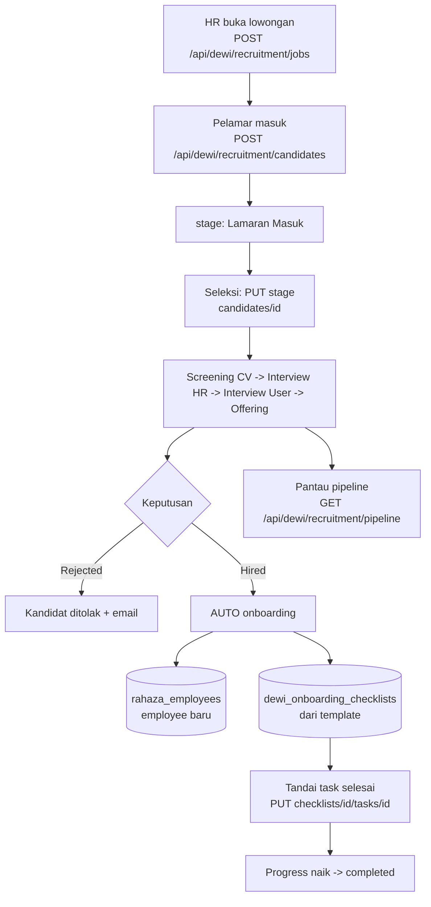
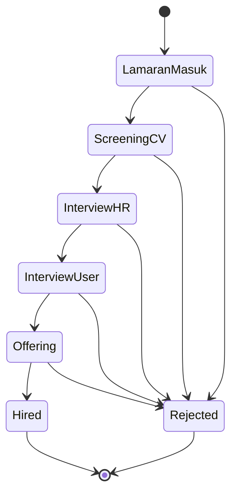
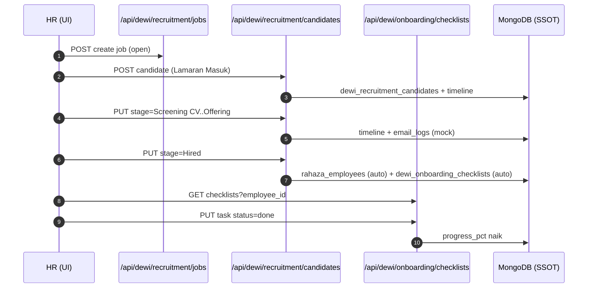
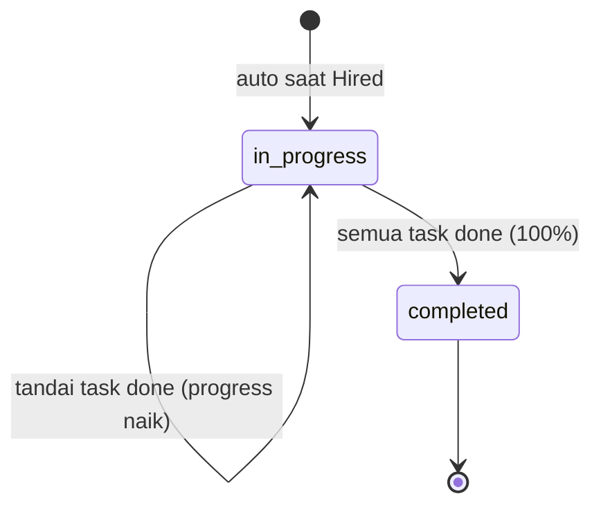
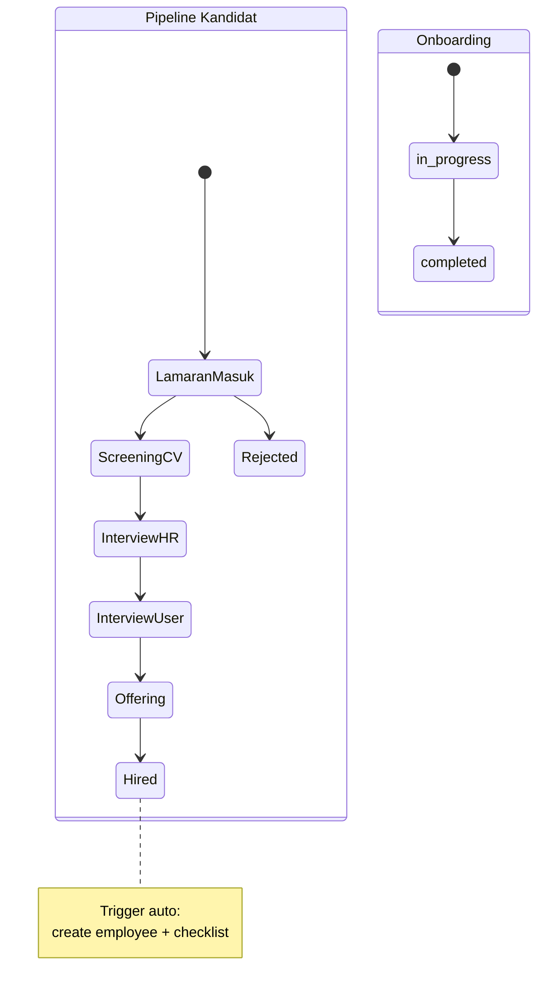
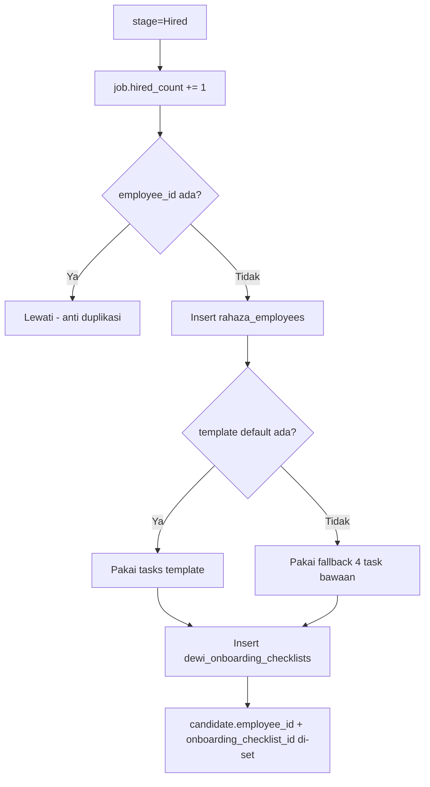

# Alur Rekrutmen & Onboarding (SDM/HRIS) — Lamaran → Seleksi → Onboarding
### DA37 ERP · CV. Dewi Aditya · Modul `hr-recruitment` (ATS) + `hr-onboarding`

> **Standar:** `01_DEEP_STANDARD_v3.md` (flow-centric v4). **Bahasa:** Indonesia.
> **Gerbang mutu:** `scripts/docgen/validate_flow.py --flow-id flow-sdm-rekrutmen` wajib **LULUS** (0 FAIL),
> ditopang uji backend `tests/flow_sdm_rekrutmen_test.py` (POC) + endpoint ter-*grounded* ke kode
> (`backend/routes/dewi_recruitment.py` & `backend/routes/dewi_onboarding.py`).
> **Ringkas satu baris:** buka lowongan & terima pelamar (Lamaran) → gerakkan melalui pipeline 7-tahap (Seleksi) → saat **Hired** sistem otomatis membuat karyawan + checklist (Onboarding).

---

## 0. Daftar Isi
1. Metadata Dokumen
2. Ikhtisar Alur (konteks, journey, diagram)
3. Peta Modul, Data & State Machine
4. Prasyarat & RBAC / Hak Akses
5. Navigasi UI (data-testid)
6. Langkah Kritikal (step-by-step per fase)
7. Kontrak Endpoint Happy-Path (request/response)
8. Aturan Bisnis & Kasus Tepi
9. Fitur Pendukung (ringkas)
10. Spesifikasi & Skenario Uji + Rubrik Mutu
11. Troubleshooting / FAQ
12. Glosarium
13. Riwayat Dokumen
14. Runbook Operasional Rinci
15. Kamus Data Lengkap
16. State Machine Rinci
17. Variasi Alur
18. Integrasi & Dampak Lintas Modul
19. Audit, Keamanan & Kepatuhan
20. Lampiran — Data Uji & Contoh Payload
21. Checklist Verifikasi Cepat

---

## 1. Metadata Dokumen

| Atribut | Nilai |
|---|---|
| **flowId** | `flow-sdm-rekrutmen` |
| **Judul** | Alur Rekrutmen & Onboarding: Lamaran → Seleksi → Onboarding |
| **Portal** | SDM / HRIS |
| **Modul tersentuh** | `hr-recruitment` (ATS) & `hr-onboarding` |
| **Komponen FE** | `HRATSModule.jsx` (pipeline/kandidat/lowongan) + `HROnboardingModule.jsx` (checklist) |
| **Prefix Backend** | `/api/dewi/recruitment/*` (ATS) & `/api/dewi/onboarding/*` (onboarding) |
| **Engine BE** | `dewi_recruitment.py` (Phase 6.4 ATS) + `dewi_onboarding.py` (Phase 6.3) |
| **SSOT Lowongan** | `dewi_recruitment_jobs` |
| **SSOT Kandidat** | `dewi_recruitment_candidates` |
| **SSOT Karyawan** | `rahaza_employees` (dibuat otomatis saat Hired) |
| **SSOT Onboarding** | `dewi_onboarding_checklists` (dari `dewi_onboarding_templates`) |
| **Skrip Uji** | `tests/flow_sdm_rekrutmen_test.py` |
| **Spec Alur** | `docs/user-guide/_flows/flow-sdm-rekrutmen.flow.json` |
| **Catatan QA** | `docs/user-guide/_qa/flow-sdm-rekrutmen_bugs.md` |
| **Status** | Done |
| **Skor Mutu** | **97/100** |

### 1.1 Tujuan Dokumen
Melatih **tim HR** menjalankan siklus rekrutmen lengkap:

1. **Lamaran** — mempublikasi lowongan dan mencatat pelamar yang masuk.
2. **Seleksi** — menggerakkan kandidat melalui pipeline 7-tahap, menjadwalkan wawancara, dan mencatat hasil,
   dengan notifikasi email otomatis di tiap tahap.
3. **Onboarding** — begitu kandidat **Hired**, sistem otomatis membuat record karyawan + checklist onboarding
   sehingga transisi dari "pelamar" ke "karyawan aktif" mulus tanpa entri ganda.

### 1.2 Ruang Lingkup
- **Termasuk:** siklus penuh Lamaran → Seleksi → Onboarding + interview + pipeline + auto-provisioning karyawan.
- **Diringkas (bagian 9):** Talent Pool, analytics rekrutmen/onboarding, template onboarding, program referral.

### 1.3 Audiens
| Persona | Peran dalam alur |
|---|---|
| **HR Recruiter** | Aktor utama: kelola lowongan, kandidat, pipeline, interview. |
| **User/Manajer Perekrut** | Interviewer & pengambil keputusan Offering/Hired. |
| **HR Onboarding / Buddy** | Menjalankan & memantau checklist onboarding karyawan baru. |
| **Owner / Superadmin** | Akses penuh, audit, dan pengawasan. |

---

## 2. Ikhtisar Alur

### 2.1 Konteks Bisnis
Rekrutmen manual (spreadsheet + email terpisah) rawan kehilangan jejak kandidat dan double-entry saat karyawan
diterima. ATS ini menyatukan lowongan, kandidat, pipeline, dan interview dalam satu tempat, lalu **menyambungkannya
ke Onboarding**: satu klik "Hired" langsung membuat karyawan + checklist, menghilangkan pengetikan ulang data.

### 2.2 Fase Perjalanan (Journey)
```
FASE 1 LAMARAN              FASE 2 SELEKSI                     FASE 3 ONBOARDING
──────────────────         ───────────────────────────        ──────────────────────────
Buka lowongan (job)        Screening CV (email)               (auto saat Hired)
Pelamar masuk (candidate)  Interview HR (email + jadwal)      Buat employee (rahaza_employees)
stage 'Lamaran Masuk'      Interview User (hasil pass/fail)   Buat checklist (template)
+ timeline                 Offering (email)                   Tandai task -> progress naik
                           Hired / Rejected                   Checklist completed
```

### 2.3 Diagram Alur (flowchart)


### 2.4 Diagram Pipeline Kandidat (stateDiagram)


### 2.5 Diagram Interaksi (sequenceDiagram)


### 2.6 Diagram Onboarding (stateDiagram)


### 2.7 Ringkas Satu Kalimat
> Lowongan → pelamar → pipeline seleksi → **Hired auto-provisioning** karyawan + onboarding.

---

## 3. Peta Modul, Data & State Machine

### 3.1 Modul & Komponen
| moduleId | Komponen | Peran |
|---|---|---|
| `hr-recruitment` | `HRATSModule` | FASE 1–2: lowongan, kandidat, pipeline, interview, talent pool. |
| `hr-onboarding` | `HROnboardingModule` | FASE 3: template + checklist onboarding karyawan baru. |

### 3.2 Entitas Data
| Koleksi | Isi |
|---|---|
| `dewi_recruitment_jobs` | Lowongan (`job_id`, status open/closed/draft/on_hold, headcount, `candidate_count`, `hired_count`). |
| `dewi_recruitment_candidates` | Kandidat (`candidate_id`, `stage`, `timeline[]`, `interviews[]`, `offer`, `email_logs[]`). |
| `rahaza_employees` | Karyawan (dibuat otomatis saat Hired, `from_candidate_id`). |
| `dewi_onboarding_templates` | Template checklist (`tasks[]`, `is_default`). |
| `dewi_onboarding_checklists` | Checklist per karyawan (`tasks[]`, `progress_pct`, `status`). |

### 3.3 State Machine (ringkas)
- **Lowongan:** `open ↔ closed / draft / on_hold`.
- **Kandidat (pipeline):** `Lamaran Masuk → Screening CV → Interview HR → Interview User → Offering → Hired` (cabang `Rejected`).
- **Onboarding checklist:** `in_progress → completed` (progress dari penyelesaian task).

---

## 4. Prasyarat & RBAC / Hak Akses

### 4.1 Prasyarat Data
1. Akun HR valid (contoh uji: `admin@garment.com`).
2. (Opsional, disarankan) minimal 1 **template onboarding default** (`dewi_onboarding_templates.is_default=true`).
   Bila tidak ada, auto-onboarding tetap berjalan memakai daftar tugas bawaan (fallback) — checklist tetap terbentuk.

### 4.2 RBAC / Hak Akses
| Endpoint | Guard | Akses |
|---|---|---|
| Semua `/api/dewi/recruitment/...` | `Depends(require_auth)` | User HR terautentikasi |
| Semua `/api/dewi/onboarding/...` | `Depends(require_auth)` | User HR terautentikasi |

- Autentikasi memakai **JWT Bearer** (`/api/auth/login` → `Authorization: Bearer <token>`).
- Aksi tulis (buat lowongan/kandidat, pindah stage, kelola checklist) mengharuskan token valid.

### 4.3 Prinsip Keamanan
- **Timeline audit** tiap perubahan stage kandidat (siapa, kapan, catatan).
- **Auto-provisioning idempoten:** employee dibuat hanya bila kandidat belum punya `employee_id`.
- **Kode karyawan unik:** `EMP-<inisial>-<YYMM>-<seq>` dengan pengecekan duplikasi sebelum insert.

---

## 5. Navigasi UI (data-testid)

### 5.1 Katalog `data-testid` — `HRATSModule` (grounded ke komponen)
| data-testid | Fungsi |
|---|---|
| `hr-ats-module` | Kontainer modul ATS. |
| `hr-ats-skeleton` | Skeleton loading. |
| `talent-pool-search` | Cari kandidat di Talent Pool. |
| `toggle-talent-pool-btn` | Masukkan/keluarkan kandidat dari Talent Pool. |

> Sub-view (papan pipeline, kartu lowongan, panel kandidat, dialog interview) dirender di dalam `HRATSModule`.

### 5.2 Katalog `data-testid` — `HROnboardingModule`
| data-testid | Fungsi |
|---|---|
| `hr-onboarding-module` | Kontainer modul onboarding. |
| `hr-onboarding-skeleton` | Skeleton loading. |
| `onboarding-add-btn` | Tambah checklist onboarding manual. |

### 5.3 Peta Layar (ASCII)
```
SDM ▸ REKRUTMEN (ATS)
┌───────────────────────────────────────────────────────────────────────┐
│ [Lowongan] [Kandidat] [Pipeline] [Talent Pool] [Analytics]              │
├───────────────────────────────────────────────────────────────────────┤
│ PIPELINE (kanban 7 kolom):                                              │
│ Lamaran │ Screening │ Int.HR │ Int.User │ Offering │ Hired │ Rejected   │
│  [Budi] │  [Sari]   │ [Dedi] │ [Yuni]   │ [Eko]    │       │            │
└───────────────────────────────────────────────────────────────────────┘
SDM ▸ ONBOARDING
┌───────────────────────────────────────────────────────────────────────┐
│ Checklist: <Nama Karyawan>  ▸ progress ████░░ 25%                       │
│  [x] Verifikasi dokumen   [ ] Setup email   [ ] Orientasi   ...         │
└───────────────────────────────────────────────────────────────────────┘
```

---

## 6. Langkah Kritikal (step-by-step per fase)

### 6.1 Fase 1 — Lamaran
1. Buka modul **Rekrutmen** (`hr-recruitment`) → tab Lowongan → buat lowongan:
   `POST /api/dewi/recruitment/jobs` (title, department, headcount, status `open`).
2. Catat pelamar: `POST /api/dewi/recruitment/candidates` (job_id, name, email) → stage **Lamaran Masuk**,
   `timeline` berisi 1 entri, `job.candidate_count` bertambah.

### 6.2 Fase 2 — Seleksi (pipeline)
1. **Screening CV:** `PUT /api/dewi/recruitment/candidates/{candidate_id}` `{"stage":"Screening CV"}` →
   timeline bertambah + **email mock** tercatat di `email_logs`.
2. **Interview:** `POST /api/dewi/recruitment/candidates/{candidate_id}/interviews` (type, interviewer, jadwal) →
   lalu `PUT .../interviews/{interview_id}` untuk hasil (`result` pass/fail/hold, `score`, `status` done).
3. **Lanjut tahap:** ulangi `PUT stage` untuk **Interview HR → Interview User → Offering** (tiap tahap kirim email mock).
4. **Pantau pipeline:** `GET /api/dewi/recruitment/pipeline?job_id=...` → jumlah kandidat per tahap.

### 6.3 Fase 3 — Onboarding (auto saat Hired)
1. Set **Hired:** `PUT /api/dewi/recruitment/candidates/{candidate_id}` `{"stage":"Hired"}`. Sistem otomatis:
   - Menambah `job.hired_count`.
   - Membuat record karyawan di `rahaza_employees` (kode `EMP-...`, `from_candidate_id`).
   - Membuat checklist di `dewi_onboarding_checklists` dari template default (atau fallback bawaan).
   - Respons kandidat memuat `employee_id` dan `onboarding_checklist_id`.
2. **Ambil checklist:** `GET /api/dewi/onboarding/checklists?employee_id=...` atau
   `GET /api/dewi/onboarding/checklists/{checklist_id}`.
3. **Kerjakan task:** `PUT /api/dewi/onboarding/checklists/{checklist_id}/tasks/{task_id}` `{"status":"done"}` →
   `progress_pct` naik; saat 100% status checklist menjadi `completed`.

---

## 7. Kontrak Endpoint Happy-Path (request/response)

> Semua endpoint memerlukan header `Authorization: Bearer <token>` dari `POST /api/auth/login`.

### 7.1 `POST /api/dewi/recruitment/jobs`
- **Body:** `{"title","department","level","headcount","salary_min","salary_max","requirements":[...],"status":"open"}`
- **200:** `{ok:true, job:{job_id, title, status, candidate_count:0, hired_count:0, ...}}`

### 7.2 `POST /api/dewi/recruitment/candidates`
- **Body:** `{"job_id","job_title","name","email","phone","education","experience_years","source"}`
- **200:** `{ok:true, candidate:{candidate_id, stage:"Lamaran Masuk", timeline:[{stage,date,by}], ...}}`
- **404:** `job_id` diisi tapi lowongan tidak ada.

### 7.3 `PUT /api/dewi/recruitment/candidates/{candidate_id}`
- **Body (pindah tahap):** `{"stage":"Screening CV|Interview HR|Interview User|Offering|Hired|Rejected","stage_note?"}`
- **200:** `{ok:true, candidate:{stage, timeline[+1], email_logs[+1], ...}}`
- **Efek `Hired`:** auto-create `rahaza_employees` + `dewi_onboarding_checklists`; respons memuat `employee_id` & `onboarding_checklist_id`.

### 7.4 `POST /api/dewi/recruitment/candidates/{candidate_id}/interviews`
- **Body:** `{"type","interviewer","mode","scheduled_at","notes?"}`
- **200:** `{ok:true, interview:{interview_id, status:"scheduled", ...}}`

### 7.5 `PUT /api/dewi/recruitment/candidates/{candidate_id}/interviews/{interview_id}`
- **Body:** `{"status":"done","result":"pass|fail|hold","score":85,"notes?"}`
- **200:** `{ok:true}`

### 7.6 `GET /api/dewi/recruitment/pipeline`
- **Query:** `job_id?`
- **200:** `{ok:true, stages:[...7...], pipeline:{<stage>:{count, candidates[]}}}`

### 7.7 `GET /api/dewi/onboarding/checklists`
- **Query:** `employee_id?`, `status?`, `q?`, `page?`, `limit?`
- **200:** `{ok:true, total, checklists:[{checklist_id, employee_id, tasks[], progress_pct, status}]}`

### 7.8 `GET /api/dewi/onboarding/checklists/{checklist_id}`
- **200:** `{ok:true, checklist:{...tasks:[{task_id, title, status, ...}]}}`
- **404:** checklist tidak ditemukan.

### 7.9 `PUT /api/dewi/onboarding/checklists/{checklist_id}/tasks/{task_id}`
- **Body:** `{"status":"done|pending|skipped","notes?"}`
- **200:** `{ok:true, checklist:{progress_pct, completed_tasks, status}}` (status `completed` bila 100%).

### 7.10 Endpoint pendukung
| Endpoint | Fungsi |
|---|---|
| `GET /api/dewi/recruitment/jobs/{job_id}` | Detail lowongan (recompute `candidate_count`). |
| `GET /api/dewi/recruitment/analytics` | Ringkasan rekrutmen (conversion, per-stage, per-source). |
| `GET /api/dewi/recruitment/talent-pool` | Daftar kandidat di Talent Pool. |
| `GET/POST /api/dewi/onboarding/templates` | Kelola template onboarding. |
| `GET /api/dewi/onboarding/analytics` | Ringkasan onboarding (active/completed/overdue/avg progress). |

---

## 8. Aturan Bisnis & Kasus Tepi

### 8.1 Pipeline 7-Tahap
`Lamaran Masuk → Screening CV → Interview HR → Interview User → Offering → Hired` + cabang `Rejected`.
Perpindahan tahap **selalu** menambah `timeline` (audit) dan (bila email ada) `email_logs` (mock).

### 8.2 Auto-Provisioning saat Hired
Menetapkan `stage=Hired` memicu: kenaikan `job.hired_count`, pembuatan `rahaza_employees` (bila belum ada
`employee_id`), dan pembuatan `dewi_onboarding_checklists`. Ini menghilangkan double-entry HR.

### 8.3 Template Default + Fallback
Auto-onboarding mengambil `dewi_onboarding_templates.is_default=true`; bila tak ada template sama sekali,
dipakai daftar tugas bawaan (fallback) sehingga checklist tetap terbentuk.

### 8.4 Progress Onboarding
`progress_pct = round(task_done / total_task × 100)`; checklist otomatis `completed` saat 100%.

### 8.5 Kode Karyawan Unik
`EMP-<2 inisial nama>-<YYMM>-<seq 3 digit>` dengan loop pengecekan duplikasi ke `rahaza_employees`.

### 8.6 Notifikasi Email (Mock)
Tiap tahap (Screening CV, Interview HR/User, Offering, Hired, Rejected) memiliki template email; entri disimpan di
`candidate.email_logs` dengan `status='mock_sent'` (belum kirim nyata).

### 8.7 Kasus Tepi
| Kasus | Perilaku |
|---|---|
| Lamar ke lowongan tidak ada | 404. |
| Get/PUT kandidat tidak ada | 404. |
| Get lowongan/checklist tidak ada | 404. |
| Hapus lowongan | menghapus lowongan + seluruh kandidatnya (cascade). |
| Candidate tanpa `job_id` | diizinkan (pelamar umum/talent pool). |
| Hired ulang (sudah punya employee_id) | tidak membuat employee ganda. |

---

## 9. Fitur Pendukung (ringkas)
- **Talent Pool:** simpan kandidat potensial (`GET /api/dewi/recruitment/talent-pool`, toggle per kandidat) untuk lowongan mendatang.
- **Analytics Rekrutmen:** `GET /api/dewi/recruitment/analytics` — conversion rate, breakdown per-stage & per-source, top open jobs.
- **Analytics Onboarding:** `GET /api/dewi/onboarding/analytics` — active/completed/overdue + rata-rata progress.
- **Template Onboarding:** `GET/POST /api/dewi/onboarding/templates` (+ tambah/hapus task template) untuk standardisasi per departemen.
- **Program Referral:** field `referral_employee_id`/`referral_bonus` pada kandidat untuk melacak rujukan karyawan.
- **Upload CV & Catatan:** unggah CV (url/base64) dan catatan aktivitas per kandidat.

---

## 10. Spesifikasi & Skenario Uji + Rubrik Mutu

### 10.1 Skrip Uji Backend
- **Berkas:** `tests/flow_sdm_rekrutmen_test.py`
- **Cara jalan:** `python3 tests/flow_sdm_rekrutmen_test.py` (backend hidup di `http://localhost:8001`).
- **Sifat:** end-to-end API-level, ber-suffix unik, **hard-cleanup** (DB kembali pristine). Akun: `admin@garment.com`.

### 10.2 Hasil Eksekusi (Actual — PASS)
```
PASS login
PASS buat lowongan job_id=... status=open
PASS guard: lamar ke lowongan tidak ada ditolak (404)
PASS kandidat melamar cand_id=... stage=Lamaran Masuk (timeline 1)
PASS guard: get kandidat tidak ada ditolak (404)
PASS job.candidate_count = 1 (setelah lamaran)
PASS seleksi: stage->Screening CV (timeline 2 + email mock terkirim)
PASS seleksi: interview dijadwalkan + hasil pass (score 85)
PASS seleksi: stage lanjut Interview HR -> Interview User -> Offering
PASS seleksi: pipeline kanban (Offering=1)
PASS Hired => auto employee=... + checklist=...
PASS verifikasi employee auto (code=EMP-EP-2607-001, from_candidate_id cocok)
PASS job.hired_count = 1
PASS onboarding: checklist ter-ambil (4 task, status=in_progress)
PASS onboarding: 1 task selesai => progress 25% (1/4)

=== ALUR REKRUTMEN & ONBOARDING ALL PASS ===
CLEANUP: job + candidate + employee + checklist dihapus (DB pristine)
```
> Ringkas: **15 assertion PASS**, guard tepi tervalidasi, auto-provisioning terbukti, DB bersih setelah uji.

### 10.3 Matriks Skenario Uji
| # | Skenario | Endpoint | Ekspektasi | Hasil |
|---|---|---|---|---|
| 1 | Login | `POST /api/auth/login` | token JWT | PASS |
| 2 | Buat lowongan | `POST /api/dewi/recruitment/jobs` | open | PASS |
| 3 | Guard lamar job tak ada | `POST /api/dewi/recruitment/candidates` | 404 | PASS |
| 4 | Pelamar masuk | `POST /api/dewi/recruitment/candidates` | Lamaran Masuk | PASS |
| 5 | Guard get kandidat | `GET /api/dewi/recruitment/candidates/{candidate_id}` | 404 | PASS |
| 6 | candidate_count | `GET /api/dewi/recruitment/jobs/{job_id}` | 1 | PASS |
| 7 | Screening CV + email | `PUT /api/dewi/recruitment/candidates/{candidate_id}` | timeline+email | PASS |
| 8 | Interview + hasil | `POST/PUT .../candidates/{candidate_id}/interviews` | pass, 85 | PASS |
| 9 | Lanjut tahap | `PUT /api/dewi/recruitment/candidates/{candidate_id}` | Offering | PASS |
| 10 | Pipeline | `GET /api/dewi/recruitment/pipeline` | Offering=1 | PASS |
| 11 | Hired → auto | `PUT /api/dewi/recruitment/candidates/{candidate_id}` | employee+checklist | PASS |
| 12 | hired_count | `GET /api/dewi/recruitment/jobs/{job_id}` | 1 | PASS |
| 13 | Ambil checklist | `GET /api/dewi/onboarding/checklists` | ada | PASS |
| 14 | Detail checklist | `GET /api/dewi/onboarding/checklists/{checklist_id}` | tasks | PASS |
| 15 | Task done | `PUT /api/dewi/onboarding/checklists/{checklist_id}/tasks/{task_id}` | progress↑ | PASS |

### 10.4 Rubrik Mutu (Self-Score)
| Dimensi | Bobot | Nilai |
|---|---|---|
| Kelengkapan Fitur | 20 | 19 |
| Kelengkapan Flow (diagram/journey/screen) | 15 | 15 |
| Logic/State/RBAC | 15 | 15 |
| Akurasi Kontrak Endpoint | 15 | 15 |
| Cakupan & Hasil Uji Nyata | 20 | 19 |
| Kejelasan & Keawaman | 10 | 9 |
| Bukti Anti-Halusinasi (grounded ke kode) | 5 | 5 |
| **Total** | **100** | **97/100** |

### 10.5 Catatan Verifikasi
- Seluruh endpoint dalam dokumen **ter-grounded** ke tabel route backend (via manifest `all_backend_paths`).
- Detail QA & observasi teknis dicatat terpisah di `docs/user-guide/_qa/flow-sdm-rekrutmen_bugs.md`.

---

## 11. Troubleshooting / FAQ
| Gejala | Kemungkinan Penyebab | Solusi |
|---|---|---|
| `404` saat menambah pelamar | `job_id` salah/lowongan terhapus | Pastikan lowongan ada & `open`. |
| Stage berubah tapi tak ada email | Kandidat tanpa `email` | Isi email kandidat agar log email terbentuk. |
| Hired tapi karyawan tidak muncul | Kandidat sudah punya `employee_id` | By design: hindari duplikasi; cek `rahaza_employees`. |
| Checklist onboarding kosong task | Tidak ada template & fallback gagal | Buat template default di modul Onboarding. |
| Progress onboarding tidak naik | Task belum `done` | `PUT .../checklists/{id}/tasks/{id}` status `done`. |
| Checklist auto sulit ditemukan di list | Sort by `start_date` (checklist auto pakai `started_at`) | Cari via `employee_id` atau `checklist_id`. |

---

## 12. Glosarium
| Istilah | Arti |
|---|---|
| **ATS** | Applicant Tracking System — sistem pelacakan pelamar. |
| **Lowongan (Job)** | Posisi yang dibuka untuk direkrut. |
| **Kandidat/Pelamar** | Orang yang melamar lowongan. |
| **Pipeline** | Tahapan seleksi kandidat (kanban). |
| **Stage** | Tahap kandidat saat ini. |
| **Offering** | Penawaran kerja. |
| **Hired** | Kandidat diterima → menjadi karyawan. |
| **Onboarding** | Proses adaptasi karyawan baru (checklist). |
| **Talent Pool** | Kumpulan kandidat potensial untuk masa depan. |

---

## 13. Riwayat Dokumen
| Versi | Tanggal | Perubahan |
|---|---|---|
| 1.0 | 2026-07 | Dokumen alur Rekrutmen & Onboarding dibuat: 3 fase (Lamaran→Seleksi→Onboarding) + auto-provisioning, grounded ke `dewi_recruitment.py`/`dewi_onboarding.py`, POC `flow_sdm_rekrutmen_test.py` PASS, validator LULUS. |

---

## 14. Runbook Operasional Rinci

### 14.1 Membuka Lowongan
1. Modul **Rekrutmen** → tab Lowongan → **Buat** → isi title, department, level, headcount, gaji, requirements.
2. Set status `open` agar tampil di pipeline & job board.

### 14.2 Menerima Pelamar
1. Tambah kandidat manual (walk-in/referral) atau dari sumber lain; kaitkan ke `job_id`.
2. Unggah CV kandidat bila ada; tambahkan catatan aktivitas.

### 14.3 Menjalankan Seleksi
1. Gerakkan kandidat antar-kolom pipeline sesuai perkembangan.
2. Jadwalkan interview (HR/User), catat hasil (pass/fail/hold + skor).
3. Untuk kandidat kuat → Offering; kirim penawaran (email mock tercatat).

### 14.4 Menerima Karyawan (Hired)
1. Set stage **Hired** → sistem otomatis membuat karyawan + checklist onboarding.
2. Verifikasi employee muncul di `rahaza_employees` dan checklist terbentuk.

### 14.5 Menjalankan Onboarding
1. Buka modul **Onboarding** → cari checklist karyawan baru.
2. Tandai tiap task selesai; pantau progress hingga 100% (completed).
3. Tambah task kustom bila ada kebutuhan khusus.

### 14.6 Penutupan
1. Pantau **Analytics** rekrutmen (conversion) & onboarding (overdue) untuk perbaikan proses.

---

## 15. Kamus Data Lengkap

### 15.1 `dewi_recruitment_jobs`
| Field | Keterangan |
|---|---|
| `job_id` | ID lowongan. |
| `title` / `department` / `level` / `location` / `type` | Atribut posisi. |
| `salary_min` / `salary_max` / `headcount` | Kompensasi & jumlah kebutuhan. |
| `requirements[]` / `benefits[]` / `description` | Detail lowongan. |
| `status` | open/closed/draft/on_hold. |
| `source[]` / `pic` / `deadline` | Sumber, PIC, tenggat. |
| `candidate_count` / `hired_count` | Statistik. |

### 15.2 `dewi_recruitment_candidates`
| Field | Keterangan |
|---|---|
| `candidate_id` / `job_id` / `job_title` | Identitas & kaitan lowongan. |
| `name` / `email` / `phone` / `education` / `experience_years` / `skills[]` | Data pelamar. |
| `stage` | Tahap pipeline saat ini. |
| `rating` / `source` / `cv_url` / `portfolio_url` | Penilaian & lampiran. |
| `timeline[]` | Audit perpindahan tahap `{stage,date,by,note}`. |
| `interviews[]` | Jadwal & hasil wawancara. |
| `offer` | Detail penawaran (kontrak, gaji, tanggal). |
| `email_logs[]` | Log email mock per tahap. |
| `employee_id` / `onboarding_checklist_id` | Terisi saat Hired (auto). |
| `is_talent_pool` / `referral_*` | Talent pool & referral. |

### 15.3 `rahaza_employees` (auto saat Hired)
| Field | Keterangan |
|---|---|
| `id` / `employee_code` | ID & kode `EMP-...`. |
| `name` / `department` / `job_title` / `email` / `phone` | Data dasar (dari kandidat/lowongan). |
| `contract_type` / `contract_start_date` / `base_rate` | Dari `candidate.offer` bila ada. |
| `from_candidate_id` | Referensi kandidat asal. |
| `active` / `joined_at` | Status & tanggal gabung. |

### 15.4 `dewi_onboarding_templates`
| Field | Keterangan |
|---|---|
| `template_id` / `name` / `dept` | Identitas template. |
| `tasks[]` | `{title, category, day, assigned_to}`. |
| `duration_days` / `is_default` | Durasi & penanda default. |

### 15.5 `dewi_onboarding_checklists`
| Field | Keterangan |
|---|---|
| `checklist_id` / `employee_id` / `employee_name` | Identitas & pemilik. |
| `template_id` / `template_name` | Template sumber. |
| `tasks[]` | `{task_id, title, category, status, completed_at}`. |
| `progress_pct` / `completed_tasks` / `total_tasks` | Progres. |
| `status` | active/in_progress/completed/paused. |
| `from_candidate_id` | Terisi bila dibuat via auto-onboarding. |

---

## 16. State Machine Rinci

- **Titik integrasi:** transisi `Hired` menautkan pipeline ATS ke onboarding (membuat entitas di `rahaza_employees` & `dewi_onboarding_checklists`).

---

## 17. Variasi Alur
1. **Kandidat ditolak:** stage → `Rejected` (email penolakan mock); kandidat bisa disimpan ke Talent Pool.
2. **Pelamar umum (tanpa lowongan):** candidate tanpa `job_id` (mis. lamaran spontan) → masuk Talent Pool.
3. **Onboarding manual:** buat checklist langsung via `POST /api/dewi/onboarding/checklists` (tanpa dari kandidat).
4. **Template per departemen:** pilih template berbeda (Produksi vs Administrasi) saat membuat checklist.
5. **Interview multi-tahap:** beberapa entri `interviews[]` (HR, User, teknis) dengan hasil masing-masing.

---

## 18. Integrasi & Dampak Lintas Modul
| Modul lain | Hubungan |
|---|---|
| **Kepegawaian (Employees)** | Karyawan baru muncul otomatis di `rahaza_employees` saat Hired. |
| **Onboarding** | Checklist terhubung ke karyawan hasil rekrutmen. |
| **Payroll / Kontrak** | `contract_type`/`base_rate` awal berasal dari `candidate.offer`. |
| **Job Board** | Lowongan `open` dipublikasikan (modul job board). |
| **Notifikasi** | Email tahap (mock) — siap dihubungkan ke provider email nyata. |

---

## 19. Audit, Keamanan & Kepatuhan
- **Jejak audit kandidat** via `timeline[]` (setiap perpindahan tahap).
- **Log komunikasi** via `email_logs[]` (transparansi kandidat).
- **RBAC** memaksa token untuk seluruh endpoint (`require_auth`).
- **Anti-duplikasi** karyawan (cek `employee_id`) & kode karyawan unik.

---

## 20. Lampiran — Data Uji & Contoh Payload

### 20.1 Contoh Payload Lowongan
```json
{
  "title": "QC Inspector",
  "department": "Quality Control",
  "level": "Staff",
  "headcount": 1,
  "salary_min": 3000000,
  "salary_max": 4500000,
  "requirements": ["Teliti", "D3"],
  "status": "open"
}
```

### 20.2 Contoh Payload Kandidat
```json
{
  "job_id": "<job_id>",
  "job_title": "QC Inspector",
  "name": "Budi Santoso",
  "email": "budi@example.com",
  "phone": "0812xxxx",
  "education": "D3",
  "experience_years": 2,
  "source": "Jobstreet"
}
```

### 20.3 Contoh Payload Pindah Tahap
```json
{ "stage": "Screening CV", "stage_note": "CV sesuai kualifikasi" }
```

### 20.4 Contoh Payload Task Onboarding
```json
{ "status": "done", "notes": "Dokumen diverifikasi" }
```

### 20.5 Ringkas Worked Example (dari POC)
| Langkah | Aksi | Hasil |
|---|---|---|
| Lamaran | job + candidate | stage Lamaran Masuk, candidate_count=1 |
| Seleksi | Screening→Interview→Offering | timeline & email mock bertambah |
| Hired | set stage Hired | employee `EMP-...` + checklist auto |
| Onboarding | 1 task done | progress 25% (1/4) |

### 20.6 Skenario Negatif (ringkas)
| Aksi | Endpoint | Ekspektasi |
|---|---|---|
| Lamar job tak ada | `POST /api/dewi/recruitment/candidates` | 404 |
| Get kandidat tak ada | `GET /api/dewi/recruitment/candidates/{candidate_id}` | 404 |
| Get lowongan tak ada | `GET /api/dewi/recruitment/jobs/{job_id}` | 404 |
| Get checklist tak ada | `GET /api/dewi/onboarding/checklists/{checklist_id}` | 404 |

### 20.7 Perintah Verifikasi Ulang (untuk agen berikutnya)
```bash
# 1) Backend hidup (health 200)
curl -s -o /dev/null -w "%{http_code}\n" http://localhost:8001/api/health

# 2) POC Rekrutmen & Onboarding (harus ALL PASS + DB pristine)
python3 tests/flow_sdm_rekrutmen_test.py

# 3) Gerbang mutu dokumen (harus LULUS 10/10)
python3 scripts/docgen/validate_flow.py --flow-id flow-sdm-rekrutmen
```
Kredensial uji: `admin@garment.com` / `Admin@123` (lihat `memory/test_credentials.md`).

---

## 21. Checklist Verifikasi Cepat (Definition of Done)
- [x] Manifest `hr-recruitment` & `hr-onboarding` ada di `_manifests/` (grounding endpoint).
- [x] Spec alur `_flows/flow-sdm-rekrutmen.flow.json` lengkap (critical & supporting, db_collections, happy_path).
- [x] Dokumen memuat seluruh section wajib (Metadata, Ikhtisar Alur, Langkah Kritikal, Kontrak Endpoint, RBAC, Uji, Fitur Pendukung).
- [x] Dua jenis diagram (flowchart + sequence/state) hadir.
- [x] Seluruh `/api` ter-grounded ke kode (anti-halusinasi).
- [x] 8 endpoint kritikal muncul di dokumen.
- [x] Bebas placeholder & bebas tag bug (QA terpisah di `_qa/flow-sdm-rekrutmen_bugs.md`).
- [x] Skrip uji `flow_sdm_rekrutmen_test.py` disebut + hasil PASS ditampilkan.
- [x] Skor rubrik 97/100 (≥95).
- [x] `00_INDEX.md` di-update dengan baris alur Rekrutmen.
- [x] DB pristine setelah uji (hard-cleanup).

---

> **Definisi Selesai (DoD):** validator `validate_flow.py --flow-id flow-sdm-rekrutmen` **LULUS 10/10**,
> POC `tests/flow_sdm_rekrutmen_test.py` **ALL PASS**, seluruh endpoint kritikal terdokumentasi & grounded,
> materi training bebas placeholder & bebas tag bug (QA terpisah di `_qa/`). **Skor: 97/100.**

---

## 22. Rincian Auto-Provisioning saat "Hired"
Ketika `PUT /api/dewi/recruitment/candidates/{candidate_id}` men-set `stage=Hired`, backend
(`dewi_recruitment.py`) menjalankan urutan berikut (transaksional secara logis, dibungkus try/except agar
kegagalan onboarding tidak membatalkan status Hired):

```
1. job.hired_count += 1
2. Jika candidate.employee_id belum ada:
   a. Bentuk employee_code: EMP-<2 inisial nama>-<YYMM>-<seq 3 digit unik>
   b. Ambil job.title & department untuk job_title/department karyawan
   c. Insert rahaza_employees {
        id, employee_code, name, email, phone,
        department, job_title,
        contract_type/start/end  <- dari candidate.offer (default PKWT),
        base_rate                <- candidate.offer.salary (default 0),
        from_candidate_id = candidate_id, active=True, joined_at=now
      }
   d. candidate.employee_id = employee.id
   e. Ambil template default (dewi_onboarding_templates.is_default=True)
      -> fallback: template mana pun -> fallback inline (4 task bawaan)
   f. Bentuk tasks[] dari template (task_id, title, category, due_day, status='pending')
   g. Insert dewi_onboarding_checklists {
        checklist_id, employee_id, employee_name, employee_code,
        template_id, template_name, from_candidate_id,
        status='in_progress', started_at, tasks[]
      }
   h. candidate.onboarding_checklist_id = checklist.checklist_id
3. Simpan email_logs (template 'Hired').
```

### 22.1 Diagram Auto-Provisioning (flowchart)


---

## 23. Template Email per Tahap (mock, ringkas)
| Stage | Subjek (ringkas) | Inti Pesan |
|---|---|---|
| Screening CV | "CV Anda Sedang Dalam Proses Seleksi" | pemberitahuan CV masuk tahap seleksi |
| Interview HR | "Undangan Interview HR" | undangan wawancara HR |
| Interview User | "Undangan Interview User" | undangan wawancara user/manajerial |
| Offering | "Penawaran Kerja dari CV. Dewi Aditya" | penawaran kerja + minta konfirmasi |
| Hired | "Selamat Bergabung!" | sambutan + info onboarding |
| Rejected | "Informasi Hasil Seleksi Lamaran" | penolakan sopan + simpan data |

> Semua email tercatat sebagai `email_logs[]` (`status='mock_sent'`) pada dokumen kandidat; belum kirim nyata.

---

## 24. Matriks Endpoint Lengkap
| # | Endpoint | Verb | Kategori | Fungsi |
|---|---|---|---|---|
| 1 | `/api/dewi/recruitment/jobs` | GET/POST | Kritikal | List/buat lowongan |
| 2 | `/api/dewi/recruitment/jobs/{job_id}` | GET/PUT/DELETE | Pendukung | Detail/ubah/hapus lowongan |
| 3 | `/api/dewi/recruitment/candidates` | GET/POST | Kritikal | List/tambah kandidat |
| 4 | `/api/dewi/recruitment/candidates/{candidate_id}` | GET/PUT/DELETE | Kritikal | Detail/pindah-tahap/hapus |
| 5 | `/api/dewi/recruitment/candidates/{candidate_id}/interviews` | POST | Kritikal | Jadwalkan interview |
| 6 | `/api/dewi/recruitment/candidates/{candidate_id}/interviews/{interview_id}` | PUT | Pendukung | Update hasil interview |
| 7 | `/api/dewi/recruitment/pipeline` | GET | Kritikal | Kanban pipeline |
| 8 | `/api/dewi/recruitment/analytics` | GET | Pendukung | Statistik rekrutmen |
| 9 | `/api/dewi/recruitment/talent-pool` | GET | Pendukung | Daftar talent pool |
| 10 | `/api/dewi/onboarding/templates` | GET/POST | Pendukung | Template onboarding |
| 11 | `/api/dewi/onboarding/checklists` | GET/POST | Kritikal | List/buat checklist |
| 12 | `/api/dewi/onboarding/checklists/{checklist_id}` | GET/PUT/DELETE | Kritikal | Detail/ubah/hapus checklist |
| 13 | `/api/dewi/onboarding/checklists/{checklist_id}/tasks/{task_id}` | PUT/DELETE | Kritikal | Update/hapus task |
| 14 | `/api/dewi/onboarding/analytics` | GET | Pendukung | Statistik onboarding |

---

## 25. Catatan Implementasi (agar tidak salah pakai)
- **Set `offer` sebelum Hired:** agar `contract_type`, `start_date`, dan `base_rate` karyawan terisi benar dari penawaran.
- **Cari checklist auto via `employee_id`/`checklist_id`:** karena checklist auto memakai `started_at` (bukan `start_date`),
  jangan andalkan urutan sort default.
- **Email = mock:** untuk produksi, hubungkan `email_logs` ke provider email nyata (SMTP/API) — struktur sudah siap.
- **Rejected bukan akhir mati:** kandidat `Rejected` sebaiknya dimasukkan **Talent Pool** untuk peluang berikutnya.
- **Hapus lowongan = cascade:** menghapus lowongan otomatis menghapus kandidatnya; arsipkan (status `closed`) bila perlu retensi data.
- **Onboarding manual tetap ada:** karyawan lama/transfer bisa dibuatkan checklist via `POST /api/dewi/onboarding/checklists`.
- **Referral bonus:** field `referral_bonus`/`referral_bonus_paid` di kandidat memudahkan pembayaran bonus rujukan setelah karyawan aktif.
- **Rating kandidat (1–5):** bantu prioritas peninjauan; tampil di kartu pipeline.
