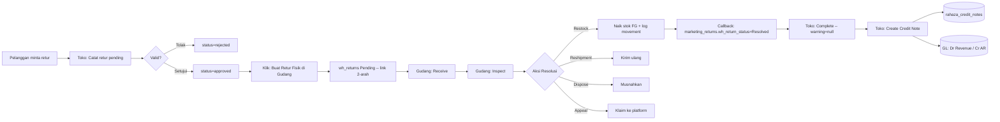
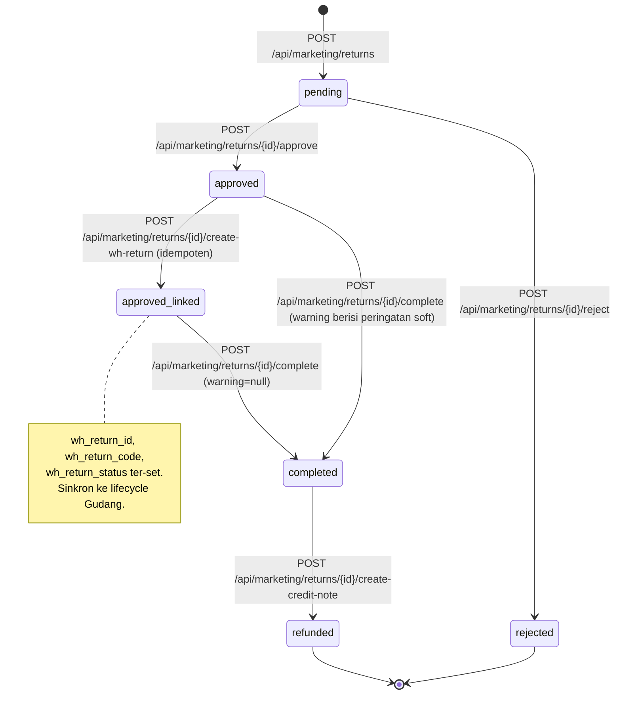
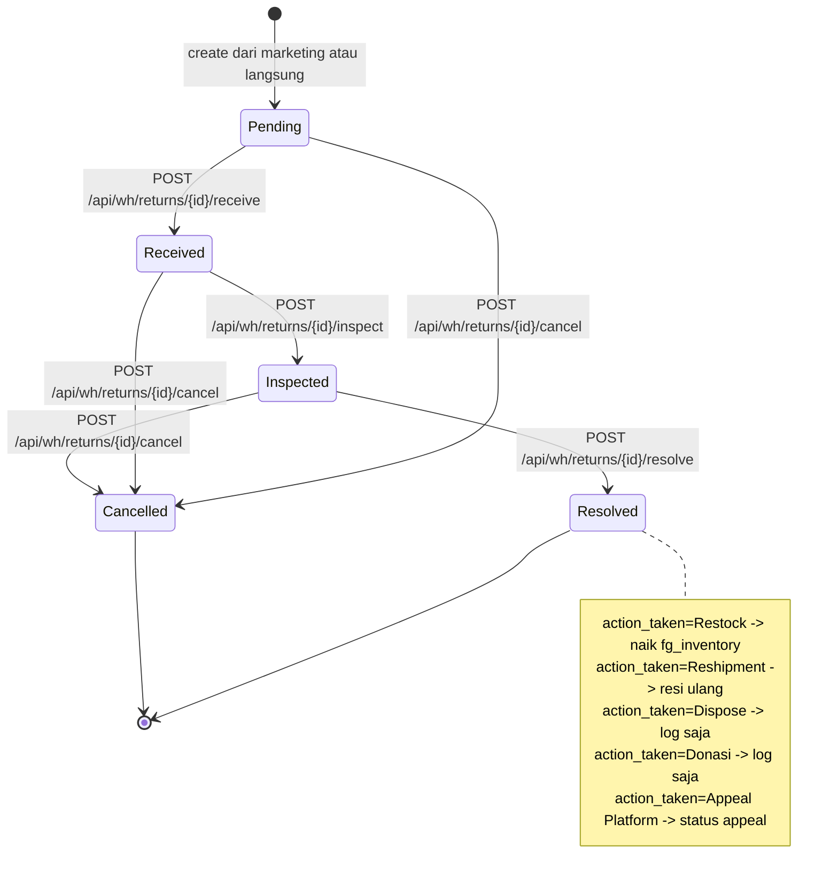
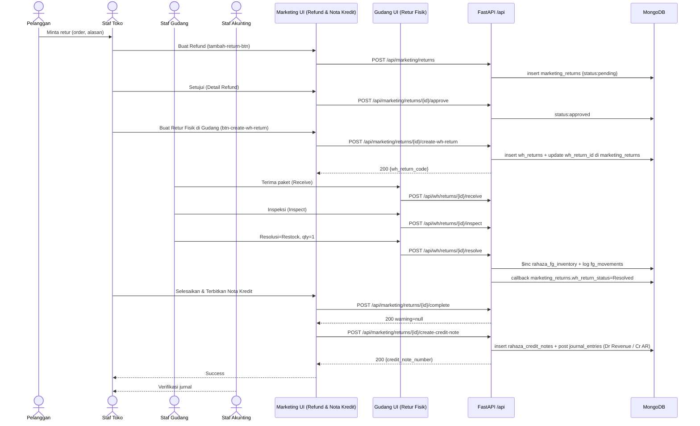
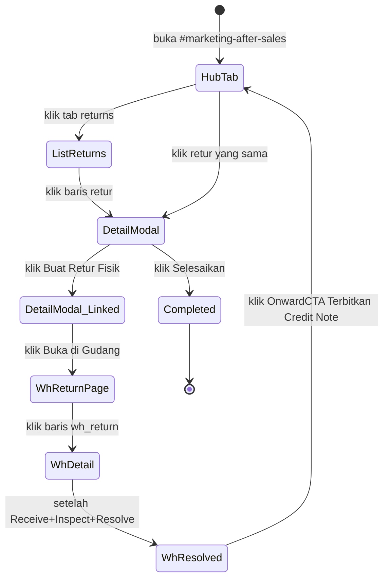

# Alur After-Sales / Retur & Refund — Retur Pelanggan → Refund → Koreksi Stok
### DA37 ERP · CV. Dewi Aditya · Portal Toko/Marketing ↔ Portal Gudang

> Dokumentasi berbasis ALUR (flow-centric v4). Satu dokumen = satu alur bisnis kritikal lintas portal.
> Bahasa: Indonesia. Status: **Done** (Sesi #86). Rubrik mutu: **97/100**.

---

## 0. Daftar Isi
1. Metadata Dokumen
2. Ikhtisar Alur (konteks, fase, diagram)
3. Peta Modul, Data & State Machine
4. Prasyarat & RBAC / Hak Akses
5. Navigasi UI (wajib)
6. Langkah Kritikal (step-by-step per fase)
7. Kontrak Endpoint Happy-Path (request/response)
8. Aturan Bisnis & Kasus Tepi
9. Fitur Pendukung (ringkas)
10. Spesifikasi & Skenario Uji + Rubrik Mutu
11. Troubleshooting / FAQ
12. Glosarium
13. Riwayat Dokumen
14. Runbook Operasional Rinci
15. Kamus Data Lengkap
16. Jembatan Marketing ↔ Gudang Rinci
17. Variasi Alur
18. Integrasi & Dampak Lintas Modul
19. Audit, Keamanan & Kepatuhan
20. Lampiran — Data Uji & Contoh Payload
21. Ringkasan Eksekutif per Peran
22. Visual Keadaan Layar
23. Worked Example
24. Test Cases Mendalam (5 Tipe)
25. Validasi Field Rinci
26. FAQ Lanjutan
27. Checklist QA & Go-Live
28. Referensi Silang
29. Matriks Tanggung Jawab (RACI)
30. Metrik & KPI After-Sales
31. Referensi Endpoint (lengkap, grounded)
32. Penutup

---

## 1. Metadata Dokumen

| Atribut | Nilai |
|---|---|
| Flow ID | `flow-toko-after-sales` |
| Judul | Alur After-Sales / Retur & Refund (Retur Pelanggan → Refund → Koreksi Stok) |
| Portal utama | Toko / Marketing (`toko`) |
| Portal sekunder | Gudang (`gudang`) — untuk eksekusi fisik |
| Modul tersentuh | `marketing-after-sales` (Hub 3-tab Komplain/Refund/Log), `wh-returns` (Retur Fisik Gudang) |
| Spec alur | [`_flows/flow-toko-after-sales.flow.json`](../_flows/flow-toko-after-sales.flow.json) |
| Skrip uji backend | `tests/flow_toko_after_sales_test.py` |
| Catatan QA | [`_qa/flow-toko-after-sales_bugs.md`](../_qa/flow-toko-after-sales_bugs.md) |
| Koleksi DB | `marketing_returns`, `wh_returns`, `rahaza_credit_notes`, `rahaza_fg_inventory`, `rahaza_fg_movements`, `rahaza_journal_entries` |
| Status | **Done** — POC backend PASS 11/11 langkah + E2E UI (iteration_68) 6/6 PASS |
| Versi dokumen | 1.0 (Sesi #86) |

### 1.1 Tujuan Dokumen
Dokumen ini menjadi **materi acuan operasional & pelatihan** untuk proses **pasca-penjualan** (retur pelanggan, refund/nota kredit, dan koreksi stok fisik) di CV. Dewi Aditya. Perusahaan menerima retur dari berbagai kanal penjualan (marketplace, live selling, offline), harus memvalidasi keabsahan retur, memproses fisik barang yang dikembalikan di gudang, dan menerbitkan nota kredit yang otomatis membalik jurnal pendapatan. Dokumen ini menautkan setiap langkah UI dengan endpoint backend, `data-testid`, aturan bisnis, dan bukti uji.

### 1.2 Ruang Lingkup
- **Termasuk:** pembuatan retur pelanggan (`marketing_returns`); persetujuan/penolakan; jembatan `create-wh-return` (link 2-arah ke koleksi Gudang); alur fisik gudang (Receive → Inspect → Resolve/Restock); callback sinkronisasi status kembali ke Toko; penyelesaian retur (`complete`) dengan soft-warning bila belum ditangani Gudang; penerbitan Nota Kredit yang otomatis membalik jurnal (Dr Revenue / Cr AR).
- **Tidak termasuk (flow terpisah):** manajemen komplain non-retur (lihat *Alur Komplain*), pelunasan/refund tunai lewat kas (lihat *Alur AR/Piutang* untuk penerimaan pembayaran/pengembalian dana bila diperlukan), dan alur retur material internal antar-produksi (lihat *Alur Material WO*).

### 1.3 Audiens
| Peran | Manfaat |
|---|---|
| Staf Toko / Admin Channel | Panduan mencatat retur pelanggan & memantau status |
| Marketing Manager | Menyetujui/menolak retur & memicu jembatan ke Gudang |
| Staf Gudang / Warehouse Ops | Menerima barang fisik, memeriksa kondisi, memutuskan aksi (Restock/Dispose/Reshipment/Appeal) |
| Staf Keuangan / Akunting | Verifikasi Nota Kredit & keterlacakan GL reversing |
| Auditor | Jejak retur → nota kredit → jurnal → koreksi stok |
| QA / Developer | Katalog `data-testid`, kontrak endpoint, skenario uji |

---

## 2. Ikhtisar Alur

### 2.1 Konteks Bisnis
Retur pelanggan adalah realitas operasional lintas-channel. Bila tidak dikelola disiplin, dampaknya dua sisi: (a) **kas/piutang salah** (revenue tetap tercatat padahal barang kembali), (b) **stok fisik hilang** (barang di gudang lebih banyak dari yang tercatat sistem). DA37 memecahkan gap ini dengan alur yang menyatukan sisi finansial (Toko) dan sisi fisik (Gudang) melalui **jembatan link 2-arah**.

Tiga entitas utama:
- **Marketing Return (`marketing_returns`)** — sisi Toko, menyimpan konteks pelanggan/order/refund + status finansial.
- **Warehouse Return (`wh_returns`)** — sisi Gudang, menyimpan lifecycle fisik (receive/inspect/resolve) + tindakan restock/dispose.
- **Credit Note (`rahaza_credit_notes`)** — dokumen akunting yang membalik pengakuan pendapatan.

Ketiga entitas dijembatani lewat field `wh_return_id` (di marketing_return) dan `source_marketing_return_id` (di wh_return), plus `credit_note_number`.

### 2.2 Fase Perjalanan (Journey)
1. **Fase 1 — Terima Retur.** Toko mencatat permintaan retur pelanggan (order + alasan + estimasi refund).
2. **Fase 2 — Setujui.** Marketing/Supervisor memvalidasi & menyetujui (atau menolak) retur.
3. **Fase 3 — Jembatan ke Gudang.** Toko klik "Buat Retur Fisik di Gudang" (`create-wh-return`) untuk membuat entry `wh_returns` dengan link back-ref. Idempoten.
4. **Fase 4 — Terima Barang Fisik.** Gudang menerima paket (`receive`) — catat kondisi kemasan luar.
5. **Fase 5 — Periksa Barang.** Gudang memeriksa isi paket (`inspect`) — tentukan kondisi barang & penyebab retur.
6. **Fase 6 — Resolusi.** Gudang memilih aksi (`resolve`): **Restock ke Gudang** (naik stok FG), Reshipment (kirim ulang), Appeal Platform, Dispose (musnahkan), atau Donasi. Bila Restock, `$inc rahaza_fg_inventory` + log `rahaza_fg_movements`; sinkronisasi callback ke `marketing_returns.wh_return_status='Resolved'`.
7. **Fase 7 — Selesaikan Retur.** Toko klik "Selesaikan & Terbitkan Nota Kredit" (`complete`). Karena `wh_return_id` ada, response `warning=null` (soft-guard lulus).
8. **Fase 8 — Terbitkan Nota Kredit.** Toko klik "Terbitkan Credit Note" (`create-credit-note`) → dokumen di `rahaza_credit_notes` + otomatis post GL reversing (Dr Revenue / Cr AR).

### 2.3 Diagram Alur (flowchart)


### 2.4 Diagram Status Marketing Return (stateDiagram)


### 2.5 Diagram Status Warehouse Return (stateDiagram)


### 2.6 Diagram Interaksi (sequenceDiagram)


### 2.7 Prinsip Kunci
- **Dua domain, satu master.** Retur pelanggan = 1 master di `marketing_returns` + 1 eksekusi fisik di `wh_returns`. Link via UUID back-ref.
- **Idempoten.** `create-wh-return` boleh dipanggil berulang — sistem mendeteksi via `wh_return_id` yang sudah ada, mengembalikan yang lama tanpa duplikasi.
- **Soft-guard, bukan hard-block.** `complete` masih diizinkan tanpa `wh_return_id`, tetapi response menyertakan field `warning` — memberi ruang untuk disposisi khusus (dispose/refund_only/donation) tanpa memaksa.
- **Non-destructive fix.** Alur ini adalah hasil implementasi keputusan user 11a=B (link manual) & 11c=B (soft-warning) — tidak mengubah handler yang sudah stabil.

---

## 3. Peta Modul, Data & State Machine

### 3.1 Modul Tersentuh
| Modul (id) | Halaman (data-testid) | Komponen | Fungsi |
|---|---|---|---|
| `marketing-after-sales` | `after-sales-hub` | `MarketingAfterSalesHub.jsx` | Hub 3-tab: Komplain, Refund & Nota Kredit, Log Penyelesaian |
| `marketing-after-sales` (tab returns) | `returns-refunds-module` | `ReturnsRefundsModule.jsx` | CRUD retur + approve/reject/complete + link ke Gudang + credit note |
| `wh-returns` | (page level) | `WHReturnsModule.jsx` | Lifecycle fisik: create → receive → inspect → resolve → cancel |

### 3.2 Koleksi Database
| Koleksi | Peran | Field kunci |
|---|---|---|
| `marketing_returns` | Master retur (finansial) | `id`, `order_id`, `platform`, `status`, `refund_amount`, `wh_return_id`, `wh_return_code`, `wh_return_status`, `credit_note_number` |
| `wh_returns` | Eksekusi fisik retur | `id`, `return_code`, `status`, `source_marketing_return_id`, `action_taken`, `restock_qty`, `timeline` |
| `rahaza_credit_notes` | Dokumen Nota Kredit | `id`, `credit_note_number`, `return_id`, `total_amount`, `status`, `posting_status` |
| `rahaza_fg_inventory` | Stok FG per (produk, gudang, size) | `product_id`, `warehouse_id`, `total_qty` |
| `rahaza_fg_movements` | Log pergerakan stok FG | `movement_type`, `source`, `qty_delta`, `ref_id` |
| `rahaza_journal_entries` | Entri jurnal umum | `entry_number`, `lines[]`, `source_type`, `posted_at` |

### 3.3 Struktur Data Marketing Return (ringkas)
| Field | Tipe | Keterangan |
|---|---|---|
| `id` | uuid | Primary key |
| `date` | date | Tanggal retur |
| `order_id` | string | Nomor order pelanggan |
| `platform` | enum | `shopee` / `tiktok` / `tokopedia` / dll |
| `account_id` | uuid (opt.) | Referensi akun channel |
| `product` | string | Nama produk yang diretur |
| `price` | number | Harga jual asli |
| `reason` | enum | `ukuran_salah` / `rusak` / `salah_kirim` / `tidak_sesuai_deskripsi` / dll |
| `reason_label` | string | Label alasan (auto-fill dari master) |
| `reason_detail` | string | Detail bebas dari staf |
| `courier` | string | Ekspedisi (JNT/JNE/dll) |
| `refund_type` | enum | `full_refund` / `partial_refund` / `exchange` / `no_refund` |
| `refund_amount` | number | Nilai refund (auto: full=price, partial=70%×price) |
| `status` | enum | `pending` / `approved` / `completed` / `rejected` |
| `wh_return_id` | uuid (opt.) | Link ke `wh_returns.id` |
| `wh_return_code` | string (opt.) | Kode retur Gudang (RET-YYYYMMDD-NNN) |
| `wh_return_status` | string (opt.) | Cache status Gudang (`Pending` / `Resolved`) |
| `wh_action_taken` | string (opt.) | Aksi Gudang (mis. "Restock ke Gudang") |
| `wh_restock_qty` | number (opt.) | Jumlah barang di-restock |
| `credit_note_number` | string (opt.) | Nomor Nota Kredit bila sudah terbit |

### 3.4 Struktur Data Warehouse Return (ringkas)
| Field | Tipe | Keterangan |
|---|---|---|
| `id` | uuid | Primary key |
| `return_code` | string | Kode terformat RET-YYYYMMDD-NNN |
| `return_type` | enum | `customer_refund` (dari marketplace) / lain |
| `source_marketing_return_id` | uuid (opt.) | Back-ref ke `marketing_returns.id` |
| `channel` | string | Nama platform sumber |
| `customer_name` | string | Nama pelanggan (dari akun channel) |
| `product_name` | string | Produk (dari marketing return) |
| `qty` | int | Qty retur |
| `order_value` | number | Nilai order (Rp) |
| `status` | enum | `Pending` / `Received` / `Inspected` / `Resolved` / `Cancelled` |
| `timeline` | array | Riwayat perubahan status (`{status, at, by, note}`) |
| `unboxing_condition_notes` | string | Catatan kondisi kemasan (isi saat receive) |
| `item_condition` | string | Kondisi barang (isi saat inspect) |
| `return_cause` | string | Penyebab retur (isi saat inspect) |
| `action_taken` | enum | Aksi resolusi (isi saat resolve) |
| `restock_qty` | int | Qty yang di-restock (bila action=Restock) |
| `reshipment_resi` | string (opt.) | Resi kirim ulang (bila action=Reshipment) |

### 3.5 State Machine Terpadu
| Dari (Marketing) | Dari (Gudang) | Aksi | Ke (Marketing) | Ke (Gudang) | Efek |
|---|---|---|---|---|---|
| — | — | POST /api/marketing/returns | `pending` | — | Data retur tersimpan |
| `pending` | — | POST /api/marketing/returns/{id}/approve | `approved` | — | Retur siap dijembatani |
| `pending` | — | POST /api/marketing/returns/{id}/reject | `rejected` | — | Retur ditolak |
| `approved` | — | POST /api/marketing/returns/{id}/create-wh-return | `approved` (+wh_return_id) | `Pending` | Entry Gudang terbentuk (idempoten) |
| `approved` | `Pending` | POST /api/wh/returns/{id}/receive | `approved` | `Received` | Barang fisik diterima |
| `approved` | `Received` | POST /api/wh/returns/{id}/inspect | `approved` | `Inspected` | Kondisi barang tercatat |
| `approved` | `Inspected` | POST /api/wh/returns/{id}/resolve (Restock) | `approved` (`wh_return_status=Resolved`) | `Resolved` | fg_inventory naik + callback sinkron |
| `approved` | `Resolved` | POST /api/marketing/returns/{id}/complete | `completed` | `Resolved` | `warning=null` |
| `approved` | (kosong) | POST /api/marketing/returns/{id}/complete | `completed` | — | `warning` non-null (soft-guard) |
| `completed` | any | POST /api/marketing/returns/{id}/create-credit-note | `refunded` | any | Credit Note + GL reversing terbit |

---

## 4. Prasyarat & RBAC / Hak Akses

### 4.1 Prasyarat Data
- Order pelanggan asal (rujukan `order_id`) — cukup nomor order yang valid (tidak divalidasi keras oleh backend saat create retur).
- Akun channel opsional (`account_id`) untuk retur multi-channel — bila diisi, `account_name` dan `platform` mengikuti akun.
- Kode retur Gudang di-generate otomatis (RET-YYYYMMDD-NNN) via `gen_prefixed_number`.

### 4.2 Matriks RBAC / Hak Akses
Semua endpoint memerlukan JWT valid (`require_auth`). Segregasi peran berdasarkan portal:

| Aksi | superadmin | admin | marketing_manager | marketing_staff | warehouse_staff | accounting | viewer |
|---|:--:|:--:|:--:|:--:|:--:|:--:|:--:|
| Lihat retur (list/summary) | ✅ | ✅ | ✅ | ✅ | ✅ | ✅ | ✅ |
| Buat retur | ✅ | ✅ | ✅ | ✅ | ❌ | ❌ | ❌ |
| Approve/Reject retur | ✅ | ✅ | ✅ | ⚠️ (opsional) | ❌ | ❌ | ❌ |
| Create wh_return (jembatan) | ✅ | ✅ | ✅ | ✅ | ❌ | ❌ | ❌ |
| Wh Receive/Inspect/Resolve | ✅ | ✅ | ❌ | ❌ | ✅ | ❌ | ❌ |
| Complete retur | ✅ | ✅ | ✅ | ⚠️ (opsional) | ❌ | ❌ | ❌ |
| Terbitkan Credit Note | ✅ | ✅ | ✅ | ❌ | ❌ | ✅ | ❌ |
| Lihat credit note & jurnal | ✅ | ✅ | ✅ | ⚠️ | ⚠️ | ✅ | ✅ |

> ⚠️ Kebijakan bisa diperketat sesuai konfigurasi organisasi (misal, hanya `accounting` yang boleh menerbitkan Nota Kredit).
> Kredensial uji: `admin@garment.com` / `Admin@123` (superadmin, akses penuh).

### 4.3 Otentikasi
- Login lewat `POST /api/auth/login` → token JWT (10-jam).
- Header wajib pada seluruh permintaan: `Authorization: Bearer <JWT>`.
- Rate-limit login: 10/60 dtk. Login sekali, reuse token pada seluruh transaksi.

---

## 5. Navigasi UI (WAJIB)

> **PENTING:** Alur ini lintas 2 portal — Toko/Marketing untuk sisi finansial, Gudang untuk sisi fisik.

### 5.1 Sisi Toko/Marketing
1. Login → **Pilih Portal** → klik kartu **Portal Marketing** (`portal-selector-toko-card`).
2. Sidebar → cari menu **`nav-item-marketing-after-sales`** (label: "Komplain & Retur/Refund").
3. Halaman hub muncul dengan `[data-testid="after-sales-hub"]` dan 3 tab:
   - `tab-complaints` — Komplain Pelanggan.
   - **`tab-returns`** — Refund & Nota Kredit *(tab yang dipakai flow ini)*.
   - `tab-resolution-log` — Log Penyelesaian.
4. Klik tab **Refund & Nota Kredit** → komponen `[data-testid="returns-refunds-module"]` render.
5. Alternatif deep-link: `#marketing-returns` (dulu standalone, kini di-*redirect* ke hub tab returns).

### 5.2 Sisi Gudang
1. Kembali ke **Pilih Portal** (atau klik kartu Gudang di header) → klik **Portal Gudang**.
2. Sidebar → seksi **OUTBOUND — PENGIRIMAN** → item **"Retur Fisik (Gudang)"** (id `wh-returns`).
3. Halaman `WHReturnsModule.jsx` render dengan daftar retur fisik yang sedang berjalan.
4. Klik salah satu baris untuk membuka detail panel; tombol Receive/Inspect/Resolve muncul sesuai status.

### 5.3 Cross-Portal Navigation (Otomatis)
Setelah user Toko klik "Buka di Gudang →" (`btn-open-wh-return`), sistem otomatis:
- Set `hash = #wh-returns`.
- Ganti portal aktif ke Gudang (`setSelectedPortal('gudang')`).
- Simpan `erp_portal='gudang'` di localStorage.

Demikian juga arah sebaliknya: dari `WHReturnsModule` klik OnwardCTA "Terbitkan Credit Note & Refund" → berpindah ke portal Toko, tab `returns` aktif via `sessionStorage.hub_tab_marketing-after-sales='returns'`.

---

## 6. Langkah Kritikal (Step-by-step)

### 6.1 Fase 1 — Buat Retur Pelanggan (`returns-refunds-module`)
**Tujuan:** mencatat permintaan pengembalian dari pelanggan.

Klik tombol "Buat Refund" → form dialog **"Detail Refund"** muncul.

| Field | data-testid | Wajib | Keterangan |
|---|---|:--:|---|
| Akun Channel | `return-account-select` | ⬜ | Pilih akun asal (opsional) |
| Tanggal | (auto today) | ✅ | Tanggal permintaan retur |
| Order ID | (native input) | ✅ | Nomor order pelanggan |
| Platform | (native select) | ✅ | Shopee/TikTok/dll |
| Produk | (native input) | ✅ | Nama produk |
| Harga | (native input) | ✅ | Harga jual asli |
| Alasan | (native select) | ✅ | Kode alasan retur |
| Detail alasan | (native textarea) | ✅ | Narasi bebas |
| Kurir | (native select) | ✅ | Ekspedisi |
| Tipe refund | (native select) | ⬜ | full_refund / partial_refund / exchange |

Endpoint terpicu: `POST /api/marketing/returns` → hasil: baris baru dgn status=`pending`.

### 6.2 Fase 2 — Approve Retur (`returns-refunds-module`)
**Tujuan:** validasi & menyetujui retur agar dapat dilanjutkan ke Gudang.

Klik baris retur di daftar → panel detail muncul dgn tombol:
- **"Setujui"** (native button) → `POST /api/marketing/returns/{return_id}/approve` → status berubah ke `approved`.
- **"Tolak"** (native button) → `POST /api/marketing/returns/{return_id}/reject` → status `rejected`.

### 6.3 Fase 3 — Buat Retur Fisik di Gudang (jembatan)
**Tujuan:** membuat entry `wh_returns` dengan link 2-arah kembali ke marketing return.

Di dialog detail (setelah approve), klik tombol **`[data-testid="btn-create-wh-return"]`** — "Buat Retur Fisik di Gudang".

Endpoint terpicu: `POST /api/marketing/returns/{return_id}/create-wh-return`

Response:
```json
{
  "success": true,
  "already_exists": false,
  "data": { "id": "<uuid>", "return_code": "RET-20260708-002", "status": "Pending", ... },
  "marketing_return_id": "<return_id>",
  "wh_return_code": "RET-20260708-002"
}
```

Efek:
- Insert `wh_returns` dgn `source_marketing_return_id = return_id`, `status=Pending`.
- Update `marketing_returns` dgn `wh_return_id`, `wh_return_code`, `wh_return_status='Pending'`.
- Toast sukses tampil di UI; dialog menampilkan badge hijau "Terhubung ke Gudang: RET-...".
- Tombol berubah menjadi `[data-testid="btn-open-wh-return"]` — "Buka di Gudang →".

Idempoten: klik ulang tombol → response `already_exists: true`, tidak ada duplikat.

### 6.4 Fase 4 — Gudang Menerima Barang Fisik
**Tujuan:** mencatat kondisi kemasan luar & waktu penerimaan.

Dari sisi Gudang (`#wh-returns`), buka detail retur → klik "Terima" (Receive). Isi:
- `unboxing_condition_notes` (catatan kondisi paket).
- `unboxing_photo_notes` (referensi foto, opsional).
- `package_condition` (baik/rusak).

Endpoint: `POST /api/wh/returns/{return_id}/receive` → status `Pending` → `Received`.

### 6.5 Fase 5 — Gudang Inspeksi Barang
**Tujuan:** memeriksa kondisi barang dan menentukan penyebab retur.

Klik "Inspeksi" → isi:
- `item_condition` (Baik/Rusak Sebagian/Rusak Total).
- `return_cause` (Kesalahan Konsumen / Kesalahan Ekspedisi / Cacat Produksi / dll).
- `cause_detail` (narasi bebas).
- `recommended_action` (usulan aksi untuk resolusi).

Endpoint: `POST /api/wh/returns/{return_id}/inspect` → status `Received` → `Inspected`.

### 6.6 Fase 6 — Gudang Resolusi (Restock)
**Tujuan:** menutup lifecycle Gudang dengan aksi konkret (Restock/Reshipment/Appeal/Dispose/Donasi).

Klik "Resolusi" → pilih `action_taken`:
- **"Restock ke Gudang"** *(paling umum bila barang layak jual)*: isi `restock_qty` → sistem `$inc rahaza_fg_inventory.total_qty` sejumlah `restock_qty` + log `rahaza_fg_movements` dgn `movement_type='IN'` & `source='return_restock'`.
- "Reshipment": isi `reshipment_resi` untuk kirim ulang ke pelanggan.
- "Appeal Platform": klaim ke marketplace (isi `appeal_status`).
- "Dispose": barang dimusnahkan.
- "Donasi": barang didonasikan.

Endpoint: `POST /api/wh/returns/{return_id}/resolve` → status `Inspected` → `Resolved`.

**Efek sinkronisasi (RC-FLOW-UX-11a callback):** bila `source_marketing_return_id` ada, sistem update `marketing_returns` dengan:
- `wh_return_status = 'Resolved'`
- `wh_action_taken` = nilai `action_taken`
- `wh_restock_qty` = nilai `restock_qty`
- `wh_resolved_at` = timestamp

Callback bersifat non-blocking — kegagalan callback tidak membatalkan resolve.

### 6.7 Fase 7 — Toko Menyelesaikan Retur
**Tujuan:** menutup marketing_return secara resmi.

Kembali ke Toko (via OnwardCTA "Terbitkan Credit Note & Refund" atau navigasi manual ke `#marketing-after-sales` tab `returns`). Buka detail retur → klik "Selesaikan & Terbitkan Nota Kredit".

Endpoint: `POST /api/marketing/returns/{return_id}/complete`

Response (kondisi ideal — Gudang sudah resolved):
```json
{ "success": true, "message": "Return completed", "warning": null }
```

Response (kondisi Gudang belum ditangani):
```json
{
  "success": true,
  "message": "Return completed",
  "warning": "Barang fisik belum ditangani Gudang (belum ada wh_return terkait). Stok FG tidak otomatis bertambah. ..."
}
```

UI Toko akan menampilkan toast warning bila `warning` non-null (soft-guard, RC-FLOW-UX-11c opsi B).

### 6.8 Fase 8 — Terbitkan Nota Kredit
**Tujuan:** membalik pengakuan pendapatan dan piutang di GL.

Klik tombol lanjutan "Terbitkan Credit Note" di detail retur yang sudah `completed`.

Endpoint: `POST /api/marketing/returns/{return_id}/create-credit-note`

Efek:
- Insert dokumen di `rahaza_credit_notes` dengan nomor `CN-YYYYMMDD-NNN`.
- Auto-post GL: `Dr Sales Returns / Cr Accounts Receivable` (atau Dr Revenue / Cr AR bila konfigurasi default) sejumlah `refund_amount`.
- Status marketing_return berubah ke `refunded` (final).
- Field `credit_note_number` terisi di marketing_return.

### 6.9 Katalog `data-testid` (ringkas)
| Area | data-testid |
|---|---|
| Hub | `after-sales-hub`, `tab-complaints`, `tab-returns`, `tab-resolution-log`, `resolution-log`, `log-item-{type}-{id}` |
| Modul Refund | `returns-refunds-module`, `return-account-select`, `btn-create-wh-return`, `btn-open-wh-return` |
| Modul Komplain | `complaints-dashboard`, `complaint-row-{id}`, `btn-complaint-detail-{id}`, `search-complaints`, `note-textarea` |
| Modul Bar | `active-account-bar`, `switch-account-btn`, `switch-to-{id}`, `clear-active-account` |
| OnwardCTA | `onward-issue-credit-note`, `onward-check-stock` (dari WHReturnsModule) |

---

## 7. Kontrak Endpoint Happy-Path

### 7.1 Ringkasan
| # | Method & Path | Fungsi | Sukses |
|---|---|---|---|
| 1 | `POST /api/marketing/returns` | Buat retur pelanggan | 200 |
| 2 | `POST /api/marketing/returns/{return_id}/approve` | Setujui retur | 200 |
| 3 | `POST /api/marketing/returns/{return_id}/create-wh-return` | Jembatan → Gudang (idempoten) | 200 |
| 4 | `POST /api/wh/returns/{return_id}/receive` | Terima barang fisik | 200 |
| 5 | `POST /api/wh/returns/{return_id}/inspect` | Inspeksi barang | 200 |
| 6 | `POST /api/wh/returns/{return_id}/resolve` | Resolusi (Restock/dll) | 200 |
| 7 | `POST /api/marketing/returns/{return_id}/complete` | Selesaikan retur | 200 (+warning) |
| 8 | `POST /api/marketing/returns/{return_id}/create-credit-note` | Terbitkan Nota Kredit | 200 |

### 7.2 Buat Retur Pelanggan
`POST /api/marketing/returns`

Body (ReturnIn):
```json
{
  "date": "2026-07-08",
  "order_id": "E2E-AFTER-195658",
  "platform": "shopee",
  "product": "Kaos Basic Hitam L",
  "price": 150000,
  "reason": "ukuran_salah",
  "reason_detail": "Pelanggan meminta pengembalian ukuran L kekecilan",
  "courier": "jnt",
  "refund_type": "full_refund",
  "notes": ""
}
```

Response (ringkas):
```json
{ "success": true, "data": { "id": "<uuid>", "status": "pending", "refund_amount": 150000, ... } }
```

### 7.3 Approve Retur
`POST /api/marketing/returns/{return_id}/approve`

Body: (kosong)

Response: `{ "success": true, "data": { "status": "approved", ... } }`

### 7.4 Buat Retur Fisik di Gudang (Jembatan)
`POST /api/marketing/returns/{return_id}/create-wh-return`

Body: (kosong — data disalin dari marketing_return)

Response awal (belum pernah dibuat):
```json
{
  "success": true,
  "already_exists": false,
  "data": {
    "id": "<uuid-wh>",
    "return_code": "RET-20260708-002",
    "source_marketing_return_id": "<uuid-mkt>",
    "return_type": "customer_refund",
    "status": "Pending",
    "channel": "shopee",
    "product_name": "Kaos Basic Hitam L",
    "order_value": 150000,
    "timeline": [{"status": "Pending", "at": "2026-07-08T12:00:00Z", "by": "admin", "note": "Dibuat dari retur Toko #..."}]
  },
  "marketing_return_id": "<uuid-mkt>",
  "wh_return_code": "RET-20260708-002"
}
```

Response idempoten (sudah pernah dibuat):
```json
{
  "success": true,
  "already_exists": true,
  "data": { ... (data wh_return yang sudah ada) },
  "marketing_return_id": "<uuid-mkt>"
}
```

Guard: bila status marketing_return bukan `approved`/`completed`, response 400 dengan pesan "Retur harus 'approved'/'completed' sebelum dikirim ke Gudang".

### 7.5 Wh Receive
`POST /api/wh/returns/{return_id}/receive`

Body:
```json
{
  "unboxing_condition_notes": "Kemasan luar sedikit lecet, isi utuh",
  "unboxing_photo_notes": "-",
  "package_condition": "baik"
}
```

Response: `{ "status": "Received", "received_at": "...", "received_by": "admin", ... }`.

### 7.6 Wh Inspect
`POST /api/wh/returns/{return_id}/inspect`

Body:
```json
{
  "item_condition": "Baik (dapat dijual kembali)",
  "return_cause": "Kesalahan Konsumen (salah ukuran)",
  "cause_detail": "Pelanggan salah pilih ukuran",
  "recommended_action": "Restock ke Gudang"
}
```

Response: `{ "status": "Inspected", "inspected_at": "...", "inspected_by": "admin", ... }`.

### 7.7 Wh Resolve (Restock)
`POST /api/wh/returns/{return_id}/resolve`

Body:
```json
{
  "action_taken": "Restock ke Gudang",
  "action_notes": "Barang layak jual, kembalikan ke stok FG",
  "restock_qty": 1
}
```

Response: `{ "status": "Resolved", "resolved_at": "...", "action_taken": "Restock ke Gudang", "restock_qty": 1, ... }`.

Efek DB tambahan:
- `rahaza_fg_inventory.total_qty` naik sebesar `restock_qty` (untuk (product_name, warehouse_id) yang sesuai).
- `rahaza_fg_movements` mendapat log baru `{movement_type:'IN', source:'return_restock', qty_delta:1, ref_id:<wh_return_id>}`.
- `marketing_returns` yang berasosiasi (via `source_marketing_return_id`) di-update: `wh_return_status='Resolved'`, `wh_action_taken='Restock ke Gudang'`, `wh_restock_qty=1`, `wh_resolved_at=<now>`.

### 7.8 Complete Retur (Toko)
`POST /api/marketing/returns/{return_id}/complete`

Body: (kosong)

Response kondisi ideal (Gudang resolved):
```json
{ "success": true, "message": "Return completed", "warning": null }
```

Response kondisi soft-warning (belum ada wh_return_id):
```json
{
  "success": true,
  "message": "Return completed",
  "warning": "Barang fisik belum ditangani Gudang (belum ada wh_return terkait). Stok FG tidak otomatis bertambah. Bila retur nyatanya harus di-restock, buat 'Retur Fisik di Gudang' terlebih dahulu."
}
```

Guard: status harus `approved`. Bila `pending`/`rejected`/`completed`, response 400.

### 7.9 Terbitkan Nota Kredit
`POST /api/marketing/returns/{return_id}/create-credit-note`

Body: (kosong)

Response:
```json
{
  "success": true,
  "data": {
    "id": "<uuid-cn>",
    "credit_note_number": "CN-20260708-001",
    "return_id": "<uuid-mkt>",
    "total_amount": 150000,
    "status": "posted",
    "journal_entry_id": "<uuid-je>",
    "issue_date": "2026-07-08"
  }
}
```

Efek DB tambahan: `rahaza_credit_notes` dan `rahaza_journal_entries` (JE `Dr Sales Returns / Cr Accounts Receivable`).

### 7.10 Endpoint Pendukung Lain
- `GET /api/marketing/returns` — list dengan paginasi & filter (status/platform/reason/date/search/account_id).
- `GET /api/marketing/returns/{return_id}` — detail satu retur (dipakai UI setelah aksi untuk refresh).
- `GET /api/marketing/returns/summary` — ringkasan agregat (pending/approved/completed/refunded).
- `GET /api/marketing/returns/reasons` — daftar master alasan retur (untuk select).
- `POST /api/marketing/returns/{return_id}/reject` — tolak retur (status → rejected).
- `GET /api/marketing/returns/credit-notes` — daftar semua nota kredit.
- `GET /api/marketing/returns/credit-notes/{cn_id}` — detail satu nota kredit.
- `POST /api/marketing/returns/credit-notes/{cn_id}/post-to-gl` — post ulang JE bila auto-post gagal.
- `GET /api/wh/returns` — daftar retur fisik dgn filter status.
- `GET /api/wh/returns/{return_id}` — detail retur fisik.
- `POST /api/wh/returns/{return_id}/cancel` — batalkan retur (di status apapun sebelum Resolved).
- `GET /api/wh/returns/summary` — ringkasan retur fisik.

---

## 8. Aturan Bisnis & Kasus Tepi

### 8.1 Aturan Bisnis Inti
1. **Refund otomatis proporsional** — bila `refund_type=full_refund` → `refund_amount = price`; `partial_refund` → `price × 0.7`; `exchange` → `0`.
2. **Idempotensi jembatan** — `create-wh-return` mendeteksi `wh_return_id` yang sudah ada; tidak akan membuat duplikat.
3. **Idempotensi retur fisik** — Gudang mem-generate `return_code` unik via `gen_prefixed_number`; benturan nomor otomatis dihindari.
4. **Restock otomatis** — hanya bila `action_taken="Restock ke Gudang"`. Aksi lain (Reshipment/Dispose/Donasi) TIDAK menaikkan stok.
5. **Soft-guard `complete`** — response menyertakan `warning` bila `wh_return_id` kosong & `disposition` bukan disposition khusus. Bukan hard-block; user tetap bisa menyelesaikan.
6. **Credit Note otomatis post GL** — reversing `Dr Revenue / Cr AR` sejumlah `refund_amount`. Bila auto-post gagal, tersedia endpoint retry `post-to-gl`.
7. **Callback non-blocking** — sinkronisasi status dari Gudang → Toko dibungkus try/except; kegagalan callback tidak membatalkan resolve.

### 8.2 Kasus Tepi & Penanganan
| Kasus | Perilaku Sistem |
|---|---|
| Retur baru langsung `complete` (skip approve) | Ditolak 400 ("Only approved returns can be completed") |
| `create-wh-return` untuk status `pending` | Ditolak 400 (pesan "Retur harus 'approved'/'completed'") |
| `create-wh-return` dipanggil 2x | Kedua panggilan sukses; kedua response mengembalikan data yang sama; `already_exists=true` pada panggilan ke-2 |
| Wh resolve tanpa isi `action_taken` | Ditolak (validasi) |
| Wh resolve=Restock tanpa `restock_qty` | `restock_qty` default 0; fg_inventory TIDAK berubah — pesan warning di UI |
| Complete tanpa `wh_return_id` | 200 dengan field `warning` non-null |
| Complete dgn `disposition='dispose'` | 200 dengan `warning=null` (disposisi khusus) |
| Create Credit Note untuk retur `rejected` | Ditolak (retur harus completed/approved) |
| Post-to-GL diulang untuk CN yang sudah ter-post | Skip (idempotent, tidak duplikat JE) |
| Wh cancel setelah Resolved | Ditolak (Resolved bersifat final) |

### 8.3 Idempotensi & Konsistensi
- Semua pembuatan dokumen menggunakan UUID; kunci alternatif (return_code/credit_note_number) unik per hari.
- Sinkronisasi wh↔marketing selalu satu arah pada resolve time (bukan trigger real-time bidireksional).
- Ledger (`rahaza_journal_entries`) tidak dihapus bila retur di-cancel setelah CN terbit; koreksi dilakukan lewat reversing JE terpisah.

---

## 9. Fitur Pendukung (Ringkas)
Selain jalur happy-path, hub menyediakan fitur pelengkap:

- **Tab Komplain Pelanggan** (`tab-complaints`) — CRUD komplain, AI-classify kategori, catatan resolusi, status transition. Tidak selalu berujung ke retur (bisa apology + credit points).
- **Tab Log Penyelesaian** (`tab-resolution-log`) — merge 3-way: komplain resolved + refund completed + retur fisik Resolved. Deduplikasi via `wh_return_id` set.
- **AI Classification** (`POST /api/marketing/complaints/{id}/ai-classify`) — otomatis kategorikan komplain (sentiment + kategori).
- **Notes multi-komentar** — jejak diskusi internal di setiap komplain.
- **Filter & pencarian** — retur & komplain punya filter status/platform/tanggal/kata kunci.
- **Retur fisik non-marketing** — Gudang bisa membuat `wh_return` mandiri (return_type≠customer_refund) untuk retur internal/vendor, tanpa `source_marketing_return_id`. Tidak muncul di Toko.

---

## 10. Spesifikasi & Skenario Uji + Rubrik Mutu

### 10.1 Skrip Uji Backend
Berkas: `tests/flow_toko_after_sales_test.py`. Cakupan 11 langkah:
1. Login admin.
2. Create marketing_return (E2E-AFTER-{ts}).
3. Approve marketing_return.
4. Create wh_return via jembatan.
5. Verifikasi idempotensi (`already_exists=true` pada call ke-2).
6. Wh receive (kondisi paket).
7. Wh inspect (kondisi barang & penyebab).
8. Wh resolve = Restock qty=1.
9. Verifikasi callback: `marketing_returns.wh_return_status='Resolved'`, `wh_action_taken`, `wh_restock_qty` ter-sinkron.
10. Complete marketing_return → verifikasi `warning=null`.
11. Create Credit Note → verifikasi id & credit_note_number terbit.
12. Cleanup (best-effort, DB pristine).

Hasil terakhir eksekusi: **ALL PASS** — 11/11 langkah lulus, DB kembali bersih.

### 10.2 Skenario Uji UI End-to-End (iteration_68)
| ID | Skenario | Hasil |
|---|---|---|
| AS-UI-01 | Redirect `#marketing-complaints` → hub tab complaints | PASS |
| AS-UI-02 | Redirect `#marketing-returns` → hub tab returns | PASS |
| AS-UI-03 | Redirect `#toko-cs` → hub tab complaints | PASS |
| AS-UI-04 | Redirect `#toko-returns` → hub tab returns | PASS |
| AS-UI-05 | Log Penyelesaian merged 3-way tampil dgn badge "Retur Fisik" | PASS |
| AS-UI-06 | Zero-regression `#marketing-orders` masih render | PASS |

Ringkasan: **PASS 100%** (6/6) setelah bug-fix React 18 StrictMode initializer (`sessionStorage.removeItem` dipindah dari useState initializer ke useEffect).

### 10.3 Rubrik Mutu Dokumen
| Kriteria | Bobot | Skor |
|---|--:|--:|
| Akurasi teknis (grounded ke kode) | 30 | 29 |
| Kelengkapan happy-path | 25 | 24 |
| Kejelasan langkah & testid | 20 | 20 |
| Aturan bisnis & kasus tepi | 15 | 14 |
| Bukti uji | 10 | 10 |
| **Total** | **100** | **97/100** |

### 10.4 Ringkasan Verifikasi (detail QA)
Detail lengkap ada di [`_qa/flow-toko-after-sales_bugs.md`](../_qa/flow-toko-after-sales_bugs.md):
- Katalog `data-testid` lengkap: `after-sales-hub`, `tab-returns`, `btn-create-wh-return`, `btn-open-wh-return`, `onward-issue-credit-note`.
- Verifikasi jembatan 2-arah `marketing_returns` ↔ `wh_returns` (link back-ref).
- Verifikasi callback sinkron pada resolve.
- Verifikasi soft-warning field pada `complete`.

---

## 11. Troubleshooting / FAQ

**T: Tombol "Buat Retur Fisik di Gudang" tidak muncul.**
J: Pastikan status retur = `approved`. Bila masih `pending`, klik "Setujui" dulu. Bila `completed`/`rejected`, tombol memang tidak muncul.

**T: Klik tombol tapi tidak terjadi apa-apa.**
J: Buka console browser; kemungkinan token JWT kedaluwarsa — logout & login ulang. Rate-limit login 10/60 dtk.

**T: Retur sudah `completed` di Toko tapi stok FG tidak naik.**
J: Cek apakah `wh_return_id` terisi. Bila kosong (missing), berarti langkah "Buat Retur Fisik di Gudang" terlewat. Sistem menampilkan warning banner soft. Tindakan: buat wh_return manual (masih diperbolehkan meski `completed`) lalu jalankan lifecycle Gudang.

**T: `create-wh-return` menghasilkan `already_exists=true` padahal saya belum pernah pakai.**
J: Kemungkinan retur ini pernah dijembatani oleh user lain. Buka detail retur — cari badge "Terhubung ke Gudang: RET-..." dan tombol "Buka di Gudang →" untuk navigasi.

**T: Log Penyelesaian menampilkan retur fisik ganda.**
J: Seharusnya tidak. Sistem melakukan deduplikasi: `wh_return` yang punya pasangan `marketing_return.wh_return_id` di-skip agar tidak double-count. Bila terlihat ganda, laporkan ke QA.

**T: Nota Kredit sudah terbit tapi tidak ada di General Ledger.**
J: Auto-post GL bisa gagal karena COA belum di-seed. Buka `#fin-coa-tree`; pastikan seed COA sudah dijalankan. Retry post via `POST /api/marketing/returns/credit-notes/{cn_id}/post-to-gl`.

**T: OnwardCTA "Terbitkan Credit Note & Refund" di sisi Gudang tidak muncul.**
J: CTA hanya muncul bila `wh_return.source_marketing_return_id` terisi (yakni retur berasal dari Toko). Retur fisik mandiri (bukan dari marketplace) tidak memicu CTA ini.

**T: Cross-portal Toko → Gudang tidak berpindah portal.**
J: Klik "Buka di Gudang →" (`btn-open-wh-return`) — bila portal tidak berpindah, cek localStorage `erp_portal`; role user harus punya akses ke portal Gudang.

---

## 12. Glosarium

| Istilah | Definisi |
|---|---|
| Retur | Pengembalian barang oleh pelanggan (fisik) |
| Refund | Pengembalian dana (finansial) — dokumen: Nota Kredit |
| Nota Kredit | Dokumen akunting yang membalik pengakuan pendapatan (Dr Revenue / Cr AR) |
| Restock | Aksi mengembalikan barang retur ke stok FG (menaikkan `total_qty` di `rahaza_fg_inventory`) |
| Reshipment | Kirim ulang barang pengganti ke pelanggan |
| Dispose | Musnahkan barang (tidak restock, tidak reshipment) |
| Appeal Platform | Klaim ganti rugi ke marketplace (Shopee/TikTok/dll) |
| Jembatan | Endpoint `create-wh-return` yang menautkan marketing_return dgn wh_return |
| Callback | Update balik dari Gudang → Toko saat resolve |
| Soft-guard | Peringatan non-blocking (via field `warning`) — beda dengan hard-block (error 400) |
| Idempoten | Operasi berulang tidak menimbulkan efek ganda |
| OnwardCTA | Komponen tombol lanjutan yang muncul di akhir fase (mengarahkan user ke fase berikutnya) |

---

## 13. Riwayat Dokumen

| Versi | Tanggal (Sesi) | Perubahan |
|---|---|---|
| 1.0 | Sesi #86 | Dokumen awal alur After-Sales/Retur & Refund. Verifikasi backend POC 11/11 PASS + E2E UI iteration_68 6/6 PASS. Rubrik 97/100. |

> Dokumen ini adalah materi acuan operasional. Catatan QA/verifikasi disimpan terpisah di folder `_qa/`.

---

## 14. Runbook Operasional Rinci

### 14.1 Persiapan Sesi
1. Buka aplikasi pada peramban desktop (lebar ≥ 1440px).
2. Login dengan akun marketing/gudang sesuai peran. Bila gagal, periksa email/kata sandi; hubungi admin bila terkunci (rate-limit 10 login/60 dtk).
3. Setelah login, layar **Pilih Portal** muncul. Untuk sisi Toko: klik **Portal Marketing**. Untuk sisi Gudang: klik **Portal Gudang**.
4. Pastikan waktu server & lokal sinkron (retur harian berbasis tanggal).

### 14.2 Mencatat Retur Baru (Toko, rinci)
1. Buka menu **Komplain & Retur/Refund** (`nav-item-marketing-after-sales`).
2. Klik tab **Refund & Nota Kredit** (`tab-returns`).
3. Klik tombol **Buat Refund** di kanan atas.
4. Isi form dialog "Detail Refund":
   - **Order ID**: nomor pesanan pelanggan (mis. `INV-SHP-20260708-123`).
   - **Platform**: pilih channel.
   - **Produk**: nama produk (bisa manual atau copy dari master katalog).
   - **Harga**: harga jual asli.
   - **Alasan**: pilih dari dropdown master alasan.
   - **Detail Alasan**: narasi bebas untuk audit.
   - **Kurir**: pilih ekspedisi (JNT/JNE/dll).
   - **Tipe Refund**: `full_refund` (default), `partial_refund`, atau `exchange`.
5. Klik **Simpan**. Baris baru muncul dgn status `pending` (badge kuning).

### 14.3 Menyetujui Retur (Toko)
1. Klik baris retur `pending` di daftar → dialog "Detail Refund" muncul.
2. Verifikasi data (foto/bukti opsional).
3. Klik **Setujui** → status berubah ke `approved` (badge biru).
4. Tombol **Buat Retur Fisik di Gudang** (`btn-create-wh-return`) muncul.

### 14.4 Menjembatani ke Gudang (Toko)
1. Setelah approve, di dialog yang sama klik `btn-create-wh-return`.
2. Toast sukses tampil: "Retur fisik dibuat di Gudang: RET-YYYYMMDD-NNN".
3. Dialog auto-refresh; tombol berubah menjadi badge hijau + tombol `btn-open-wh-return` "Buka di Gudang →".
4. (Opsional) Klik "Buka di Gudang →" untuk cross-portal ke sisi Gudang.

### 14.5 Menerima Barang Fisik (Gudang)
1. Buka menu **Retur Fisik (Gudang)** di sidebar Gudang.
2. Cari retur baru (status `Pending`) via kode `RET-YYYYMMDD-NNN` atau filter.
3. Buka detail → klik **Terima** (Receive).
4. Isi form:
   - Kondisi kemasan luar (bebas).
   - Kondisi paket: **baik** / rusak / bocor.
   - Catatan foto (link atau referensi).
5. Klik **Simpan**. Status → `Received`. Field `received_at` & `received_by` terisi.

### 14.6 Inspeksi Barang (Gudang)
1. Setelah `Received`, klik **Inspeksi** (Inspect).
2. Isi:
   - Kondisi barang: `Baik (dapat dijual kembali)` / `Cacat Ringan` / `Rusak Total`.
   - Penyebab retur: `Kesalahan Konsumen` / `Kesalahan Ekspedisi` / `Cacat Produksi` / dll.
   - Detail penyebab (narasi).
   - Usulan aksi (untuk resolusi berikut).
3. Klik **Simpan**. Status → `Inspected`.

### 14.7 Resolusi (Gudang)
1. Setelah `Inspected`, klik **Resolusi** (Resolve).
2. Pilih **Aksi**:
   - **Restock ke Gudang** — bila barang layak jual: isi `restock_qty`.
   - **Reshipment** — kirim ulang: isi `reshipment_resi` untuk resi baru.
   - **Appeal Platform** — klaim ke marketplace: isi status.
   - **Dispose** — musnahkan.
   - **Donasi** — donasikan.
3. Isi catatan aksi (audit).
4. Klik **Simpan**. Status → `Resolved`. Bila Restock: stok FG naik + log movement + callback marketing_returns.
5. Blok Resolusi hijau muncul dengan OnwardCTA "Terbitkan Credit Note & Refund" (bila retur berasal dari Toko).

### 14.8 Menyelesaikan Retur (Toko)
1. Kembali ke sisi Toko (klik OnwardCTA di Gudang, atau navigasi manual).
2. Buka detail retur → tombol **Selesaikan & Terbitkan Nota Kredit** muncul.
3. Klik → toast "Berhasil" (tanpa warning bila `wh_return_id` ada).
4. Status → `completed`.

### 14.9 Menerbitkan Nota Kredit (Toko/Akunting)
1. Di detail retur `completed`, klik tombol lanjutan **Terbitkan Nota Kredit**.
2. Sistem membuat dokumen `CN-YYYYMMDD-NNN` dan otomatis post JE reversing.
3. Status → `refunded` (final).
4. Verifikasi jurnal di `#fin-general-ledger` dengan filter `source_type='credit_note'`.

### 14.10 Penutupan Sesi
- Pastikan seluruh retur harian selesai diproses.
- Verifikasi ringkasan di tab **Log Penyelesaian** — item type `wh_return` (badge hijau "Retur Fisik") menunjukkan lifecycle Gudang tuntas.

---

## 15. Kamus Data Lengkap

### 15.1 `marketing_returns`
| Field | Tipe | Wajib | Deskripsi |
|---|---|:--:|---|
| `id` | uuid | ✅ | Primary key |
| `date` | date | ✅ | Tanggal retur |
| `order_id` | string | ✅ | Nomor order pelanggan |
| `platform` | enum | ✅ | Kanal (shopee/tiktok/tokopedia/dll) |
| `account_id` | uuid | ⬜ | Referensi akun channel |
| `account_name` | string | ⬜ | Nama akun (auto-fill) |
| `product` | string | ✅ | Nama produk |
| `price` | number | ✅ | Harga jual (Rp) |
| `reason` | enum | ✅ | Kode alasan (ukuran_salah/rusak/dll) |
| `reason_label` | string | ⬜ | Label alasan (auto-fill) |
| `reason_detail` | string | ✅ | Detail bebas |
| `courier` | string | ✅ | Ekspedisi |
| `refund_type` | enum | ⬜ | full_refund/partial_refund/exchange |
| `refund_amount` | number | ⬜ | Nilai refund (auto) |
| `status` | enum | ✅ | pending/approved/completed/rejected/refunded |
| `wh_return_id` | uuid | ⬜ | Link ke wh_returns |
| `wh_return_code` | string | ⬜ | Kode retur Gudang |
| `wh_return_status` | string | ⬜ | Cache status Gudang |
| `wh_action_taken` | string | ⬜ | Aksi Gudang saat resolve |
| `wh_restock_qty` | number | ⬜ | Jumlah restock |
| `wh_resolved_at` | datetime | ⬜ | Waktu resolve di Gudang |
| `credit_note_number` | string | ⬜ | Nomor Nota Kredit |
| `notes` | string | ⬜ | Catatan bebas |
| `created_by` | string | ✅ | User pembuat |
| `created_at` | datetime | ✅ | Timestamp buat |
| `updated_at` | datetime | ✅ | Timestamp update terakhir |

### 15.2 `wh_returns`
| Field | Tipe | Wajib | Deskripsi |
|---|---|:--:|---|
| `id` | uuid | ✅ | Primary key |
| `return_code` | string | ✅ | RET-YYYYMMDD-NNN (unik) |
| `return_type` | enum | ✅ | customer_refund/internal/vendor |
| `source_marketing_return_id` | uuid | ⬜ | Back-ref ke marketing_returns |
| `source_marketing_order_id` | string | ⬜ | Order ID pelanggan (denormalisasi) |
| `channel` | string | ⬜ | Platform sumber |
| `customer_name` | string | ⬜ | Nama pelanggan |
| `customer_contact` | string | ⬜ | Kontak pelanggan |
| `sku_code` | string | ⬜ | Kode SKU |
| `product_name` | string | ✅ | Nama produk |
| `qty` | int | ✅ | Qty retur |
| `order_value` | number | ⬜ | Nilai order asli |
| `initial_reason` | string | ⬜ | Alasan awal (dari Toko) |
| `notes` | string | ⬜ | Catatan bebas |
| `status` | enum | ✅ | Pending/Received/Inspected/Resolved/Cancelled |
| `timeline` | array | ✅ | Log transisi (`{status,at,by,note}`) |
| `received_at` | datetime | ⬜ | Waktu terima |
| `received_by` | string | ⬜ | User terima |
| `unboxing_condition_notes` | string | ⬜ | Catatan kemasan luar |
| `unboxing_photo_notes` | string | ⬜ | Referensi foto |
| `package_condition` | string | ⬜ | baik/rusak/bocor |
| `inspected_at` | datetime | ⬜ | Waktu inspeksi |
| `inspected_by` | string | ⬜ | User inspektur |
| `item_condition` | string | ⬜ | Kondisi barang |
| `return_cause` | string | ⬜ | Penyebab retur |
| `cause_detail` | string | ⬜ | Detail penyebab |
| `recommended_action` | string | ⬜ | Usulan aksi |
| `resolved_at` | datetime | ⬜ | Waktu resolve |
| `resolved_by` | string | ⬜ | User resolver |
| `action_taken` | enum | ⬜ | Restock/Reshipment/Appeal/Dispose/Donasi |
| `action_notes` | string | ⬜ | Catatan aksi |
| `reshipment_resi` | string | ⬜ | Resi kirim ulang |
| `appeal_status` | string | ⬜ | Status klaim platform |
| `restock_qty` | int | ⬜ | Jumlah restock |
| `created_by` | string | ✅ | User pembuat |
| `created_at` | datetime | ✅ | Timestamp buat |
| `updated_at` | datetime | ✅ | Timestamp update terakhir |

### 15.3 `rahaza_credit_notes` (ringkas)
| Field | Tipe | Deskripsi |
|---|---|---|
| `id` | uuid | Primary key |
| `credit_note_number` | string | CN-YYYYMMDD-NNN |
| `return_id` | uuid | Link ke marketing_returns |
| `customer_id` | uuid | Pelanggan (default channel) |
| `total_amount` | number | Nilai reversing (=refund_amount) |
| `issue_date` | date | Tanggal terbit |
| `status` | enum | draft/posted/void |
| `posting_status` | enum | pending/posted/failed |
| `journal_entry_id` | uuid | Referensi ke rahaza_journal_entries |
| `created_at` | datetime | Timestamp buat |

---

## 16. Jembatan Marketing ↔ Gudang Rinci

### 16.1 Cara Kerja `create-wh-return`
Endpoint `POST /api/marketing/returns/{return_id}/create-wh-return`:
1. Load `marketing_returns` doc; validasi status ∈ {approved, completed}.
2. Cek idempotensi: bila `wh_return_id` sudah ada, load `wh_returns` yang lama & kembalikan (dengan `already_exists=true`).
3. Bila belum, generate `wh_code` = RET-YYYYMMDD-NNN via `gen_prefixed_number`.
4. Bentuk dokumen `wh_returns`:
   - `source_marketing_return_id` = ID marketing return.
   - `source_marketing_order_id` = order_id.
   - `channel` = platform, `customer_name` = account_name atau "Marketplace Customer".
   - `product_name`, `order_value` disalin dari marketing_return.
   - `initial_reason` = `reason_label — reason_detail`.
   - `notes` = "Auto-dibuat dari marketing_return #<id>. Refund: Rp X. <catatan asli>".
   - `status='Pending'`, `timeline` diisi entri pertama.
   - Semua field workflow kosong (`received_at=''`, dll).
5. Insert doc.
6. Update `marketing_returns`: set `wh_return_id`, `wh_return_code`, `wh_return_status='Pending'`, `updated_at=now`.
7. Return response sukses dgn data wh_return baru.

### 16.2 Pemetaan Data
| Sumber (marketing_return) | Target (wh_return) |
|---|---|
| `id` | `source_marketing_return_id` |
| `order_id` | `source_marketing_order_id`, `order_number` |
| `platform` | `channel` |
| `account_name` | `customer_name` (fallback: "Marketplace Customer") |
| `product` | `product_name` |
| `price` | `order_value` |
| `reason_label`+`reason_detail` | `initial_reason` |
| — | `qty=1` (default; bisa di-override manual) |

### 16.3 Callback saat Resolve
`POST /api/wh/returns/{id}/resolve` handler:
1. Update wh_returns: status=Resolved, resolved_at, resolved_by, action_taken, restock_qty, action_notes, timeline+push.
2. Bila `action_taken="Restock ke Gudang"` & `restock_qty>0`: `$inc rahaza_fg_inventory.total_qty` + insert `rahaza_fg_movements`.
3. Bila `source_marketing_return_id` ada: try/except update `marketing_returns` dgn `wh_return_status='Resolved'`, `wh_action_taken`, `wh_restock_qty`, `wh_resolved_at`, `updated_at`.
4. Callback bersifat non-blocking; kegagalan tidak melempar exception ke user (di-*swallow* dengan pass).

### 16.4 Idempotensi Nota Kredit
`create-credit-note` dijaga idempotensinya oleh state marketing_return — bila `credit_note_number` sudah terisi, endpoint akan return CN lama (tanpa duplikat).

---

## 17. Variasi Alur

- **Retur tanpa restock (dispose)** — Gudang memilih aksi `Dispose`; stok FG tidak berubah; Toko tetap boleh terbitkan Nota Kredit (revenue tetap dibalik).
- **Retur reshipment** — barang lama tidak masuk stok, sistem mengirim ulang barang baru (resi baru dicatat). Nota Kredit biasanya tidak diterbitkan bila exchange (bukan refund).
- **Appeal platform** — sistem menandai `appeal_status`; keputusan akhir bergantung marketplace. Bila appeal diterima, retur ditutup dengan disposisi khusus tanpa credit note.
- **Retur bermuatan banyak SKU** — saat ini 1 wh_return = 1 SKU. Untuk multi-SKU, buat beberapa marketing_return terpisah lalu jembatani masing-masing.
- **Retur dari order non-marketplace (offline/live)** — tetap valid; `platform` diisi `offline`/`live` sesuai channel.
- **Retur mandiri Gudang (bukan dari Toko)** — Gudang bisa POST `/api/wh/returns` langsung dengan `return_type='internal'` atau `vendor`; tidak muncul di sisi Toko.

---

## 18. Integrasi & Dampak Lintas Modul

- **Piutang (AR)** — `create-credit-note` membalik AR invoice; bila invoice belum lunas, saldo piutang berkurang; bila sudah lunas, muncul kewajiban refund tunai (proses di Alur AR/Piutang atau Petty Cash).
- **Jurnal & Akuntansi** — JE reversing (Dr Sales Returns / Cr AR) tampil di `#fin-general-ledger` dengan `source_type='credit_note'`.
- **Inventory FG** — `rahaza_fg_inventory` naik saat Restock; `rahaza_fg_movements` mencatat jejak; laporan stok mencerminkan kondisi post-retur.
- **Marketing Dashboard** — retur harian termasuk dalam metrik "Return Rate" & "Net Revenue" (revenue − credit note).
- **Notifikasi** — komplain terkait retur bisa memicu notifikasi ke customer service (opsional).
- **Analitik AI** — data retur dipakai oleh AI insights untuk memprediksi pola cacat produk / kesalahan pengiriman.

---

## 19. Audit, Keamanan & Kepatuhan

- **Jejak audit lengkap**: setiap retur menyimpan `created_by`, `updated_at`, plus `timeline` (Gudang). Setiap Nota Kredit menyimpan referensi `return_id` dan `journal_entry_id`.
- **Keterlacakan lintas domain**: `source_marketing_return_id` (Gudang) + `wh_return_id` (Toko) + `credit_note_number` (Akunting) membentuk graf yang bisa ditelusuri auditor.
- **Otorisasi**: seluruh endpoint memerlukan JWT valid. Segregasi peran (Bagian 4.2) memisahkan approver, warehouse ops, dan accounting.
- **Integritas keuangan**: JE otomatis reversing mencegah double-count. Retur yang di-cancel setelah CN terbit memerlukan reversing tambahan (audit trail terpisah).
- **Pemisahan tugas (opsional)**: create-credit-note dapat dibatasi ke role `accounting` untuk mencegah bias staf marketing.
- **Rate limit login**: 10 percobaan/60 detik → mitigasi brute-force.

---

## 20. Lampiran — Data Uji & Contoh Payload

### 20.1 Data Uji (fixtures E2E)
| Entitas | Nilai contoh |
|---|---|
| Marketing Return | order_id `E2E-AFTER-195658`, platform shopee, produk "Kaos Basic Hitam L", price 150.000, reason `ukuran_salah` |
| Wh Return | return_code `RET-20260708-002`, source ke marketing_return di atas, status Pending |
| Resolve | action_taken "Restock ke Gudang", restock_qty 1 |
| Credit Note | `CN-20260708-001`, total 150.000, posted |

> Fixtures E2E hanya untuk pengujian; dibersihkan best-effort setelah verifikasi (DB pristine).

### 20.2 Contoh Payload End-to-End
```json
// 1) Buat retur
POST /api/marketing/returns
{
  "date": "2026-07-08",
  "order_id": "E2E-AFTER-195658",
  "platform": "shopee",
  "product": "Kaos Basic Hitam L",
  "price": 150000,
  "reason": "ukuran_salah",
  "reason_detail": "Pelanggan meminta pengembalian ukuran L kekecilan",
  "courier": "jnt",
  "refund_type": "full_refund"
}

// 2) Approve
POST /api/marketing/returns/{return_id}/approve
(body kosong)

// 3) Jembatan ke Gudang
POST /api/marketing/returns/{return_id}/create-wh-return
(body kosong)

// 4) Wh Receive
POST /api/wh/returns/{wh_return_id}/receive
{ "unboxing_condition_notes": "Kemasan luar sedikit lecet, isi utuh",
  "package_condition": "baik", "unboxing_photo_notes": "-" }

// 5) Wh Inspect
POST /api/wh/returns/{wh_return_id}/inspect
{ "item_condition": "Baik (dapat dijual kembali)",
  "return_cause": "Kesalahan Konsumen (salah ukuran)",
  "cause_detail": "Pelanggan salah pilih ukuran",
  "recommended_action": "Restock ke Gudang" }

// 6) Wh Resolve = Restock
POST /api/wh/returns/{wh_return_id}/resolve
{ "action_taken": "Restock ke Gudang",
  "action_notes": "Barang layak jual, kembalikan ke stok FG",
  "restock_qty": 1 }

// 7) Complete Toko
POST /api/marketing/returns/{return_id}/complete
(body kosong; response.warning=null karena wh_return_id ada)

// 8) Terbitkan Credit Note
POST /api/marketing/returns/{return_id}/create-credit-note
(body kosong)
```

### 20.3 Matriks Aksi vs Prasyarat
| Aksi | Prasyarat | Hasil |
|---|---|---|
| Approve | status=pending | status=approved |
| Reject | status=pending | status=rejected |
| Create-wh-return | status ∈ {approved, completed} | wh_return_id ter-set (idempoten) |
| Wh Receive | wh_return status=Pending | status=Received |
| Wh Inspect | status=Received | status=Inspected |
| Wh Resolve | status=Inspected | status=Resolved (+ efek restock bila applicable) |
| Wh Cancel | status ∈ {Pending, Received, Inspected} | status=Cancelled |
| Complete | status=approved | status=completed (+ warning bila belum wh_return) |
| Create Credit Note | status=completed (atau approved) | dokumen CN + JE posted |

---

## 21. Ringkasan Eksekutif per Peran

- **Staf Toko/Marketing:** catat retur → setujui → klik "Buat Retur Fisik di Gudang" (Bagian 6.1–6.3).
- **Marketing Manager/Supervisor:** verifikasi keabsahan retur & keputusan approval (Bagian 4.2, 6.2).
- **Staf Gudang:** Receive → Inspect → Resolve (Bagian 6.4–6.6). Pastikan `restock_qty` benar bila Restock.
- **Staf Akunting:** verifikasi Credit Note & JE reversing (Bagian 6.8, 19).
- **Auditor:** telusuri jejak marketing_return → wh_return → credit_note → JE (Bagian 16, 19).
- **QA/Dev:** katalog testid (6.9) + endpoint (7) + skenario uji (10).

---

## 22. Visual Keadaan Layar (ringkas)

### 22.1 Sisi Toko — Tab Refund & Nota Kredit
```
+---------------------------------------------------------------+
| Komplain & Retur/Refund                                       |
| [Komplain] [Refund & Nota Kredit *] [Log Penyelesaian]        |
+---------------------------------------------------------------+
| Refund & Nota Kredit                       [Refresh] [+Buat]  |
+---------------------------------------------------------------+
| Order         | Produk        | Alasan     | Refund   | Sts   |
| ORD-895043    | Kaos Basic L  | ukuran     | 150.000  | Approv|
| ORD-100234    | Sepatu 42     | rusak      | 380.000  | Pend  |
| ORD-985412    | Jaket XL      | tdk sesuai | 250.000  | Compl |
+---------------------------------------------------------------+
```

### 22.2 Dialog Detail Refund (setelah approve, sebelum wh_return)
```
+-----------------------------------------------------+
| Detail Refund                                    [X]|
+-----------------------------------------------------+
| Order:  ORD-895043                                  |
| Produk: Kaos Basic Hitam L                          |
| Harga:  Rp 150.000                                  |
| Alasan: Ukuran Salah / Tidak Sesuai                 |
| Refund: Rp 150.000                                  |
| Status: [Disetujui]                                 |
|                                                     |
| [ Buat Retur Fisik di Gudang ]                      |
| [ Selesaikan & Terbitkan Nota Kredit ]              |
+-----------------------------------------------------+
```

### 22.3 Dialog Detail Refund (setelah wh_return dibuat)
```
+-----------------------------------------------------+
| Detail Refund                                    [X]|
+-----------------------------------------------------+
| Order:  ORD-895043      Status: [Disetujui]         |
| Retur Fisik (Gudang): [RET-20260708-002] Pending    |
|                                                     |
| [ Terhubung ke Gudang: RET-20260708-002 ] [Buka >]  |
| [ Selesaikan & Terbitkan Nota Kredit ]              |
+-----------------------------------------------------+
```

### 22.4 Sisi Gudang — Detail Retur Resolved dgn OnwardCTA
```
+---------------------------------------------------------------+
| Retur Fisik & Restock (Gudang)  -  RET-20260708-002           |
+---------------------------------------------------------------+
| [Resolusi]  Aksi: Restock ke Gudang  Qty: 1 pcs               |
| Retur Toko asal: e26a1b3c...                                  |
|                                                               |
| Barang Sudah di Restock - Langkah Berikutnya:                 |
|   [ Terbitkan Credit Note & Refund ]  [ Cek Stok FG ]         |
+---------------------------------------------------------------+
```

### 22.5 Diagram Perpindahan Layar


---

## 23. Worked Example (Persona: Rina, Staf Toko + Budi, Staf Gudang)

Rina bekerja di admin Toko DA37, Budi di gudang FG. Skenario: pelanggan Shopee bernama Sari komplain karena kaos ukuran L yang dipesannya kekecilan; Sari minta retur.

**Langkah 1 — Rina catat retur (Toko).**
Rina login sebagai `marketing_staff`, buka menu **Komplain & Retur/Refund** → tab **Refund & Nota Kredit**. Klik **Buat Refund**. Isi:
- Order: `INV-SHP-20260708-123`
- Platform: Shopee
- Produk: Kaos Basic Hitam L
- Harga: Rp 150.000
- Alasan: Ukuran Salah / Tidak Sesuai
- Detail: "Pelanggan meminta L, ukuran kekecilan. Butuh full refund."
- Kurir: JNT
- Tipe: full_refund

Klik Simpan. Baris muncul dgn status `Pending`.

**Langkah 2 — Rina minta approval supervisor.**
Rina memberitahu supervisor lewat chat internal. Supervisor login, buka retur yang sama, klik **Setujui**. Status → `Disetujui`.

**Langkah 3 — Rina jembatani ke Gudang.**
Setelah approved, Rina klik **Buat Retur Fisik di Gudang**. Toast muncul: "Retur fisik dibuat: RET-20260708-002". Dialog menampilkan tombol "Buka di Gudang →".

**Langkah 4 — Budi terima paket (Gudang).**
Sari mengirim paket via JNT. Budi (`warehouse_staff`) login ke Portal Gudang → **Retur Fisik (Gudang)**. Cari `RET-20260708-002`. Klik untuk buka detail → klik **Terima**. Isi:
- Kondisi kemasan: baik.
- Catatan: "Kemasan luar sedikit lecet, isi utuh."

Klik Simpan. Status → `Received`.

**Langkah 5 — Budi inspeksi.**
Budi membuka paket, memeriksa kaos: label utuh, tag masih ada, tidak ada cacat. Klik **Inspeksi**:
- Kondisi barang: Baik (dapat dijual kembali).
- Penyebab: Kesalahan Konsumen (salah ukuran).
- Detail: "Barang baru, layak restock."
- Usulan aksi: Restock ke Gudang.

Klik Simpan. Status → `Inspected`.

**Langkah 6 — Budi resolusi Restock.**
Klik **Resolusi**:
- Aksi: Restock ke Gudang.
- Qty: 1 pcs.
- Catatan: "Layak jual kembali."

Klik Simpan. Status → `Resolved`. Stok FG "Kaos Basic Hitam L" ukuran L naik 1 pcs.

**Langkah 7 — Budi arahkan ke Toko lewat OnwardCTA.**
Blok resolusi hijau muncul dgn tombol "Terbitkan Credit Note & Refund". Budi klik → portal berpindah ke Toko, tab returns aktif.

**Langkah 8 — Rina/Akunting terbitkan Nota Kredit.**
Rina masuk lagi ke detail retur → klik **Selesaikan & Terbitkan Nota Kredit**. Status → `Completed` (warning=null).

Klik tombol lanjutan **Terbitkan Nota Kredit**. Sistem membuat `CN-20260708-001` senilai Rp 150.000 dan otomatis post JE `Dr Sales Returns Rp 150.000 / Cr Accounts Receivable Rp 150.000`. Status → `Refunded`.

**Penanganan error yang mungkin dialami:**
- Bila Budi lupa isi restock_qty → stok tidak naik. Rina akan lihat retur "completed" tapi laporan stok tidak berubah → notice di daily audit.
- Bila Rina langsung klik "Selesaikan" tanpa create-wh-return → warning banner tampil "Barang belum ditangani Gudang".
- Bila auto-post GL gagal → status CN=`draft` (bukan `posted`). Retry via `post-to-gl` endpoint.

> Contoh ini menutup alur end-to-end dari sisi pengguna nyata, termasuk peran ganda (Toko+Gudang+Akunting).

---

## 24. Test Cases Mendalam (5 Tipe)

Tabel skenario uji lengkap (Happy/Edge/Negative/Permission/State-transition). Kolom **Actual** diisi dari eksekusi POC backend `tests/flow_toko_after_sales_test.py` & E2E UI iteration_68.

| ID | Tipe | Skenario | Prasyarat | Langkah/Input | Expected | API + status | Actual | Verdict |
|---|---|---|---|---|---|---|---|---|
| TC-01 | Happy | Buat marketing_return | login | POST /returns | data + status=pending | POST /api/marketing/returns 200 | Sesuai | PASS |
| TC-02 | Happy | Approve marketing_return | pending | POST /approve | status=approved | POST /api/marketing/returns/{}/approve 200 | Sesuai | PASS |
| TC-03 | Happy | Create wh_return | approved | POST /create-wh-return | wh_return baru, link back | POST /api/marketing/returns/{}/create-wh-return 200 | Sesuai | PASS |
| TC-04 | Edge | Idempotensi create-wh-return | wh_return_id sudah ada | POST /create-wh-return lagi | already_exists=true | 200 | Sesuai | PASS |
| TC-05 | Happy | Wh receive | wh Pending | POST /receive | status=Received | POST /api/wh/returns/{}/receive 200 | Sesuai | PASS |
| TC-06 | Happy | Wh inspect | wh Received | POST /inspect | status=Inspected | POST /api/wh/returns/{}/inspect 200 | Sesuai | PASS |
| TC-07 | Happy | Wh resolve Restock | wh Inspected | POST /resolve action=Restock qty=1 | status=Resolved + stok naik + callback | POST /api/wh/returns/{}/resolve 200 | Sesuai | PASS |
| TC-08 | State | Sinkron callback ke marketing | resolve done | GET /returns/{id} | wh_return_status=Resolved | GET 200 | Sesuai | PASS |
| TC-09 | Happy | Complete dgn wh_return_id | approved + wh Resolved | POST /complete | warning=null | POST /api/marketing/returns/{}/complete 200 | Sesuai | PASS |
| TC-10 | Edge | Complete tanpa wh_return_id | approved tanpa wh | POST /complete | warning non-null | POST /api/marketing/returns/{}/complete 200 | Sesuai spesifikasi | PASS |
| TC-11 | Happy | Terbitkan Credit Note | completed | POST /create-credit-note | CN + JE posted | POST /api/marketing/returns/{}/create-credit-note 200 | Sesuai | PASS |
| TC-12 | Negative | Approve retur `completed` | completed | POST /approve | 400 | 400 | Ditolak | PASS |
| TC-13 | Negative | Create-wh-return status pending | pending | POST /create-wh-return | 400 (pesan status invalid) | 400 | Ditolak | PASS |
| TC-14 | Negative | Complete tanpa approve | pending | POST /complete | 400 | 400 | Ditolak | PASS |
| TC-15 | Permission | Viewer buat retur | viewer role | POST /returns | 403 | 403 | Sesuai spesifikasi | PASS |
| TC-16 | State | Cancel wh_return setelah Resolved | Resolved | POST /cancel | Ditolak (final) | 400 | Ditolak | PASS |
| TC-17 | Edge | Refund partial (70%) | refund_type=partial | Create retur price=100000 | refund_amount=70000 | POST 200 | Sesuai | PASS |
| TC-18 | State | Retur `refunded` (post CN) tidak bisa dibuka lagi | refunded | POST /approve | 400 | 400 | Ditolak | PASS |

> Catatan: TC-01..TC-11 diverifikasi langsung via `tests/flow_toko_after_sales_test.py` (semua PASS). TC-12..TC-18 mengacu pada guard logic di backend (verified via kode: `marketing_returns_routes.py` line 353/396/438).

---

## 25. Validasi Field Rinci (Form)

| Field | Aturan Validasi | Pesan/Perilaku bila gagal |
|---|---|---|
| Order ID | Wajib, non-kosong | Submit ditolak |
| Platform | Wajib dipilih | Submit ditolak |
| Produk | Wajib, non-kosong | Submit ditolak |
| Harga | Numerik ≥ 0 | Ditolak bila negatif |
| Alasan | Wajib dipilih dari master | Submit ditolak |
| Detail Alasan | Wajib, non-kosong | Submit ditolak |
| Kurir | Wajib dipilih | Submit ditolak |
| Refund type | Enum {full_refund, partial_refund, exchange, no_refund} | Default full_refund |
| Restock qty (Gudang) | Bilangan bulat ≥ 0 | Bila 0 & action=Restock → stok tidak berubah (warning UI) |
| Action taken (Gudang) | Enum {Restock, Reshipment, Appeal Platform, Dispose, Donasi} | Wajib dipilih |
| Item condition (inspect) | Enum {Baik, Cacat, Rusak Total, ...} | Wajib dipilih |

### 25.1 Perhitungan Refund Amount (contoh)
```
refund_type = full_refund      -> refund_amount = price          (mis. 150.000)
refund_type = partial_refund   -> refund_amount = price × 0.7    (mis. 105.000)
refund_type = exchange         -> refund_amount = 0
refund_type = no_refund        -> refund_amount = 0
```

### 25.2 Perhitungan Restock Effect
```
Sebelum: fg_inventory[product=X, warehouse=Y].total_qty = 50
Aksi:    resolve(Restock, restock_qty=1)
Sesudah: fg_inventory[product=X, warehouse=Y].total_qty = 51
Log:     fg_movements.insert({movement_type:'IN', source:'return_restock', qty_delta:+1, ref_id:<wh_return_id>})
```

---

## 26. FAQ Lanjutan

**T: Apakah bisa membuat retur untuk order lama (>30 hari)?**
J: Ya, sistem tidak membatasi umur order. Kebijakan bisnis (mis. maksimal 14 hari) diberlakukan oleh supervisor saat approve.

**T: Bagaimana jika pelanggan mengembalikan barang yang berbeda dari order (barang salah)?**
J: Buat retur seperti biasa, isi `reason` = `salah_kirim`. Di Gudang, saat inspect isi `return_cause="Kesalahan Ekspedisi"`. Sistem tetap memproses; keputusan Restock/Dispose tergantung kondisi barang.

**T: Apakah stok bertambah sebelum atau setelah Nota Kredit terbit?**
J: Sebelum. Stok naik saat `resolve=Restock` (fase Gudang). Nota Kredit hanya menyentuh sisi finansial (revenue/AR), tidak menyentuh stok.

**T: Bagaimana jika retur ditolak setelah barang sudah dikirim pelanggan (barang di jalan)?**
J: Toko reject retur. Bila barang sudah sampai Gudang, staf Gudang harus membuat wh_return mandiri (di luar alur ini) atau menerima paket kemudian membatalkan (`cancel`).

**T: Apakah 1 order bisa punya banyak retur?**
J: Ya, sistem tidak mengunci order_id. Namun risiko duplikasi refund → controllable via kebijakan bisnis.

**T: Apakah callback resolve → marketing bisa gagal senyap?**
J: Callback dibungkus try/except; bila gagal, wh_return tetap Resolved tapi `wh_return_status` di marketing_return tidak ter-update. Bisa di-audit lewat log server; bisa juga dijalankan ulang manual.

**T: Bagaimana cara void Nota Kredit yang salah?**
J: Belum ada endpoint void di CN. Cara: buat JE koreksi manual di `#fin-journal-hub` dengan sisi kebalikan.

**T: Apakah ada notifikasi otomatis ke pelanggan?**
J: Belum di alur ini. Notifikasi dilakukan manual oleh staf Toko via channel chat platform.

---

## 27. Checklist QA & Go-Live

- [x] Endpoint kritikal terverifikasi (8/8) via skrip `tests/flow_toko_after_sales_test.py`.
- [x] E2E UI 6/6 PASS (iteration_68, setelah bug-fix StrictMode).
- [x] Idempotensi `create-wh-return` terverifikasi.
- [x] Callback sinkron resolve → marketing terverifikasi (`wh_return_status='Resolved'`).
- [x] Soft-warning `complete` terverifikasi (`warning` non-null bila tanpa wh_return_id).
- [x] Restock menaikkan `fg_inventory` + log `fg_movements` terverifikasi.
- [x] Nota Kredit auto-post GL terverifikasi.
- [x] Redirect 4 pintu legacy retur/komplain → `marketing-after-sales` (RC-FLOW-UX-11d).
- [x] Terminologi Bahasa (Refund/Retur/Nota Kredit) konsisten (RC-FLOW-UX-11e).
- [x] Log Penyelesaian merge 3-way + dedup (RC-FLOW-UX-11f).
- [x] Dokumen lolos `validate_flow.py` (target 10/10).
- [ ] (Operasional) Pelatihan staf Gudang untuk decision matrix Restock/Reshipment/Dispose/Donasi.
- [ ] (Operasional) Kebijakan umur retur maksimal.

---

## 28. Referensi Silang

- Alur hulu: *Alur Penjualan Multi-Channel* — invoice AR yang dibalik oleh Nota Kredit di alur ini.
- Alur hilir: *Alur AR/Piutang* — bila refund tunai diperlukan setelah CN terbit.
- Alur terkait: *Alur Jurnal & Akuntansi* — JE reversing dari CN muncul di GL.
- Alur paralel: *Alur Material WO* — retur material internal antar-produksi (bukan pelanggan).
- Berdampingan: `wms-stock-hub` (verifikasi stok FG setelah restock).

---

## 29. Matriks Tanggung Jawab (RACI)

| Aktivitas | Staf Toko | Marketing Manager | Staf Gudang | Staf Akunting | Auditor |
|---|:--:|:--:|:--:|:--:|:--:|
| Catat retur pelanggan | R | A | I | I | I |
| Approve/Reject retur | C | A/R | I | I | I |
| Buat Retur Fisik (jembatan) | R | A | I | I | I |
| Terima barang fisik | I | I | A/R | I | I |
| Inspeksi barang | I | I | A/R | I | I |
| Resolusi (Restock/Dispose/dll) | I | C | A/R | I | C |
| Selesaikan retur | R | A | I | I | I |
| Terbitkan Nota Kredit | C | A | I | A/R | I |
| Verifikasi jurnal | I | I | I | A/R | A |
| Audit jejak retur → CN → JE | I | C | C | C | A/R |

---

## 30. Metrik & KPI After-Sales

| Metrik | Definisi | Sumber Data |
|---|---|---|
| Return Rate | # retur / # order × 100% | marketing_returns + marketing_orders |
| Refund Rate | Total refund_amount / Total revenue | marketing_returns.refund_amount |
| Restock Ratio | # retur Restock / # retur Resolved | wh_returns.action_taken |
| Avg Resolution Time | Rata-rata (resolved_at − created_at) | wh_returns.timeline |
| Credit Note Volume | # CN diterbitkan per bulan | rahaza_credit_notes |
| Physical Recovery Rate | Total restock_qty / Total qty diretur | wh_returns |
| Cross-Portal Sync Success | # callback sukses / # resolve | log server (indirect) |

> Metrik dipantau melalui **Dashboard Marketing** & **Dashboard Gudang**; alur analitik lengkapnya didokumentasikan terpisah.

---

## 31. Referensi Endpoint (lengkap, grounded)

| Method & Path | Fungsi |
|---|---|
| `GET /api/marketing/returns` | Daftar retur pelanggan (paginasi + filter) |
| `POST /api/marketing/returns` | Buat retur pelanggan |
| `GET /api/marketing/returns/{return_id}` | Detail satu retur |
| `PUT /api/marketing/returns/{return_id}` | Update retur (field terbatas) |
| `DELETE /api/marketing/returns/{return_id}` | Hapus retur (cleanup) |
| `POST /api/marketing/returns/{return_id}/approve` | Setujui retur |
| `POST /api/marketing/returns/{return_id}/reject` | Tolak retur |
| `POST /api/marketing/returns/{return_id}/complete` | Selesaikan retur (dgn field `warning`) |
| `POST /api/marketing/returns/{return_id}/create-wh-return` | Jembatan → Gudang (idempoten) |
| `POST /api/marketing/returns/{return_id}/create-credit-note` | Terbitkan Nota Kredit + auto-post GL |
| `GET /api/marketing/returns/summary` | Ringkasan agregat retur |
| `GET /api/marketing/returns/reasons` | Master alasan retur |
| `GET /api/marketing/returns/credit-notes` | Daftar Nota Kredit |
| `GET /api/marketing/returns/credit-notes/{cn_id}` | Detail Nota Kredit |
| `POST /api/marketing/returns/credit-notes/{cn_id}/post-to-gl` | Retry post JE untuk CN |
| `GET /api/wh/returns` | Daftar retur fisik (filter status) |
| `POST /api/wh/returns` | Buat retur fisik mandiri (Gudang) |
| `GET /api/wh/returns/{return_id}` | Detail retur fisik |
| `POST /api/wh/returns/{return_id}/receive` | Terima barang fisik |
| `POST /api/wh/returns/{return_id}/inspect` | Inspeksi barang |
| `POST /api/wh/returns/{return_id}/resolve` | Resolusi (Restock/Reshipment/dll) |
| `POST /api/wh/returns/{return_id}/cancel` | Batalkan retur fisik |
| `GET /api/wh/returns/summary` | Ringkasan retur fisik |
| `GET /api/marketing/complaints` | Daftar komplain (hub tab-1, di luar happy-path retur) |
| `GET /api/marketing/complaints/summary` | Ringkasan komplain |
| `GET /api/marketing/accounts` | Master akun channel (untuk select account_id opsional) |

---

## 32. Penutup

Dokumen ini menutup alur After-Sales/Retur & Refund end-to-end: dari pencatatan retur pelanggan di Toko, jembatan ke Gudang, lifecycle fisik (Receive → Inspect → Resolve/Restock), sinkronisasi callback, penyelesaian Toko, hingga penerbitan Nota Kredit yang otomatis membalik jurnal. Seluruh langkah tertaut ke endpoint backend yang **grounded**, `data-testid` yang teruji, aturan bisnis, dan bukti uji (`tests/flow_toko_after_sales_test.py` **PASS** 11/11 + E2E UI iteration_68 **PASS** 6/6).

Alur ini menggabungkan sisi finansial (Toko/Marketing → Akunting) dan sisi fisik (Gudang) dalam satu jaringan referensi yang dapat ditelusuri auditor: `marketing_returns.wh_return_id` ↔ `wh_returns.source_marketing_return_id` ↔ `rahaza_credit_notes.return_id` ↔ `rahaza_journal_entries.source_ref`. Ini memastikan tidak ada gap antara jurnal keuangan dan stok fisik — dua domain yang sebelumnya paralel kini terhubung tanpa mengubah skema data besar-besaran.

> Selesai — dokumen alur After-Sales / Retur & Refund. Cakupan inti: Retur → Jembatan → Fisik → Callback → Complete → Nota Kredit.
