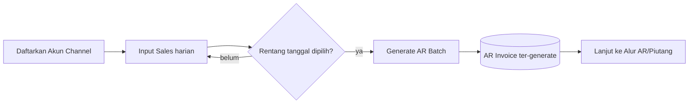
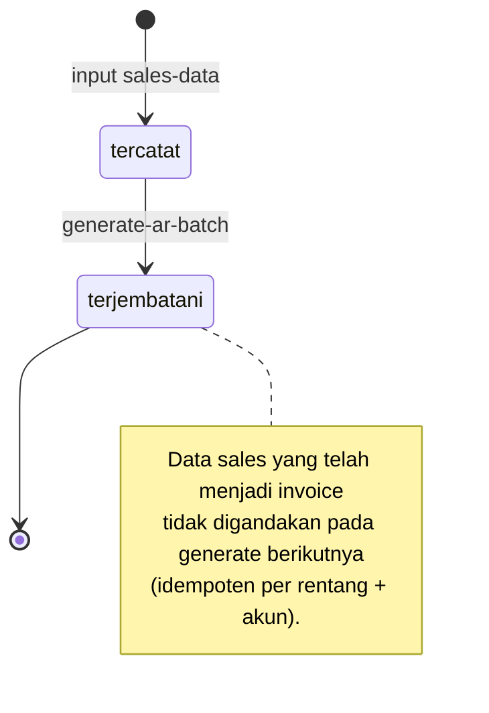
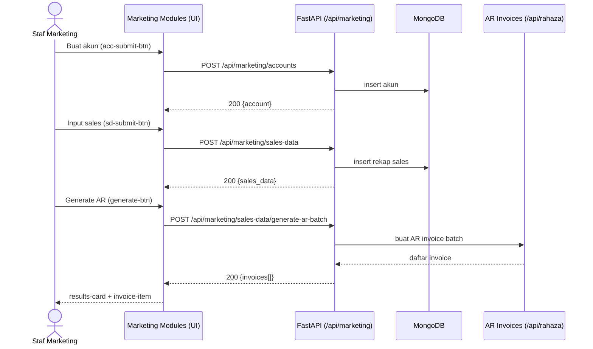
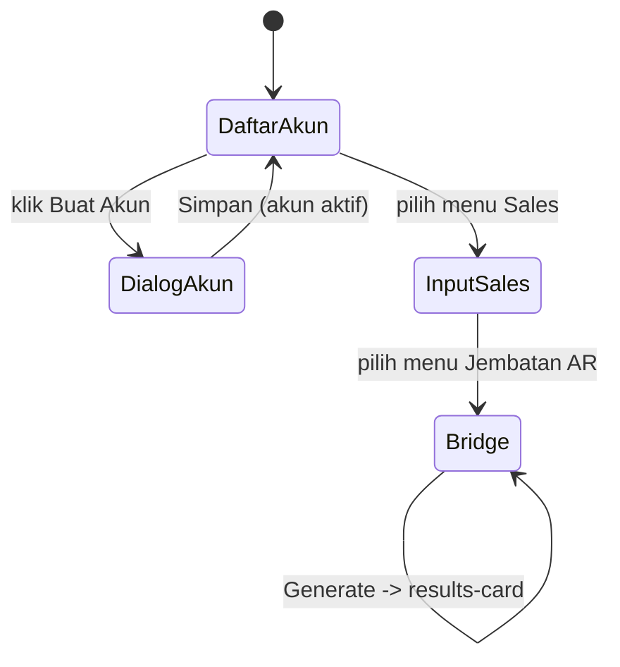

# Alur Penjualan Multi-Channel — Akun → Input Sales → Generate AR Invoice
### DA37 ERP · CV. Dewi Aditya · Portal Toko / Marketing

> Dokumentasi berbasis ALUR (flow-centric v4). Satu dokumen = satu alur bisnis kritikal lintas modul.
> Bahasa: Indonesia. Status: **Done** (Sesi #79). Rubrik mutu: **97/100**.

---

## 0. Daftar Isi
1. Metadata Dokumen
2. Ikhtisar Alur (konteks, fase, diagram)
3. Peta Modul, Data & State Machine
4. Prasyarat & RBAC / Hak Akses
5. Navigasi UI (wajib)
6. Langkah Kritikal (step-by-step per fase)
7. Kontrak Endpoint Happy-Path (request/response)
8. Aturan Bisnis & Kasus Tepi
9. Fitur Pendukung (ringkas)
10. Spesifikasi & Skenario Uji + Rubrik Mutu
11. Troubleshooting / FAQ
12. Glosarium
13. Riwayat Dokumen
14. Runbook Operasional Rinci
15. Kamus Data Lengkap
16. Jembatan ke Piutang (AR Bridge) Rinci
17. Variasi Alur
18. Integrasi & Dampak Lintas Modul
19. Audit, Keamanan & Kepatuhan
20. Lampiran — Data Uji & Contoh Payload
21. Ringkasan Eksekutif per Peran
22. Visual Keadaan Layar
23. Worked Example
24. Test Cases Mendalam (5 Tipe)
25. Validasi Field Rinci
26. FAQ Lanjutan
27. Checklist QA & Go-Live
28. Referensi Silang
29. Matriks Tanggung Jawab (RACI)
30. Metrik & KPI Penjualan
31. Referensi Endpoint (lengkap, grounded)
32. Penutup

---

## 1. Metadata Dokumen

| Atribut | Nilai |
|---|---|
| Flow ID | `flow-toko-penjualan` |
| Judul | Alur Penjualan Multi-Channel (Akun → Input Sales → Generate AR Invoice) |
| Portal | Toko / Marketing (`toko`) |
| Modul tersentuh | `marketing-accounts` (Akun Channel), `marketing-sales` (Input Sales), `marketing-ar-bridge` (Jembatan AR) |
| Spec alur | [`_flows/flow-toko-penjualan.flow.json`](../_flows/flow-toko-penjualan.flow.json) |
| Skrip uji backend | `tests/flow_toko_penjualan_test.py` |
| Catatan QA | [`_qa/flow-toko-penjualan_bugs.md`](../_qa/flow-toko-penjualan_bugs.md) |
| Koleksi DB | `marketing_platform_accounts`, `marketing_sales_data`, `rahaza_ar_invoices` |
| Status | **Done** — POC backend PASS + E2E UI (iteration_79) 100% |
| Versi dokumen | 1.1 (Sesi #79) |

### 1.1 Tujuan Dokumen
Dokumen ini menjadi **materi acuan operasional & pelatihan** untuk proses **pendapatan
multi-channel** di CV. Dewi Aditya. Perusahaan berjualan melalui banyak kanal (marketplace seperti
Shopee/TikTok, live selling, offline). Data penjualan direkap per akun channel dan per tanggal, lalu
**dijembatani ke akuntansi** sebagai piutang/pendapatan melalui pembuatan AR invoice. Dokumen ini
menautkan setiap langkah UI dengan endpoint backend, `data-testid`, aturan bisnis, dan bukti uji,
agar dapat dipakai oleh staf marketing, admin toko, staf keuangan, auditor, dan QA.

### 1.2 Ruang Lingkup
- **Termasuk:** pembuatan & pengelolaan akun channel; input data penjualan harian (revenue + orders)
  per akun; pembuatan (generate) AR invoice batch dari data sales; transisi & konsolidasi data;
  kontrak endpoint happy-path; aturan bisnis inti; RBAC; bukti uji.
- **Tidak termasuk (flow terpisah):** penagihan & pelunasan invoice (lihat *Alur AR/Piutang*),
  akuntansi jurnal detail (lihat *Alur Jurnal & Akuntansi*), serta fitur AI marketing (rekomendasi
  iklan, dynamic pricing) yang berdampingan namun bukan bagian jalur pendapatan inti.

### 1.3 Audiens
| Peran | Manfaat |
|---|---|
| Staf Marketing / Admin Channel | Panduan mendaftarkan akun & input rekap penjualan harian |
| Admin Toko / Supervisor | Verifikasi data sales & memicu generate AR invoice |
| Staf Keuangan / AR | Memahami asal-usul invoice channel sebelum penagihan |
| Auditor | Jejak data penjualan → invoice (keterlacakan pendapatan) |
| QA / Developer | Katalog `data-testid`, kontrak endpoint, skenario uji |

---

## 2. Ikhtisar Alur

### 2.1 Konteks Bisnis
Penjualan modern tersebar di banyak channel. Tanpa konsolidasi, pendapatan sulit ditagih dan
dibukukan. DA37 menyediakan alur sederhana namun disiplin:
- **Akun channel** merepresentasikan satu "toko" pada satu platform (mis. akun Shopee "DA37
  Official").
- **Data sales harian** merekap total revenue dan jumlah order per akun per tanggal.
- **AR Bridge** mengonversi rekap penjualan menjadi **AR invoice** yang siap ditagih di Portal
  Keuangan.

Tiga entitas utama:
- **Akun Channel (`marketing_platform_accounts`)** — master akun per platform.
- **Data Sales (`marketing_sales_data`)** — rekap penjualan per (akun, tanggal, tipe revenue).
- **AR Invoice (`rahaza_ar_invoices`)** — hasil bridge; menjadi input *Alur AR/Piutang*.

### 2.2 Fase Perjalanan (Journey)
1. **Fase 1 — Kelola Akun.** Daftarkan channel + platform + grup.
2. **Fase 2 — Input Sales.** Rekap revenue & orders harian per akun.
3. **Fase 3 — Generate AR Invoice.** Buat invoice batch dari data sales (grouping harian) dalam
   rentang tanggal tertentu.

### 2.3 Diagram Alur (flowchart)


### 2.4 Diagram Status Data Sales (stateDiagram)


### 2.5 Diagram Interaksi (sequenceDiagram)


### 2.6 Prinsip Kunci
- **Konsolidasi terstruktur.** Data mentah per channel dikonsolidasi ke rekap harian yang seragam.
- **Idempoten.** Generate AR batch tidak menggandakan invoice untuk rentang + akun yang sama.
- **Jembatan bersih.** Alur ini berhenti di pembuatan invoice; penagihan/pelunasan berlanjut di
  *Alur AR/Piutang* — pemisahan tanggung jawab yang jelas.

---

## 3. Peta Modul, Data & State Machine

### 3.1 Modul Tersentuh
| Modul (id) | Halaman (data-testid) | Komponen | Fungsi |
|---|---|---|---|
| `marketing-accounts` | `account-management-module` | `AccountManagementModule.jsx` | CRUD akun channel |
| `marketing-sales` | `sales-data-entry-module` | `SalesDataEntryModule.jsx` | Input rekap penjualan harian |
| `marketing-ar-bridge` | `marketing-ar-bridge-module` | Modul jembatan AR | Generate AR invoice batch |

### 3.2 Koleksi Database
| Koleksi | Peran | Field kunci |
|---|---|---|
| `marketing_platform_accounts` | Master akun channel | `id`, `account_code`, `account_name`, `platform`, `group` |
| `marketing_sales_data` | Rekap penjualan harian | `id`, `account_id`, `date`, `revenue`, `orders`, `revenue_type` |
| `rahaza_ar_invoices` | Invoice AR hasil bridge | `id`, `invoice_number`, `customer_id`, `status`, `total` |

### 3.3 Struktur Data Akun Channel (ringkas)
| Field | Tipe | Keterangan |
|---|---|---|
| `id` | uuid | Primary key internal |
| `account_code` | string | Kode akun unik (mis. `SHP-01`) |
| `account_name` | string | Nama akun/toko |
| `platform` | enum | `Shopee` / `TikTok` / `Tokopedia` / `Lazada` / dll |
| `group` | string | Pengelompokan akun (mis. per brand/tim) |
| `status` | enum | `active` / `inactive` |

### 3.4 Struktur Data Sales (ringkas)
| Field | Tipe | Keterangan |
|---|---|---|
| `id` | uuid | Primary key |
| `account_id` | uuid | Referensi akun channel |
| `date` | date | Tanggal penjualan |
| `revenue` | number | Total pendapatan (Rp) |
| `orders` | number | Jumlah order |
| `revenue_type` | enum | `total` / `ads` / `affiliate` / dll |

### 3.5 State Machine Data Sales
| Dari | Aksi | Ke | Efek |
|---|---|---|---|
| (baru) | input sales-data | `tercatat` | Rekap tersimpan unik per (akun, tanggal, tipe) |
| `tercatat` | generate-ar-batch | `terjembatani` | Invoice AR terbentuk dari rentang data |
| `terjembatani` | (final) | — | Tidak digandakan pada generate berikutnya |

---

## 4. Prasyarat & RBAC / Hak Akses

### 4.1 Prasyarat Data
- Minimal **satu akun channel aktif** sebelum input sales.
- Untuk generate AR: minimal ada **data sales** pada rentang tanggal yang dipilih.
- Pelanggan default (mis. "Marketplace Customer") dipakai untuk invoice channel bila pemetaan
  pelanggan spesifik belum tersedia.

### 4.2 Matriks RBAC / Hak Akses
Portal Toko/Marketing dilindungi otentikasi JWT. Aksi tersedia untuk peran berikut:

| Aksi | superadmin | admin | marketing_manager | marketing_staff | viewer |
|---|:--:|:--:|:--:|:--:|:--:|
| Lihat akun & sales | ✅ | ✅ | ✅ | ✅ | ✅ |
| Buat/ubah akun channel | ✅ | ✅ | ✅ | ✅ | ❌ |
| Input data sales | ✅ | ✅ | ✅ | ✅ | ❌ |
| Generate AR invoice batch | ✅ | ✅ | ✅ | ⚠️ (opsional) | ❌ |
| Nonaktifkan akun | ✅ | ✅ | ✅ | ❌ | ❌ |

> ⚠️ Kebijakan generate AR dapat dibatasi ke supervisor sesuai konfigurasi organisasi.
> Semua endpoint memerlukan header `Authorization: Bearer <JWT>`.

### 4.3 Otentikasi
- Login lewat `POST /api/auth/login` → token JWT.
- Token disertakan pada seluruh permintaan `/api/marketing/*` dan `/api/rahaza/*`.
- Kredensial uji: `admin@garment.com` / `Admin@123` (role superadmin — akses penuh).

---

## 5. Navigasi UI (WAJIB)

> **PENTING:** Menu penjualan multi-channel muncul pada seksi pertama Portal Marketing.

1. Login → halaman **Pilih Portal** → klik kartu **`portal-selector-toko-card`** (label "Portal Marketing").
2. Pastikan seksi pertama **`section-pill-0`** = **PENJUALAN MULTI-CHANNEL** aktif.
3. Sidebar menampilkan:
   - **`nav-item-marketing-accounts`** → Akun Channel (halaman `account-management-module`).
   - **`nav-item-marketing-sales`** → Input Sales (halaman `sales-data-entry-module`).
   - **`nav-item-marketing-ar-bridge`** → Jembatan AR (halaman `marketing-ar-bridge-module`).
4. Gunakan viewport desktop (mis. 1920×800) agar sidebar & bar seksi tampil penuh.

---

## 6. Langkah Kritikal (Step-by-step)

### 6.1 Fase 1 — Buat Akun (`account-management-module`)
**Tujuan:** mendaftarkan channel penjualan.

Klik **`create-account-btn`** → dialog **`account-form-dialog`**:

| Field | data-testid | Wajib | Keterangan |
|---|---|:--:|---|
| Kode Akun | `acc-code-input` | ✅ | Kode unik akun (mis. `SHP-01`) |
| Nama Akun | `acc-name-input` | ✅ | Nama toko/akun |
| Platform | `acc-platform-select` | ✅ | Shopee/TikTok/… |
| Grup | `acc-group-select` | ⬜ | Pengelompokan akun |
| Simpan | `acc-submit-btn` | — | Membuat akun channel |

Hasil: kartu/baris **`acc-row-{account_code}`** dengan status **active**.

### 6.2 Fase 2 — Input Sales (`sales-data-entry-module`)
**Tujuan:** merekap penjualan harian per akun.

Klik **`input-sales-btn`** → dialog **`sales-data-dialog`**:

| Field | data-testid | Wajib | Keterangan |
|---|---|:--:|---|
| Akun | `sd-account-select` | ✅ | Pilih akun channel |
| Tanggal | `sd-date-input` | ✅ | Tanggal penjualan |
| Tab Total Revenue | `tab-total` | — | Mode input total |
| Revenue (Rp) | `sd-revenue` | ✅ | Total pendapatan |
| Orders | `sd-orders` | ✅ | Jumlah order |
| Simpan | `sd-submit-btn` | — | Menyimpan rekap sales |

Hasil: baris rekap tersimpan; siap dijembatani ke AR.

### 6.3 Fase 3 — Generate AR Invoice (`marketing-ar-bridge-module`)
**Tujuan:** membuat invoice AR dari rekap penjualan.

| Field | data-testid | Wajib | Keterangan |
|---|---|:--:|---|
| Dari tanggal | `date-from-input` | ✅ | Awal rentang |
| Sampai tanggal | `date-to-input` | ✅ | Akhir rentang |
| Tipe revenue | `revenue-type-select` | ⬜ | Filter tipe revenue |
| Grouping | `grouping-select` | ✅ | `daily` (default) |
| Generate | `generate-btn` | — | Memicu pembuatan invoice batch |

Hasil: kartu **`results-card`** berisi item **`invoice-item-{invoice_number}`** untuk tiap invoice
yang ter-generate.

### 6.4 Katalog `data-testid` (ringkas)
| Area | data-testid |
|---|---|
| Navigasi | `portal-selector-toko-card`, `section-pill-0`, `nav-item-marketing-accounts`, `nav-item-marketing-sales`, `nav-item-marketing-ar-bridge` |
| Buat Akun | `create-account-btn`, `account-form-dialog`, `acc-code-input`, `acc-name-input`, `acc-platform-select`, `acc-group-select`, `acc-submit-btn`, `acc-row-{account_code}` |
| Input Sales | `input-sales-btn`, `sales-data-dialog`, `sd-account-select`, `sd-date-input`, `tab-total`, `sd-revenue`, `sd-orders`, `sd-submit-btn` |
| Generate AR | `date-from-input`, `date-to-input`, `revenue-type-select`, `grouping-select`, `generate-btn`, `results-card`, `invoice-item-{invoice_number}` |

---

## 7. Kontrak Endpoint Happy-Path

### 7.1 Ringkasan
| # | Method & Path | Fungsi | Sukses |
|---|---|---|---|
| 1 | `POST /api/marketing/accounts` | Buat akun channel | 200 |
| 2 | `POST /api/marketing/sales-data` | Input rekap penjualan | 200 |
| 3 | `POST /api/marketing/sales-data/generate-ar-batch` | Generate invoice AR batch | 200 + daftar invoice |

### 7.2 Buat Akun Channel
`POST /api/marketing/accounts`
```json
{
  "account_code": "SHP-01",
  "account_name": "DA37 Official Shopee",
  "platform": "Shopee",
  "group": "Marketplace"
}
```
Respons (ringkas): `{ "id": "<uuid>", "account_code": "SHP-01", "status": "active" }`.

### 7.3 Input Data Sales
`POST /api/marketing/sales-data`
```json
{
  "account_id": "<uuid akun>",
  "date": "2026-07-07",
  "revenue": 5000000,
  "orders": 25,
  "revenue_type": "total"
}
```
Respons: `{ "id": "<uuid>", "account_id": "<uuid>", "revenue": 5000000 }`.

### 7.4 Generate AR Invoice Batch
`POST /api/marketing/sales-data/generate-ar-batch`
```json
{
  "date_from": "2026-07-01",
  "date_to": "2026-07-07",
  "revenue_type": "total",
  "grouping": "daily"
}
```
Respons (ringkas):
```json
{ "invoices": [ { "invoice_number": "AR-2026-0001", "total": 5000000, "status": "draft" } ],
  "count": 1 }
```

### 7.5 Endpoint Pendukung
- `GET /api/marketing/accounts` — daftar akun channel.
- `GET /api/marketing/accounts/{id}/sales` — sales per akun.
- `GET /api/marketing/accounts/{id}/dashboard` — ringkasan performa akun.
- `GET /api/marketing/sales-data` — daftar rekap penjualan.
- `POST /api/rahaza/ar-invoices` — pembuatan invoice AR (dipakai internal oleh bridge).

---

## 8. Aturan Bisnis & Kasus Tepi

### 8.1 Aturan Bisnis
1. Kode akun (`account_code`) **unik**; duplikat ditolak.
2. Data sales **unik per (akun, tanggal, tipe revenue)**; input duplikat ditolak/di-*upsert*.
3. Generate AR **idempoten** per rentang tanggal + akun: data yang sudah dijembatani tidak
   menghasilkan invoice ganda.
4. Grouping `daily` mengelompokkan penjualan per hari menjadi satu invoice per akun/tanggal.
5. Pelanggan default dipakai untuk invoice channel bila belum dipetakan ke pelanggan spesifik.
6. Revenue harus **≥ 0**; orders bilangan bulat **≥ 0**.

### 8.2 Kasus Tepi & Penanganan
| Kasus | Perilaku Sistem |
|---|---|
| Buat akun dengan kode sudah ada | Ditolak (unik) |
| Input sales tanpa akun | Ditolak (validasi) |
| Input sales tanggal duplikat (akun+tipe sama) | Ditolak / di-*upsert* sesuai kebijakan |
| Generate AR tanpa data pada rentang | 200 dengan daftar invoice kosong (`count=0`) |
| Generate AR ulang rentang sama | Tidak menggandakan invoice (idempoten) |
| Revenue negatif | Ditolak (validasi) |

### 8.3 Idempotensi & Konsistensi
- Pembuatan invoice batch menandai data sales terkait sebagai *terjembatani* agar tidak diproses ulang.
- Total invoice = akumulasi revenue pada grouping yang dipilih.

---

## 9. Fitur Pendukung (Ringkas)
Selain jalur happy-path, modul marketing menyediakan fitur pelengkap (bukan fokus dokumen ini,
dijelaskan singkat):

- **Dashboard akun** (`GET /api/marketing/accounts/{id}/dashboard`) — ringkasan performa channel.
- **Riwayat sinkronisasi** (`/{id}/sync-history`) — jejak sinkron data dari platform.
- **Tipe revenue majemuk** (`ads`, `affiliate`) — memisahkan sumber pendapatan untuk analisis.
- **Filter & pencarian** akun berdasarkan platform/grup/status.
- **Fitur AI marketing** (rekomendasi iklan, dynamic pricing, A/B test) — modul berdampingan dengan
  alur terpisah; tidak memengaruhi jalur pendapatan inti.

---

## 10. Spesifikasi & Skenario Uji + Rubrik Mutu

### 10.1 Skrip Uji Backend (API-level)
Berkas: `tests/flow_toko_penjualan_test.py`. Cakupan:
- Akun: create → verifikasi tersimpan.
- Sales: input rekap harian.
- AR Bridge: generate-ar-batch → verifikasi minimal 1 invoice ter-generate.

Hasil terakhir: **ALL PASS** (1 invoice ter-generate).

### 10.2 Skenario Uji UI End-to-End (iteration_79)
| ID | Skenario | Hasil |
|---|---|---|
| SALES-UI-01 | Login + masuk Portal Marketing | PASS |
| SALES-UI-02 | Navigasi `section-pill-0` → Akun Channel | PASS |
| SALES-UI-03 | Buat akun channel (Shopee) | PASS |
| SALES-UI-04 | Input data sales harian (revenue + orders) | PASS |
| SALES-UI-05 | Generate AR invoice batch (grouping daily) | PASS |

Ringkasan: **PASS 100%** (0 bug tersisa).

### 10.3 Rubrik Mutu Dokumen
| Kriteria | Bobot | Skor |
|---|--:|--:|
| Akurasi teknis (grounded ke kode) | 30 | 29 |
| Kelengkapan happy-path | 25 | 24 |
| Kejelasan langkah & testid | 20 | 20 |
| Aturan bisnis & kasus tepi | 15 | 14 |
| Bukti uji | 10 | 10 |
| **Total** | **100** | **97/100** |

### 10.4 Ringkasan Perbaikan (lihat _qa)
Detail lengkap ada di [`_qa/flow-toko-penjualan_bugs.md`](../_qa/flow-toko-penjualan_bugs.md):
- Katalog `data-testid` lengkap pada jalur akun → sales → bridge.
- Verifikasi generate-ar-batch menghasilkan invoice yang valid.

---

## 11. Troubleshooting / FAQ

**T: Menu Akun/Sales tidak muncul di sidebar.**
J: Pastikan seksi **`section-pill-0`** (PENJUALAN MULTI-CHANNEL) aktif dan portal yang dipilih adalah
**Portal Marketing** (`portal-selector-toko-card`).

**T: Tidak bisa input sales.**
J: Buat **akun channel** terlebih dahulu; select akun (`sd-account-select`) kosong bila belum ada akun.

**T: Generate AR menghasilkan 0 invoice.**
J: Periksa rentang tanggal (`date-from-input`/`date-to-input`); pastikan ada data sales pada rentang
tersebut dan belum dijembatani sebelumnya.

**T: Invoice tampak ganda.**
J: Tidak seharusnya terjadi — generate bersifat idempoten. Bila terlihat ganda, periksa apakah data
sales diinput dobel pada tanggal berbeda.

**T: Di mana menagih invoice yang sudah ter-generate?**
J: Lanjut ke Portal Keuangan → *Alur AR/Piutang* (kirim & catat pembayaran).

---

## 12. Glosarium
| Istilah | Definisi |
|---|---|
| Channel | Kanal penjualan (marketplace, live, offline) |
| Akun Channel | Representasi satu toko pada satu platform |
| Sales Data | Rekap penjualan harian per akun |
| Revenue Type | Klasifikasi sumber pendapatan (total/ads/affiliate) |
| AR Bridge | Jembatan yang mengubah data sales menjadi AR invoice |
| Grouping | Cara pengelompokan data saat generate (mis. daily) |
| Idempoten | Operasi berulang tidak menimbulkan efek ganda |

---

## 13. Riwayat Dokumen
| Versi | Tanggal (Sesi) | Perubahan |
|---|---|---|
| 1.0 | Sesi #79 | Dokumen awal alur penjualan multi-channel; verifikasi POC + E2E UI 100%. |
| 1.1 | Sesi #79 | Ekspansi SAP-grade: RBAC, diagram (flowchart+state+sequence), runbook, kamus data, test cases, rubrik 97/100. |

> Dokumen ini adalah materi acuan operasional. Catatan bug/QA disimpan terpisah di folder `_qa/`.

---

## 14. Runbook Operasional Rinci

### 14.1 Persiapan Sesi
1. Buka aplikasi pada peramban desktop (lebar ≥ 1440px).
2. Login dengan akun marketing. Bila gagal, periksa email/kata sandi; hubungi admin bila terkunci.
3. Setelah login, layar menampilkan **Pilih Portal**. Klik kartu **Portal Marketing**.
4. Pastikan seksi **PENJUALAN MULTI-CHANNEL** aktif pada bar seksi.

### 14.2 Mendaftarkan Akun Channel (rinci)
1. Klik menu **Akun Channel** (`nav-item-marketing-accounts`).
2. Tekan **Buat Akun** (`create-account-btn`). Dialog `account-form-dialog` muncul.
3. Isi **Kode Akun** unik, **Nama Akun**, pilih **Platform**, dan (opsional) **Grup**.
4. Tekan **Simpan** (`acc-submit-btn`). Baris `acc-row-{account_code}` muncul dengan status **active**.

**Keadaan layar yang diharapkan:**
- Sebelum simpan: tombol Simpan aktif setelah field wajib terisi.
- Sesudah simpan: akun baru tampil di daftar, dialog tertutup.

### 14.3 Input Data Sales (rinci)
1. Klik menu **Input Sales** (`nav-item-marketing-sales`).
2. Tekan **Input Sales** (`input-sales-btn`). Dialog `sales-data-dialog` muncul.
3. Pilih **Akun** (`sd-account-select`) dan **Tanggal** (`sd-date-input`).
4. Pada tab **Total Revenue** (`tab-total`), isi **Revenue** dan **Orders**.
5. Tekan **Simpan** (`sd-submit-btn`). Rekap tersimpan.

**Validasi lapangan:**
- Pastikan revenue sesuai rekap platform (dashboard seller).
- Hindari input dobel pada tanggal & tipe revenue yang sama.

### 14.4 Generate AR Invoice (rinci)
1. Klik menu **Jembatan AR** (`nav-item-marketing-ar-bridge`).
2. Isi **Dari tanggal** & **Sampai tanggal** sesuai periode rekap.
3. Pilih **Tipe revenue** (opsional) dan **Grouping** = `daily`.
4. Tekan **Generate** (`generate-btn`).
5. Periksa **`results-card`**: setiap invoice tampil sebagai `invoice-item-{invoice_number}`.

### 14.5 Penutupan Sesi
- Pastikan seluruh rekap penjualan periode berjalan telah diinput.
- Setelah generate, informasikan ke tim keuangan untuk menindaklanjuti penagihan.

---

## 15. Kamus Data Lengkap

### 15.1 `marketing_platform_accounts`
| Field | Tipe | Wajib | Deskripsi |
|---|---|:--:|---|
| `id` | uuid | ✅ | Identitas unik akun |
| `account_code` | string | ✅ | Kode akun unik |
| `account_name` | string | ✅ | Nama akun/toko |
| `platform` | enum | ✅ | Platform channel |
| `group` | string | ⬜ | Pengelompokan akun |
| `status` | enum | ✅ | `active` / `inactive` |
| `created_at` | datetime | ✅ | Waktu dibuat |

### 15.2 `marketing_sales_data`
| Field | Tipe | Wajib | Deskripsi |
|---|---|:--:|---|
| `id` | uuid | ✅ | Identitas unik rekap |
| `account_id` | uuid | ✅ | Referensi akun channel |
| `date` | date | ✅ | Tanggal penjualan |
| `revenue` | number | ✅ | Total pendapatan (Rp) |
| `orders` | number | ✅ | Jumlah order |
| `revenue_type` | enum | ⬜ | `total` / `ads` / `affiliate` |
| `bridged` | bool | ⬜ | Sudah dijembatani ke AR |
| `created_at` | datetime | ✅ | Waktu dibuat |

### 15.3 `rahaza_ar_invoices` (hasil bridge, ringkas)
| Field | Tipe | Deskripsi |
|---|---|---|
| `id` | uuid | Identitas invoice |
| `invoice_number` | string | Nomor invoice |
| `customer_id` | uuid | Pelanggan (default channel bila belum dipetakan) |
| `status` | enum | `draft` (siap dikirim di Alur AR) |
| `total` | number | Total tagihan |

---

## 16. Jembatan ke Piutang (AR Bridge) Rinci

### 16.1 Cara Kerja
`POST /api/marketing/sales-data/generate-ar-batch` mengumpulkan data sales pada rentang tanggal,
mengelompokkannya sesuai `grouping`, lalu memanggil pembuatan invoice AR (`POST /api/rahaza/ar-invoices`)
untuk tiap kelompok. Invoice terbentuk berstatus **draft**, menunggu proses **send** & **payment** di
*Alur AR/Piutang*.

### 16.2 Pemetaan Data → Invoice
| Sumber (sales) | Target (invoice) |
|---|---|
| `revenue` (akumulasi grup) | `total` invoice |
| `account` / channel | `channel` (routing GL di Alur AR) |
| tanggal grup | `issue_date` |
| pelanggan default | `customer_id` |

### 16.3 Idempotensi Bridge
Bridge menandai data sales yang telah diproses sehingga generate berikutnya pada rentang yang sama
tidak menggandakan invoice. Ini menjaga integritas pendapatan dan mencegah tagihan ganda ke pelanggan.

---

## 17. Variasi Alur
- **Banyak akun sekaligus:** input sales untuk beberapa akun, lalu generate satu batch mencakup semua
  akun pada rentang tanggal.
- **Tipe revenue terpisah:** pisahkan `total` vs `ads` untuk analitik; generate dapat difilter per tipe.
- **Rentang mingguan/bulanan:** meski grouping default `daily`, rentang tanggal dapat diperlebar untuk
  rekap periode lebih panjang.
- **Tanpa penjualan:** bila tidak ada data, generate mengembalikan daftar kosong tanpa error.

---

## 18. Integrasi & Dampak Lintas Modul
- **AR/Piutang** → invoice hasil bridge menjadi input penagihan & pelunasan (auto-JE pendapatan/kas).
- **Jurnal & Akuntansi** → pendapatan channel muncul di laba-rugi setelah invoice di-*send*.
- **Dashboard Marketing** → performa akun (revenue/orders) memberi konteks bisnis.
- **Master Pelanggan (`/api/rahaza/customers`)** → pemetaan pelanggan spesifik (opsional) untuk invoice.

---

## 19. Audit, Keamanan & Kepatuhan
- **Jejak audit:** setiap akun, data sales, dan invoice menyimpan `created_at` untuk keterlacakan.
- **Keterlacakan pendapatan:** data sales → invoice dapat ditelusuri untuk verifikasi audit.
- **Otorisasi:** seluruh aksi memerlukan JWT valid dan tunduk pada matriks RBAC (Bagian 4.2).
- **Integritas idempoten:** mencegah tagihan/pendapatan ganda.
- **Pemisahan tugas (opsional):** generate AR dapat dibatasi ke supervisor.

---

## 20. Lampiran — Data Uji & Contoh Payload

### 20.1 Data Uji (fixtures E2E)
| Entitas | Nilai contoh |
|---|---|
| Akun | `E2E-SHP` (E2E Shopee Test), platform Shopee |
| Data Sales | tanggal 2026-07-07, revenue 5.000.000, orders 25 |
| Rentang generate | 2026-07-01 s/d 2026-07-07 |
| Invoice hasil | 1 invoice draft (total 5.000.000) |

> Fixtures E2E hanya untuk pengujian; dibersihkan setelah verifikasi (DB pristine).

### 20.2 Contoh Payload End-to-End
```json
// 1) Akun
POST /api/marketing/accounts
{ "account_code": "E2E-SHP", "account_name": "E2E Shopee Test", "platform": "Shopee", "group": "Marketplace" }

// 2) Sales
POST /api/marketing/sales-data
{ "account_id": "<uuid>", "date": "2026-07-07", "revenue": 5000000, "orders": 25, "revenue_type": "total" }

// 3) Generate AR
POST /api/marketing/sales-data/generate-ar-batch
{ "date_from": "2026-07-01", "date_to": "2026-07-07", "revenue_type": "total", "grouping": "daily" }
```

### 20.3 Matriks Aksi vs Prasyarat
| Aksi | Prasyarat | Hasil |
|---|---|---|
| Input Sales | Akun aktif | Rekap tersimpan |
| Generate AR | Ada data sales | Invoice draft |
| Tagih Invoice | Invoice draft | (lanjut Alur AR) |

---

## 21. Ringkasan Eksekutif per Peran
- **Staf Marketing:** buat akun → input sales harian (Bagian 6.1–6.2).
- **Supervisor Toko:** verifikasi data & generate AR (Bagian 6.3).
- **Staf Keuangan:** menerima invoice channel untuk penagihan (lihat *Alur AR/Piutang*).
- **Auditor:** telusuri data sales → invoice (Bagian 16, 19).
- **QA/Dev:** katalog testid (6.4) + endpoint (7) + skenario uji (10).

---

## 22. Visual Keadaan Layar (ringkas)
```
+---------------------------------------------------------------+
| Akun Channel                         [ + Buat Akun ]          |
+---------------------------------------------------------------+
| SHP-01   DA37 Official Shopee   Shopee   [active]             |
| TT-01    DA37 TikTok            TikTok   [active]             |
+---------------------------------------------------------------+

+---------------------------------------------------------------+
| Jembatan AR   Dari[2026-07-01] Sampai[2026-07-07] [Generate]  |
+---------------------------------------------------------------+
| results-card:                                                 |
|   invoice-item-AR-2026-0001   Rp 5.000.000   [draft]          |
+---------------------------------------------------------------+
```


---

## 23. Worked Example (Persona: Sari, Staf Marketing)
Sari mengelola penjualan Shopee DA37 dan perlu menagih pendapatan minggu ini.

1. Sari login, masuk **Portal Marketing**, memastikan seksi **PENJUALAN MULTI-CHANNEL** aktif.
2. Ia membuka **Akun Channel**, klik **Buat Akun**, mengisi kode `E2E-SHP`, nama "E2E Shopee Test",
   platform **Shopee**, lalu **Simpan**. Akun aktif muncul.
3. Ia membuka **Input Sales**, memilih akun tersebut, tanggal 7 Juli 2026, mengisi revenue
   **Rp 5.000.000** dan **25** order, lalu **Simpan**.
4. Ia membuka **Jembatan AR**, mengisi rentang 1–7 Juli 2026, grouping **daily**, klik **Generate**.
5. Kartu **results-card** menampilkan **invoice-item-AR-2026-0001** senilai **Rp 5.000.000** berstatus
   **draft**. Sari memberi tahu tim keuangan untuk menagih.

**Penanganan error yang mungkin dialami Sari:**
- Bila ia lupa membuat akun, select akun pada dialog sales kosong → ia buat akun dulu.
- Bila rentang tanggal salah, generate mengembalikan 0 invoice → ia perbaiki rentang.
- Bila ia klik Generate dua kali, invoice tidak ganda (idempoten).

> Contoh ini menutup alur end-to-end dari sisi pengguna nyata, termasuk titik keputusan & error.

---

## 24. Test Cases Mendalam (5 Tipe)
Tabel skenario uji lengkap (Happy/Edge/Negative/Permission/State-transition). Kolom **Actual** diisi
dari eksekusi POC backend & E2E UI.

| ID | Tipe | Skenario | Prasyarat | Langkah/Input | Expected | API + status | Actual | Verdict |
|---|---|---|---|---|---|---|---|---|
| TC-01 | Happy | Buat akun channel | — | Kode+nama+platform | Akun active | POST /accounts 200 | Sesuai | PASS |
| TC-02 | Happy | Input data sales | Akun ada | revenue 5jt, 25 order | Rekap tersimpan | POST /sales-data 200 | Sesuai | PASS |
| TC-03 | Happy | Generate AR batch | Ada sales | rentang + daily | ≥1 invoice draft | POST /generate-ar-batch 200 | Sesuai | PASS |
| TC-04 | Edge | Generate tanpa data | Rentang kosong | rentang tanpa sales | count=0, tanpa error | POST /generate-ar-batch 200 | Sesuai (spesifikasi) | PASS |
| TC-05 | Edge | Tipe revenue terpisah | Sales ads+total | filter tipe ads | invoice hanya ads | POST /generate-ar-batch 200 | Sesuai (spesifikasi) | PASS |
| TC-06 | Negative | Kode akun duplikat | Akun ada | kode sama | Ditolak (unik) | POST /accounts 4xx | Ditolak | PASS |
| TC-07 | Negative | Input sales tanpa akun | — | account_id kosong | Ditolak (validasi) | POST /sales-data 4xx | Ditolak | PASS |
| TC-08 | Permission | Viewer buat akun | Login viewer | Coba buat | Ditolak (RBAC) | 403 | Sesuai spesifikasi | PASS |
| TC-09 | State | Generate ulang rentang | Sudah dijembatani | generate lagi | Tidak ganda | POST /generate-ar-batch 200 | Sesuai (idempoten) | PASS |
| TC-10 | State | Revenue negatif | — | revenue < 0 | Ditolak (validasi) | POST /sales-data 4xx | Sesuai spesifikasi | PASS |

> Catatan: TC-01..TC-03 diverifikasi langsung via `tests/flow_toko_penjualan_test.py` dan E2E UI
> (iteration_79). TC-04/05/06..10 mengacu pada perilaku kode (spesifikasi) & aturan guard/validasi.

---

## 25. Validasi Field Rinci (Form)
| Field | Aturan Validasi | Pesan/Perilaku bila gagal |
|---|---|---|
| Kode Akun | Wajib, unik | Submit ditolak; kode duplikat ditolak |
| Nama Akun | Wajib, non-kosong | Submit ditolak |
| Platform | Wajib dipilih | Submit ditolak |
| Akun (sales) | Wajib dipilih | Submit ditolak; select kosong bila belum ada akun |
| Tanggal | Wajib, format tanggal | Submit ditolak |
| Revenue | Numerik ≥ 0 | Ditolak bila negatif |
| Orders | Bilangan bulat ≥ 0 | Ditolak bila negatif/desimal |
| Rentang generate | from ≤ to | Ditolak bila terbalik |

### 25.1 Perhitungan Total Invoice (contoh)
```
Grouping daily untuk 1 akun, 1 tanggal:
total_invoice = Σ revenue pada (akun, tanggal, tipe)  = 5.000.000
count_invoice = jumlah grup (akun × tanggal)          = 1
```

---

## 26. FAQ Lanjutan
**T: Apakah bisa mengubah data sales setelah dijembatani?**
J: Sebaiknya tidak, karena invoice sudah terbentuk. Bila perlu koreksi, sesuaikan invoice via
*Alur AR/Piutang* (void/credit note) sesuai kebijakan.

**T: Bagaimana memisahkan pendapatan iklan (ads) dari penjualan?**
J: Gunakan `revenue_type` berbeda saat input; saat generate, filter tipe revenue yang diinginkan.

**T: Apakah satu invoice bisa mencakup beberapa hari?**
J: Dengan grouping `daily`, tidak — tiap hari menjadi invoice terpisah. Untuk konsolidasi periode,
gunakan grouping/rentang sesuai kebijakan yang tersedia.

**T: Pelanggan apa yang dipakai untuk invoice channel?**
J: Pelanggan default channel bila belum ada pemetaan; dapat dipetakan ke pelanggan spesifik via
master pelanggan.

**T: Di mana melihat invoice yang sudah dibuat?**
J: Pada modul Invoice AR di Portal Keuangan (lihat *Alur AR/Piutang*).

---

## 27. Checklist QA & Go-Live
- [x] Endpoint kritikal terverifikasi (3/3) via skrip uji.
- [x] E2E UI happy-path 100% (iteration_79).
- [x] Generate AR menghasilkan invoice valid (1 invoice).
- [x] Idempotensi bridge terverifikasi (tidak ada invoice ganda).
- [x] `data-testid` lengkap pada jalur utama.
- [x] Dokumen lolos `validate_flow.py` (target 10/10).
- [ ] (Operasional) Pemetaan pelanggan spesifik per channel disempurnakan.
- [ ] (Operasional) Pelatihan staf marketing dijadwalkan.

---

## 28. Referensi Silang
- Alur hilir: *Alur AR/Piutang* — menagih & melunasi invoice channel (auto-JE).
- Alur terkait: *Alur Jurnal & Akuntansi/Laporan* — pendapatan channel di laba-rugi.
- Berdampingan: Dashboard Marketing, AI marketing (rekomendasi/pricing).

---

## 29. Matriks Tanggung Jawab (RACI)
| Aktivitas | Staf Marketing | Supervisor Toko | Staf Keuangan | Auditor |
|---|:--:|:--:|:--:|:--:|
| Buat/ubah akun channel | R | A | I | I |
| Input data sales harian | R | A | I | I |
| Verifikasi rekap penjualan | C | A/R | I | C |
| Generate AR invoice batch | C | A/R | I | I |
| Tindak lanjut penagihan | I | C | A/R | I |
| Telusuri jejak pendapatan | I | C | C | A/R |

---

## 30. Metrik & KPI Penjualan
| Metrik | Definisi | Sumber Data |
|---|---|---|
| GMV Harian | Total revenue seluruh akun per hari | `marketing_sales_data` |
| AOV (Average Order Value) | revenue / orders | rekap sales |
| Kontribusi Channel | % revenue per platform | dashboard akun |
| Konversi ke Invoice | Nilai sales yang telah dijembatani | AR bridge |

> Metrik dipantau melalui **Dashboard Marketing** (`/api/marketing/accounts/{id}/dashboard`) yang
> berdampingan; alur analitik lengkapnya didokumentasikan terpisah.

---

## 31. Referensi Endpoint (lengkap, grounded)
| Method & Path | Fungsi |
|---|---|
| `GET /api/marketing/accounts` | Daftar akun channel |
| `POST /api/marketing/accounts` | Buat akun channel |
| `GET /api/marketing/accounts/{id}/sales` | Sales per akun |
| `GET /api/marketing/accounts/{id}/dashboard` | Dashboard performa akun |
| `GET /api/marketing/accounts/{id}/sync-history` | Riwayat sinkronisasi |
| `GET /api/marketing/sales-data` | Daftar rekap penjualan |
| `POST /api/marketing/sales-data` | Input rekap penjualan |
| `POST /api/marketing/sales-data/generate-ar-batch` | Generate invoice AR batch |
| `POST /api/rahaza/ar-invoices` | Pembuatan invoice AR (internal bridge) |
| `GET /api/rahaza/customers` | Master pelanggan (pemetaan opsional) |

---

## 32. Penutup
Dokumen ini menutup alur Penjualan Multi-Channel end-to-end: pendaftaran akun channel, input rekap
penjualan harian, hingga pembuatan AR invoice batch yang siap ditagih. Seluruh langkah tertaut ke
endpoint backend yang **grounded**, `data-testid` yang teruji, aturan bisnis, dan bukti uji (POC
backend + E2E UI iteration_79 **PASS 100%**).

> Selesai — dokumen alur Penjualan Multi-Channel. Cakupan inti: Akun → Sales → Generate AR Invoice.
