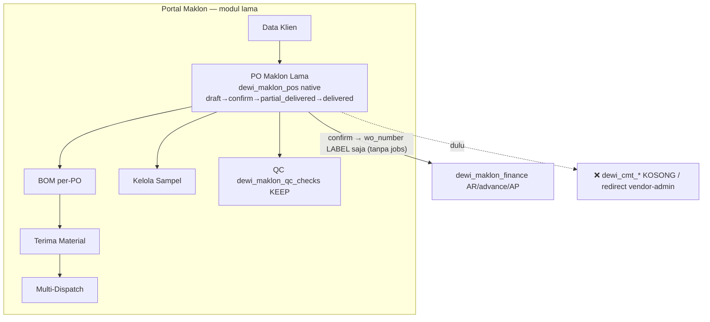

# MAKLON — PETA FLOW & PERCABANGAN LENGKAP (lintas-portal) untuk keputusan konsolidasi
> Dibuat sesi lanjutan (fresh clone). Trace forensik GROUNDED ke kode nyata.
> File sumber: `routes/production_pos.py`, `routes/production_execution.py`,
> `routes/production_maklon_bridge.py`, `routes/vendor_shipment.py`, `routes/buyer_shipment.py`,
> `routes/dewi_maklon_pos.py`, `routes/dewi_maklon_finance.py`, `routes/dewi_maklon.py`,
> `routes/dewi_cmt_lifecycle.py`, `routes/dewi_cmt_packing.py`, `routes/vendor_portal.py`,
> `engine/ProductionPOModule.jsx`, `engine/VendorPortalApp.jsx`, `vendor-cmt/VendorCMTEnginePortal.jsx`,
> `MaklonPOModule.jsx`, `moduleRegistry.js`. Analisis: `PRODUKSI_E1-E9_RECAP.md`, `E10`, `E11`.

## 0. GAMBARAN BESAR — ADA 2 "DUNIA", ENGINE SUDAH MENANG
- **DUNIA A (ENGINE / SOMMERVILLE)** = *pengembangan baru*, AKTIF & kanonik. Dipakai bersama oleh
  **Portal Produksi + Portal Maklon + Portal CMT Vendor**. Koleksi inti: `production_pos → production_jobs
  → production_progress`, dgn `vendor_shipments` (kirim material) & `buyer_shipments` (dispatch buyer).
- **DUNIA B (LEGACY dewi_maklon)** = sistem maklon lama. Mesin produksinya (`rahaza_work_orders` multi-stage)
  sudah **DIHAPUS (E10)**; eksekusi CMT-nya (`dewi_cmt_*`) sudah **KOSONG** (registry: `prod-cmt`/`cmt-lifecycle`
  → `makeRedirect('vendor-admin')`, komentar "dewi_cmt_* kosong"). Yang tersisa hidup: **PO record + BOM +
  material-receive + multi-dispatch + QC(`dewi_maklon_qc_checks`) + Finance AR/AP**.

> Kesimpulan: yang "lama" sudah dikuliti separuh — tinggal cangkang PO + finance/QC. Eksekusi produksi & CMT
> **nyata** semuanya lewat ENGINE.

---

## 1. DIAGRAM LINTAS-PORTAL — DUNIA A (ENGINE, jalur nyata Maklon)
```mermaid
flowchart TD
  subgraph MKT[Portal Marketing]
    KAT[Katalog / Demand] -- "CTA 'Buat PO Produksi' (MKT-1=B)" --> POE
  end
  subgraph MAK[Portal Maklon]
    POE["PO Maklon (ENGINE)\nproduction_pos business_type=maklon\nDraft→Confirmed→Distributed→In Production→\nProduction Complete→Ready to Close→Closed"]
    KMV["Kirim Material CMT\nEngineVendorShipmentModule → vendor_shipments"]
    DBC["Dispatch Buyer CMT\nEngineBuyerShipmentModule → buyer_shipments"]
  end
  subgraph BRG[Bridge + Finance]
    MIR["dewi_maklon_pos (dokumen mirror_of='production_pos')"]
    AR["dewi_maklon_finance — Draft AR Invoice"]
  end
  subgraph GDG[Portal Gudang / WMS]
    VS["vendor_shipments (material klien ke vendor)"]
    FGR["cmt_receipts / rahaza_fg_movements (terima FG)"]
  end
  subgraph CMT[Portal CMT Vendor  (/vendor-cmt → VendorPortalApp)]
    R[Receiving] --> INS[Inspection] --> JOB[Production Jobs] --> PRG[Progress guard I-1] --> DEF[Defect]
    PRG --> BS[Buyer Shipments]
    JOB --> BS
    PRG --> VAR[Variance/Serial]
  end
  POE -- "Confirmed → sync_po_to_maklon_finance()" --> MIR
  MIR --> AR
  POE --> KMV --> VS --> R
  BS --> DBC
  DBC -- "qty_dispatched mirror balik" --> MIR
  BS --> FGR
```

**Urutan langkah (per endpoint):**
1. `POST /api/production-pos` (business_type=maklon). *(Maklon → "PO Maklon")*
2. **Confirmed** → `sync_po_to_maklon_finance()`: upsert `dewi_maklon_pos` (mirror) + Draft AR di `dewi_maklon_finance`.
3. `POST /api/vendor-shipments` — kirim material klien ke vendor CMT. *(Maklon "Kirim Material CMT" / Gudang)*
4. Vendor **Receiving**→`Received`; **Inspection** (`vendor_material_inspections`). *(Portal CMT)*
5. `POST /api/production-jobs` (dari shipment Received+Inspected) → `production_jobs`(+items). *(Portal CMT)*
6. `POST /api/production-progress` (guard I-1). *(Portal CMT)*
7. Defect `material_defect_reports`. *(Portal CMT)*
8. `POST /api/buyer-shipments` (+dispatch) → FG ke buyer. *(Maklon "Dispatch Buyer CMT" / CMT)*
9. Bridge mirror `qty_dispatched` balik ke `dewi_maklon_pos`; AR maju.

---

## 2. DIAGRAM — DUNIA B (LEGACY dewi_maklon)

> `confirm_maklon_po()` sejak E10 hanya generate `wo_number` label + Draft AR. Tidak insert
> `rahaza_work_orders` / `production_jobs` → PO baru di sini tak masuk pipeline engine.

---

## 3. TITIK KONVERGEN
| Titik temu | Koleksi | Ditulis oleh |
|---|---|---|
| Catatan PO | `dewi_maklon_pos` | native (lama) + mirror (bridge engine) |
| Finance AR/AP | `dewi_maklon_finance` | bridge engine + modul lama (SATU sumber) |
| Master vendor | `vendor_partners` | vendor-admin (lintas) |
| QC | `dewi_maklon_qc_checks` | dipertahankan (QC-1=B) |

---

## 4. HUBUNGAN PORTAL PRODUKSI (engine sama, beda business_type)
| Aspek | internal (Produksi) | maklon (Maklon) |
|---|---|---|
| Costing/GL | `rahaza_posting` WIP→FG→COGS | tidak COGS; AR jasa CMT via dewi finance |
| Kepemilikan FG | milik DA (masuk stok) | milik klien (tak masuk stok/COGS) |
| Vendor/CMT | vendor_shipments+production_jobs | sama |
| Bridge finance | — | production_maklon_bridge → dewi finance |

## 5. PORTAL CMT VENDOR
`/vendor-cmt` → `VendorCMTEnginePortal` (login `cmt_vendor`) → `engine/VendorPortalApp`. Semua tab = engine:
Receiving/Inspeksi/Material-Requests/Jobs/Progress/Defect/Buyer-Shipments/Serial/Variance/Reminders.
Admin sisi Maklon: `vendor-admin` (vendor_partners+akun+jobs). Legacy `dewi_cmt_*` = kosong (redirect).

## 6. RISIKO
- R1 dua pintu satu koleksi `dewi_maklon_pos` → potensi drift.
- R2 fitur asli lama (Seri/multi-dispatch/BOM/terima-material) belum penuh di engine (E11 PARSIAL/GAP).
- R3 modul lama = cangkang produksi (buat PO tak hasilkan jobs).
- R4 data: engine 2 PO, lama 11 PO; dashboard baca mayoritas dari lama/mirror.

## 7. OPSI KEPUTUSAN
1. Konsolidasi penuh ke ENGINE (port fitur GAP dulu) — risiko sedang.
2. Bagi peran: engine=create+produksi+CMT; lama=read-only/arsip — risiko rendah (REKOMENDASI).
3. Status quo + label jelas — R1 tetap.
